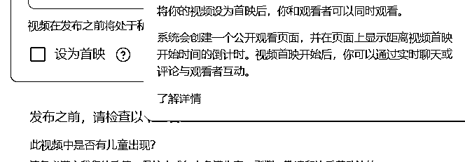

# 关于做 YouTube 要掌握的认知——提升时长

> 原文：[`www.yuque.com/for_lazy/zhoubao/hw1ws2kldkw4khi1`](https://www.yuque.com/for_lazy/zhoubao/hw1ws2kldkw4khi1)

## (5 赞)关于做 YouTube 要掌握的认知——提升时长

作者： 书情小跟班

日期：2024-11-26

YouTube 官方目前为了对抗 TikTok 用用户争夺，把流量倾斜到 Shorts，这是事实，那么想要在 YouTube 上赚钱，那么 Shorts 是获取流量的好时机。

套路是通过 Shorts 从 YouTube 平台公域获得流量，获得订阅数，再通过首映的方式把时长拉上去。

这里为什么提首映？这是一个很多小白忽略的点，首映对于订阅你的观众是强提醒，这一点非常重要，在首映开始前 2
分钟，您和您的观看者会看到一个直播视频，其中显示了视频首映的倒计时。您可以从多种倒计时主题中进行挑选。

正常发视频是没有所谓的倒计时的，长视频目前不是 YouTube 主推，这种小铃铛不是首映，如果没有主动点小小铃铛，那么订阅你的人不一定知道你发了视频的。

但是首映是不一样的，首映是一个强提醒，有倒计时，可以展示预告片，把一些吸引人的片段展示在预告片上，提前一步把你的观众吸引。

这里要注意一个点，

资格条件：创作者需达到以下条件才能使用此功能：频道订阅人数超过
1,000，且没有未解除的[社区准则警示](https://support.google.com/youtube/answer/2802032)。

首映的好处：**超级留言和超级贴纸是粉丝与创作者在实时聊天期间进行互动的两种方式** 。在互动中顺带做引流，有自己的课卖，引流到私域卖课，那是非常香了

如果你是做 Shorts，一个思路是粉丝来了后，可以把多个 Shorts 做一个合集，弄成一个长的视频，通过首映，但是不互动的方式，让你的粉丝收到提醒

设置提醒后，观看者会分别在首映开始前 30 分钟以及首映开始时收到通知。

具体的官方说明在这

在 YouTube
上直播自定义您的首映 Hans#zippy=,资格条件,广告,超级留言和超级贴纸)

在 YouTube 上直播新视频首映  Hans)

* * *

评论区：

暂无评论