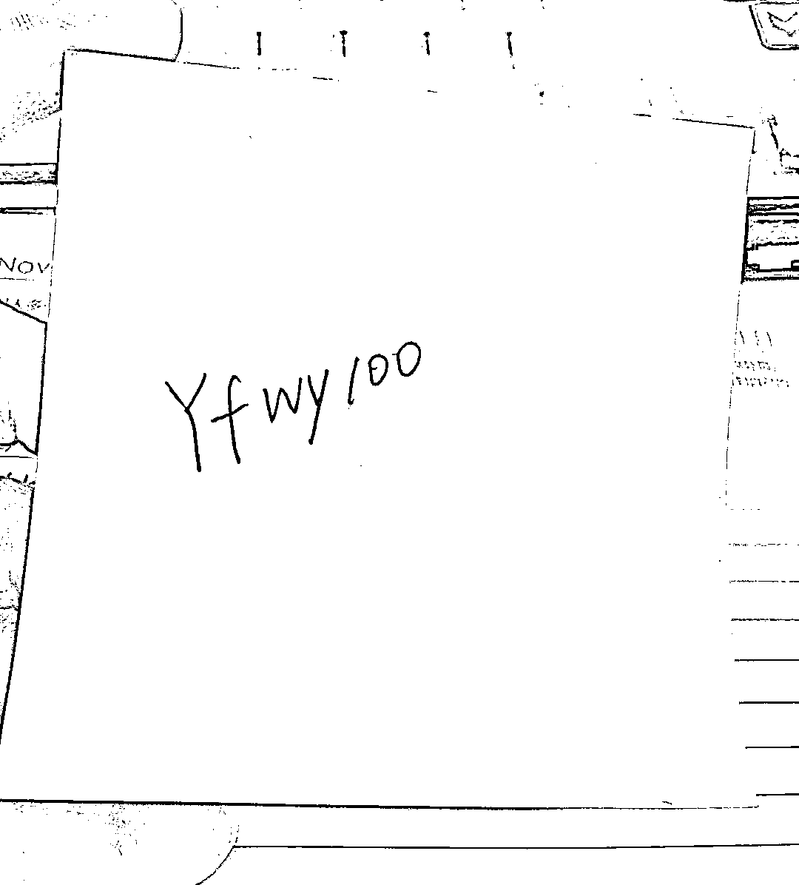

# 人工智能在医疗领域的应用与挑战

> 原文：[`www.yuque.com/for_lazy/zhoubao/uml7g6htpel2qxen`](https://www.yuque.com/for_lazy/zhoubao/uml7g6htpel2qxen)

## (精华帖)(105 赞)人工智能在医疗领域的应用与挑战

作者： 叶凡🌱funny

日期：2024-11-28

最近的 2 个月小红书动作非常多，最大的一个动作之一，就是在抓小红书站外导流，不让发微信号。

小红书导流监控迭代升级之后，很多朋友也都收到了违规提示，也包括我们自己的账号，从警告到禁言全站私信评论区 7 天禁言+限流，继续违规就升级到 14 天……

原本常见的留微信方式，都会被平台管控。比如，之前专业号还能把群聊名称设置为微信号，现在不行了。以前交个聚光保护费，可以让用户发微信，现在也不行了。

**所以有预算，获客成熟的老板** ，直接选择做聚光投流，光明正大的给客户发微信号。

**那不花钱的账号，还有没有导流活路？** ——分享两个最近测试可行的导流方式

# **01**

# **“摩斯”密码**

**【使用方式】：** 在私信时，用点数代替微信号/手机号的数字，直接发给用户。

可以延伸出用任何 emoji 代替点数，还可以用扑克牌的数字排列一下，拍一张照片。

素材来源：叁斤 _

【缺点】：我第一次看到的时候觉得很赞，但是实操的时候发现，他有一个弊端，当你的微信号里边有数字“0”的时候，是没办法用点数代替的。

# **02**

# **小号发微信笔记**

**【使用方式】：** 先用小号发一篇带微信号的笔记，可以分别在下面 3 个场景下使用

①在用户私信咨询的时候，发你的这条小号的笔记；

②用大号收藏小号的笔记，把收藏夹公开，引导用户去看你的收藏夹；

③引导用户进微信群聊，用小号在群里发小号的笔记。

这个方法以前其实也已经在使用，只不过现在管得更严格。如果像以前，对微信号不做任何处理的方式，你的笔记只有自己看得见，别人是看不到的。

**那怎么样才能够不被检测出来呢？**

我经过大量的案例测试和思考总结，我找到了一个方法，可以套用，**我自创个名字叫"看似"合理。就是说，在这个图片的****「这个位置」，本身就可能是一串「数字和字母」（你的微信）**

比如说英文报纸，里边本身就有大量的字母，那你把微信号混在里面，「看着好像很合理」，所以就没法快速识别出来。

**那是不是只要图片里本身就有字母和数字，就一定没问题呢？**

我拿键盘照片，做了一组案例对比：

❌上面的图，把微信**「放在空格键」** 的这张不行，发出去被系统私密了；

✅下面这张，把微信**「放在按键」** 上可以发出去。

所以，大家发现没有，非常重要的关键点，一定要把握住微信放置的位置！！！**问一问自己，「这个位置」出现数字和字母，看着合理吗？**

**掌握这个宗旨，我带大家做 5 组测试题** ，都是我已经发布测试过的。

你边看边记下自己的答案，最后文末对一下正确答案！边学边练，相信你肯定能掌握！

—————

GO!考试开始！

**小红书导流方式选择题（单选 每题 2 分）**

请根据以下图片，选择发布之后，是否会被平台自动检测违规？

**第 1 题：便利贴纸**

A.违规❌ B 不违规✅

**第 2 题：汽车车牌**

A. 违规❌ B 不违规✅

**第 3 题：面膜包装**

A.违规❌ B 不违规✅

**第 4 题：赵丽颖照片**

A. 违规❌ B 不违规✅

**第 5 题：个人海报**

A. 违规❌ B 不违规✅

好了，**以上正确答案是：ABBBB** ，满分 10 分，评论区交流一下你得了几分哈哈

可能比较有难度的是第 4 题和第 5 题，为啥这 2 个可以呢，其实是因为这个图，你忘掉自己是导流目的，忘掉那串数字字母是微信，仅作为一张海报图，排版上出现数字和字母是不是也是正常的？

好了，相信大家都已经掌握啦，然后你们就可以举一反三的去做自己的导流图啦~~

**最后，再强调 2 个细节：**

**  **

** *1.尽量用小号配合导流。***

因为虽说平台他不能直接检测出来，但是拦不住你可能会 *被同行投诉举报* 呀。用大号就有被举报首罚风险。

我拿我的 A 账号举报我发了微信的 B 号，测试了一下，举报成功了。对，没错，自己举报自己，浅浅牺牲一下自己哈哈哈～

不过，比较神奇是，A 收到了举报成功的消息通知，但是，我的 B（被举报的号）并没有违规提醒，而且笔记还正常展示，没被私密。

我个人猜测可能是被举报的次数还没有到达一定的量，但能明确一点，被举报还是会判违规，毕竟系统已经给了 A 违规回馈。

** *2.如果是经由大号发的微信，在用户确认收到后，立马撤回***

以上就是不花钱的导流方式思考和分享，欢迎大家交流更多好用的导流方式，最后，祝大家微信导流爆单！

* * *

评论区：

阿宝 : 学习了 厉害[强]

喵姐 : 这操作，人才啊[666]

哎呀小柠檬 : 厉害

亦小亮 : 赵丽颖这个我这边确实不行

旭宏 : “我拿我的 A 账号举报我发了微信的 B 号，测试了一下，举报成功了”[捂脸] 太有钻研精神了！[强][强]小姐姐你的盖洛普排第一的天赋是“学习”吧？

叶凡🌱funny : 天呐，你把我午休的瞌睡都震惊跑了，真的是“学习”😱😱

叶凡🌱funny : 你是盖洛普优势教练吗

叶凡🌱funny : 哈哈，实践出真知[耶]