# 2024 西班牙 Tik Tok 电商市场调研报告

> 原文：[`www.yuque.com/for_lazy/zhoubao/up88wrm4ybp9aibk`](https://www.yuque.com/for_lazy/zhoubao/up88wrm4ybp9aibk)

## (8 赞)2024 西班牙 Tik Tok 电商市场调研报告

作者： 梁小伟

日期：2024-11-25

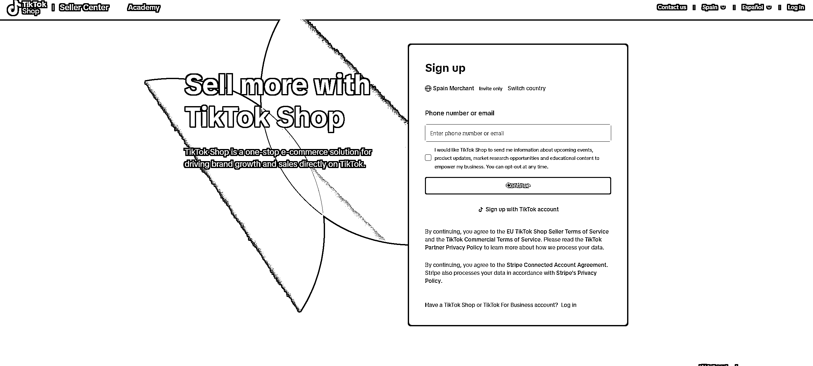

TikTok Shop 西班牙站点在经过一段时间的筹备后，终于宣布将于今年 12 月正式对广大商家和消费者开放！

#### **1****.** **入驻条件**

1.  **个人卖家：**

2.  需要提供居住地址和身份证明文件（如 DNI、护照、驾照等）。

3.  提交身份证号码、姓名、出生日期等相关信息。

4.  **企业卖家：**

5.  需提供本地仓储证明，确保在西班牙发货。

6.  上传公司营业执照、VAT 税号和法人身份证明文件。

7.  满足平台特定销售流水要求，例如欧洲亚马逊年销售额超 100 万美元（随平台政策动态调整）

#### **2****.** **入驻流程**

1.  **获取邀请码** ：TikTok Shop 西班牙站点目前采取邀请制注册。

2.  **完成注册** ：通过邀请码进入官网选择“个人”或“企业”类型注册。

3.  **提交资料** ：按要求上传身份证明或企业资质文件。

4.  **绑定银行账户** ：配置用于收款的有效银行账户。

5.  **等待审核** ：审核周期为 2-6 个工作日。

6.  **上线运营** ：审核通过后，进行商品上架与店铺装修，准备开店。

#### **3****.** **重要注意事项**

1.  **售卖时间** ：TikTok Shop 已于 7 月 1 日上线，但全面售卖功能预计将于 2024 年 12 月开放。

2.  **市场机遇** ：西班牙电商市场发展迅速，预计 2024 年市场规模将继续增长，成为欧洲电商增长最快的国家之一。

### **西班牙 TikTok 电商市场调研与深入分析**

西班牙作为南欧的重要电商市场，凭借其年轻化消费群体、高互联网普及率和快速发展的社交电商生态，正迅速成为跨境电商的蓝海市场。本文通过市场背景、消费者行为、竞争格局以及 TikTok 的独特机遇，结合数据与实际案例，为商家提供全面的市场洞察与落地策略。

### **1****.** **西班牙电商市场体量与增速**

#### **

**

#### **市场体量**

西班牙电商市场在**欧洲排名第四，仅次于英国、德国和法国。**

**市场规模** ：2023 年电商销售额达到 653 亿欧元，预计 2025 年将突破 750 亿欧元，年复合增长率保持在 10%左右。

**互联网普及率** ：高达 93%，其中超 70%的用户有在线购物习惯，且每月网购频率平均为 3.4 次。

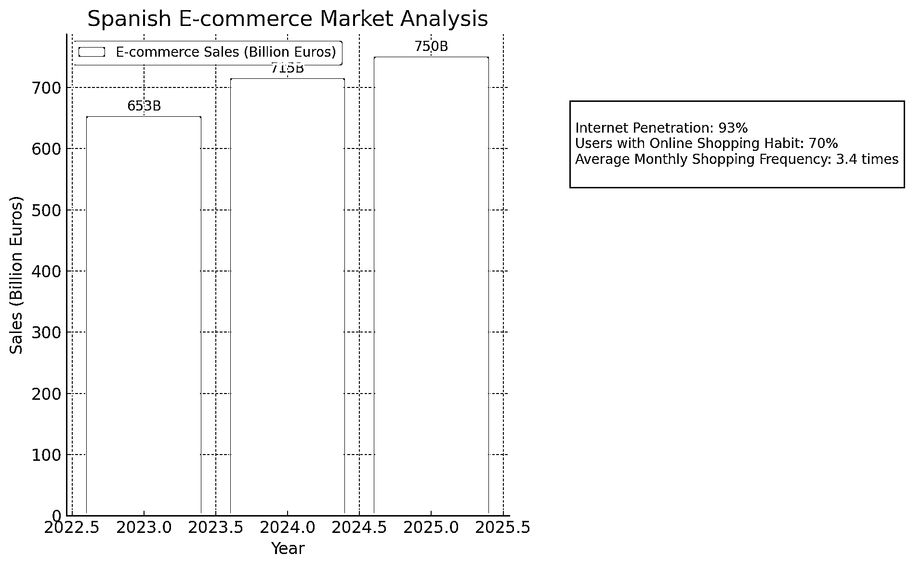

#### **增长驱动因素**

1.  **移动设备购物的普及** ：65%的电商交易通过手机完成，社交电商的爆发是重要驱动力。

2.  **疫情后电商消费习惯固化** ：西班牙消费者更倾向于使用在线渠道满足衣食住行需求。

### **2****.** **消费者购物习惯与行为洞察**

#### **购物习惯**

西班牙消费者偏好**价格透明度** 和**促销活动** ，节日营销（如黑五、圣诞节）对销量提升作用明显。

环保意识高涨，**可持续发展商品** （如可降解材质、再生产品）更受消费者青睐。

对品牌有一定忠诚度，但如果新品牌能够在价格、质量和服务上实现较高性价比，也易获得消费者青睐。

#### **支付方式**

1.  **主流支付方式** ：

2.  PayPal：覆盖率超 55%，为消费者提供快速和安全的支付体验。

3.  Visa 和 MasterCard：占主导地位，常用于大额交易。

4.  Klarna 等分期付款服务：年轻人群体中使用率显著上升。

#### **热销品类**

**时尚与服饰** ：特别是连衣裙、运动鞋、箱包等。

**电子产品** ：智能手机、充电宝、家用小电器。

**美容与个人护理** ：护肤品和彩妆。

**家居与 DIY 用品** ：小型家具、园艺工具等。

西班牙消费者购物比例： 服装鞋靴以及电子数码品类位居前三名

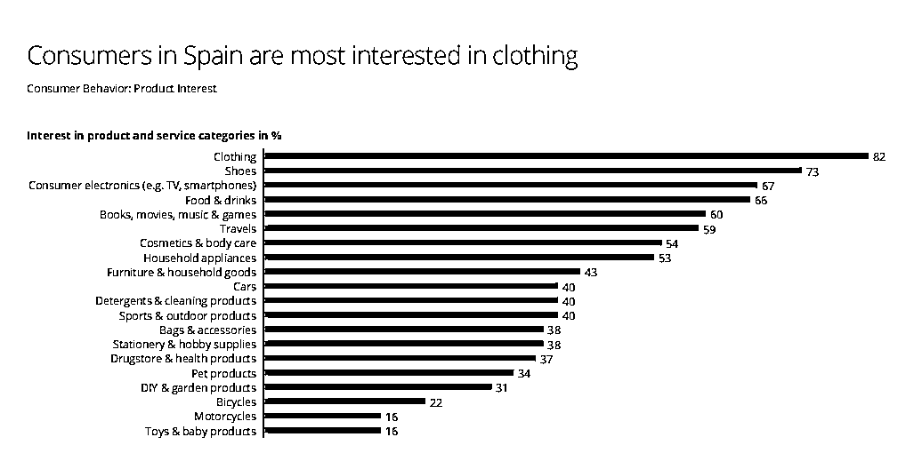

### **3****.** **主流电商平台与竞争格局**

#### **平台格局**

1.**亚马逊西班牙（Amazon.es）** ：

占市场份额超 40%，提供物流服务 Prime 会员体验。

1.  主打品类包括电子产品、图书、日用消费品。

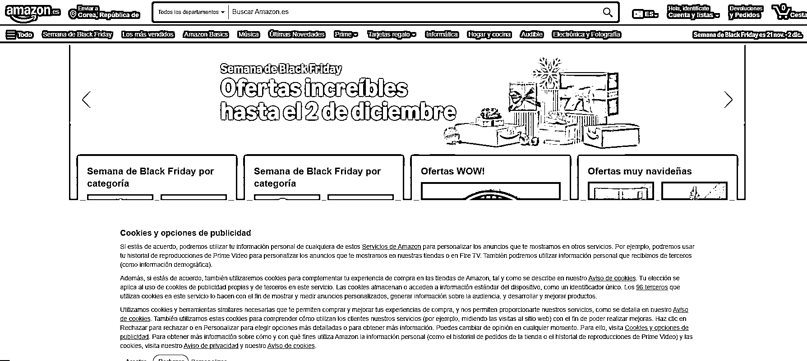

2.**Zalando** ：西班牙时尚市场的佼佼者，以多样的品牌选择和便捷的退货政策闻名。

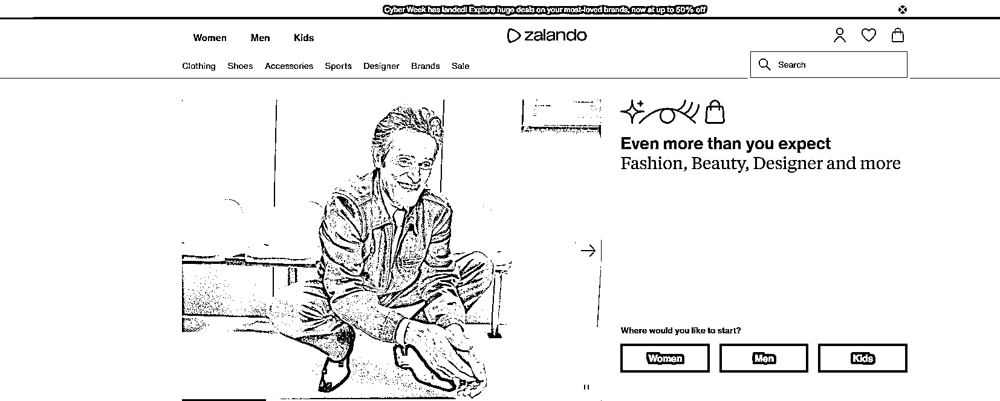

3.**速卖通（AliExpress）** ：中国商品的主力出口平台，低价策略深受价格敏感型消费者喜爱。

4.**El Corte Inglés** ：本地知名百货品牌，主打中高端消费群体，产品覆盖日用品、时尚、电子等。

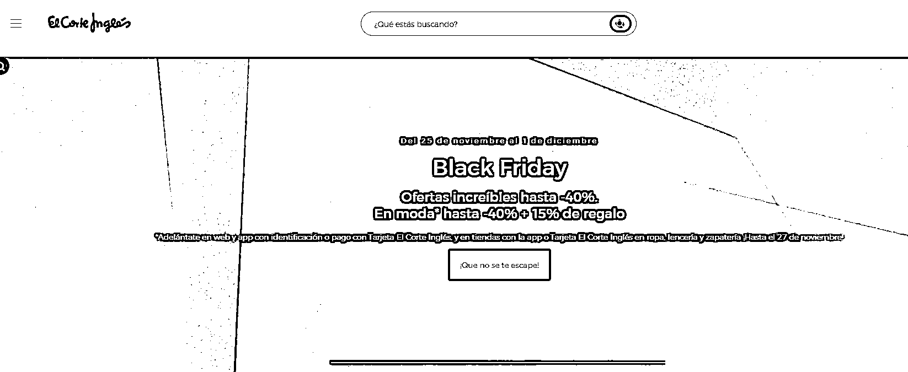

5.**Shein** ：时尚快消品牌，通过社交媒体快速获取年轻用户市场。

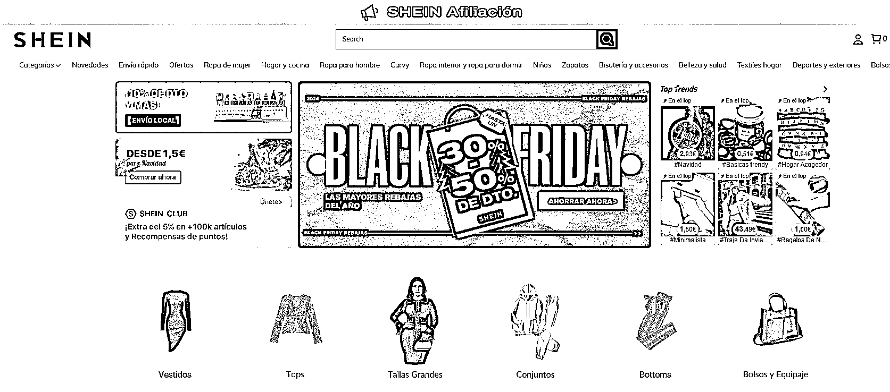

#### **竞争分析**

1.  西班牙电商市场呈现“双头模式”：国际巨头主导市场，但本地电商平台通过细分品类和差异化服务抢占份额。

2.  社交电商仍处于初期发展阶段，TikTok 为中小型跨境电商提供了较低门槛的流量渠道。

### **4****.** **TikTok 在西班牙的电商布局与机遇**

用户渗透率：根据**statista** 数据统计，截止 2024 年 4 月 TikTok 的用户份额位居西班牙社媒第五

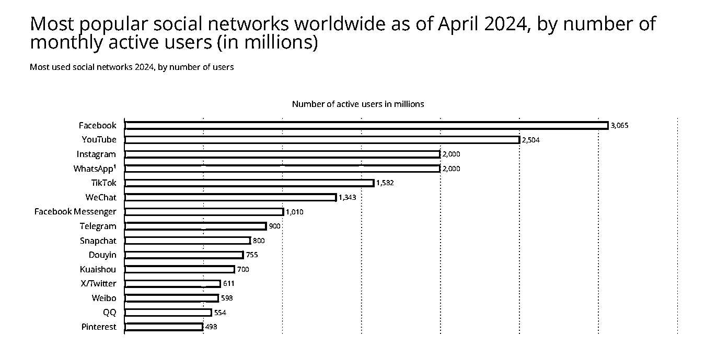

#### **平台现状**

TikTok 在西班牙拥有 1500 多万月活跃用户，日均使用时长超过 90 分钟。

用户群体集中在 18-34 岁，兴趣广泛且消费潜力强。

短视频内容的强社交属性，使 TikTok 成为品牌渗透年轻用户的核心渠道。

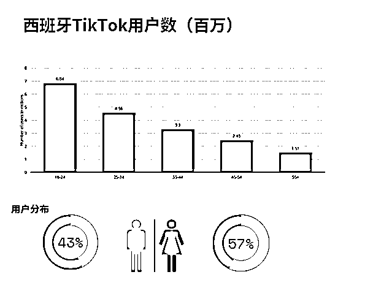

**tiktok 广告受众情况**

根据**pipiads** 数据显示，截止到 2024 年 11 月，全球 TikTok 广告受众排名中，西班牙**受众排名 23，有 2020 万受众，相比上月新增受众 37 万人，增长迅速。**

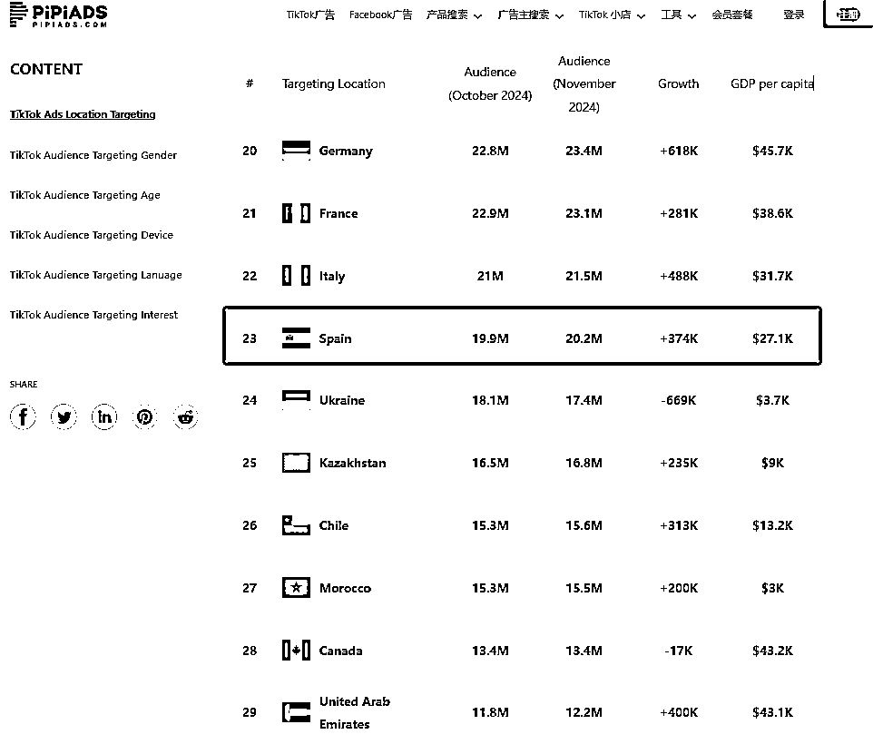

#### **广告与内容形式**

1.  **高互动广告：**

2.  使用短视频和挑战赛（如#TikTokMadeMeBuyIt），通过有趣、轻松的形式引导消费。

4.  **达人推广：**

4.  与本地 KOL 合作是快速打入市场的有效方式。例如，与 10 万至 50 万粉丝的小型网红合作，转化率显著提高。

5.  **直播电商：**

6.  西班牙消费者对直播购物的接受度尚处于探索期，但趋势向好。建议品牌从短时促销直播切入，逐步建立观众群体。

### **5****.** **电商基础设施与法规**

#### **物流与配送**

1.  **快递服务：** Correos、SEUR、DHL 等提供高效物流，但偏远地区配送时效仍需改进。

2.  **自提服务：** 消费者越来越倾向于选择取货点，约 69%的订单选择自提。

3.  **跨境物流：** 跨境电商需优化运费和退货政策，以应对消费者对服务的高期待。

#### **税务与法规**

1.  **VAT** ：21%的增值税适用于大部分商品。

2.  **关税政策** ：跨境卖家需注意产品的 CE 认证要求，尤其是电子产品和健康用品。

### **6****.** **PipiAds 等数据工具如何赋能选品与市场分析**

1.**PipiAds** ：

通过 PipiAds，可以分析西班牙市场中投放效果最佳的广告类型和产品趋势。

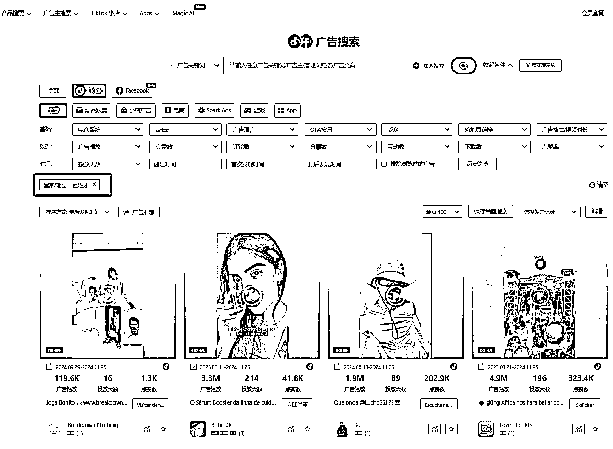

2.**SimilarWeb** ：

提供网站流量、受众画像等数据，帮助了解竞争对手的来源及表现。

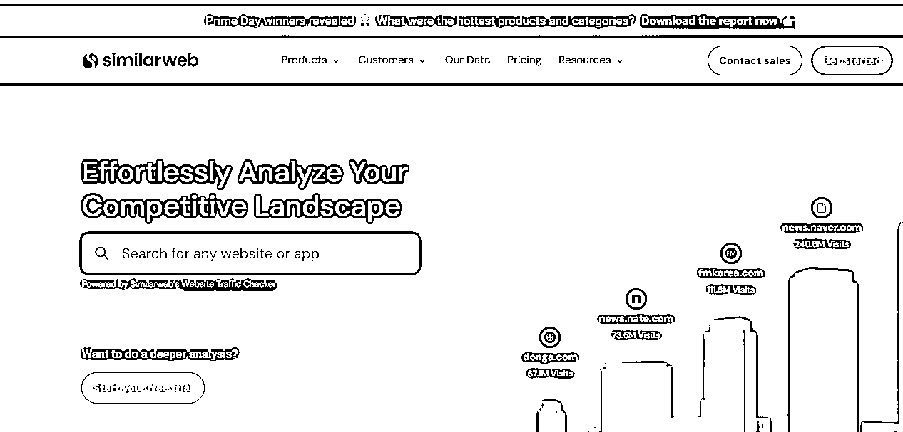

3.**Google Trends** ：可实时追踪西班牙消费者的搜索趋势，捕捉节庆热点（如复活节相关消费品）。

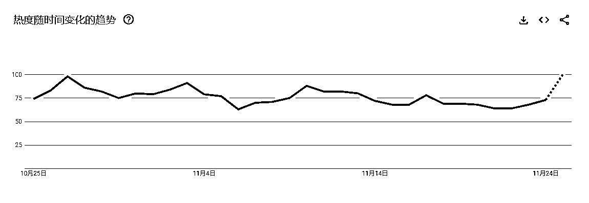

### **7****.** **实操建议**

**选品策略：**

1.美区爆款同步西班牙复制

2.亚马逊爆款同步西班牙复制测试

3.pipiads 独立站爆款同步西班牙复制测试

**内容创作与本地化：**

通过 TikTok 短视频展示产品卖点，例如使用 UGC 创作实测对比内容。

融入本地文化元素（如地中海风格），增加消费者情感联结。

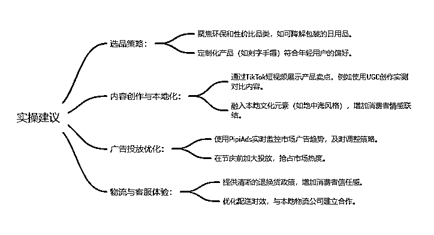

**tiktok 独立站投放案例**

西班牙 TikTok 投放营销案例一：

**复古潮流风 T 恤** 累计投放广告展现 106.2M 播放 售价€39.95，拿货成本￥15

美区爆款同步复制西班牙市场

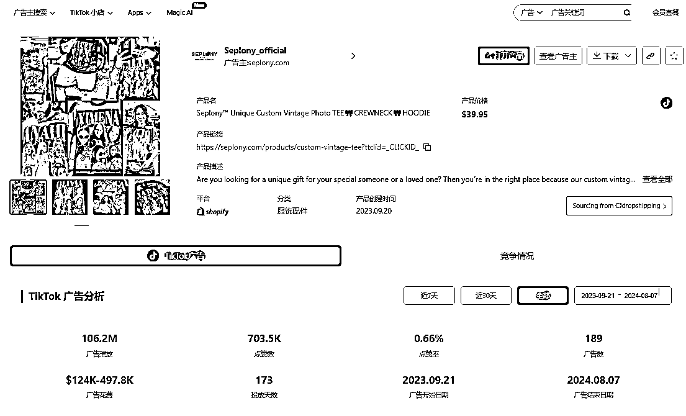

[[`www.pipiads.com/zh/product-`](https://www.pipiads.com/zh/product-) search/650b47a3b3470104275dc363/]([`www.pipiads.com/zh/product-`](https://www.pipiads.com/zh/product-) search/650b47a3b3470104275dc363)

2300 万播放广告素材：情侣属性搭配文案情绪价值

西班牙 TikTok 投放营销案例二：

**定制胶卷照片钥匙扣** 累计投放广告展现 38.6M 播放 售价$26.98，拿货成本￥5

老品了，反反复复全球各地投放

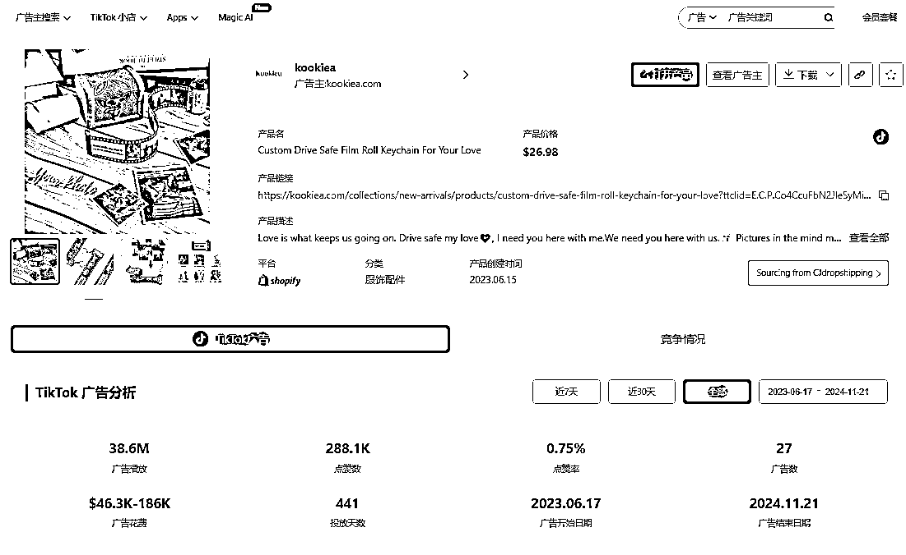

[[`www.pipiads.com/zh/product-`](https://www.pipiads.com/zh/product-) search/648d0749cf323252f5f6547f/]([`www.pipiads.com/zh/product-`](https://www.pipiads.com/zh/product-) search/648d0749cf323252f5f6547f)

**2550 万播放广告素材：** 通过真实的情侣互动场景营造情感共鸣，利用“个性化礼物”的主题打动目标受众，特别是情侣人群。

西班牙 TikTok 投放营销案例三：

**益智类游戏剧本** 累计投放广告展现 25.2M 播放 售价$36.01，拿货成本￥8

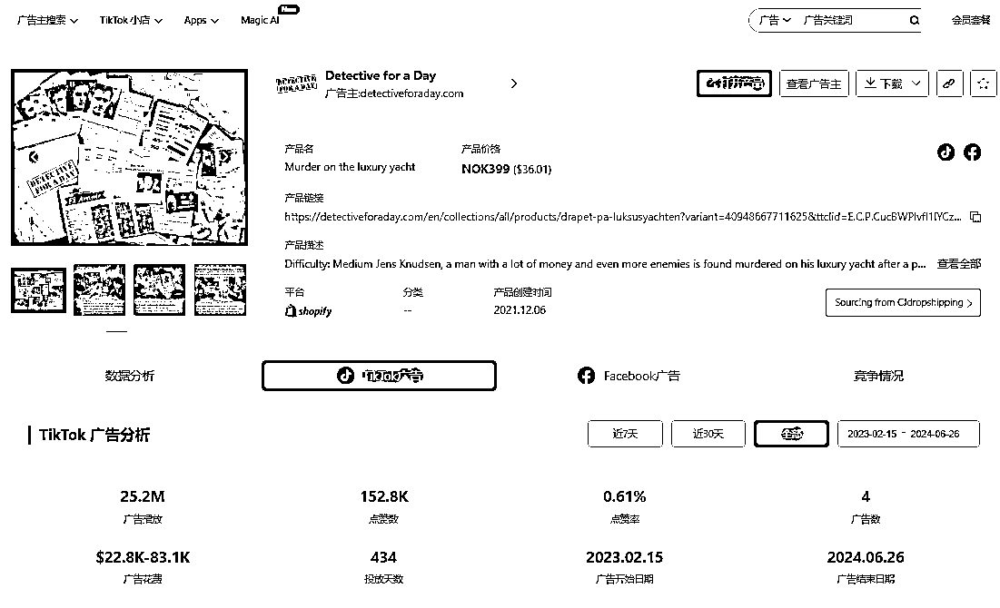

[[`www.pipiads.com/zh/product-`](https://www.pipiads.com/zh/product-) search/63ec8a95f3fc19727baa1f1a/]([`www.pipiads.com/zh/product-`](https://www.pipiads.com/zh/product-) search/63ec8a95f3fc19727baa1f1a)

1270 万播放广告素材

通过简短视频展示游戏细节和吸引力，强调 2-3 小时即可解决案件的特点，迎合喜欢快速体验的用户需求。

西班牙 TikTok 投放营销案例四：

**旋转回旋镖** 累计投放广告展现 38.6M 播放 售价$27.6，拿货成本￥7.5

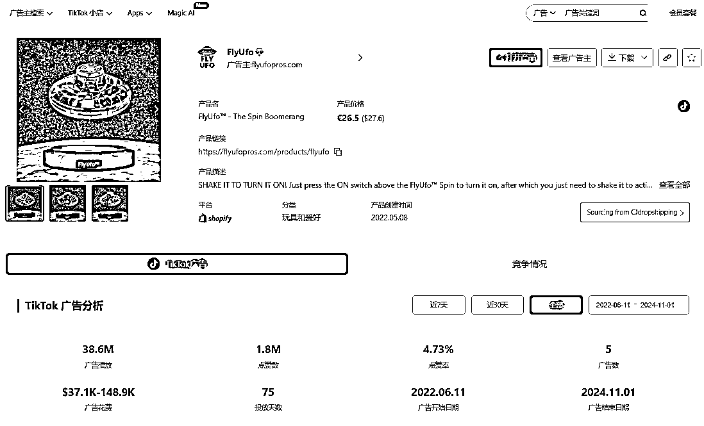

[[`www.pipiads.com/zh/product-`](https://www.pipiads.com/zh/product-) search/62a4bdb4a955371f2441cc4d/]([`www.pipiads.com/zh/product-`](https://www.pipiads.com/zh/product-) search/62a4bdb4a955371f2441cc4d)

直观展示了飞行旋转玩具的核心功能
搭配简单易懂的文案和生活化的户外场景，成功引发观众对产品的好奇与购买欲。产品定位新奇创意小物件市场，目标人群涵盖年轻人和玩具爱好者

西班牙 TikTok 投放营销案例五：

**刺绣牛仔裤** 累计投放广告展现 25M 播放 售价$58.28，拿货成本￥35

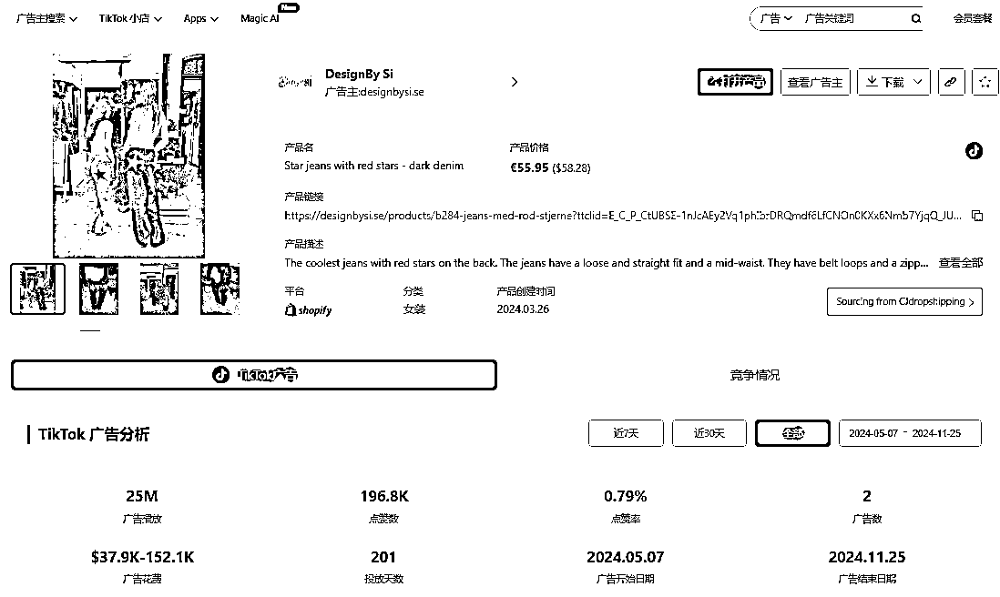

[[`www.pipiads.com/zh/product-`](https://www.pipiads.com/zh/product-) search/6639905555c75455898f4679/]([`www.pipiads.com/zh/product-`](https://www.pipiads.com/zh/product-) search/6639905555c75455898f4679)

西班牙电商市场凭借其高增长潜力、年轻化消费群体以及对社交电商的强烈接受度，为品牌提供了前所未有的机遇。通过深度挖掘消费者需求，灵活运用 TikTok 等新兴社交平台的营销优势，结合数据分析工具（如 PipiAds）精准洞察市场趋势，并实施切合本地文化的运营策略，商家不仅能快速切入这一蓝海市场，还能建立长期竞争优势，稳步实现品牌增长与市场份额扩张。

一般新市场都有新机会，相对门槛也会高一些。可能量刚开始不会很大，但也有一些红利。

* * *

评论区：

暂无评论