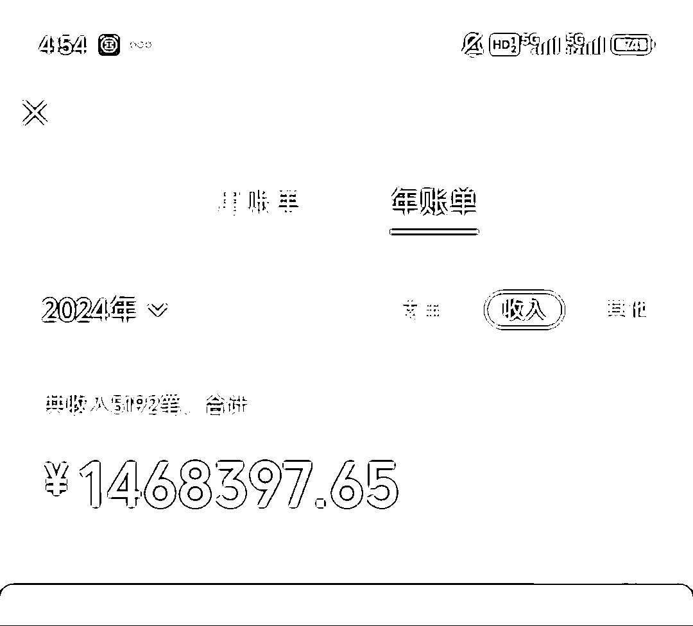
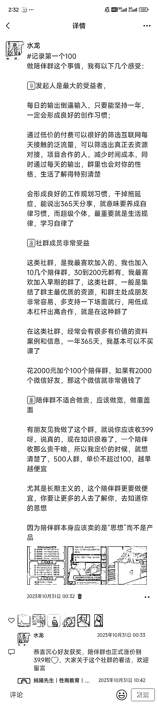
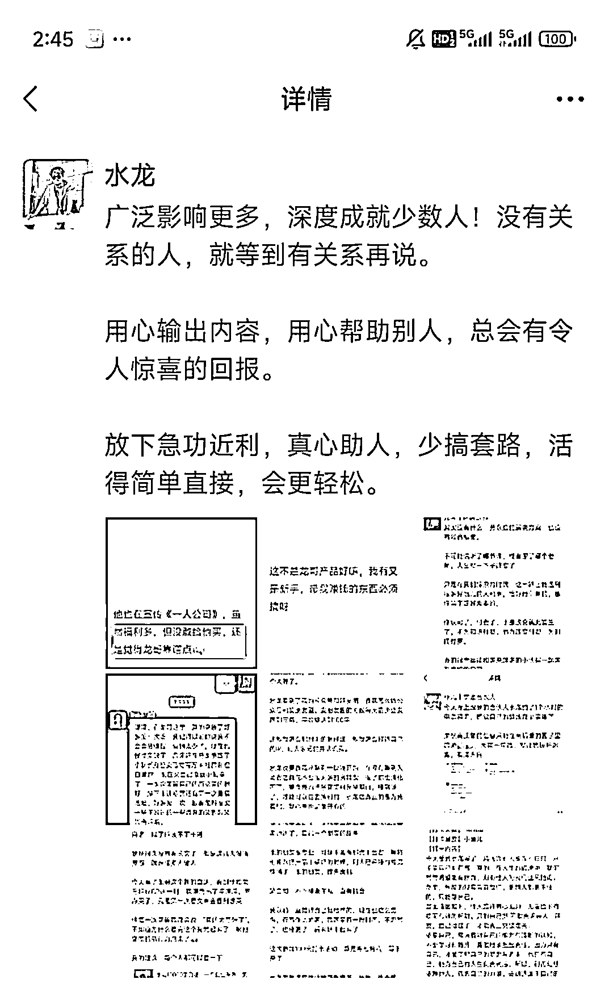
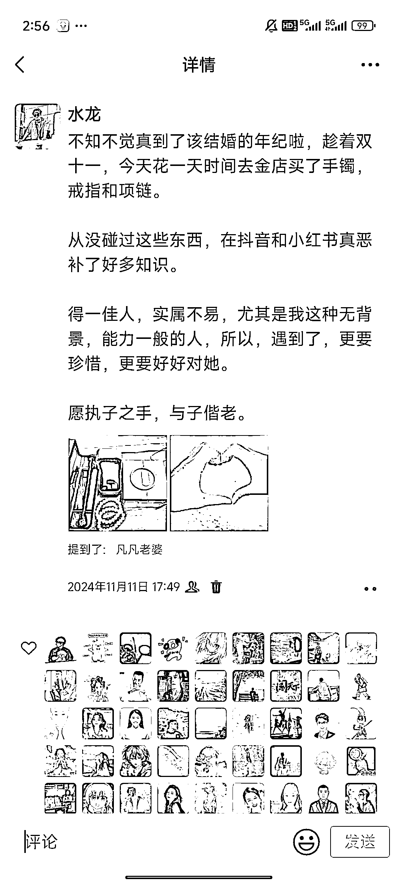

# 从创业失败到自媒体百万利润：一个 96 后青年的成长与转型之路

> 原文：[`www.yuque.com/for_lazy/zhoubao/wkeus9ckhugap9vv`](https://www.yuque.com/for_lazy/zhoubao/wkeus9ckhugap9vv)

## (41 赞)从创业失败到自媒体百万利润：一个 96 后青年的成长与转型之路

作者： 水龙

日期：2024-11-27

我是水龙，一个热爱创业的 96 后，大二开始创业，带着团队做文化衫定制，干到百万营收，因受疫情打击，创业失败负债上班，上班还清网贷之后。

在去年某个偶然机会进入自媒体圈，开始做自媒体，从素人起步，通过自媒体带货赚佣金的形式，存到了自己的人生的第一个七位数存款。

这篇文章，我将自己的成长分成了三个阶段，逐一拆解我的成长路径，将可复制的步骤，都详细地写出来，希望对后面打算做自媒体赚钱的同学，有所帮助。

小白该如何开始做自媒体，才能真正地持续赚到钱呢？

不会拍短视频，不会直播，不会做小红书，抖音等公域引流，纯靠私域，小白能不能把自媒体做起来？

我在过去一年通过**自媒体带货赚佣金** 的形式，实现了百万利润，找到了最适合普通人做自媒体赚钱的路径。

对于个人时间比较零散的上班族，宝妈，学生群体来说，做自媒体带货赚佣金的形式是最好的。

过去做自媒体主要的赚钱方式就是接广告和带货，但随着这两年经济变差，很多自媒体大 V 都开始接不到好的广告，而带货也是越来越难，越是就有很多博主都开始开课，做知识付费。

过去大 V 做知识付费主要是在抖音平台，随着今年视频号起来之后，有很多大 V 也开始在微信上卖课，做知识付费，这对于我们普通人来说就是绝佳的商机。

在私域上，大 V 卖课普遍都会开分销，分销比例从 20%到 100%不等，那为什么大 V 卖课会成为我们普通人做自媒体赚钱的商机呢？

先说一下，普通人做自媒体的痛点是什么？

**1、没流量**

**2、没内容**

**3、没产品**

那大 V 们来私域上做知识付费，对于我们普通人的好处是什么？

1、可以通过小额度的付费，进入他们的私域社群，通过他们，我们可以低成本地链接到很多高质量的人群，从而拥有自己的高质量私域。

2、可以通过学习大 V 的内容，获取到高质量的内容，从而有自己高质量的内容输出。

3、通过直接分销大 V 的产品，可以直接不用自己做交付，让大 V 完成交付，自己还可以赚到不少的佣金。

也就是说，我们普通人做自媒体赚钱的整体逻辑就是：

**付费大 V 的知识产品—在大 V 的圈子里学习获得高质量私域—通过自己高质量的内容输出和私域好友建立信任，带货赚佣金。**

把这个商业逻辑和大家讲清楚之后，接下来，我会结合我的成长经验，给大家拆解我的成长阶段，在拆解之前，必须要强调一下：

**写作是做自媒体赚钱的基础，也就是你可以不会短视频，不会直播，但是你必须养成输出表达的能力。**

我在过去一年主要的带货方式是三种：朋友圈、社群、公众号，而这三种形式，都是需要个人大量的写作。

## **一、新手起步，先苦练基本功**

什么是新手阶段？

1、没有混过圈，对于圈内的人不熟，不懂混圈规矩，对于类似生财，淘金，破局，玩赚等付费社群都不太了解，更不了解里面的人。

2、没有内容输出习惯，从没有在朋友圈写作带货课程，没有写过个人 IP 公众号，没有经营过自己的付费社群，甚至也没有建立过自己的免费社群。

3、对于常用的知识付费平台，类似知识星球，小报童，墨问等等不太了解和使用。

……

总的来说，**就是处于缺乏个人人脉资源和信息资源的阶段。**

那自媒体新手阶段该如何成长和赚点小钱呢？

我们做自媒体私域带货赚佣金，记住：

**1、私域增长是每天必做的事情**

**2、要将基本功练成肌肉记忆才能持续不断地赚钱。**

**3、做离钱最近的事，卖最容易卖的产品**

### 1、大量获取圈内信息

新手付费进圈第一件事就是要好好学习基础知识，了解圈内的信息，认识人，了解圈内规矩，多在社群冒泡，多说话，多提问，多获取信息。

### 2、反复训练朋友圈、公众号，私域增粉能力

#### 1、**朋友圈带货训练**

新手阶段朋友圈每天最少发 2 到 3 条，主要包括以下类型：

##### 1、成长圈，干货带货

**个人成长感悟、赚钱感受，干货经验等**

内容来源：知识星球，小红书，公众号文章。

可以关注一些小红书或者公众号教人赚钱的博主，大量阅读他们的文章，早期如果自己没有二次创作能力，可以将其中自己比较强烈有感受的内容**复制粘贴转发到自己的朋友圈，但最好用自己的话重新表达一遍，再发到朋友圈。**

这类朋友圈的字数最好是 200 到 500 字，记得要及时**展示支付按钮，也就是可以通过配图或者评论区销售自己最近卖得不错的产品。**

**举个例子：**

这是我去年卖自己陪伴群的时候，采用的个人感悟+底部配图带货的形式，如果前期不太会带货，那就先不用带货，等自己有了合适的知识产品之后，这个是要每天刻意训练的带货形式。

##### 2、夸夸圈，建立信任

在混社群以及和他人私聊过程中，要及时收集他人的夸赞，以及一些对于有利于你个人人设的内容，要经常输出到朋友圈，加强陌生私域对你的个人好感。

记住：别人夸你是**最好的用户证言**

有新手这里就经常问我：很少人会夸我怎么办？

两个方法：

1、多帮助他人，多帮助群友

2、主动夸别人，正常来说，你夸别人，别人也会夸你。

为了突出重点，社群的**聊天截图** ，记得**养成用稿定设计软件打码，标注重点，重视自己的朋友圈配图美观，如果不会，可以在水龙的入门课里有教。**

**举个例子：**

这种用户证言的方式，对于建立私域信任是非常有帮助的，尤其是你后面成交高客单产品的时候，用户证言是他们非常关注的，所以，一定要重视。

##### 3、生活圈，强化人设

美好生活，家庭聚会，朋友见面，生活美照等等，朋友圈也要自己生活的一面，才会有温度。

一些比较受欢迎的人设：老婆努，正能量的创业者，宝妈，大厂人等等，选择你身上最明显的特点，去持续分享。

这类朋友圈的原则就是：真实，让别人也参与到你生活里，让他们感受到，你是朋友，而不只是来销售的。

总之朋友圈发圈原则：

除了即兴表达，一定要认真写内容，字数起码 100 个字，**能展示支付按钮，就大方的展示支付按钮。**

#### 2、日更**公众号写作，打通公域流量**

IP 公众号的输出核心是展示真实的自己，可以将公众号当做**每天发一条超高质量的朋友圈** ，将自己日常写的内容最有感受的一条同步到公众号。

公众号是打通私域和公域最重要的一环，也是我们获取公域精准粉丝的重要来源，公众号最重要的就是标题，在公域写作一定用夸张，吸睛的标题，要让人看了就有点进去的欲望。

**内容要以赚钱为主，因为赚钱是所有人的刚需。**

新手开始写作，不用在意阅读量，每天坚持写，先写 100 篇，找到网感再说，我自己也是通过公众号积累了 2000+高质量私域，变现了 10 几万。

如果对于 IP 公众号不熟的，可以去看我的 IP 写作入门课。

#### 3、日增私域好友，就是每天赚钱

每天私域增长不能低于 10 个优质好友，不能乱加人，要清楚对方是做什么的。

可以通过写内容，社群分享，被动引流私域，或者购买付费社群，在群内主动添加发自我介绍的人。

如果时间精力允许，最好一天新增 30 个私域以上，无私域不谈变现，这是每天都要做的事情。

记得优质私域=财富，每天增加私域，就是每天赚钱。

## 二、快速成长，IP 变现

什么是成长阶段？

当自己熟练发朋友圈，公众号，混圈之后，就要尝试去做自己的产品，在互联网上，只有拥有自己的知识产品，才有机会和他人进行交换，放大自己的资源和影响力。

### 1、围绕大 V 产品，建立自己的付费社群

当自己付费了一定的知识产品之后，通过分销大 V 的产品，去做个自己的付费社群是非常重要的：

**1、可以筛选自己积累的私域中对自己信任度更高的，进行更深入的运营和维护。**

**2、可以降低自己在圈内的社交成本，让别人有机会给你打钱。**

新手不建议做免费社群，一定要做付费社群，冷启动的话，可以将自己分销成功的人打个标签，或者给自己付费过的人打个标签，当人数超过 20 人以后，再拉一个付费社群，当然自己极度不自信的时候，你可以做一个免费社群，先去练手。

总而言之，做社群是一定要去做的。

建立好社群之后，要学会在社群中采用**水军带货** ，社群演讲带货等，学会分享自己的 IP 故事，建立一个可以持续分享赚钱的社群。

新手最担心的是社群运营死了，怎么办？社群都是会死的，不用过度在意，做社群就是要不断建立自己【一对多】的销售能力，训练自己的公开表达能力。

做死一个，那就在合适的时机再开一个，不断运营，不断精进，最后就会成为社群运营高手，当你熟练建立付费社群以后，你的收入就会大幅度提升。

### 2、做付费专栏，建立自己的内容壁垒

付费社群属于社交型产品，专栏就属于内容型产品。

在成长阶段，要左手搞流量，右手做内容，一款内容型产品，可以用于赠礼，更低成本地和他人建立关系，而好的内容，也会降低转化粉丝的成本。

我的自媒体专栏，积累了大量铁粉，很多粉丝都是看完专栏之后，就直接和我购买其他产品了，所以一款性价比很高的内容型产品是非常重要的。

新手该如何做自己的内容型产品呢？

很简单，学会去解答他人的问题，大量解答，将解答的答案整理成合集，而这个合集就是一个很好的付费专栏。

这种低价专栏，不仅可以让你在社交中不用重复回答他人的问题，还可以很好地解决白嫖的问题，让你的单位时间效率变得更高，更值钱。

### 3、参与圈内活动，寻找商业机会

参加圈内的打榜活动，可以有几个好处：

1、最低成本买到圈内的知识产品，经常可以买了就分销赚回门票，并且小赚一些钱。

2、通过当志愿者，KOL 分销等，可以免费地链接到圈内很多高手，快速扩充自己的信息源

3、在活动过程中，可以和顶级销冠，免费地学习写销售文案，运营技巧，文案技巧等。

总而言之，想要提升自己的人脉和个人势能，圈内的活动，在成长阶段，要尽可能地多参加。

参与活动，要不断去分析活动的利弊，寻找赚钱的机会和获取私域的机会。

**记住：人多的地方，就是充满商机，活动越大型，商业机会就越多。**

参与圈内打榜活动，最重要的就是要学会和他人建立合作联系，学会抱团，做到几个点，可以很好地帮你赚到更多的钱：

1、找机会成为你认识的某个大佬的销冠，并且和大佬绑定较好的关系。

销冠不需要多，就像混圈不需要多一样，重要的是找到有格局，足够利他的大佬，和他做深度的绑定，我就是成为老马的销冠之后，他是圈内的前辈，我借助他的资源，在圈子里，不断去扩大自己的人脉圈，然后有了我自己的基本盘。

所以，死磕一个大佬，会比你到处混圈要更好，尤其是属于上升期的大佬。

2、获得销冠是最好地提升自己势能的方式，想要拿下销冠，需要你日常学会团结那些比你弱的人，在合适的机会，才能一战成名。

想要成为强者，你就得团结弱者，团结的弱者越多，你就会成为领袖，你的能量就越大，在合适的机会，你就会被他们托举成为圈内红人。

所以日常要做的事情，就是多帮助比你弱的人。

3、要有破釜沉舟，不破不立的勇气，要比其他人敢于重仓某个活动，才有可能成为佼佼者。

圈内打榜，一般都会涉及到自己掏钱，也就是自己想要拿下某个销冠，可能要付出一定的金钱代价，所以，当你看到某个榜，你需要花一定代价，当你有足够的闲钱，而你十分缺乏势能的时候，你一定要敢于花钱。

记得花钱，赚钱，只有敢承担一定的风险，才有可能获得巨大的收益，看准了某个活动，就要重投，要么不出手，出手，在自己能接受的代价范围内，想尽办法拿下榜一。

圈内通过分销打榜成为顶级高手，实现百万收入，千万收入，都有案例，所以打榜在你成长阶段是非常需要研究的事情，一定要仔细，认真研究。

### 4、苦练专业技能，更具有个人分销竞争力

项目或者技能+IP 是持续赚钱最重要的方式。

你要选择某个常青树领域，持续深耕，不断精进这个技能，让自己更具备差异化竞争力。

例如：爆文写作，小红书、闲鱼、AI 写作等等

选择某个长期赚钱的方向，在这个小领域上，不断去研究，从学员开始，再到成为老师，成为专家，这样子，你在分销的时候，你就具备了他人不一样的竞争力。

## 三、成为高手，建立联盟

什么是高手阶段？

当你有了一定数量的铁粉，有了一定的被他人认可的内容，有了一个大家都认可的标签或者技能，那你最需要的就是通过公开发售，去快速提升自己的影响力。

在这个阶段，你最需要的就是找到适合自己的商业模式，建立自己可以持续赚钱的产品体系。

### 1、跑通低客单**社群发售，私域裂变，不再缺私域**

社群裂变是社群增长最重要的方式，也就是通过开高比例分销+奖励制度，让对自己运营的社群有较高信任的兄弟，通过分销让他们赚到钱，自己可以赚到影响力和流量的方式，快速打爆自己。

以陪伴群为例：

一般来说，陪伴群运营到人数 200 人左右，就会出现增长缓慢，而社群也会随着时间慢慢消亡，那如何在短时间快速提升自己的社群人数，获得影响力，这里需要的就是发售，通过发售，将群快速增加到 500 人。

当然发售之后，是要做一定的变现，才能可持续，我在 IP 星球里，也专门写了低客单发售教程，是要去好好学习，并且实战的。

### 2、跑通专栏发售，学会借势 KOL，实现十倍转化

内容型产品发售的好处，就是可以通过内容本身就和用户建立较大的信任，在用户心里留下专家影响，后续可以通过顾问式销售，成交更高客单的产品。

而专栏，这类内容型产品发售，需要自己创造影响力事件或者自己的某个标签深入人心，有了一定的 KOL 积累之后才可以发起的。

可以通过榜一，或者某个标志性事件，就可以发起自己的专栏发售。

例如自己写出多篇 10 万+爆文，就可以快速发售自己的爆文专栏。

例如拿下某个大 V 的销冠，自己在这个圈内也有了一定影响力，就可以快速发售。

这种内容型发售，记得内容是日常积累的，一定要对内容严格把控，这样子才会产生用户的口碑裂变。

### 3、建立十、百，千、万元产品体系，实现睡后被动收入

我们做自媒体带货赚佣金，是围绕着大 V 的产品体系去建立自己的个人产品体系，一般大 V 的产品，都会从低价到高价，为了更好地进行分销赚佣金，我们通过分销赠送自己的产品，那就得建立自己的十、百、千、万元产品体系，在建立的过程中，一定要有自己的交付明确边界点，价格对应好对应的服务。

**常见组合** ：

我自己围绕着大佬们的产品体系，建立的 IP 产品体系如下，是可以给很多兄弟作为参考的：

专栏-社群-俱乐部-合伙人

内容型的 10 元专栏产品，我写一遍，就可以持续卖，而百元的社交型产品，我可以通过每日的优质内容分享，和他们建立较强的信任，从而筛选出需要进一步放大个人 IP 的同学，通过资源和流量赋能，构建了我自己的 IP 俱乐部，对于俱乐部中，打算和自己长期绑定，共创自媒体事业的，我推出了万元客单合伙人。

每个产品，对应的价格，有不同的服务，层层递进。

当然，还有更多的商业产品体系，要根据自己的个人特色，去不断完善自己的体系，并且将每个产品都做到一定数量，这样子，你就只需要不断付费大 V，获取流量，不断沉淀流量，当你的体系运转起来之后，就可以实现每天被动收入，睡后收入了。

### 4、建立圈内联盟合作，让 IP 可穿越周期性

拥有了自己的内容和产品体系之后，想要在圈子里放大自己，获得更多商业变现机会和流量合作机会，就得建立自己的合作联盟以及自己的核心小团队。

一般常见的合作方式就是你做内容，别人给流量，然后变现分钱，或者你搞流量，别人做内容交付，合作分钱。

我们作为超级个体，一人公司最大的好处就是我们的试错成本很低。

所以，当我们在圈内认识到很多其他 IP，并且他人表达出合作意向的时候，一定要去多尝试合作，如果合作得好，你就会拥有多一个变现渠道，哪怕合作失败，我们及时止损就可以了。

核心小团队是因为我们日常在发售，或者和他人合作的时候，都需要出人出力，因为私域是比较贵的，不能随意让他人参与进来，一般都是员工。

但请员工是非常贵的，所以我们最好是从自己的学员中挑选自己的核心成员，给他们更多的流量支持，给他们更多的特权，让他们愿意和自己更深入的共创事业。

拥有自己的线上核心小团队，会让你在和其他人合作的过程中，更加的高效。

以上三个阶段，对着每个步骤，严格执行，将自己的执行力拉满，你肯定可以和我一样成为一个赚钱的自媒体 IP。

* * *

评论区：

安俊 : 跟着龙哥赚了不少钱了！龙哥值得！

艺涵 : 水龙哥！值得！冲鸭！

徐铮 : 新手，IP，团队，龙哥写的太详细了，把分销带货的成长阶段拆透彻了。 确实跟着龙哥学了不少东西，赚了不少钱！

老马 : 很厉害，龙哥写的真好