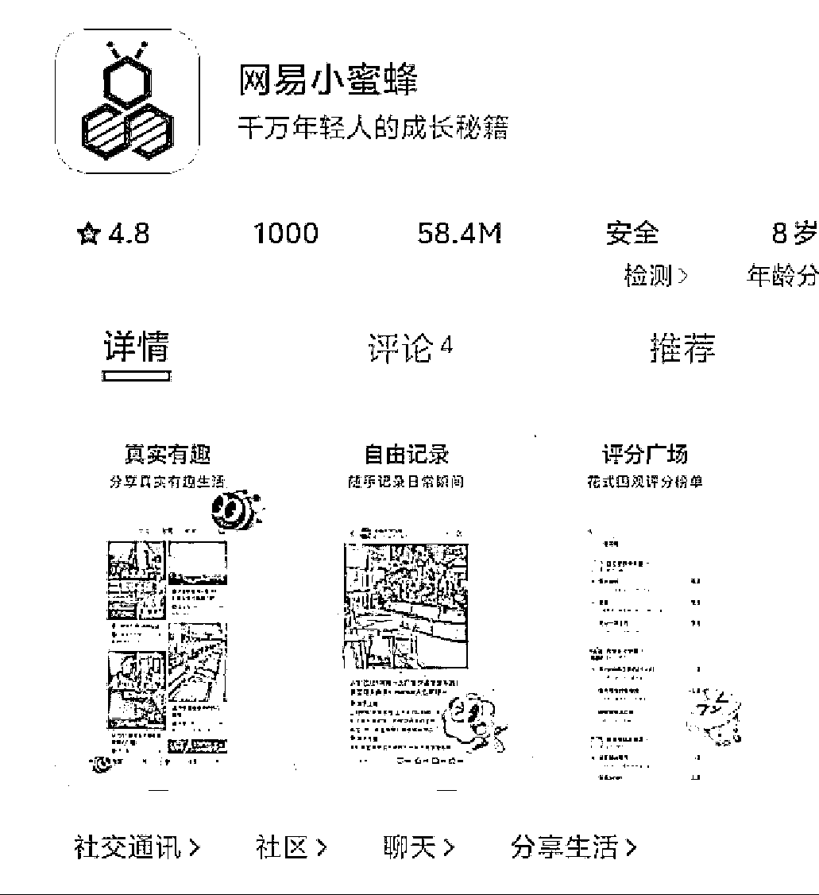

# 高鹏分享热门玩法：再次吃肉的机会

> 原文：[`www.yuque.com/for_lazy/zhoubao/mch955w435h87ic2`](https://www.yuque.com/for_lazy/zhoubao/mch955w435h87ic2)

## (30 赞)高鹏分享热门玩法：再次吃肉的机会

作者： 高鹏圈

日期：2024-11-29

大家好，我是高鹏。

今天继续分享一个热门玩法。

又可以吃肉了，兄弟们，昨天网易重磅上线了一款 app 叫做小蜜蜂。

要知道像这种一线大厂，每次它推出一个新的东西的时候，都是咱们普通人的大机会。

想象一下如果当年抖音刚上线的时候，你就去玩了，还怕做不起来吗？那些千万级别的号，基本上都是一开始就开始玩了。

刚上线的这个小蜜蜂，现在安卓苹果双端都有了。

我也去试了一下，它的页面整体来说还是比较简洁干净的，运行起来也比较流畅。

官方给到的 slogan 是年轻人分享交流日常生活的内容社区。

也就是说它和抖音快手小红书等等一样都是内容驱动的。

从它的页面和功能来看的话，大家可以看出来它特别像是小红书，因为它对标的就是小红书。

大家可以看一下，左边是小红书，右边就是小蜜蜂，排版都是一样的，也是这种双列的瀑布流。

现在的话作为用户，跟小红书一样，可以发图文的笔记，也可以发视频的内容，包括参与一些话题都是可以的。

他跟小红书之间的一个最大的区别，就是它支持职场工卡的验证，你验证了你的职场身份之后，会得到平台更多的支持。

我为什么说它对于普通人来说是一个机会呢？

首先它是大厂推出的，第二是新的平台。

像这种新的平台推出的时候，他都有一个发展周期，大概是会经历这三个阶段。

首先是初创期，初创期就是蛮荒发展的时代，尤其是像这种内容平台，它刚开始没有内容，你就直接去搬都是可以的。因为站在平台的角度来说，平台上没有的东西就是原创。

第二个阶段就是发展期，这个时候越来越多的作者涌入进去，各赛道也会变得稍微的拥挤。

这个时候平台就开始对内容创作者要求内容的质量，以及原创度等等。

最后一个阶段就是它的成熟期，这个时候是最卷的时候了，平台上的创作者已经非常饱和了，各个赛道都相对来说比较拥挤了，你需要去找一些相对来说更加好做的细分领域。

总而言之，越早入局肯定是越容易做起来的。

我们作为普通人到底应该怎么去入局呢？给大家推荐两个板块。

根据平台它的定位和调性以及它的 slogan，你就能够发现它对于职场和生活这两个板块是更加的扶持的。

作为定位和赛道选择来说，这两个板块无疑更容易跑出来。

网易对于种草这一块一直都是虎视眈眈的，就在前不久，它的云音乐里多了一个入口，这个入口的名字呢叫笔记。

明眼人一看就知道他想做啥，明摆着就是想做种草，现在突然单独推出了小蜜蜂，而且非常像某红书，这是铁了心要做种草这板块。

刚才说了两个赛道，职场和生活，它的内容我们怎么来做呢？

一开始我说了，像这种平台初创期，它是比较缺内容的，直接去对标小红书和小绿书的职场和生活这两个板块的内容就可以了。

商业化模式，目前来说平台上有一个打赏机制。就是如果用户看到自己喜欢的图文或者视频内容，可以去打赏。

单次打赏的话就是几十块，但是它现在是不限次数的，有点像公众号里有人发了文章，别人觉得你的文章不错，下边挂一个赞赏的按钮。

现在这是它唯一的作为内容创作者的商业化模式。

目前关于电商的相关商业模式还没有，但是刚才我说了，他发力的就是种草这个板块。所以未来小红书有的东西它肯定也会有的。

重点就是先瞄准你自己的领域尽早的去入局，先把号做起来，这是最关键的。

这就是今天给大家分享的这个机会。

因为它是对标的小红书，所以你去他平台上去玩的时候，就直接参考小红书的玩法就可以了。

关于小红书上生活和职场这两个板块，我这边有三套小红书的玩法，里边包含有几十节的视频课，统一放到文档里了：[`svj4gxvm0v3.feishu.cn/docx/DzpbdyyPgopeVYxxnRycRqaqnMe?from=from_copylink`](https://svj4gxvm0v3.feishu.cn/docx/DzpbdyyPgopeVYxxnRycRqaqnMe?from=from_copylink)

我是高鹏，深耕网创 9 年，这是我拆解的第 697 个落地项目玩法，更多项目玩法，欢迎找我聊聊呀~

* * *

评论区：

璟曦 : 一刷帖都是网易的和大学生在发😂

ToNet : 和脉脉有啥区别