# 人工智能在医疗诊断中的应用与挑战

> 原文：[`www.yuque.com/for_lazy/zhoubao/lpvowcip5u4ow6zn`](https://www.yuque.com/for_lazy/zhoubao/lpvowcip5u4ow6zn)

## (22 赞)人工智能在医疗诊断中的应用与挑战

作者： Sitin 彭涛

日期：2024-11-29

大家好，我是 Sitin 彭涛，连续 3 年超百万收益的 90 后创业者。

我的千里会创办满 3 个月了，从 2024 年 08 月 26 日-11 月 26 日，3 个月的时间收入超 90W+，首次公开复盘我这一路来的发售、交付细节操作，主要分为六大步：

一、灵感源泉：用户需求，同行调研

二、爆款秘诀：精准定位，卖点聚焦

三、小步快跑：灰度测试，组合出击

四、趁热打铁：迅速交付，惊喜连连

五、顺势而为：集中资源，引爆市场

六、真心感谢：铭记于心，外化于形

希望能帮助到同样准备做高客单价产品的朋友们！

## 一、灵感源泉：用户需求，同行调研

我做千里会这个合伙人产品并不是心血来潮，我是从 2018 年开始做公众号创业的，一开始做客单价比较低的副业有道星球、写作赚钱星球、各种小报童产品，到后面三位数的出海赚美刀社群，四位数的 python、AI 爆文、AI 代写等训练营，我做了不少产品。

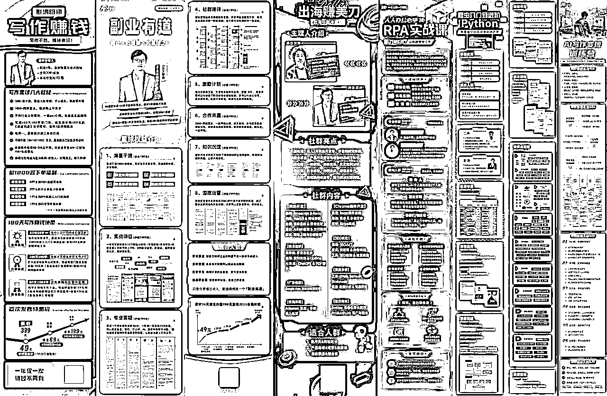

这些年，我也凭借自己和团队的认真交付，收获到了一批铁粉，他们总是无条件支持我，无论产品高低。有一天，我的铁粉问我：能不能有这么一个品，买了之后，我后续出的品可以给铁粉打一波折扣？

我当时就觉得是应该去回馈一下我的铁粉，同时我也发现了目前的一些问题：

1、我的产品线很多，最长时间陪伴的品就是训练营，最长 2-3 个月就结束了，有些比较支持我的用户在训练营结束后的问题其实不好解决，他们需要长期陪伴；

2、我也需要给一些一直在买我很多产品的铁粉一些福利回馈，至少他们不需要原价再买；

3、目前支持我的铁粉散落在我的各个社群，触达起来比较麻烦，我大概率需要一个地方，把我的铁粉们聚集起来，同时带他们赚到钱。

想是这么想了，但是解决起来并不容易。例如我的大多数高客单品会有合作的讲师，如果要给我这边铁粉折扣，这个折扣比例不能妨碍到合作讲师的利益，又比如说如果给价格福利肯定是面向所有铁粉，有些学员是原价购买了我好几个高客单品，那到时候就会觉得自己多花了钱，观感就不太好...

为了响应用户需求以及存在的产品体系问题，我花了六位数购买了市面上的大多数同行产品，去感受他们的运营模式，发现觉醒的生态做的不错，但好像也有一些地方不太适合我这边的情况。直到 4 月份去和阿猫老师线下见面，发现他对私域运营了解透彻，我当时就马上购买了几万的觉醒商业私教，请他帮我给这个品提一些指导性意见。

我在生财有术好几年了，也经常刷帖子，看内容，研究商业模式，当时很多灵感都是从这里来的，非常感谢这个圈子。毫不夸张地说，这里应该是学习同行、和同行交流最合适的地方。

## 二、爆款秘诀：精准定位，卖点聚焦

后来我们就商量怎么把这个产品卖爆，把所有产品梳理分类后，总结出来 IP+项目肯定是可以打的，但如果仅仅是项目+IP，差异度很小，IP 基本上都是这个模式，如何凸显出我们的卖点呢？

一开始还想过是不是可以讲编程这个点，后来给否了，因为对大多数人来说，编程这个还是很让人感觉有难度，在咨询阿猫老师的建议后，又和自己内部团队反复商量，最后打出了 AI 这张牌。因为目前市面上 AI 相关的合伙人产品比较少见，而这个又很符合我的未来发展，我本身也准备在 AI 领域深耕，又很符合我当下的定位，比如我手头就有不少 AI 相关产品，AI 爆文、AI 代写等等。

关于定价，说实话，我一开始是奔着万元圈子去做的，所以福利拉的很满，我旗下几万的产品都拿出来赠送，并且还赠送了一期重交付的 AI 代写训练营，还有我的 1V1 咨询，超多的流量赋能等等，起码也得定个 1 万块钱吧？

但是后来阿猫老师建议我不要一开始定太高，原因是：

1、快速扩充到 100 人很重要，因为这里面的 KOL 也会帮你去卖，这样后面会有更多增长，这个势能和慢慢卖到 100 人还是很不一样。

2、刚开始定太高，后期不好涨价，如果一开始定价 1 万或者 6999，结果卖的不理想，就被架住了，也不能降价，就会很尴尬，倒不如一开始低一些，卖的还 OK 再继续涨。

我觉得阿猫老师说的非常对，所以一开始的内测价（最低价）定的就是 3999，因为真的特别划算，所以基本有意向的都会入，想卖的 KOL 也卖得动。

关于时间，考虑到我自己还交付 1V1 语音咨询这些权益，交付起来会比较吃力，所以一开始我想的是交付 4-5 年，但在阿猫老师指点下，最后敲定的是 7 年。

首先是 1V1 语音咨询，其实可以不用定死，改为早期用户不限次数，后续加入成员限制次数，甚至取消，这样还可以让用户觉得早进早划算一点。另外实际上不会每个人每天都来打电话，但就会让人觉得很值，事实上我在回访的时候，也发现很多人是冲着无限次电话咨询来的。而且还有一个解决办法是，每次电话前，有一个详细的流程让咨询人准备好充足的背景信息和需要询问的问题，这样交付的效率会很高，每次电话后，让咨询人写复盘发到社群，小助理会做好整理，这样一来，也实现了一鱼多吃。

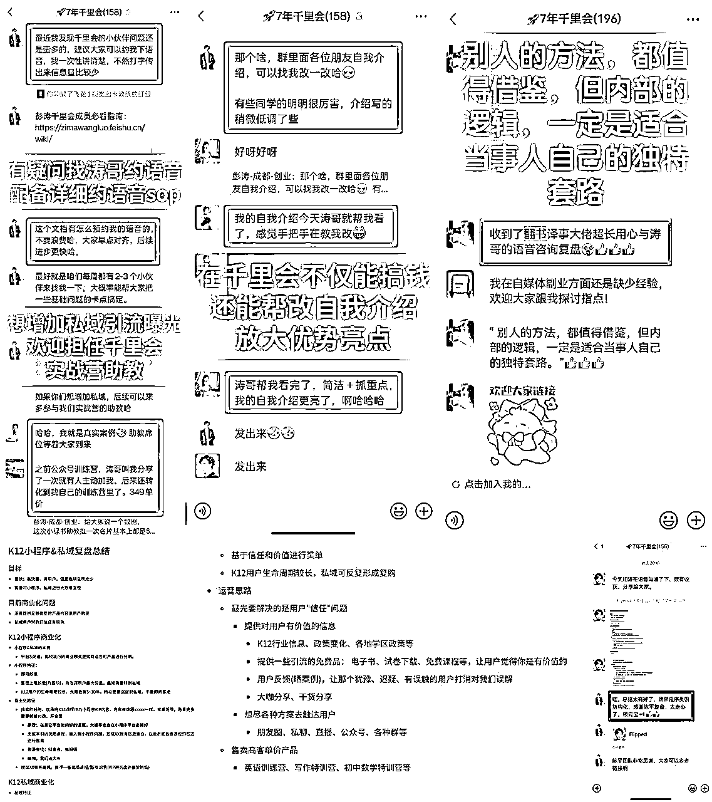

其次是知识付费的续费率其实很低，如果能一次性续费完很长一段时间，其实是赚的，把年限拉长，用户一看一年才几百块钱，就会觉得占便宜，很想买。

这里真的感谢阿猫老师的指导，从开始就把调子定下来，后续的一系列动作才可以达到预期，私教名不虚传！

## 三、小步快跑：灰度测试，组合出击

产品权益和卖点捋完后，因为海报设计还需要时间，所以我就先拿着锤子便签和一篇写清楚自己为啥做千里会的初衷的公众号文章，去做灰度测试。我也总结了 4 个很重要的地方：

##### **1、社群：铁粉群——高客单价群——自己的普通付费群——其他人的高价付费群**

灰度测试要讲究顺序，先熟悉再陌生，先高价再低价。因为我的社群有几百个，所以当时我们团队的小梦就直接拉了一张表格，把我所有的社群按价格排序，给我节省了不少时间。

在社群的宣传文案有两个细节很重要：

一是说明我现在在内测，外面没有公布这个品，只有你们能享受这个内测价，让铁粉感受到被重视。类似话术有：“请大家千万不要外传，因为还在内测中”，“大家已经是超级铁粉了，提前和大家说这个消息”，“到时候的发售价格应该在 5000-10000 的范围，但是咱们是铁粉，只要 3999 元！！！”

二是发文案的时候，要注意哪些用户跟自己互动，每个社群发完我都会在微信上备注千里会意向，方便后面我私聊时能精准成交。

##### **2、朋友圈：盲盒、连续剧**

这也是阿猫老师传授的一招，循序渐进地在朋友圈展示自己卖的一个过程。

第一阶段：可以说说自己的商业认知、自己的想法，想做一个圈子来和支持我好几年的兄弟们一起做点事情，主要是说自己为什么做这个品？

第二阶段：说明自己已经在内测了，但是具体权益海报还没出，只在几个铁粉圈子里试运营，已经多少个人购买了，感谢支持，一定用心交付等等，勾起朋友圈的好奇心，同时也是为后续自己正式开卖做一个铺垫，让大家有一个心理预期。

第三阶段：说自从透露出有这个品，太多人来问了，海报都还没出，真有兴趣的可以私信来看权益，接受盲定。

第四阶段：我当时是在七八十的时候开始说，已经盲定了快 xx 个人了，群内大佬真的很多，好有安全感，满 100 人的时候会群内发大红包！这段动作也帮助我迅速突破了 100 人的关卡。

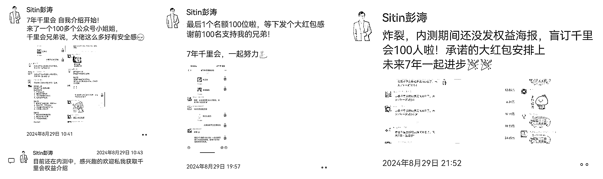

保持 1 天起码 5-6 条的频率，让用户像看电视剧一样。这里也有一个管理小技巧，我会把有用的截图发到内部团队群，让团队小伙伴提供一些可以写的灵感，我再完善发圈，这样大大节省了我的时间。

##### **3、私信：主动询问痛点**

私聊成交很重要，尤其是高客单用户。

我会在私信前看看客户之前跟我的所有聊天记录，不得不说，黑科技真的好用，这也是我能够轻松管理 10W+私域的原因，对客户有一个大致了解后，我会表示一下真的很感谢之前的支持，再结合他自身情况分析为什么他适合加入千里会。

这里也提醒我们一个点，这种高客单的铁粉平时是需要回访维护的，像我之前就会在训练营交付期间定期回访，询问学习进度，甚至给到资源支持，大家就觉得我挺靠谱的，因为平时有联系，所以这时候去私聊售卖，也有话题可聊，并不会尴尬。

##### **4、回访：问为什么加入**

用户证言极为重要，可以清楚用户更期望哪些交付，让我们后续的交付更加丝滑，客户更加满意，还可以借此机会清楚哪些权益用户更喜欢，调整迭代自己的宣传文案，而且通常这种回访时，用户还会提供很多好评，简直一举三得。

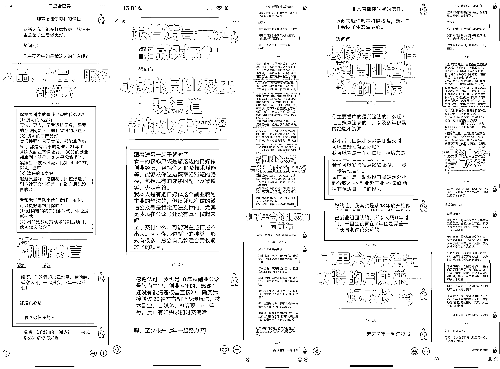

说实话，作为一个 i 人，初期每天私聊 20 人左右，真的有点累，但这个回访动作，让我得到了很多的用户反馈，有些真的挺暖心的，我突然就觉得累也值得，更应该好好做好千里会，让追随我的兄弟都能有所收获。

## 四、趁热打铁：迅速交付，惊喜连连

内测期间就收到了 150+铁杆粉丝的支持，其实我是挺受宠若惊的，毕竟四位数的客单价，对很多兄弟来说，可能是半个月甚至一个月的工资了，兄弟们如此支持我，我也愿意拿出 120%的诚意。

除了每天在千里会群里给大家输出一波干货，一有空就私聊千里会成员询问大家需要的支持外，还带着团队伙伴一起卷起来，那段时间半夜十一二点还在确认工作细节是常态。

但时间花在哪里，收获就在哪里。

2024 年 9 月 1 日，千里会旗下产品一览表&千里会成员成长地图正式与大家见面。

产品一览表里不仅包含了我旗下 AI+项目+IP 所有产品，分佣多少，如何兑换都一目了然，成长地图还分为通用地图、三大方向地图，只为让大家更快更清晰了解在千里会的产品资源以及如何学习，直到现在，这些文档依旧在不断完善更新，只为给大家展现更优质的服务。

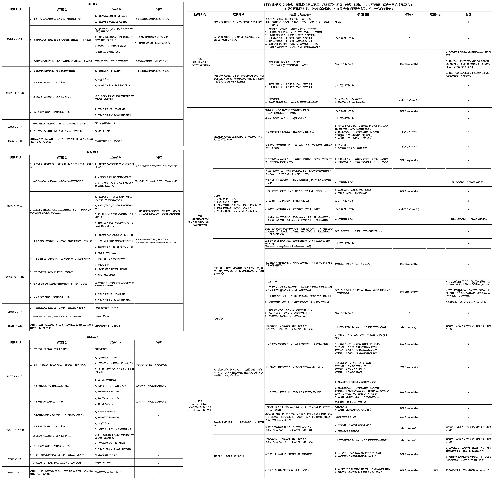

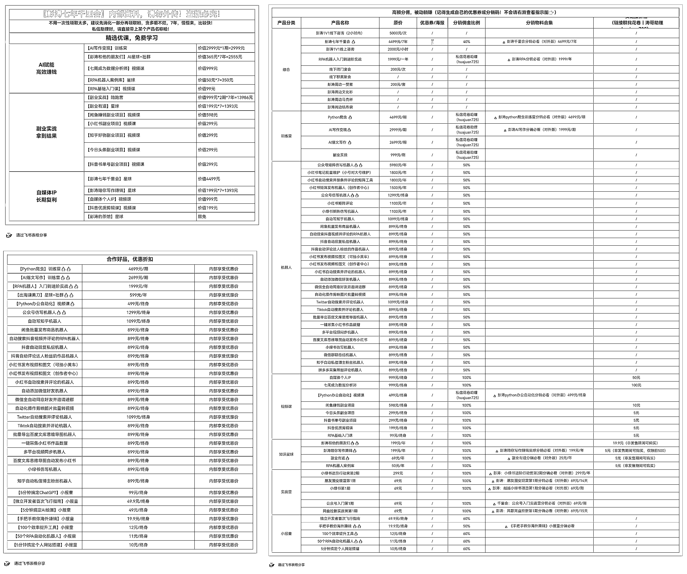

2024 年 9 月 10 日，千里会新人内训暨第一次圆桌对话。

一个小时的圆桌会议，看似不长，但想呈现一个不错的效果，背后也需要花时间去筹划。从开会讲什么、什么时候讲、具体的材料准备、以及会后由什么承载回放链接、邀请大家参与复盘小活动......每一个环节都需要打磨丝滑，做得越细节才越容易给出超预期的交付，当时收获了特别多的好评。

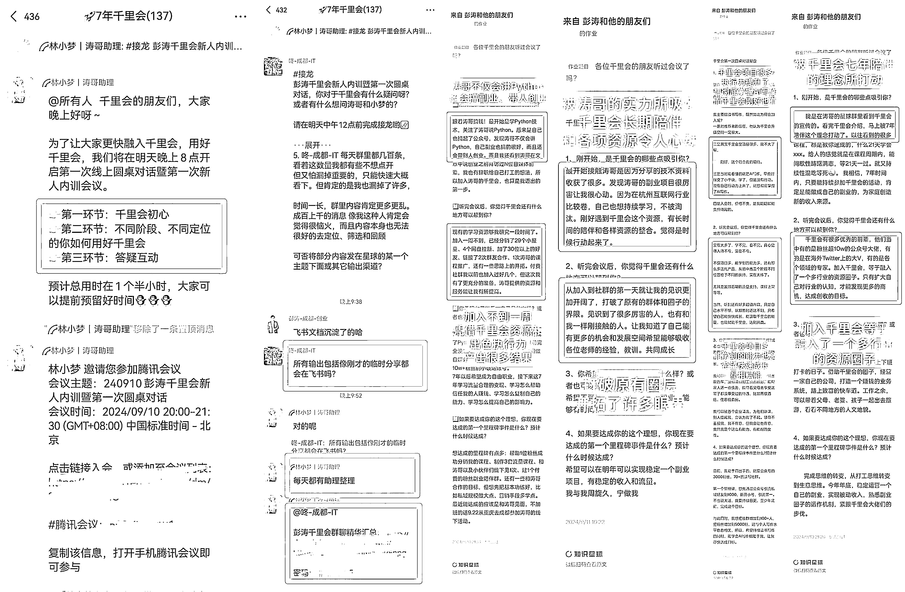

但做到这一步好像还是差点意思，于是我又私下花钱请有结果的教练带着大家一起做项目，千里会的副业项目也因此全面开花。

2024 年 09 月 12 日—09 月 27 日，千里会网盘拉新赚钱实战营；

2024 年 09 月 27 日—10 月 09 日，千里会公众号快速入门实战营；

2024 年 10 月 09 日—10 月 24 日，千里会小绿书项目实战营；

2024 年 11 月 11 日—11 月 24 日，千里会朋友圈变现实战营；

2024 年 11 月 12 日—12 月 12 日，千里会小绿书进阶变现行动营；

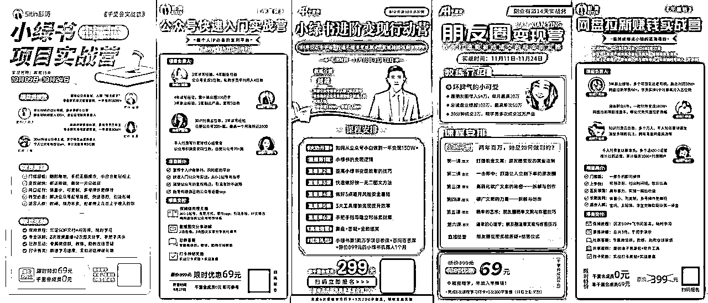

都是团队精挑细选的，且打磨了一次又一次的项目训练营交付 SOP，不仅有保姆级教程，还有沉淀问答库，适合所有对副业感兴趣、零基础的小白随报随学，千里会成员全部免费学习，且 100%分销。

很多兄弟感叹“项目根本学不完”，加上交付确实也不错，所以大家吃了定心丸，打心底里相信跟着我有肉吃，除了跟着做项目赚到钱的兄弟，还有一些擅长销售的也借着我的训练营把门票赚回来了。截止目前为止，5 个项目实战营我就发放了 XX 元佣金，还不包含给大家颁发的里程碑奖励、其他礼物奖励。

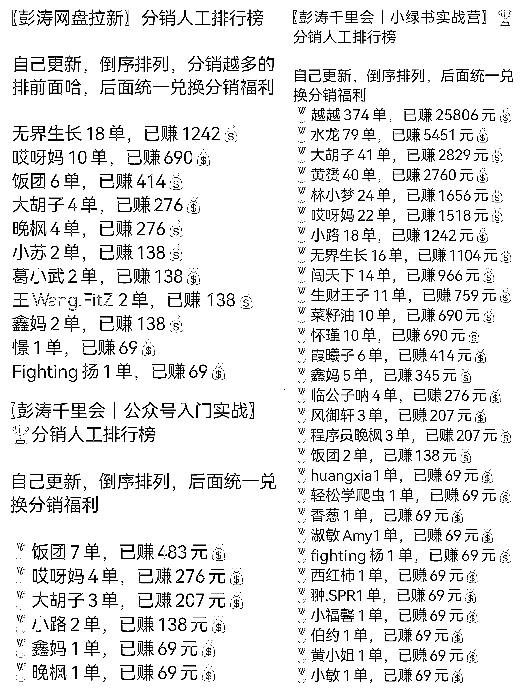

而不断涌入的新流量，尤其小绿书，直接带来 1000+人，让我又看到了新的趋势，目前团队给千里会成员的交付已经撑得住，是时候筹备公开课了。

## 五、顺势而为：集中资源，引爆市场

千里会“万事俱备”，也预热的足够久了，是时候借助“外部的东风”来放大势能了。不吊大家胃口哈，10 月 24 日—10 月 30 日，通过为期一周的公开课，千里会成员又增加了 52 人，发售业绩为 23.3W。至此，千里会已经来到 200+人的里程碑式节点，千里会生态也在稳步扩建中。

而能取得如此好的成绩绝不是我一个人的功劳，这里面也包含了大家的倾情支持，简单分享三个我认为会影响整体效益的要点：

## **1、流量要足够大：公开课邀人+连麦嘉宾双管齐下**

在公开课筹备期，我们私下与许多 kol 就紧密联系过，确保有足够多的 kol 可以帮忙打榜拉新，这里还有一个小细节：不过早拉 kol 进群，因为战线拉得太长、群内陆续进人的话会造成大家注意力疲软，所以当时确认可以帮忙打榜后，我给大家都备注了标签，在打榜前一周才正式邀请大家。

既留有足够的时间让 kol 帮忙拉新，又能让大家在动力充足时进行冲榜。并且我还邀请了 7 位大咖助力连麦：阿猫老师、微笑哥、水龙老师、蓉儿老师、靠谱老师、临公子、理白老师。在各位 kol 和连麦嘉宾的联合助力下，公开课人数达到 7137 人，这也为后期打胜仗做好了坚实的铺垫。

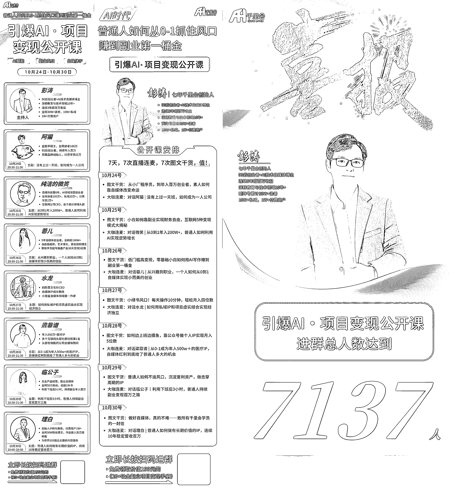

## **2、内容要够硬核：副业项目+公开课分享交付到位**

在公开课前期操办的三个副业项目，不仅让千里会成员安心学习，同时也让愿意前来协助的 kol 看到“为什么要来帮千里会”的价值所在，时不时 show 出“肌肉”很重要。并且所有千里会成员在加入后马上可以参加一期原价 1999 元的 AI 写作变现训练营，交付够实在，是长久生存之道。

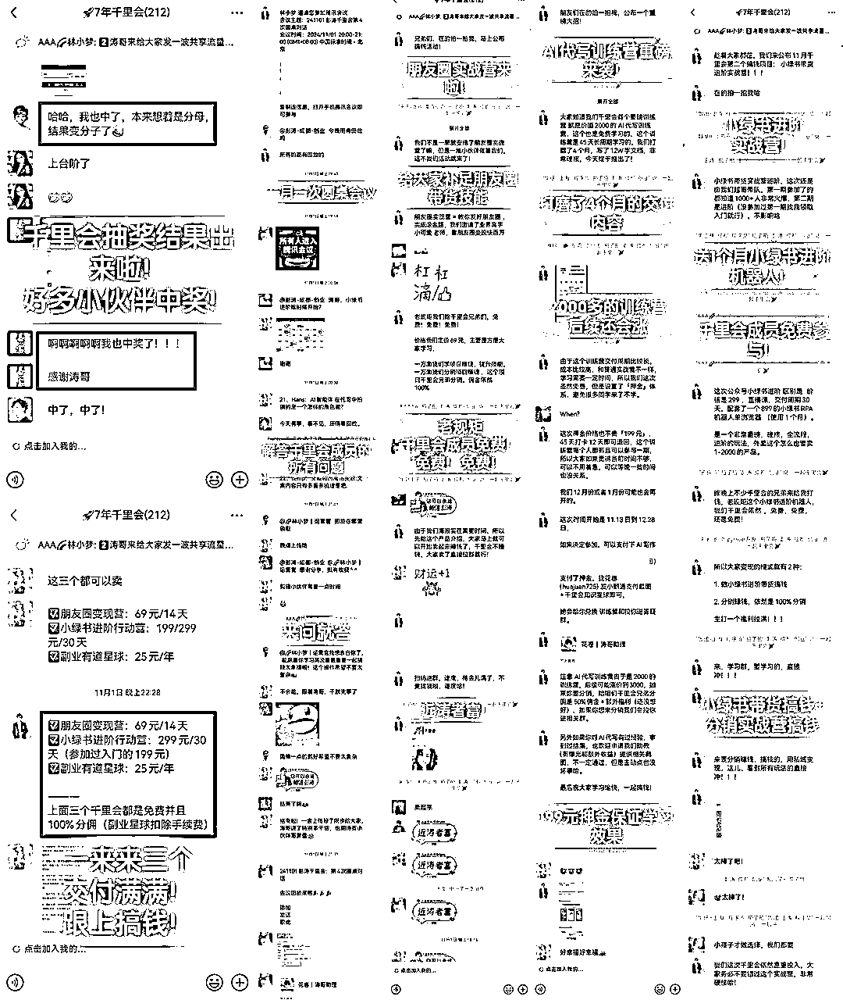

团队一起花心思打磨的 7 篇公开课分享稿，从我的成长故事、3 个副业项目的实战拆解、公众号、个人 IP 以及想对千里会成员说的一封信，几乎囊括了我创业这些年来所有的心法和方法，再经过两位操盘手彩卉、小梦修改润色，每一篇稿子都饱含诚意，也有好些千里会成员因为分享稿想要靠近我，真诚真的是必杀技。

还有我们 7 位嘉宾的超强助攻，不仅带来超多福利权益送给报名的千里会成员，还通过发朋友圈、远超约定的一小时的直播助力为千里会打 call，真的很感动，大家的好我都铭记在心。彩卉老师的直播实力也是非常具有感染力，不管是临场发挥，还是跟单催单，从 20 点-24 点的全程直播助力，把我们都折服了！

## **3、团队协作要给力：外部操盘+内部运营携手并进**

外部操盘：彩卉老师带着团队一起给我们写文案、搞直播、进群溯源、做海报等，井井有条、丝毫不慌是公开课运营的基调，后续跟单催单更是让人拍手叫好，细节拉满。比如提供私聊谈单话术、维护社群氛围、撰写倒计时钩子文案等，全程参与的兄弟应该都感触蛮深的，学习到了很多公开课运营细节。

内部助力：在实战营期间，除了涉及一些重大决策需要我做主外，很多其他事情，如社群运营、海报对接、文案撰写、信息同步等都由我们团队小伙伴们负责，有她们在，我轻松不少，也可以将更多精力集中在千里会向外发展的业务上。就拿跟单这个事来说，当时团队的小梦和虾仁就给我梳理了填写问卷的、直播间互动的意向客户，给我省下不少搜索的时间。

## 六、真心感谢：铭记于心，外化于形

为啥我的团队能连续肝一周依旧干劲满满？因为我就算自己很累很忙，也会去私信交流送去感谢以及每晚下播后给大家发大红包鼓舞士气。

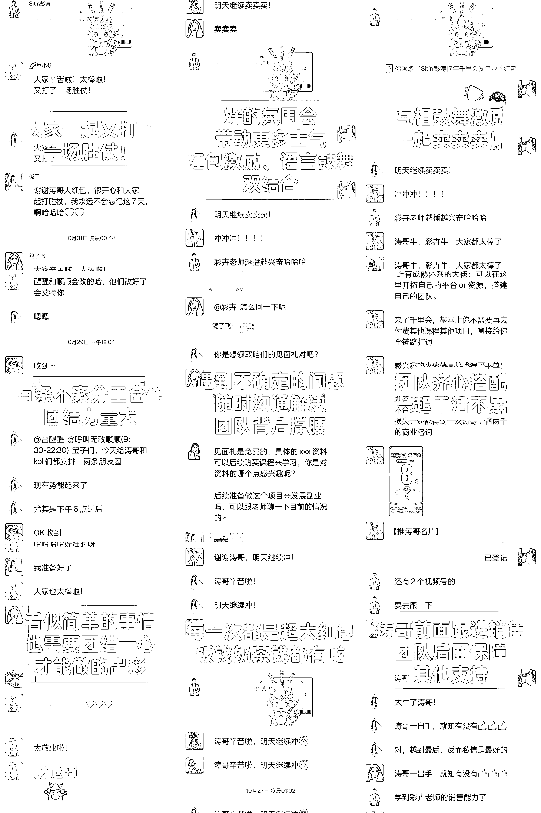

为啥我总是有那么多贵人助力，帮我拉新，跟我连麦？因为我分佣让利足够爽快，比如开 50%分佣，简化收款程序；比如打榜群发一条朋友圈就有 18.88 元，优质朋友圈 18.88~66 元不等的红包；比如拉人进群有钱，后面转化了还有钱，你跟我连麦，我更是会想方设法给你送钱送客户送资源。

看上去是我亏了，实际上是我赚了，千里会的名声就这样打响，很多大佬都愿意帮忙宣传千里会，这个价值是巨大的，有长尾效应的。

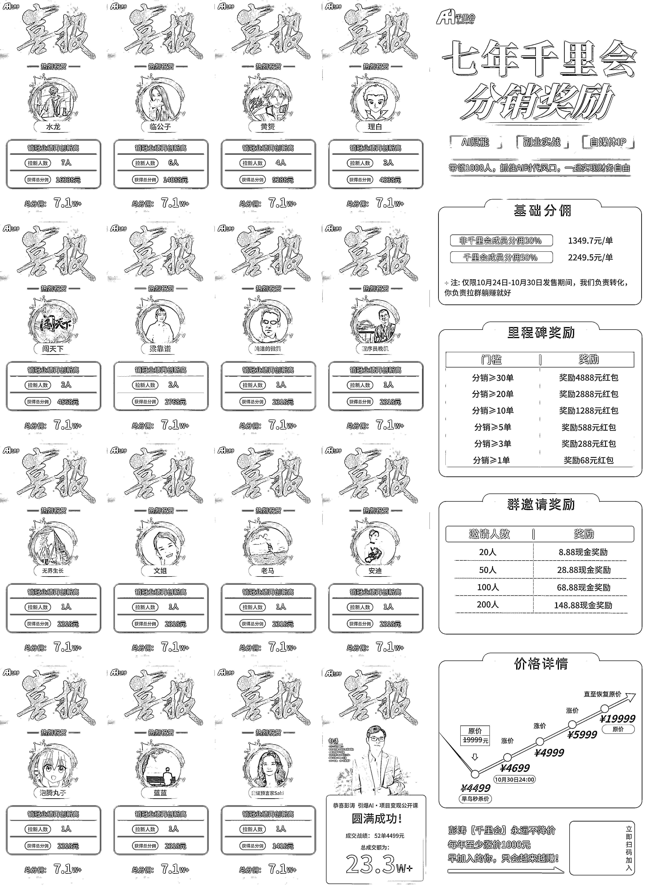

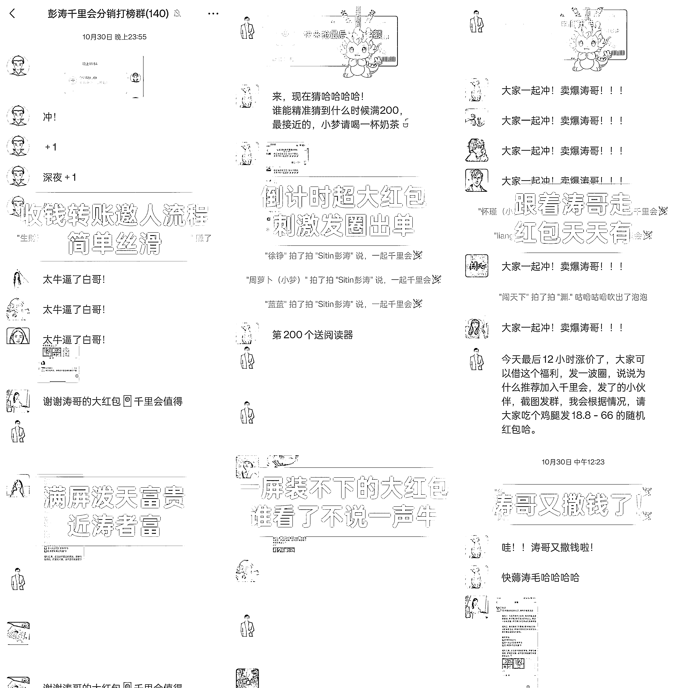

为啥我的产品一出就那么多人买单？就算发售结束了，现在依然进人不停？因为我会感谢用户，在我看来对用户最好的感谢就是拉满交付，带大家赚钱。

说的天花乱坠都不如来场交付更实在，所以从进群欢迎仪式、到 1V1 语音咨询、线上圆桌会议，再到马上花钱请教练再开展新的训练营，带着大家一起学习副业项目，一起分销赚钱......

让大家切身感受到，“我带着千里会兄弟们一起成长搞钱，是认真的！”11 月份又带着千里会兄弟们一起搞朋友圈变现实战营、小绿书进阶实战营、AI 写作变现训练营、闲鱼变现实战营，12 月还有小红书、AI 智能体，主打一个想学什么学什么，想分佣低、中、高客单的兄弟也有合适的选择。

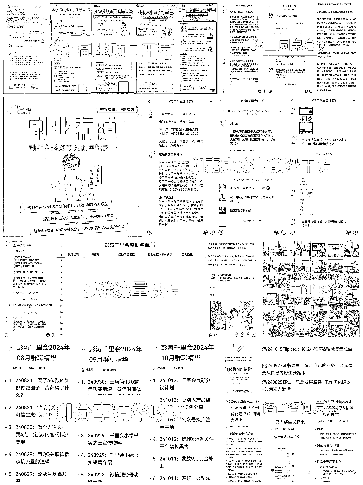

以上就是我的分享，简单总结下 6 条卖爆经验：

一、灵感源泉：用户需求，同行调研

做产品不要凭感觉，而是靠数据说话，真正去了解用户、同行。

二、爆款秘诀：精准定位，卖点聚焦

找到自己的差异化优势，为什么买我不买他？

三、小步快跑：灰度测试，组合出击

社群、朋友圈、私信回访三步走，小范围测试产品的可行性。

四、趁热打铁：迅速交付，惊喜连连

在用户刚付款、最有注意力的时候，马上交付。

五、顺势而为：集中资源，引爆市场

流量、内容、团队协作，缺一不可，学会集中身边所有的力量。

六、真心感谢：铭记于心，外化于形

心里记得别人的好，行动上也要有所表示，说的好听不如做的好看，赢人心，赢口碑，未来更顺利。

* * *

评论区：

亦仁 : 很多图好像没传成功？

Sitin 彭涛 : 啊，谢谢亦仁老师提醒马上检查一遍

Sitin 彭涛 : 检查了一遍，应该是图片多加载慢，都有的哈[拥抱][拥抱]