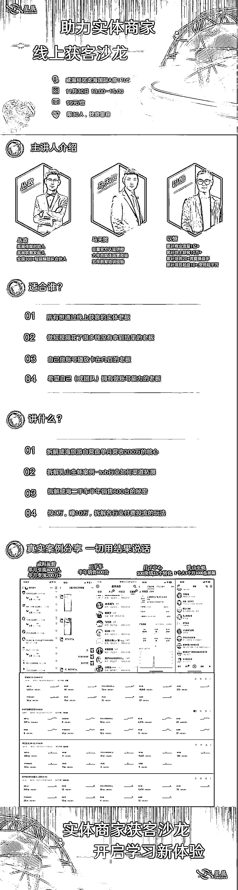

# 利用好投放工具，开本地商家沙龙，每周一次，场场爆满，几乎 0 成本。

> 原文：[`www.yuque.com/for_lazy/zhoubao/ie8rup6wo1y1xc54`](https://www.yuque.com/for_lazy/zhoubao/ie8rup6wo1y1xc54)

## (11 赞)利用好投放工具，开本地商家沙龙，每周一次，场场爆满，几乎 0 成本。

作者： 丛政

日期：2024-11-26

大家好，我是老丛

在过去的几个月，我靠着朋友提供的信息，抓住了一次机会，切入了付费投流赛道，拿到了一定的结果。[`hcn9k3ag2a4j.feishu.cn/wiki/BawswQS5iiEvFt...`](https://hcn9k3ag2a4j.feishu.cn/wiki/BawswQS5iiEvFtkc35McXGS2nGf?from=from_copylink)

之后也把这套打法做了保姆级的攻略在生财做了分享

[`mvdaj1881kj.feishu.cn/docx/Z2gldbBtfoQjNcx...`](https://mvdaj1881kj.feishu.cn/docx/Z2gldbBtfoQjNcx4EGVcD2jyn6c)

最近我又原创了一套新的模型，就是同城线下的沙龙。

大家可能会好奇，不就是开沙龙吗？这个有什么难的或者不一样的？

那我问大家的是：你可以做到每周都开，并且所有人都是付费来的，人数能稳定在 30 人左右吗？

难度在哪里？流量的不确定性。

多数大家都是靠私域，或者是做同城矩阵又或是个人 ip，才能组织一场或者连续多场沙龙，但也很难说周周开。

我们基本做到了通过投流实现客户数量的确定性，以及客户的付费意愿，门票成本能覆盖掉投放成本。让这个模型可以持续的去做。这套打发非常适合短视频自媒体本地生活以及网络公司，其实也可以放大到各行各业。

下面我完整的拆解一下以及把实操过程分享给大家。

1.投放

1.投放

在过去一周大家可以看到，我花了 2497 元，获得了 78 组主动咨询的客户，其中加到微信上的差不多在 50 组左右，来的客户意向很明确就是要参加沙龙，而且我的广告素材里面也说了门票是 99 元，所以除了时间不合适的基本都来了，最后的结果是实际报名人数 24 人，换句话就是，我的投流成本直接被门票费覆盖掉了。而场地就在我的公司，水都是一个客户送的，除了买了点水果之外，就没有其他成本了。

 images.zsxq.com/FnVmQ6Yf6lbtw62XHqOs1d6ib5gD) images.zsxq.com/FlXFQXbJykMlXNNuMrSXRf1ROAY8) images.zsxq.com/FjuioqMIKVi5TOXbB0BppU1xN37S)

2.来的人群都是什么人？

多数都是小老板，行业有餐饮，家居建材，汽车后市场，教培，地产等等，还有一些想学习新媒体的朋友，他们主要的目的就是学习新媒体，学习如何快速起号，突破几百几千播放量，以及如何快速获取精准客户，因为他们的付费能力是有限的，我们主推的产品是投流的培训/代投，以及短视频的陪跑和代运营，客单价在 4980-3 万。

3.抖音进线回复

因为很多人看到广告进线之后没有产生主动咨询或者留咨，所以手动回复很重要，会有一些客户会被钩子话术吸引加到微信上。

4.销转，这个模型最大的好处就是销转非常轻，一个人就能独立完成，而且不用花太多时间。给大家看两组客户的销转。

 images.zsxq.com/Fl23buZmfp8S7vTbfPuw2z6rqIne) images.zsxq.com/Fi58MfdF1OKQ-_qAnd7YPA9oLc5c) images.zsxq.com/FiLopj0T8hz68u9qrzbYb3U_uC8E) images.zsxq.com/Fqvk-JRQ9HbPUKvzj9l5EcXQ--Qe) images.zsxq.com/FsVFFghAVr3JNSH_Jao6KNYJ_7Tw) images.zsxq.com/FmlxI0pnaGZP0EgKCSNK095Tt-a1)

5. 会前准备

签到人员负责登记，登记好之后引导就坐，销售提前分配好客户，客户到的早的和客户聊聊，到点了就正式开始

6.分享环节

我们分享目前很轻，一个主持开场，介绍，讲讲认知做做铺垫，之后我上去分享，PPT 我发到后面大家也可以学习下。之后就是主持介绍主要产品，销售配合意向客户做转化。

剩下的就是打磨分享内容，提高现场和现场后的签单率，整体而言，通过沙龙实现客户的签单还是比较容易的，因为一场沙龙下来，总是有一些高质量客户可以被过滤出来深入洽谈合作方案的。

附件里为沙龙 PPT 和一些物料大家可以学习参考

其实思路放大一下的话 很多行业都可以尝试这套打法，无论是法律，家居建材，教培等等，包括现在做 ai 的 摄影培训的，以及各种类型培训机构等等。都可以尝试。

背景板:

海报：

易拉宝

如果大家有相关需要，我们也有讲师团队可以落地去帮大家做分享和会议。

还有 60 天过年，希望大家都可以在年底拿到结果！

* * *

评论区：

申铭呀 : 干货 我拿到青岛跑跑试试[爱心]感谢大佬分享