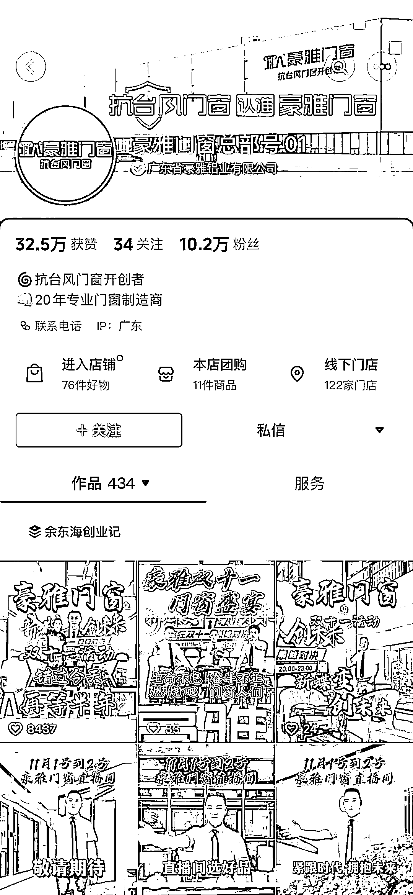
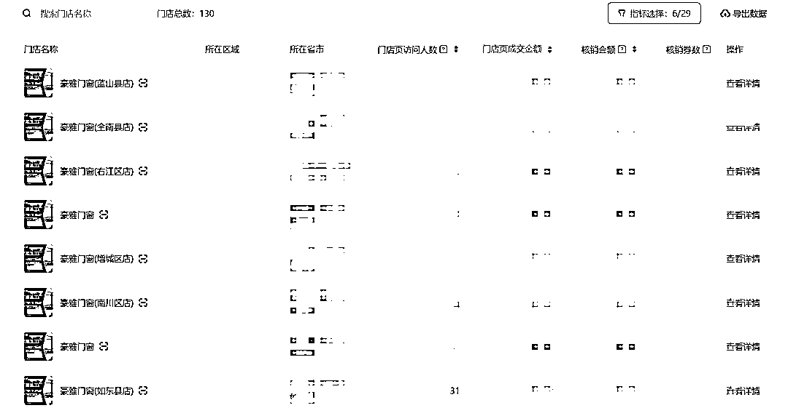
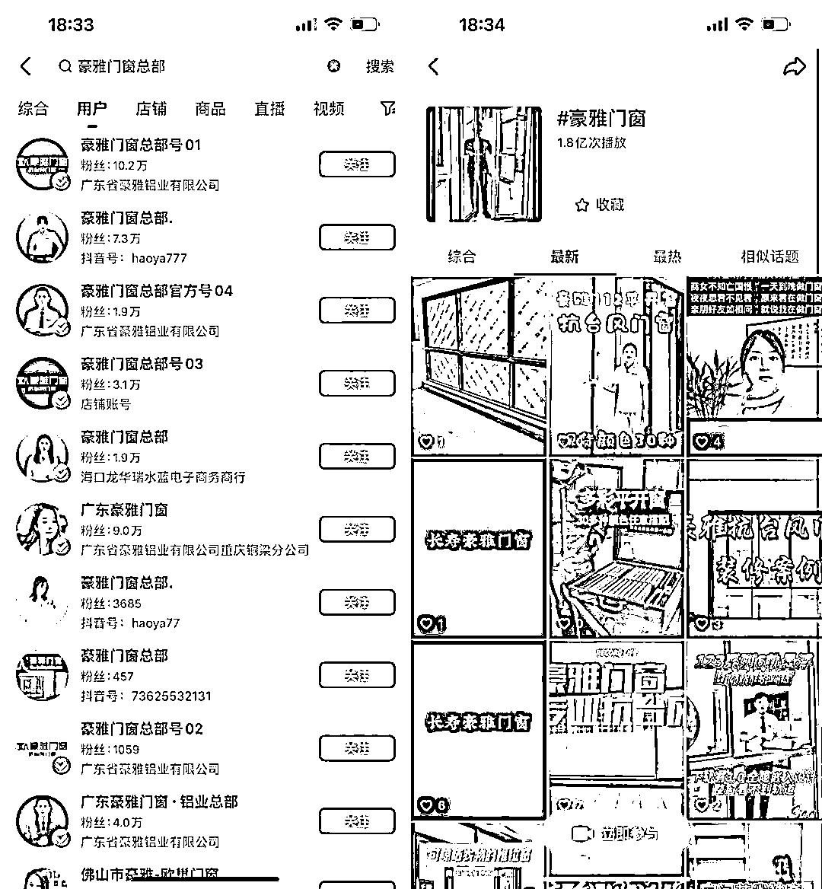
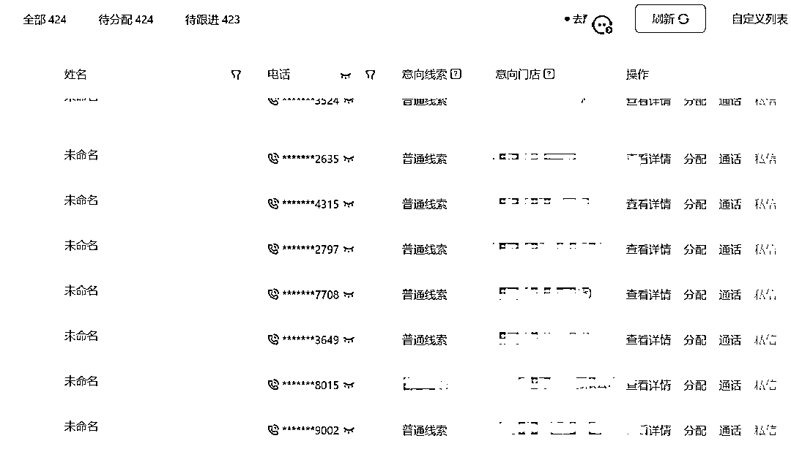
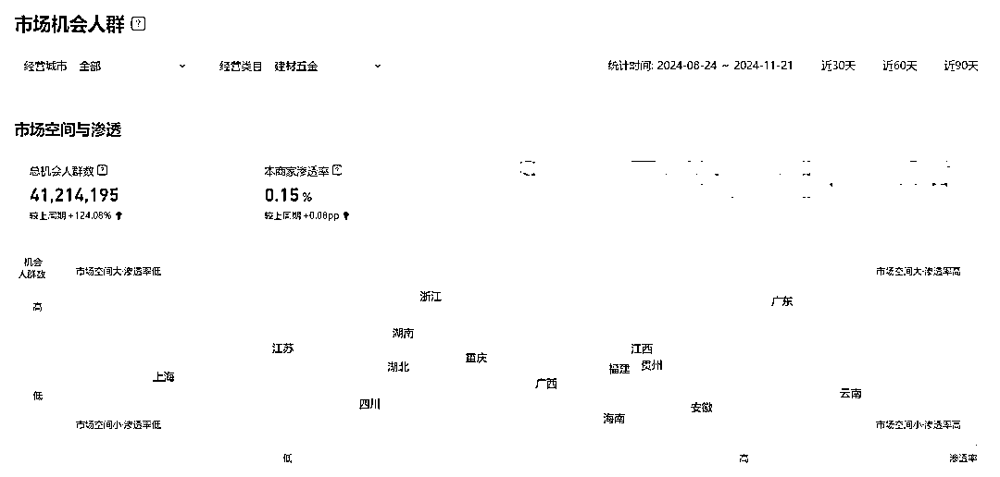
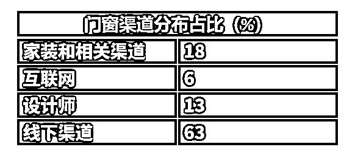
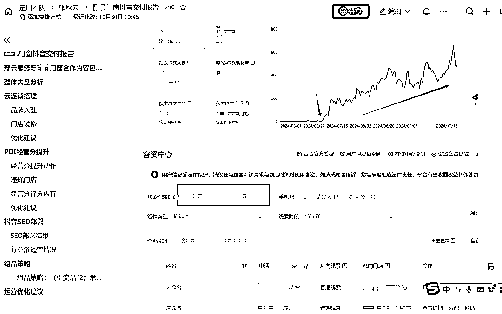

# 建材行业如何找到第二增长点？门窗工厂云连锁增长复盘

> 原文：[`www.yuque.com/for_lazy/zhoubao/sgv7w4m0dmsrgdae`](https://www.yuque.com/for_lazy/zhoubao/sgv7w4m0dmsrgdae)

## (10 赞)建材行业如何找到第二增长点？门窗工厂云连锁增长复盘

作者： 楚川

日期：2024-11-25

大家好，我是楚川，是本地生活的实战派，天鹅到家“单月 GMV 破 7000 万，9 个月 3 亿，1 年 300 多万新用户”的操盘手，超 6000+实体企业服务经验。**并建立了一套可复制、可持续的本地生活方法论。_**

写在前面：这是跟豪雅门窗深度复盘的总结，建议做家居建材的朋友可以深读，也欢迎找楚川探讨。

你必须得承认，抖音短视频颠覆了很多实体行业，甚至包括工厂。

就比如，包括我们自己，也没想过用抖音流量让一家陷入增长困境的门窗工厂找到第二个增长曲线。

### 

images.zsxq.com/FhUWSIHLuRgImAnTzvt63uppoc0F)**短视频可以改变建材行业的竞争格局**

豪雅门窗是一个传统建材工厂，创始人余东海先生在“口罩”之前一直在做铝材生意。

2020 年在绝大部分人足不出户，而铝材是 ToB 业务需要极强的面销才可以成单，这无疑是断了财路。

余总经过几番思考决定向其他博主一样开始拍短视频，在线直连所有的经销商和 C 端用户。

当然这个转型是成功的，也正是这一年的企业蓝 V、IP 的红利期，让豪雅门窗抓到机会，每年在抖音能获得 1000 个以上的经销商增长，**余总成了抖音门窗第一人，整体业绩连续 3 年翻倍增长。**

但是，进入到 2023 年，抖音蓝 V 红利不再，同行竞品也在不断杀入，双重冲击下豪雅门窗也开始增长乏力，亟需新的破局点。

2024 年 5 月余总带领团队找到楚川，想从本地生活赛道再次找到新的增长。在经过多次面谈沟通及摸底后，我们认为可以尝试一轮。

于是协助豪雅门窗梳理经销商体系，选择配合度、转型意愿强烈的客户作为豪雅门窗的首批加盟商，将各门店翻牌变成豪雅门窗的线下网点，**从一个工厂开始组建 140 多家实体门店的地网。品牌总部统一打流量，线下加盟商负责履约交付。**

 豪雅门窗门店体系

再联合品牌总部和经销商的力量做抖音职人矩阵，**从品牌渗透率、抖音 SEO、卖门窗几个方向入手，一个月做到千万以上的曝光基数。**

所有的线索进线后梳理内部运转的全流程，从首次跟进、线索分发到回访都做全套 SOP 梳理，再针对性做局部优化。

2024 年 7-10 月，我们协助豪雅门窗再一次完成了新的升级，最近我们从品牌定位、核心卖点、加盟体系做了调整后，下一轮增长速度会更快。

##### 升级后豪雅门窗的获客

在楚川的角度，当豪雅门窗做到 1000 家连锁店的时候，就具备了从第三梯队的品牌跃迁到第一梯队的潜力，而且在资本价值可以获得更高的溢价。

通过这次合作，我们也坚定认为短视频的确可以改变建材行业（工厂）的竞争格局，加速企业转型，豪雅门窗找到第二增长点后的实践也就是半年时间。

不仅豪雅门窗，所有的建材行业工厂都可以在短视频找到新的增长点。

### 

images.zsxq.com/Frf4u9wrfHWXw48qDeGlzRGwIbtT)**建材行业的真实情况到底如何？**

#### **1、存量用户竞争，大平台开始角逐家装赛道**

建材行业已经进入存量用户竞争时代。过去地产盛行时代，靠渠道和用户主动上门就能吃到饱。现在是用户萎缩，进入存量用户竞争，必将你死我活。

口罩三年时间改变用户习惯，用户主动上门找建材商的行为骤减，直接加速建材行业获客方式的变革。

贝壳 2021 年花 80 亿收购圣都家装、2023 年 15.5 亿收购爱空间，用家庭装修覆盖 14 个城市，代表大佬下场到家装建材行业，短时间快速吃到上百亿市场。

2023 年京东上线装修自营，路边社消息将收购生活家，发力家装市场，此类有存量用户的大平台都下场，让建材商的可生存空间更低。

2024 年 10 月抖音五金建材潜在用户人群，足够看出当下属于流量洼地

从 2024 年的生存环境来看，建材企业就没有退路，只能迎面而上，**在大平台没有下场的赛道中亲自下场获客，直面 C 端用户才是真正王道** 。

#### **2、渠道获客成本连年递增，短视频渠道想象空间巨大**

最近楚川在走访 6 个城市的家装公司，也包括土巴兔装修平台都了解到目前家装公司获客成本连年上涨。

**其中南京、芜湖、深圳的成交成本均在 12000 元以上，毛线索 800 元以上。**

以门窗为例，作为装修公司的供应商，那利润肯定会一直萎缩到负值。豪雅门窗的余总明确表示，2024 年 8-9 月铝材销售和家装公司供应版块属于亏损状态，直连门窗经销点的体量在增长。

从中国门窗品牌的销售通道来看，传统实体店渠道 63%为主要方式，而互联网仅为 6%，那就说明还有海量空间可挖，短视频无疑就是一个自带筛选功能的销售挖掘器。

再从门窗品牌的 4 个可建立的壁垒来看：**品牌壁垒、研发设计壁垒、销售渠道壁垒、大规模交付壁垒** ，只有第三项为当下最简单、最容易建立的。

按我们的计划，豪雅门窗 2-3 年内做到全网 2-3 亿传播量，**成为抖音渠道销售第一** ，这就是销售渠道壁垒，未来再拓展到视频号、小红书，做全渠道营销、用户心智建立，还是有想象空间。

一切已有参考答案：自媒体是建材企业的最快跑出来的赛道，**天网地网做好营销壁垒** ，留存足够多经销商和 C 端用户，**最后终成行业知名品牌。**

#### 

images.zsxq.com/Fht9MJaNKiN6wPOo_KAwO_rJGw0j)**建材行业如何在存量用户竞争中突围**

那如何门窗建材行业如何能在这种竞争中突围呢？楚川走访了 10 多家公司，也得到以下 3 个答案：

#### **1、真正尊重线索，尊重用户，内部流程化做提效。**

我们认识不少公司在用新媒体渠道获得线索基本上没有认真跟进，流量漏斗和销售管理均没有做好，导致成本上涨，用我们的方法 6 个月左右，至少可以优化到 50%的原有成交成本，特别优秀可做到 5-20%。

#### **2、企业卷内容能力，挖掘用户需求点，击穿一个细分领域。**

短视频渠道适合快速转化和成交，必须要求精准线索，因此我们在产品选择一定是单一卖点、某系列产品打透，豪雅门窗从 10 月开始就定位打**“抗台风门窗”**
，预计未来 1-2 年强行给用户种草，一切短视频场景以这个为主，做到一个细分领域打透打穿，才能降低一切边际成本，从而提高利润。

#### **3、企业全面提升服务质量，从选购、安装、交付做到极致。**

目前在行业中持续有增长的都离不开用户体验服，也就代表用户逐渐觉醒，不再是简单交付就能了事。

2024 年 11 月听到大连门窗的企业传授经验，他们一个区域可以做 6000 万一年，从客户选购、安装、交付做到极致，卫生都会打扫干净，最后售后让客户满意为第一原则。最终用户，就能得到市场救赎。

我是楚川，如果你想获得更加体系化的建材行业打法，可以链接。跟有结果的人学习，才能拿到结果，因为结果不会说谎。

* * *

评论区：

嘉应岛主 : 好久没看到楚川的帖，抢一个沙发

胖大魔 : [阴险]要门窗界的价格屠夫，悍马也来参与一下

楚川 : 干

楚川 : [呲牙]