# 【2024.12航海】从零开始的AI动物故事类视频Youtube shorts实践

> 来源：[https://vebcgzyylx.feishu.cn/docx/A7lSd5SxwoDX20xdqBccgk8LnMh](https://vebcgzyylx.feishu.cn/docx/A7lSd5SxwoDX20xdqBccgk8LnMh)

大家好，我是11月份刚加入生财的新人 Kennan恺南，在经历了大量数据轰炸之后，选择了和自己主业有点相关的AI赛道。很幸运刚进来就赶上12月份的航海，第一次参加航海感觉学到了很多东西。

作为一个运营0基础小白，本次希望通过AI生视频的方式，运营我自己的youtube频道， 学习视频引流和推广的经验。

下面是参考@竹子和@土豆君两位大佬的教程之后，跑通的一份AI生成视频上传Youtube shorts的经验贴。初次尝试，很多不足，请多多指教。

先来展示一下航海两周的战绩：

目前已经发布了9个视频，获得了4000+播放，并且实现了半自动化生产，初期探索比较慢，熟练之后尽量保持日更。

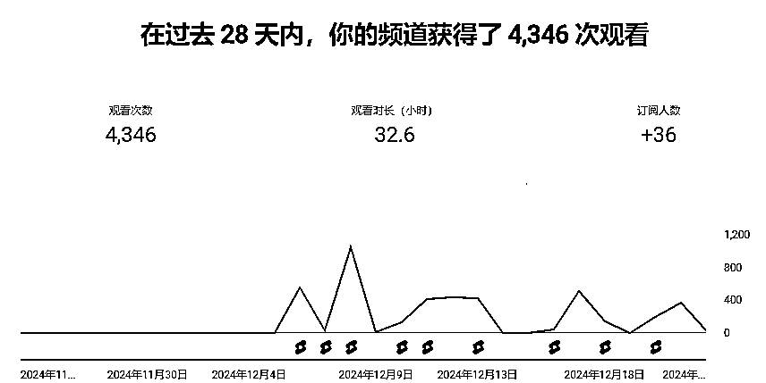

下面是航海这段时间的心得体会和一些经验：

# 一、航海使用技巧

项目介绍：参考12月航海手册

生财有术·AI shorts活动详情

在操作过程中反复阅读手册，我总结了一些技巧：

1.  了解youtube平台，了解shorts

1.  知己知彼，百战不殆。想要在一个平台做出成绩先要了解它的游戏规则。

1.  通过手册可以看到这个平台的主要受众、推流规则、盈利模式，前辈们的总结能让人少走很多弯路，快速融入这个新的“环境”

1.  了解账号注册、科学上网的注意事项，尽量少踩坑，节约试错成本。

1.  大量阅读同类型的经验贴，可以快速了解他的玩法和成本。这个感觉有点像面试刷面经，当你刷的多了就非常了解这个项目了，面对问题都能有所依据，快速突破。（这些帖子我都是收藏以后、反复观看）

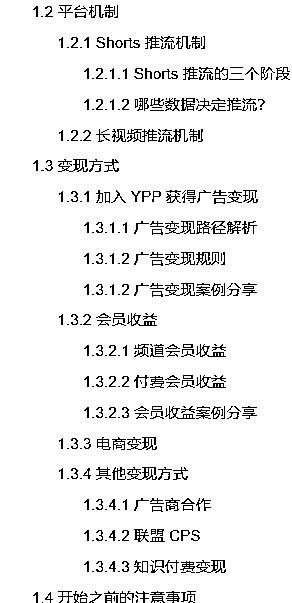

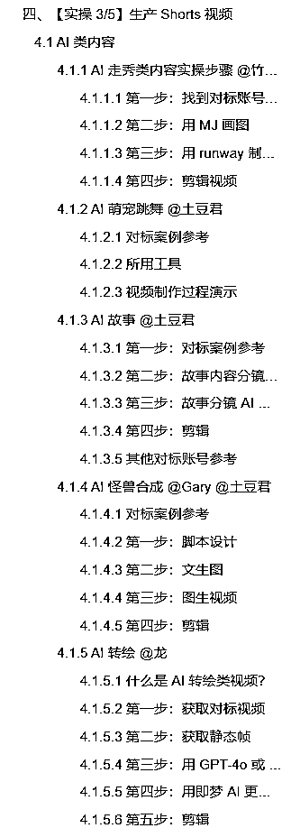

1.  设定目标和计划：

1.  这一点参考了@一页书的经验贴 ，当然最主要的还是亦仁大大的三个月计划提议。

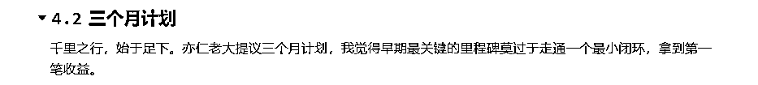

1.  对于实践一个项目，首先要做的是设定好自己的目标，以及有一个可以实行的计划；计划不是一成不变的，可能经历一些调整 ，但是一定要切合实际，符合事物发展规律。结合自己的实践和能力做到合理安排，一边成长一边做出成绩。（下图是当时航海开始的时候，我的航海目标）

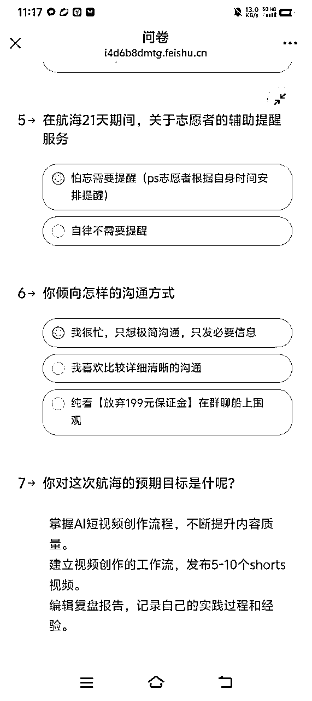

1.  进行赛道分析和定位

1.  手册里介绍了赛道分析的一系列案例，真的是学习的宝藏，学习了几位大佬的成功经验，能够对赛道分析有一个方法论上的认识，很有利于找到自己的目标。

1.  手册还提供了很多技巧和工具，真的是极大的节约了自己去收集资源的时间。能够帮助我快速分析一个账号值不值得作为对标账号，赛道有没有投入的前景。（比较常用的是social blade 和ytlarge）

1.  这里也推荐一手汤姆CC老哥的工具箱，分析赛道收益、频道数据、AI生图等等全都有：

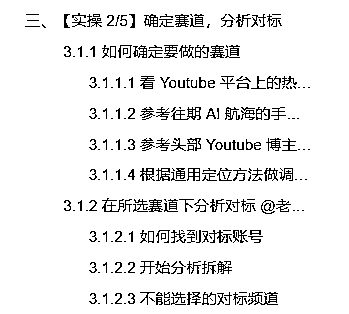

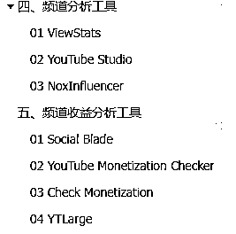

1.  航海日志

1.  航海期间热心的教练和志愿者都会督促我来写日志。这是一个时间表，一个日记本，也是一个助推剂。通过写日志，记录自己每天的收获、困难、以及计划，能够让自己时刻保持在一个理性分析的状态，避免跑错方向。同时也是一种陪伴，每天看到许多同学一起进步，老师们的耐心指导，真的是有一种抱团往前的感觉，很有干劲。

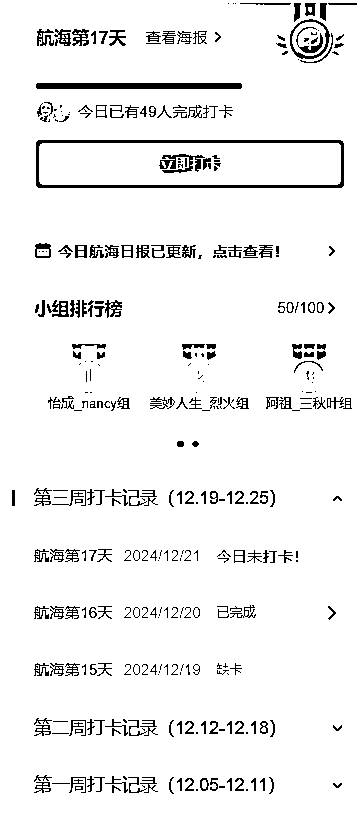

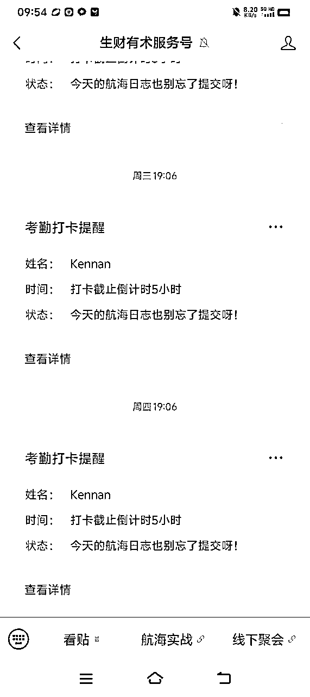

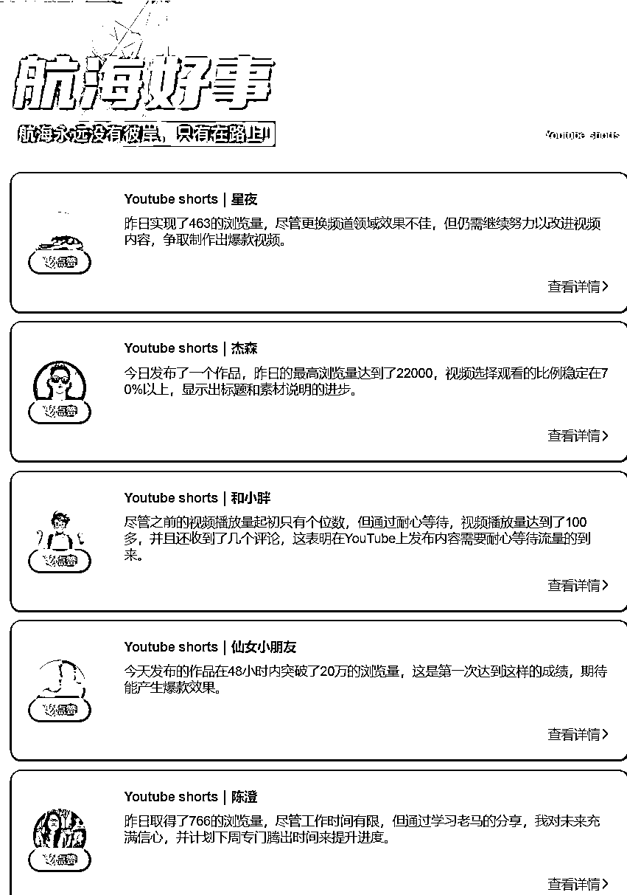

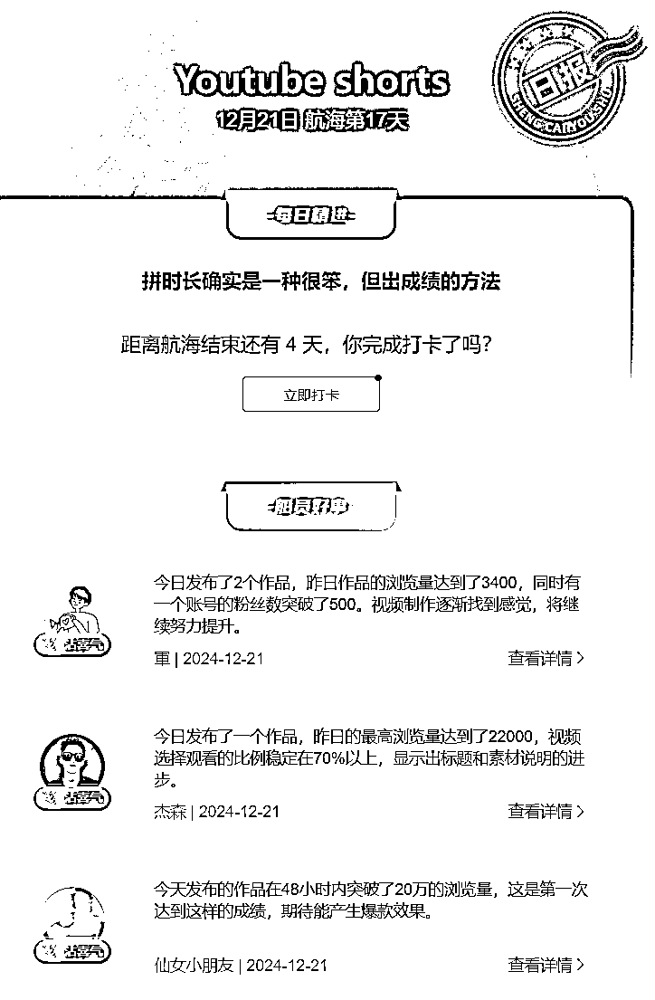

1.  航海群

1.  航海群是一群优秀的人在朝着共同的目标努力，而且每天的努力看的见。能让我们感受到大家都可以，我为什么不行。

1.  #举手 提问是大家开船第一课就要学习的事情，有问题就举手，许多资源会为我们解答问题，有专业的教练意见，也有新鲜出炉的学员经验，特别受用

1.  每天的群公告，领队同学会收集今天的共性问题做一个合集，让大家努力看得见，快速解答同类问题。

1.  教练的日志点评环节，则是让自己的工作流程和记录过程得到一个专业的指导，少走弯路，快速上手。

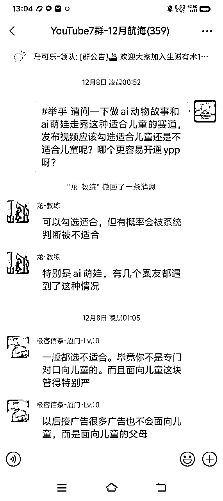

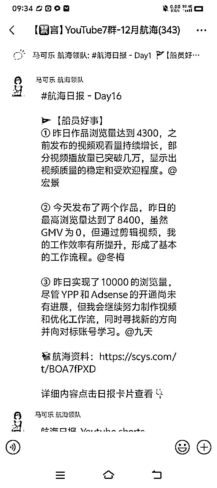

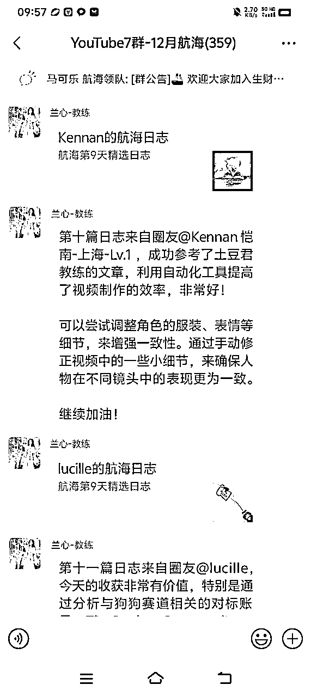

# 二、项目目标

目标一：前期准备（11月航海开始前）

1.  建立并装修YouTube账号。

1.  赛道分析定位，明确面向的人群与自我定位。

1.  对标分析，制定发展规划与差异化策略。

目标二：中期实践（12月航海期间）

1.  掌握AI短视频创作流程，提升内容质量。

1.  发布5-10个shorts视频

1.  编制复盘报告，记录实践过程与经验。

目标三：后期复盘与战略规划（1月航海结束后）

1.  完成YouTube合作伙伴计划（YPP）申请。

1.  实现收益提取与初次盈利。

1.  评估YouTube Shorts发展潜力，确定长期发展方向。

# 三、账号准备

1.  注册账号

科学上网工具，通过谷歌邮箱注册youtube账号*2

1.  开通频道

1.  发布视频

我选择用手机发布，因为手机可以选择封面

# 四、赛道分析和自我定位

1.  为什么需要赛道分析

第一：在当今内容创作的世界中，时间成本无疑是最大的支出。因此，深入分析当前热门赛道，将有助于我们事半功倍，避免走冤枉路。

第二：YouTube上的创作内容每天以惊人的速度增加，海量作品让新创作者在一开始就找到一个创新赛道变得异常困难。因此，最有效的方式是：首先大胆尝试，迅速上手，然后根据数据反馈不断优化，逐步摸索出属于自己的细分领域。在这个过程中，积累经验与技巧是成功的关键。

第三：出海创作的最终目标是盈利。在这一点上，明智的投入产出比分析显得尤为重要。我们需要仔细评估所选择赛道的潜在收益，并对自己的时间和成本投入设定合理的预期。通过这样的方式，我们不但能够确保资源的有效利用，还能为实现梦想与盈利铺平道路。

1.  我的频道定位

赛道分析：

大的原则：要积极正能量、容易扩展、好复刻

1.  收益分析：CPM排名的赛道（排名从上到下）：数据来自：https://www.tastyedits.com/most-profitable-youtube-niches/#elementor-toc__heading-anchor-0

网上赚钱

数字营销

个人理财与投资

教育内容

科技、汽车与小玩意

生活方式

时尚与试穿分享

美妆与化妆

烹饪

健身与健美

电子游戏

喜剧：幽默、挑战与恶作剧

ASMR与莫名满足感

励志与心灵成长

旅行

1.  流量趋势：参考

我的分析：今年爆款都是可爱向的视频，如萌宠、萌娃等赛道，虽然CPM不是最高，但是更容易吸引流量，快速开通YPP。

自我定位：

1.  能力：有AI工具和视频剪辑使用经验

1.  偏好：可爱元素、漫威ip、讲故事。工科i人，希望不露脸、走技术流路线。

1.  不喜欢：恶搞、擦边类型

频道定位：

结合当前的市场情况、流量趋势以及我自己的定位，我觉得我更想做励志与心灵成长的赛道，这部分可以通过动物故事的形式来表现。

优势：

已经出现了很多爆款，会吸引很多青少年、以及刚工作不久的成年人观看。让人休息的时候心灵能够得到放松。

同时动物故事，也可以结合一些科普内容、环保观念等，具有一定的教育意义。积极正能量、更容易被广泛推广。

动物也具有很多的种类、可以提供大量的创作素材，不会过早的素材枯竭。

创作简单，AI生图和生视频在动物这块没有人物要求高，可以生产大量素材用来挑选。

劣势：

大量同质化内容，导致需要有一定的创新性和故事性才能脱颖而出。

# 五、拆解对标账号

## 分析工具准备

1.  流量分析：

使用工具 social blade：https://socialblade.com/youtube/channel/UCeFtgFQGjiUZ2MXBUKKPJBw

重点关注视频播放人数、月度收益、增长趋势

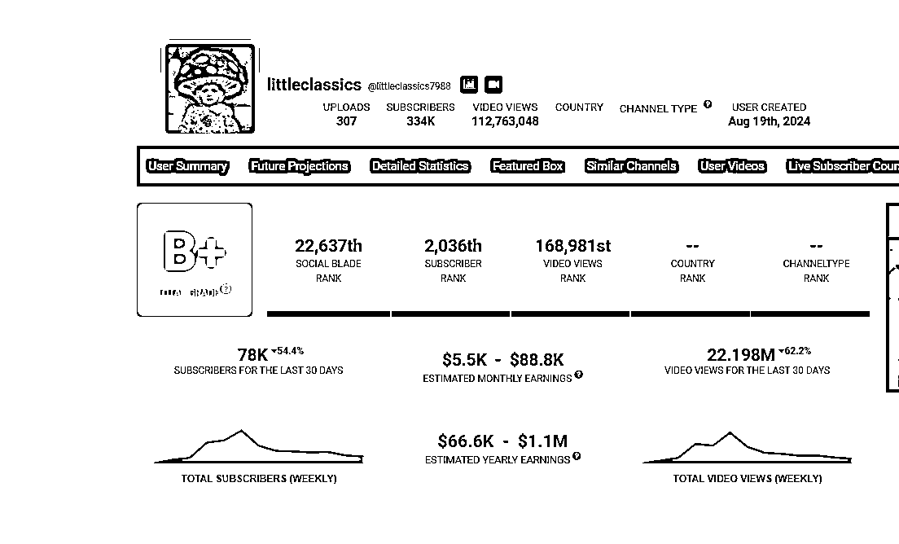

1.  收益情况分析：

使用货币化查询工具 ytlarge：https://ytlarge.com/youtube/monetization-checker/

重点关注货币化、原创度、广告状态这三项。

根据主题的不同，YouTube频道的RPM可能在0.50美元至20.00美元之间。

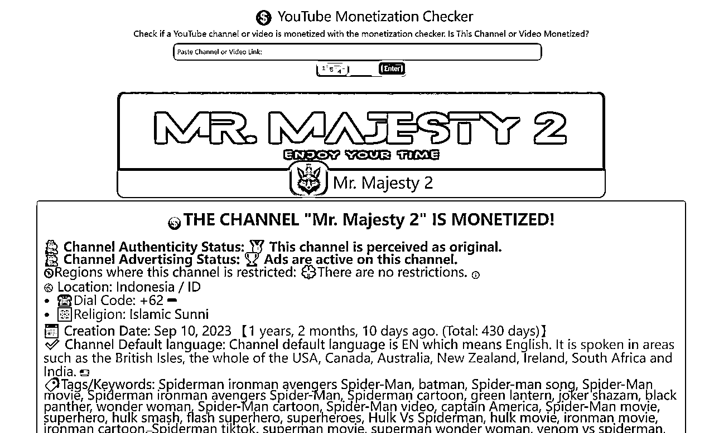

## 拆解6个AI、我喜欢的账号

| 序号 | 账号 | 账号体量 | 视频类型 | 主题 | 收益估算 | 预期制作工具 | 复现难度 | 生财参考 |
| 1 | https://www.youtube.com/@SuperLULU-7 | 17.1w订阅 | 图片转绘 | 漫威+真人 | 因此，此频道的收入可能在64,590.97美元至2,583,638.96美元之间 | 即梦AI画图+剪映+拍露脸视频 | 2星 |  |
| 2 | https://www.youtube.com/@MrMajesty2 | 138w订阅 | 图片转绘 | 漫威 | 此频道的收入可能在754,704.36至30,188,174.36之间，或年均收入在640,621.12至19,218,633.60之间。（编辑估算）根据我们资深编辑的算法，YouTube合作伙伴的预估月收入为$35,491。 | 即梦AI画图+剪映 | 1星（2张图转绘） |  |
| 3 | https://www.youtube.com/@littleclassics7988/shorts | 33.4w订阅 | 动画 | 萌娃走秀 | 这个频道的收入可能介于51,290.40至2,051,616.10之间，或年均收入在217,685.72至6,530,571.51之间。（编辑估算）根据我们资深编辑的算法，YouTube合作伙伴的预估月收入为$4,113 | 即梦AI画图+Runway（首尾帧）+chatgpt脚本+剪映生成视频 | 3星 |  |
| 4 | https://www.youtube.com/@BabyViralTrend | 47.2w订阅67个视频 | 动画 | 萌娃走秀 | 此频道的收入可能在55,093.07美元至2,203,722.96美元之间 |  |  |  |
| 5 | https://www.youtube.com/@RabbitsQuest | 46.3w订阅24个视频 | 动图拼接视频 | 兔子+其他动物+故事 | 非原创风险 | 即梦AI画图+海螺AI+文心一言脚本+剪映生成视频 | 4星 |  |
| 6 | https://www.youtube.com/@gingercat-tv | 148w订阅 | 动图拼接视频 | 猫咪+剧情+文字+语音 | 此频道的收入可能在156,835.57至6,273,422.66之间 |  | 5星 |  |

## 频道装修

拆解https://www.youtube.com/@gingercat-tv这位博主的装修风格，按照萌宠讲故事的方式，装修自己的频道。文案和图片借助GPT生成。

根据对标账号，编辑自己的名称、头像、简介、频道封面

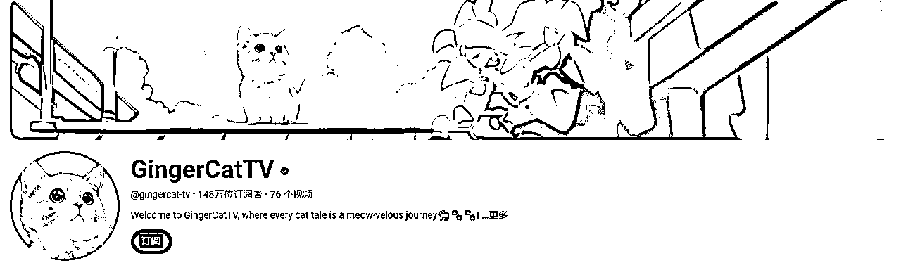

# 六、项目实操：

这里参考土豆君的 ，在大佬的基础上叠加图生AI视频，选择对标视频（youtube原作者也在不断进步，从原来的图拼接故事的无人声视频，变成现在的视频拼接故事的有人声视频）

## 用AI大模型生成分镜（这里采用的是文心一言）

1.  通过AI选定主角动物：

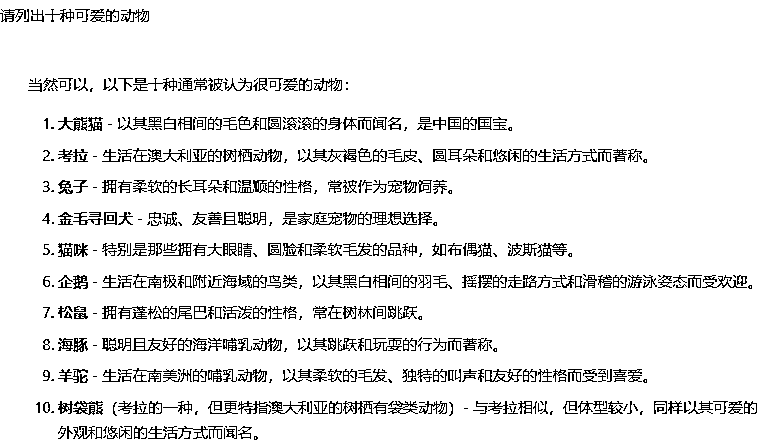

1.  选择一个动物生成故事：我这里选择的小松鼠，描述参考大佬的

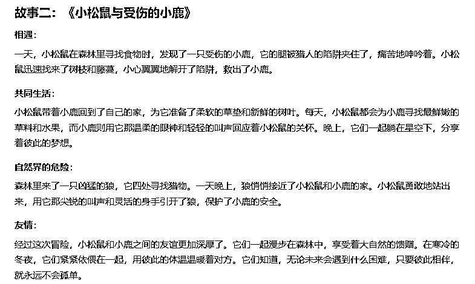

1.  选择一个故事生成分镜：

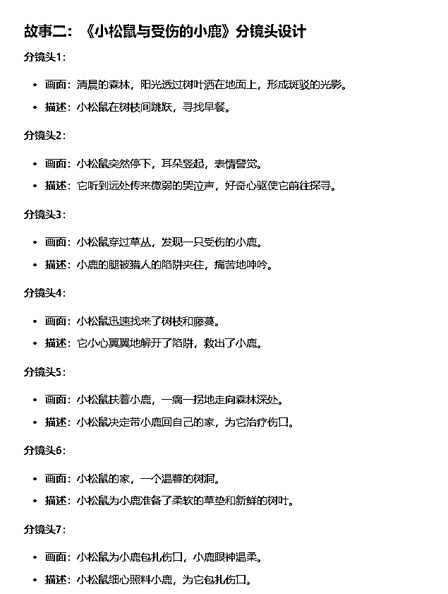

## 根据分镜生成图片

工具：采用免费次数的GPT-4o、即梦AI、可灵ai多方对比

关键点：

注意角色一致性问题（gpt利用gen_id，即梦AI可用参考图），

注意多个角色的大小、位置对比，

注意提示词生成要准确（熟能生巧）

镜头1：

镜头2：

...

## 图生视频

工具：海螺AI、可灵AI、runway

需要注意的问题：

免费次数生成一般有水印；

视频需要适当给一些描述词（否则会遇到生成多个角色，或者动作比较离谱的情况）

看得出来生成视频的效果还是很可以的。

镜头1：

镜头2：

...

## 剪辑成shorts视频

工具：剪映

关键点：

1.  配乐，需要注意版权问题和节奏感，尽量温馨、自然一些 和画面相符

1.  音效，可以结合画面做一些音效，让小动物更加鲜活

1.  视频节奏：尽可能卡点，注意开头要抓人眼球，中间每3s左右一次切换持续吸引人看到结尾，提升完播率

对标视频（上 https://www.youtube.com/shorts/7CRSVC8Qb_M）和我的成品（下）：

## 工具对比和使用感受

工具参考：

在跑通项目的过程中体验了以下AI工具：

生成脚本：

文心一言：国产，免费，文本可用，图片效果差

gpt4o：国外，有免费次数，收费较贵，文本图片都可用，AI天花板

生成图片：

即梦AI：国产，有免费次数，收费便宜，会生成多张图片供选择，可用于低成本验证

gpt4o（备选dall-e3）：国外，有免费次数，收费较贵，生成图片比较贴切，通过genid保持人物一致性

图生视频：

可灵AI：国产，有免费次数（免费要排队），收费便宜，效果较好

海螺AI：国产，有免费次数（排队不要紧），收费便宜，效果不如可灵AI，可用于低成本验证

RUNWAY：海外，收费较贵，某宝可搜共享账号，体验下来效果一般，可能是提示词不对。

建议前期先白嫖免费次数跑通，熟练之后我还是固定采用gpt生词+即梦AI（包月69 会员无水印 可选参考图解决一致性问题）+海螺AI（包月79 会员无水印）的方式建立工作流，免费的是最贵的，时间成本也是成本，大量的生图重试以及排队流程是一笔不小的时间开销。

第一个视频我大概剪了十个小时左右（加上看生财攻略、探索AI工具、反复生图、文档记录的时间），因为是图生视频，所以比起图片故事还多一步生成视频的工作。

确定工作流后第二个视频大概只需要3-4个小时（开了会员之后不需要去除水印、排队、以及切换不同工具），极大的提高了效率。

## （补充）海螺AI自动化工具

当确定工作流后，接下来就是最重要的事情：提效。所谓提效就是复杂事情简单化，简单的事情流程化，流程的事情自动化。既然图生视频需要大量排队和等待时间，那就看看有没有办法让它自动的实现。

这里参考土豆君大佬的：

1.  安装谷歌浏览器插件：Automa https://www.automa.site/

1.  下载土豆君的脚本

1.  导入工作流

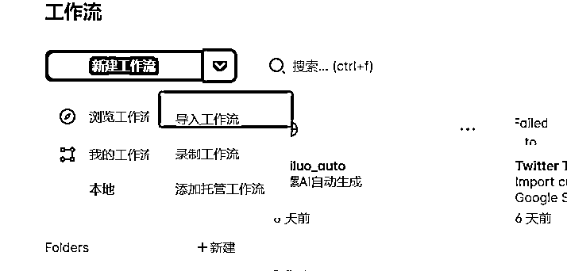

1.  配置图片文件

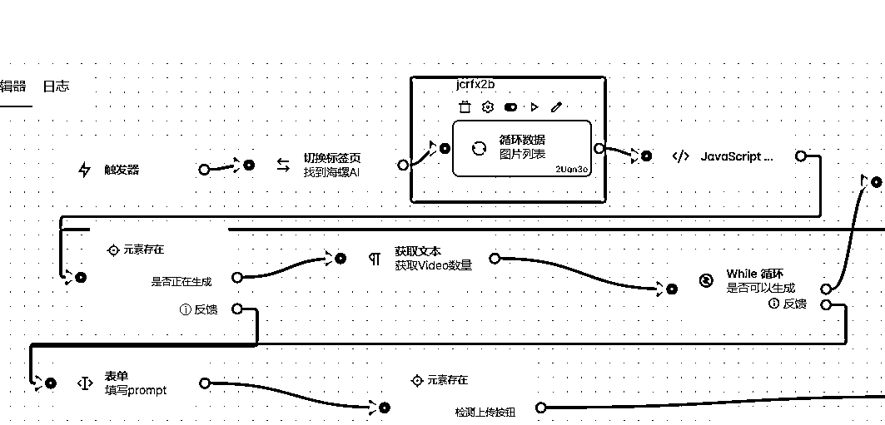

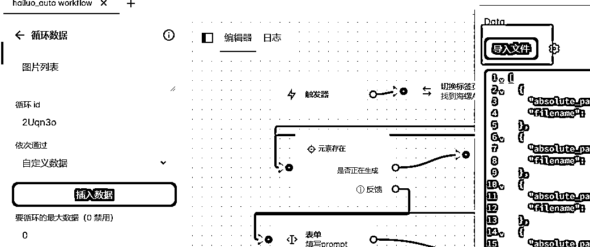

1.  点击开始执行（然后就挂机做别的事情，我一般放在睡前或者上班之前，让时间效率最大化）。

1.  等待一段时间生成之后下载即可。

ps.这里上传的自动化脚本是我自己改进的版本，做了一点优化：土豆君大佬采用的提示词是固定的，我则是在即梦AI生图的时候，提示词自动命名图片名称保存到本地；这样脚本就自动取图片名称作为海螺AI的提示词生视频，效果还是很不错的。

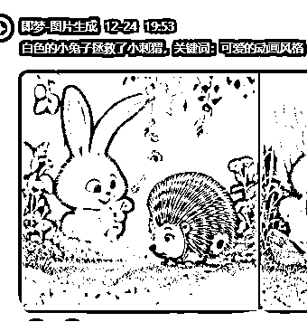

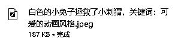

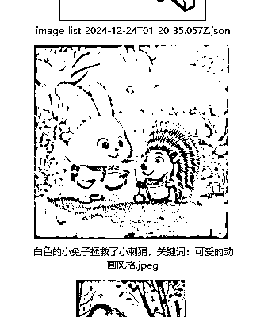

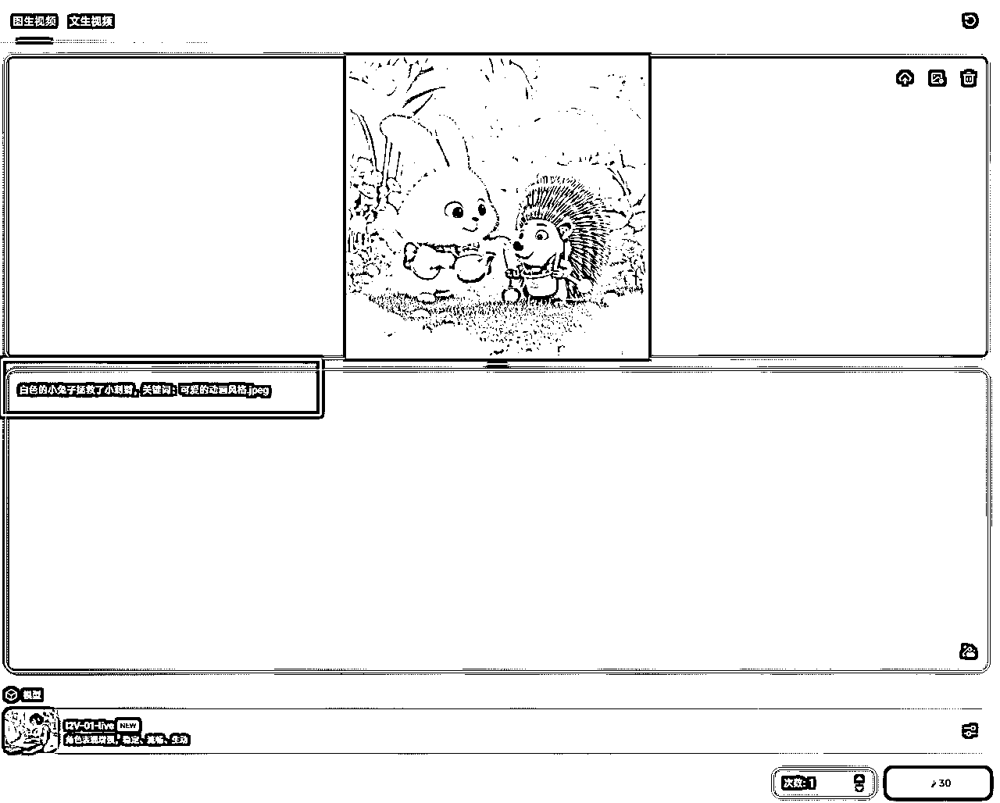

# 七、航海经历

上面是我这次参加整个航海里自己的思路操作过程：

下面我也想来说说参加的这次航海我的一些经历，希望带给更多的新船友们接触YouTube的这个赛道一些启发：

按照一系列的准备工作完成，视频发布后，第二天就已经开始有点赞和播放了，看着点赞和播放量，就像糖果一样甜到心坎里，更有动力继续剪辑了！信心满满

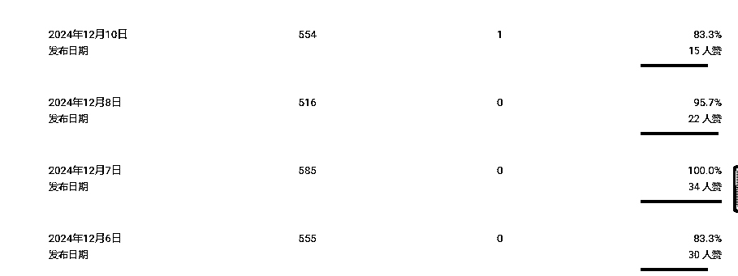

从最初的手动工作流+尝试各种AI工具+白嫖免费次数，两天才能磨出一个视频，到逐渐确定工具类型和实现自动化

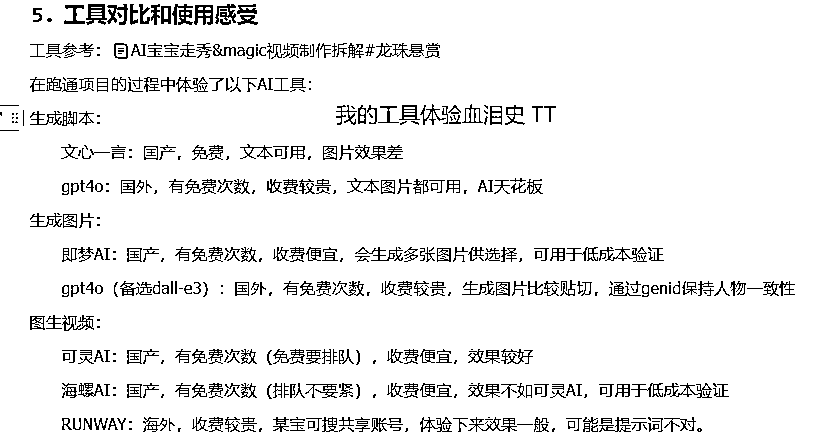

逐渐学习自动化流程，将生词、生图、生视频、剪辑的流程自动化，提高产量。 一天可以产出三四个视频。效率杠杠的！

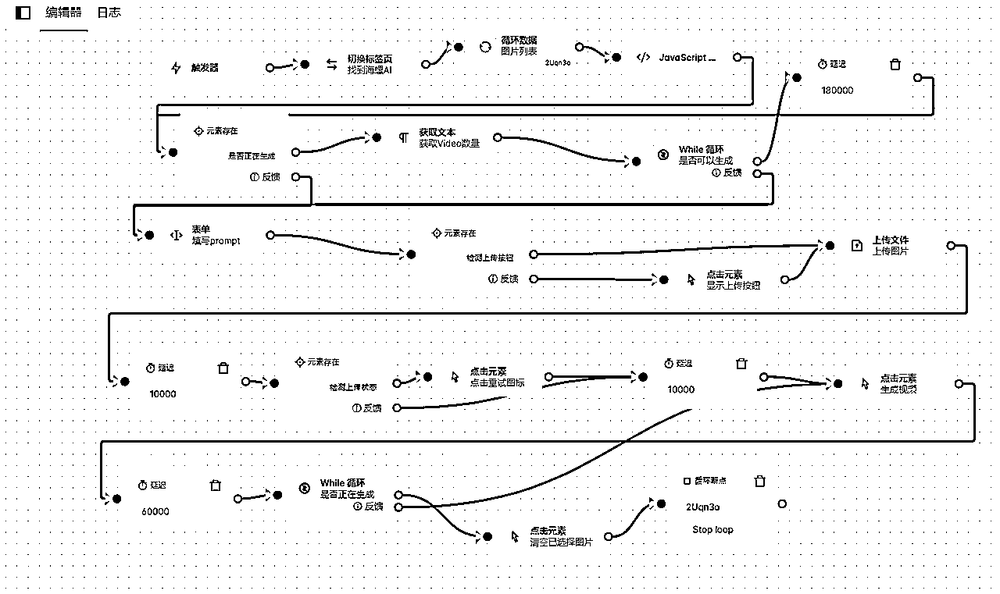

强烈建议大家有时间去学习一下自动化，以后可以做赛道的创新、以及矩阵号，尝试多个方向。

特别感谢@土豆君 教练和@竹子 教练，他们的经验贴让我快速上手，让我快速上手，他们的指导如同灯塔，在群里多次解答我的困惑，让我少走弯路。

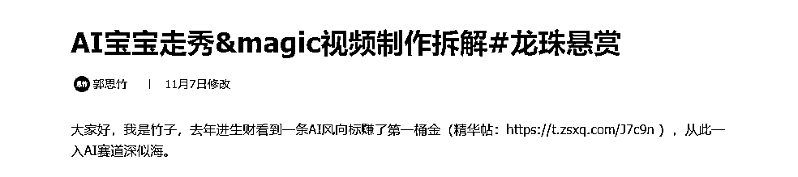

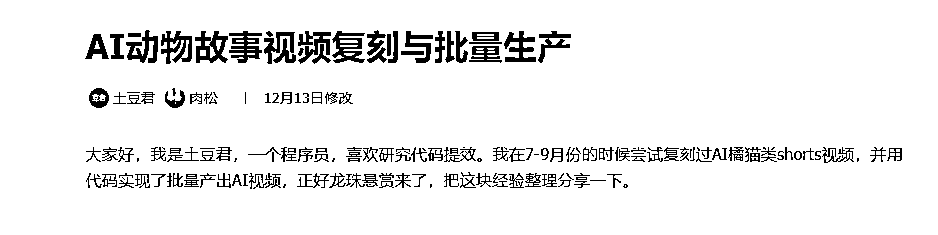

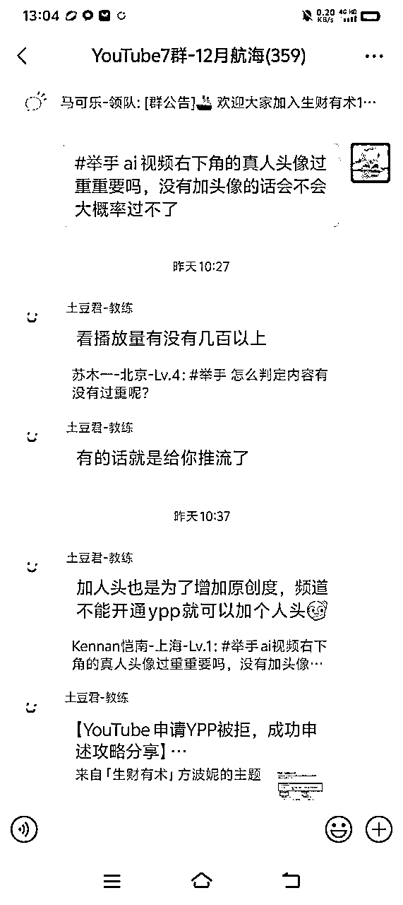

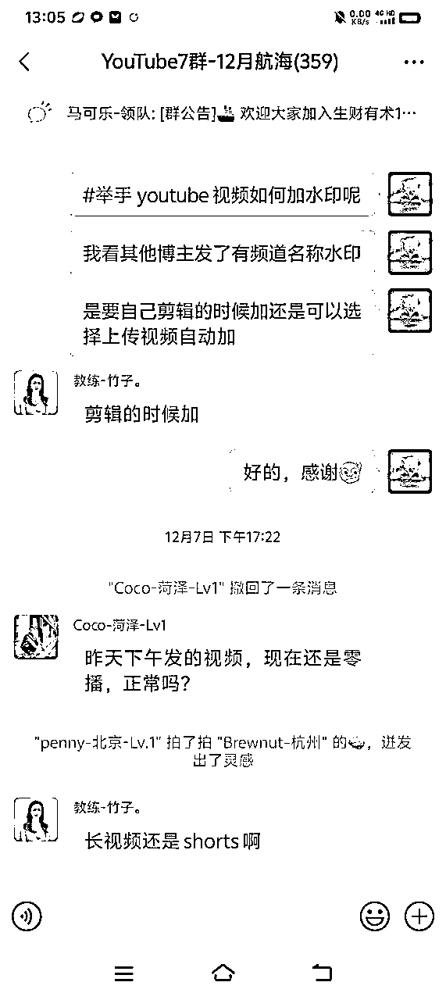

感谢船友CoCo和我结为战友，从第一天航海开始就互相鼓励、互相分享，给与很多支持，成为我的坚强后盾；

我们一起讨论视频怎样更受人欢迎，避免我的闭门造车。

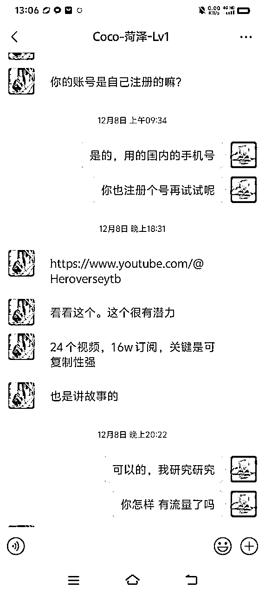

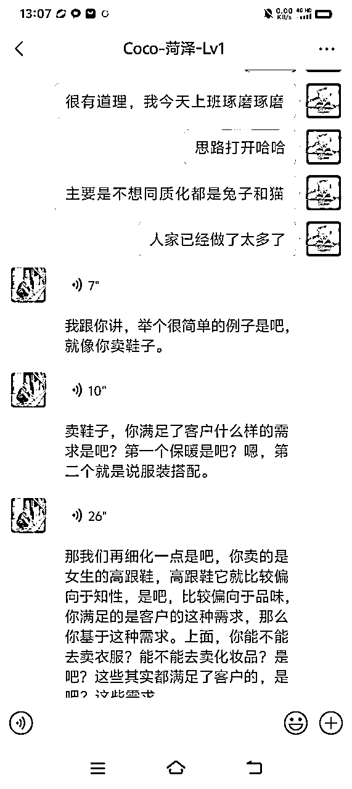

还要夸一夸生财的航海工作人员，团队工作的贴心服务——

担心实践有问题、群消息看不过来，在咱们的7群不用怕，领队会总结资料在群公告。

担心打卡不及时，沟通有困难不用怕，志愿者就是我们的贴心小秘书。

特别是我的志愿者李维C和领队马可乐，让我感受到了来自生财的关心和鼓励，他们每天的提醒打卡都非常及时而且很有温度。

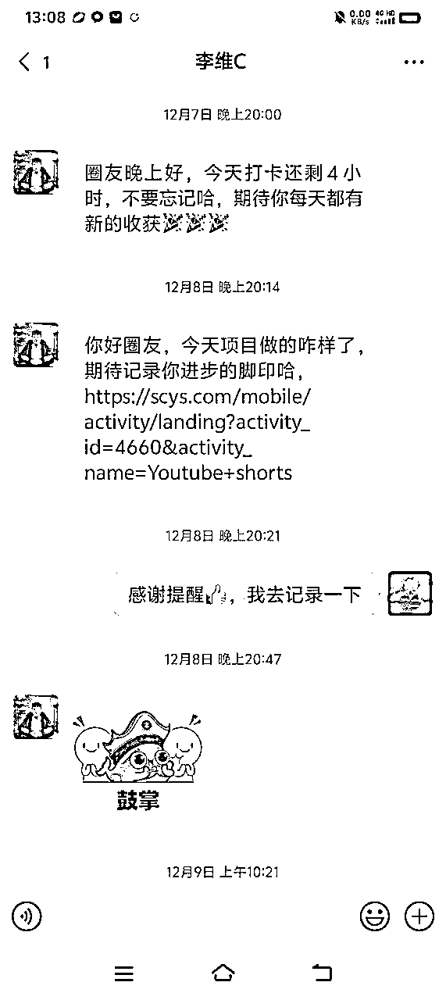

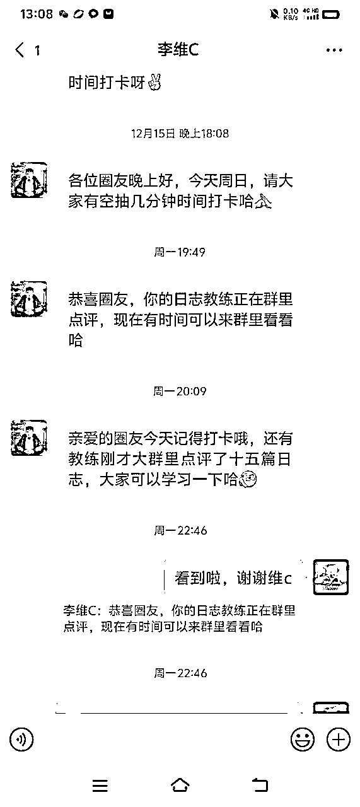

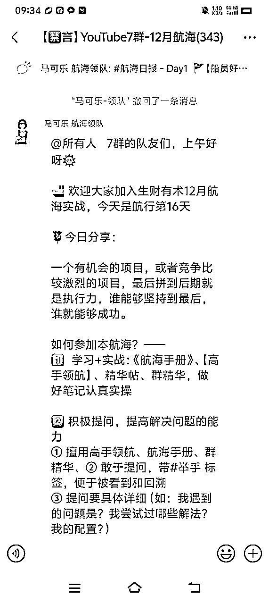

之前看纪钟老师的直播，有句话叫：掌握80分的人可以教60分的，60分可以教40分的。

我的经验可能说起来对于高手来说都是一些基本操作，但是对于和我一样的新人同学，希望可以有一些借鉴意义。

在生财的航海实战，让我感觉生财真的是一群优秀的人在做有意思的事。

在这里，我们不仅是个体，更是一个团队，一起成长，一起前行。