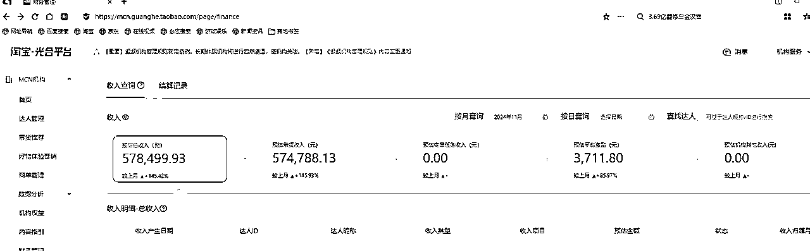

# 逛逛带货统一答疑

> 来源：[https://ycnnq7733utx.feishu.cn/docx/XMrkdNzTro4oUlxtyGecTFOlnlc](https://ycnnq7733utx.feishu.cn/docx/XMrkdNzTro4oUlxtyGecTFOlnlc)

上次给大家分享了逛逛带货的全流程操作，很多人有找到我，问我一些问题

# 这里直接统一给大家回复一下：

## 1、视频过审率

目前大部分卡壳是在视频的同质化，你们要记得加模版和水印，然后定期要换一下，因为你自己搬的视频多了，你也不确定这个视频是不是发过的。至于剪辑，用CR就够了，没必要用剪映一个个来。还没到精细化运营的时候。

## 2、账号的违规率

正常到了带货等级的账号，很少很少违规的，除非你自己故意去犯规。

比如外站平台的水印，这个一带就死，标题有也要死。如果你是新号，那就是很容易违规，就正常内容去发，也会，因为平台对新手账号的管控会比较严格。我们都是直接干到带货等级再来发。避免这个问题。

就算违规，也是可以处理的，损失一些佣金而已。

## 3、提现问题

提现有两个细节。

第1个部分，是矩阵账号的提现问题。

逛逛号一个人是可以无限认证的，但是提现要绑定支付宝，这个一个人是有3个名额，用企业的就会多一些个，具体数字，因为我们是直接用的MCN来进行统一化的管理，关于个人提现的这个没有测试过，大家可以自己跑一下。

第2个部分，提现环节有手续费。

逛逛的个人提现手续费是等级式的，做的越好，最高能扣到30%，对我们来说太高了，用机构就不会了，就普通税点。

## 4、矩阵账号管理问题

我们是统一的制表式管理+软件批量化管理。

正常一个营业执照配10个号，是谁认证的，逛逛号多少，绑定手机号是什么，等等等。你们的账号一定要做好表格统计，不然一多，就全乱了。

其他登录，看数据啊，做评论啊等等等，我们自己是弄了个软件都一起管理了。每天登一个软件号就行，不用一个个登录账号，提高人效。你们自己做的，就一个个登，也耽误不了多少事。（这个软件没有对外，只服务内部团队用的，大家就不要问啦）

## 5、账号产值问题

上次发文的时候，就和大家有说过，单账号的月产值平均在500左右，那现在能800-1000了。目前我们的单人产值，比上次的数据也有提升，最高有做到5万的。

那为啥能提升，核心点还是在于选品，选视频。我们不断的优化选品思路，做复盘，做分享。

以及淘宝经常有很多热点活动，很多热点词，做淘系的人基本都知道，你在发的时候，带上对应的关键词，流量就是会比普通的好很多很多。

并且，矩阵账号的魅力，平均数据保底，然后总会有大爆号出来。你们做一两个号的还不够浪费时间。

## 6、平台规则变化

这个月中平台出了改动通知，原来G的等级划分变成了L，那开带货的权限政策也有改动，目前还只是部分号有改动，但是这些问题都不大啦，核心也就是播放量的多少来开，这种都好解决。并且目前也只是部分号的改动，什么时候全部改完也不确定，不用纠结等着这个，按正常进度推进就好了。

## 7、机构问题

有不少圈友问到机构的问题

逛逛目前我们是开的MCN运营的，解决上面提到的一些问题，比如提现啦，高额手续费扣点啦啥的。

第2个呢，是我们也有发展团队合作的方向，这样可以进行深度合作，我们分享一线最新玩法，做管道分佣。

那能不能自己申请机构呢？

官方平台虽然还在开可以提交的申请通道，但已经是不审理的状态了，大家自己注意一下，市面上的渠道基本都是水分。

## 最后唠唠：

对比我们其他的项目，这算不上人均单产特别高，算是一个堆人效的活。简单粗暴。

但如果能有点选品的感觉，产值又能提升很大。

对于小工作室，小团队，能很丝滑的上车。

那对于个人还是要花点时间来弄的，比上班肯定要好一些，但肯定也不会有上班稳定，因为任何项目都会有红利期。慢慢的加难度，加门槛，这是毋庸置疑的。但你总考虑后面的风险变动，迟迟就是看着，那再红利和你也没啥关系。所以做逛逛，你们就算好人均投产比就行。

最后给大家还是打一波鸡血吧，还记得我上篇分享的数据吗啊？

9月的1万多

10月的23万

这个月还没结束，目前已经差不多快60万了

所以干就行了！