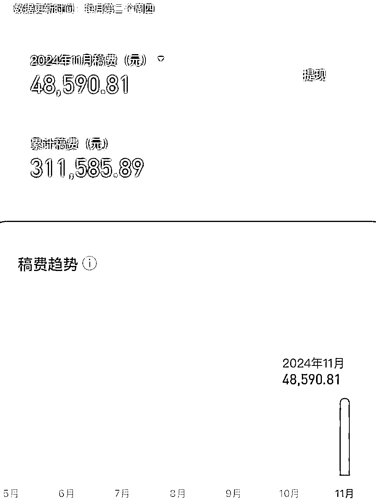
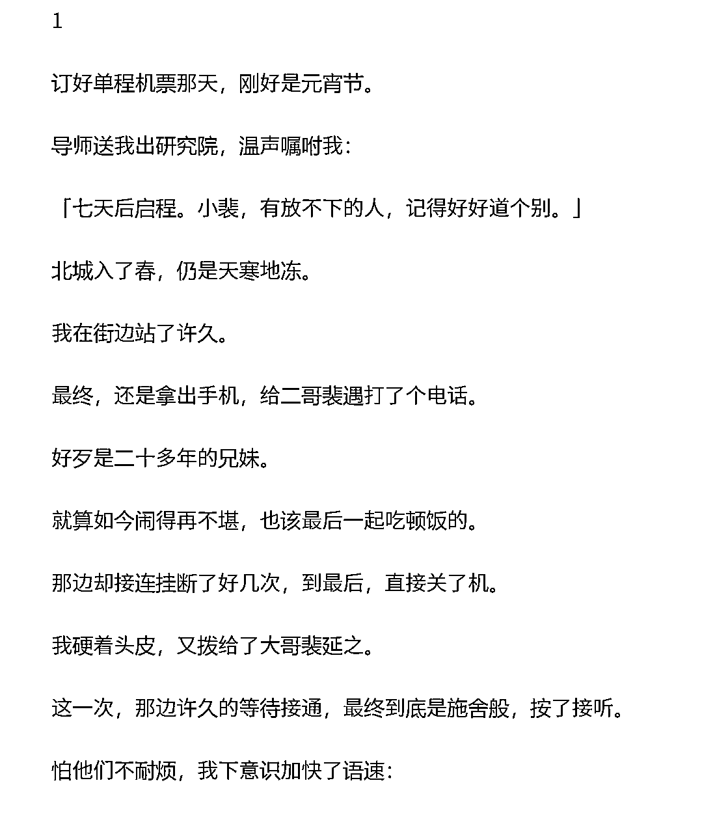
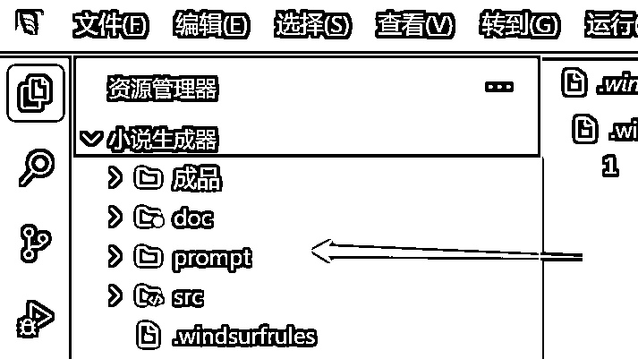
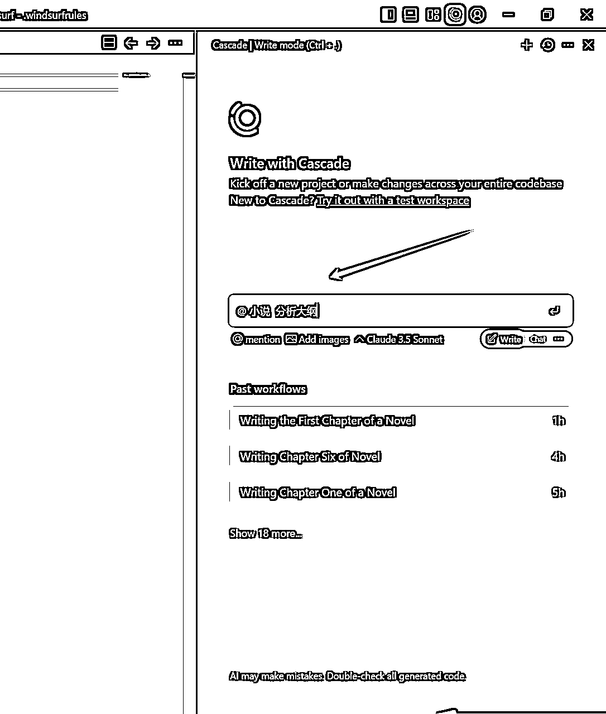
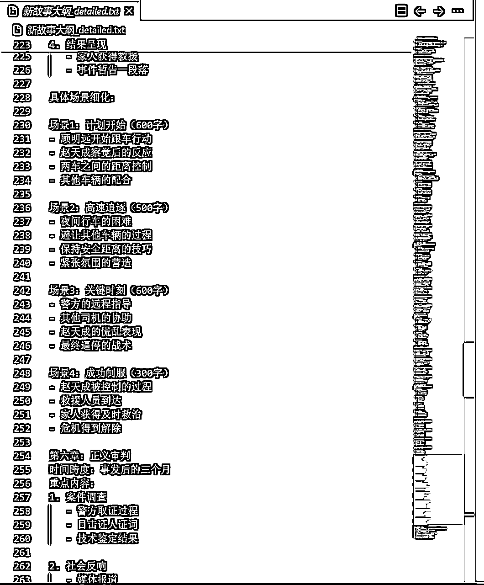
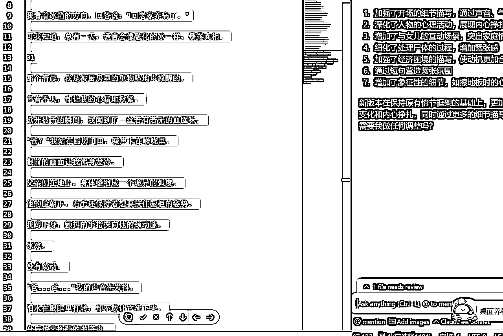
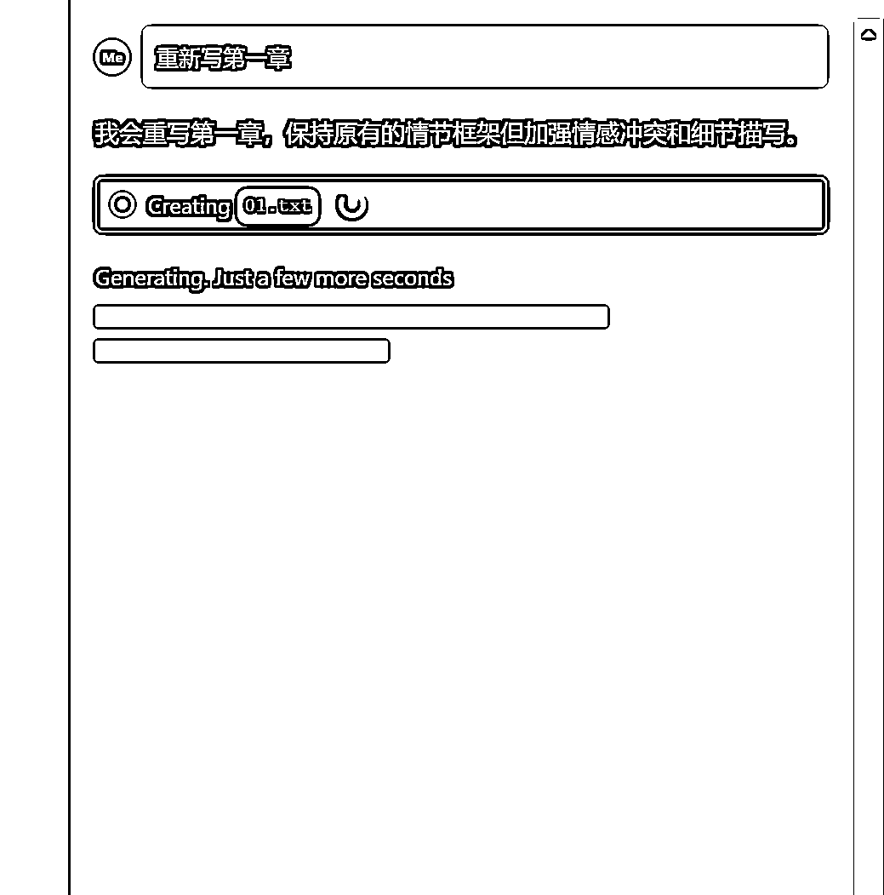
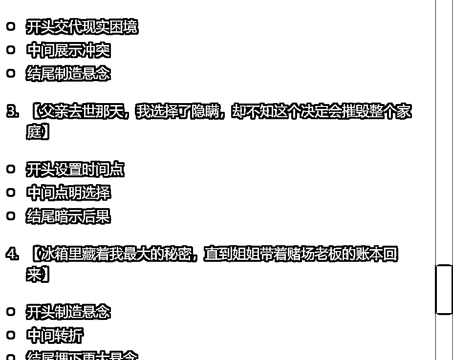
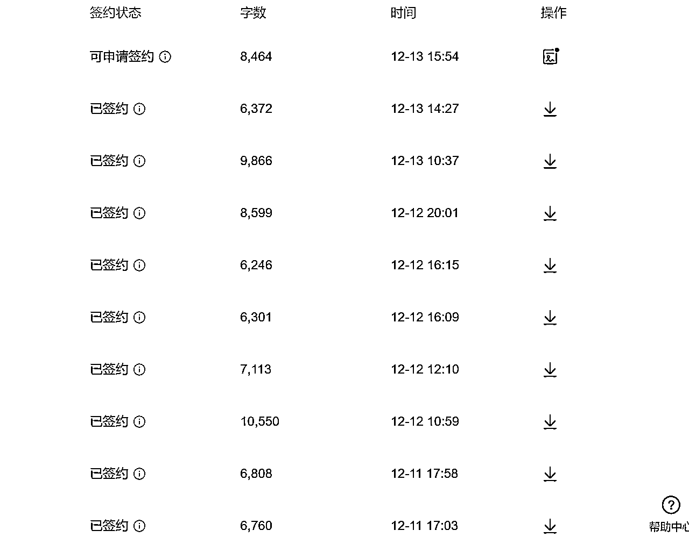
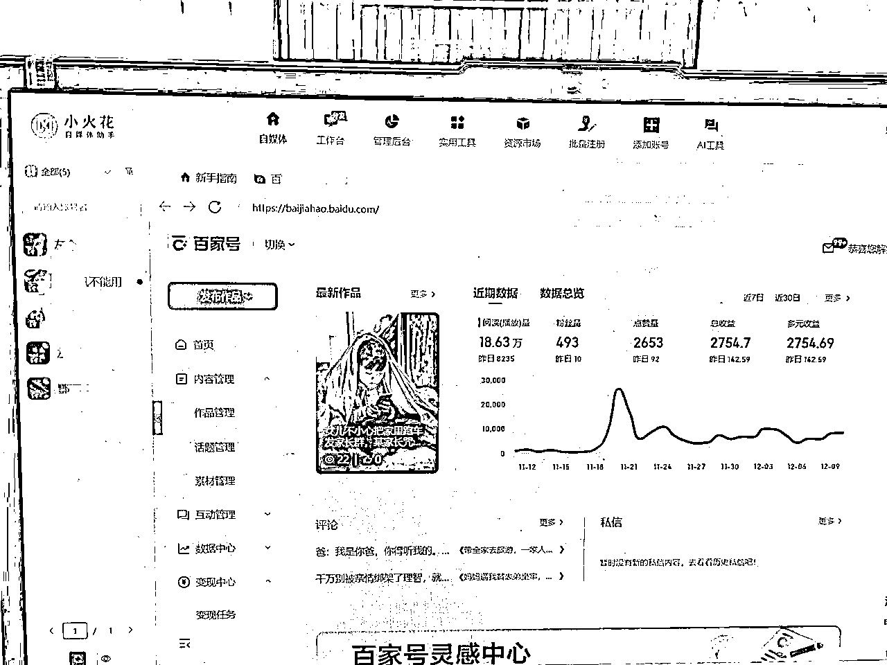

# 利用AI自动化写小说，一个月成功签约100篇短篇小说，月入四位数

> 来源：[https://szxb4qbve7.feishu.cn/docx/ArZHdgfKdozG8ExxHeOconZLnQb](https://szxb4qbve7.feishu.cn/docx/ArZHdgfKdozG8ExxHeOconZLnQb)

大家好，我又来了，上个月我分享了如何靠写短篇小说慢慢变富的帖子。

很多圈友加我想了解百家号付费订阅的事，我也做了解答，但是很多人发的信息，我都要第二天才回复，不是我没看见，而是这半个月太忙了，忙着测试新的项目，希望大家见谅，今天在这里给大家做一个统一的汇报。

老规矩，先看数据，小说短篇稿费

文章内一点也没有AI味，普通的编辑完全看不出来，都可以过审签约。

现在我就把如何利用AI写短篇小说分享出来。

第一步，在知乎小说找对标作品，一般热点的小说点击高，然后把小说下载下来。

第二步，打开一个神奇的应用，windsurf，新建一个文件夹，比如把小说文档、提示词、成品文章分别存放

第三步，打开右边的AI窗口，可以让他给你分析下载的小说大纲，然后重新写大纲

第四步：AI生成好的大纲，你可以手动修改，添加一些更精彩的情节

第五步，让AI按照大纲的每个章节写出全文内容

第六步，你只需要不断底优化调整不同的章节，让AI来辅助你修改文章，直到你满意为止

第七步，你可以让AI为你写一个合适的标题

第八步，复制粘贴到小说后台发布即可

整个流程完全可以实现自动化，你可以一边喝着咖啡，一边等待着软件帮你把小说写完。

你就说香不香？

另外百家号又下来一批号，继续搞起

