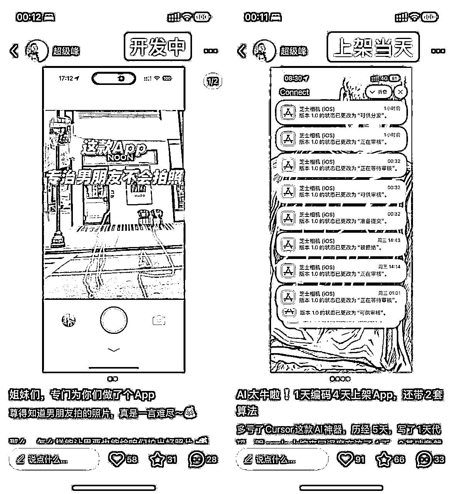

# 揭秘！如何 1 天开发出一款排行榜 107 名的 App

> 来源：[https://chaojifeng.feishu.cn/docx/B4bWd1Gzto5hu1xxfKTc4STinKg](https://chaojifeng.feishu.cn/docx/B4bWd1Gzto5hu1xxfKTc4STinKg)

大家好，我是超级峰，现居北京，是一个不知名的产品经理。

上个月，我成功开发并上架了一款名为「芝士相机」的 App。这款 App 是我在没有任何 iOS 开发经验的情况下，借助当下最流行的 AI 编程工具 Cursor，仅用 1 天时间完成的（外加 4 天的上架审核）。更令人兴奋的是，我还实现了两套独特的算法：姿势模板生成算法和美颜算法。

这款相机 App 核心功能其实很容易理解，通过原生相机叠加姿势模板图片，帮助男朋友或闺蜜能够帮助对方通过模板跟拍，拍出更好看的照片。

在 App 上线后，我积极在小红书、即刻平台宣布了这款产品，并有幸被“有趣产品咖啡馆”邀请发起了一篇开发者故事，

「芝士相机」App 很荣幸获得了小红书用户的欢迎与认可，峰值时候冲到了App Store 摄影分类排行榜的 107 名，与一众大厂App 同屏，而我却没有写一行代码。

接下来请让我为你分享这款产品创作的心路历程，让你也能够极大的提高产品的成功率，也许这也可能是你的第一款产品诞生的契机。

## 一、源起

这款产品的灵感源于我最近的新疆之旅，在路上，我总能在景区内看到情侣之间因为拍照的问题起争执，乃至最后面红耳赤、分崩离析。

而我作为一个拍照手残党，给女朋友当专属摄影师，当然也是一场甜蜜的煎熬（笑）。所以我就开始思考：有没有一款能够实时参考拍摄模板的 App 呢？

我通过 “拍照姿势” 等关键词了解小红书，确认了这块存在较大的空白市场，大部分的姐妹都有存图参考姿势拍照的习惯，让姐妹们将图片存到相机里，直接拍照的时候就可以使用姿势模板，这个思路的可行性就充分得到了论证。

需要特别说明下，如果你要创作一款产品，最好的状态就是你自己就有需求，这样的话，你对需求的把握的感觉是最准确的。如果你本身没有这方面的需求，只是发现了需求，那请你最好找到你的用户跟 TA 保持长期的交流，你一定会因此受益匪浅 ～

## 二、尽快行动

有了需求论证的基础，下一步就是开发，而我之前只有一款微信小程序的开发经验，并没有过图像算法的经验以及 iOS 开发经验。

之前通过各大社交网络也了解到了 AI 编程，时下热门的 Cursor 其实早就被我下载到了电脑，除了下载那天打开过一次，就一直没有打开过。

当下，我强烈地意识到，如果我不尽快实现产品，作为上班族白领的我，热情肯定很快就会被各种公司事务的繁忙冲淡而无法让这款产品诞生。

所以， 我打开了 Cursor ，用一天时间让 AI 写下了我的第一款 App，才让我走上了 AI 独立开发者的道路。接下来，请让我带你窥探我是如何构建起来一套基于 AI 驱动的面向新时代 App 开发的工作流程：

### 2-1、用 AI 为产品取名

通过使用 Cursor 的 Chat 能力，结合如下核心要点，让 AI 为我生成可用的产品名称：

（1）介绍产品背景、用户群体、达成的价值目标

（2）提供产品名称需要包含的的具象内容（如 相机、罐头等）

（3）提供产品名称需要包含的情绪点（如喜悦、愤怒、平和）

（4）提供参考的产品名称示例

### 2-2、用 AI 为产品设计一款 Logo

通过使用 ChatGPT 的 GPTs 的 Logo 创作能力，结合如下核心要点，让 AI 为我生成可用的产品 Logo：

1、提供参考的 Logo 案例（如「芝士相机」参考的就是芝士形状的实物相机）

2、明确产品的用户的人群画像（如女生、男生、老年人等）

3、明确 Logo 风格（如扁平风格、拟物风格等）

4、明确氛围感（如粉色系、可爱风、暗黑风、黑白等）

### 2-3、创建 iOS 项目

使用 Apple 提供的 Xcode 软件来创建你的第一款 App 项目文件夹。请注意，一定要通过 Xcode 软件来创建项目文件夹，而不要用 AI 直接生成，否则会产生各种意想不到的问题。这一步做好了，就为你后续的 AI 编程体验打下了良好基础。

### 2-4、启程， AI 编程

（1）打开 Cursor ，并选择通过 Xcode 生成的项目文件夹，此时 Xcode 不要关闭，因为等下需要预览 AI 生成的效果使用。

（2）快捷键 Command / Ctrl + i 打开 Composer AI 聊天窗口，写下你的编程指令，记住，第一次的指令内一定要 @ContentView ，告诉 AI 你的主要文件，不然 AI 可能会把内容写到其他读取不到的地方，如果你对界面有参考与要求，可以提供一张图让 AI 进行参考。

（3）在第一次 @ContentView 后，后续在同一个聊天窗口内沟通不需要再说明，AI 也能够知道前面说过的。AI 改动的结果可以选择先 Save all 预览（回退请操作 Reject 、 Reject All），预览没问题再 Accept all 确认保存（回退请操作 Checkout，或者 Git 版本回退） 。

（4）界面回到 Xcode 软件内，选择需要预览的设备，并点击预览键完成在设备上的预览（电脑上的模拟器或自己有苹果设备都可以）

### 2-5、代码报错？3 种方法轻松解决

（1）复制粘贴法

🎯 核心要点：将报错信息和相关内容直接粘贴给 AI，让 AI 分析判断，如果能补充一些现象或细节效果会更好（可结合归纳总结法）

🌿 适用场景：最常用的方法，适合基本所有场景

（2）看图说话法

🎯 核心要点：向 AI 展示预期效果图或报错截图，进行有针对性的沟通（结合归纳总结法和引用链接，效果更佳）

🌿 适用场景：语言难以表达的报错情况（如界面布局错乱、AI 实现的样式不符合要求）、参考提供的图片实现对标的产品的界面样式

（3）日志追踪法

🎯 核心要点：明确要求 AI 为产品添加日志，并根据开发工具内显示的日志复制粘贴给 AI 要求分析或增加更详细的日志进行追查定位问题并解决

🌿 适用场景：一般为通过界面难以观测到的隐蔽问题，AI 实现的逻辑效果与预期不一致的情况（如 实现某个逻辑执行的时机与预期不一致，与另外一台设备连接中断的逻辑）

这些方法的根本目的是为了帮助 AI 更准确地理解和解决你的问题。通过提供完整的上下文信息，可以让 AI 更全面地把握问题的本质，避免因信息不完整或表达不清晰而产生误解。同时，这些方法也能帮助你更系统地梳理问题，提供更多有价值的细节信息，从而获得更精准的解决方案。

具体来说，这些方法可以：

*   减少信息在传递过程中的损失，确保 AI 获得足够的背景信息

*   通过多角度的信息展示（如文字描述、截图、日志等），让 AI 更立体地理解问题

*   提高沟通效率，避免多轮反复询问和澄清

*   最终达到预期的问题解决效果，减少输入需求与输出结果之间的偏差

正如我与某个网友的简短的交流，作为一名普通人，而不是专业的软件工程师，我认为 AI 编程的核心首先是你需要先将自己放在创造者的立场，切记不要陷入技术细节。请记住，你唯一要关注的就是如何准确地表达诉求，无论是产品功能的诉求还是代码问题的描述。

由于借助 Cursor 进行 AI 编程话题篇幅较大，这里仅为大家分享一些我在与 AI 愉快交流过程中的方式与技巧。如需了解更多，可以观看下方我近期举办的分享会的两个小时的视频《 AI 开发从 0 到 1 经验分享（适用新手）》。

截止目前，我已上架 2 款 App，第二款「小圆角」 App 在我自己产生需求并论证的当天，也仅用了我一个晚上就完成所有的第一个版本的开发与提交。

打铁要趁热，不要因为技术的困难而踌躇不前，我可以很负责任地告诉你，我作为一个不懂 iOS 开发的产品经理都能一天时间开发出一款 App ，还是实现了 2 套算法的，你一定也可以的。

其实写代码，就是把一堆文字写到文件里面，就跟 txt 或者 word 文件一样，只是写到里面的内容是机器才能看懂的逻辑性的内容，这种内容有的只能给 iOS 识别器读取，有的只能给安卓识别器读取，而 AI 编程实现的就是将自然对话的结果转化为机器能看懂的逻辑性内容，仅此而已。

即使因为我有开发的背景，但是我相信这只是时间的差异，也许你 2 天也能开发出来，但是不要让你心中的那把火熄灭，请像我一样持续点燃，你会收获不一样的人生体验的。

## 三、积极主动，持续宣传

如果说前面的高效是创造产品可能性的那个大写的 1，那么产品全生命周期的宣传，我认为是此次登上排行榜的后面的无数个 0 。

在产品开发过程中，我通过产品 Demo 界面形式，在小红书完成了产品的预告，让更多的用户看到并了解到了这款即将发布的产品。

在产品上架当天，以及上架后持续的 2 周时间内，我不间断地有意识通过小红书、即刻、公众号邀约等形式，发表产品相关的内容，为产品增加曝光的机会，以此，才让这款的产品得以具备上榜的机会，让我们一起来复盘一下这 2 周我的的内容策略与思考：

### 3-1、产品上架前

🎯 核心要点：通过展示产品核心功能（可以是草图，我当时功能都还没开发），获得潜在用户的反馈，验证产品价值，并适当进行上架前调整。

🏃 总结经验：不一定需要完整的产品，但是需要传达核心价值，并且一定要选择合适的宣传平台。

### 3-2、上架后两周内

🎯 核心要点：通过能接触的各种宣传渠道，保持线上持续热度，没有热度也需要创造曝光的可能性，比如小红书、即刻等平台主动宣传产品，在此期间，我基本实现了每天发布一篇产品相关笔记，并且累计主动互动 100+ 次，累计获得了近 10万+ 次曝光（专栏占比 45% ，自媒体占比55%）。

🏃 总结经验：主动为你的产品发声，尤其是要注意专栏访谈的机会，在发布后积极在文章内与用户互动会有意想不到的效果。尽你所能，机会自然会涌现，可能这就是所谓的越努力越幸运吧。

如果没有主动通过社交媒体增加产品的曝光，我认为这款产品也很难获得这次上榜的机会。

所以，虽然我很想强调 AI 编程有多么强大，但是作为一名 AI 独立开发者，还是希望大家能够清晰地认识到，AI 编程让准入的门槛降低，而产品的宣传依旧是一件需要你持续投入时间的重要事项，并且应该是持续面向你的目标用户，这非常重要。

## 四、总结

近一个月，我见证了这款产品的诞生到偶然闯入榜单，也很难说得上有多深刻的过程。

但是，一想到今天的分享，如果让大家在某个时刻点亮创作的火花的时刻，能够也有像我一样，拿起如 Cursor 之类的 AI 编程工具，创作出你的第一款互联网产品，想必那一刻一定是幸福的模样吧。

如果你能看到这里，相信你也和我一样，渴望创造属于自己的第一款 App。以下 4 点建议，希望能为你指明方向：

1、如果你想打造的是真正的产品，而不仅仅是一款 App，就要避免简单模仿他人，专注打造具有独特差异化的产品。

2、作为独立开发者，你需要适应一定程度的孤独。同时，要对产品创造保持热情与耐心。即使前期用户稀少，也要做好持续迭代升级的准备（当然，前提是确保方向正确）。

3、这是一个残酷的现实：创造产品仅仅是万里长征的第一步。要让产品走得更好、更远，持续推广必不可少。

4、立即行动起来，不要让想法束缚了你的手脚。行动不一定能成功，但不行动一定无法成功。从小事做起，比如先下载并安装 Cursor。

最后，让我们总结今天分享的重点内容：

1、大胆发现需求，谨慎求证需求

说到用户调研，小红书是一个不容忽视的平台。目前其搜索量已达到百度的三分之一，且用户群体早已不限于女性。无论是针对男性还是女性用户的产品，都值得在这个平台进行调研。

2、天下武功，唯快不破

在不写一行代码的情况下，我已成功上架两款 App。你也一定可以做到。趁着内心的创作热情还在燃烧，大胆去尝试吧。

AI 编程不是传统的代码编写，而是通过与 AI 对话来实现你的创意。虽然过程中可能会遇到一些偏差，但只要持续行动，就一定能接近目标。相信我，你一定会感谢自己今天的这次勇敢尝试。

3、产品的宣传，需要持续不断

虽然 AI 可以帮助完成取名、设计 Logo 乃至代码开发，但我认为产品宣传这件事仍需要亲力亲为。

因为只有通过持续宣传获得产品曝光，并在每次互动中收集用户反馈、了解产品体验，才能推动产品走得更远。

以上分享可能不适合所有人，仅供参考。毕竟这只是我个人的经历，而你，我的朋友，是这个世界上独一无二的存在，你的成长背景、兴趣爱好和经验资源，都可能与我大不相同。

我们能做的是吸取经验，在实践中不断磨练自我，多与他人交流，把他人的知识转化为自己的经验。一切的改变与成功都始于行动，只有付诸实践，才能让你接近目标、实现心中的梦想。祝你成功！