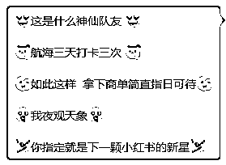
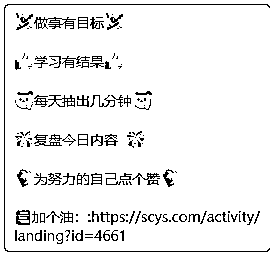
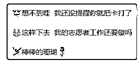
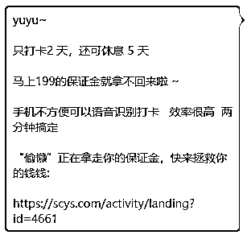
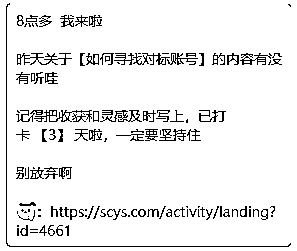
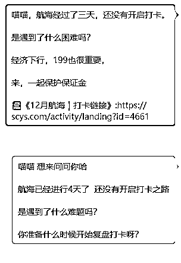
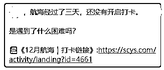
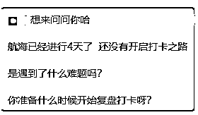
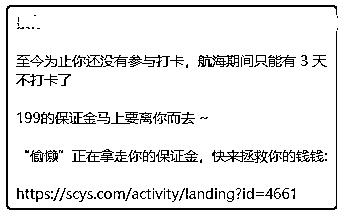
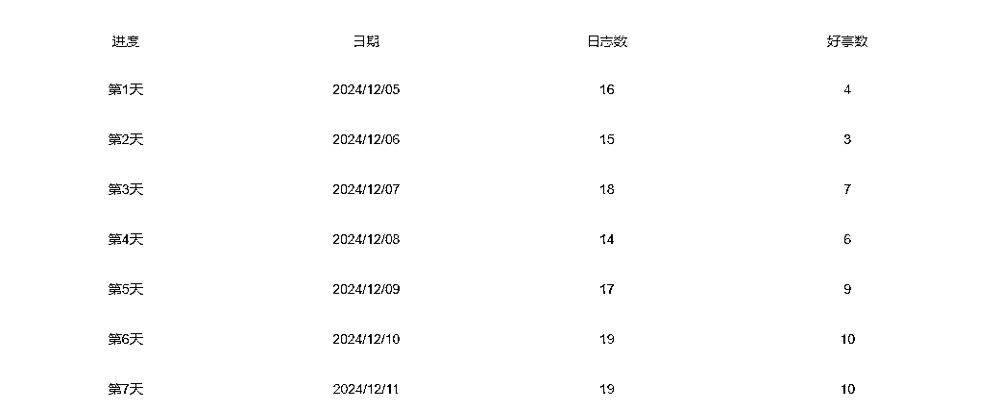

# 航海第二周船员“分化期”，如何高效辅助船员打卡

> 来源：[https://fanlei666.feishu.cn/docx/BKWpdX6rqo58kJxrsMCcxTrjn8e](https://fanlei666.feishu.cn/docx/BKWpdX6rqo58kJxrsMCcxTrjn8e)

## 航海进入深水区，船员各种问题频出，怎么办？

在航海的第7天，船员们对项目有了初步的认识，并且开始进入更深层次的实操阶段。

在这个关键的时候，船员们的状态分化是很常见的现象，因为每个人的背景、经验和对项目的理解都有所不同。

有一些宝藏船员不用提醒，每天早早的就把卡打完。

而另外一些船员任凭你使出十八般武艺，我就是岿然不打卡。

还有一些船员，催一催就打一打，盯得松一点又不打。

各种各样的情况会使我们一些志愿者心烦意乱。

其实这都是正常的情况，热门的项目都有1000多船员报名，还有一些报名了两个航海，加上各种各样的阻力，都会使船员停滞不前。

## 志愿者视角如何看待这些问题？

作为志愿者我们需要了解的是：

船员分配的时候，都是按照顺序随机分配，当每一位志愿者服务人数达到30个人的时候，就基本上不会存在极端的情况，分配到每一位志愿者组里的船员，都是公平的。

都会有一定比例的围观船员，一定比例的宝藏船员,一定比例的不打卡失联船员，还有一定比例的需要时常关心的船员。

我们了解了分配原理之后，就会明白每一个志愿者所需要做的工作基本上都是相同的。

不同的是每一位志愿者对待不同船员的处理方法。

所以在这个时候我们就需要有一个清晰的运营思路，来辅助我们针对每一类船员做出对应的动作，来提高辅助他们的打卡效率。

## 整理运营思路，做到心中有数

我们把小组内的30位左右的船员，可以大致分为三种类型【不是必须，在航海的前中期大致分类】

1.  积极型船员：

*   这类船员对项目充满热情，他们通常积极主动，提问和实操都冲在第一线。

*   他们对自己的目标有清晰的认识，并且能够快速地开始行动并出现反馈。

1.  观望型船员：

*   这类船员经历了7天的航海之后，对项目也有了基础的认识，但是执行力问题，导致迟迟没有开展行动。

*   他们可能需要更多的督促和指导。

1.  消极型船员：

*   这类船员可能因为个人或者其他原因对项目放弃。

*   本身有自己的业务、自身的时间资源紧缺，来航海是为了吸取最新的项目信息。

有了这种明确的思路以后，就可以配合我之前的志愿者文章，对【运营核心】船员分层帮带-进行A组、B组、C组、D组分组运营。

实操如下：

### A组：积极型船员

对于打卡5、6、7、8次的船员，是以【夸夸】为主，可以小红书风格的文体进行夸夸，比如“三天打了三次卡，这是什么神仙队友”“这样的执行力一定可以成为商单界的新星。”只需要每天进行夸夸，而且无论打没有打卡都要进行夸夸。可以保持船员的动力。

这样的话你还会顺道收获好多不用催卡自己就打卡完成的船员哦~

小红书商单船员运营思路：以【夸夸】为主，emoji符号记得加上

示例一：

这是什么神仙队友

航海三天打卡三次

如此这样 拿下商单简直指日可待

我夜观天象

你指定就是下一颗小红书的新星

示例二：

做事有目标

学习有结果

每天抽出几分钟

复盘今日内容

为努力的自己点个赞

📚加个油：:https://scys.com......

示例三：

想不到哇 我还没提醒你就把卡打了

这样下去 我的志愿者工作还要做吗

棒棒的XXX

### B组：观望型船员

打卡次数少的，也是沿用同样的方法，根据之前的聊天记录对每个人稍微做修改，用“注意打卡次数”，“可休息天数”来唤醒没有打卡的船员，措辞会比较委婉，还会以“开始了就不要放弃”来鼓励已经开始行动的船员。

小红书商单船员运营思路：以【鼓励】为主，适度以“保证金”、“打卡次数”引导

示例一：

XXX，航海经过了三天，已经开启了打卡。

开始行动了千万不要停下

经济下行，199也很重要，

来，一起保护保证金，记录下今天的收获

📚《12月航海｜打卡链接》:https://scys.com......

示例二：

XXX~

只打卡2 天，还可休息 5 天

马上199的保证金就拿不回来啦 ~

手机不方便可以语音识别打卡 效率很高 两分钟搞定

“偷懒”正在拿走你的保证金，快来拯救你的钱钱:

https://scys.com/.......

示例三：

8点多 我来啦

昨天关于【如何寻找对标账号】的内容有没有听哇

记得把收获和灵感及时写上，已打卡 【3】 天啦，一定要坚持住

别放弃啊

https://scys.com/.......

### C组：消极型船员

以航行时间，打卡次数，打卡保证金，这样的数字来制造紧迫感，其实我们每一次发的消息他们都能看到，这两天用紧迫感唤醒了两位船员，也加入到了打卡的队伍中，对于零打卡的船员有时候用词会比较直接，会用上“偷懒”“丢失”等词来制造紧张感。

小红书商单船员运营思路：以【鞭策】为主，以“紧迫感”、“丢失保证金”引导

示例一：

XXX，航海经过了三天，还没有开启打卡。

是遇到了什么困难吗？

📚《12月航海｜打卡链接》:https://scys.com........

示例二：

XXX 想来问问你哈

航海已经进行4天了 还没有开启打卡之路

是遇到了什么难题吗？

你准备什么时候开始复盘打卡呀？

示例三：

XXX：

至今为止你还没有参与打卡，航海期间只能有 3 天不打卡了

199的保证金马上要离你而去 ~

“偷懒”正在拿走你的保证金，快来拯救你的钱钱:

https://scys.com/.......

### D组：确定不打卡和未来打不完卡失去保证金不需要提醒船员

D组船员基本上都是围观的船员、明确回复不打卡的、陆续会加入打不完卡失去保证金的船员。

在这些船员里面隐藏着很多可能我们都不知道的行业大佬，所以服务要更到位。

小红书商单船员运营思路：以【陪伴】为主，即使不用打卡，没有了保证金，也是我们的船员。

除了不需要进行催卡，日常上课的提醒，加餐的提醒，优质内容的转发都是一个不能落下的。

OK，当我们把运营思路捋清楚了以后，服务船员就是事半功倍，

按照这个运营思路，每天只需要一个小时左右的时间，就可以把船员沟通一遍，

人员摸排一遍，需要重点沟通的单独沟通，整体情况做到心中有数，然后安心做自己的事情。

为什么一个小时能过一遍呢？

因为我们已经把船员分好组了，同一组内的情况基本一致，只需要编辑一段话术，

编辑完以后，每一次只能转发给9个人，分组转发的话不但快，而且不会出错。

最后再根据船员的反馈进行单独的沟通。

通过这么一系列操作以后，从数据反馈上打卡的人数持续稳步上升，船员们的好事数也在持续增长，

数据没有下滑，而是在持续的提升。

## 写在最后

打卡成绩的好坏，并不是志愿者的功劳，而是船员通过自身的努力经过，加上我们的用上面的组合拳进行推波助澜，而最终形成的结果。

举一个例子，就像是在游戏里，船员是【主攻手】，而我们的志愿者在这里就像一个【辅助】，我们负责推送优质信息， 盯梢，加血，回复状态。

你说是主攻手重要，还是辅助重要呢？其实两者都重要，缺一不可。

船员也是我们的朋友，是同在生财的缘分让我们遇见了一起，

进入到生财将近五年，我微信里的一小半朋友都是在生财通过志愿者加上的。

这些朋友打开了我的眼界、提升了我的认知、

让我受益良多。

所以，我也一直没有停下做生财的志愿者。

希望我们可以一路同行，通过志愿者服务遇见更好的自己。