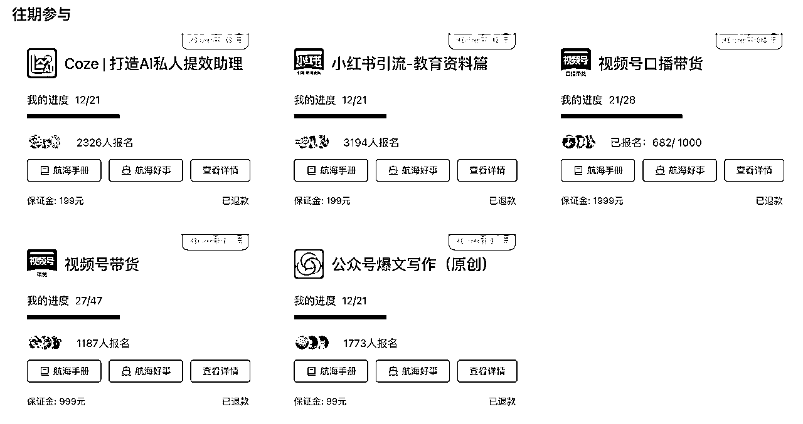
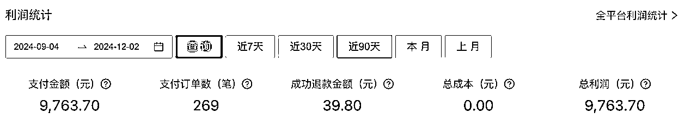
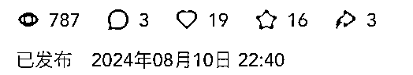
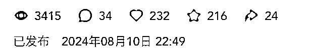
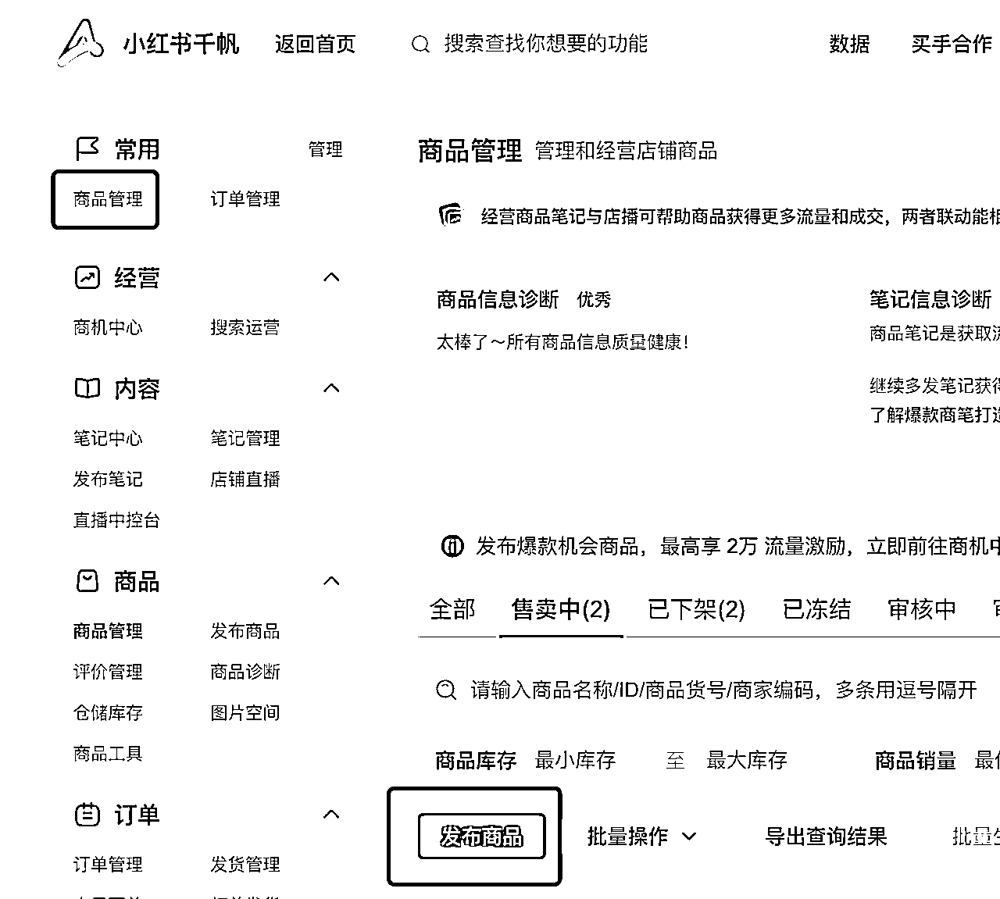
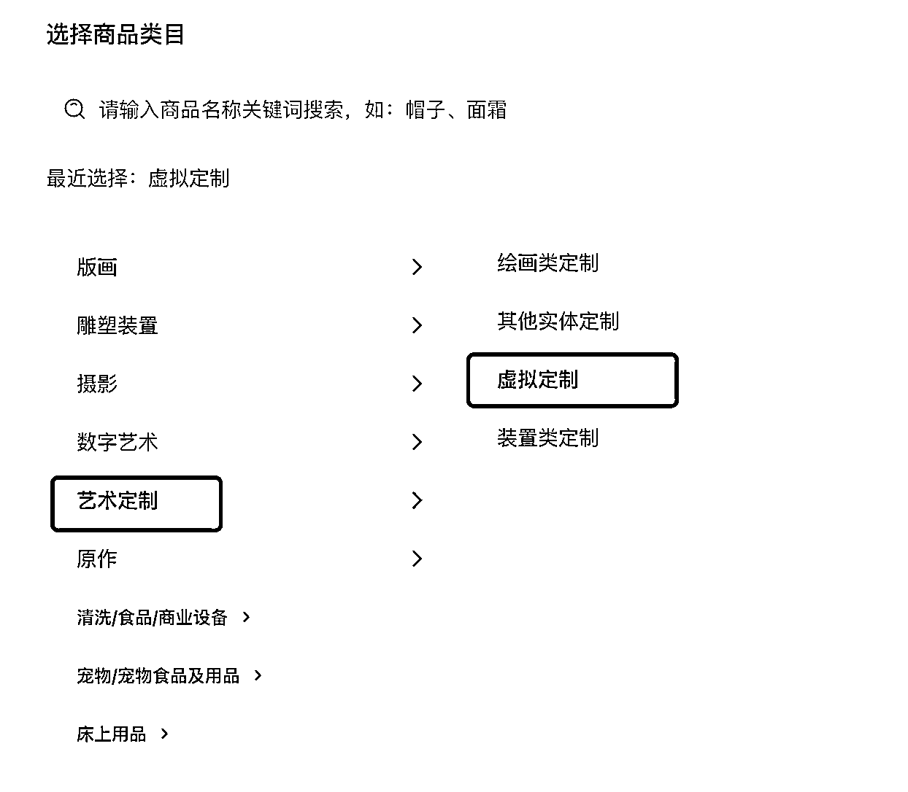
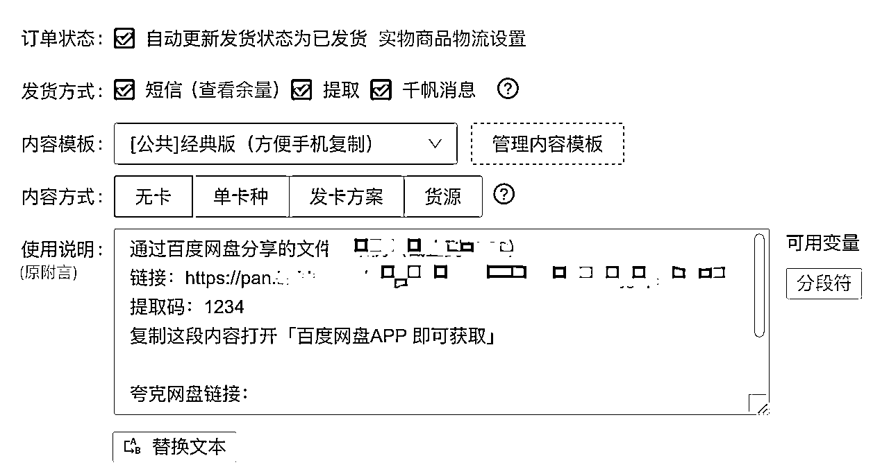

# 4月份加入生财的一年级新生，从0到1跑通小红书虚拟资料，配合小红书店铺自动发货，实现睡着也能赚钱

> 来源：[https://qx1qybiik3d.feishu.cn/docx/TxVqd9nAzoBGyHxQ726cxP1Bn1b](https://qx1qybiik3d.feishu.cn/docx/TxVqd9nAzoBGyHxQ726cxP1Bn1b)

各位生财的圈友大家好，第一次发帖，多多指教。

这里是610，今年刚刚加入生财的一年级新生。

# 一、自我介绍

在加入生财之前，我一直在传统媒体工作了九年，虽然期间也尝试做过抖音、小红书等各个平台的自媒体，但都没有做出什么成果。

加入生财之后，每次航海都有积极报名参加。

7月参加公众号爆文和视频号带货，8月参加视频号口播带货，虽然都跑通了0到1，但一直没出现爆款，收益只有几十块。

10月我参加了小红书的虚拟资料这个项目。

从最初的发笔记引流到私域成交，到后面开通店铺，再配合上闲鱼平台，目前做了三个月，共变现大概1w➕。

（小红书店铺9k➕，闲鱼1k➕，再加上一些私域的，差不多在1w➕）

下面我会从以下几个方面，说一下我的做法。

1、赛道的选择

2、引流方式

3、笔记发布

4、店铺和自动发货

# 二、经验分享

## 1、赛道的选择

关于赛道的选择，我之前也一直在纠结，是选择目前大热的K12，还是去卖自己去年考研的时候整理的资料。

一方面，K12做的人很多，如果做K12我还需要自己去购买新的资料。

另一方面，我也不确定自己的资料有没有人买，很没有底气。

但是想再多，都不如去试一试。所以就先发布了两条笔记。

当时笔记发的也很草率，根本没有去对标其他账号，就自己截图了几张资料的截图，然后加了一下自己的水印，就发布了。发出去之后，手机就扔那也没管，等我第二天打开看的时候，发现有好多私信和点赞收藏。

那篇笔记的数据其实也并不多，只有四五百，但是私信过来求资料的有十几个。

8月10号我就发笔记了，看这个点赞量其实还不错，但是我发了之后就没管，当时也没想好自己的这些资料该如何定价，卖多少钱，所以错过了一波流量。

等8月25号我才准备好要卖这个资料。

## 2、引流方式

刚开始的时候，我是针对私信过来的人，让他们加微信。

我给别人发微信的时候，就是在相册里选择一张照片，然后在照片上加上我的微信号。

但是小红书在这方面比较严格，一般一张图片只能发一次，发第二次的时候，就会收到小红书不能站外交易的提示，有这个提示我就猜测对面应该没收到我的消息，然后我就会再换个方式发一遍。

第二个方式，是在聊天框里面打上微信号，再截图发给他们。测试之后，有的时候也会被系统识别出。

第三个方式，如果上述的方式都收不到，我会再尝试去发一下手机号，就是分两次去发，然后加一些表情。比如123🌹234🌹～522🌹33🌹。这样方式偶尔也会被识别。

第四个方式，是建群。在笔记上关联群聊，群名是【来这里领取】，加上群之后，我有设置一个自动的欢迎语，欢迎语里隐讳的让加v，每个人进到群里，就会收到这句话。

第五个方式，就是建一个小号，昵称改为自己的微信号，然后用大号在简介里@小号。小号的简介是：聪明的你，看我的名字，就是v。

后来，一个个的私聊发微信太麻烦了，加上我平时事情又比较多，于是我就直接在小红书开了店铺，设置了自动发货。有需要的就会自己去拍，然后系统自动发货，我实现了睡着觉就把钱赚了。

## 3、笔记发布

因为我的这个领域，能够对标的笔记不是很多。所以我发布的笔记，大多都是参考自己之前发布的，数据好一些的笔记。然后把标题不改变意思的情况下，换一种说法，改一下表情，再发一遍。这本质上也是一种对标。

封面和标题是最重要的，我们航海手册里也有介绍很多种方法。

我会多尝试不同的方式，去看看哪种方式数据好一些，自己制作起来最简单快捷，毕竟如果后续要增加账号的话，笔记制作的太麻烦，也会是一种累赘。

## 4、店铺和自动发货

小红书店铺开通：https://customer.xiaohongshu.com/login?service=https://ark.xiaohongshu.com/app-system/home

一个身份证可以开通一个店铺，选择个人身份就可以！

开通店铺之后，在【商品管理】处选择【发布商品】

按照平台的要求，把需要填的内容填好就可以了，类目我这里选择的是【虚拟定制】

在上架商品之前，你要准备好【商品主图】和【详情页的介绍】

可以根据你自己的产品，参考同行的内容，自己去做几张图上传就OK了！

自动发货我用的是阿奇索这个平台，一年费用在138r。

阿奇索：https://aldsxhs.agiso.com/#/home/dashboard

注册好之后，绑定自己的小红书店铺。

在商品设置中，设置好自己的发货方式，我这边选择的是短信、提取和千帆消息，三种发货方式。

这里的短信容量需要自己购买，9块钱100条。

这样大家下单之后，就会收到一条短信，直接进入链接就可以提取我们的网盘链接了。

可能会遇到的问题：

虽然开通店铺自动虚拟发货很方便，但是也会有一些问题。

比如：

1、虽然设置了自动发货，但还是经常有客户找客服要链接和发货，不知道是短信没收到，还是收到被忽略了。这时候就需要我们时刻的去盯着千帆的客服消息了，有客户找来，就再及时的去发给他。

2、会有售后，有一个人拍了19.9的，非说自己没收到资料，然后申请退款。还有的人拍下之后不会提取资料。后来我直接在商品详情中写明了，一旦发货不可退款，退款的情况就少了很多。

3、开了店铺之后，引流到私域的人就少了，就会少了后续的一些其他方式的变现。大家可以根据自己的规划和实际情况，去选择是引流私域还是开店铺。

# 三、总结

跟大多数人一样，我也是一个新手。

之前我也参加过其他项目的航海，只有虚拟资料，让我在这么短的时间内，有这么多的正反馈。

总结一句，就是多去尝试，实践，少去想些有的没得。

这样做能不能行，有什么风险？想再多都不如去实践一下！然后在实践中遇到问题，再去解决问题。