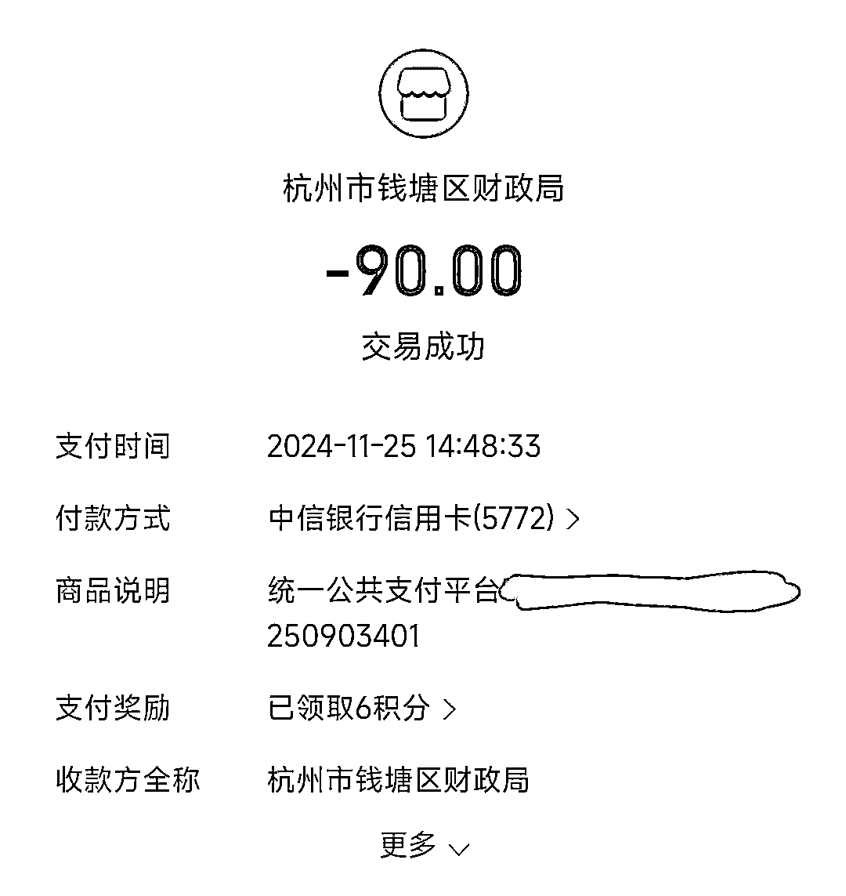
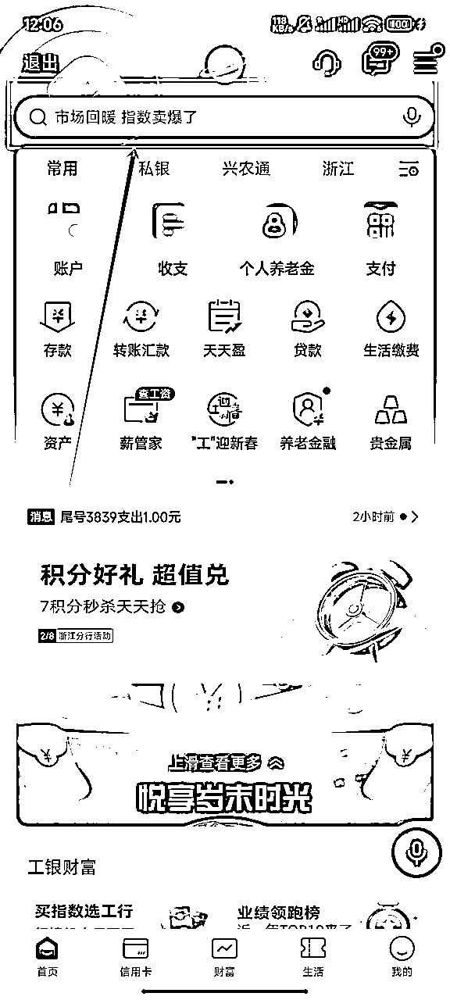
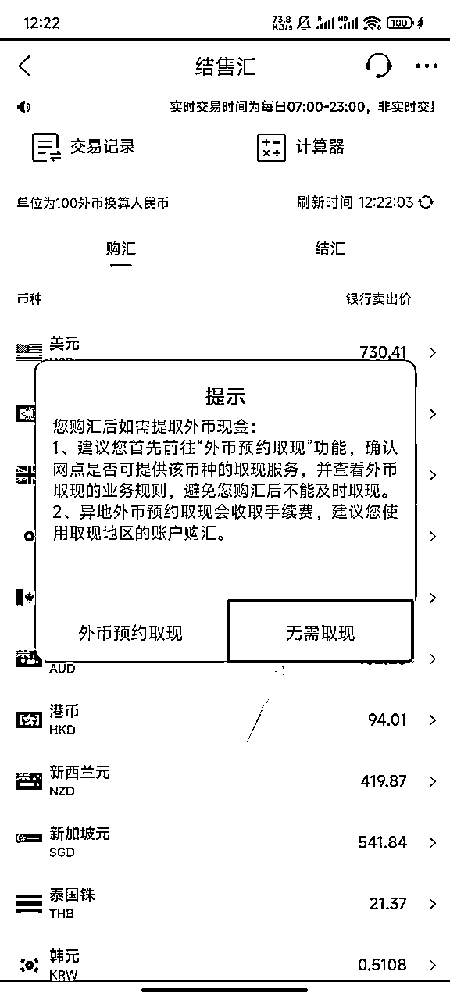
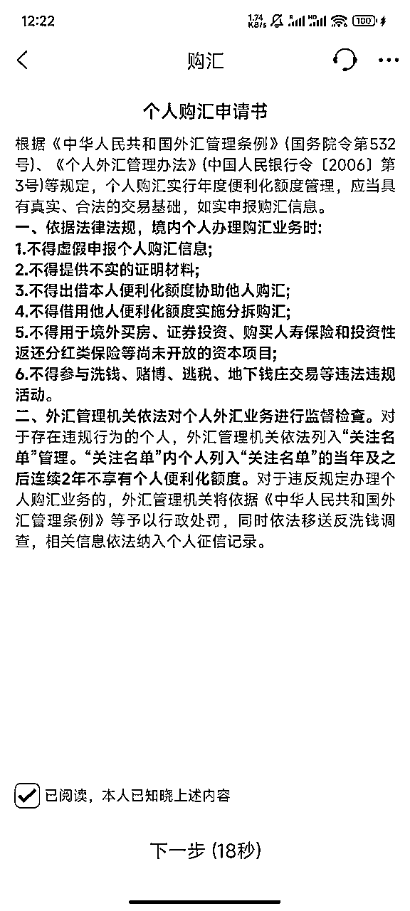

# 只要一张身份证，就可以实现全球收款，一份超详细的港卡办理攻略带给大家！

> 来源：[https://e1hu1wy3gm.feishu.cn/docx/BnNxd7oSSotQiUx4U3vc0RJanod](https://e1hu1wy3gm.feishu.cn/docx/BnNxd7oSSotQiUx4U3vc0RJanod)

申请香港汇丰港卡的经历真是有点一波三折。

网申系统直接给了双菱我一个“资料不可验证”的拒绝提示。

当时我都懵了，心里只想着：

好不容易迈出的全球支付第一步，就这么失败了？

但好在发现，能够连续继续申请！

于是在双菱和同行同事连续好几次重复的申请中！

终于！成功申请下！汇丰的银行卡了！！！

而纵观全球情况，

新加坡 OCBC 还是取消了大陆用户资格，之前办下来的卡后面用不了了；

与此同时，香港也逐渐增加了对大陆身份进入国际金融市场的限制……

港卡含金量还在上升！

所以我个人认为是在有能力的情况下，尽早把能够收取外汇的银行卡办理下来。

分享一下我们的办卡经验，希望能给大家一个最详细的申请港卡攻略！

（哇塞，关于我没关权限居然有人直接一个字没改转发了这件事）

# 开场三连问

## 一、哪些人需要办理港卡？

航海里就有很多可能会用到的，比如有关YouTube、跨境电商等，与出海业务相关的

同理，以下几类人就很推荐办理香港储蓄卡（因为用得上）：

1.  只要有外汇收入，港卡就更便于资金管理和生活消费

*   简单来说，就是能直接收外汇了，收到的外汇在出国旅游的时候也能直接付外汇

*   香港储蓄卡在全球支付的便利性使得他们可以在世界各地轻松地使用卡内资金进行消费，如支付酒店费用、购买机票、餐饮消费等。

（一）跨境电商从业者

1.  资金收付方便

*   跨境电商业务涉及不同国家和地区的货币交易。香港储蓄卡支持多种货币，如港币、美元、欧元等，方便接收来自全球各地客户的付款。

（二）海外投资人士

1.  全球资产配置需求

*   对于进行海外股票、基金、债券等投资的人来说，香港储蓄卡是一个很好的资金管理工具。投资者可以通过香港储蓄卡方便地将资金转入境外的证券账户，进行美股、港股或者其他国际市场的投资。

*   但储蓄卡并不意味着能够直接参与证券交易，目前开户政策收紧，开户会更复杂。股票开户是一定需要准备申请材料开户的。

1.  外汇交易便利

*   香港储蓄卡支持多种货币交易，对于有外汇交易需求的投资者非常有利。在国际外汇市场波动时，投资者可以利用香港储蓄卡快速地进行货币兑换操作。

（三）从事数字内容创作的人士（如YouTube创作者等）

1.  接收国际支付

*   YouTube等平台的创作者通常会通过广告收入、会员订阅、超级聊天等方式获得收益。这些收益大部分来自全球各地的观众。香港储蓄卡可以方便地接收来自这些国际平台的付款。

（四）想要出海的开发者

1.  应用内购和广告收入接收

*   对于移动应用或软件开发者而言，出海意味着面向全球市场。

*   如果产品在海外市场有内购功能（如游戏中的道具购买、软件高级功能解锁等）或者通过广告盈利，香港储蓄卡能够方便地接收来自全球应用商店（如 App Store、Google Play）或广告平台的收益。

一张能够直接收到外汇的银行卡，本身就是我们搭建全球支付体系的第一步

为什么这么说呢？那我们首先要搞清楚：

### 港卡和大陆卡的最大区别

*   全球通用：香港储蓄卡在全球范围内被广泛接受，可以在世界各地的商家和 ATM 机上使用，方便人们在海外旅行、出差或进行国际业务往来时进行支付和取款，无需携带大量现金，更加安全和便捷。

*   多币种支持：支持多种货币，如港币、人民币、日元、美元、欧元、英镑等，持卡人可以依据需要在不同的货币之间进行转换，避免了汇率损失和不便

## 二、办理港卡要求高吗？

不高，保证 身份证和港澳通行证 + 本人身处香港 就可以。

1.  基本证件要求

*   身份证和港澳通行证是办理香港储蓄卡的基本证件要求。这两个证件确保银行能够核实申请人的身份，并且确认其有合法进入香港办理业务的资格。

*   对于非香港居民，银行主要依靠这些证件来建立客户档案，进行反洗钱和合规性审查。

1.  地域要求

*   要求本人身处香港进行申请，这主要是出于监管和风险控制的考虑。香港金融管理局和银行自身都有严格的规定，确保银行能够面对面地核实客户身份，评估风险。

1.  网上申请情况

*   网上申请相对宽松是香港银行拓展业务和方便客户的一种方式。对收入水平、存款没有要求，使得更多人有机会申请香港储蓄卡。

*   这对于一些刚开始接触跨境业务或者只是希望有一个更方便的境外资金管理工具的人来说是比较友好的。

*   即使申请失败可以马上重新申请

1.  汇丰银行特殊情况

*   汇丰银行取消内地直接申请香港银行卡的渠道。

*   特殊环境无法绕过这一规定。

## 三、申请完成后，银行后续服务好吗？

我办理的是汇丰的银行卡，老实说，非常好

1.  APP售后体验

*   界面清晰易操作：明确的APP售后界面是银行提升客户体验的重要环节。它使得用户在遇到问题时能够迅速定位所需的服务或信息。

*   功能全面覆盖：一个好的APP售后界面还应具备全面的功能，涵盖账户管理、卡片服务、安全设置等多个方面。

1.  人工客服响应优势

*   快速响应机制：无论是线上咨询还是电话联系，人工客服的反应都极其迅速。

*   简洁转人工流程：转人工也不啰嗦，有效提高了问题解决的效率。有感觉客服小哥说话有很浓的班味。

1.  多语种服务特色

*   语言适应性广泛：提供粤语、英语、普通话服务。服务都很迅速。

# 一、前期准备

## 1. 港澳通行证办理：

### 准备材料

1.  身份证/户口本：申请人有效居民身份证；没有身份证儿童可使用户口本

1.  身份证复印件：窗口能直接复印，浙江不用携带，其他地区欢迎补充

*   照片：现场拍摄

*   深色衣服，拍照现场都有可以套的衣服，不用自己准备

*   可化妆，但不要太浓；现场也有卸妆的东西；不要戴美瞳；拍照时要露耳朵

*   如果真的有照片不合格，现场工作人员会让你补拍一张，额外贴二维码在申请材料上，这样就不需要因为照片跑两次

*   因为港澳通行证有效期很长（而且未到有效期申请补办 办理时的材料填写以及入关流程都会更麻烦一点），在意证件照的朋友可以拍完马上看一下照片，队伍不长都可以和工作人员申请重拍

### 网上查看 当地出入境管理局 工作时间

前往 当地出入境管理局 申请港澳通行证。

*   可通过微信或支付宝小程序搜索“港澳通行证”进行预约办理

*   但不须预约（主要是看预约也没啥用，该排队还是排队）

*   主要用于确认当天出入境管理局上不上班，有预约日期就是能办。正常工作日都能办的。

#### 微信

#小程序://移民局12367/dmhGTMAyXvciFml

#### 支付宝

https://ur.alipay.com/_5HzSdDsLSo4oc0HOBHhgS1

选择：“中国公民服务”

### 现场办理

*   提交申请：在叫号机取号后，填写 港澳通行证申请表；根据现场工作人员指示分流，首次办理，先排队拍照，再到相应窗口提交申请材料，

*   填写申请：按照窗口人员的提示填写好相关申请表，短时间第二次办卡的、温州户籍的朋友们可能需要多填写一些内容，不清楚或不符合表格内容的可以直接提问，确认应该怎么填写后再填写完整

*   采集指纹：需在工作人员的指引下进行指纹采集或核验指纹，左右手大拇指，16 周岁以下的申请人是否采集指纹根据其监护人的意见确定

*   受理申请：工作人员对申请人提交的材料进行初审，如材料齐全、符合要求，会出具缴费单给申请人，并告知申请人办理流程和注意事项。

### 缴纳费用

申请人凭缴费单到指定窗口缴纳办证及签注所需的费用

本人本次费用参考：

补办通行证（60）+港 澳签注各一次（30）=90 RMB

#### 制证费用

*   首次办理往来港澳通行证费用为 80 元 / 证

#### 补办费用

*   往来港澳通行证补办费用为 60 元 / 证

#### 签注费用

*   一次有效签注：每件 15 元

*   二次有效签注：每件 30 元

*   短期（不超过一年）多次有效签注：每件 80 元

*   一年以上（不含一年）两年以下（含两年）多次有效签注：每件 120 元

*   两年以上三年以下（不含三年）多次有效签注：每件 160 元

*   长期（三年以上，含三年）多次有效签注：每件 240 元

### 领取证件

*   窗口领取：申请人在收到领取证件的通知后，携带缴费回执和本人身份证（浙江二选一即可，代拿也一定要带上其中之一），到办理的出入境管理机构领取港澳通行证

*   邮寄送达：办理时可选择邮寄服务，在相应窗口填写地址并缴纳快递费。

证件制作完成后，出入境管理部门会按照申请人填写的收件地址进行邮寄

各地办理情况存在差异，但都会有志愿者提供帮助，

例如在杭州，现场有专门指引，遇到问题礼貌询问志愿者即可。

## 2. 银行卡申请材料准备：

### 柜台线下办理：

通常办理香港银行卡可能还需准备一些其他材料，

如身份证、少量港币现金（用于可能的小额支付，如账户激活等，若未准备也有其他解决办法，如在香港的银行网点支取或兑换，但可能有手续费）、地址证明（如水电费账单、银行对账单、租赁合同等）、在职证明（如有工作）、工资条或税单（如有）等，

建议提前了解清楚银行具体要求并准备齐全，以确保办卡流程顺利进行。

#### 但我们的目的是：跳过这些复杂的材料，直接网申！一步到位！

所以务必准备好线上申请的资料！

### 线上申请银行卡

保证 身份证和港澳通行证 + 本人身处香港 就可以。

1.  基本证件要求

*   身份证和港澳通行证是办理香港储蓄卡的基本证件要求。这两个证件确保银行能够核实申请人的身份，并且确认其有合法进入香港办理业务的资格。

*   对于非香港居民，银行主要依靠这些证件来建立客户档案，进行反洗钱和合规性审查。

1.  地域要求

*   要求本人身处香港进行申请，这主要是出于监管和风险控制的考虑。香港金融管理局和银行自身都有严格的规定，确保银行能够面对面地核实客户身份，评估风险。

1.  网上申请情况

*   网上申请相对宽松是香港银行拓展业务和方便客户的一种方式。对收入水平、存款没有要求，使得更多人有机会申请香港储蓄卡。

*   这对于一些刚开始接触跨境业务或者只是希望有一个更方便的境外资金管理工具的人来说是比较友好的。

*   即使申请失败可以马上重新申请

1.  汇丰银行特殊情况

*   汇丰银行取消内地直接申请香港银行卡的渠道。

*   使用科学上网等手段无法绕过

## 3. 下载汇丰银行 APP 准备

到达后流量充足完全可以到达后再使用（手机流量说明见：手机流量来源 跳转链接）

安卓用户在内地时，可以使用安装包直接安装；到达香港以后也可以直接下载；

苹果用户在内地时，则需了解要更改 IP 地址为香港后下载；到达香港以后也可以直接下载。

在确认拿到港澳通行证后，选择乘坐高铁或者深圳地铁前往香港。

# 二、到达香港

## 1、如何前往香港

这里直接推荐支付宝 - 直接更换定位为“中国香港” - 惠出境 - 跨境交通：

跨境交通网页链接：https://ur.alipay.com/_1mCM352EVT9EGVrT83wtpS

包含：内地到香港、深圳到香港、澳门到香港，三种途径全覆盖

我高铁进出、地铁进出都试过

高铁的体验感会比地铁好太多，对比一下：

### 高铁

通关及到达：

1.  到达西九龙站： 到达香港西九龙站后，在月台下车。

1.  前往第二层： 按照指示去到第二层。

1.  通关流程：

*   内地关： 先通过内地关。

*   香港口岸： 再到达香港口岸。

*   通关通道： 可选择自动通道或人工通道完成通关手续。

1.  出站进入市区： 通关后即可出站进入香港市区。

#### 优点

*   省时方便： 落地西九龙，旁边就是维多利亚港、旺角等，方便游玩。

*   自助通关： 出入关证件刷出入，基本自助都能走。

*   短时间（我是一年半）通行证丢失补办后，要走人工通道。

*   小孩需在家长带领的情况，要走人工通道。

#### 缺点

*   费用较高： 相比地铁，高铁的费用较高。

通常二等座票价为68/75，来回票价都是一样的。

#### 香港西九龙站口岸

通关模式：

*   “一地两检”模式： 旅客在同一座旅检大楼内，能一并完成出、入境手续，通关效率较高。就是能一次完成大陆&香港的安检。

*   节省时间： 比起其他口岸的“两站两检”模式，能节约半小时左右的通关时间。

交通便利性：

*   直接换乘： 出站后即为香港市区，站内可直接换乘香港地铁柯士甸站。

*   方便前往： 方便前往香港的各个区域。

### 地铁

路线选择：

*   从深圳出发：

*   可乘坐地铁到罗湖口岸或福田口岸。

*   乘坐深圳地铁1号线到终点罗湖口岸，或乘坐地铁4号线到福田口岸站B出入口下。

通关及换乘：

1.  到达口岸： 到达口岸后，跟随指示牌和人流。

1.  海关查验： 持港澳通行证通过海关查验身份。

1.  完成通关： 完成通关后，即可换乘香港的地铁进入市区。

优点：

*   经济实惠： 相比高铁，地铁费用较低。

*   通关速度： 出入关需要电子申请资料，刷码出，比较迅速。

从深圳到香港乘坐地铁的费用一般在 43港币到 45 港币左右，以下是具体情况：

罗湖口岸

从深圳地铁 1 号线罗湖站 A1、A2 出口，过关后到达港铁东铁线罗湖站，再经九龙塘转乘观塘线到油麻地，油麻地转乘荃湾线到尖沙咀站，全程约 52 分钟，八达通费用为 43.2 港币，单程票为 45 港币。

福田口岸

从深圳地铁 4/10 号线福田口岸站 C 出口，过关后到达港铁东铁线落马洲站，后续换乘同罗湖口岸路线，到尖沙咀站全程约 54 分钟，八达通费用为 43.2 港币，单程票为 45 港币

缺点：

*   耗时： 相比高铁，地铁通关可能耗时更长。

*   对电子信息不熟悉的人群不友好： 需要电子申请资料，对不熟悉电子信息的人群可能不太方便。

### 罗湖口岸特点：

历史与客流：

*   历史悠久： 是连接香港和中国内地的第一口岸，深圳人较为熟悉。

*   客流量较大： 入关能看到很多香港人。之前有帮香港阿姨申请过关码。

交通方式：

*   过关后直接乘坐： 过关后可直接乘坐香港东铁线。

*   直达区域： 地铁直达香港上水、粉岭、太和、大埔墟、大学、火炭、马场、沙田、大围、九龙塘、尖沙咀等区域，交通非常方便。

通关时间：

*   常规时间： 每日06：30-24：00。

*   特殊时间： 2月9日、2月11日通关时间至次日凌晨02：00。

## 2、手机流量来源

### 各大运营商都有全球上网途径

安卓机都可以开虚拟卡，此处以小米手机举例：小米路径-全球上网，开通后，到香港切到这张虚拟卡就行了

### 购买临时电话卡

鉴于香港国际漫游流量费用较高

我个人建议前往 7 - 11 便利店，购买一张 33 港币 的 临时电话卡，

其包含 30G 流量与一定通话时长，相比内地直接购买流量更划算且网络更流畅，

回大陆后该临时号码仍可使用并能接收短信，后续可以用于注册Google账号

电话一次性的也不会影响到Google账号，绑定好常用邮箱就可以

这次这张卡的激活时候会卡住的一个点是：需要无反光的港澳通行证正面照片

蹲在西九龙高铁站便利店口拍照其实蛮狼狈的，大家可以提前在手机里拍好，激活的时候直接上传就好

# 三、线上申请

## 1. 下载 APP

过关抵达香港后，安卓用户在 应用市场 中搜索下载“香港汇丰流动理财”APP；

苹果用户更改 IP 地址后下载（身处香港可直接搜索下载）

认准官网，保证财产安全

vivo应用商店下载链接

安卓端可以直接下这个

或官网下载apk文件

## 电话号码资料填写

注意事项：可以填写香港刚获得的临时电话，

但大陆电话号码也可以接收短信，所以推荐填写会长期使用的电话号码，根据个人情况选择

## 3. 申请流程

- 信息验证：打开 APP 后，开始验证个人信息，注意要选择“非香港居民”，选择中国，然后使用港澳通行证直接申请。

申请目的我选择的是：留学（本人02年）

不过香港对年龄方面本来就卡的不严格，都可以试试这个选项

- 信息调查：

银行会对个人信息进行调查，重点关注工资信息和是否为全职工作。

本人首次申请未通过是因选择非全职且账户资金来源“不以工资为主”

第二次填写 5000 港币/月 的工资为主要钱财来源后通过审核

*   这表明银行虽不严格卡收入门槛，但看重收入来源的稳定性和收入主要来源于工资。

后续会要求填个人税号，若前期工作与工资信息完整合理，个人税号可暂不填，也有较大概率通过审核。

- 地址填写：填写地址时需全部使用英文，

可能存在实体卡收不到的情况，但不影响通过卡号正常使用银行卡功能。

总体而言，香港汇丰银行卡网上申请流程并不复杂，只要提前做好准备，按照要求正确填写信息，就能顺利申请到银行卡，享受汇丰银行的服务。

同时，汇丰银行的网上咨询和电话咨询服务态度和速度都较好，在申请完成后遇到问题可及时咨询获取帮助。

## 后续转账信息

### 汇款信息

若您需要通过电汇从海外银行转账至您的香港汇丰银行账户，请向汇款银行提供以下信息：

*   SWIFT代码：HSBCHKHHHKH

*   银行名称：The Hongkong and Shanghai Banking Corporation Limited

*   银行地址：Head Office 1 Queen's Road Central, Hong Kong

*   受款人账户号码：10位或12位数字

*   受款人姓名：请参考您的结单、通知书或存折上的名称

请要求您的汇款银行使用SWIFT MT103格式发送汇款指示，并提供完整的汇款信息及偿付指示。您可以通过以下链接进一步查询接收汇入汇款所需要的信息：

客户参考资料表

因为我这个表格打开是乱码，所以也问了一下，客服的回答是这样的：

#### 如何打开以上表格

1.  在网页上找到对应的表格。

1.  右键并选择“将链接另存为”。

1.  保存到您的电脑文件中。

1.  在文件中右键选择该表格并选择“属性”。

1.  选择“更改”。

1.  选择“Adobe Acrobat Reader DC”。

1.  选择“应用”。

### 货币接受情况

我们线上申请的综合理财账户支持12种主要货币，包括：

*   港元

*   澳元

*   加拿大元

*   瑞士法郎

*   人民币（年利率1%）

*   欧元

*   英镑

*   日元

*   新西兰元

*   新加坡元

*   泰铢

*   美元

若需接收上述主要货币的汇款，您可提供以833或888结尾的综合理财账户号码。通常情况下，我们不会对汇款进行货币兑换。

### 转账及消费限制

对于转账，我们现在提供4种经网上理财转账至第三方账户的限额。

如需转账至非登记账户，转账限额如下：

- 每日的最高转账限额是港币400,000元或等值外币。当您转账至非注册账户，您需要使用保安编码器或者流动保安编码进行验证

- 每日小额转账限额最高是港币10,000元或等值外币，您可在网上理财及HSBC HK App进行小额支付

如需转账至已登记账户，每个登记账户每日的最高转账限额是港币3,000,000元或等值外币。

通过网上理财转账到已登记账户时，您不需要使用保安编码器或流动保安编码进行验证。

如需通过网上理财及HSBC HK App进行环球付款，每日跨境转账总限额最高为港币3,000,000元或等值外币。

请注意，如需转账至海外账户，向已登记或非登记环球收款人的每日最高转账金额，将受现有相应转账限额和每日跨境转账总限额限制，以较低者为准。

以上限额预设为0。更多详情，请浏览我们的网页：

https://cdn.hsbc.com.hk/content/dam/hsbc/hk/sc/docs/transfer-payments/master-limits-for-transfers-and-payments.pdf

对于消费，一般12位数字的自动柜员机卡只能用于提款。

自动柜员机卡本地每日最高提取限额是港币80,000元。海外提款限额可设定为本地限额的0%、50%或100%。

提款限额取决于您的限额设置。

# 四、各种出行攻略

## 1、香港交通

香港提供了多种市区通行方式，以满足不同居民和游客的需求。以下是一些主要的交通方式：

### • 地铁（港铁MTR）

• 香港地铁是香港最快捷、最方便的公共交通工具之一，覆盖香港岛、九龙和新界的主要区域。港铁线路包括荃湾线、观塘线、港岛线、东涌线等。

#### 香港地铁一日通购买方式

##### - 港铁站售票窗口：

在香港所有港铁站的售票窗口，都可以直接购买香港一日通，购买后从首次车程的入闸时间开始计算，24小时内有效

##### - 支付宝：

在支付宝APP首页顶部搜索框输入“惠出境”，点击进入后下滑页面，

点击中部右侧广告图“春节出行礼遇”，找到88元香港出行全日通点击“马上抢”，再点击“立即抢购”即可

#### 支付宝进香港地铁步骤

- 打开支付宝，点击首页的“出行”

- 点击右下角切换地区至香港，点击“前往领取”

- 勾选并点击“同意协议并领卡”，输入支付密码，即可领卡/乘车码

- 进站时，在带有扫描口的闸机处扫描乘车码即可

另外，香港地铁乘车不用安检哦

### • 电车（叮叮车）

• 电车是香港岛特有的交通工具，主要在港岛的东部和西部之间运行，是游览港岛的低成本方式。

官方路线&时间表：香港电车 - 时间表及车费

叮叮车（本地人也这么叫，因为开的时候会有“叮叮”的铃铛声）间隔时间会比地铁久很多，但是观光感觉非常好

虽然是双层，但是真的开的很快，非常快，之前体验了一把，发现根本没有注意力看外面的风景

但讲真，还是蛮有意思的！尤其是坐在上层，还能瞅见公交车站顶，是不是很新奇？（哈哈哈哈哈哈哈哈）

### • 的士（出租车）

• 香港的士分为三种：市区的士、新界的士和大屿山的士，分别在不同的区域运营。

因为香港的士价格相对较贵，所以本人未曾乘坐过。

#### 出行方式及行程示例

景区之间距离相对较近，采用 citywalk（城市漫步）的方式就足以满足出行需求。

比如本次出行时，就从旺角一直步行走到了西九龙。

香港不同类型的士计费方式如下 ：

- 市区的士（红色）：起步价22-27港币，覆盖最初2公里，之后每200米收费1.6-1.9港币，若有隧道或桥梁，乘客需支付10-50港币不等的额外费用。

- 新界的士（绿色）：起步价18.5-23.5港币，前2公里内为起步里程，之后每200米车费为1.4-1.7港币，同样需乘客承担隧道和桥梁费 。

- 大屿山的士（蓝色）：起步里程2公里，起步收费22元，之后每200米收费1.7元 。

此外，若携带行李，每件需额外支付5港币；残疾乘客的轮椅及拐杖则无须收费

• 网约车平台：您也可以通过网约车平台来打车，例如使用Uber、HKTaxi、85飞的Taxi等App来预约出租车。

## 2、交通怎么更省钱

公共交通：淘宝上可以买一日通，如果要逛的地方比较多，比较划算

如果不多，支付宝可以刷地铁

#### 支付宝进香港地铁步骤

- 打开支付宝，点击首页的“出行”

- 点击右下角切换地区至香港，点击“前往领取”

- 勾选并点击“同意协议并领卡”，输入支付密码，即可领卡/乘车码

- 进站时，在带有扫描口的闸机处扫描乘车码即可

## 3、怎么兑换港币

提示：香港很多小吃还是需要现金支付的，比如小红书大火的“8块钱的菠萝包”

在香港兑换港币有多种途径，以下是一些常见的兑换方式：

### • 银行兑换

#### 1.大陆银行兑换

##### 网上银行兑换

*   开通网上银行：如果尚未开通，需前往银行网点柜台签约开通网上银行服务，并设置登录密码和交易密码

*   登录网上银行：进入银行官方网站，输入账号、密码和验证码等信息登录个人网上银行账户

*   找到外汇兑换功能入口：在网上银行界面中，查找 “个人外汇业务”“外汇兑换”“结售汇” 等相关功能入口

*   选择港币进行兑换：进入外汇兑换页面后，选择港币作为兑换币种，输入兑换金额、选择购汇用途等信息

*   确认兑换：仔细核对兑换信息无误后，点击 “确认” 或 “提交” 按钮完成兑换操作。

*   提前预约：预约好分行以及取现金额，按预约取用现金即可

2.香港银行兑换

• 您可以在任何香港本地银行的分行进行港币兑换。这是最安全和最可靠的方式之一，但可能需要您持有银行账户。

• 根据中银香港的信息，通过「VISA/PLUS」网络以银行账户进行交易时，会加收1.95%的额外兑换手续费。通过「MasterCard/Cirrus」网络以银行账户进行交易时，会加收1%的额外兑换手续费。

### • 货币兑换店

• 香港有许多货币兑换店，尤其是在旅游热点区域如尖沙咀、旺角、铜锣湾等。这些兑换店提供多种货币兑换服务，但汇率和手续费可能会有所不同。

一些找换店如小女孩找换店、永恒找换店、多福找换店和惠捷找换店提供免手续费兑换服务。

不过一般兑换店的汇率会比罗湖口岸的高，走罗湖口岸的可以提前换了再去。

### • 机场兑换

• 香港国际机场内设有货币兑换柜台，方便刚抵达香港的旅客兑换港币。

• 机场兑换的具体手续费可能会有所不同，但通常机场的汇率可能不如市区内的兑换店优惠，且可能存在额外的手续费。

### • 酒店兑换

• 酒店兑换的具体手续费未在搜索结果中明确提供，但通常酒店的汇率和手续费可能不如外面的兑换店优惠。

### • 自动取款机（ATM）

• 使用ATM机取款时，可能会产生手续费。例如，有用户提到使用ATM取100港币时，手续费为20港币。

### • 信用卡和借记卡

• 根据百度知道的信息，使用招行VISA信用卡在香港购物，会收取每笔1.5%的外汇兑换手续费。银联卡在境外使用银联网络消费或取款无需支付1%-2%的货币转换费。

### • 电子钱包

• 微信支付和支付宝支付在香港消费时不收取手续费，并且以人民币结算。

实付满6笔后，汇率会更优惠

### • 货币兑换机

• 在一些商场和交通枢纽，您可能会找到货币兑换机，可以快速兑换港币。

## 4、八达通到底是什么？

八达通是香港通用的电子支付系统。大部分都需要港币现金购买，少量7-11便利店可以线上支付，但我没遇到过

它主要是一张内置芯片的卡片。八达通的用途广泛，在交通方面，能用于搭乘地铁、巴士、渡轮、山顶缆车等多种公共交通工具，乘客进出站时只需把八达通放在读卡器上感应就行，非常方便快捷。在购物消费上，像便利店、超市、餐厅、商场等场所也可以用八达通付款。甚至在一些自助贩卖机、停车场缴费等场景也能使用。

我们只需要知道两个版本：普通版 & 游客版

区别就是：普通版押金更贵但可以退；游客版不能退卡退押金

- 普通版（租卡）/租用版成人八达通：办理时需支付200港币，其中50港币为押金，150港币为充值金额，退卡时押金可退还.

- 游客版（买卡）/实体旅客版八达通：无需缴纳押金，不能退卡，39港币可购买一张，需额外充值消费金额.

办理香港八达通有以下几种方式：

线下办理

- 港铁客务中心：可办理个人销售版、租用版和旅客版八达通。办理租用版或旅客版八达通，只需前往香港任意地铁站的客务中心，携带港币现金购买即可，无需证件 。

- 过关口岸：罗湖口岸、落马洲口岸等过关点通常有八达通售卖服务，使用港币现金购买

- 连锁便利店：在7-Eleven等连锁便利店也可以购买八达通卡，但需注意支付方式，部分便利店可能仅支持港币现金

线上办理

- 八达通App：可在该App上办理个人销售版八达通，也可将八达通加入iPhone或Apple Watch

还可在Android版八达通App点击“新增”，输入增值金额，选择付款方式后按“加入新八达通”，支付完成后打开手机NFC功能即可使用

- MTR Mobile App或港铁官网：学生可通过MTR Mobile App或港铁官网申请学生八达通，填写表格、上传学生证及证件照、缴费后，等待审批通过领取实体卡.

（以下内容正在装修中，请稍后......）

## 五、内地银行卡，如何转账到香港银行卡

本文讲解一下，如何从内地的工商银行转到香港的汇丰银行，如何从内地的工商银行转到香港的中国银行（香港）。

## 一、在工商银行APP购汇

由于人民币不能直接汇往境外账户，需先在工商银行网上银行或手机银行，或前往线下柜台，进行购汇操作，将人民币兑换成港币或美元等外币。

将内地银行卡的人民币换成港币等外币，才能转到港卡，这一步就是购汇。

*   准备收款人信息：包括收款人姓名（需与香港银行账户开户时的姓名一致，一般为拼音或英文名）、收款账号、收款银行名称、收款银行地址、收款银行的 SWIFT 代码等。

*   汇丰银行网上开户的收款银行信息都是一样的

*   SWIFT代码：HSBCHKHHHKH

*   银行名称：The Hongkong and Shanghai Banking Corporation Limited

*   银行地址：Head Office 1 Queen's Road Central, Hong Kong

*   受款人账户号码：10位或12位数字（APP主页可见）

*   受款人姓名：请参考您的结单、通知书或存折上的名称

操作流程：

1.  打开工商银行APP，搜索“购汇” 或 “结汇” 或 “结售汇”

1.  选择“港币”

1.  选择“无需取现”

1.  输入购汇金额

这里重点是要选择【汇】，而不是【钞】。

汇，表示无需取现成钞票的形式，可以直接通过转账，转到香港银行卡。

另外，换汇汇款的手续费按笔收，请悉知

1.  确认购汇信息

（最近不去香港，就拿日元举例）

那么以上就是文章的全部内容啦，有什么问题欢迎在评论区里讨论！ヾ(•ω•`)o