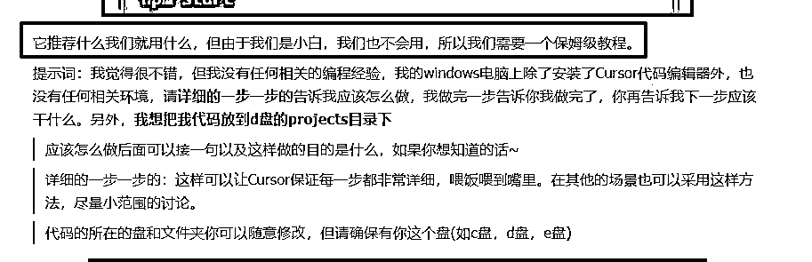
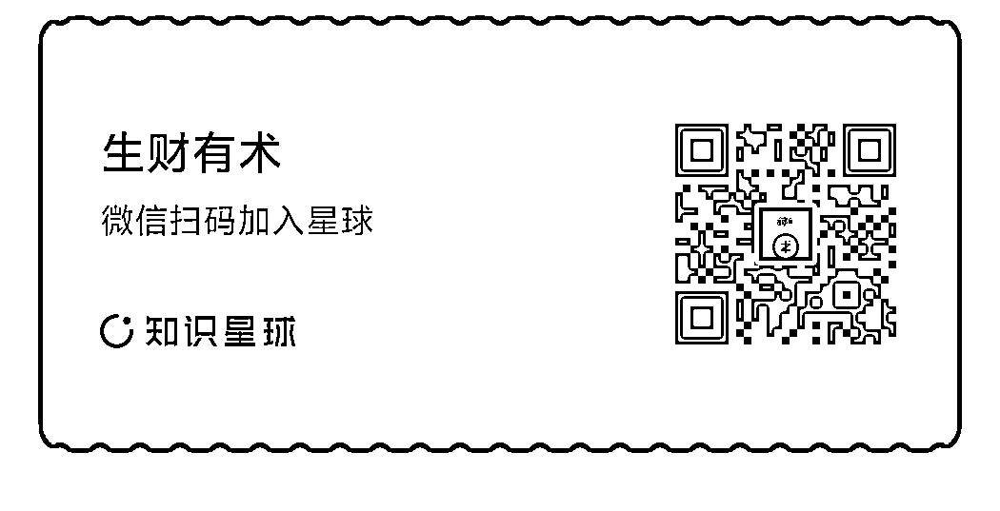

# 航海第一天 迎难而上，小白苦恼成长记-①

> 来源：[https://scnsk912rm25.feishu.cn/docx/Bpk8djuaxoNMYdxkJzEcC4rxnbe](https://scnsk912rm25.feishu.cn/docx/Bpk8djuaxoNMYdxkJzEcC4rxnbe)

开船前，想各种准备，但是各种奇怪事情，还是把准备的想法，只能是“想法”了。

昨天的启动日，在群里看到大家扔简介，心想：这么多厉害人物，还一起学习，那得加把劲啊，孟母三迁也就想给孩子找个优秀的环境。

如此有幸，和牛逼人一起学习的机会，得给自己压力，不能有借口，把之前啃过的手册，拿出来，再啃一遍。

# 拿着金子去变现

心中还是非常感受到，制作《航海手册》的教练们、前辈们的辛苦付出，真是无私到无敌了，就是把饭喂到口了。

## 不是怕“行走江湖的本领”丢了，只是怕我们吃不下，胃动力不足，导致“消化不良”！

好歹自己也参与过，ISO/OHS等企业标准的起草工作，非常明白这个《航海手册》的含金量，和要付出的精力。只要有过一些创业经验，这绝对是妥妥的《致富宝典》，创业要做到“点石成金”，但这份《宝典》相当于，拿着金子去合适的地方，就可以变现了。

说了这么多，就想引入一个正题：

# 这么好的教程，能否独立学会呢?

## 虽然是小白，不过深知一个道理，在这个社会里，要生存的“舒坦”，不再有老师和教科书，给我们按部就班去学习、去考试，而是要学会如何掌握“自学能力”。

## 我有一个感悟💩

### 交钱学习有“老师”教的，都不赚钱；

### 自己琢磨，顺藤摸瓜、按图索骥，就算照葫芦画瓢的，也能赚到钱。

# 出于这些思绪，给自己立下一个flag：

## 看手册、听高手讲、学习圈友问题、尝试不在群里请教，独立实战！

## 先说结果，第一关做到了。

## 贪吃蛇网页游戏

航海第一天，实现了不在群里发问，通过手册、ChatGPT、网络资料等，做出一个作品。虽刚出海，风浪不大（做一个贪吃蛇游戏），从陆地到海上经历波涛，还是挺抓狂的。

一起出海的船员感悟

如果你看到这里，准备写实战过程前

## 挺想说一些“肺”话：

### 如果你是前辈，现在或将来要带船员航海，是否可以在“破冰期”让萌新小白，学习或掌握一些“自我求生技能”呢，如ChatGPT、豆包使用，搜索引擎的搜索方法，还有生财工具包等。

### 如果是和我一样的萌新小白，希望也能看到每个项目的《航海手册》就是金子；我下面“抓耳挠腮”的经历，能看我解决的思路，建立自己的“自救能力”。

### 如果能帮的上忙，也希望能分享给更多的萌新小白，让大家一起在“生财”强大起来。

### 在“生财”看到太多优秀分享，感染了我，让我也想把学到的知识，分享给大家，也是费曼学习法的一种方式。

# 风浪颠簸过程：

# 一、航海前的准备

9月初加入生财，就为了参加航海，没问清楚错过了，所以挺期待这样12月航海。

还没开始前，我重新把ChatGPT开通，用一下，让自己熟悉，这里我还写了在生财的第一篇文章，也是第一次用飞书写文章。感觉没白加入，起码自己有写东西分享的动力。

## ChatGPT部分就不重复了，有兴趣可以看看

准备航海前的“临时抱佛脚”：打破AI小白的困惑

飞书：

## 我怎么看《航海笔记》

准备的时候，我会先看一遍，基本是“囫囵吞枣”，跟猪八怪吃人参果差不多，能把书签栏对应的内容，大概知道就行，粗略看不懂就不深究了。

因为我知道，我粗略看不懂，也不会懂的，对于整个手册，我只需要知道主题是什么，是不是我想要的，如果用力，啃下他会不会磕掉牙，还是加点水能咽下去，这个“心里有数”很重要。

## 这个肤浅的想法怎么来到

我会选择让自己努努力、跳一跳能触碰到（不是拿到），这样会大大降低我半途而废的几率。

还有一个点，不是九死一生的时候，没必要逼自己背水一战；其实，很多时候我们还有很多更好的选择，为什么要决策一个自己不理智的，浮夸的选择；通常这些选择后，都得不到正向结果，也浪费了宝贵的时间。

## 如果不合适怎么办

不用担心“凉拌”，生财给我们好多选择，可以退押金，可以报《AI写作》，还可以先自己学习《ChatGPT提效》，这些都是能给我们熟悉ChatGPT，也有太多工作、生活场景应用，掌握的再差，都能立马产生正向结果，给工作、生活带来质的提升。

# 二、吹响启航的号角

## 第一步做什么

把《手册》的第一章认真研读，同时对不了解的内容，就去找找资料，和把原来收藏过的资料，再“水过鸭背”一次，这样能让我把收藏的资料，当成我的额外工具库，水过鸭背只为了让自己，产生“目录”记忆，需要时，可以快速查找。

## 脑子就这么大

现在信息太爆炸了，兄弟莫要贪杯，能记得住目录已经够牛逼的了。

真正存留的知识，是我们实践过程，领悟得到的知识；就像游泳和骑车，一辈子都忘不掉，只会生疏而已；很多大牛，你问他为什么能写这么好的文案，他可以给你说123，但是你就做不到，也就能抄个型而已。换个主题、换个领域，就是比大牛差。

想表达的观点是，大牛也是人，也不可能一天就练成，都是慢慢积累，一步一脚印的走过来，不用着急，一口是吃不出一个大胖子，只能吃出胃胀气来。

我把全部精力在研究第一章，慢慢来会更快

# 三、别墨迹-冲出去

## 别傻，我只想表达我遇到了“重重”困难！

打开航海手册，安装和注册没有问题，只是遇到了用QQ邮箱注册的时候，提示“密码泄露21次”，搞了10分钟，没搞明白，跟着手册做，直接用Gmail邮箱登录，立马解决。（不要被小细节缠住，快速体验流程）

要做一个体验题，开发一个小游戏，又遇到问题了，手册的版面和我的不一样，又搞了几分钟，还是不会，放弃。

要找其他解决方法，准备到网上找资料，一下就想起曾经看过的文章

。

马上去打开，竟然版面和我的一样，跟着版面去打开按钮就可以了。搞掂，还是那句，快速体验流程。

临时决定，既然版面不一样，就根着版面一样的走。先主力跟着《吴佳文》学习，同时打开《手册》做对比。

## 新角色要进来了

本来想跟着把提示词复制粘贴的，但是一想，我还是觉得要用自己手打才更有感觉。

果不然，当我打完后，看到“脚手架”，就觉得好奇。为什么会用这个词，我觉得作者“啊紫”真是太体贴了，他还知道我想了解“脚手架”这个词，必须点赞。

不过遗憾的是，学生愚钝，文章给出的提示词，有点没吃透，为什么要加”脚手架“，看了解释，还是一知半解，找教练，算了，还是先找ChatGPT吧。

哦，就是写文章的“框架”咯，心里有个大概，继续下一步。

# 四、贴心老师，谁能不爱~

## 老师教的好，学生也差不了，看到啊紫的一句话，让我心生欢喜。

感谢我刚才一时的“发颠”，放在好好的提示词不抄，非要自己打字。就从那一霎开始，我的好奇宝宝就冒出来了。

## 家人们，谁懂呀！

从我问ChatGPT这句话开始，直到完成整个《贪吃蛇小游戏》，我都没再看手册，更别说去群里问教练了，直接开始和GPT走上手牵手的学习大道上了。

我把原来阿紫的提示语，吃进去，用自己的话重新讲一次，按照自己心里的想法去和cursor去沟通，看看结果怎么样，条条大路通罗马，看看能不能去到啊紫的结果里。

# 五、师傅带进门，修行靠个人

## 确实有点叛逆

学了啊紫开头的第一个提示词，加上ChatGPT的给力，就感觉自己行了，完全走自己的风格，

阿紫下一步要做的和手册差不多，就是要搭建环境，cursor建议也是一样。

我看到还有第二点建议，我直接一个反手，把cursor回复的内容，扔给了GPT，让他好好为我服务。

## 脱离教程，就脱个干净。

我想走走第二条路，因为完全是小白，还是走了好几个弯路。

1.  版面不了解

1.  按键不了解

1.  代码不了解

## 就像学骑自行车一样

跌了、摔了、碰了，就能颤颤巍巍的样子“骑起来”了。

试错一段时间后，摸到了一些规律，知道什么是代码块，哪个按键是一键复制，哪个是单个复制。

## 一个小分享

### 不要怕重做，做错了，就删掉重来；就像骑车，摔倒了，就扶起单车，重新再上，摔几次，感觉不疼了，就敢加速了；加速，惯性就带来的平衡感了。

### 我就是什么按键都去按，错了好几次，发现，cursor人家可聪明了，他会特意让我猜到，某些按键有一些特殊作用，他的位置、形态都有一些寓意，有逻辑，真的错几次就会了。

### 跟玩一个新游戏差不多，你想，哪个游戏作者不想你快点上手啊。

# 六、遇见傻子，怎么办！

## 没错，这个傻子正是在下。

## 你见过和ChatGPT撒娇的吗

就是因为小白，真的是什么都不会。找个按钮都要问GPT几回，还好，就是这样“不耻下问”，问出个经验：

截图+文字=GPT耐心教学+更明白你的问题 （手册和阿紫都有教）

## 又是小技巧

### 截图，

#### 如果你知道哪里的问题，就截哪里，具体点，GPT更快给你更好的答案

#### 如果你不知道，不要管，直接给他来个大的，全屏截图，让他知道这个网站，你做对了和做错了哪里。

### 文字

#### 大概和截图差不多，懂点，问具体点；

#### 不懂，别装懂，一定要有多白痴的问，就多白痴的问。

#### 问到他能给你说明白为之，不用担心，GPT不咬人，也花不了多少钱。

#### 还有很多遇到的问题，打一千字都说不完，我就不啰嗦，大家自己举一反三，我就直接跳下一步。

# 七、要不你教会我，要不我教你做人

## 其实很多问题的原因是相同的

就是因为我们是小白，太外行了，GPT不知道我们这么笨，所以我们要教会他，怎么做一个能给小白讲明白的人。

## 像不像你女朋友，教你怎么爱她

### 怎么样，应该还不够你女朋友要求多吧。

其实你完全可以把GPT当人看，我觉得豆包已经挺智能，更别说ChatGPT4o了.

### 怎么样能像你女朋友这么幸福。

放胆去调教GPT，他一定比你更能忍耐，又更有修养；一旦，你懂的调教他怎么“伺候”你，你一定不会离不开他。

## 一个小知识

### 用ChatGPT，用ChatGPT 4o with canvas，这版带画布功能的，很方便，会在原来的内容不断修改，也可以回看修改的内容，逻辑推理比4o更强，还会不断更新记忆，不容易发神经。

### 如果写代码，用o1-preview听说会更好，我不会代码，所以没试过。

# 八、退一步海阔天空

## 被ChatGPT卡死了

什么都做好了，就是没法用链接分享给别，这个和最初的要求，就差一步。

搞了好久，你猜怎么样~~~~还是一个熊样！！！

## 当我在崩溃的边缘，要不就放弃吧，在群里问教练怎么处理吧~

在看群的时候，花生在开直播-《新手如何快速上手cursor》，都要放弃了，要不就先看看大神要教我们什么吧。

群里有回放链接，大家没看的可以去看看。

卡住，就给自己放放空，说不定“转角遇上爱”呢。

# 九、不要为了1棵树，放弃一片森林

听完，感觉“死灰有点复燃”，比失落的时候，要松弛了不少。

## 一个念头，没ChatGPT之前，遇到问题，用搜索呀；百度、抖音、微信、小红书、B站等，一大堆信息的源头。

## 就用抖音吧，毕竟视频生动点。

### 搜“GitHub教学”，差点被这词搞死，因为太范了，看了5-6个就放弃了；

### 想一想，再结合刚才看的，好像浮现一个词“github page”

#### 可算找到救星了，看了2个，就解决了卡死的问题。

第一个，还像说到位了，但和原来做的不一样，先放弃吧；

不花一分钱，半分钟搭建自己的网站，手把手教程

第二个，和之前做的接近，但是为什么和我的版面不一样；

新手5分钟搭建个人网站，GitHub申请与page静态页面设置

最后的解决

第二个是2021年，所以版面不对，但是讲得通俗易懂，让我觉得第一个好像能试一试，再看，2024年，没跑了，就按他的做，虽然也有不一样的地方，但是加上翻译，对比一下意思，妥当，可以操作。

终于成了。又是小白问题造成，不过这些错误，让我更深刻的了解“GitHub”。

最终成果：贪吃蛇网页游戏

# 十、发现了光

## 有一个圈友问花生的一个问题：

米娅：“教练，目前学习科目主要有哪些渠道呢？”

教练：“说实话，我自己偶尔会看几个 YouTube 视频，但我很少去看别人的文章内容或是别人的视频。所以，米娅同学，我觉得你看一些视频，以及看我们的航海教程，然后多些自己实操去积累，其实差不多就够了。虽然我自己也有个知识星球，但我这里就不做推荐了，其实你现有的材料，已经足够帮助你学习了。”

## 个人感悟

我也不知道为什么能写这么多，而且还是省略了好多问题去写。

全篇这么长，其实花生老师给这个同学的回答，是最好的中心思想，想起庄子的一个故事，《轮扁斫轮》，大家有时间也可以了解一下。

学会“自学能力”才是最好的功法秘籍，如果资料看不懂，不着急，可以先挑初级层次的事情尝试，一步一脚印，不要想着一口吃成大胖子。

毛主席教导我们，“集中优势兵力，各个歼灭敌人”，不要害怕风口过了，慢人一步；我们每一个步伐，走出自己的节奏，踏实好每一个脚印，我们向上的通道，才会更稳更长！

# 如果看到文章，也想加入这个优秀的圈子，可以点击下面的链接，领取3天试用权限喔~https://t.zsxq.com/eQYFZ

