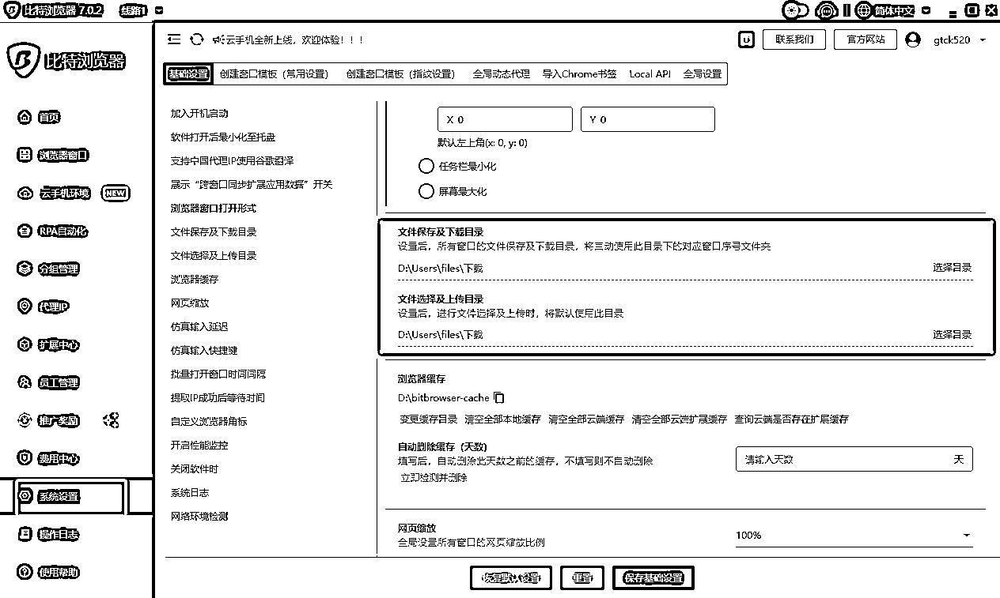

# 用一个RPA脚本搞定小绿书、小红书、公众号爆文的自动发布

> 来源：[https://b121w2zgwyx.feishu.cn/docx/BqDcdNkcZok1R6xVCLZcQxApn9g](https://b121w2zgwyx.feishu.cn/docx/BqDcdNkcZok1R6xVCLZcQxApn9g)

之前的文章

脚本实现了，自动调用coze工作流，生成文章，并自动发布公众号爆文和小绿书的功能。不过经过使用和大家的反馈发现以下问题：

1、脚本分成了多个导致安装脚本相对麻烦

2、运行过程中缺乏提示信息，导致排查错误困难

3、还有就是希望可以自动勾选原创

4、希望加上小红书的发布，这样小绿书素材也可以发布到小红书

我觉得都很有道理，所以就安排上了，经过我最新的合并和开发，我将之前的所有脚本合并成了一个，目前这个脚本可以实现以下功能：

1、自动调用小红书改写小绿书工作流

2、自动调用公众号coze改写工作流

3、新增了服务号的发布兼容

4、新增了小红书的发布兼容

5、新增了自动勾选原创（公众号文章的）

6、coze工作流新增了更通用的总结小绿书生成工作流（适用多个领域的内容生成）

接下来，来说一下这个脚本的安装和使用吧

# 一、首先，飞书申请与权限配置。

请看 ，飞书这个配置要仔细看，没做好，工具无法使用

# 二、脚本工具环境配置

## 1、比特浏览器安装

https://www.bitbrowser.cn/ 没什么特别说明的，直接安装就是了

## 2、比特浏览器配置

### ①、打开比特浏览器，做个基础配置

点击系统配置=》找到文件下载目录配置 改成你想要的目录

这个目录是后面下载图片时要用到的。

### ②、导入rpa脚本

现在脚本合并了，只需要安装以下脚本

下载脚本之后，然后, 打开比特浏览器=》 点击 “RPA自动化” =》进入流程设计

浏览器会初始化，并打开一个用于调试的RPA窗口，以及自带安装好的Automa 插件。

打开automa窗口，进入工作流页面=》点击下拉标志=》点击导入工作流，将前面下载的工作流导入

## 3、排版工具的准备

我们的脚本使用了一个叫做墨滴的markdown排版工具，AI生成的内容会自动生成markdown格式。我们通过这个工具进行转换排版，并发布公众号。

### ①、登录墨滴

https://www.mdnice.com/ 没有账号的去注册一个；

### ②、新建一个文章页面

标题随便输入就行了

### ③、设置一个自己喜欢的主题排版

在内容中，随便输入一些内容，如图：

接着我们选择一个我们喜欢的主题，后续文章就会使用这个主题排版

④、保存一下当前文章的链接地址

接下来我们保存一下，然后将这个文章地址复制下来，后续要配置到脚本当中，复制完就可以关闭了。

## 4、rpa配置

### ①、拷贝我最新的飞书模版

进入我的飞书表格

创建一下副本

然后获取飞书表格链接，注意了，每个表单点击一下，链接都不一样的，后面的配置会用到，一定要对应正确的表格链接

### ②、脚本默认配置

接下来，我们开始进行脚本的基本配置，每个脚本都要配置哦。我们首先打开比特浏览器=》 点击 “RPA自动化” =》进入流程设计。

然后进入工作流页面找到我们的刚刚导入的脚本，点击进入脚本编辑页面。找到触发器的后面一个节点叫做“插入数据”，我们双击“插入数据”，（看下图，我有做了标注）然后点击左边的 “insert data”按钮,修改里面的参数；

这个脚本需要配置的参数如下：

| app_id | 填你前面飞书得到的app_id; |
| app_secret | 填你前面飞书得到的app_secret ; |
| xuanti_sheet_url | 填你的选题库表单的url |
| daifabu_sheet_url | 填你的飞书待发布表单的url（前面有说明过了） |
| yifabu_sheet_url | 填你的飞书已发布表单的url |
| zhanhao_sheet_url | 填你的飞书账号配置表单的url |
| xhs_sheet_url | 小红书爬取的链接 |
| save_draft | 这个填1 代表发布到草稿箱，填0代表直接发布（待测试完善） |
| download_path | 这个填前面第2步，比特浏览器的下载目录就行了 |
| markdown_theme | 排版主题文章链接，这里填写第3步墨滴排版配置好的地址 |
| user_name | 账号用户名（请查看 ） |
| parent_code | 上级邀请码（请查看 ） |
| is_modi | 是否开启排版，不开启则不会进行排版 |
| lingyu | 随便填预留的 |

### ③、调试脚本（请调试没问题之后再进行绑定到窗口）

每个脚本配置完成之后，请先点保存，再运行调试。调试没问题之后，再进行下一个脚本。

### ④、调试注意项

因为脚本合并之后，一次执行，其实会并发打开三个页面，每个页面都做会自动化执行任务。但是呢活动页面只会停留在公众号的页面，大家记得人工点开其余两个页面，看看运行的情况。（而且，第一次需要登陆，一定要注意检查一下，没问题之后，以后就不必太关注了）

如何看有没有问题？

点击运行之后请点击这个日志

脚本运行失败一般都会出现如下报错：

请根据报错问题调整，实在不会调整，请点开详情，找到红色的报错的位置，把具体信息反馈到交流群，如：

### ④、绑定窗口后，记得授予权限

如何绑定窗口使用，这个之前的教程文档里有可以去查看，这里不再重复。

在 二、4、将rpa配置到比特浏览器，以实现定时执行，和ip隔离

请大家一定要注意，如果绑定到窗口执行，第一次记得打开窗口里面的脚本进行权限授予

首先，打开窗口，如下图，进入浏览器窗口，打开窗口：

从窗口里打开窗口的automa，然后找到导入的脚本。

对以下三个节点进行授予权限，我已经特意给拉出来了，只要在这个地方授予了正常就能用了：

# 三、脚本使用

目前脚本实现的功能说明，我已经整理成文档，大家可以查看：

这里重点说一下新增的功能注意点：

账号配置表格，新增了两列，使用说明如下：

原创作者：如果填写了原创作者则表明，公众号图文需要声明原创，如果不需要，则留空

定时发布：填写定时发布，则会定时发布，如果不填则直接发布（定时发布暂时只针对小红书）

# 四、常见问题

## 1、脚本成功执行，但是调用coze智能体失败

请检查，脚本配置里的xuanti_sheet_url 是否确实是选题库的对应链接。并且选题库里面有最新的选题需要生成。并且按照要求配置信息（选题库里的“最后一次生成时间”为空表示需要ai进行生成）

## 2、脚本成功执行，但是公众号没有执行自动发布

请检查，脚本配置里的 daifabu_sheet_url 是否确实是待发布表格的链接。并且待发布里面是否有内容需要发布（待发布标题不在已发布表格里，就说明需要发布）

好了，本次的分享就到这里了，大家如果有什么使用上的问题和建议，欢迎找我一起交流

## 3、提取内容和图片名失败

出现以上的错误，基本是待发布没有文章内容，或者待发布文章内容的领域类型与当前发布账号的领域类型对应不上，所以，无内容可发。请检查配置中的待发布文章表格链接，或者领域类型是否正确！