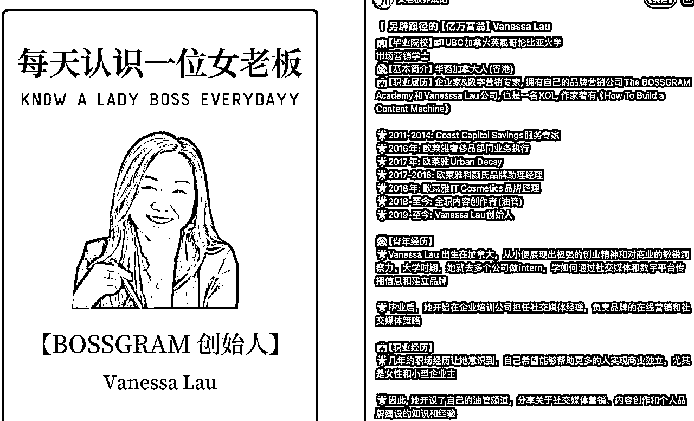
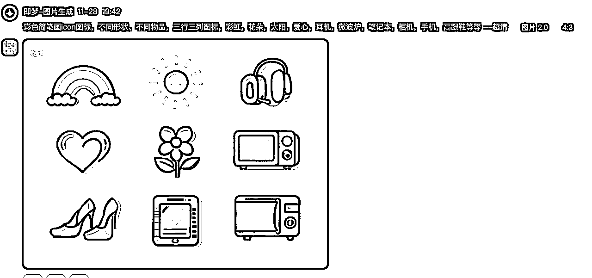
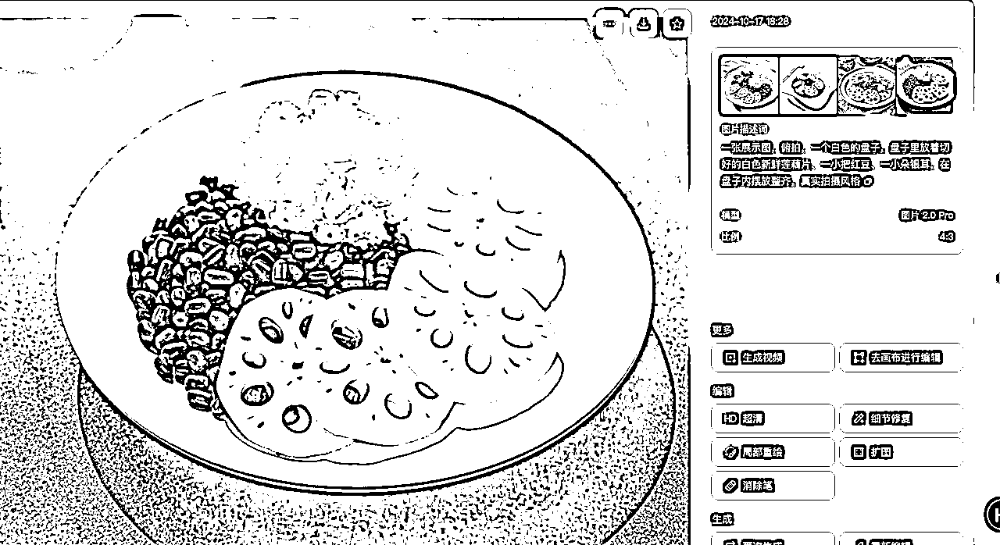

# 十分钟教你用AI复刻一个小红书万粉账号！

> 来源：[https://xqya1zd76f2.feishu.cn/docx/CI83dbv3voosZZxzjUIce66Kn65](https://xqya1zd76f2.feishu.cn/docx/CI83dbv3voosZZxzjUIce66Kn65)

大家好，我是竹子，生财传术师，也是12月YouTube航海的教练。

今天这篇帖子的灵感来源于圈友的风向标，因为一直在AI赛道，所以看到这个账号的第一反应就是，这种账号用AI来辅助，简直不要太简单了！！感谢这位圈友给的灵感让我迅速产出了这篇帖子～

而且这种类型的账号完美切中了“大女主”“她经济”，做女性成长类的社群简直不要太精准了。

所以，今天来写个帖子，十分钟教会大家，如何用AI辅助，来拆解、复刻一个这样的账号。不是说你非得做一样的内容，而是通过学会这个方法，你会发现，小红书上有很多这样的图文类账号，都是可以直接用AI来实现的。

# 一、账号拆解：

把这个账号当成一个对标账号，我们先来拆解这个账号内容：

## 图片：

图片的结构很简单，都是固定模板，首图是「每天认识一位女老板」+英文+女老板照片+女老板头衔+名字

内页是小标题+照片+文字

## 文案：

文案和图片内页中的文字一样，是直接把文案复制到了图片里

## 完成一篇笔记所需内容：

那么，完成一篇这样的笔记或者做这样一个账号需要什么内容呢？

1.女老板的清单

2.单个女老板的信息，包括：

*   毕业院校

*   基本简介

*   职业履历

*   青年经历

*   职业经历

3.女老板照片

只要知道以上内容，我们就可以完成一篇笔记的内容制作了，接下来，我们来看看，怎么用AI来辅助这些内容。

# 二、利用AI完成笔记内容制作

## 1.用AI获取女老板列表

首先，我们去哪搜集女老板的信息呢？

这个时候，请出我们的小帮助-kimi，问问它，国内外有哪些知名的女老板，帮我列出20个。

然后他就会联网搜索，这个时候你会发现，它是有信息来源的，来源是100位女老板，这种网页你就可以收藏一下，100个够发3个月笔记了。

到这里，我们提到的第一个女老板名单有了，接下来就需要单个老板的具体信息。

## 2.用AI获取女老板生平信息

这里，我们还是可以继续用kimi来帮我们整理，让他根据我们列出来的信息，联网搜索，列出我们需要的信息，这里，文案部分就很完整了。

## 3.用AI整理笔记文案

我们还可以继续操作，让kimi帮我们给以上内容再整理一下，往文案里加一点表情符号，更加符合小红书风格：

到这里，就很符合我们前面拆解的笔记的风格了～

然后还可以继续搜索图片，旁边就会给出很多～

到这里，我们所需要的信息已经全部收集完毕了。

# 三、用AI批量制作笔记

接下来，只要去可画或者稿定设计里制作一个模板，就可以反复更换图片和文案来制作笔记了。

这里我推荐用可画，因为可画的会员里有一个AI批量制作笔记的功能。

比如，我可以先制作一个可画模板：

在应用里可以找到批量创建。

这里我们可以把这钱kimi给我们的内容，让他整理成表格形式，就可以复制粘贴到本地的excel文档里：

然后在上传数据的地方，上传这个表格：

就可以按照提示，把数据关联到你模板上的素材上：

右键文本框，选择关联数据，上面的选头衔，下面的选名字，关联上就行

直接点继续，就可以一波生成20个封面：

同理，内容页也可以这么操作。把内容内页的文本制作好，把内容分好小标题，放进表格里，上传数据、关联数据即可。

不过有些字数不同可能会导致文字超出框框，还是需要进行一些手动调整，以及手动添加图片。

但是效率还是提升很多啦！

# 四、AI绘画在笔记制作上的其他应用

AI绘画，在笔记制作上其实还有很多作用，像跟上面说的每天认识一位女老板有异曲同工之妙的，还有很多：

比如你做养生的，可以每天学习一个养生小技巧；

做律师的，每天学习一个法律小知识

做美业的，每天学习一个护肤小技巧

做理财的，每天学习一个金融小知识

做自媒体的，每天学习一个创业小技巧、涨粉小技巧

做实体的，每天学习一个同城获客小技巧

这里，也放一个我之前写的国内的一个AI绘画工具的应用，能够帮大家搞定很多小红书、小绿书的图片素材制作问题：

## 即梦AI绘画&视频使用指南：

即梦AI是剪映旗下的一款AI工具，包含AI绘画、AI视频和智能画布（可以进行图片设计）功能。

官网地址：https://jimeng.jianying.com/ai-tool/home 有APP版本，搜索“即梦AI”即可，一个黑底蓝色的陀螺图标。

接下来，主要给大家介绍一下即梦AI的AI绘画和AI视频功能，以及我们做自媒体过程中可以如何运用。

## AI绘画功能

即梦AI每天会赠送66个免费积分，每次画图会消耗1～2积分。根据经验如果使用比较频繁，送的积分会多一些，我遇到过送88积分或者100多积分的，基本免费的积分就够用了。

在即梦首页，就可以看到AI作图——图片生成，点击去就到画图界面啦！

图片生成区域非常简单，填写提示词，选择生图模型、图片比例之后，点击生成图片就可以啦。

所以，画图的提示词是最重要的。提示词是什么呢？简而言之，提示词就是【我想画一幅什么样的图片】。

给大家分享一套我自己用的万能提示词框架：主体+详细描述+风格+特定要求（并不是每个部分都要有，可以视情况来）

①主体，就是你要画什么

比如，你想要画一只小兔子，那么”小兔子“就是你的主体

②详细描述，就是对主体的具体化描述，可以是颜色、服装、情绪、所在的场景、在做什么

比如，一只兔子，它穿着白色的裙子，它很伤心

③风格，就是你想要这个作品的艺术风格是怎样的，比如模仿某个艺术家或者特定的风格

比如，皮克斯风格，电影海报的风格，或者你想要模仿梵高的风格，或者宫崎骏的风格，中国风水墨画的风格等等

④特定要求，这部分用于添加特别的要求或者限制条件，比如特定的光线、角度、镜头距离、特效、尺寸等

比如，柔软的光线，侧面角度，全身镜头等等

总结：通俗来讲，就是告诉 AI，一个某某物，具体是什么样子的，置于什么样子的环境下，画面以什么样的构图形式出现，有哪些光影、摄影、图片渲染模式，整体画风是怎样的

举个例子，比如我想要在小红书上做这样的「梦中情房」的账号，那么这样的图片怎么画呢？

那么，我这张图片的提示词就可以这样拆解：

主体：一个公寓/卧室，双层/三层的床

附加描述：可以描绘一下周围的环境，比如大落地窗，城市夜景，螺旋楼梯，柔和灯光，装饰等等

风格：未来主义艺术家风格，未来主义室内设计

其中，色调，描述，都是可以自己修改的，这样你就有源源不断可以产出的图片。

再比如说，我想做一个这样的清单类的小红书账号：

这样的封面上有很多的简笔画小图标，那么这种我自己不会画怎么办？

也可以用AI来画：

风格关键词：彩色简笔画Icon图标，不同形状、不同物品，x行x列图标

元素词可以自己更换。

提示词示例：彩色简笔画icon图标，不同形状、不同物品，三行三列图标，彩虹，花朵，太阳，爱心，耳机，微波炉，笔记本，相机，手机，高跟鞋等等

然后拿到可画里去抠图去掉背景就可以了：

再比如，这种每天学点xxx/xx养成计划的图文账号，都是可以用AI来画图的：

给大家分享几个提示词框架（标亮的是关键风格提示词，没有标亮的部分可以自己修改）：

卡通图案：

鳄鱼，站立，卡通风格，简笔画手绘，纯白色背景

矢量图标风格：

矢量图标，白色图标，简洁风格，蓝色背景，两个人站立，举着酒杯

简单线条画风：

简笔画风格，粗线条纯色风格，纯色背景，一个小女孩在散步，可爱风格，艺术家风格涂鸦

基本上各种各样的图片，用AI都可以做出来，甚至你做养生类的，食材都可以用AI来画：

做辅食类的也可以：

做手工类的也可以：

如果你的提示词画不出来你想要的风格，你也可以上传一张参考图片，选择参考项——参考风格，就可以画出对应风格的图片：

除此之外，还可以参考主体、参考人物长相保持人物一致性、参考物体的边缘轮廓用于制作产品图，更换不同背景等等。

实拍不够，AI来凑！AI还是太全面了！绘画功能就介绍到这里，大家可以自己多去用不同的提示词进行探索～

## AI视频功能

AI视频，也就是把静态的图片变成动态的视频。在即梦的主页，AI视频-视频生成就可以看到。

使用界面和AI作图差不多，提示词+选择视频模型就可以。近期新出的2.0视频模式效果还不错。

S2.0每次生成5积分，S2.0 pro、P2.0 pro每次生成20积分。平时S2.0也够用了。

AI视频的提示词可以参考这个结构，简单来说，就是你希望某张图片出现怎样的动态效果，或者凭空生成一个怎样的视频：

举个例子：

比如我们用图片生成视频，生成一个甄嬛传大橘比耶的视频，我们就可以先上传一张大橘图片：

然后在提示词里写：

他伸出左手，比了个“胜利”姿势，面带微笑

以上就是即梦AI的简单使用指南啦！

对于我们来说，用绘图的功能创作小红书、小绿书素材会比较多，具体的使用场景还是根据自己的业务需求来～

以上就是一些利用AI提效内容创作的一些小技巧啦，希望能够对大家有帮助～