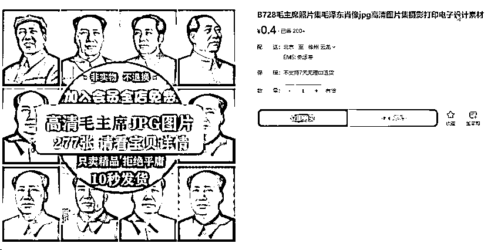

# 抖音蓝海小赛道私域变现项目，单价9.9/单天变现100+，实操玩法分享给你

> 来源：[https://o0yvn3o31a.feishu.cn/docx/CL7Ldi0mEo6Wl9xcU0Kcy5Z5nog](https://o0yvn3o31a.feishu.cn/docx/CL7Ldi0mEo6Wl9xcU0Kcy5Z5nog)

# 大家好，我是黄岛主！

今天给大家分享的是抖音蓝海小众赛道虚拟资料变现玩法，这个是通过抖音引流卖卖毛选资料，目前做的人不是太多，我们称之为是蓝海小赛道，除了这个还有很多，大家都可以多去拓展哈。

目前这个赛道，我们通过数据分析得出来的，因为当下大环境很多人都喜欢追求正能量的内容，对爱国情怀比较高，而毛选资料正好针对这部分群体，且受众群体比较大。所以，我们就测试了毛选类的资料做了变现测试，发现效果还不错哈。

我们先看一下毛选案例，这个是我们做的其中一个抖音账号，做了两天就开始有人咨询并出单了。玩法也很简单，只需要生成微信聊天记录，或者简单二创，在背景图上加上文字，然后3-5分钟生成一条视频发到抖音，就会有客户咨询，然后引流到微信上变现，这个比较适合小白、宝妈或者兼职，每天1-2个小时能做多个账号！

毛选资料的一套价格单价9.9，如果需要全套资料可以19.9、29.9之间，根据客户的承受能力，沟通过程中定价，9.9是固定的，19块，20块自己定价，价格可以测试一下的。

有个细节说下，我们做账号定位要保持账号统一性，比如做微信聊天记录，就把后面内容全部做成聊天记录形式，如果做成二创，就全部做成二创，保持账号统一性，这样才能发育起来哈！

这次复盘的内容涵盖：账号定位、注册、养号、制作、变现，如果你感兴趣的话，可以按照我写的复盘去操作看看哈！

# 1、账号注册

注册账号这块很简单，我详细的跟大家说明下，大家往下继续看：

注册建议：推荐使用新账号注册，因为新账号更容易操作，抖音对新账号更友好，老号的话注销，重新注册，账号不需要实名认证，除非你有别的用途（备注:注销账号次数不宜过多，最多五次，以免影响账号数据）

注册设备：准备两个或以上苹果/安卓手机，只要不是特别卡都可以，不要用过老的机型，容易卡顿，还容易限流，如果自己有一些设备，可以少量测试，如果买二手机，建议刷机以后再用，安卓可以直接恢复出厂设置，苹果手机可以用爱思助手进行深度刷机。

手机号卡：选择三大运营商新卡，或者抖音专用流量卡，不要用物联网卡、解码卡、虚拟号卡注册，套餐选择的话3到5G，流量太少一个月刷到十几号就不够用，通话不重要，可以选择纯流量卡。

注册细节：注册环境一机一卡一号，在4G或5G网络下进行，注册的过程中抖音可能弹出获取通讯录权限，手机通讯录里添加十个以上的号码，防止被认定营销账号。

注册流程：在应用中心下载抖音，手机一键登录，在注册账号的时候不要填写资料，直接跳过完成注册进行养号，新账号注册需要填写资料，养号完成以后再资料填写，注册账号时务必使用移动数据，避免使用Wi-Fi，多账号使用同一个网络注册，大概率会被识别为营销账号。

养号流程：早中晚30到60分钟，养号的过程要循序渐进呃，每天都养账号活跃度，累积账号权重，养号期间不要修改账号任何信息，影响账号垂直度，养号周期3到7天。

第1天、注册后正常刷一些推荐内容，不需要进行刻意互动。

第2到3天、通过关键词毛选搜索同领域作品和账号，下拉框里的都可以搜，适当的关注同行对标账号，看一下同行具体内容，然感觉不错的进行点赞、评论、收藏，模拟正常用户行为。

第4天、检查账号推荐的内容看看怎么样，例如:同领域内容多，则开始完善账号信息，并发布内容，否则继续养号（养号多养几天没事，时间越久越好）

养完后账号完善，昵称选择红色爱国或者毛选相关昵称，比如某某同志，加上括号备注领取资料等，比如红色基因、毛选分享，毛选分享员、毛选讲解员之类的，没有特定内容，只是让大家知道你是干什么的，多参考对标账号。

头像的话，用爱国、红色、明亮的，与昵称相辅相成，清晰直观，关注毛选的人，大部分都是比较积极向上，有正能量的人，头像不要有负能量，或者非主流，资料上写红色宣言或者领袖名言，在最后备注一下发布内容无任何思想宣传。

# 2、操作流程

1、素材：

建议找红色的爱国素材主题，获取渠道比较多，背景可以直接淘宝买，几分钱，几块钱就搞定了，或者多平台搜索爱国主题背景、毛选的相关书籍(毛选内容要选没有水印的，带有评论领取的可以使用)，教员图片素材（素描画，铅笔画，铜像等只要是教员照片就可以），平台可以去抖音、快手、小红书。

打开抖音，搜索毛选，筛选图文，写电子资料获取的都可以用，聊天记录形式的也可以用。

找到需要的内容以后，右下角点复制链接，微信搜索皮皮去水印，轻抖去水印，配音神器Pro小程序都可以提取文案，图片可以无水印提取，视频也可以提取文案，其他的素材下载方法都是一样，可以把素材分类整理，后期用的时候比较方便，不会乱。

为了增加内容的原创度，可以把教员图片和毛选书籍图进行抠图处理，放在不同的背景上使用，背景图可以用风景图或者爱国红色图片，只要是积极向上、阳光的就可以。

2、抠图：

用美图秀秀也可以，也准备了抠图软件，直接把图片放进去就可以抠出来了，保存使用就可以了，整理好素材就可以开始制作视频。

3、图片制作：

单图模式包括毛选书籍+图片，微信聊天记录，多图拼接方式。

直接用美图秀秀，打开选一个爱国背景图，调整一下尺寸，1080*1920，插入抠好的毛选图，就是单图，是最简单的方式，

微信聊天记录也是这种方式，微信可以用两个账号互相聊天，把图截下来，截了图以后放到抠图软件里，抠出背景，抠完以后放到美图秀秀里，直接在背景图加上聊天记录就可以了。

多图拼接上面加上引流广告，美图秀它里有拼图功能，选择智能拼图，选择不同的格式，左侧是爱国背景图，右侧放上带评论的，和聊天记录的，图片效果不是特别好，大概分享一下方式，可以直接仿照这个，就是拼图的方式。

把爱国图片、教员图、微信聊天记录做成三张图，加上背景音乐做成一个视频，和单图模式一样，只是说把单图换成了三图。

4、视频制作：

图片改视频，用生成的单图或者三图的内容放到剪映里面，加上一些特效生成视频，打开剪剪映，比如加一个背景图，视频比例3：4或者9：16都可以，以3：4为例，先把背景图拉大，把屏幕铺满，再加毛选图、教员图或者微信记录，图片都是需要先抠图的，三张图片放里面。

然后加背景音乐，在抖音上找一个热门同行的，复制链接放到剪映音频里，会自动解析音频，音频拖到轨道上以后，调成7到10秒。

然后给图片加转场，根据自己喜好，不是花里胡哨都可以，就是简单的三图转视频，把图片直接拉进来就可以，没有太多技术含量，点击导出，择好我们的标题，这我们后面可以改，直接导出，选择目录导出。

3、二创模式：

采集同行视频，配合抠图素材、换背景各种特效做组合搭配，做成精品视频，这是目前我用效果不错的方法，找一些毛选视频，视频素材下载方式和图文方式一样，直接用同行的，小程序去水印软件就可以。

打开剪映，先加竖版背景，爱国背景图片要铺满，3：4的比例，再把视频拉进来放在最上方，尺寸和3：4的尺寸一样，放到最上方，在下面添加微信聊天记录，或者加抠过图的毛选都可以，我因为整体背景都是红色，所以下面加白色，有颜色上的冲击性，调整一下尺寸。

把三张图拼好以后，再加教员的抠图素材，也可以用来遮挡图片或者视频上的水印，放到合适的位置。

看视频音频内容是带声音的，还是歌曲，如果只是音乐的话，就用音频分离，如果是带人说话的话，就把人声分离出来，添加背景音乐，有歌声分离不掉的话，随便加一个背景音乐，背景音乐去下载同行热门的，放到剪映里面使用。再加一些特效，和刚才的图文一样，根据需求加特效，拉到和视频对齐。

视频可以做简单的调整，可以打上关键帧，总长五分钟视频，开头打一个，把水平缩放调大一点105，在两分钟，再打一个关键帧，把缩放调到110，旋转三度左右，在三分半左右打关键帧，调到115，最后结束的时候打关键帧调到100，上面视频就有轻微的左右晃动，但不影响观看，视频做好直接导出。

# 3、发布流程

在抖音APP上直接发布，比较简单，抖音上点击最下面加号，选择制作好的作品，添加描述，添加话题，描述可以仿照同行，比如无删减内容已整理完毕，一起学习，或者是引流的文字，可以评论或者看主页之类的，直接复制同行的用，加3、5个话题，毛选、读书力量、读书分享、精选语录都可以，直接上传视频。

发布技巧：

选择用户活跃度较高的时段发布，早上7点到9点，中午11点到2点，晚上的6点到8点，这几个时间段是用户活跃度比较高的，更容易出现爆款视频，内容需要保持日更，每个账号每天发布2到3条作品，保证账号内容质量和账号活跃度，后续流量稳定以后，每天一条作品。

# 4、引流方法

简介引流：在简介内用谐音字标出微信号，或使用@功能指向引流号，艾特小号进行引流，也有直接在视频内容上写上看主页加V的字样。

标记引流：在背景图片里标记微信账号和指向特定的小号，就直接写上电子版+V微信号。

评论区引导：视频内容本身就加了引导，需要让用户评论，如果有用户评论想要电子版的话，可以给他直接回复图片，看我简介或者看主页，把账号昵称换成看主页。

评论的时候要注意，在引流的过程中，建议使用谐音字代替敏感字，防止内容被屏蔽，另外就是回复频率要适当控制，如果说一个视频报了，有可能几十或者几百个，不要每个都回复，只找一个评回复评论，把用户置顶就可以。

在引流的时候，仅回复和引流相关的内容，其他问题不要回复，引流过来以后正常聊天成交，客户问，我们就告诉他多少钱，单价和打包价，也可以用这种长文字的，效果会好一些，把所有的内容都列出来，可以引导客户买全套资料。

新用户在引流过程当中要注意，因为毛选是五套，正常市面上只有四卷，第五卷有很多限制，给大家的资料，直接传到网盘不允许分享，会屏蔽掉，拿到资料先转存到自己网盘，再下载到本地进行备份。

话术细节：可以先免费给他第一卷毛选，再推荐买后面的，第一卷免费，2到5卷收费，再加全套多少钱，这是很不错的引流方式。

分好多版本，我只发给他67版，再引导他购买全套，也可以一上来就给客户报价，这种开门见山比较有效率，客户刚加你，可能问你一些问题，比如:是未删减版的吗？有没有其他的资料。如果第一次成交的是单个资料，后面可以推荐全套教员资料以优惠价格吸引客户。

加到客户后，要备注客户的信息，区分成交和未成交的客户，便于未来查询和管理，根据自己的情况调整，未成交的用户可以发不同的免费资料，比如教员文稿，发一小部分，引导购买其他的资料。

# 5、朋友圈打造

朋友圈可以发一些真实人设、产品和成交情况，不断的和客户建立信任度，用小号加微信，把他的朋友圈直接抄过来，产品定位一开始是正常毛选五卷9.9，全套资料打包19.9、29.9，目前测试19.9成交率更高，根据客户的承受能力。（备注:可以加一些对标账号去看下，或者直接模仿抄袭）

如果你感觉客户比较直接，没有犹豫的，可以先试着报29.9，如果有犹豫的话，再给他报优惠价19.9，根据不同客户做不同调整，收款方式一般是微信、支付宝，一定要先付款后发资料，最近遇到了好多白嫖的。

# 写在最后：

差不多这些吧，按照我写的这个SOP可以完美的去操作这个项目，如果你感兴趣可以看完就去实操，做出效果也可以找我反馈的，好了，有任何问题可以找我交流就行了！

注意：未经授权，禁止转载到各大平台，需要授权，找黄岛主即可！