# 从二线城市小报记者到旅居全国数字游民，我不上班养活自己的2大秘密武器

> 来源：[https://ra12zj49nv9.feishu.cn/docx/CTlOdPgppoZQloxZ78bcZPSUnte](https://ra12zj49nv9.feishu.cn/docx/CTlOdPgppoZQloxZ78bcZPSUnte)

各位朋友好，我是张老板，7年互联网自由职业者，今天来分享一篇长文，我7年的自由职业经验总结帖。

主题是：《从二线城市小报记者到旅居全国数字游民，我不上班养活自己的2大秘密武器》

希望对有想做自由职业、想做项目和个人ip的朋友，有所启发。

本篇文章合计约8000字，目录如下：

1、如何成为旅居全国的自由职业者？我的2大阶段

1.1、第一阶段：上班族摸鱼做副业项目，收获自媒体第一桶金

1.2、第二阶段：项目+ip并行，实现自由职业稳定创收

2、第1个秘密武器：个人ip壶把理论，聚焦一个点突破1000天

3、第2个秘密武器：4次迭代小项目赚百万，1克拉的钻石最值钱

3.1、第一阶段：自己干，跑通闭环赚小钱

3.2、第二阶段：带全家6口人干，深耕细分产品一起赚钱

3.3、第三阶段：结合ip，自营陪跑服务，招募500人放大收益

3.4、第四阶段：组建闲鱼ip团队，深耕赛道放大规模

先爆个照片，和新老朋友们认识一下！

以下是正文：

## 如何成为旅居全国的自由职业？我的2大阶段

为了方便大家理解我接下来要说的2个秘密武器，我先简单来回顾一下我这几年的自由职业生涯，大概可以分成2个阶段。

第一阶段：上班族摸鱼做副业项目，收获自媒体第一桶金

第二阶段：项目+ip并行，实现自由职业稳定创收

### 第一阶段：上班族摸鱼做副业项目，收获自媒体第一桶金

在成为一名自由职业者之前，我也是一名普通的上班族，在济南的一家报社工作，我的第一桶金，就是上班的时候摸鱼做自媒体副业赚的。

我具体是怎么做的？

当时我家住在济南东部，距离上班的地方挺远，有个十几公里左右，每天要开车上班。

为了避免堵车，我会稍微早一点出门。

在车上，我不听音乐，不听广播，专门下载了一个 东北的电台节目去听。

这个节目叫：叶文有话说。

你们现在也可以去搜搜这个电台节目，全是讲的各种狗血的情感故事，大部分都还是真实的。

从家里开车到上班的地方，路上我就听这个叶文有话说，到单位的时候，就听完了一到两个故事。

到单位时，还比较早，同事们还没来，就我自己在办公室，然后，我就打开电脑，把路上刚刚听到的故事，花个20分钟半小时左右，用自己的话写一遍，起个题目，发到各个自媒体平台上，比如企鹅号、今日头条、大鱼号等等。

一早上，大概可以写2篇文章。

就写这一个内容，就重复这一个操作，每天开车听故事，到办公室就写一遍，就这么个不浪费时间又简单的操作，帮我多赚了8万多。

这是这个账号当时的收入截图：

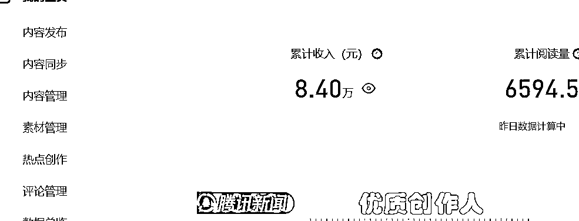

具体到在职场摸鱼做副业的这段时间，这个账号，每天可以给我贡献600块左右的额外收益，一个月就是一万多的副业收入。

后来，因为公司情况的一些变化，加上刚好也有这样一个稳定收入的契机，我就没有再去寻找新的工作，直接成为了自由职业者，开始全职做自媒体。

同时，有了更多的时间和精力，也不仅仅只写情感文章了，开始去拓展更多的领域，注册更多的账号，并且在一个新的领域：国际内容领域，拿到了更大的结果。

当时国际领域，我是做到了头部账号的，比如企鹅、头条、一点的官方作者群，我都在里面，都有官方人员给我们服务。

有一次腾讯还专门举办了一次自媒体作者大会，在故宫里面的一个紫禁书院，邀请我们参会，请我们吃饭。

这是当时我参会的照片。找找里面哪个是我哈哈：

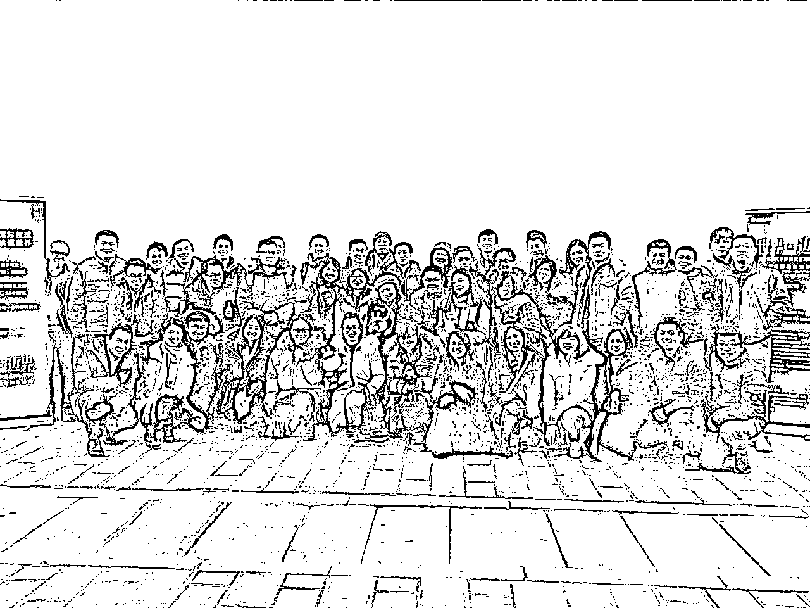

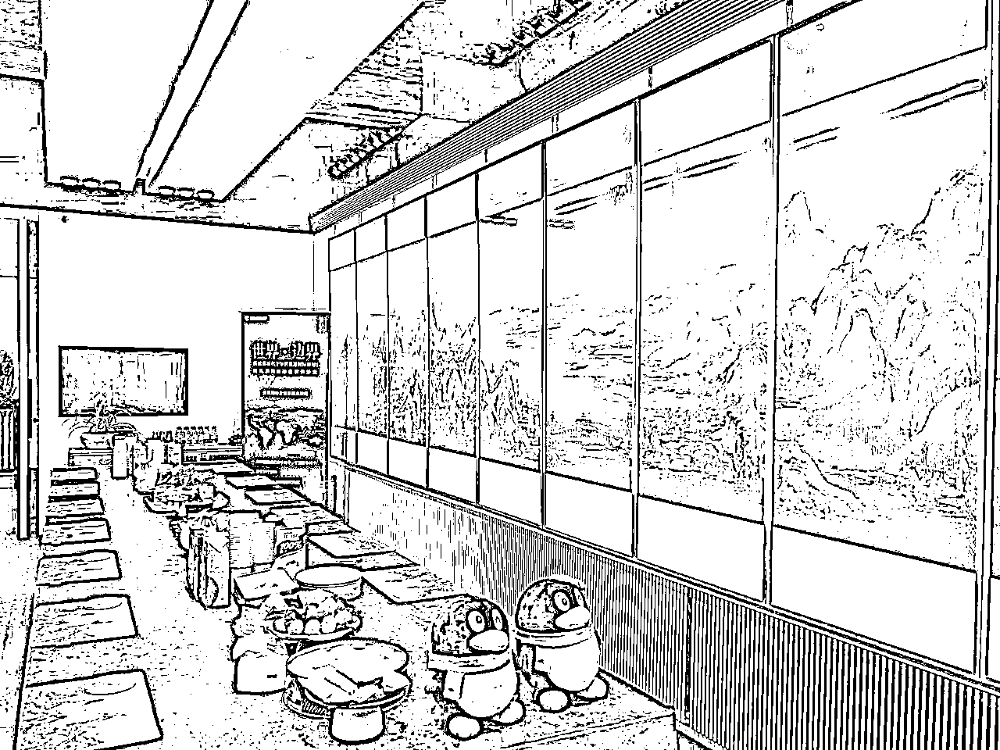

同样来展示一下其中一个账号的后台数据，比如这个账号，收益就到了百万级别：

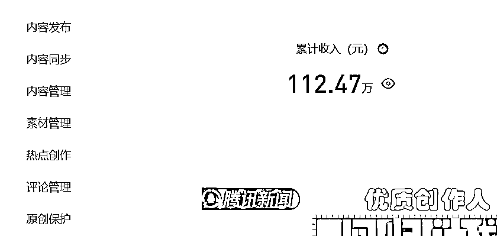

不过，这个时候，问题也出现了。

图文自媒体比较好的时期，收益也比较可观，一天大几千上万收益的时候也很多。

那个时候就比较舒服，感觉闷头做项目，不做别的收益就很好，然后就除了做项目就是玩。

比如出去旅游，在海南旅居，光海南，文昌、博鳌、三亚我们都旅居过。

就忽略了一件很关键的事：

流量是平台的，不是我们自己的。

当平台给你流量的时候，你会很舒服；

但是平台不给你流量了，你就很难受了。

而且，有时候趋势是不可逆的。

比如抖音等短视频的冲击，首先冲击到的，就是我们那一波图文自媒体作者。

很多流量都被短视频吸走了，我们的流量少了，钱就少了。

流量下滑的时候，收入减少了，马上那个不可控感、焦虑感就出来了。

因为你不知道你的明天会怎么样

你不知道你明天的收入要在哪里

你不知道你明天要去哪搞钱。

我马上意识到这样不行，单纯靠平台型流量项目，自己没有沉淀，没有积累，没有话语权，是很难做到持续发展、持续赚钱的。

不要只沉迷于项目短期收益，多做有积累有复利的事情；

居安思危，做好当下赚钱的事情的时候，要给自己做长远的布局，哪怕这个布局当下不赚钱。

那么这种局面该去怎么突破？

怎么去把短期的收益变成长期收益？

怎么把短期行为变成长期复利？

怎么把没积累的事情变成有积累的事情？

我马上做出了2个调整：

一个是测试更多的项目，来稳固收入渠道。

本身我就是自由职业者，也不需要上班，有大把的时间可以测试。

我先后测试了很多项目：

闲鱼电商项目；

拼多多电商项目；

知乎好物推荐项目；

抖音教辅带货项目；

web3的一些项目（比较敏感就不多说了）；

线下白酒代理；

等等等等。

另一个就是开始走项目+ip的路子，从2021年左右的时候，开始做张老板这个ip。

这个决定，也让我的自由职业生涯进入了第二阶段：

项目+ip并行，实现自由职业稳定创收。

### 第二阶段：项目+ip并行，实现自由职业稳定创收

张老板这个ip起盘，是借助当时我自己跑通的一个小项目：闲鱼项目来起盘的，并以此为基础进行了几次迭代。

从自己做闲鱼项目；

到带着全家6口人做闲鱼项目；

到带着几百位学员做闲鱼项目；

再到今天我带出了一批闲鱼ip、闲鱼老师共创这个细分赛道。

到目前为止，在闲鱼这个小项目上，通过项目+ip结合的方式，也给我创造了100万以上的收益，并且还在持续创收中，这个小项目成了我的ip基本盘项目之一。

这种项目+Ip组合的形式，让我的日常动作变的更有积累：

持续做好项目，拿结果，赚钱，积攒经验

并把拿到的结果和经验，多复盘，多思考，多公开输出和分享，合理适当秀肌肉，持续给ip加分，增强影响力，积累私域，自营产品+分销cps并行

如是循环

经验越来越多，私域越来越多，钱越来越多

形成了正向循环，并且越来越好，现在我对自己以后不上班只工作的生活状态，更加有信心啦

如上这是我对自己自由职业2个阶段的一个简要总结。

下面来聊聊今天分享的重点，我的2个秘密武器。

## 第1个秘密武器：个人ip壶把理论，聚焦一个点突破1000天

第一个武器，要解决如何让别人记住，并且信任我们的ip的问题。

这是我自己原创且一直在践行的个人ip壶把理论，这个理论的灵感源自于我在报社工作时候的老领导。

2010年我刚大学毕业，考试进了济南日报社工作，我的直属上级领导叫邵珠富（这个老领导在网上比较活跃，所以说出名字来也无所谓），当时是报社的副总，非常喜欢玩策划。到现在，网上也能查询到很多关于老领导的文章和策划理论。

当时，我们在一起工作、吃饭的时候，邵总经常和我说一个营销里面的理论。

他说，一个装满开水的壶，你直接去拿，太烫手了，拿不起来的。

但是，有一个壶把的话，就能很轻松的拿起来了，所以营销要找到这个壶把。

当时我们一起去济南一个专门做鹅的饭店吃炖大鹅，他还和我说你知道这个鹅的“把儿”是什么么？就是鹅是世界上唯一不得癌症的动物，这个补充了我的知识盲点。

后来我辞职当了自由职业者，埋头做互联网项目；

再后来到三四年前开始去做个人ip，这个理论一直记在我心里，影响着我的举动。

我在做个人ip的时候，不自觉的就用上了这个理论，我将其称之为：个人ip壶把理论。

做个人ip，也要找到自己的那个“壶把”，去打造自己的个人ip里程碑事件，去打造用户对你这个ip的记忆点，这样你的ip才更容易立起来。就像装满开水的壶，更容易被提起来。

举几个例子：

逻辑思维的罗振宇，坚持每天输出60秒语音10年，这个就是他的“把儿”；

我自己，坚持每天早上日更晨间日记10年，这个也是我的“把儿”。

这个理论，很形象，也很有用。

找到自己的“壶把”，赚钱会更加高效。

对，上面说的我的“把儿”是日更晨间日记，这个就是我的第一个秘密武器。

聚焦突破，打造自己的标志性事件，别人才容易记住你。

我自己策划打造的个人Ip标志性事件，就是日更晨间日记复盘10年。

我还给自己设计了一个口号和愿景，叫：每天一篇写10年，写完退休去云南。

而今天就是我日更晨间日记复盘的1172天，每天早上公开写，风雨无阻，一天也没有断过。

这是我的第一篇晨间日记复盘，发布于2021年9月24日：

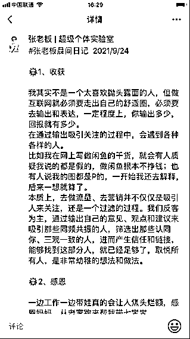

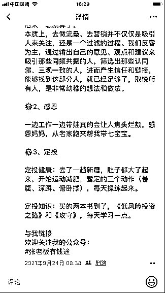

我选择晨间日记这个形式，可不是我独创的啊，一是模仿了币圈内一位大佬的模式；

二是受到了一本书的影响《晨间日记的奇迹》，我截图一下这本书：

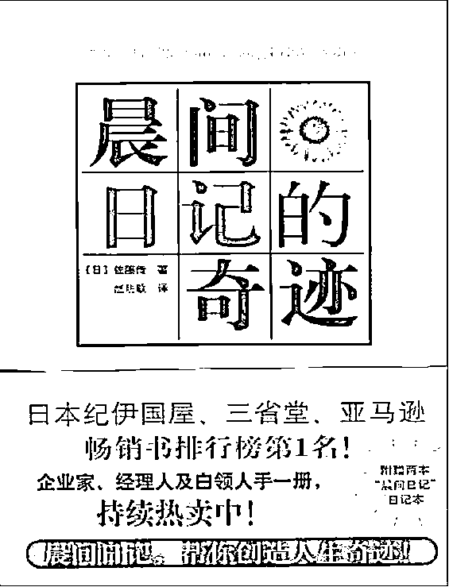

做这件事，有什么好处？

经过一千多天的写作，我自己总结了一下，持续公开写晨间日记复盘，有以下9大好处：

1、让“早起优先完成重要的事”成为了习惯和肌肉记忆，和拖延症说拜拜

2、 坚持这件事，让我们的一天比别人多了2个小时

3、提升写作能力，积累写作素材，一鱼多吃提升ip影响力

4、积累了自己的数字资产和生产资料

5、积累了1000多位付费读者，打造了自己的ip标志性事件

6、宣传个人产品，提升个人收入

7、增强心力，提升信心，做别的更容易成事

8、人脉资源链接，提升自己的贵人运

9、 内观自己心理疗愈，情绪更稳定，给自己补充能量

当然，我做这件事，一开始也是非常艰难的，也是一点点熬过来的。

当时，我把这个目标公开到自己的朋友圈儿和社群里面，我还专门儿建了一个群，叫张老板10年围观群。每天早上在群里面去发布我的晨间日记复盘。

这件事我刚开始做的时候，很多人我估计心里面都是不相信的，可能还会嘲笑这个人。你还要把这件事情做10年，你能做上一年就不错了，能做上半年就不错了。

但是别人的看法不重要，要公开目标，自己去完成，自己和自己较劲，死磕自己。我每天去超越昨天的自己，每天进步一点就可以了。

在我写刚开始写晨间日记的时候，没有人知道，也没有几个人看这个。

因为刚开始起步，我的微信上就没有几个好友，我的公众号也没有人关注。一开始我写的时候也是免费公开的，就算免费公开，也没有几个人进群。

后来写了几百天的时候，就已经有至少几百位读者在群里面，每天早上定时定点的看我的晨间日记复盘。

而且这时候我的群也不是免费的了，改成收费制的了。你必须要付费进去，你才可以看我晨间日记。

而且，我的收费也从一开始的随缘赞赏就可以进群，后面也提升到了99。那99的话一样是有人进群，有不少人付费进群看我的晨间日记，因为这个时候我的IP的影响力已经开始起来了。

那当我写到现在的时候，我不光是自己在写，我还带了很多IP，直接和间接影响了几百位IP一起来写晨间日复盘。

你在朋友圈里面现在看到有人在写晨间日记复盘，很多就是跟我学着做的这个动作，这已经成为我的标志性事件了。

经过1000多天日更积累之后，从数据上看，我现在也沉淀了我的4个晨间日记付费群，群里现在有1400多人，1400多位付费读者每天早上阅读我的晨间日记，很多人都说每天早上起来看一眼我的日记复盘，都已经成为习惯了：

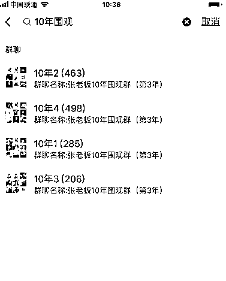

我还积累了60万字的晨间日记复盘，形成了自己的专属电子书：

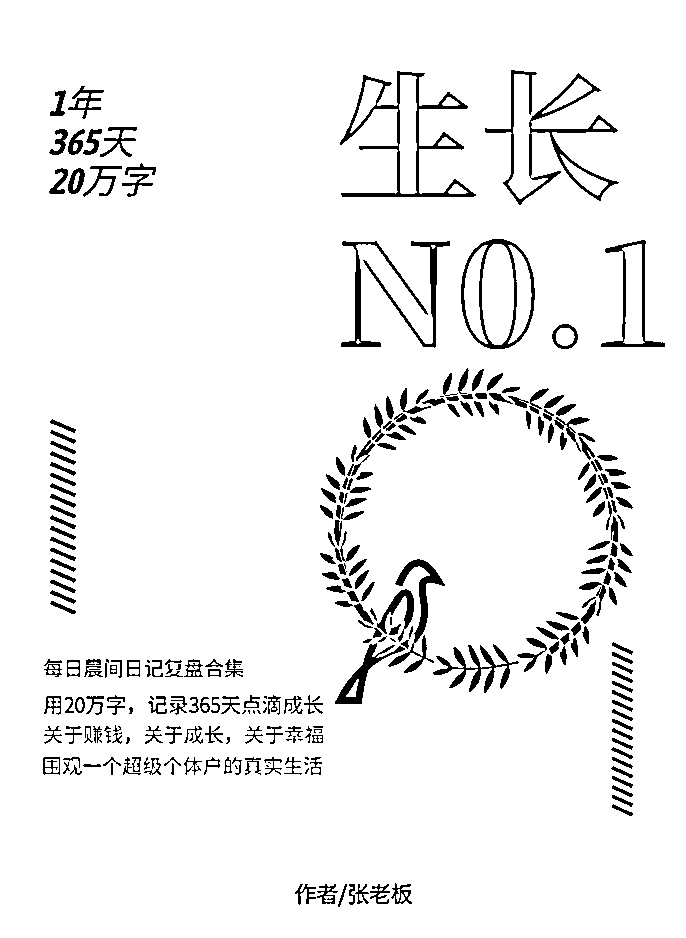

同时，也有越来越多的人因为看了我的晨间日记，了解了我，信任了我，进而从我这里付费，成为了我的付费用户。

在这个点上，可以说：

我做ip，没有绝世容颜，就靠日久生情

OK，今天，我也继续再来聊深一点，向大家拆解一下我的晨间日记复盘模版，大家如果有想写的，可以直接参考我的模版来写呀。

就以这两天的一篇晨间日记复盘为例来拆解一下：

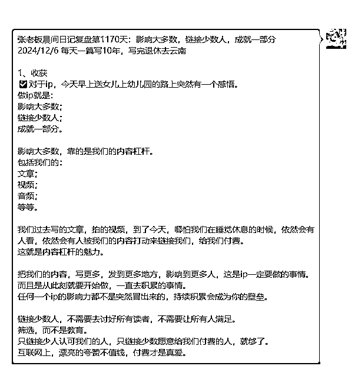

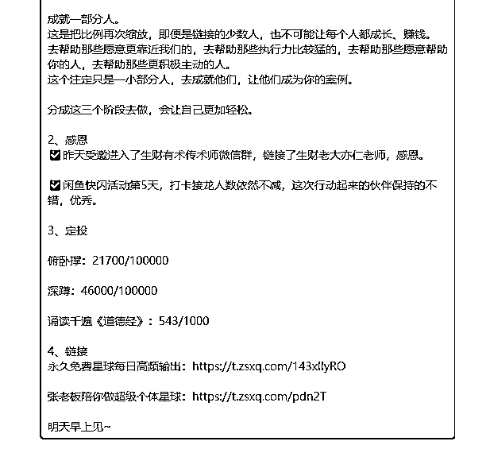

它分成了5个模块：

模块1：标题

包括要素：

日更天数；

当日复盘主题；

当日日期；

我自己个性化的晨间日记slogan。

模块2：收获

收获板块是晨间日记复盘的主要板块。

我一般会写：

复盘昨天发生的事情；

总结这些事情的经验、收获；

指导今天以及未来我该怎么做。

注意一下，这个收获模块的内容，可不仅仅是对你自己有帮助，而且对看的人，也是有非常大的价值的。

我们写的晨间日记复盘，能够吸引别人的，往往也是这个板块。也就是说，写晨间日记复盘，不能是自嗨，也要公开、利他！

模块3：感恩

学会每天公开感恩，你会发现：

你会被注入源源不断的精神能量，心态更平和，情绪更稳定，赚钱更快乐。

模块4：定投

定投的概念源自于金融，指的是长期、固定、无惧涨跌的投入，在未来会有一个预期内的收获。

关于定投，我设置的是运动锻炼和修炼心境的定投。

这里有一个小技巧：

先设定最终的目标，然后每天累积完成。以终为始。

模块5：链接

这个板块，主要对做个人ip的伙伴有帮助。

可以把公开了解自己的渠道，放在这个部分，方便别人来了解你、链接你。

这是我的晨间日记模版，这几个模块，是经过1000天的写作，我持续迭代、调整后留下来的，模块化写作，会让我每天的晨间日记复盘效率更高。

基本上，按照这个模块去写，每天写晨间日记的时间，我会控制在15分钟之内完成，非常高效。

短时间快速完成很重要，因为这样你才能持续，让你每天一两个小时去写这个，你持续不下来的~

## 第2个秘密武器：4次迭代小项目赚百万，1克拉的钻石最值钱

第二个武器，要解决如何通过一个细分的点或项目，赚到更多收益的问题。

我一直记得靠谱老师的一句话，印象非常深刻:

两个50分的钻石加起来也没有一个一克拉的值钱，10个10分的钻石更加起来没有一个一克拉的值钱

找到属于自己的一克拉钻石

这个一克拉钻石可以是一项技能，可以是自己擅长的某个点，可以是自己的某个兴趣爱好，甚至是某个不起眼的小项目

然后，在这个细分的点上投入比别人多几倍的力气，收益上就会有突破性的进展。

分享开始的时候，我说自己自由职业第二阶段的项目+ip之路，切入的点是闲鱼，这是一个非常不起眼的小项目，以至于很多大佬都瞧不上眼的。

不过它很适合普通人：门槛低，可持续，当然收益天花板也低，对普通人很友好。

在这个小项目上，我经过了4次迭代，付出了比别人多几倍的力气。

### 第一个阶段：自己干，跑通闭环赚小钱

切入闲鱼，我首先自己去跑通了整个闭环，我翻了下记录，在2020年底，我就跑通了闲鱼，当时还发了一篇文章记录了自己跑通的历程。

这是第一个阶段，自己干，跑通闭环，赚小钱。这个阶段，往往只需要执行力就够了，只要你执行力够猛，有效工作量怼上，基本都可以测试出结果。

关键是：有效工作量要够。

这里的有效工作量，要具体量化、数据化，不要用一些模糊的词汇来给自己找理由。

比如说：

我每天花了很多时间去做啦；

我每天上新很多啦；

很多，是多少？没有量化就没有意义。

要具体量化为：

我每天花了2个小时去做这件事了；

我每天上新了10个链接了。

这样的标准，才有价值。

### 第二个阶段：带全家6口人干，深耕细分产品一起赚钱

跑通之后，我开始了第二阶段的拓展：把路径和经验复制给家里人。

我想试试看，能不能把家里人带出来，如果能的话，证明这个路径是可以复制的，就可以对外进一步去放大。

然后，我就找了家里面对这件事感兴趣的“实验对象”，这个必须要对方感兴趣、能主动执行才行，不然无论如何是带不动的。

这些“实验对象”包括我老婆、姐姐、姑姑和已经退休的丈母娘，后来又有表妹加入了……

结果，还算不错，基本都取得了一些亮点成绩，我之前写文章列举过我们家的一些战绩：

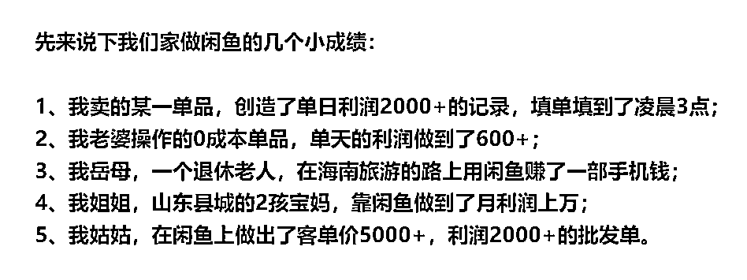

家人里面，做的最好的是我大姐，一直到现在，她还可以维持在每年10万左右的纯收益，这是她自己记账的小本本，记录了个别月份她的闲鱼收入：

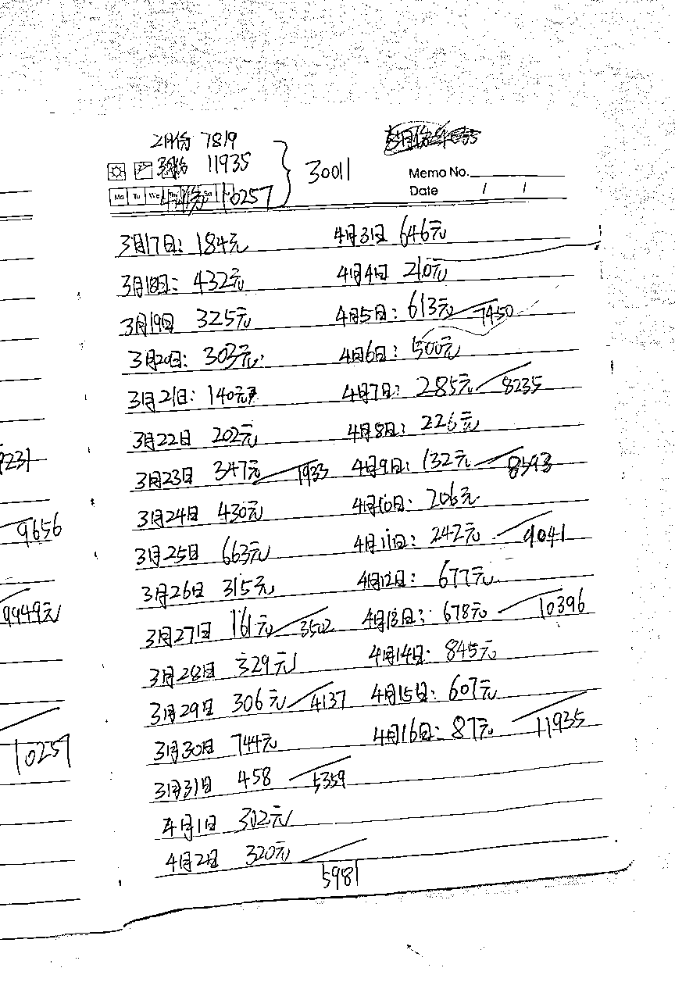

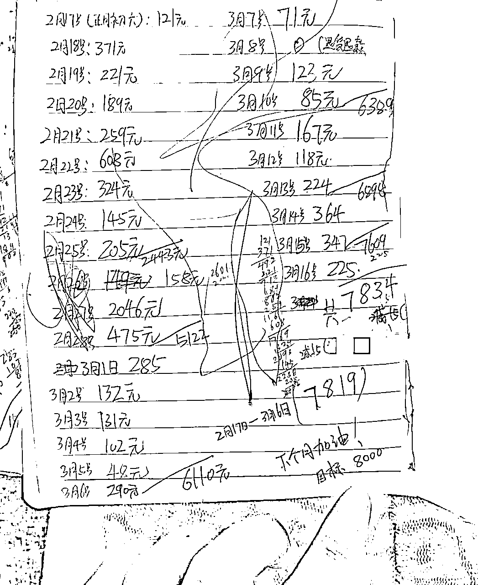

在实战过程中，还有一个非常有价值的收获：

我们通过在闲鱼大量的测品做店，测试出了一个细分领域产品，然后把大部分店铺都去铺这个细分产品，吃掉了很多闲鱼上这个赛道的流量。

在这个基础上，我还以在闲鱼上测出的这个品为核心，去延伸做了淘宝店和专门的私域电商，把闲鱼上的客户引流到微信，然后持续去影响、复购。

这些渠道，现在在持续为我产生收益，比如下面截图这个就是闲鱼引流来的客户，最近在我的私域持续复购的部分购买记录，算下来，这一个客户一年就可以给我贡献小几千的利润：

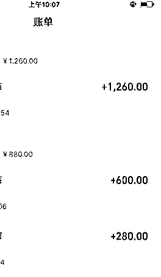

自己跑通闭环，然后小规模样本测试，持续拿结果；

和ip一样，很多产品的定位也是实战中测试出来的，不要靠自己的思考，要去市场验证，很多机会，实战中会冒出来，然后快速去把握住，深耕放大。

实战越多，问题越多，解决问题，就可以快速成长；

实战越多，机会越多，把握机会，就可以赚到超出预期的收益。

### 第三个阶段：结合ip，自营陪跑服务，招募500人放大收益

在我项目+ip同步进行后，就一直在寻找可以从ip切入的项目，当时我手上可以调用的项目资源和成绩是很多的，最终考虑和小规模测试后，还是选择了闲鱼这个正反馈最容易的。

起步阶段重点做了2件事：

1、优先打通一个流量渠道，重点突破了知乎，在知乎回答了几百条闲鱼的问题（看，这里也是需要把工作量怼上去的），涨了1万粉丝，知乎的1万粉丝是很值钱的，我的很多初始用户都是知乎过来的。

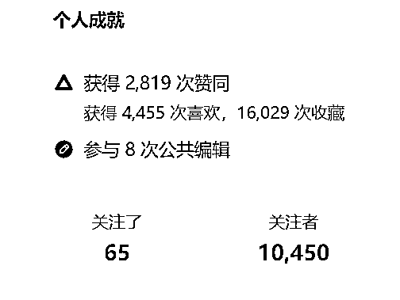

2、不断迭代优化课程，前后经历了数次打磨优化，价格也经过了数次阶段的调整，最后价格订到了980，这个不太高也不算太低的价格。

后来我还建了专门的闲鱼星球，除了一开始招募的用户没有加入，后面招募的客户都会邀请进星球，这个星球的人数也有500多人了：

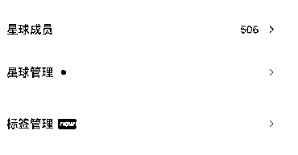

不算卖货的收入，仅仅算ip端的知识付费拓展，闲鱼这个小项目也给张老板这个ip带来了累积几十万的收入了。

这个阶段的收获和建议：

项目是有周期的，ip是可以穿越周期的，ip和项目是可以互相赋能，互相促进的。

很简单的道理，你实干出成绩，你就有说服力，你就有话语权，你的输出就会接地气且不会枯竭，你要把自己产品化也更加容易。

对做项目的伙伴，建议Ip要尽量同步做起来，尽早吃到ip长期商业化的复利。持续积累起来，这样朋友适合用ip放大的机会，就可以快速把握住。

### 第四个阶段：组建闲鱼ip团队，深耕赛道放大规模

一般基于项目的ip发展路径，到了前三个阶段就可以了，前三个阶段做好，持续去深耕，就足以把一个不起眼的小项目做到百万体量了。

不过我没有停滞在第三阶段，继续往前走了一步，进入第四阶段：

不仅把自己的项目经验复制给别人，进而把自己带项目的经验复制给别人，从项目陪跑升级成ip陪跑，组建自己的闲鱼ip核心团队，用团队模式去打一个细分赛道，成为赛道头部。

很多细分领域的市场规模，远超我们想象。

靠一个人，能吃掉的市场毕竟有限，要做大，要成为头部，要吃掉赛道上最大的红利，必须团队化作战。

而且，市场上，客户的需求是多样化的，你一个人更不可能满足客户的所有需求，比如有的客户就不想做闲鱼，就想做公众号，有的就想做小红书等等。

团队化，可以最大程度上去满足客户的多样化需求，给客户提供最具价值的产品，解决他们的问题。

这里先不提其他的细分领域规划，还是聚焦说说我在闲鱼上的进一步拓展。

在前面三个阶段的基础上，很多之前跟着我学习闲鱼的老学员，拿到了优秀结果的伙伴，加入了我的ip合伙人，我们组建了闲鱼ip团队，会孵化出一批独立的ip，每个人都可以独当一面服务客户，又能守望相助互相帮助团队作战。

我们闲鱼核心团队会有充足的实战陪跑老师，来一对一实战陪跑，陪伴想做闲鱼的伙伴更大概率拿结果，能够服务到更多想做闲鱼的伙伴；

我们帮助更多伙伴在闲鱼项目上跑通赚钱闭环，拿到结果，其中也会有很多伙伴跑通后想通过ip来放大收益，复制我和合伙人的路径，我们也有成熟的经验可以帮助到这批伙伴。

6月份的时候，我给这个核心团队定了个小目标，一年100万：

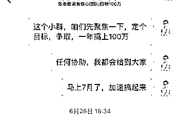

Ip，是有长期复利的。

在闲鱼这个小项目赛道上，我们这一群Ip会越来越强，拿到更大的市场，取得更大的成绩，持续深耕下去，把这个项目从有利润到没利润，整个周期全部吃到。

对任何一个不起眼的小项目、任何一个细分领域来说，都有机会做到百万体量。

没有不赚钱的项目，只有不赚钱的人。

这四阶段的模式路径，对想做项目，想做ip，想左手项目右手ip把一个项目做深吃透的伙伴来说，参考意义我觉得还是很大的。

以上，就是我今天分享的全部啦，感谢大家的阅读，希望会对大家有启发。