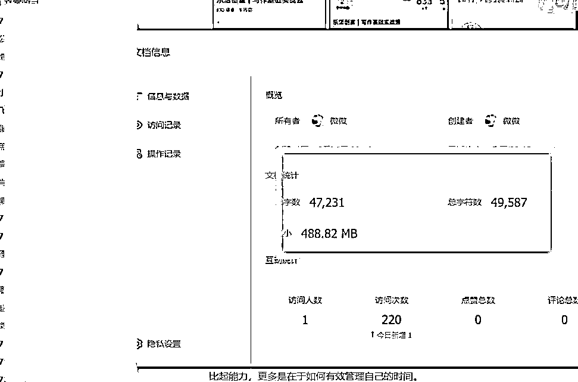
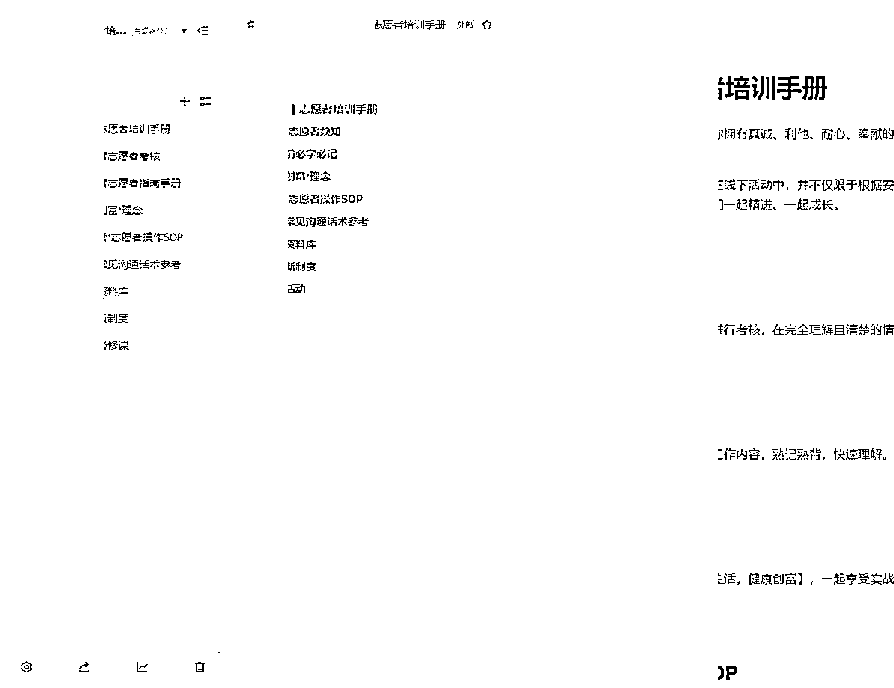
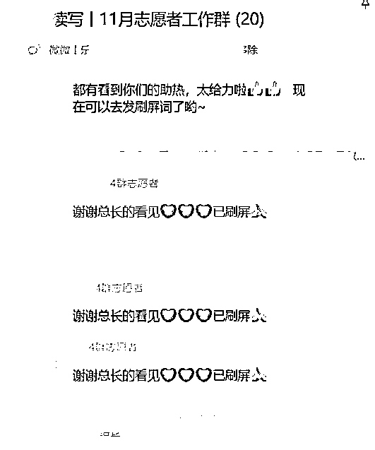
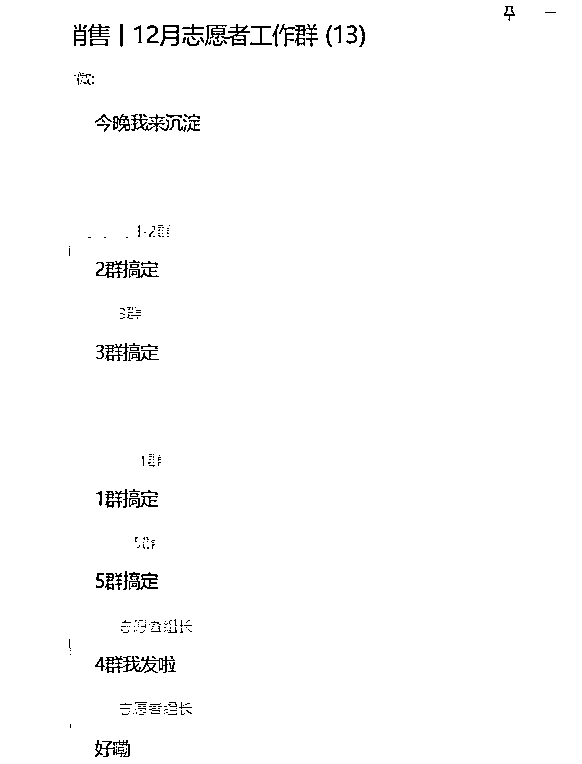
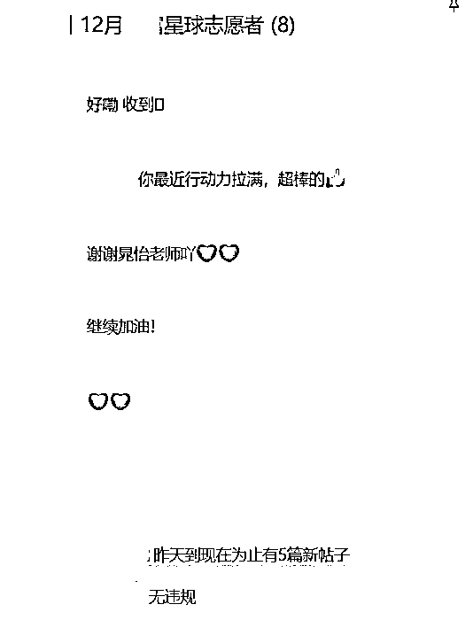
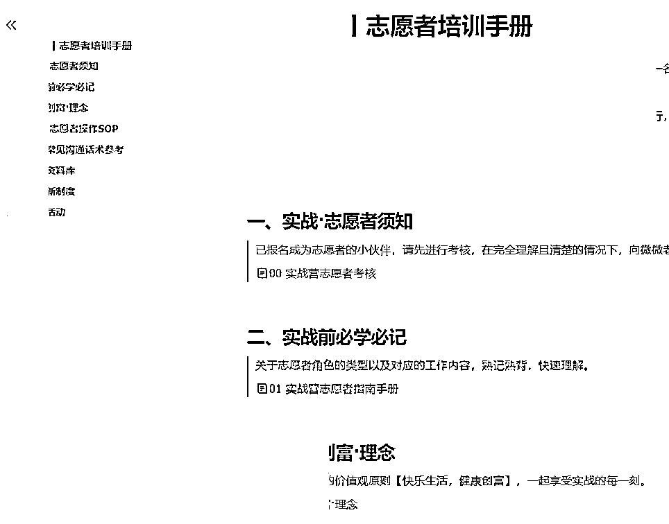
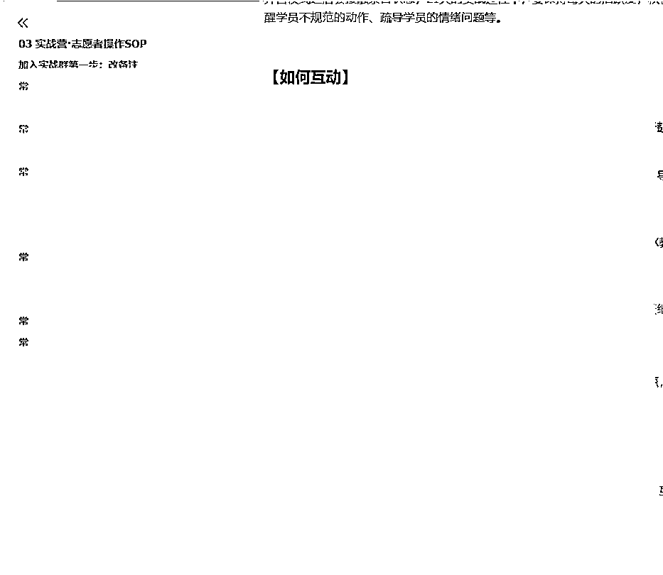
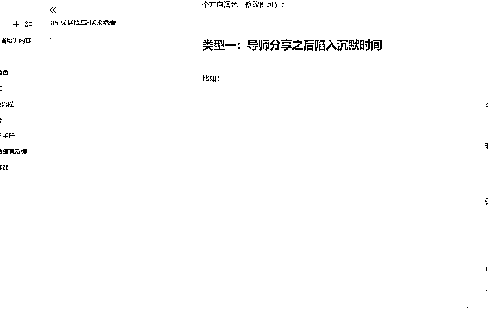

# 《七个“生财思路”，两个月打造50+人的优质团队》

> 来源：[https://eqc9f6vzuhv.feishu.cn/docx/DJBodZzOhoLThvxTJmScwZsmnYe](https://eqc9f6vzuhv.feishu.cn/docx/DJBodZzOhoLThvxTJmScwZsmnYe)

圈友们，好久不见啦，晚上好呀。

我是微微，一位写作十二年、拆书七年的拆书写作学长，接触自媒体的一年多的时间里，写过百篇10W+爆文、付费星球精华帖，作品在全网累计阅读量超1000W，目前是理白老师实战营的主理人，也是理白老师的助理。

担任白大的助理不到一年的时间，在白大的指引、提点过程中，写下实战营全流程、教练分享指导手册、助教行动指引说明、志愿者培训指南书、多个星球/社群日常运营操作、激励计划曝光策划等20多个SOP知识库。

同时，也在不到两个月的时间里搭建起50+人的志愿者团队，辅助30+个社群和实战营全人工自动化高效运转，队伍成员具备粘性高、认同感强、配合度深等优势特点，是一支高价值的自媒体社群运营队伍。

接下来，咱会结合这段时间以来的经验，给想要搭建团队、或是团队进行扩招的圈友分享一些心得、实操做法。

# 一、招募的“思考”

无论是刚开始搭建团队，还是进行团队扩招，都应该先了解、摸清自身目前的情况，而不是照搬复制他人的模式，或是错误地判断当下的需求。

原则上，无论是搭建团队还是团队扩招，关键并不在于旗下业务众多、繁忙，或是有多少想要跟随的倾慕者，而是取决于该业务是否存在效率降低、压力日益倍增，该业务的重要程度是否能够分派出去，有无涉及到创办人的核心内容。

“因岗设人，而不因人设岗。”

因此，在思考是否招募之前，首先要给到自己一个比较清醒、冷静、没人打扰的时间，捋清楚自己目前到底是需要一个长期辅助自己，稳住基本盘的私人/贴身助理，还是一个纯粹处理杂活的人，或是一个短期的合作者等。

个人认为最合适的思考时间是理性占优的早上，思考地点则为安静但充满正向能量感的图书馆，而思考的内容则要包含当下大环境、团队未来发展以及有无合适招募渠道等因素。

比如：

*   目前核心业务对大环境下，可以承受的最大冲击阈值是多少；（核心业务是唯一支撑，一旦崩溃，满盘皆输）

*   团队在未来三年内的发展核心项目有哪些类型，这些项目类型所需的人才该具备什么特点、能力、性格等；（也要考虑现在缺乏哪类型的人才、有无短期内急需的人才）

*   手中能够使用、利用的招募渠道有哪些，这些渠道又是否具备自带过滤、精准筛选、有较高参考意义，减少思考成本的价值；

*   当前旗下的业务是需要可以近距离接触自己、了解自己核心细节、未来规划、个人本性、行事风格等，相当于个人分身，或是超级大管家的私人/贴身助理；

*   还是需要能以合作的形式实现共创，拉动新业务的有效曝光、引流、转化，促进双方的势能和增长的短期合作者；

*   或是单纯为自己分担重复性的工作、琐碎的日常事务，以及不涉及到创新、拓展、优化等核心业务的志愿者/普通的小助理。

根据以上硬性条件，咱们就可以从以下三个角度去梳理清楚，该怎么招募到合适的人才、怎么招募到适合当下岗位的员工。

## （一）个人分身：私人助理

从我个人的视角出发，我认为私人助理除了是可靠可信的员工以外，也可以理解为是创办人的长期合作伙伴（至少五年以上），较于一般助理在薪酬、管理、交流、分享等方面都应该有着质的区别。

如果有这方面的招募打算，除了岗位需求以外，更要有一份初心，发自内心的认可自己是“需要”一位或是多位“分身”的。

那就需要以寻求合作伙伴、互相成就、新的左右手、长期战友等心态做招募动作，而不是做出招募普通员工的行为表现。

因为如果只把私人助理当做是普通员工的话，那便不适用于这个范畴，那是类似以下“志愿者”的角色。

一般而言，私人助理需要具备的认知程度、情商高度、能力水平、学习天赋等基础，至少要达到创办人的60-70%，即及格线以上，但又不能过于强势、喧宾夺主。

所以对自媒体小白、不同领域的非同行、没有成绩与项目经验的同行、言大于行且执行效率低的E人、【完美】+【统率】+【竞争】才干的小橙人等，都不该纳入到招募范围内。

咱们需要的是一个忠诚可靠的分身，而不是在培养一个竞争对手、对立者、白眼狼。

除此以外，也要考虑到私人助理是否具备管理运营、日常事务、社交礼仪、基本技能、情绪释放等经常性使用的能力，以及在三观上是否能够稳定与创办人保持同频。

综合以上的思考，能够有效自己厘清目前的事情就算是“杂”，它是单纯在重复性质高的类型上占据多数，还是在小决策上、管理安排等方面上也存在“杂”，以及可分派出去的动作也多。

如果是前者，可以是“志愿者”；如果是后者，那就是私人助理，或是私人助理+志愿者的搭配。

## （二）一般员工：志愿者

这一点其实是很多自媒体朋友都会陷进去的误区，无论事无大小，都想着聘任一名员工或是长期打下手的小助理为自己分担工作压力。

事实上若是业务内容如果对主要项目并不造成影响作用的，咱们都可以统一按照“流水线”的标准看待。

也就是说，业务内容的重要程度并非需要运用到动脑、创新、对标学习等的话，也不必耗费额外的金钱成本去招募员工：

重复工作性质明显，单纯是为了维护日常的活跃、一般运营，可以考虑直接招募志愿者。（完全可替代一般员工，性价比也更高。）

除了私人助理以外性质的任何员工，都经不起时间的考验，只要任职时间越长，对薪酬与额外利益的需求也就会越大，即使承担的工作量从未增加。

“永远不要对人性抱有过高的期待，永远要警惕人性深处的幽暗，尽管人类有着许多善良、无私的品质，但同时也存在着自私、贪婪和虚伪等负面特质。”

合作关系久了也需要情绪价值的输入，实用价值的升华，何况是经不起时间考验，仅靠利益捆绑在一起，没有其他纽带的雇佣关系呢。

而志愿者角色则能有效地解决这个问题，无论是从人性还是从长期的成本换算，对团队的发展都是百利而无一害，关键在于志愿者：

不图钱、不图利、不图名，着重倾向于个人成长、知识精进、积攒经验等方面，咱们也可以用最低的成本，把时间精力大幅度的释放出来。

在招募志愿者过程中也不用考虑过多的粘性强度，只需要注意能力、技能、认知、情商能否跟上即可，确保了咱们在安排任务时的丝滑，以及他们在面对负面声音时的正常发挥，不至于产生舆情。

当然，志愿者也是人，也不排除时间一长有可能出现员工追求利益的情况，而且一个志愿者的粘性再高，每天面对重复循环的工作内容，热情也会持续性下滑。

所以，咱们在招募志愿者上可以使用一个“保险”，比如即使是一个工作内容，也可以招募多个志愿者，使其有所分担，而且有啥突发情况（请假或是掉线），也能轮班替上完成任务（成本也不高，后边会详说）。

## （三）各取所需：短期合作者

关于短期合作者，主要是团队要开拓新业务、新的支线剧情所需要考虑的招募对象。

短期合作者的特点在于是一个能够给你带来有效建议、提供内容价值的人，依据不同合作状态，他既可以是员工也可以是共创者，比如是给你做事，也同时是在某些领域给你带来成长的人。

举个例子：

*   比如你不太擅长写文案，但是开拓的新业务里，就有关于文案策划、营销内容等方面的写作需求，而对方虽然在写作以外没有其他你所需要的业务能力，但是在写作方面属于专业领域，可以考虑招募；

*   比如你要操盘发售一个新的小产品、课程，并不打算雇佣操盘手进行发售，那可以招募具备一定分销能力的KOL谈合作请求，在短期合作中形成一定规模的裂变；

*   比如你最近开办了一个为期一两个月的训练营，没有多余的资金去聘请专职老师，自己也没有多余的精力一个人做交付，那可以邀请在这方面有能力的教练，以分成或是佣金的形式给对方回报，或是承诺给曝光、内推、链接等福利进行邀请。

综上咱们可以了解到，短期合作者适用于在同量级或者低1-2个量级，身边熟悉较为可信的自媒体好友中招募。

不过考虑到要搭建长期稳定的团队，或是扩招能给团队带来持续性价值的助理或是员工的话，短期合作者并不适用于咱们接下来的内容，就不做参考和延伸啦。

# 二、招募的“思维”

## （一）底线要求

当咱们对团队招募人员方面有最基本的思考方向后，切勿一概而论，对于不同类型的招募对象，从起步就要有明显的原则区分、底线要求。

从刚开始就把基础搭建好，确保后续的团队发展始终向上，不会出现断层或是发生内部舆情。

### 1.私人助理

招募的基本理应根据这个方向进行考虑：粘性＞能力＞认知＞学习天赋。

私人助理作为创办人的分身，虽然在各方面的技能点上要求很高（60%-70%），但是出乎意料的是并不处于最关键的一环。

最为核心的关键点其实是「粘性」。因为认可你的人，才不会轻易否定你所做的每一步，才会不遗余力地给你提供源源不断的最佳辅助。

“真心想要帮助你，拥你为王的人，没有那么多废话。”

以微微为例，我对白大是非常信任、高度认可，而且很喜欢他，所以在工作安排、执行力、情绪等等各方面的配合度很高，而且执行效率也很明显。

即使能力值达到100%能与创办人相提并论，但是其本人没有粘性的话，反而更适合做短期的战略合作，并不适宜让他位居于下，会翻车、不欢而散的。

唯有粘性足够强的人，才配得上原始门槛的检验。

而能力位居于粘性之下，还有一个重要的原因。因为粘性基本上是能“看出来”的，而能力是需要时间去验证他本身有没有达到他自己说的能力水平的高度。

除了粘性和能力以外，再要考虑的便是在认知层面上有无突破低层次的思维、穷人的目光、内心的信念、对突发事件的看法观点等等。

一个人如果认知跟不上创办人的处事节奏，持续的理解不能很容易便会引发很多不良的连锁反应，比如：

*   稍有成长，开始创办人的安排产生质疑，内心不屑、不服等负面情绪诞生；

*   既要又要，没能理解跟在创办人身边已是机遇，开始追求名利、追求权益；

*   初心动摇，面对外界赚钱的诱惑，对长期主义产生怀疑，对创办人有恨意；

*   情绪紊乱，无法从团队的角度出发，容易被突发情况激起个人的不良情绪...

综合以上三点，便不难理解为什么学习天赋会排在最后。一个人如果是对你忠诚、能力强大、认知够高的话，有这三点的加持，学习新事物、运营新项目的能力再薄弱，也值得去给他慢慢培养起来。

### 2.志愿者

对于志愿者的招募思绪而言，与私人助理相比可以说是除了第一点都一样：能力＞认知＞学习天赋＞粘性。

私人助理是可遇不可求，而志愿者则是一抓一大把。因而粘性并不占据C位，更重要的是能力要匹配到位，确保日常工作持续正常运转。

关于几点要素的基本逻辑如上述所说，这里主要再延伸一下，为什么能力要排在第一位：

除了志愿者是可以经常性更替或是容易招募到位，不需要过多地给予物质或是情绪价值以外，更是因为只要能力匹配，咱们只需要提供一套实打实到每一点的细节、流程、步骤以及底线规则即可维持社群稳定。

比如可以先写好一套SOP，把你所需要安排的工作内容、环节、注意事项、避坑的点等等全方面写出来，到时候给他们培训一场，后续让他们照着SOP手册执行即可。

咱们把从这件事的开始到结束的每一点思考、每一个动作、每一个环节都写下来，再往里边填充细节、填充志愿者实践过程中反馈的不足内容，再回想在每一个环节里有什么掉坑的经验...

不用一个月的时间，就能形成一套完整丝滑流畅的SOP。

## （二）测量方式

当然，即使有了以上的思考、思绪做支撑，也并不意味着第一次招募就能物色到合适的人选、人才，都是需要经历以下几个测量方式的过渡。

私人助理方面是：对方在个人介绍的排版→提供某个领域/项目的成绩→给出测试内容或即兴创作→暗示试用期时间。

这里同样以微微作为例子，我是有着多年写作、阅读拆书经验的，首先就要在个人介绍方面呈现出精简、能突出个人优势、成绩等关键字的排版。

【昵称】微微

【地区】深圳

【标签】

◆「生财有术」星球会员。

◆ 拆书写作教练

◆ 90后职场学长

◆ 盖洛普前五：沟通、交往、个别、体谅、成就。

【个人介绍】

① 通过「微拆写作法」不到一年写出百篇10W+爆文，作品累计阅读量超1000W。

② 写作12年，拆书7年，理白老师的实战营主理人、万粉公众号主。

③ 一年创作100+篇付费知识星球精华帖，副业变现六位数 。

【我能提供】

① 一套提高写作思维、强化输出效率100%的写作方法。

② 知识付费、写作咨询，各类自媒体运营的SOP打造方法论。

【生财有术精华帖】

https://scys.com/articleDetail/xq_topic/814224212828842

https://scys.com/articleDetail/xq_topic/588825458114124

当对方发布的个人介绍里，有关于团队所需要的自媒体技能时，就要着重抓住一点，或是成绩最亮眼的一点，要求对方提供真实的凭证。

比如微微的是写了百篇爆文，那么就可以提问是哪个平台，文章可以发过来看看如何，筛选较为优秀的几篇作品进行审核即可。

经过真实考验，为进一步确保能力匹配，以及在粘性上的认可度（耐心和真诚足不足够），可以再要求对方做测试，或是即兴给出一个话题，对方可以怎么去创作。

其实前三步通过考验后，基本上在粘性和能力上已经可以确定，而后可以用试用期时间长、肩负责任大、配合难度高等多角度的门槛，让对方先有压力、先有心里预设。

在此前提下，也不明示时间有多长，自己先手把手至少带他走一遍、过一遍流程，在三个月以后，对方依然能够保持高粘性、高效率、高配合、高反馈的状态：

那恭喜你，你招募到了一匹千里马，长期下来，你也会变得比较轻松，大后方也可以比较放心交给私人助理，也就是你的“分身”。

而关于志愿者的方面是：对方在个人介绍的排版→提供某个领域/项目的成绩→表达个人的需求→培训过后给出SOP实操一个月。

前两点是一样的，只是在第三点的时候，更看重的应该是对方为什么来到这里，想要在这里得到什么，能够给这里带来什么。

模板可以参考如下：

XX你好，很高兴收到你的报名，你的个人履历很不错呀，了解到在XX方面也有着成熟的经验和能力，咱们也很期待和你一起做好团队里的工作，一起发光发亮。

在此之前，有一个小问题想要了解一下，对于报名志愿者这份初心，除了咱们的每月奖励以外，你来到这里还有其他因素驱动吗？

比如想要在这里收获奖励以外的什么，在这段旅途中希望给双方带来什么价值、回忆等，我们也很期待能够让你在合适的位置上发挥100%的实力呀。

不急哈，咱们可以认真思考一下，在这两天里回复就可以啦，谢谢宝子！

同样是经过这三点的过滤后，第四点都不用过多担心，只要培训时把细节、重点吐出来，而SOP足够详细、清晰、明确到点，一个月下来基本都是全员留下。

# 三、招募的“思量”

厘清关于招募人员的基本需求，了解针对不同类型该如何去设置门槛之后，接下来就是列出如何能够把人“留下来”，短时间内不会脱离团队的薪酬信息。

虽然说物质条件是最能吸引人、留住人的硬核，但仅靠内里的“实”而没有外力的“激”，终究也是难以抵过时间的冲刷，一旦遇到更好的福利，或是没能稳住情绪的波动，都会产生分歧。

咱们先从内里的“实”，也就是物质条件来分析：

## （一）薪酬标准

### 1.私人助理

首先咱们要有一个坚定的信心，私人助理作为“分身”，前期跟着创办人一起打天下的时候，比起薪资更在乎的反而是愿景。

所以在报酬上而言，给到他的应该是愿景+薪资。

对于愿景，最好是在邀请或是招募之后，经过试用期确定就是你所要的人的时候就体现出来，比如：

*   从此刻开始三年时间内，一起把一个星球从0做到万人星球；

*   不要把自己定位在助理的角色，2-4年内将会带你赚到100万；

*   相信自己的潜力，只要在我身边多看、多学、多行动，比起他人一定会是N倍的成长，实现一夜千里的变化。

愿景不单纯是以个人角度去表达、去展现，而是以足够信任、并肩作战的视角去向你的私人助理（你的分身）描绘能够一起做到的壮景，以及在几年的时间里，你能给到对方什么确定性的变化、收获。

作为创办人所分享的愿景一定是你们两个人之间的共同目标，而不是近期的工作方向，所以不宜用目前紧急的角度去表达，至少要把目光放在一两年后。

让对方能够清晰感受到、真实代入到你未来的规划、目标，以及在你身边能够一起干成的「大事儿」。

坦白而言：

你所创造的未来，以及他能够如何参与共赴未来的过程、或是在你的未来里能做什么、获得什么，这些承诺更能让他愿意放下所有，跟你一条心干下去。

因此，这也是为什么一开始就要尽量筛选与你同频，三观一致或是粘性非常高的人。

至于薪酬，只要不低于市场价，有基础保障即可，前期不用过多把薪资放在重点（或是定的太高）。可以根据你所安排、所分出去的临时或紧急任务进行划定，比如参考这样的感觉：

只是要注意的是：

在A2和B2的情况下，可以根据临时任务的难度高低，不定期给到一些奖金或是福利。奖金很容易理解，福利也就是你的课程、产品、社群交付、资料等，甚至是一对一的咨询都可以。

福利不一定需要非常高的价值，但不要是已经在公域发布过，或是在公域平台可以随便搜索到的信息。也就是半公开、不透明的“私家货”。

### 2.志愿者

现在咱们从外力的“激”来分析：

如第一大点的思考所说，志愿者一般志不在薪酬，更多倾向于你的影响力、在你旗下做事短期内能够获得什么样的成长、以及获得哪些外界难以获取的经验值，便于他在未来做成自己想做的事儿。

可以把对方理解为“实习生”的标准，参考类似的表格：

主要是课程、产品、交付、资源、信息差等可兑换的奖励，当然薪酬也可以根据工作内容给到一些，不过个人建议是以奖金形式给予。

因为一开始就没有薪酬的说法，如果有频繁出现类似“酬劳”的感谢，会让对方产生一种期待及索求心理，一旦后续中断，有可能会引起内心不平衡、情绪激化等不良效果，但是奖金的形式则不然。

毕竟奖金形式也可以是一个小红包、一份具有高价值的加餐资料、一次30分钟的轻咨询交流等多种形式体现。

PS：这里兑换课程等奖励并不一定是每月都可以直接获得，也可以采用积分制，比如表现非常好的志愿者，每月获得10个积分，表现一般的就5个、8个...

每多少个积分可以兑换不一样的东西之类的。

## （二）招募方式

这一点无论是私人助理还是志愿者都是通用的：

个人建议可以是：付费用户兼铁粉＞潜在付费用户兼铁粉＞长久支持你的忠实粉丝＞平台发布招募信息。

不过相较于志愿者而言，私人助理则更偏向于在第一点「付费用户兼铁粉」进行招募，最好是中高客单价的付费用户。

首先能给你付费的一般都是高度认可你的人，在此基础上可以通过日常反馈积极、社群活跃分子、互动帮助率高、活动表现优异等方面进行铁粉筛选。

唯有坚持给到创办人正反馈，且执行力永远大于情绪的付费用户铁粉，才能在往后的同行中始终信任他。

相反，如果是时而冒泡、单纯水群而没有提供有效社群价值的，多半到中途（一年半载）也会变成一般员工的状态。所以在筛选这方面，可以是保持至少两个月以上的观察时间。

志愿者的话则倾向于「潜在付费用户兼铁粉」渠道招募。

这种类型并不是长久以来一直都说为你付费，但是迟迟不行动的“嘴强党”，而是要么是为你付费过9.9或者百元以下产品的用户，要么是一直在朋友圈给你正反馈的潜在付费用户，以及积极参与能与你见面的线下聚会等用户。

仔细想想，像是这类有实际行动表现的用户，起码在能力和积极性上是有迹可循的，说到底也是想要引起你的注意，看看能否在你的旗下做事，依附于你的影响力提高知名度，或是从中获取一些经验增长等。

这里要注意的一点是：

如果是在你的低价社群或是平台（比如公众号）发布招募信息，有人通过考核的话，在不熟悉对方的情况下，需要提前给他一个声明：咱们是有时间限制和劝退机制的，确保发现不合适的话可以随时换掉。

这里有模板参考：

XX你好呀。

咱们仔细看了你提交的信息，个人经历和积极进取的表现很棒呀，恭喜你通过考核，成为我的志愿者一员啦，具体的日常内容是：

...

每个月的志愿服务到期，也能得到优先续期的福利。在试用期（不超过3个月）结束后，还会有隐藏福利。

当然咱们如果一个月下来，发现你个人与咱们的志愿服务不太合适的话，会有劝退的结果哈。

以上信息请阅读完毕，确认理解喔。

# 四、招募的“思想”

说到底人都是感性的群居动物，即使是物质回报很高，也是需要激励、情绪关注的。

作为创办人，一旦招募到合适的人才、人员，可以通过低成本、低耗能的方式去给到对方不在既定路线、预料之外的惊喜，便于持续点燃他们的活力、干劲。

## （一）情绪价值

比起交付或是加餐分享等需要耗费脑力、精力的内容，其实对外输出情绪价值需要耗费更大的心力，因为要顾及到对方当下的状态、情绪以及针对不同类型性格的人作出不同的引导鼓励。

所以情绪价值仅对于私人助理释放，确保创办人的时间不过于被太多价值不高的人员占据。

这里说的情绪价值并不指的是要和对方谈心、谈理想、谈现状，而是可以通过定期开展会议，或是不定期了解对方近况，把对方当做是好友、家人给予关心、给予关注。

这样以正向鼓励的态度提供情绪价值，确保他的状态不会影响到工作任务，对方也会更卖力地为你干活，而不是被时间消耗掉热情、积极性，长期配合下的默契度也会随之提高。

“只要不把对方当做是一个随用随弃的棋子，你也更容易一边开疆扩土的同时，让他在你身后接收完善。这样你就能不断释放时间精力出来，做更多重要的事情。”

## （二）实用价值

这一点与上述相反，仅对于志愿者而言是必需品。

大部分志愿者从一开始就没有期望过有太多的回报，所以就算是自己的没有给到对方情绪价值，也不要害怕志愿者会离开，毕竟都是有带着各自的“目的”而来。

这时候，如果给他们一个“紧张”的心理暗示，粘性反而会更高。

也就是好好干，咱们可以长期一起干，你也能在这里得到回报、成长、提升等等，但是如果想着浑水摸鱼，那就不会再给他二次机会。

既期待又带有些许害怕的失去感，会让他们持续保持热情、积极性去为你努力。当然，也不能光给巴掌不给糖，所以除此以外还需要给他们带来“超预期价值”。

比如参考胖东来和海底捞的模式，以不定期的刺激给到他们一些额外的奖励，而这个奖励对于你而言是很低的成本。

举个例子：

一般情况下，志愿者每月可以在你这里获得5个积分，而10个积分可以兑换XX产品或是课程的。

你可以在他们表现不错的时候，额外给他们多几个积分，或是赠他们一份资料，或是打包高客单社群的一份加餐分享，或是一个信息差，或是一个小报童课程，或是在志愿者群里群发红包都可以。

这样有严格要求而又有一定程度的激励，志愿者也能较长时间维持一个高水平的执行效率。

# 五、招募的“思绪”

由于私人助理和志愿者的定位、内容、要求以及发展规划都不一样，所以咱们在招募完成后的用心程度也该有明显的区别，对应不同的培训安排。

比如私人助理的基本画像：

*   定位：非小白，对标创办人，付费用户兼铁粉，盖洛普【小橙人】以外，超级大管家特性；

*   内容：团队里的管理层，主要负责创办人的除大决策外的核心工作，包括但不限于管理团队、管理业务、管理产品内容升级优化等举措。

*   要求：社群运营、社交礼仪、操盘发售等方面具备一定经验，拥有特别擅长的自媒体技能，有跑通过自媒体项目的成绩；

私人助理其实就是让他模仿学习你的一切，前期无论是业务大小，都应当手把手教一遍、过一遍，之后在日后的执行中留意一下、引导一下，逐步完全放手给他一个人去做好。

同理，每当开辟新的项目后，又重复带他一次走一遍完整的流程，再把重任交付于他。

综合以上，可以得出私人助理是有决策权（不涉及大决策）、调配权、管理权等实质性的权利，大部分情况下经过一次手把手教学之后可任其在视线范围内发挥，自由灵活度是很高的。

比如在其熟悉上手后，建立对应的业务群、管理群、工作群等，让私人助理作为你的分身逐步接手业务，在群内信息共享的基础下，从创办人手中逐一接下核心业务。

而志愿者则是可以让私人助理从中培养出一个“有能力”“认可你”，同样具备粘性的人，让他担任类似秘书的角色，负责传达你的一些临时指令、琐碎事务。

同时，也可以通过他来反馈其他日常志愿者的信息，降低每月思考留人、用人、去人的时间成本，也便于私人助理有更充裕的时间做更多事情。

如此一来，日常的一些既定的事务、重复的工作任务，都可以不用盯着，只要每天让秘书/管理员来反馈当天重点、核心、有异常的信息就可以。

越是往后，相当于只需要把工作布置下去，其他事情都会在你底下有规矩、有规律地运转起来，而你也不用一直盯着，时间精力会越来越多的。

但是秘书的角色和其他志愿者一样：不能有决定事情的权利。

需要决策的事情，都需要反馈给私人助理，让他去进行决策，他们只需要及时反馈到位就可以，不要让志愿者拥有决定权，他们做好分内的工作安排即可。

这样咱们就有一个非常清晰的管理框架雏形了：创办人→私人助理→秘书/管理员→志愿者。

待团队发展起来后，一般还可以升级另一个更完善的管理框架状态：创办人→私人助理→领队→组长（编辑、设计员、助教等）→志愿者。

组长的类别又可以分为不同类型的岗位，比如负责审核嘉宾分享内容的编辑老师，辅助教练作交付的助教老师，涉及证书以及海报的设计员...

把业务里的每一项内容交给私人助理，让他梳理出所有的工作细节所需的、不带重复性质的岗位，开展招募工作的时候就能在短时间内搭建起团队的框架了。

# 六、招募的“思慕”

## （一）日常行为

这个是我在白大身上感受到的强烈动力感，他的能力和状态一直都在影响我，让我不在状态或者是被情绪影响的时候，依然能保持高效的执行力。

所以这一点我很有感触：

无论是招募到私人助理还是志愿者，创办人在处理事情，无论是交流、分享、突发事件等，在情绪上都要保持稳定、冷静看待全局的定力。

理性看待事情的发生或是一些不如意的状况，始终以成熟的角度去解决问题，不是探讨问题的由来或是追责，而是先把事情做好。

这样会给到旗下的员工或是志愿者一种敬佩、向往，更加钦佩的心理，也会让他们对追随创办人有更坚定、忠诚的决心，会让整个团队氛围、节奏越来越好的。

无论是日常，还是工作上的安排，可以有意识地去给他们潜移默化你的特质、你的成熟、你的稳定，让他们始终把专注力放在学习、模仿你、看着你、跟着你、冲着你努力。

## （二）“针对”行为

当然，如果是对某个人特别有意向，可以有意识地制造一些与他相关的“事件”，比如：

有针对性地根据他这个人的类型，或是他正在经历的一些事情，写有关于这方面的文章、朋友圈文案、分享相关的内容。

一来可以测测他的粘性和认可度，观察他有没有对此作反馈、有没有一些积极的表现、有没有做一些感谢的回礼等等；

二来可以检验这个人是否和自己预想中的一样，有无具备相当的能力、是否值得自己花心思花时间去吸引、能不能对自己的暗示产生共鸣点...

有才干的人并不难招募，有才干而又对你有强大忠诚及信任的千里马才难找到。

故此在这里花点心思是值得的，同时也可能会有意外收获，比如输出文章、文案的时候，说不准也能引起一些优质自媒体人的留意而前来报道，无心插柳柳成荫。

# 七、招募的“思痛”

临近分享尾声，给大家分享搭建团队时需要留意的“避雷”意识。如果想要从一开始就要建立起一个能打、能说、能担责的团队，一开始就不要以“感性”的角度去放过任何一个潜在的危机。

比如：

*   不能因为对方有积极性、有动力就多次给予机会，试错不容超过三次，再有粘性也不该留下；

*   具有情绪化的助理或是志愿者都不可取，无论是内耗、纠结，还是脾气、自我意识过强等等；

*   涉及到管理、决定方面的内容，总是贸然提出个人意见、不认可上级的管理或是心存不满的...

咱们允许在日常运营中犯错，但事不过三；也允许在情绪上有波动、存在负面态度，但只有一次原谅的机会；还允许对制度管理的不满，但态度上只能是提建议而不是以俯视的角度表达不满与批评。

在日常运营上都没能服从安排、没能跟上大伙儿进度的人，在关键时刻也不能指望他能合格完成任务，这样的人还是不建议同行。

尽早断，尽早稳。

# 八、结语

一路走来，幸得白大教诲、指导、鼓励，在耳濡目染的影响下，短时间能打造出如此优秀的团队，除以上的七点思路以外，还有一点尤为感触：

只要核心人员（分身）能够定下来对的人，无论是在管理还是运营层面，都能大幅度释放出创办人的时间精力，实现开拓新业务之余，旗下已完成的其他业务即使不用参与，也能维持自动化运转。

跟对人、走对路，找对人，做对事。

“不是要找到每一个合适的人，而是只要找到几个忠诚的核心伙伴，你就可以永远放心你的后背。”