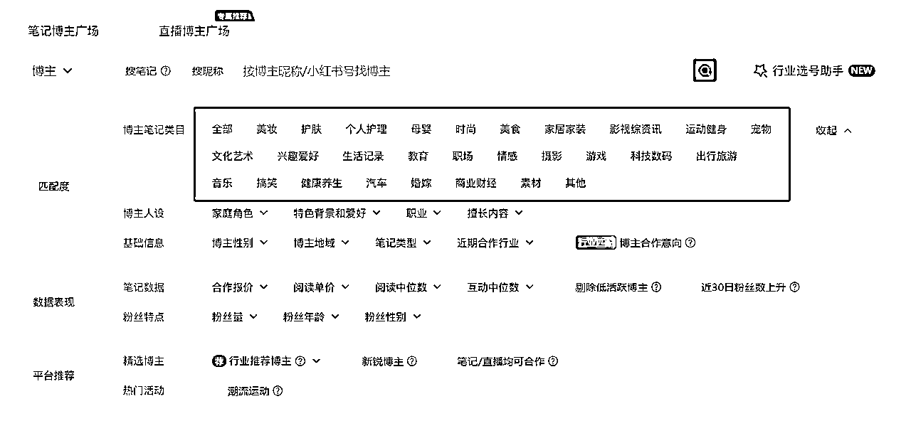
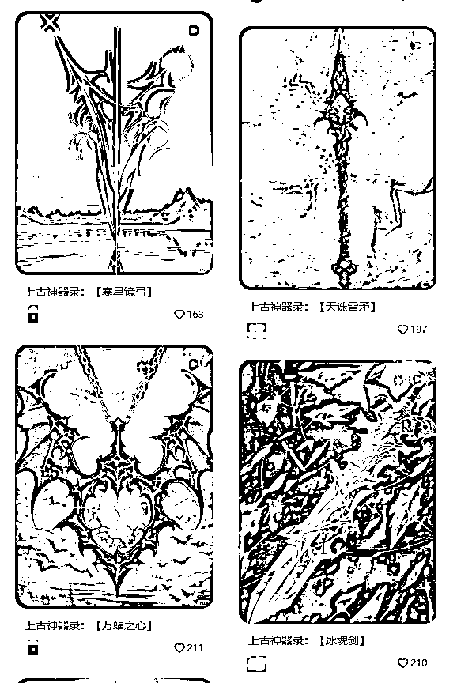

# 如何做一个赚钱的小红书蒲公英账号（纯纯接广版）

> 来源：[https://r0w01nn96m.feishu.cn/docx/DJogd2O9ioPCSXxjxUlcNTO3n1h](https://r0w01nn96m.feishu.cn/docx/DJogd2O9ioPCSXxjxUlcNTO3n1h)

自从前阵子群里回复了一下关于小红书起号的几个问题以后，就陆陆续续收到不少圈友的咨询，趁着今天有空，给想了解蒲公英接广的圈友们做个简单的介绍，市场肯定还是有的，不过这段时间小红书平台对素人水下笔记和蒲公英直发笔记查得越来越严，很多工作室损失惨重，新手还是谨慎入坑。

（个人介绍不写了，业务做的比较杂也不是大佬，但是在小红书推广这块已经投入两年，投流/报备笔记/水下笔记都在做，多的时候日百+报备笔记，关于报备笔记这块的经验应该是比较准确的，并且作为品牌方角度写的账号分析，应该对于做账号的人更有价值。）

## 以下是目录：

一、什么是蒲公英报备笔记

二、蒲公英报备笔记收入情况

三、返点是什么，怎么返

四、如何开通小红书蒲公英后台接广

五、选择一个合适的赛道

六、品牌方选择账号的几个维度（划重点）：

6.1笔记数据（划重点）

6.2美化笔记数据

6.3笔记流量来源

6.4粉丝画像

七、报备笔记发展空间

## 一、什么是蒲公英报备笔记

蒲公英报备笔记是指通过小红书官方平台“蒲公英”下单，与博主达成合作的一种官方合规的内容植入合作形式。这种合作方式允许品牌和博主在平台上进行商业合作，并且平台会收取一定比例的服务费（品牌方和博主分别是10%，比如：博主报价100，品牌方需支付100+100*10%共110，博主提现为100-10*10%共90）。

报备笔记的优势在于它们可以有更多的权益，比如挂载各种组件、商品链接，并且可以投放效果广告，同时避免了非报备笔记可能遇到的限流和被删除的风险。

如何判断这篇笔记是报备笔记：

1.粉丝数量：千粉+

2.图片出现品牌名称

3.有带品牌名字的搜索组件

4.评论区频繁提及图中出现的某个产品

其中1和2是必备的，3和4有可能出现，也有些品牌方比较佛系不太在意的话就没有。

## 二、蒲公英报备笔记收入情况

蒲公英账号收入情况差距非常大，品牌方和PR看的不是粉丝量，主要还是账号定位、赞评藏等互动数据、粉丝人群画像、粘性等。

划重点：真人IP账号要付出的时间和努力要远高于普通账号，收益也不可控，所以本文分析主要针对个人/工作室批量起号，账号稳定情况下，可以做到一天一广，价格在150-250不等，按中位数200（提现180）来算，单号每个月收入可以做到180*30=5400。中间还有一些其它费用，后面会仔细分析。

为爱发电的个人账号或者真人IP号接广不光不稳定，收益差距也非常大，以下面三个账号为例，第一个是母婴账号（真人露脸），第二个是兴趣爱好/时尚号（纯静物摆拍），第三个是兴趣爱好（真人露脸coser），第一个母婴号和第三个coser号粉丝量差距不大，但是报价差距5倍不止，并且接广频率高很多。第二个时尚号粉丝量虽然低一半（此处不严谨，时间有限，否则我会找两个粉丝差距不大的博主），但是互动数据远高于母婴号，报价却依然差了5倍不止。具体数据分析后面再讲。

## 三、返点是什么，怎么返

返点，其实就是PR和博主约定好的返回金额，比如上面的母婴博主蒲公英定价是1600，如果约定好成交价是1000，那么蒲公英下单金额应为1600*80=1280（蒲公英后台可以协商价格，上下浮动20%），博主需要返点1280-100=280给PR。

为什么会有返点，一种可能，是公司控制预算，就是要跟博主砍价，控制在可承受范围之内，如果博主可接受，但是成交价又超出了蒲公英协议价格的20%，那么就需要把超出的已支付部分返回给PR/品牌方。另一种可能，则是PR自身预留的对接费用/利润。

一般工作室讲的返点都是第一种，需要返回到公司的，长期合作的直发品牌，都是下完单——发布笔记——返点——合作完成，这样的流程，因为笔记已经发布，所以不存在品牌方取消订单的可能，博主可以放心提前返点。但是如果说你是个人对接大的品牌方，基本都是次月到账再返，这个大家可以根据实际情况协商。

## 四、如何开通小红书蒲公英后台接广

1.  粉丝量要求：首先，你需要在小红书上积累一定的粉丝量，当粉丝量达到1000时，小红书会通过蒲公英小助手在后台向你发送开通邀请信息。

1.  完善个人信息：登录小红书后，点击右下角的“我的”按钮，进入个人主页，然后选择“设置”选项。在设置页面中，找到“个人资料”选项，进行头像、昵称、性别等基本信息的修改，并添加个人介绍和标签，以更好地展示自己的个性和兴趣。

1.  申请成为达人：在个人主页的“设置”页面中，找到“达人管理”选项，并点击“申请成为达人”。在申请页面中，你需要填写详细的个人资料，并上传个人证件照片。同时，选择你擅长的领域也是非常重要的一步，这有助于平台更好地了解你的特长和兴趣。提交申请后，等待小红书的审核，审核通过后，你将成为小红书蒲公英的一员。

成为达人以后，只要你数据正常，后台会收到无数邀约，最开始挨个点开加上，慢慢筛选出品牌多、发文量稳定的pr就好了，将来做了新号也可以直接给到之前合作的pr。

## 五、选择一个合适的赛道

好了，这里开始进入正题，关于账号的部分，下面截图是蒲公英后台对博主的类目划分。

对于工作室来讲，目前起号最快的就是AI作品，图片加上背景音乐生成个简单的视频一个作品就出来了，具体类目的话，风景/建筑/宠物/美女/静物等等，只要画面唯美，赞藏都低不了。目前还有一些工作室是实拍风景起号，也比较多。资料类、冷知识类、娱乐类、影视剪辑等等类目目前也都有人在做，但是这种速度慢，有的容易侵权违规，目前不算是主流，除非经验丰富，否则不建议新手选择。

并且，品牌方对于一些营销号、正能量影视号等等也是比较介意的，很难跑出来精准人群。

## 六、品牌方选择账号的几个维度（划重点）：

篇幅受限，这里只讲直发笔记，也是市场最大，工作室对接最多的方向，大品牌的定制笔记不计入内。

直发，就是说品牌方把笔记内容都写好了，图文全部发给你，用你的账号发布出去，等于你只提供了一个账号，还有笔记发布/修改的时间，这样对双方来讲都是效率最高、利益最大化，所以对于账号选择，品牌方要求也是比较严格的。

### 6.1笔记数据（划重点）

笔记数据其实是大家看得最重要的部分，毕竟曝光量/阅读量高了才能对产品推广起到作用，几百阅读其实没有任何意义。

仔细看下下面两个账号的阅读/点赞/收藏，如果你是品牌方，如何选择是不是一目了然？去年直发品牌的基础线基本都是1000+阅读，20+赞藏，但是近几个月小红书整体流量都有下滑，阅读稳定500+已经算是基本及格，如果时不时能爆一个几千+阅读的，就算是很优秀的账号了。

### 6.2美化笔记数据

何为美化？上面讲过，之前千阅读对应的20+赞藏，是一个非常正常的比例，也很多品牌方为之买单，但是目前来讲，整体流量本身就下滑，品牌方花钱发出去笔记只有几十几百个阅读，对品牌推广来讲效果非常有限。所以在阅读量很难突破的前提下，博主开始提高赞藏量，增加品牌方的满意度。

正常情况下，除非笔记非常炸裂，否则互动量在2%-5%已经是很优秀了，但是现在很多保数据的博主都能做到百赞百藏，所以价格差不多的情况下，品牌方肯定优选这种保数据的博主（上面的两张图里面有一张就是保数据的，应该能判断出来吧）。目前经过大量测试，渠道合规的情况下做好赞藏基础数据不影响后续笔记自然推送。

基础赞藏的话有博主互赞群，也有其它的赞藏渠道。另外，小眼睛也是可以人工提升的，但是意义不大，如果小眼睛真的特别低，这个号可能也没必要继续做了。

### 6.3笔记流量来源

之前看这块的品牌方还少一些，今年大家要求越来越高了所以也都开始注重流量来源。发现页肯定是越多越好，我们俗称小蓝条。

绿色的是博主个人页入口，粉色的话是其他渠道入口，也就是人工刷数据的那种，所以小绿条和小粉条是越少越好，不超过10%还算可以接受。如果你看到一个博主小粉条占比很高，那么她的数据大多数是人工刷的，发出去很难跑出来好数据。

### 6.4粉丝画像

粉丝画像看的直发品牌不多，但是如果你这里男性占比高，年龄44+的占比高，那么也会影响pr的决策，一般很少有品牌选这样的人群。

地域分布的话如果是偏远地区的话一般也不要，不过这块影响不大，设备分布苹果设备越高越好，这个是大数据分析出来的，实际影响也不大。

## 七、报备笔记发展空间

虽然没有小红书商业笔记的官方确切数量，但是综合了很多小红书商业笔记的增长趋势和部分统计来看，商业笔记数量目前仍然是相当庞大并且呈现高度增长的。

今年下半年，平台对于素人水下笔记查得很严，最近两个月的话，对直发笔记审核也是越发严格，很多账号因为导流等原因都永封了，但是这也正是一个态度，说明后续小红书会不断完善商业生态链，让大家回归到正常合规的报备笔记渠道上来。那么作为最符合官方规范且没有门槛的形式，蒲公英报备笔记仍然是品牌方的首选。