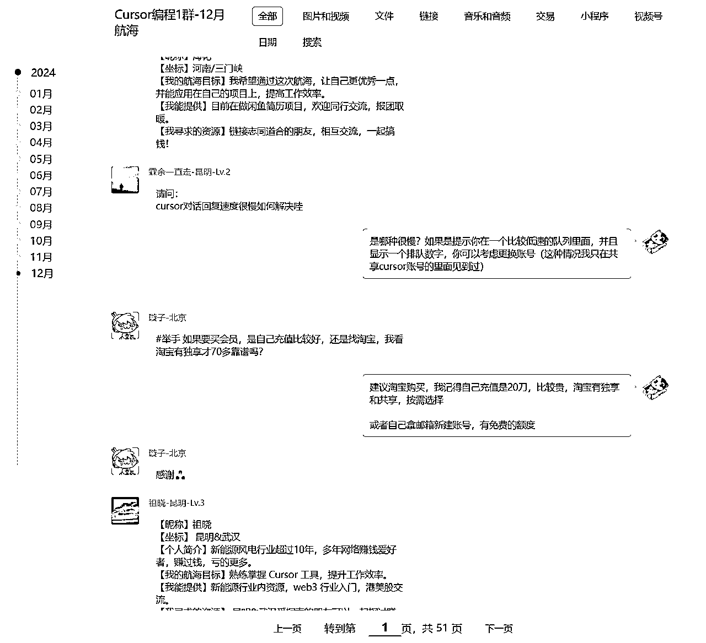

# 航海常见问答表格

> 来源：[https://gcnig3i8358l.feishu.cn/docx/PLeed8vUcoBjK3xvL5cc31tHnrg](https://gcnig3i8358l.feishu.cn/docx/PLeed8vUcoBjK3xvL5cc31tHnrg)

## 最省事看起来最方便的版本

刚刚重新写了个版本的代码，30行代码，效果出乎意料的很不错，比下面的表格格式的看起来舒服多了；

最重要的是，图片的问题解决了，在帖子原文提到了用表格处理，图片无法正确显示，这个30行的版本看起来又舒服，内容又不丢失。也是收集了问题后面对应的20行回答。

如果要用到实际航海中，继续优化一下效果会更好。（才30行代码要什么自行车

# 以下是帖子原文提到的相关输出文件：

## 根据"举手" "提问" "请教" 筛选出来的表格：

其中，列名为：StrContent的，是具体问题

## 原文提到的，问题+回答的表格：

回答中出现代码的部分，是图片，使用的工具无痕导出到表格无法正常显示，经测试html格式的可以很人性化的显示消息，只不过不方便根据程序做分析（具体文件见下面）

在整理此文档时发现了一些可优化空间：

*   拍一拍消息、撤回消息，同样是正常的消息，会被统计到表格中，应该对这些消息再添加一层过滤

*   如果消息是回复了上面的某条信息，在表格中会显示为空

## html格式的所有聊天记录

图片预览：

