# 如何在10分钟内运行土豆君的代码找到自己的头像

> 来源：[https://ba9gvofzgow.feishu.cn/docx/E78Wdhxy5oGGGWx4w8xcmv9On3e](https://ba9gvofzgow.feishu.cn/docx/E78Wdhxy5oGGGWx4w8xcmv9On3e)

大家好，我是林幻雨。

昨天一直在忙没有顾上找头像，今天早上第一件事，先看看圈友土豆君的帖子。

我发现群里面还有部分圈友不太会使用土豆君的代码，于是简单的做一个小小的教程。

活动本身链接是：https://t.zsxq.com/QrzhX

圈友帖子链接是：https://t.zsxq.com/pUGYs

接下来正式开始

## 第一步：安装环境

首先还是安装一个cursor，他就相当于一个代码编辑器，有他就够了。

### 安装cursor

cursor管网：https://www.cursor.com/ 直接点击 下载就可以啦

cursor的安装可以根据圈友阿紫的帖子来：https://t.zsxq.com/gdAAI 帖子中安装软件的部分非常详细

### 与cursor对话

然后可以就可以直接和cursor开始对话了，因为我们在贴子里面可以看到，是使用的python语言，所以我们来问一下cursor ，pthon的环境怎么安装。

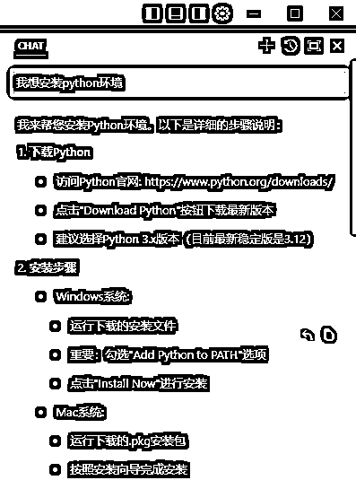

### 安装python环境

根据cursor 的提示，我们去python的管网 https://www.python.org/downloads/ 下载了python3.13 并完成安装

### 安装依赖包

我们安装完成后就可以根据帖子中的 提示去安装依赖包

直接把土豆君的那一句代码拿过来粘贴到我们的命令行里面

```
pip install opencv-python numpy
```

#### 打开命令行

打开命令行

第一步是打开运行

快捷键是键盘上的 【 菜单键 + R 】 （菜单键就是左下角Ctrl和Alt中间的那个windows键）

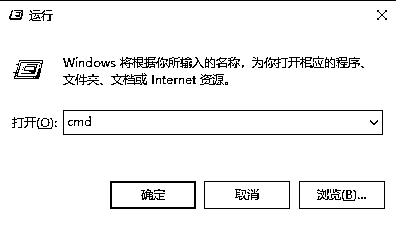

第二步是输入cmd并按确定

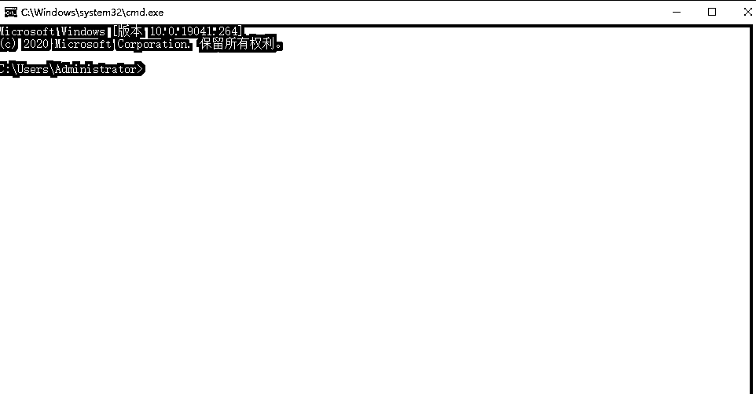

出来这样一个窗口就对了

#### 输入安装依赖包的命令

##### 1.检查python环境

我们可以先输入

```
   python --version
```

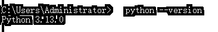

如果成功显示了版本号，说明我们python安装成功了

如果没成功的话，继续返回安装python 的步骤，重新安装。并且注意一定要把 Add python to PATH 勾选上

##### 2.安装依赖包。输入土豆君帖子中的命令

```
pip install opencv-python numpy
```

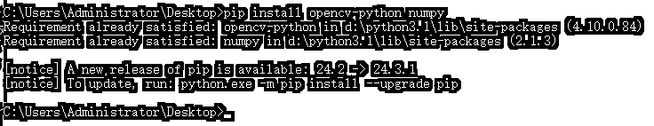

这样就是安装成功了。恭喜你完成了最难的一个部分，接下来就非常的简单了。

## 第二步：复制代码并运行

### 1.复制代码

打开cursor

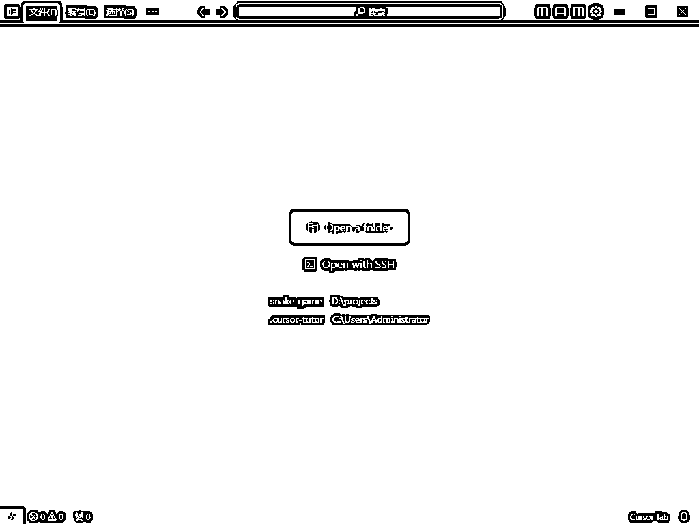

左上角文件中有一个新建文本文件

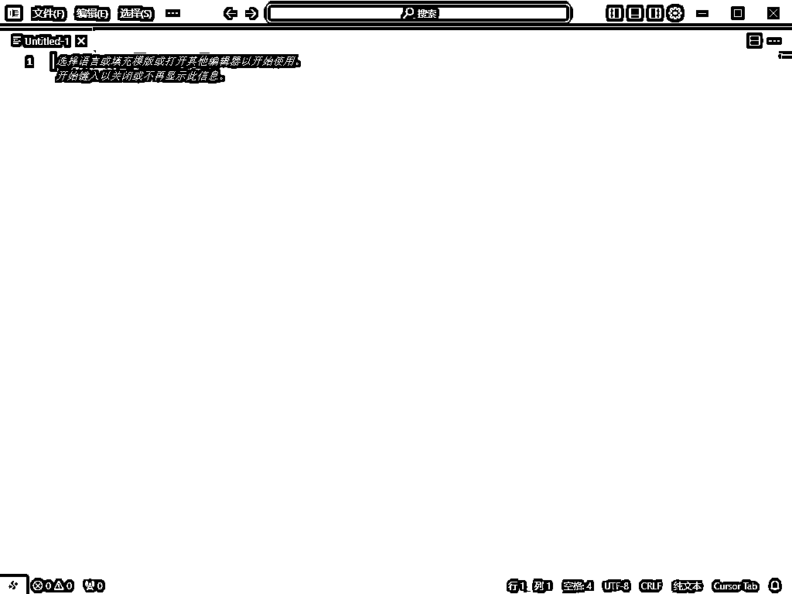

然后直接复制土豆君的代码来，粘贴到里面，保存

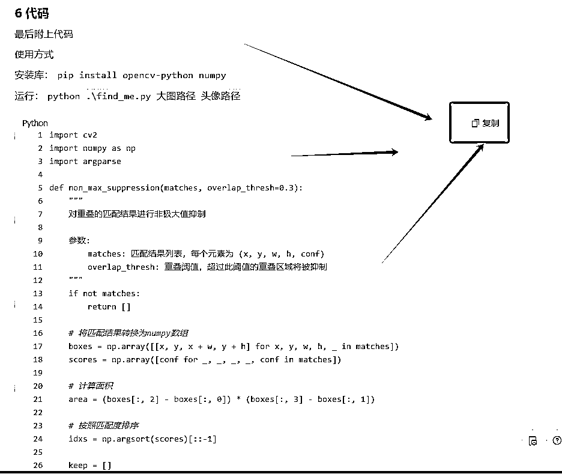

这么大一个复制，想必大家都能看得到，看不到的把鼠标移动过去试试看。

点击复制以后，直接粘贴到我们的cursor里面

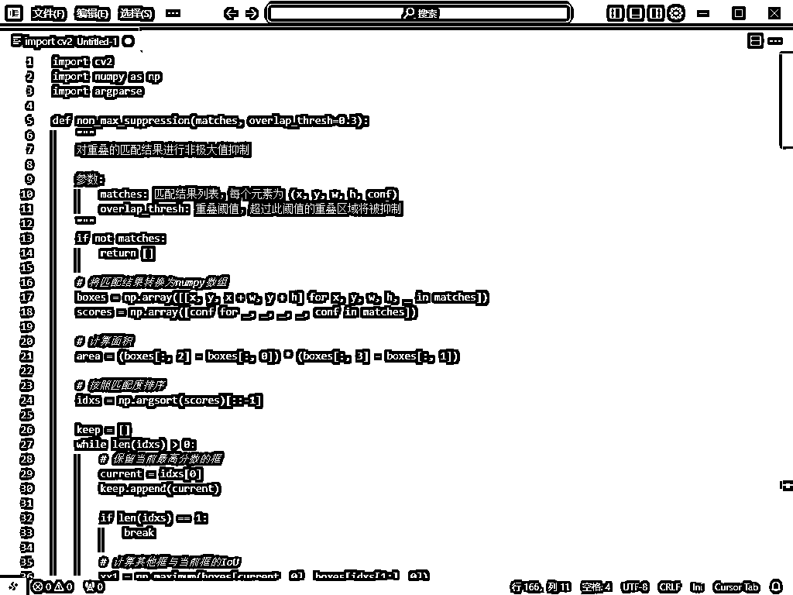

然后直接Ctrl + S 保存，或者点击菜单栏的文件，里面有一个保存

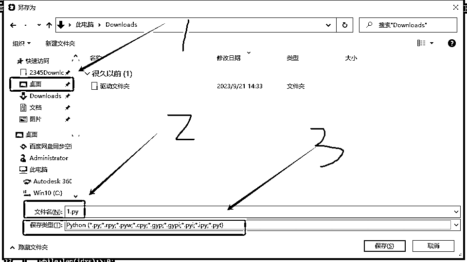

保存的时候找一个方便的地方，可以是自己新建的文件，也可以是桌面。把名字自己随便起一个，后面加上 【 .py】，然后把保存类型选择为 python 即可，都设置好了以后点击保存

2.保存合照大图和头像小图

分别在鱼丸的帖子 （https://t.zsxq.com/QrzhX） 中保存合照大图

和自己之前保存的头像小图，起一个简单的名字

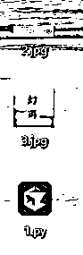

比如，我的文件名字叫1.py 我的大图名字叫 2.jpg 我的头像名字叫做 3.jpg

### 2.运行代码

代码和头像都已经准备好了，接下来就可以直接运行代码了。

代码的运行其实还是挺简单的，首先我们打开熟悉的命令行

菜单键 + R 打开运行 输入 cmd 打开命令行窗口

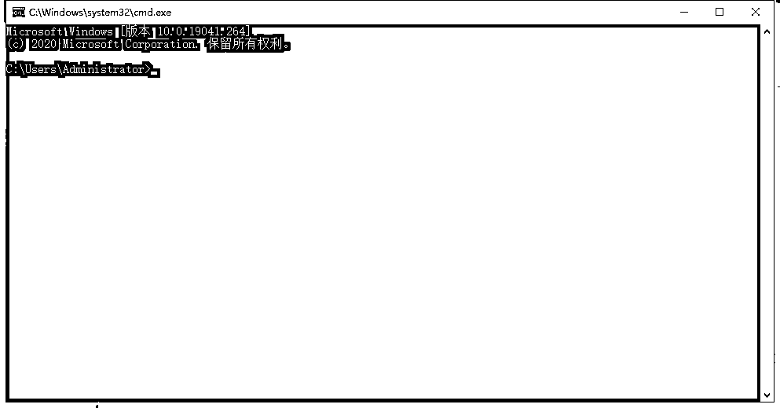

接下来我们先把位置去定位到我们刚刚保存代码文件的地方，可以点开代码的属性查看一下文件的位置。

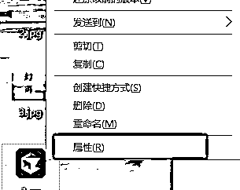

我们找到了他的位置


然后我们可以在命令行里面去输入一个命令，进入这个文件的地址

```
cd 你的文件地址
```

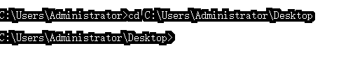

比如我就是这个地址【 C:\Users\Administrator\Desktop】

所以，我输入了 【cd C:\Users\Administrator\Desktop】

进入文件地址以后我们就可以直接运行文件啦

运行的命令是：

```
python 代码文件名字 大图名字 头像名字
```


因为我们之前直接进入了对应的文件夹，所以直接输入名称就好啦。

最终得到结果


搞定！