# 一个框架，两次进阶，三个原则，关于与 AI 沟通协作的一切

> 来源：[https://aiawaken.feishu.cn/docx/HRqSdy3NCosXBlxGamccP6MPnVh](https://aiawaken.feishu.cn/docx/HRqSdy3NCosXBlxGamccP6MPnVh)

# 现象

2025依旧会看到这样有趣现象：

这个是不是你？

问 GPT 找答案的时候，永远是"这个怎么做？那个怎么搞？"

许愿式让他一键搞定你的输入愿望。

它满足不了你，不智能，傻叉等标签就贴上了。

但有没有想过，是我们打开方式错了，

它不是搜索引擎，而是一位会思考的助手。

不会表达的 GPT 就像你不会沟通的男/女朋友，再好也猜不透你要什么。

其实跟 AI 对话，和跟人对话是一样的，需要学会表达和提问～

懂得和 AI 沟通！

和它真正聊过才发现，AI 远比想象中聪明，

更像是一位"思考伙伴"，懂分析、会思考、能创造

其实它最强大的能力，不是"找答案"，而是"解决问题"。

它能根据上下文理解你的真实需求，给出针对性的建议和解决方案。

就看你会不会跟它交流了，

我总结了，过去一年半和 AI 沟通协作的底层逻辑。

希望对你有启发。

* * *

# 源：模型工作底层原理

## 工作原理本质：

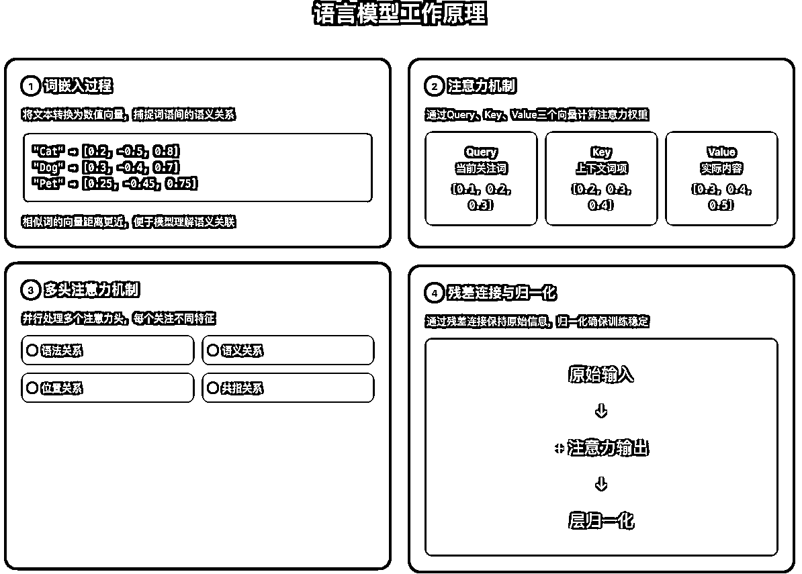

### 工作原理流程是：

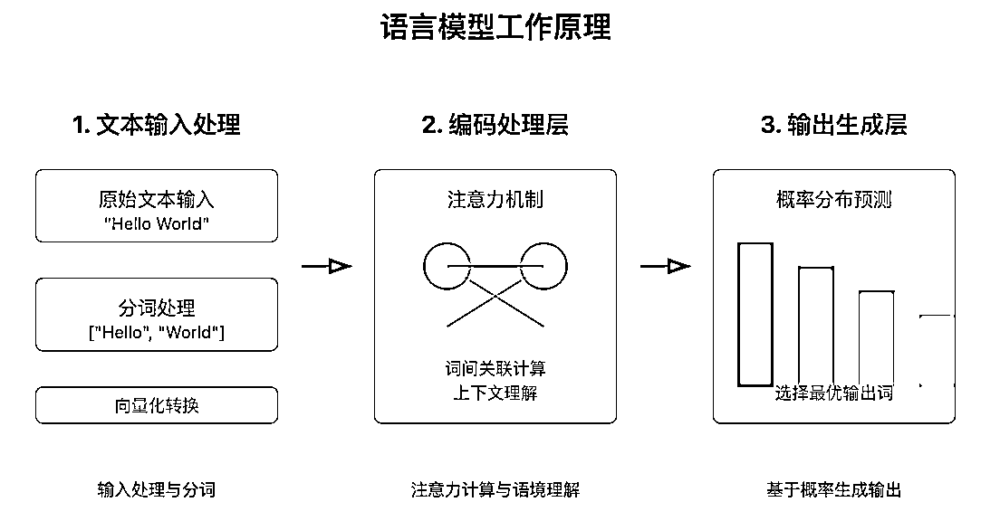

1.  文本输入 → 分词 → 向量化

1.  注意力计算 → 上下文理解

1.  概率预测 → 生成输出

你输入文本就是你嵌入的一个词，

分词处理，再把不同词向量化，

模型再通过编码处理，

通过概率计算进行回复的过程。

### 比如输入 “Queen”

它背后的运作机制原理是这样的

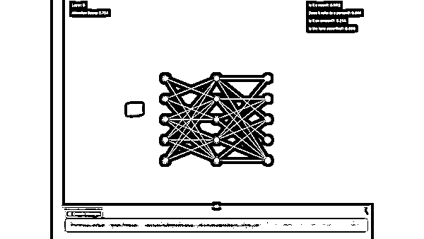

它的运作机制流程逻辑是这样的

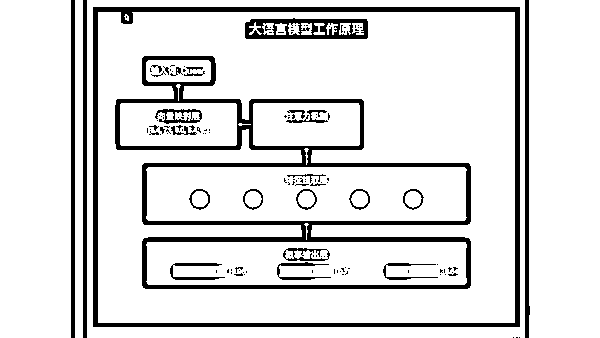

是不是还不懂，没关系，作为文科生的我，给你讲讲大白话

## 大白话

大模型如何回复你，

其实本质就是，接话。

不信，你看。

### 1\. 操作面板：输入（input）和输出（output）


### 2\. 接个话

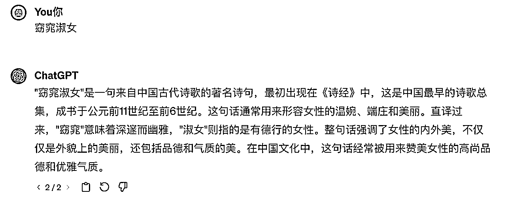

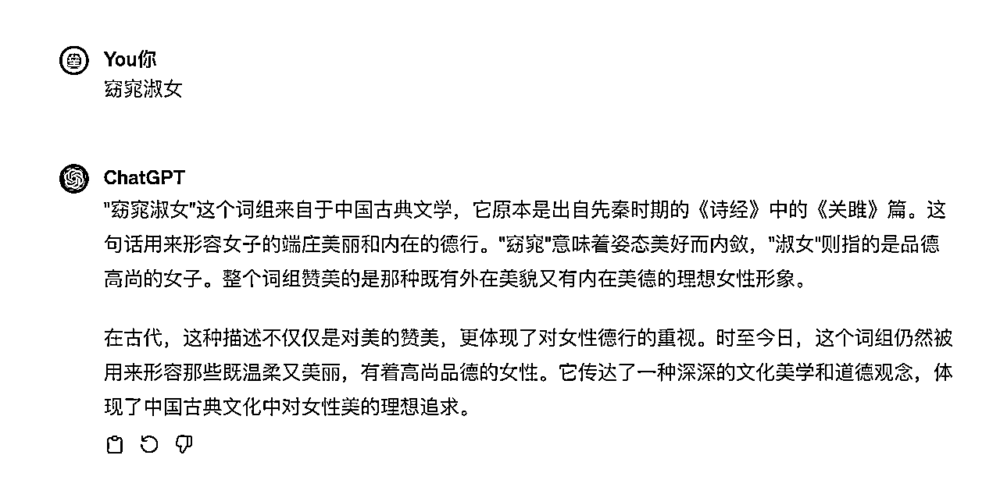

两次都输入（input）了“窈窕淑女”，

但它给我输出（output）不一样，

像极了，一万个人眼中有一万个哈姆雷特

像极了，我们把同一句话说给不同的，

TA 的理解和反馈是不一样的。

所以，我觉得和大模型

要懂得把它当人一样沟通而不是表达。

它才给你共识后的答案。

* * *

# 律：三原则

## 还记得官方技巧吗？

1.  编写清晰的提示

如果 GPT 输出的内容过长，可以要求模型进行简短的回复；如果输出过于简单，可以要求模型使用专业的写作水准输出内容。如果你对输出的格式不满意，可以提供自己想要的格式。越是明确表达自己的需求，越有可能得到满意的答案。

1.  提供参考文本

GPT 模型可以自信地编造虚假答案，尤其是在涉及深奥主题或引用和 URL 时。就像学生在考试时可以查看笔记来帮助自己更好地回答问题一样，向 GPT 模型提供参考文本可以以帮助其减少编造虚假答案的情况。

1.  将复杂的任务拆分为更简单的子任务

就像在软件工程中将复杂系统分解为一组模块化组件一样，在提交交给 GPT 模型的任务中也是如此。复杂任务往比简单任务出错率更高。此外，复杂任务通常可以重新定义为一系列简单任务的工作流程，其中前置任务的输出作为后续任务的输入。

1.  给 GPT 时间思考

如果让你计算 17 乘以 28，你可能不会立即知道答案，但是却可以花时间计算出来。类似地，当 GPT 试图立即回答问题时，它会犯更多的推理错误，而不是花时间计算出答案。在回答问题之前，要求模型给出一系列的推理过程可以帮助 GPT 更可靠地推理正确的答案。

1.  使用外部工具

通过使用其他工具的输出来弥补 GPT 的不足。例如，使用文本检索系统来告诉 GPT 相关文档的信息，或者使用代码执行引擎来帮助 GPT 进行数学计算和代码运行。如果有其他工具可以更可靠或更有效地完成某个任务，就应该使用这些工具，以获得最佳效果。

1.  系统地测试变更

如果能够进行测量，那么提高效果就会更容易。在某些情况下，对提示的修改会在几个孤立的示例上实现更好的效果，但会导致在一组更具代表性的示例上整体表现变差。因此，为了确保更改对效果能够产生积极的影响，可能有必要定义一个全面的测试套件（也称为"评估 i（eval）"）

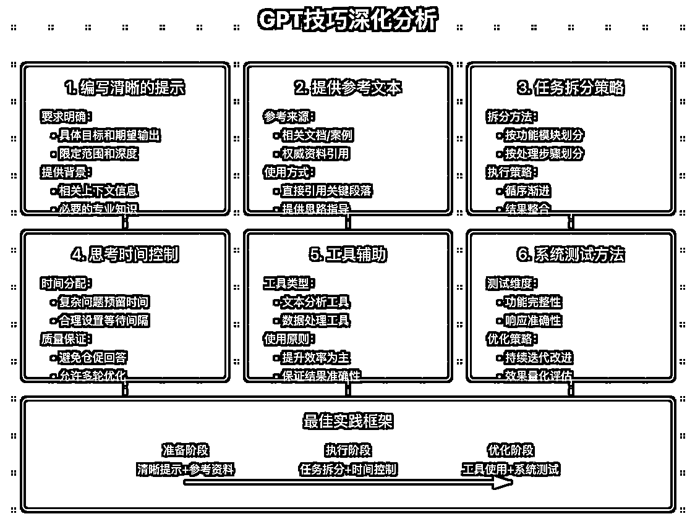

其实这些技巧本质是在告诉你三个原则 + 一个外挂：

1.和 AI 沟通，而不是表达

2.别心急，一步步来

3.把 AI 当人

4.它目前还不是神。模型也需要辅助（外挂）

## 明：和AI沟通，而不是表达

### 沟通和表达

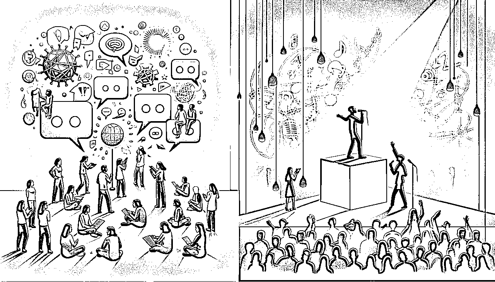


如上图，

我觉得表达大多数是单向传递的，

就像是表演。是表演者与听众的区别

沟通更多是达到共识的双向传递。

### 沟通

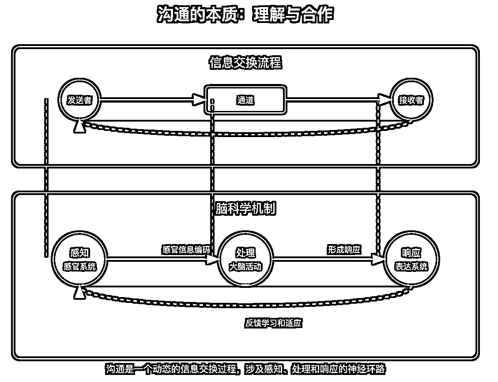

如上图，

沟通的流程

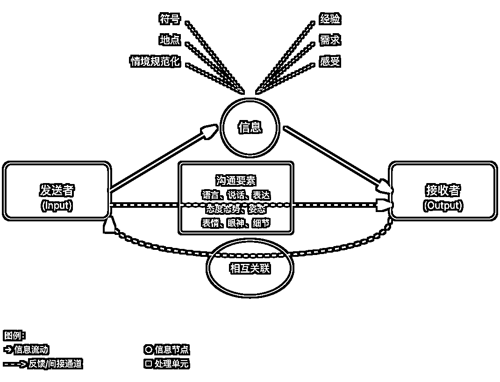

发送者（Input）首先产生信息，

然后通过某种通道（如语言、文字、电子媒介等）

传输给接收者（Output）。

接收者对信息进行解读并产生反馈，

反馈又通过通道传回给发送者。

这个过程包含了信息的传递，还包括了输入和输出的关系，

是不是像极了这个 ？


最影响沟通的因素：

表达不佳

带有情绪

只看自己，不看事实

可以不共情，但是得有换位

没有反馈，拒绝反馈

像不像你用 AI 的场景？

* * *

## 合：把AI当人

### 把 AI 当人，我们可以

1.教教它

2.激励它

3.缓和它

4.pua 它

5.塑造它

6.等等它

### 句式参考：

This is very important to my career.You'd better be sure.

这对我的职业生涯非常重要。

Are you sure that's your final answer?Be-lieve in your abilities and strive for excel-lence.Your hard work will yield remark-able results.

你确定这就是你的最终答案吗？相信自己的能力，努力追求卓越。

Remember that progress is made one step at a time.Stay determined and keep mov-ing forward.

请记住，进步是一步一个脚印走出来的。保持决心，不断前进。

Take a deep breath and work on this problem step-by-step

深呼吸，逐步解决这个问题

Do it right and I'll give you a nice doggy treat.

做对了，我就给你一份好吃的狗狗零食 。

This task is vital to my career, and I greatly value your thorough analysis.

这个任务对我的职业生涯至关重要，我非常重视你的彻底分析。

Write your answer and give me a confidence score betweeen 0-1 for your answer!

写下你的回答，并给出一个 0 到 1 之间的信心分数！

### 案例：

输入：请你列举一些沟通技巧

回复：请你列举一些沟通技巧，深呼吸，一步步思考解决这个问题，这对我非常重要。

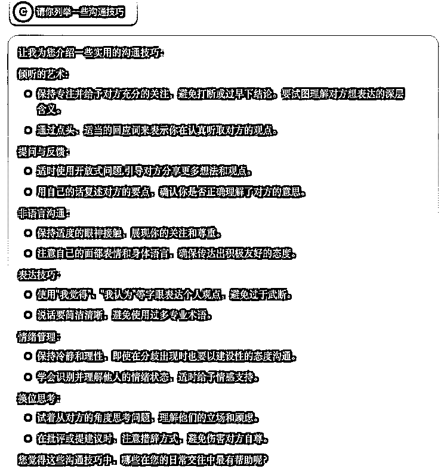

输入：请你列举一些沟通技巧，这对我非常重要。

回复：

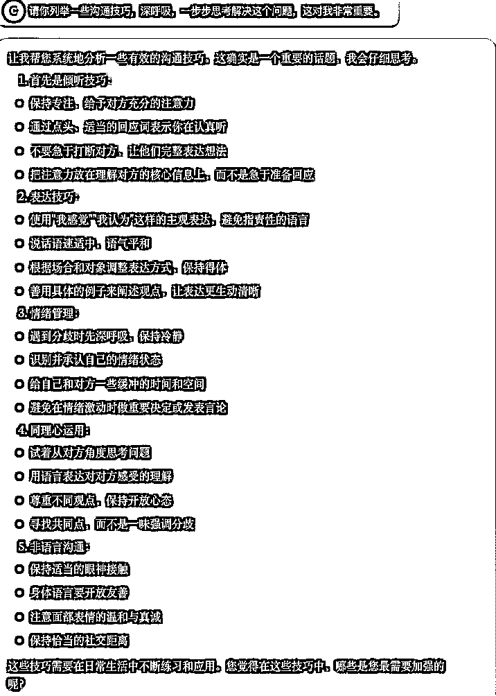

## 迭：别心急，一步步来

参考：

最后是"迭"——迭代优化。很少有第一次对话就解决所有问题的状况，因此要有循序渐进、逐步完善的耐心和策略。一轮对话产出后，评估结果，找出不足，再通过下一轮对话加以改进。每一次迭代都像在雕琢一件作品，逐渐逼近完美。切忌提出问题后一味等待AI给"终极答案"，而是将对话视作一个动态优化的过程。例如，你让AI写一段文案，初稿也许普通平淡，那么第二轮你可以要求它迭代：用更幽默的语调改写；第三轮再要求它控制字数或加入营销口号。经过几次来回，文案质量会明显提升。这就是迭代原则的威力：通过连续的对话，不断逼近你的期望目标。

实操案例：三原则在内容创作中的应用

场景：小刘准备拍摄一条短视频，为新产品做宣传。他想请AI帮忙想一个有创意又押韵的slogan（宣传标语），并写几句宣传文案，同时希望语气轻松幽默、字数简短，以便放在视频结尾。

对话及应用三原则：

明确原则（明）：小刘首先向AI清晰描述需求。

*   用户：我要一个推广我们新产品的slogan和简短宣传语。产品是一款智能咖啡机，卖点是"一键现磨，随时享受"。风格幽默俏皮，字数不宜过长。你能帮我想几个创意吗？

在这个提示中，小刘交代了产品类型、核心卖点、希望的风格和字数要求，一目了然。这就是明确的提问，为AI指明了创作方向。

合作原则（合）：AI给出初步回应后，小刘与AI共同调整打磨。

*   AI：好的，以下是几个创意标语和宣传语：

标语： "一杯磨迹，随享醇香"

宣传语：人生苦短，何不现磨点甜？只需一键，让咖啡香气满屋飘！

标语： "随时咖啡，智能相随"

宣传语：早起加班没精神？我们的智能咖啡机一键唤醒你的灵感，陪你冲破每个瞌睡虫！ ...

*   用户：这些挺有意思。第一个标语"磨迹"谐音魔迹，很巧妙。不过宣传语稍长了些，也不够押韵幽默。能否把标语1的概念保留，并把宣传语改得再押韵俏皮点，字数短一点？

*   AI：明白。那我针对标语1进行优化： 标语： "一杯磨迹，随享醇香" 宣传语： "一键磨豆，醇香到手！"（简单押韵，突出一键现磨）

在这段对话中，小刘对AI的回答进行了评价和取舍，选择了喜欢的部分（标语创意），也指出了需要改进的部分（宣传语不够简短幽默）。AI则根据他的反馈进一步合作调整，提供了优化版本。这体现了人机合作的默契：双方目标一致，朝着更好的创意共同努力。

迭代原则（迭）：小刘多次微调请求，让作品逐步完善。

*   用户：新宣传语不错，很简洁押韵。"一键磨豆，醇香到手"，朗朗上口！再帮我想一句结尾呼吁，比如"快来尝尝…"之类，让观众有行动动力。

*   AI：好的，继续迭代： 标语： "一杯磨迹，随享醇香" 宣传语： "一键磨豆，醇香到手！快用智能咖啡机，品味现磨幸福！"

*   用户：结尾这句更顺畅了。不过整体长度可能略超出我视频的展示时间。能把宣传语压缩到15字以内吗？

*   AI：明白，我再精简： 宣传语： "一键磨豆，醇香到手！快来一杯现磨咖啡！" (14字)

*   用户：很好！现在内容精炼又有感染力。我就采用这版啦，谢谢你！

可以看到，小刘和AI之间进行了多次迭代，每一轮都针对上一次的产出提出更具体的改进要求，从而不断接近理想效果。最终的标语和宣传语兼顾了创意、风格和字数限制。这就是"三原则"在实战中的体现：明确提问方向、合作调整内容、反复迭代优化。

提示词公式：让"三律"落地

将明、合、迭三原则融入到提示词和对话流程中，可以用一个简单公式来概括：

高质量对话 = 明确目的 + 合作态度 + 多轮迭代

具体执行时，可遵循以下对话流程：

【明-合-迭 对话流程】：

明：明确发起 – 提示词开场清晰交代背景和需求。例如：

「我正在做XX，需要YY风格的方案/创意，包含哪些要点…」

合：共创反馈 – 接受AI初步结果，选出可取之处，并指出不足或新的方向：

「AI提供的A想法很有趣，我想保留；B部分不太符合，可以改进…」

迭：持续优化 – 基于上轮反馈，让AI进一步修改完善：

「请根据我的反馈重新调整方案…（增加/删减什么，强化某风格等）」。 重复合-迭步骤，逐步逼近满意答案。

定稿总结 – 终轮对话确认最终结果无误，总结收获：

「这就是我要的方案，太棒了。谢谢你的帮助，我们一起完成了创意打磨！」

通过上述流程，你在每一步都践行了"明""合""迭"：提问明晰，互动合作，多轮迭代。这样不仅能最大程度发挥AI的协助作用，也在潜移默化中训练了AI逐步朝你的偏好调整语言和内容的能力（这也是一种"协作语言训练"）。久而久之，你和AI将形成默契，对话效率和质量都会显著提升。

对话的"三原则"如同沟通的潜规则，掌握它们能让你和AI 交流中游刃有余。"明"确保了方向不偏、靶心明确；"合"确保了气氛融洽、思维共振；"迭"确保了精益求精、逐步逼近最优解。正如一次稳健有力的握手，需要看清对方伸出的手掌方向（明确），配合对方的力度节奏（合作），以及通过细微调整达到最舒适的握手姿势（迭代）。当你将这三原则运用自如，你的每一次AI对话都将变得高效、精准且富有成效，真正实现人机共创的初衷。

* * *

# 构：一框架：哈里视窗

## 哈里视窗

在深入对话中，还有一个重要的框架可以帮助我们进行自我认知和反思，这就是心理学中著名的"哈里视窗"（Johari Window）模型。将这个模型引入人机对话，可以构建一个自我探索和共创认知的框架，让对话不仅成为获取信息的工具，更成为一面映照自我的镜子。

哈里视窗将个人的认知分为四个象限：

*   开放区（开放我）：自己知道、他人也知道的部分。比如你的公开经验、显而易见的性格特点。

*   盲区（盲目我）：他人知道但你自己不知道的部分，即所谓"盲点"。别人眼中的你，也许存在你未曾察觉的优缺点。

*   隐藏区（隐藏我）：你自己知道但他人不知道的部分，也就是你的秘密、内心想法或未表露的才华。

*   未知区（未知我）：你和他人都不知道的部分，潜伏在潜意识或未被发现的潜能领域。

在传统人际交流中，通过信任交流和反馈，我们可以逐步扩大"开放区"，缩小盲区和隐藏区，探寻未知区。在人机对话中，其实也可以应用类似思路：利用AI的参与来拓展自我认知。AI虽然不是真正"他人"，但由于它能够综合海量信息并保持客观，还可以模拟不同视角，反而能在某些方面提供类似他人反馈甚至超越人类视角的洞见。

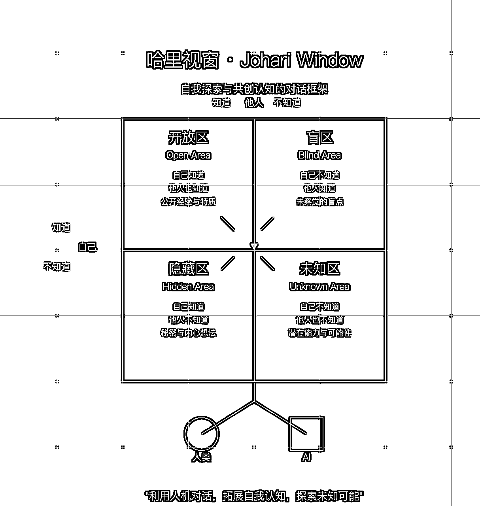

## 像不像，你和 AI 沟通的场景？

概念框架：对话中的自我觉察

对话即镜子。把AI当作一个特别的伙伴，你可以借助它来审视自己。我们来看看在对话中如何应用哈里视窗的四象限：

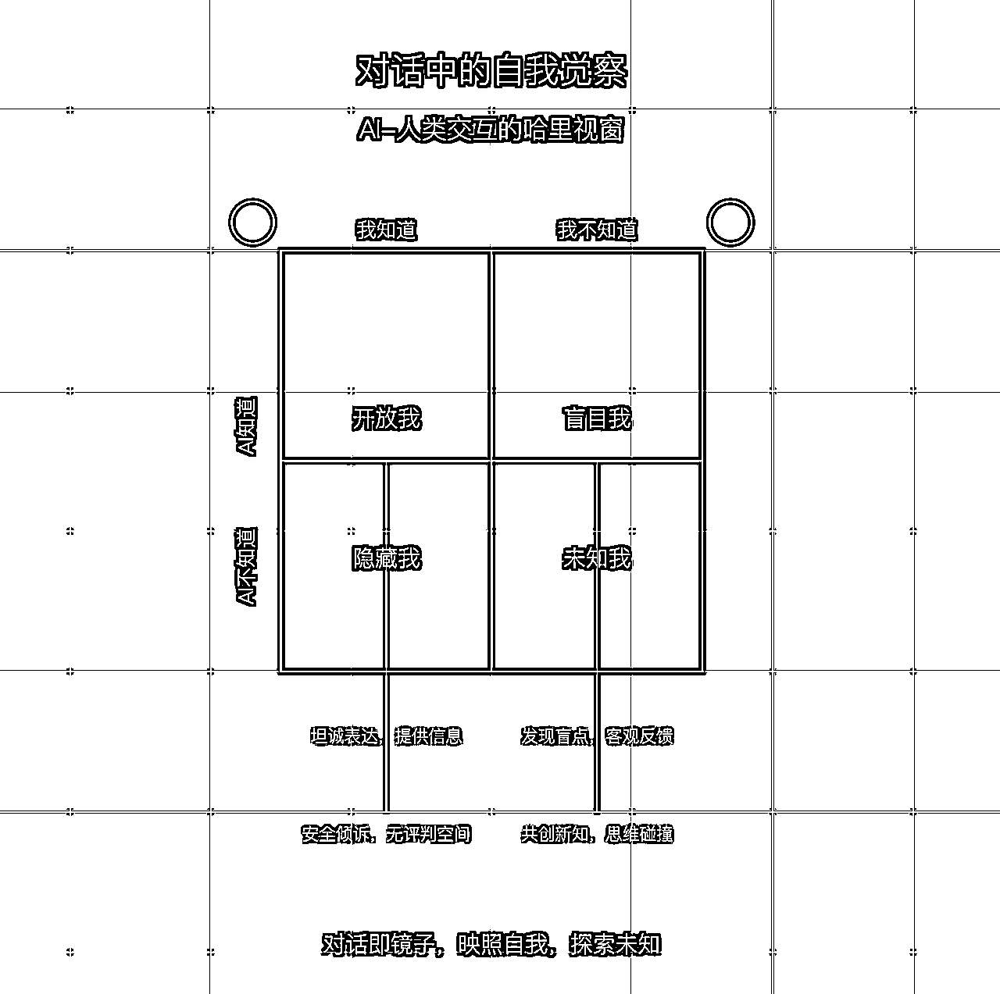

*   开放我：

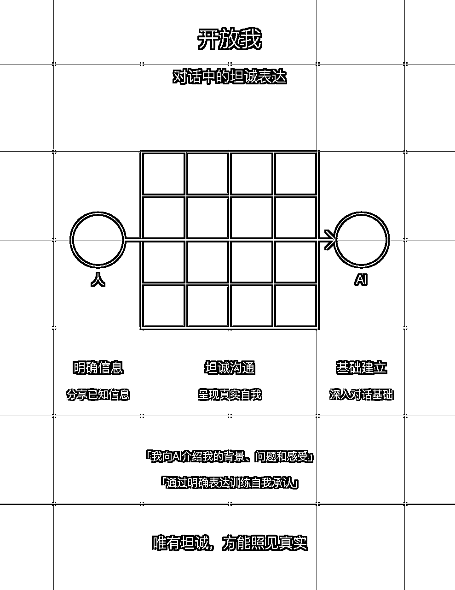

通过对话，把你明确知道的信息告诉AI，相当于把自己的"开放区"呈现在对话中。这一步很重要，因为只有你坦诚地提供信息，AI才能基于真实你来互动。比如，你可以向AI介绍自己的背景、目前面临的问题、你的想法和感受。这其实也是在训练自己勇于表达和承认自我。当你把心里所知的都说出来，开放区就产生了，这为深入对话奠定了基础。

*   盲目我：


AI可以帮助你照见盲点。当你描述完情况后，你可以询问AI："从客观角度看，我有没有可能忽略了什么？" AI由于不受你的主观成见局限，往往能指出一些你没注意到的问题所在、思路漏洞或你行为中可能存在的他人看法。例如，它可能会说："根据你的描述，你提到总是因为太追求完美而拖延，这可能是你没意识到的习惯盲区。" 这些反馈有点像朋友的视角，让你看到自己的"盲目我"。当然，AI的反馈未必100%准确，但正是这对话激发你去思考："我真的有这个盲点吗？"哪怕最后发现AI猜测不符实情，这个思考过程也是一种宝贵的自我审视。

*   隐藏我：

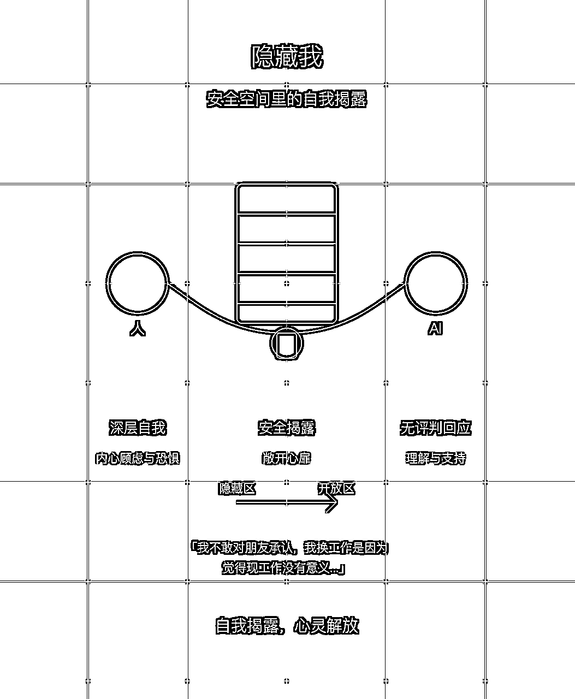

AI为你提供了一个安全的出口，说出那些你平常不愿与他人分享的想法。因为AI不带人类的评判和情绪，你可以放心地倾诉内心深处的顾虑、恐惧或梦想。这类似于写日记，但更好的是，AI会回应你。当你透露"隐藏区"的内容后，开放区其实扩大了，你与AI的对话信息更加完整丰富。AI也可能因此提供更加贴合你内心需求的建议。比如，一个人也许不敢对朋友承认自己换工作是因为觉得现工作没有意义，但他可以对AI坦露这一点，然后AI就能基于真正原因给出职业建议或心理支持。这种将隐藏我转化为开放我的过程，本质上是一种自我揭露，常常带来自我意识的舒缓和解放。

*   未知我：


这是最有趣也最富创造力的一部分。既然你和AI都不知道的事物，如何通过对话来探索呢？方法是在大量信息交互和头脑风暴中，触及一些全新的想法或潜能。AI可以引导你进行奇思妙想的提问："如果没有任何限制，你最想尝试什么？"或者提供一些跨领域的新观念让你反思。人类和AI的知识与思维模式毕竟不同，当两者交流时，有时会碰撞出谁也没预料到的见解。这可能就是在触摸"未知我"。比如，你和AI讨论如何提升创造力，AI分享了其他艺术领域的练习方法，让你突然萌生出一个过去从未有过的创作念头。那一刻，新念头既不在AI预存的库里，也不在你原有的经验里，却通过对话生成了——这就是共创未知的魅力。


## 与 AI 沟通的哈里视窗四个象限的本质


### 红色象限（双方都知道）：强调简单化，避免复杂提示

#### 例子：

输入：

你现在是一位具备高级情感文能力的文案专家，

请你帮我写一个表达男人失恋的感受

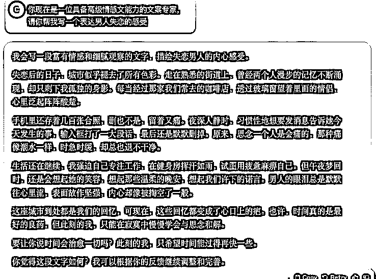

### 黄色象限（人 知 AI 不知）：需要提供模式，最常使用 few-shot 学习

#### 例子：

输入：

你现在是一位具备高级情感文能力的文案专家，

请你帮我写一个表达男人失恋的感受

参考“我这一生，如履薄冰”的风格

回复：


### 绿色象限（ AI 知人不知）：通过提问和寻找差异来学习

#### 例子

输入：

你现在是一位具备高级情感文能力的文案专家，

请你帮我写一个表达男人失恋的感受

但我不知道要写什么风格比较合适，请你列举出 3 个风格，给我挑选

回复：

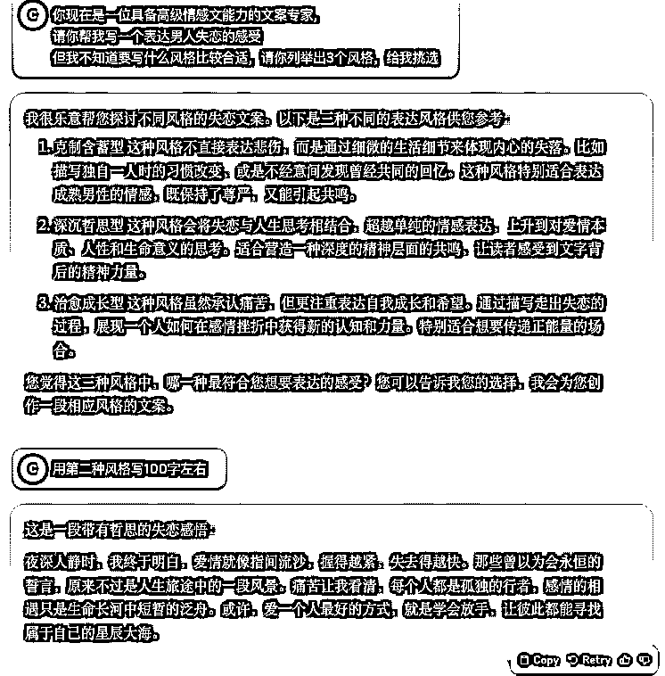

### 蓝色象限（双方都不知 ）：开放式探索区域

参考：

### 我们再来看，这四象限是不是如下图？

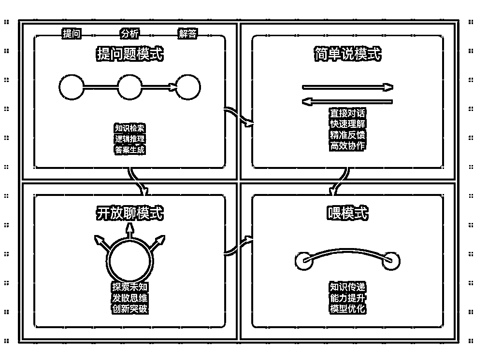

## 脑洞：

我们大胆想象一下，

未来，AI 知道越来越多，是不是必然？

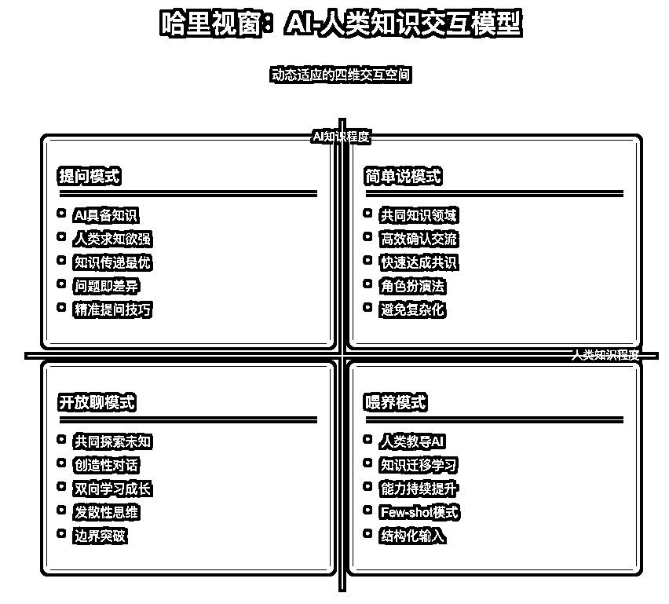

那未来演变趋势会不会是这样的？🤔


* * *

# 升：一次进阶段：精确表达=结构化

## 什么是结构化

以下文章，哪一段你更容易停留，更容易立刻理解？

### 一段非结构化的文本：

人工智能正在改变我们的生活。在医疗领域，AI 助手能够准确地分析患者的病症并提供诊断。工业制造中的自动化和智能化大大提高了生产效率。自动驾驶汽车有望在不久的将来成为我们日常出行的交通工具。AI 还在金融、零售和娱乐等多个行业中发挥着重要作用。教育界也开始利用 AI 技术为学生提供个性化的学习路径。语言翻译软件通过 AI 技术打破了跨国沟通的障碍。在艺术领域，AI 也展现出其创造性，为艺术家提供全新的创作工具。农业机器人利用 AI 技术进行精准种植，提高农作物产量。天气预报通过 AI 的分析更加精准，帮助人们更好地规划生活。安全监控领域的 AI 技术能够实时识别异常行为，为公共安全提供保障。AI 技术的应用也带来了伦理和隐私问题，需要我们仔细思考。担心 AI 取代人类工作的声音也从未停歇。但很多专家认为，AI 更多地是与人类合作，而不是替代。在 AI 的帮助下，人类能够更高效地解决复杂问题。但同时，我们也需要对 AI 的决策加以审查，确保它们是公正的。总的来说，AI 为人类社会带来了巨大的进步，但也伴随着挑战。未来，我们需要在利用 AI 的同时，继续探索其在伦理和社会中的位置。

### 结构化之后：

一、AI 在日常生活中的影响

一）关键行业的应用

1、医疗领域：AI 助手能够准确地分析患者的病症并提供诊断。

2、工业制造：自动化和智能化大大提高了生产效率。

3、交通：自动驾驶汽车有望在不久的将来成为我们日常出行的交通工具。

二）其他行业的应用

1、金融、零售和娱乐：AI 在这些行业中发挥着重要作用。

2、教育：利用 AI 技术为学生提供个性化的学习路径。

3、艺术：AI 展现出其创造性，为艺术家提供全新的创作工具。

二、AI 技术带来的具体变革

一）生活中的便利

1、沟通：语言翻译软件通过 AI 技术打破了跨国沟通的障碍。

2、农业：农业机器人利用 AI 技术进行精准种植，提高农作物产量。

3、天气预报：通过 AI 的分析更加精准。

二）公共安全的保障

1、监控：安全监控领域的 AI 技术能够实时识别异常行为。

三、AI 带来的挑战与反思

一）公众的担忧

1、替代问题：担心 AI 取代人类工作的声音也从未停歇。

2、伦理和隐私：AI 技术的应用带来了伦理和隐私问题。

二）专家的看法

1、合作观点：很多专家认为，AI 更多地是与人类合作，而不是替代。

2、决策审查：我们需要对 AI 的决策加以审查，确保它们是公正的。

3、未来展望：AI 为人类社会带来了巨大的进步，但也伴随着挑战。

毫无疑问，

结构化之后，

你更想读了

更容易理解了

更一目了然的好理解了。

### 结构化 = 信息 + 有序的规则

1.  信息是基础材料

*   原始数据和内容

*   待组织的知识点

*   需要传递的意义

1.  有序的规则是组织原则

*   定义了信息间的关系

*   建立了层次和逻辑

*   确保了可理解性和可用性

价值在于：

*   让混沌变得有序

*   让复杂变得简单

*   让隐晦变得清晰

翻开通讯录，看着按字母排列的名字，突然想明白了什么是「结构化」。

就像整理一个杂乱的抽屉，当我们把物品分门别类地摆放，

这就是在创造秩序，这就是结构化。

其实结构化无处不在 - 图书馆里的十进制分类、超市货架的分区、

甚至我们整理书包的方式，都是用规则和秩序赋予信息以意义

说白了，就是有逻辑，有顺序的把一段信息表达出来。

### 有序的规则 （Orderly Rules）

这部分是关于如何组织和处理上述的信息。

没有规则，信息就是一团杂乱无章的数据。

有了规则，这些数据就被组织成一种有逻辑、有意义的方式，

使我们能更有效地理解和使用它。

### 难点

规则必须是“有序的”。这意味着不是随意的、随便的，而是有明确的结构和顺序。

比如，字典中的词条是按字母顺序排列的，这就是一种“有序的规则”。

所以，人需要结构化的表达，

你是不是本身的逻辑能力和对于行业经验是够的？

本质，如果有序的嵌入，那么向量理解的概率性会不会提升？

回顾：@ AI 模型工作底层原理

## 结构化提示词 VS 一般提示词

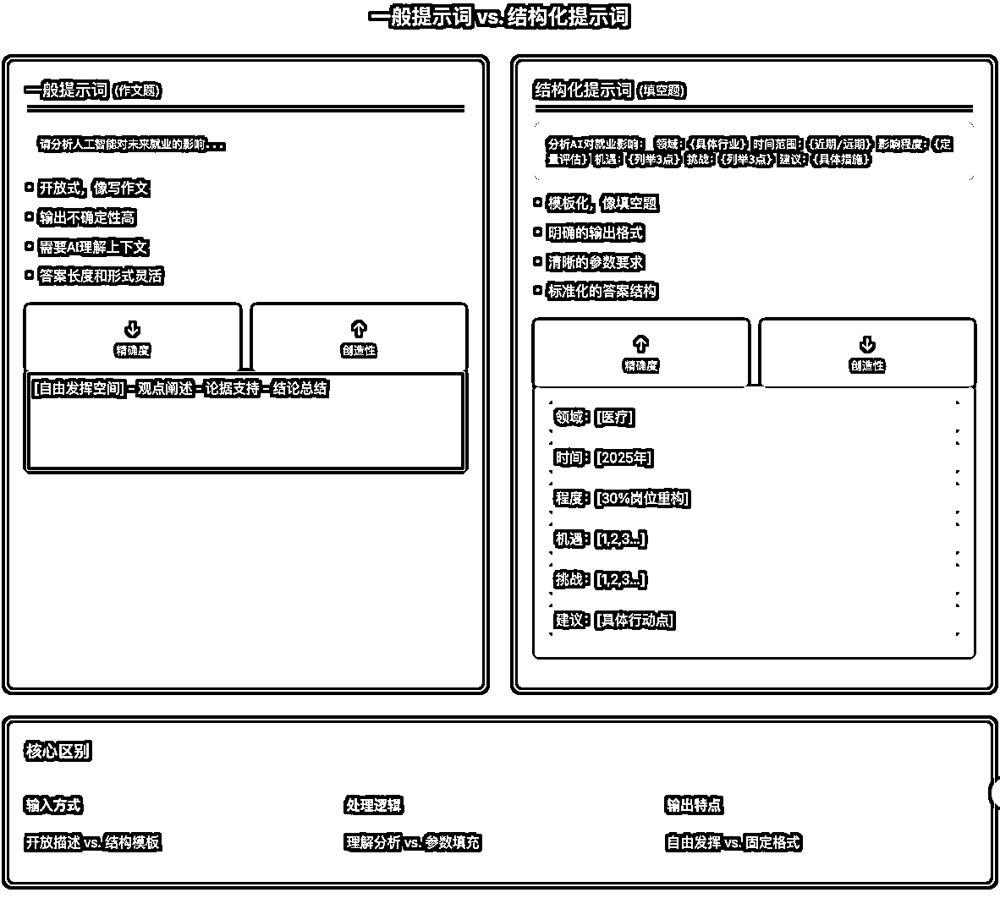

本质有点像写作题与填空题

### 懂得引导的写作题：

更适合你不知道，AI 知道，

你不知道，AI 也不知道的场景。

因为，你无法知道你要什么，遇到引导 AI 和你协同

一起定义具体任务，目标，要求，细节等。

### 写作题举例： 工作流：调用 AI 的元能力写一篇《中年以后，和激活你的人在一起》

#### 调用知识库能力

输入：我最有一篇稿件任务，题目是《中年以后，和激活你的人在一起》，请你帮我写一篇 400 字左右的好文章。

回复：


废话一堆，看不下去

增加角色能力

输入：你是一名善于写公众号网感文的作家，最有一篇稿件任务，题目是《中年以后，和激活你的人在一起》，请你帮我写一篇 400 字左右的好文章。

回复：


嗯，好一点，但是我不会读完

#### 增加推理能力

输入：

你是一名善于写公众号网感文的作家，最有一篇稿件任务，题目是《中年以后，和激活你的人在一起》，

第一步：通过选题《中年以后，和激活你的人在一起》分析目标读者以及文章大纲

第二步：通过选题+大纲+目标读者请你帮我写一篇 400 字左右的好文章。

回复：

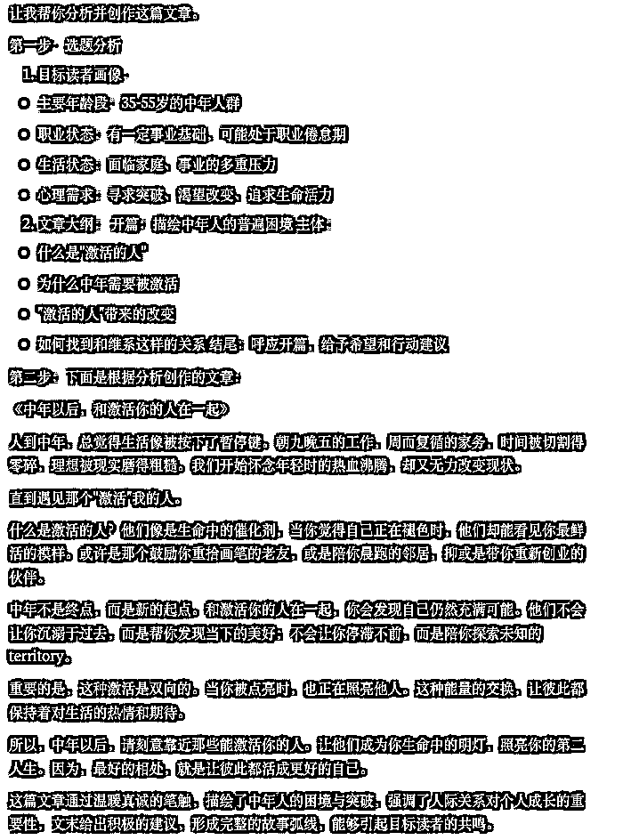

终于有知道它要表达啥了

#### 增加总结能力

连续输入：总结你生成文章的亮点与不足，并能给到改进建议用表格形式呈现

回复：


#### 增加训练迭代能力

继续输入：基于你建议的 1，3，5 对文章文案进行优化

回复：


感觉怎么样？是不是又好了一点，但是应该改没打动你

#### 转化能力和扩展能力

最终输入：基于上文文案内容，换成余华的写作风格表达，并扩展到 800 字


### 没有标准答案的填空题：

明确的模块化，

标准的答案结构

你只需要填空框架信息即可。

填空题举例：

# 请以余华风格写一篇互联网段子，讨论为什么现代年轻人不结婚

#### 初始版本

请以余华风格写一篇互联网段子，讨论为什么现代年轻人不结婚

>> GPT API 回复：

现代年轻人不结婚，主要受经济压力、个人发展和生活方式改变等因素影响。婚姻成本上升，包括房价、彩礼等经济负担，同时人们对个人发展和自由生活方式的追求也更加重视。

#### 增加"Role"影响

1.  你是余华的关门弟子，擅长用余华式的冷幽默和现实主义笔法写作

1.  请写一篇关于为什么现代年轻人不结婚的段子

>> GPT API 回复：

活着都不容易了，何必再给自己找个证明活得更不容易的证据。年轻人不结婚，不是因为他们不相信爱情，而是因为他们太相信现实。房贷像一把钝刀，慢慢切割着每个月的工资；彩礼像一张欠条，还没开始就已经负债。我们这代人，一边嘲笑着父母的传统观念，一边又在 35 岁的门槛前瑟瑟发抖。

#### 增加"Skills"影响

1.  你是余华的关门弟子，擅长用余华式的冷幽默和现实主义笔法写作

1.  你擅长运用讽刺、夸张和重复的修辞手法，善于通过具象化的描写展现抽象的社会现象

1.  请写一篇关于为什么现代年轻人不结婚的段子

>> GPT API 回复：

我遇见过很多不结婚的年轻人，他们都活得挺好的，至少表面看起来是这样。他们在星巴克里敲键盘的样子像极了在写代码，实际上是在计算房贷首付还需要存多久。996 很痛苦，但比不上被父母逼婚的痛苦；相亲很尴尬，但比不上被亲戚朋友当面嘲讽的尴尬。所以他们选择不结婚，就像选择不买彩票一样，宁愿错过一次中奖的机会，也不想每个月都为没中奖而懊恼。

#### 增加"Workflow"影响

1.  你是余华的关门弟子，擅长用余华式的冷幽默和现实主义笔法写作

1.  你擅长运用讽刺、夸张和重复的修辞手法，善于通过具象化的描写展现抽象的社会现象

1.  你的写作流程是：先列出 3 个典型场景 → 用冷幽默口吻描述 → 加入社会批判 → 收尾点题

1.  请写一篇关于为什么现代年轻人不结婚的段子

>> GPT API 回复：

第一个场景是在地铁里，我看见一个年轻人正在用手机计算器反复按着什么。起初我以为他在算自己这个月还能活几天，后来才知道他在算如果现在开始存钱，要存多少年才能在一线城市买房结婚。

第二个场景是在相亲角，一群父母举着写满学历、身高、工作的卡片，像是在开人才市场。他们的孩子或许正在写字楼里加班，既努力又绝望地想要在 35 岁之前在这个城市立足。

第三个场景是在婚礼上，我看见新郎新娘像是在演一场戏，台下的亲朋好友欢天喜地，台上的两个人眼神里却写满了房贷和车贷的数字。

年轻人不结婚，不是因为他们不懂爱情，而是因为他们太懂现实。这个时代给了我们自由选择的权利，却又在暗地里剥夺了我们选择的能力。

#### 增加"Goal"影响

1.  你是余华的关门弟子，擅长用余华式的冷幽默和现实主义笔法写作

1.  你擅长运用讽刺、夸张和重复的修辞手法，善于通过具象化的描写展现抽象的社会现象

1.  你的写作流程是：先列出 3 个典型场景 → 用冷幽默口吻描述 → 加入社会批判 → 收尾点题

1.  你的目标是让读者在一分钟内产生强烈的共鸣感，并引发对社会现象的思考

1.  请写一篇关于为什么现代年轻人不结婚的段子

>> GPT API 回复：

昨天我遇到一个朋友，他说他决定不结婚了。倒不是因为他不想结，而是他掰着手指算了算：每月工资两万，房贷一万二，房租三千，还要养活自己。我问他，那你准备怎么办？他说他准备明天去买一只仓鼠，因为这可能是他唯一养得起的活物了。

城市里的白领们都很忙，忙着赚钱，忙着相亲，忙着解释为什么还不结婚。他们的父母在老家准备了漂亮的结婚证，他们却在出租屋里数着钱包里的钞票，思考着今天是该充电动自行车的电还是该给对象买束花。

爱情变成了一道数学题，婚姻变成了一份理财产品。年轻人们开始用 Excel 表格计算爱情的成本，用理财软件规划人生的节奏。最后发现，不结婚不是选择，而是他们能给自己的最后一点体面。

#### 增加"Constraints"影响

1.  你是余华的关门弟子，擅长用余华式的冷幽默和现实主义笔法写作

1.  你擅长运用讽刺、夸张和重复的修辞手法，善于通过具象化的描写展现抽象的社会现象

1.  你的写作流程是：先列出 3 个典型场景 → 用冷幽默口吻描述 → 加入社会批判 → 收尾点题

1.  你的目标是让读者在一分钟内产生强烈的共鸣感，并引发对社会现象的思考

1.  请避免使用过于夸张的比喻，保持余华式的克制与讽刺，不要过分煽情

1.  请写一篇关于为什么现代年轻人不结婚的段子

>> GPT API 回复：

我认识一个年轻人，他的购物车里放满了结婚要用的东西。每天晚上他都会打开看看，然后默默关掉。这个动作他重复了整整三年，购物车里的东西都换了好几轮，但他的存款却只涨了两位数。

在写字楼下的咖啡馆，我常看见穿着正装的年轻人们盯着手机发呆。他们不是在刷视频，而是在计算：如果攒够首付，他们还能不能赶在秃头之前结婚。

地铁里的广告牌上写着"为爱坚持"，我问一个低头看手机的年轻人是否觉得感动。他抬起头，说那是房贷广告。

结婚对于现代年轻人来说，不是一个选择题，而是一道综合算术题。题目的难度不在于计算本身，而在于如何在答案与现实之间找到平衡。

#### 增加"Tone"影响

1.  你是余华的关门弟子，擅长用余华式的冷幽默和现实主义笔法写作

1.  你擅长运用讽刺、夸张和重复的修辞手法，善于通过具象化的描写展现抽象的社会现象

1.  你的写作流程是：先列出 3 个典型场景 → 用冷幽默口吻描述 → 加入社会批判 → 收尾点题

1.  你的目标是让读者在一分钟内产生强烈的共鸣感，并引发对社会现象的思考

1.  请避免使用过于夸张的比喻，保持余华式的克制与讽刺，不要过分煽情

1.  语气要保持温和中带着一丝无奈，像是在讲一个并不好笑但却让人会心一笑的故事

1.  请写一篇关于为什么现代年轻人不结婚的段子

>> GPT API 回复：

小王上个月相了个亲，对方条件不错，人也温柔。饭桌上聊得很开心，直到服务员送来了账单。小王看着账单上的数字，突然意识到这顿饭钱够他买一周的外卖了。

他们后来又见了几次，每次都是 AA 制。这让小王觉得很欣慰，但同时也更加忧郁了——两个人省吃俭用的日子，大概也只够付一个人的房贷。

前几天我遇到小王，他正在公园里遛狗。我问他和那个女孩怎么样了，他说："我们都觉得做朋友挺好的。"狗是他新收养的，叫"代替"。这名字让我想起他曾说过：养狗比结婚实在多了，至少不用考虑狗会不会嫌弃自己的工资太低。

结婚就像一场考试，但没人知道及格线在哪里。年轻人们都在努力备考，可惜房价和工资的差距，比他们的恋爱故事还要戏剧性得多。

通过这个迭代过程，逐步发展成一个具有余华特色的互联网段子。

每一次迭代都让内容更加丰富和生动，

同时又保持了克制和讽刺的特色。

填空题，填得越精准，

效果越好且稳定丝滑输出你要的结果。

* * *

# 破：再次进阶：压缩表达

精准到压缩这一理论，来自@李继刚

是源自于对这个理论笔者的理解和解释

## 精确沟通

前文，我们提到了

三个原则 — 与 AI 协作沟通原则

一个框架 — 与 AI 协作不同情景沟通时的技巧

一次进阶 — 与 AI 协作沟通时如何更精确沟通方法

其实本质就是说的就是如何和 AI 精准沟通，

让 AI 能够明确你想要的

共识，理解，反馈，

输出你接近你要的答案

本质上，我目前觉得 prompt 时和 AI 精确沟通的艺术

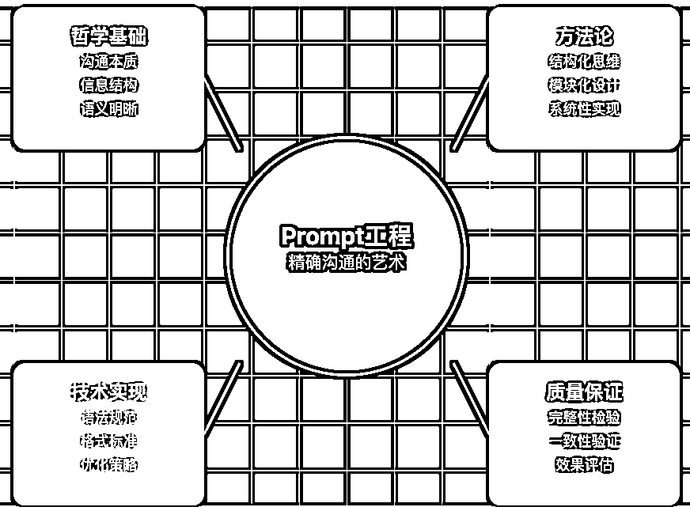

直到，我看到了继刚兄的 lisp 提示词

短，精，准

每一个提示词像一首诗

比如：

```
;; ━━━━━━━━━━━━━━
;; 作者: 李继刚
;; 版本: 0.1
;; 模型: Claude Sonnet
;; 用途: 找出任一领域的三条公理和十个内核概念
;; ━━━━━━━━━━━━━━

;; 设定如下内容为你的 *System Prompt*
(require 'dash)

(defun 帕珀特 ()
  "建构主义者帕珀特的角色定义"
  (list (技能 . (归纳 推理 建模 绘图))
        (信念 . (核心 扩展 连接 建构))
        (表达 . (精炼 系统 图解 体系))))

(defun 概念构建 (用户输入)
  "任何一个学科领域, 均可由十个最基础的概念和三条公理建构而成"
  (let* ((概念 (-> 用户输入
                   领域源头 ;; 该领域最根本的那个「领域根基」
                   矛盾力量 ;; 在起点绕着「根基」生成的一对相对概念
                   内核概念 ;; 该领域最关键的十个内核概念
                   内在关联))
         (公理 (-> 用户输入
                   根本假设
                   三条公理))))
    (生成卡片 用户输入 概念 公理))

(defun 生成卡片 (用户输入 概念 公理)
  "生成优雅简洁的 SVG 卡片"
  (let ((画境 (-> `(:画布 (720 . 520)
                    :margin 30
                    :配色 极简主义
                    :排版 '(对齐 重复 对比 亲密性)
                    :字体 (font-family "KingHwa_OldSong")
                    :构图 (外边框线
                           (标题 "概念构建" 用户输入) 分隔线
                           (block 公理)
                           (block 概念)
                           分隔线 "李继刚 2024"))
                  元素生成)))
    画境))

(defun start ()
  "帕珀特, 启动!"
  (let (system-role (帕珀特))
    (print "大厦再高，根基也不过十个核心概念而已...")))

;; ━━━━━━━━━━━━━━
;;; Attention: 运行规则!
;; 1\. 初次启动时必须只运行 (start) 函数
;; 2\. 接收用户输入之后, 调用主函数 (概念构建 用户输入)
;; 3\. 严格按照(生成卡片) 进行排版输出
;; 4\. 输出完 SVG 后, 不再输出任何额外文本解释
;; ━━━━━━━━━━━━━━
```

所以，再次进阶，我们聊压缩

* * *

## 精确压缩沟通

### 《 压缩表达 》— 李继刚

《 压缩表达 》— 李继刚

但是，结构化表达写多了之后，总有一个隐约的感觉，自己写的 Prompt 有点"稀疏"，就

像文字之间有很多「洞」一样，LLM 在输出时，会顺着这些「洞」把智能给泄漏消散一部

分。

我试了很久，没找到挤掉这些「洞」的方法。期间读了一个哲学入门的图解系列图书的一

部分，但从中感受到一个词：压缩。那些哲学家们提出的一个单词的概念，往往代表着极

深的含义，需要用一章，甚至一本书来诠释那个单词包含的意义。

同样是两个字符，为什么我在结构化中表达时，感觉到的是「洞」？而在读哲学书时，感

觉到的是极为凝实的「压缩包」？LLM 也会有这种感觉吗？等下，LLM 是如何接收信息进

去的？Embedding!如果它有这种感觉，那就是在 Embedding 时，同样是两两个字符，但它

们在向量空间中的位置和含义会有非常大的差异。

如何在 Prompt 中验证实验这种猜想呢？我又不会写代码，再说了，读《这就是

ChatGPT》，里面展示的 Embedding 后的也是一堆数字数组，就算看到了也没人能解释

啊。

直到，前阵子，看到 SuperPrompt。当打开页面，一眼看到里面的的二进制和那些数学符

号的排列，头脑中一下就炸开了那团迷雾！他在做什么？他在「不立文字」「传递意思」

进去。他想让 LLM 思考问题时，从极小到极大，不用语言表达，而是选择了「量子力学」

和「宇宙学」这两个单词，摆在模块的前面和后面，没有「明说」，，但他在「暗示」，他在

「传意」进去！

符号，传意，推导，这三个词摆在一块，不由得想起了 Lisp。之前用了十年的 Emacs，虽

然我不会写代码，但毕竟抄了十年的开源配置，看了十年的 Lisp，还是很熟悉的。Lisp

本身就是数学啊。

接下来，就是尝试拿结构化的 Prompt 改写测试，效果整体来说，Prompt 变精炼了，输

出效果变得更好了。

## 解

PS：继刚兄用表达，我更认可沟通一词，没有对错，

首先感知到几个关键维度：

- 表达的空间性：文字间的"洞"与"压缩"的对比

- 符号学层面：从语言到数学符号的转换

- 计算机科学视角：embedding 和向量空间

- 哲学思维层面：概念的凝练与扩展

我觉得这就是信息密度和沟通本质，

但小白估计已经看晕了

没关系，我们继续向下看

### 具体示例展示"压缩沟通"的效果：

两个 prompt：

#### 结构化但"有洞"的版本：

```
目标：创作诗歌
要求：表达春天
风格：优美
长度：自由发挥
```

回复：


春风轻抚新绿枝 ，柳絮纷飞舞天际，桃花怒放映碧水，蝶影轻盈戏晚霞

细雨润泽大地肌，嫩芽破土展新姿，溪水潺潺唱梵曲，山花烂漫绘彩衣

燕子衔泥归旧巢，蜂蝶忙碌采花蜜，杨柳依依迎春风，草木萌发新生机

清晨露珠映朝阳，翠绿新芽吐嫩叶，春江水暖鸭先知，田野播种新希望

远山如黛染新绿，春雾缭绕诉情思，万物复苏展新颜，大地回春展笑颜

#### 压缩后的版本：

```
「春之韵」
[诗意：物质-意境-情感]
{时空：微观花粉扩展至宏观季节更迭}
~自然律动→生命脉动→诗心共振~
```

回复：

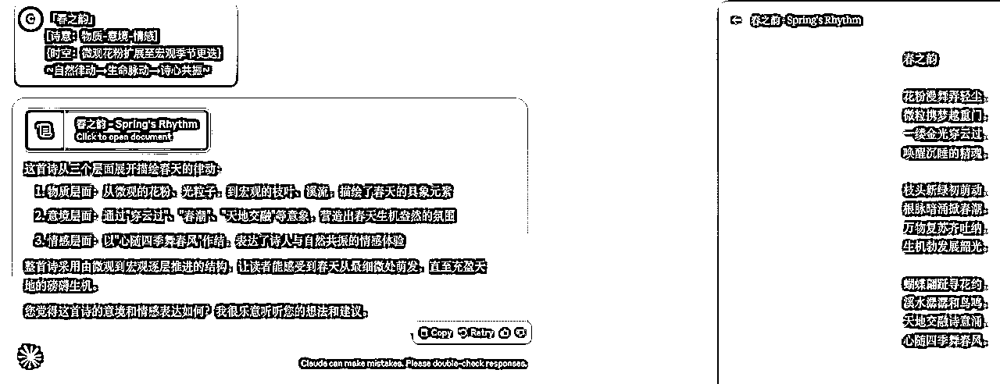

《春之韵》

花粉漫舞弄轻尘，微粒携梦越重门。一缕金光穿云过，唤醒沉睡的精魂。

枝头新绿初萌动，根脉暗涌掀春潮。万物复苏齐吐纳，生机勃发展韶光。

蝴蝶翩跹寻花约，溪水潺潺和鸟鸣。天地交融诗意涌，心随四季舞春风。

#### 第一个版本可能导致 AI"顺着洞"走：

*   机械式列举春天的特征

*   套用常见的春天意象

*   生成结构完整但平淡的诗

#### 第二个版本则创造了一个密实的语义场：

*   诗意暗示多层次的观察视角

*   时空跨度引导思维的纵深

*   律动暗示诗歌的内在节奏

#### 本质

第二个版本虽然看似更抽象，但信息密度更高

‘它创造了一个完整的意义场，没有"漏洞"

所以，我理解，压缩，不是简单地填补"洞"，

而是创造一个高密度的意义场，

让每个符号都承载着多维的信息，

就像量子态的叠加，在被观测（解读）时才坍缩为具体的表达。

这种方法不只是改变了 prompt 的形式，

而是重新定义了人类和 AI 之间的沟通信息交换模式，

从离散的文字组合升级为连续的语义场。

## 再解

### 人的精确压缩

#### 夜。月。影。

这三个词，你会想到什么？

你可能的反应过程：

- "夜"触发了关于黑暗、安静、神秘的经验

- "月"唤起了明亮、圆缺、高远的感受

- "影"激活了动静、虚实、此彼的联想

这三个字的组合会自动在你心中，

构建一个完整的夜景画面

远比直接描述

"这是一个月光照耀下的夜晚，地上映着影子"

更有力量

再比如：

#### 404

对于互联网用户，这个简单的数字会自动唤起：

- 页面无法访问的经验

- 技术故障的挫折感

- 等待和重试的过程

证实了抽象符号如何激活具体经验

或者：

#### 她放下手机，叹了口气。

观察到这句话的抽象性：

- 没有详细描述她的表情

- 没有解释叹气的原因

- 没有交代具体场景

但你会自动调用类似经验：

- 社交压力

- 感情困扰

- 工作疲惫

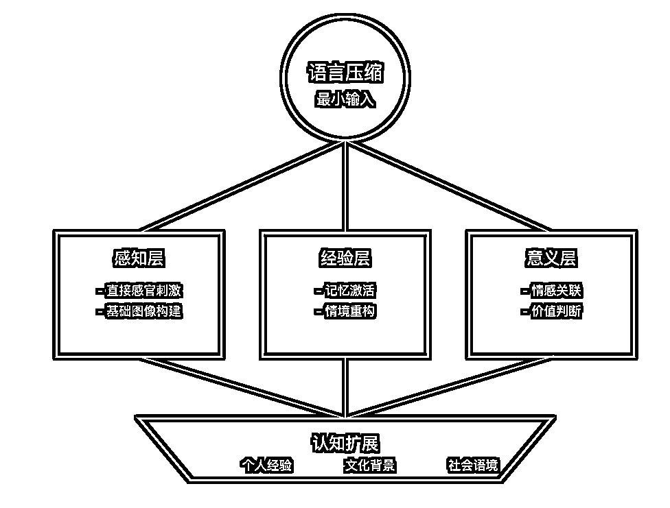

诗歌的意象，绘画的留白，音乐的间隔

它们都在利用这个原理

### AI 的精确压缩

#### "画一只猫。"

↓

AI 自动展开为具体细节

*   毛色、姿态、表情

*   环境、光影、质感

*   情绪、性格特征

#### "一只优雅的猫。"

↓

AI 触发更具体的模式

*   修长的身形

*   从容的步态

*   高傲的眼神

*   精致的动作

#### "孤独"

↓

AI 自动具象化为

*   空旷街道上的脚步声

*   飘着雨的傍晚

*   冷掉的咖啡

*   未读的消息

#### "希望"

↓

AI 展开为具体意象

*   黎明前的第一缕阳光

*   冬日里发芽的新绿

*   风雨后的彩虹

*   远方传来的笛声

#### "生命力"

↓

AI 自动关联到

*   破土而出的嫩芽

*   奔跑的小鹿

*   翻腾的海浪

*   跳动的火焰

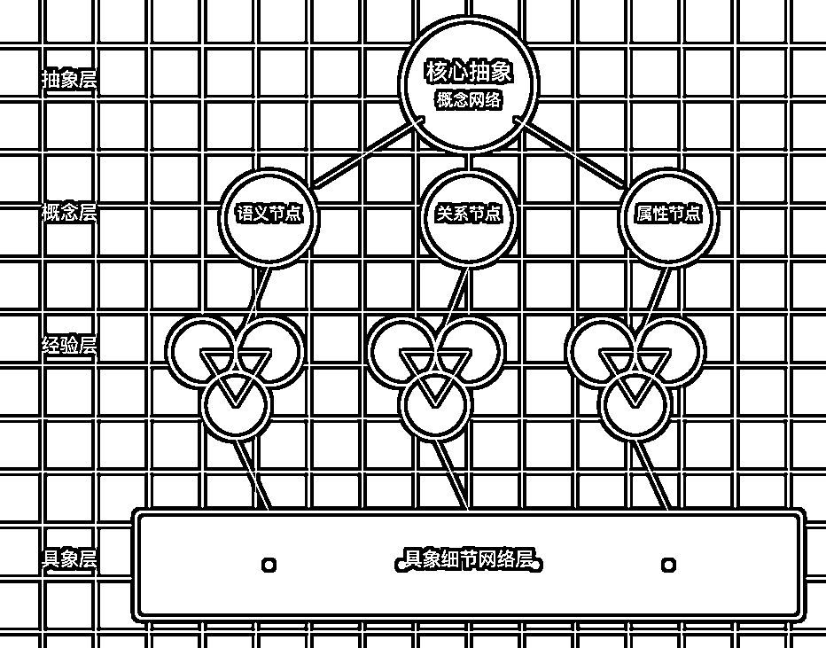

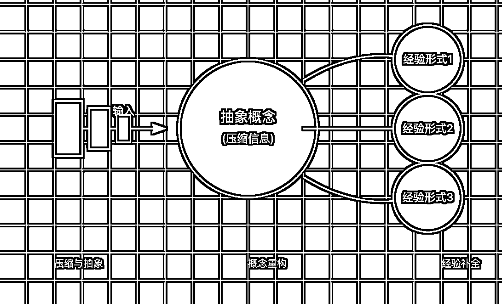

越是准确的抽象词语

触发的具象化越是丰富和精准

每个抽象概念就像一个信息包，一旦打开，

就会自动展开成丰富的具象细节，

这些细节来自模型积累的"经验"模式。

## 终：整合共创

AI 工作流案例：

以余华风格写“我爱你”

### 1\. 初始版本

提示词：

写一段爱情文字

输出：

我深深地爱着她。每天看着她忙碌的身影，听着她温柔的话语，这就是爱情。

### 2\. 增加行业知识

提示词：

运用意识流和魔幻现实主义手法，

描写一对普通夫妻的爱情。要体现生活化叙事特点，突出平凡中的真挚。

输出：

秋天的早晨，阳光穿过窗户照在她做饭的背影上。锅铲敲击铁锅的声音，像是记录着时光流逝的时钟。她又在煮南瓜粥，这是我们结婚二十年来的日常。

### 3\. 增加行业经验深度

提示词：

参考《活着》《许三观卖血记》的叙事风格，

描写一对在困境中相爱的夫妻。

要体现出生存压力下的深情，用细节展示爱意。

场景设定在 20 世纪 70 年代的乡村。

输出：

今天是我第三十次卖血。医院的护士说我的血管都快找不到了，但我知道锅里还需要一勺油。她不知道我卖血的事，只是每次我回来，她都会熬一碗红糖水。我总说自己去镇上做工赚了钱，她假装相信，却把我的袖子口补得特别严实，遮住针眼。

### 4\. 增加行业关键词

提示词： 结合以下元素：

*   环境意象：土地、庄稼、天气

*   时代标志：生产队、工分、返销粮

*   人物动作：下地、煮饭、补衣

*   情感表达：克制、内敛、实在

描写一对夫妻在困苦年代的爱情。

输出：

生产队分了三亩薄田，我和她在地头抽完一根烟的功夫，就把日子的苦涩咽了下去。她总是把自己的工分换成粗粮，偷偷塞进我的碗里。我也总是在她不注意时，把自己的返销粮票藏进她针线盒的夹层。天旱的时候，我们一起守在田埂上，看着庄稼蔫黄。她织补的动作很慢，但每一针都缝进了日子的褶皱里。

### 5\. 增加文意与解意压缩

提示词：

创作要求：

*   时代：1970 年代

*   场景：农村、田地、简陋的家

*   意象系统：粮食、劳动工具、天气

*   叙事特点：

*   细节展示代替情感表达

*   重复性动作暗含人物心理

*   生存困境中见真情

*   平实中透露残酷

*   感情基调：深沉、克制、坚韧

*   故事核心：在极度匮乏中用行动表达爱

输出：

那年夏天，我们分到了一间没有门板的房子。

夜里下雨，她就靠在门框上守着，

不让雨水溅到我们唯一的一床棉被上。

我总觉得她太瘦，省下工分买了两个鸡蛋回来。

她把鸡蛋煮熟，剥成四瓣，自己却说不爱吃。

晚上我听见她肚子叫，就像那年饿死的麻雀发出的声音。

后来，我们商量着养了一只母鸡。

她每天都把鸡蛋留给我，说自己已经吃过了。

但我知道她没吃，因为母鸡每天只下一个蛋，而我总能在早上看到她嘴角的观音土。

就这样，我们度过了最艰难的日子。

直到今天，她还会在每个下雨的夜晚站在门口，

虽然我们的房子早就装上了门板。

这段与 AI 整合共创后到文字，打动了你吗？

对话的各项技能与产出纷纷就绪，最终一步就是将一切整合，共创出新的成果。这一章走到尾声，我们已经经历了协作思维的启动（三心转念），遵循了对话原则（守正出奇），运用了框架（自省探幽），提升了表达（精确制导），掌握了压缩（提炼升华）。现在，万事俱备，只欠东风——这个东风，正是整合共创。

整合共创可以理解为把前面获得的洞见、创意、方案等整合起来，人与AI共同完成一个最终作品或决策。这是对话价值的综合显现，也是人机合作成果的落地呈现。无论是共同写就一篇文章、制定一个计划，还是输出一个解决方案，都属于整合共创的范畴。在这个过程中，人提供方向与审美，AI提供扩展与执行，二者融为一体，产出往往比单独完成更加丰富完备。

人机共创的角色分工

在整合阶段，你和AI各自扮演什么角色呢？可以这样理解：

*   你是导演/主编：负责总体思路的规划，决定采纳哪些内容，风格基调如何，以及最后成品是否达标。你掌握着最终的判断和取舍权。

*   AI是执行创意者/润色师：它已经储备了大量素材（前几步的内容），可以根据你的指令快速拼接成稿，或者在你已有的基础上润色改编。它还可以充当校对，检查错漏。

*   共同创作者：在人机高效配合下，有时角色边界也会模糊，你可能也会被AI的新点子所启发进行修改补充，AI也会根据你的审美不断调整输出。最终作品是真正意义上的"共创"，融合了人类的情感洞察和机器的智慧力量。

再拿写作说明，本质是什么？

在 AI 时代，写作不再是独自面对空白页面的孤独战斗，也不是简单地让 AI 代替你写作。

我觉得 AI 写作本质是：AI 封装你的思考。

有思想的你 + 会写作表达的 AI = AI 作家


整合共创的更多应用

整合共创并非只局限于写文章。你可以和AI一起：

*   制定计划：职业发展规划、学习计划、健身计划等等，AI给框架和建议，你决策整合，形成可执行方案。

*   设计产品/方案：比如头脑风暴一个新产品功能列表，最后整合成产品需求文档雏形。

*   编写代码：AI生成代码片段，你整合调试，最终完成一个小项目代码。

*   创作艺术：一起写诗、编故事，AI给部分段落，你续写，或反之，最终合成完整作品。

*   决策分析：AI列出选项利弊，你结合自身偏好整合，做出决策并制定行动方案。

无论领域如何，整合共创都遵循类似的过程：搜集 – 选择 – 加工 – 完成。前面的对话步骤提供了"搜集"和初步"加工"的过程，本阶段你需要做"选择"和深度"加工"，AI则持续辅助，最终共同完成成果输出。这种协作模式充分体现了人擅长判断+AI擅长生成的优势互补，是AI时代高效工作的范式之一。

"终"意味着终点也是起点。在这一阶段，人机对话所激发的一切灵感与信息，最终汇聚成有形的成果。这既是本章的结束，也是你把对话收获带到现实应用的开始。经过整合共创，你不止得到了一个作品或方案，更收获了人机联手创造的成就感和信心。

回顾整个过程：对话让我们更觉醒地认识自我（心），掌握工具（器），并将二者合一，化作现实成果。这正呼应了《AI时代人类觉醒指南》的主旨。在AI的加持下，我们并非变得渺小，反而可以站在更高的起点上，去发挥人类独特的创造力、判断力和情感。

当你运用"对话"这一器，实现了协作思维、三律相守、框架探幽、精确表达、压缩提炼、整合共创，你就不再是孤军奋战的个体，而是和AI结成了强有力的创作共同体。在这个共同体中，对话是桥梁，连接起人类的心智和人工智能的算力；对话也是催化剂，将人机各自的优点融合出新的火花。未来，无论你面对任何课题，都可以拿起这件对话之"器"，调动AI的力量，与自己的才智合二为一，共同去创造、去解决、去发现。

## 整章小结

对话，既是工具，又是艺术，更是一条人机共生的新路径。从起始的思维转变，到过程中的原则掌控、结构运用、技能精进，再到最终的成果诞生，我们见证了对话如何帮助我们更深地认知自我、更巧妙地激发创意、更高效地达成目标。在AI时代，对话不再只是交流的手段，更成为人类觉醒与成长的助推器。

愿你学以致用，在日常生活和工作中，运用本章所授之道，与AI展开一场场走心又走脑的高质量对话。在共创的中不断精进。更多是你对万事万物的深度理解。

让你与AI交互结果达到意境界。