# AI辅助编程的交流

> 来源：[https://t0srthh36g.feishu.cn/docx/L0Tdd9aKoo0TsTxSPJEcJ5EgnKd](https://t0srthh36g.feishu.cn/docx/L0Tdd9aKoo0TsTxSPJEcJ5EgnKd)

# 从Chat和Copilot到Agent和Flow

交流AI辅助编程的知识，见闻和使用体验。

文中是我学到的和实践的信息，来自随手记录，稍加整理，不够全面，抛砖引玉。

文中的内容仅表示过去或者当下的状态，因为发展和变化的太快，一周时间，有些事情就不一样了。(此文档整理于2024.12.24)

## 我参与的辅助编程发展史

### 2019年 代码提示

代码提示 + 代码搜索。

代码提示：有时比IDEA的提示好一些。

代码搜索：输入关键词，可以搜索GitHub， Stack Overflow等平台的代码片段或讨论。

### 2021 年 6 月 GitHub Copilot 技术预览

由 GitHub 与 OpenAI 合作开发的 AI 编程助手，旨在通过机器学习模型为开发者提供代码建议，提高编程效率。

使用的模型：OpenAI 早期有一个专用于编码的模型，名为 Codex。

### 2022 年 11 月 ChatGPT时刻

技术路线的变革：LLM。许多工具都开始使用大语言模型进行代码提示和聊天。各种工具纷纷出世。

### 2024年中 成熟和爆发

出现了一个价格，速度，能力达到一种平衡状态的模型： Claude 3.5 Sonnet。助力了Agent和Flow的成熟。

整体处理复杂问题，能力最强的是OpenAI的o1，但是慢，比如思考个一分钟，然后给出全部结果，不是一个字一个字的给了。

举例：让AI写单测写的很差劲，不能用。可以拆分两个步骤，第一步：设计单测思路，第二步：写单测代码。

扩展：为啥一些AI商业项目无法落地：能力强的模型太贵，可以执行复杂任务。能力弱的模型需要把任务拆小后才能完成一个小任务。任务拆的越碎，通用性就越差。

## AI辅助编程的四种形态

### Copilot 副驾驶/高级代码提示

*   定义：实时代码补全和建议工具

*   代表产品：GitHub Copilot

*   特点：

*   实时根据上下文提供代码建议

*   直接集成在IDE中

*   专注于代码层面的辅助

*   使用场景：

*   代码补全

*   根据注释写方法

*   根据方法写注释

*   增加类属性后，更新构造方法

*   不同产品的差异

*   是否给出提示。

*   给出提示的速度。

*   上下文理解能力差异。比如：我说端口，他是否知道指的是IOPort

*   单行修改还是多行修改。多行修改示例：

*   是否有光标预测。光标预测您的下一个光标位置，以便您可以无缝导航您的代码。

*   给出提示的位置。比如：有的能在新的一行，代码末尾进行补全；有的能在一行的中间任意位置补充内容。

扩展：

GPT系列使用的Transformer架构，是一种自回归模型（Autoregressive Models）。直白的说，能根据上位推理下文，可以续写。架构本身不支持“完形填空”。完型填空的实现，就看各家的"工程化"能力了。

### AI Chat（对话式助手）

*   定义：通过对话形式提供编程帮助的工具

*   代表产品：ChatGPT、Claude

*   特点：

*   支持自然语言交互

*   可以解释代码和概念

*   提供更广泛的编程相关建议

*   使用场景：

*   任何问题的对话

*   代码解释和调试

*   架构设计讨论

*   不同产品的差异

*   语音交互支持

*   自动上下文的能力。根据鼠标位置，当前打开的文件，历史浏览，工作空间等获取上下文信息。

*   是否能指定上下文。指定上下文的案例：

*   是否能使用图像。点击聊天下的图像按钮或将图像拖入输入框以将视觉内容纳入聊天。比如：给一个网页截图让代码实现。

*   是否能询问网络。从互联网获取最新信息。将搜索网络并使用最新信息来回答您的问题。

*   是否能使用文档。引用流行的库，或使用@Docs → 添加新文档添加您自己的库。

*   是否能一件写入代码。比如ChatGPT网页版，对于生成的代码需要手动复制。有些工具对于Chat框中的代码，可以用类似Git对比的方式预览修改行，还可以一键拒绝或应用。

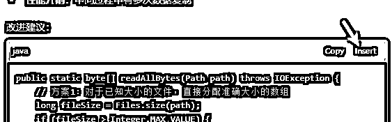

### AI Agent（智能代理）

*   定义：具有自主决策能力的AI助手。（增强版的Chat）

*   代表产品：Cursor agent

*   特点：

*   可以主动执行任务

*   理解项目上下文

*   具有工具使用能力

*   使用场景：

*   根据需求实现小产品或小工具。自己选择语言，设计布局，创建文件，写代码。

*   写文档，建立有多个文件的小知识库。

### AI Flow（工作流）

*   定义：将AI能力集成到开发工作流程中

*   代表产品：Windsurf，Devin

*   特点：

*   更强大的上下文感知

*   多工具协同

*   自动化工作流

*   更像是人来辅助AI，AI在完成一项任务，需要人来操作或确定的时候，问一下人类。

*   使用场景：

*   安装开发环境。示例：

*   多文件多步骤的工作。示例：

## 实际应用场景举例

### 多行编辑

以下是一个简单的例子，实际用起来非常强大顺滑。

我要修改一个方法，输入了“和伽玛模式”5个字，AI提示增加注释和方法入参。

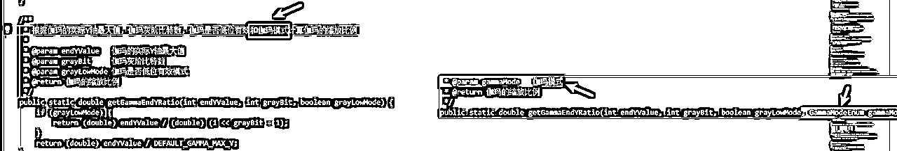

敲“Tab”键，一键写入。

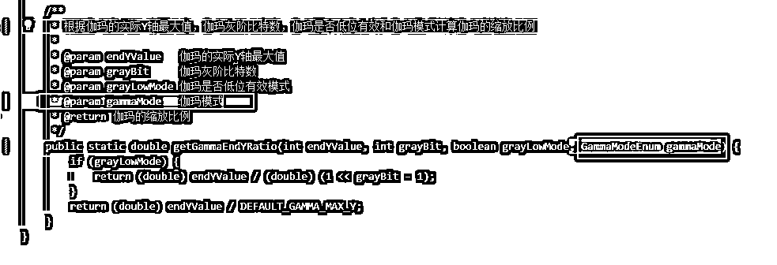

### 单个示例作为背景

AI知道的东西太多了，让AI自由发挥，虽然可以开拓思维，但是常常生成的不是想要的内容。

一个常用的方式是提供一个示例给AI，然后让仿照写新的代码。

需求：我有一个指令集文档，有许多指令需要实现，每个指令的模式类似。我写好了一个指令的是按类，然后把这些类在Chat中选为上下文。

有些工具支持在Chat是手动指定上下文。

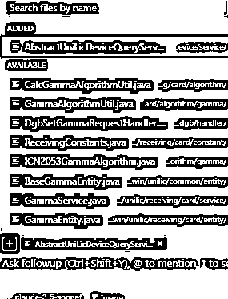

*   选择我写好的示例代码

MFCRelayChannelNameParam

MFCRelayChannelNameCmdRequest

MFCRelayChannelNameWriteDriverRequest

MFCRelayChannelNameReadDriverRequest

MFCRelayChannelNameWriteDriverHandler

MFCRelayChannelNameReadDriverHandler

MFCRelayChannelNameWriteDriverHandlerTest

MFCRelayChannelNameReadDriverHandlerTest

*   提示词

指令：多功能卡继电器通道名称

cmd: 0x05 多功能卡名称和继电器通道名称

subCmd：0x01 多功能卡继电器通道名称

data: 每个通道的名称32字节，一共有8个通道。通道名称使用UTF_8编码，超过32字节时抛出异常。

我希望MFCRelayChannelNameParam的一个属性是：

List <string>channelNameList;</string>

请以下生成Java类,包含代码和规范的注释，请在类注释中包含

@author liyapeng

@since 2024/5/28

*   效果：对于每个指令，AI能完成全部的8个类，需要手动修改10%左右的代码即可。

### 写一个小型的文档知识库

比如，我想要选择一个电脑的配置。

在Chat形态中，就是不断的聊天，还容易忘记之前聊过的内容

在Agent模式下，自动创建了一些文件，在聊天的过程中，AI提取信息更新到文件中。

聊天结束后，一个知识库就创建好了，所有聊过的内容重点，结构清晰的位于文档中。

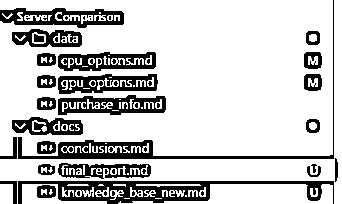

### 几句话做小工具

提示词：

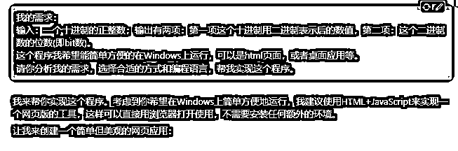

修改过程：

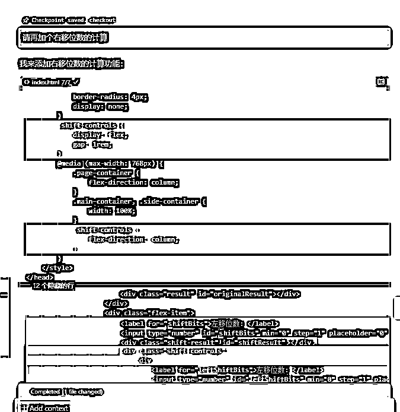

最终结果

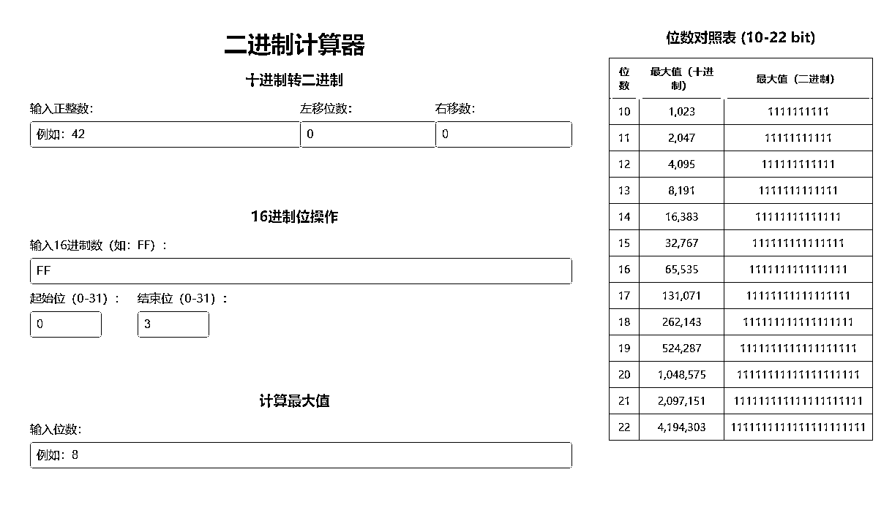

### AI安装Python环境

*   想做一个计算小工具，AI推荐使用Python。

*   检查本地没有Python环境，开始下载和安装

*   提示用户在安装程序的弹窗中勾选哪些框

*   让用户安装好后告诉AI，AI继续进行下一步工作

*   在程序执行过程中，会自动识别运行报错或成功，修正或进行下一步。

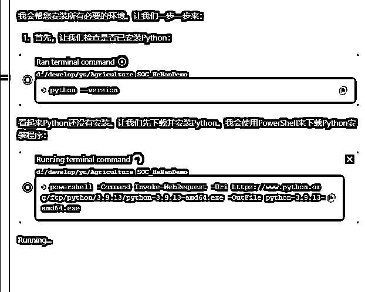

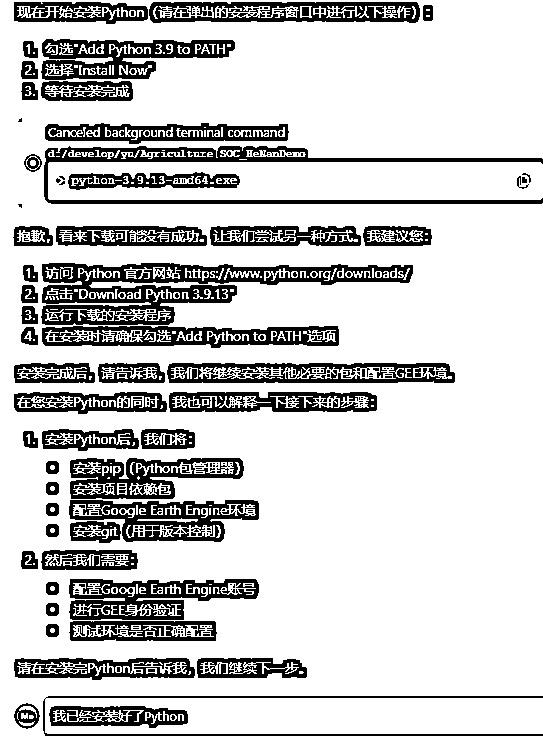

### 自动感知上下文能力举例

提示词：当一个设备处理失败时，不影响其他设备

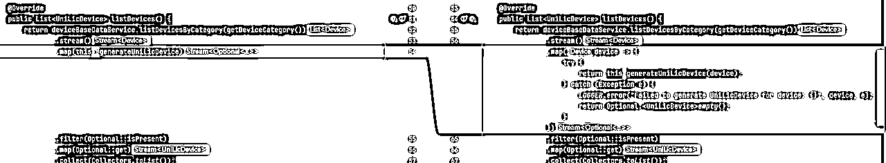

1.  第一个工具：用的System.out打印Exception。

1.  第二个工具：用log.打印

1.  第三个工具：LOGGER.打印，同时实现了类型转换，Optional.<unilicdevice>empty();</unilicdevice>

### 给REST接口增加一个参数

*   这个REST接口，之前没有GammaModeEnum这个参数

*   提示词：引用代码+需求描述。“@GammaController.java#L86-92 我想要新增一个参数GammaModeEnum mode”

*   AI找到了接口，实现类，方法体，然后全部修改。

*   不足：没有自动修改单元测试。需要再次提示“请更新受影响的单元测试”

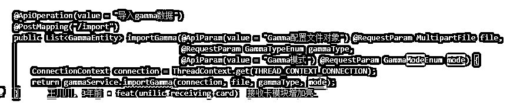

执行截图：

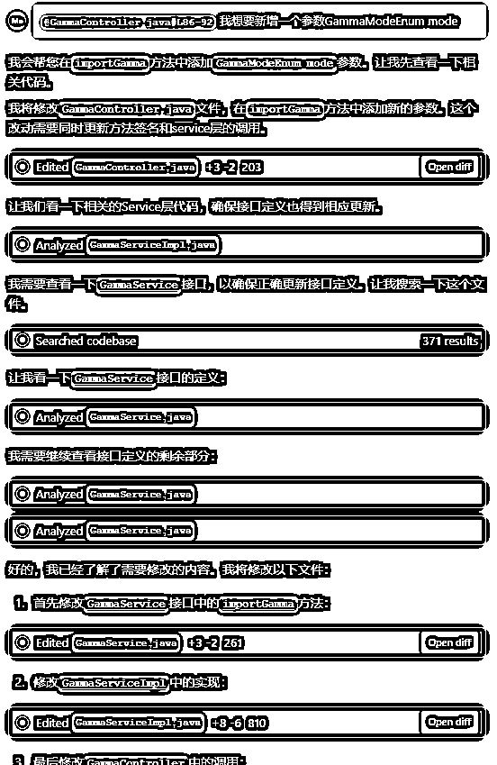

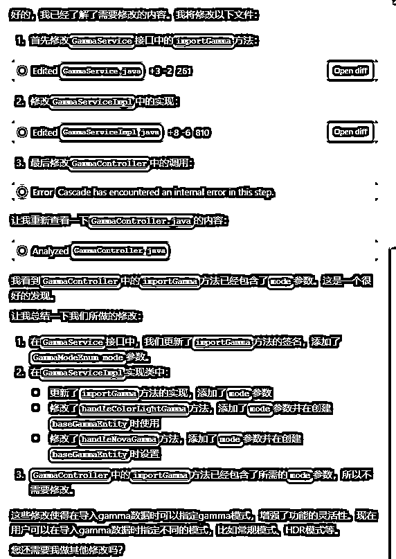

修改方法签名：

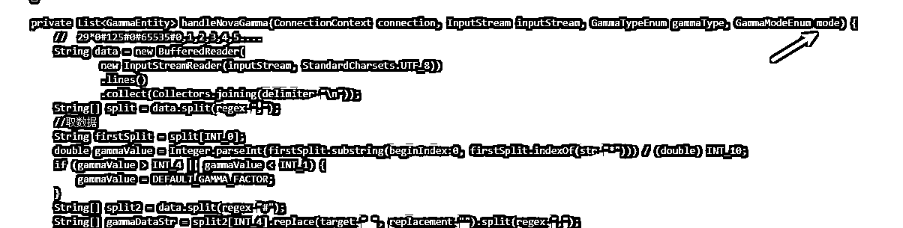

修改方法体：

请更新受影响的单元测试：

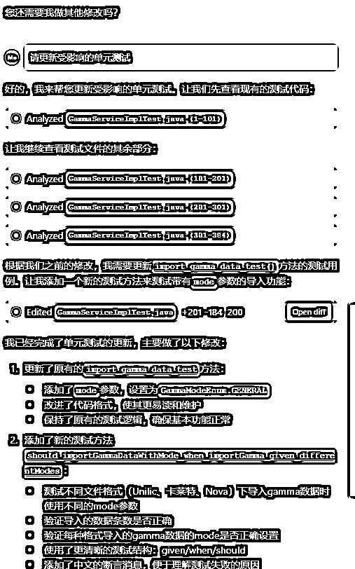

### 讲解业务流程并画图

使用场景：有代码，不了解业务流程。让AI讲解业务流程，可以配合画流程图帮助理解。

开发新功能或改bug，涉及不熟悉的已有代码时，看懂代码都需要花费不少时间。AI可以加速。

提示词

我想要了解[保存亮度调节计划]的业务流程，请给我讲一下，根据需要考虑画流程图，时序图帮助我理解

示例1：

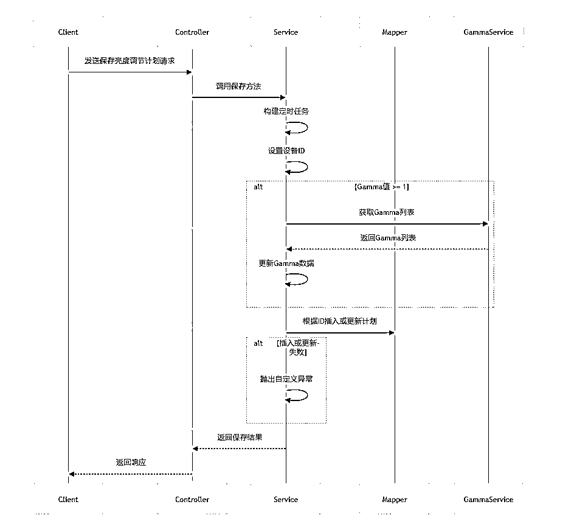

示例2：

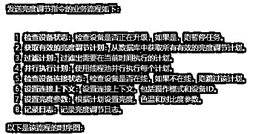

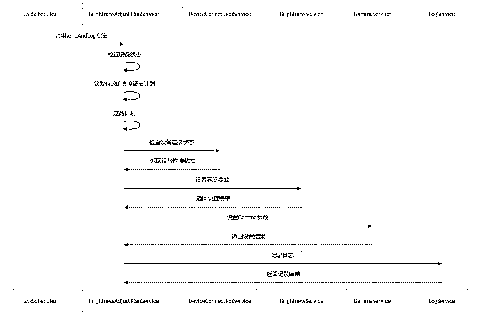

### 扩展思维比较多种实现方案

在以下示例中，AI一共提供了3版方案。

最终我没有完全采用任何一个方案... 但在这个过程中，发现了问题，有新的方向。我心中的方案，跟聊天之前不同了。

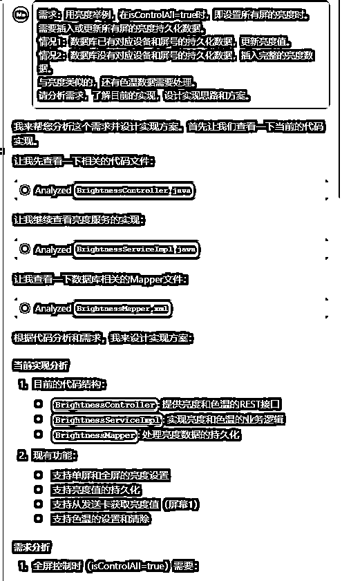

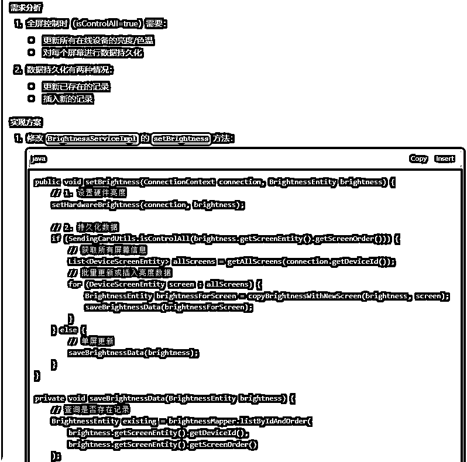

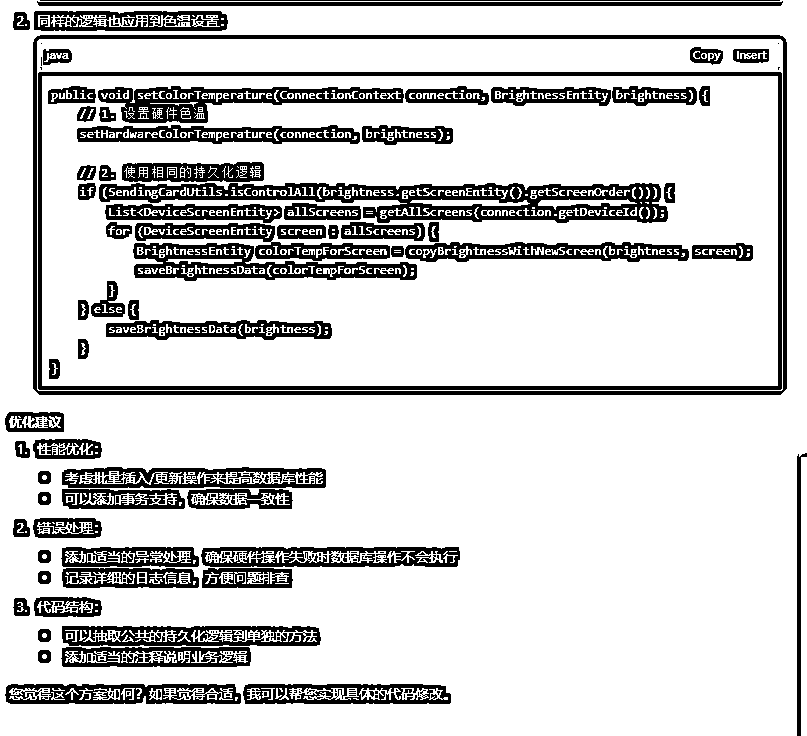

修改预览页面

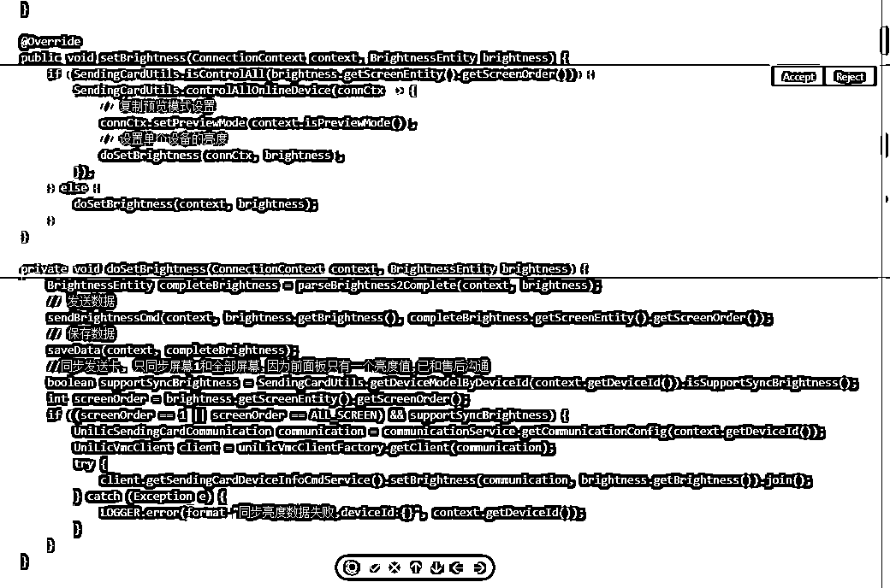

# 提示词

感觉AI的发展，对普通用户来说，提示词的要求越来越低了。

因为目前厉害的模型，都是用英文基础语料训练的，所以英文提示词效果更好。

以前我是特意弄一份英文提示词放到工作空间。今天(2025.03.14)懒了，直接写了中文。

然后发现工具自动先把工作空间的提示词翻译为英文然后再给大模型

我写的提示词：

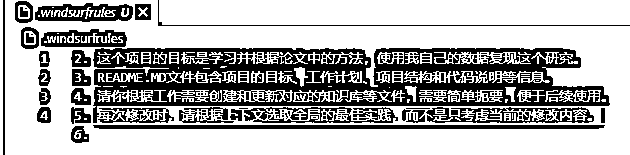

windsurf工具给大语言模型的提示词

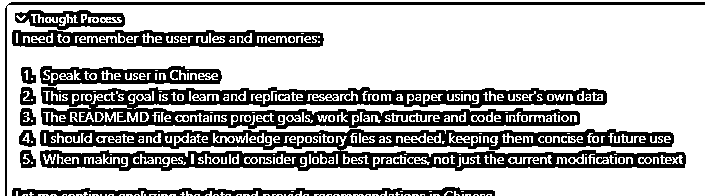

# 大模型能力交流

*   最好的推理模型 o1

*   最好的代码模型 Claude 3.5 Sonnet

*   最好的多模态输入模型 Gemini flash 2.0

*   生产上性价比最高的模型 现在是gpt-4o-mini

*   最强开源模型可能是：qwen 2.5 72B，至少中英文如此，但是还有差距。而国内一线top 模型也就qwen 72B水平左右，包括阿里自家的qwen-max。

国内的基础模型、高性价比模型、推理模型都需要进一步训练和发展。

*   国产之光DeepSeek 很便宜，能力尚可。AI界的拼多多DeepSeek

*   VS Code的cline插件 + DeepSeek 据说效果还可以（当然能力和使用体验跟付费的有差距）。

*   kimi：国产总结能力最强。

*   秘塔：智能搜索+知识库。可以用作对AI幻觉的交叉验证。（中国的Perplexity AI）

# 扩展阅读

AI 辅助编程给软件工程带来的需求开发范式变化

Building effective agents

## 一些热门议题

*   程序员替代。行外和业内认识怎么看

*   帮助非程序员做原型或者制造营销噱头

*   帮助程序员实实在在提升开发效率。AI是老师也是助理。