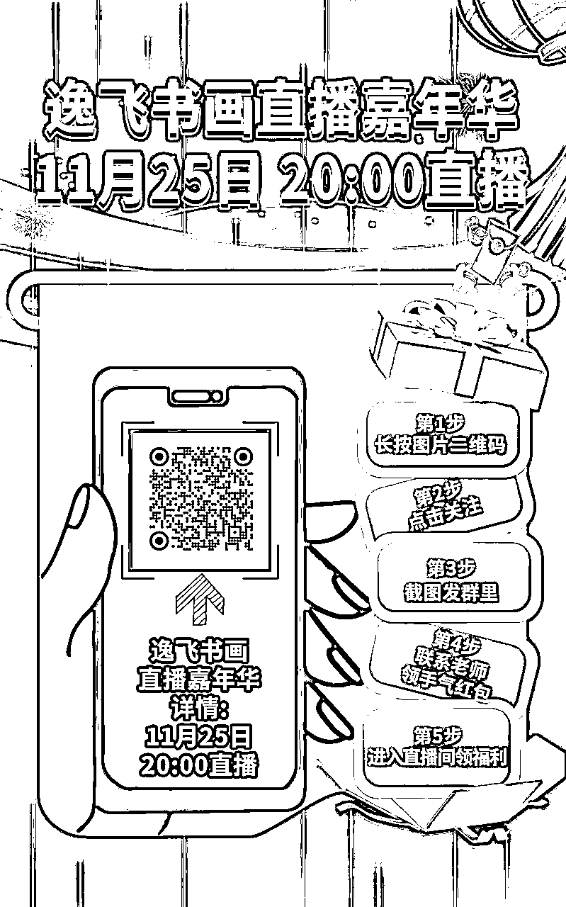
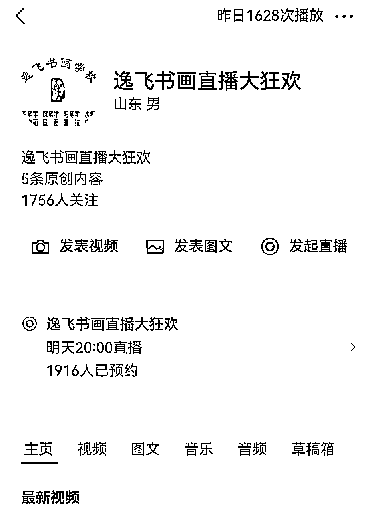
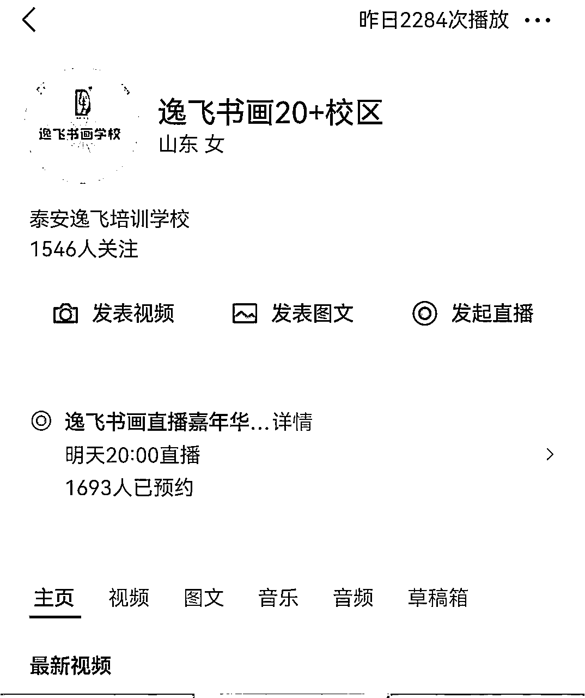
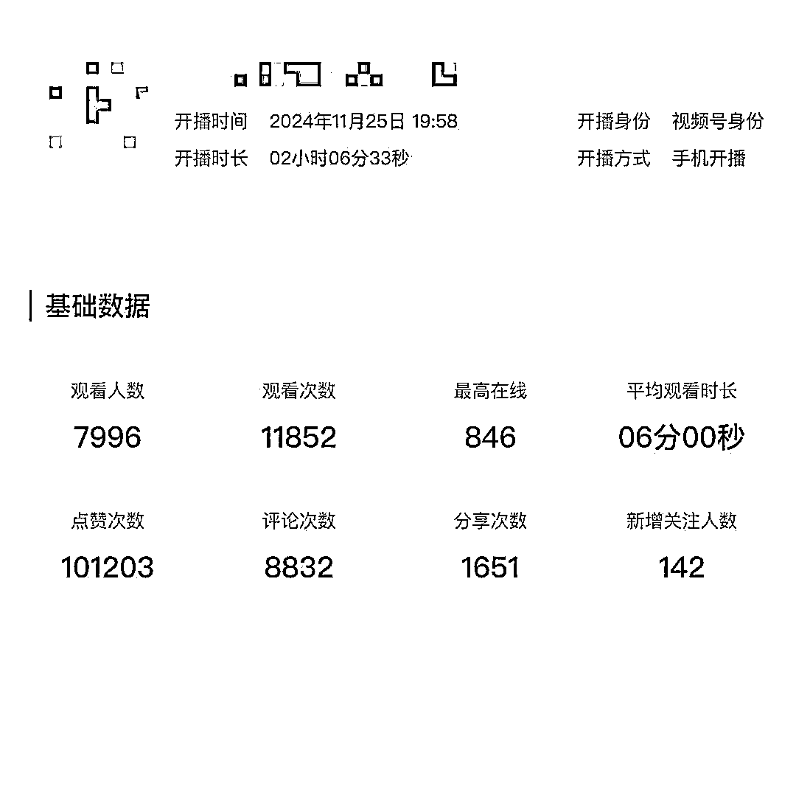
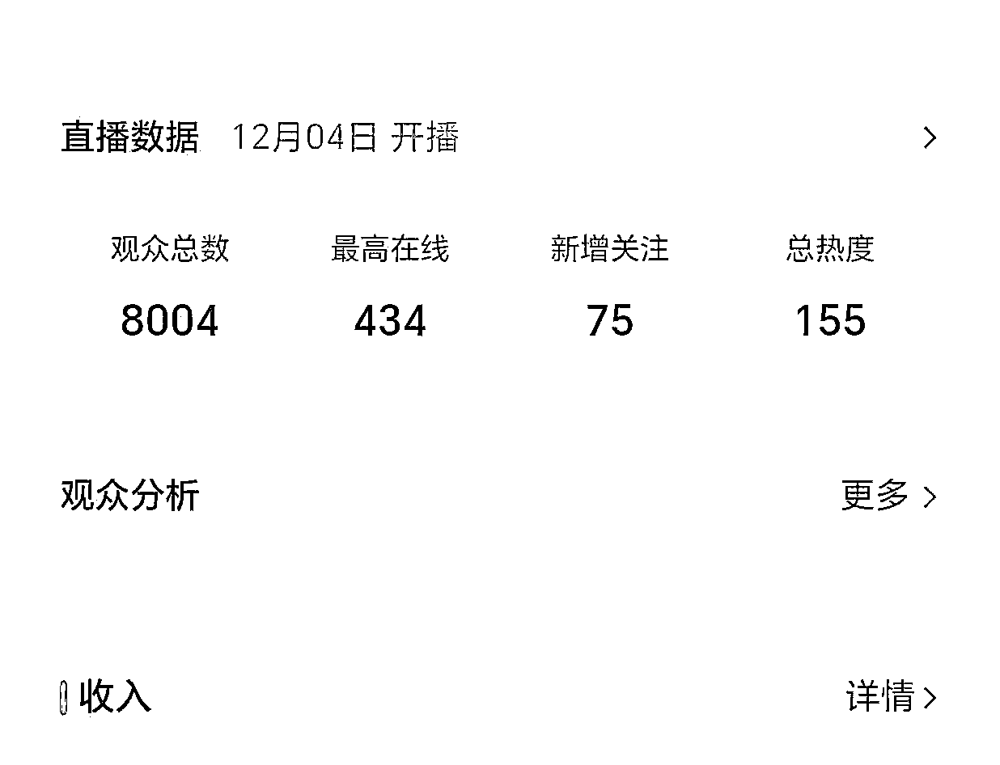
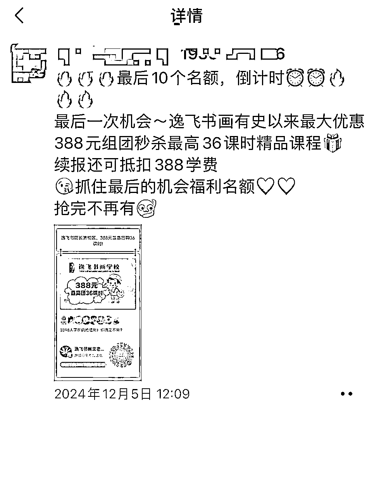
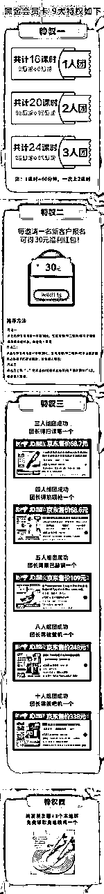
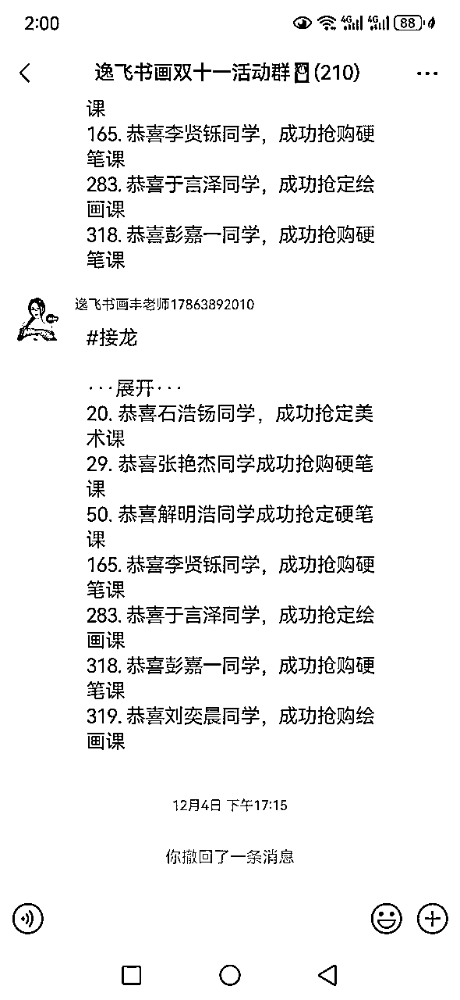

# 3场直播赚了200万，同城实体10倍增长在视频号

> 来源：[https://aso41gpxhm.feishu.cn/docx/EVgHdDvFToEkAFxb41lcYbSrnyb](https://aso41gpxhm.feishu.cn/docx/EVgHdDvFToEkAFxb41lcYbSrnyb)

最近给一个区域实体连锁品牌，分别给他三个片区的实体店，做了三场视频号的直播，通过ai进行提效

第一场直播在第一个小时，稳定1000人左右同时在线，

第二场直播在第一个小时，稳定700人左右同时在线，

第三场直播在第一个小时，稳定700人左右同时在线，

给我们合作的客户带来了2000多个小课包用户，到店转化第一波给客户带来200万多万gmv，

我们赚引流费的营收是30多万，

这一波逻辑真正打通了同城实体赋能，直播➕ai➕私域精细裂变➕一对一转高客单=真正有利润，

我们这个客户是区域头部的少儿书画培训机构，在单一城市开店的密度较高，

区域引爆，多渠道多次裂变，

1、 区域引爆，完成第一次轮裂变，社群裂变；

2、视频号引爆，通过视频号预约；

3、直播引爆，通过直播转发，完成第二轮裂变；

4、私域引爆，在朋友圈、社群、好友裂变，完成第三轮裂变；

5、进店引爆，通过深度1对1面聊，完成低转高；

## 1、区域引爆，完成第一波裂变，社群裂变

对于一场营销活动的成功，就是需要在区域内有密度的，对产品有认知的曝光，

因此：需要做两个动作，造势、城市流量主阵地的曝光

造势：在直播前10天，这个区域实体连锁的所有员工开始进行朋友圈、短视频预告，

记忆点就两个，

一个是11.18日晚8点直播，

一个是建校以来最大的双十一活动

在这个品牌的私域用户群，形成一定的直播认知；

第一波裂变社群裂变，社群裂变分为两个环节，一个是原始社群创建、一个是社群的裂变，

原始社群创建1：同城微信群

一个城市的流量主阵地分为两个，一个是抖音、一个微信，那么一个城市私域流量主阵地是在就是在同城微信群，

一个城市打开率最高的是业主群、村居群、商家群，

我们在活动开始的时候，带着这个门店的员工，进行了一波加群动作，加群方式有两种：线下进入各个社区团购、超市等加他们的福利群，线上员工联系自己的朋友、用户让他们邀请进入各大小区群，

将近100位员工已经进加了几千个同城微信群，在所加的微信群，推送这样的海拔，捞了一波宝妈进群，

一个员工大概建两个群，完成了200多个群的搭建，并且完成了第一波基础群储备，

原始社群创建2:自己私域流量

给这个品牌所有的微信用户，做了一遍私信，邀请他们进群，把老用户拉到群里面，

社群裂变：

上面那个海报，邀请3个人送跳绳，邀请5个人送儿童斜挎包，通过不断的在社群阶段性触达，群内的用户会不断往社群里进行邀请人，

有的粉丝会疑惑，那我成本会不会高，不会，领取的规则就是，加群主之后，登记信息，也就是发给群主手机号、姓名，就可以领取，

进群的不一定加微信，加微信的不一定登记信息，登记信息的不一定到店来领取，

一个礼品4元左右，相当于花了4元，带来了一个进店，还获得了一个比较精准的客户信息，还拉了一部分社群，

通过第一波的社群裂变，进行了一波，用户的储备；

## 2、视频号引爆，通过视频号预约；

直播是最高效的触达方式，我们把所有流量都放在直播间进行第一轮的触达，所以我们进行了一波拉预约的动作，

让用户预约我们的视频号直播间，在直播开始后，预约的推送，比例特别高，

在流量端，我们有了两个用户池，一个品牌方的用户私域、一个是群裂变来的新用户，所以我们在两个渠道拉预约，

品牌用户的私域，全部进行一波私信，预约，预约成功之后，给个几毛钱的红包，

在社群内部，也进行一波预约的拉动，每一个预约之后，会在群里进行一波截图反馈，

预约截图之后，红包直接发到群里，

效果还是很不错的，基本都拉到1500个预约以上，

## 3、直播引爆，直播间售卖引流课， 直播转发完成第二轮裂变；

视频号是成交主战场，我们把所有的流量拉到了直播间，视频号的优势就是社交属性、私域属性特别强，因此

视频号直播间，在本次营销活动两个功能，一个是沉淀更多的意向客户，一个是完成流量的再次裂变，

所以

1、设置了一个100-300元左右的引流课包，整场直播间就卖这一个引流品；

2、不断诱导用户转发直播间到朋友圈；

通过上图可以看出，诱导分享还是比较简单，只要让用户分享朋友圈，几乎都是已分享

有一些粉丝会问，为什么不直接卖在直播间卖高客单，而是卖引流包，原因是这样

1、对于实体的优势就是能给用户面对面，要发挥出自己的竞争优势，所以最高效的方式就是到店升级高客单；

2、对于直播间的客户，分为a类可以直接成交的客户、b犹豫的客户、c类不是客户，引流包解决的是b类客户；

所以我们在直播间只卖一个品，100-300元的引流品，三场直播价格都不太一样

在直播间我们做了这几个动作来拉流量

1、每隔5分钟做一波抽奖；

2、创始人、校长在直播现场，摇旗呐喊；

3、因为是书画机构，现场作画；

但是的成交都是在私域的小程序进行的，没有在直播间，因为我们还要进行一轮新裂变

通过数据可以看出，无论停留时间、互动数、都是比较高的，

发布活动之后，刚上来，就卖爆了，三场直播，在直播间，差不多累计就卖了1000多个小课包，也就是直播期间大概带来15万gmv左右的小课包销量，

## 4、私域引爆，在朋友圈、社群、好友裂变，完成第三轮裂变；

我们是落实在小程序进行成交，用户买了之后，我们的老师定向私信他们再进行拉人，让购买的用户在朋友圈、社群、个人好友进行再一次的裂变，

所以我们设计了4个裂变机制

1、课程拼团，2人成团、3人成团课次更高；

2、邀请红包，每邀请一个人进行30元红包返现；

3、礼品拼团，每拉一个人

4、转发扩散，只要转发朋友圈+本地群就可以获得跳绳；

这个小程序在私域的各个端进行了持续的曝光，再卖一波引流课包

## 5、进店引爆，通过深度1对1面聊，完成低转高；

通过三轮的裂变，三场直播已经卖了2000多个引流课包，正常我们搭建的转化次数有三轮，

1、无体验测评转化，给小朋友做一个测评表，通过测评找到孩子的问题，通过解决问题做一波转化；

2、3、4次对比转化，也就是上完3-4节课，根据当时做的测评看一下，看一下进步，通过进步做一波转化；

3、结课后转化，做一个成果汇报展，在进行一波转化，

对于线下的低转高，也是讲究人、货、场

人-拉停留，

对于线下的成交，本质上就是跟客户沟通的时间越长，成交几率越大，

货-做稀缺

稀缺才能产生价值，货就是我们的课程，我们设置了一个阶梯价格，也就是说1-50名一个价格、50-100名一个价格，100-200个价格，先购买先选礼品，通过这样的逻辑创造出稀缺性，

场-做气氛

我们搭建了一个节日的气氛，现场报名拉礼炮，通过气氛来营造价格的优势，

我们只辅助了第一波转化，整体转化大概有一个200多万，最后三轮转化完，估计有一个300万问题不大，

这是第一场直播的低转高，高客单已经转到300多个了

这是其中一个片区的恭喜视频

分割线··················

实体内卷的今天，ai+社交直播，将是大的破局点，