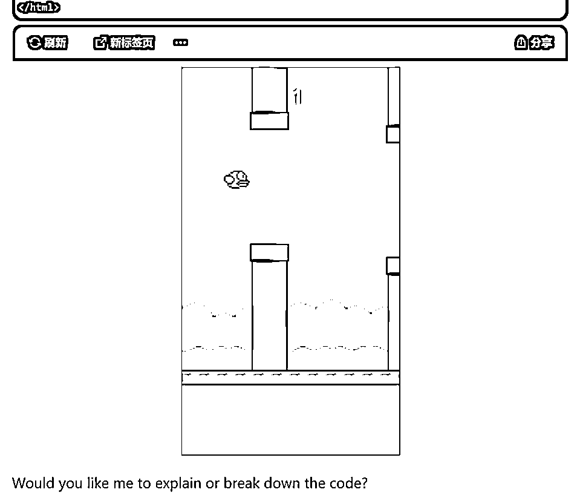
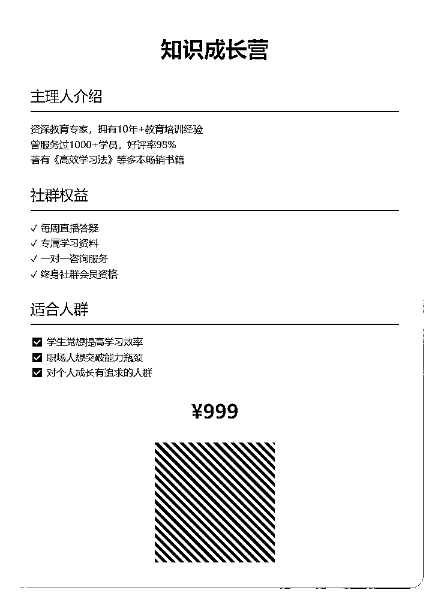
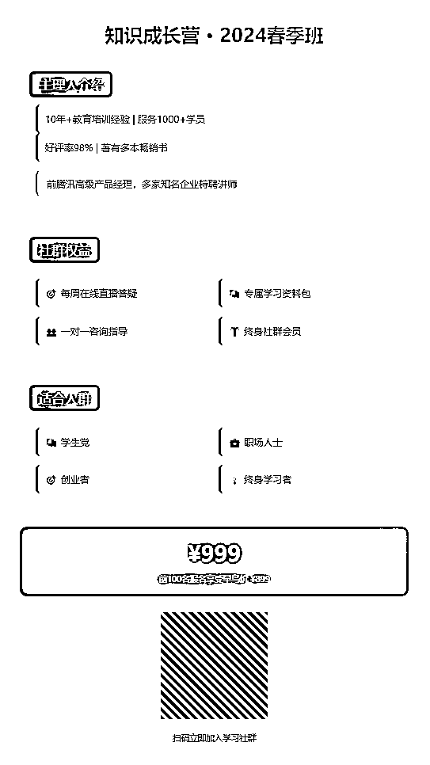
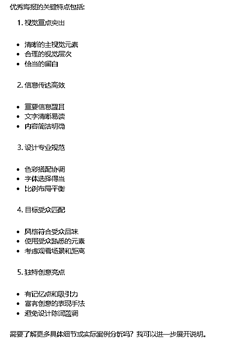
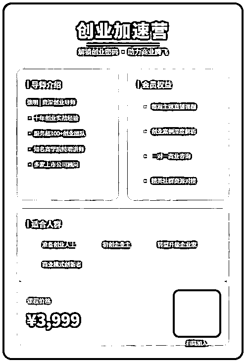
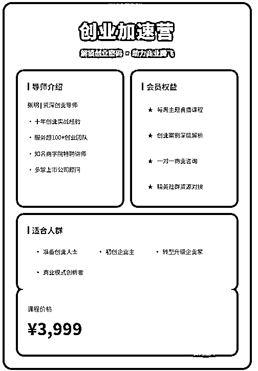
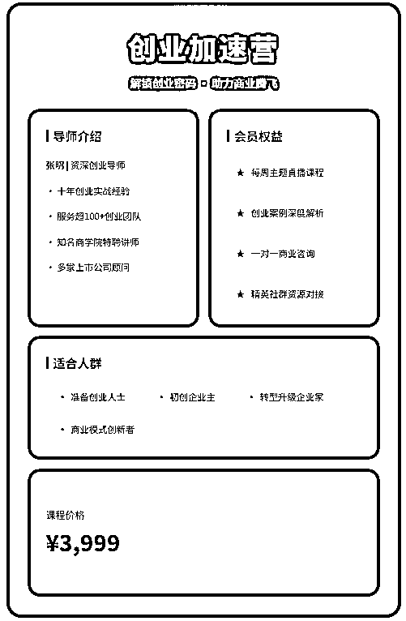
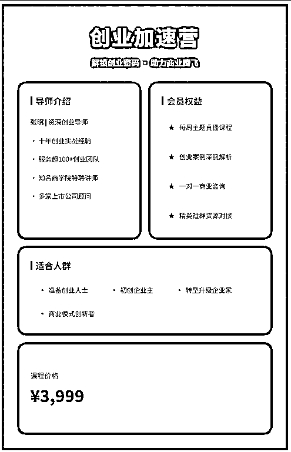
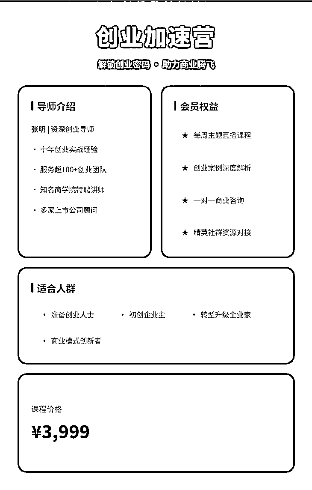
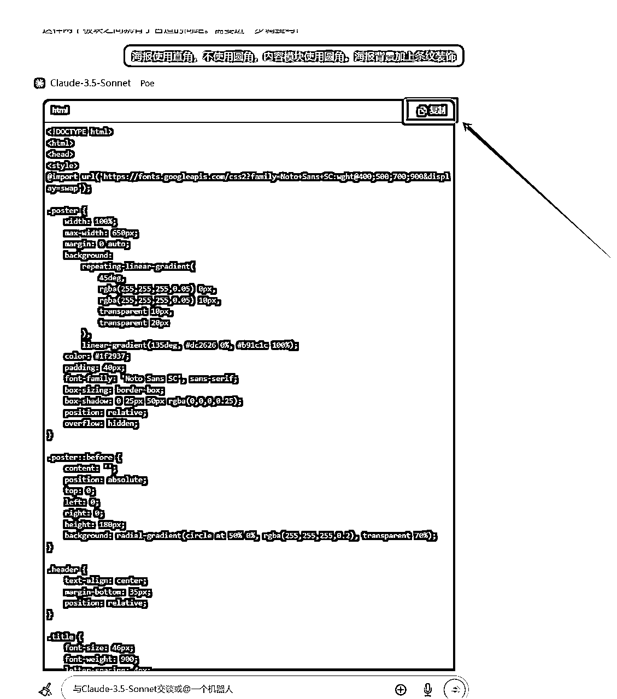

# 文本类AI做海报设计

> 来源：[https://gq3338qf45y.feishu.cn/docx/Tg5zdLY8iorXL7xoDkLcQh5Anrc](https://gq3338qf45y.feishu.cn/docx/Tg5zdLY8iorXL7xoDkLcQh5Anrc)

不懂设计的人，做海报是真头疼。

不具备审美，做出来的海报更是在审美之下。

但是又不得不做。

自媒体引流、社群招新、课程发布都需要用得上。

图片形式显得更有诚意，而且能有效突出重点。

受到两位大佬的启发，我开始尝试用AI做海报，达到了超预期的效果。

李继刚（有提示词第一人之称，Lisp语言风格提示词）

很多人都是通过汉语新解prompt认识的他，见识到了原来Claude对于汉语能有这么深刻的理解。

另一个点是使用了svg输出，原来文本类AI也是可以生成图片的，

涂津豪（17岁高中生，一个提示词在github获得8.2K star)

通过涂津豪，我知道了思维链的说法，向AI展示详细的思考模式、思考步骤，可以使得AI的输出更像人类的输出。

有人用这段prompt直接写了一个可以玩的flappy bird。

所以，想要用AI做个海报应该不在话下吧？

以下是做海报的调试思路：

（使用的是claude-3.5 sonnet模型）

1、大致说出自己的想法，看看AI是怎么理解的

Prompt：帮我做一张海报。包含标题，主理人介绍，社群权益，适合人群，价格，二维码

emmmm....缺点很明显，留白太多，内容显得不够紧凑，颜色、样式需要丰富一点。

把缺点告诉claude，再来一张。

效果是好了，但是还没有达到目标。

2、让claude自己调整

Prompt：一张优秀的海报需要具有哪些特点？

综合一下，调整提示词

Prompt：帮我做一张海报。

1、包含标题，主理人介绍，社群权益，适合人群，价格，二维码；

2、视觉重点突出 清晰的主视觉元素 合理的视觉层次 内容紧凑；

3、设计专业规范 色彩搭配协调 字体选择得当 比例布局平衡；

4、不同的信息选择合适的字体、大小等去表达；

5、海报背景带有主题样式，显得丰富，不要平淡；

6、内容部分使用相同的背景颜色，但是要与海报主题颜色区分开；

看起来有那么回事了，但是还没到能发布的程度。

3、按自己的想法进一步优化

首先是颜色搭配上不协调

Prompt：海报主体使用红色，内容部分使用奶白；

突然就有那么回事了

课程价格和适合人群两部分相隔太近了

Prompt：课程价格板块与适合人群板块相隔太近了，需要分开一点

立竿见影

Prompt：海报使用直角，不使用圆角，内容模块使用圆角。海报背景加上条纹装饰

已经达到我想要的效果了，不知道大家觉得怎么样？

4、修改文字内容

claude会给出一段代码，里面会找到图片上的文字，改成自己想要的。

然后发给claude，就能得到想要的效果了。

或者复制到txt文件里面，然后把txt后缀改成html，用浏览器打开。

