# 一键生成治愈语句图文+自动排版+自动发布的智能体，AI真强大

> 来源：[https://b121w2zgwyx.feishu.cn/docx/EniOdTavUo99vvxf7zNcblWqned](https://b121w2zgwyx.feishu.cn/docx/EniOdTavUo99vvxf7zNcblWqned)

相信，很多人早就看到过如下这种形式的治愈图片了

我知道，如果只是图片生成，很多工具都能生成，例如我试过用可灵AI生成，当然Stable Diffusion和Midjourney肯定不在话下；

还有，看到有人做了自动化，用的是别人的小程序工具来生成。

难道就不能用coze一键生成吗？不然做图的效率还是不行啊！

带着这个问题，我去捣鼓了一阵子，总算被我捣腾出来了，而且我还把这个加入了我的自动发布系统，从生成到自动化，一键搞定。今天我把我的工具分享给大家

# 一、一键生成文案和排版代码

## 1、首先打开我做好的这个智能体

地址：https://www.coze.cn/s/iUh2qud1/

进入页面之后，找到快捷按钮图文创作

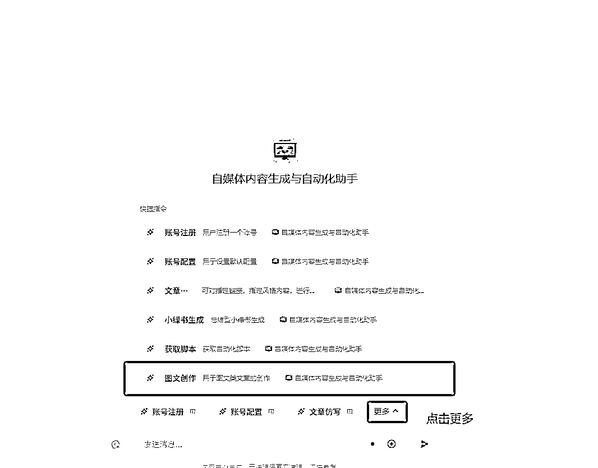

## 2、进入图文创作开始创作

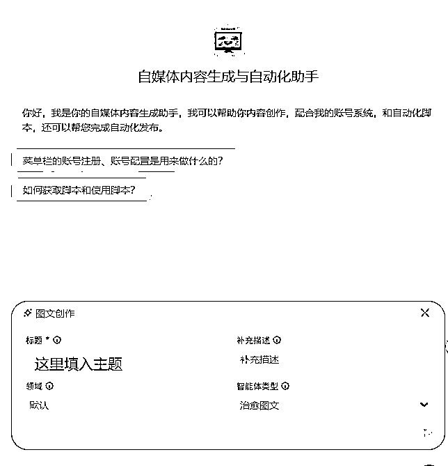

在标题栏填入要创作的主题，例如：看完这几句话，今天心情又变好了呢

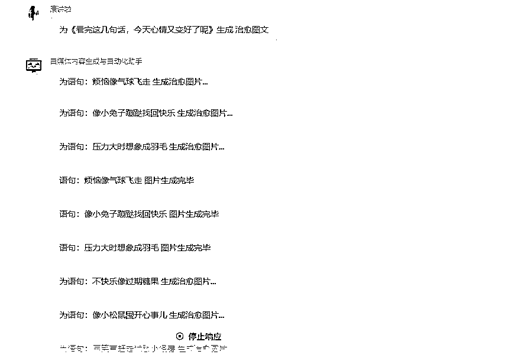

生成完毕之后，返回的是一个排版的html代码：

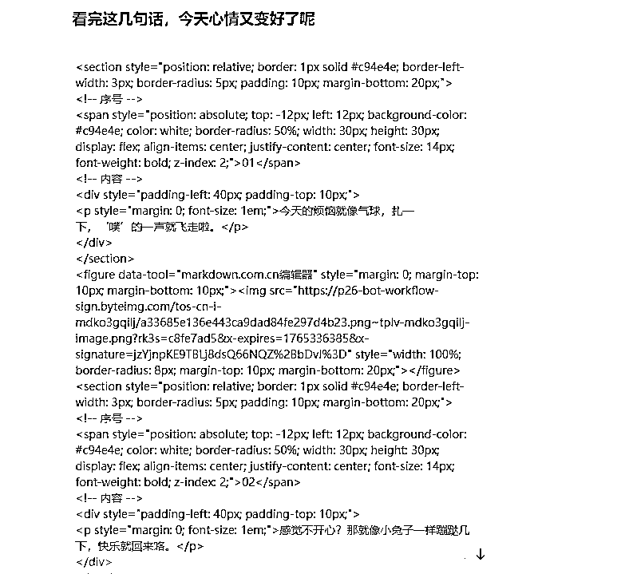

看到这个不用慌，接下来直接拿去排版

## 3、用排版工具转换一下

打开这个网站：https://markdown.com.cn/editor

把上面那一坨代码扔到左边框框里

当当当！ 就变成这样子了：

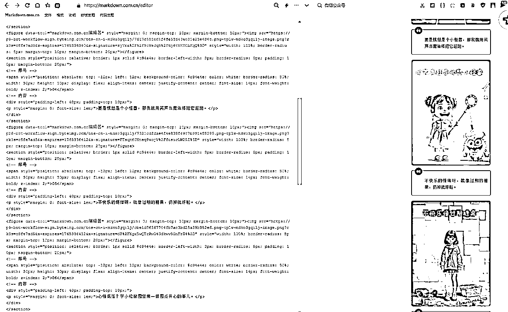

## 4、复制到公众号，收工！

接着呢，找到右上角这个按钮，点击复制

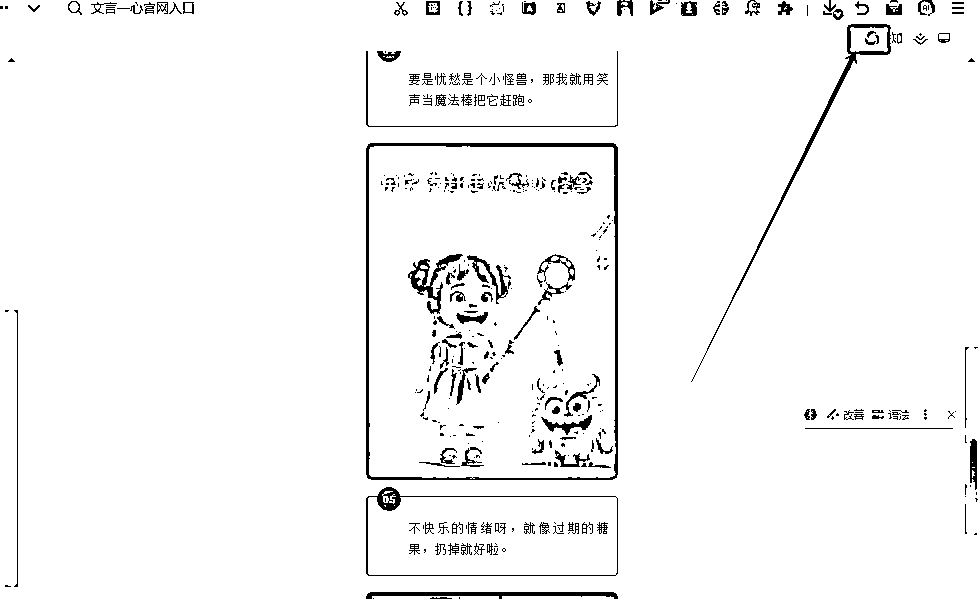

然后到公众号粘贴，保存，或者发布，一篇文章就好啦

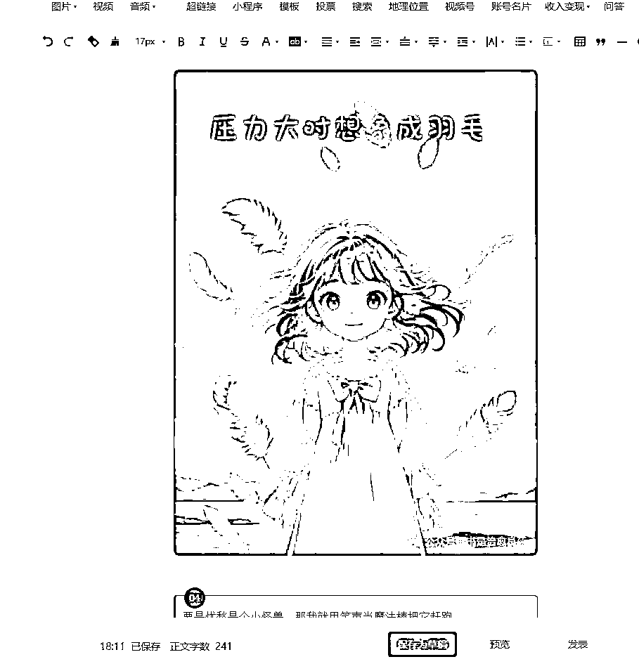

# 二、使用工具自动发布

有人就说了，像这样子，还要人工复制黏贴，似乎还是麻烦了点。是的，我说的，我真是太懒了，只想什么都自动化实现。

那么？如何才能自动发布呢？接下来就要引入我的自动发布系统了；

## 1、账号注册

这里的账号相当于使用我工具的通行凭证。而且账号还会用于关联你们的飞书关键信息。为后续节省操作步骤。点开下方的“账号注册”按钮，填写你的用户名，和邀请码。可以使用邀请码88886666来注册。（用户名和邀请码是凭证，记得保管好）

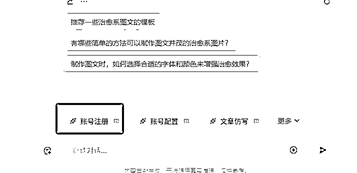

## 2、飞书注册和配置

我的系统是借助飞书来存储内容的，因此你需要注册飞书，并配置好相应的权限。如果你没有配置过，请认真参照这篇教程来操作

切记，使用模版表格时，要使用最新的 v2版的，前面模板是搭配之前的流程使用的。

## 3、账号配置

好了，以上的东西准备之后，我们打开“账号配置”

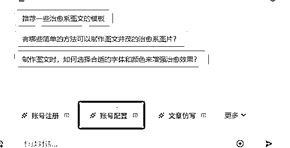

打开如下的页面

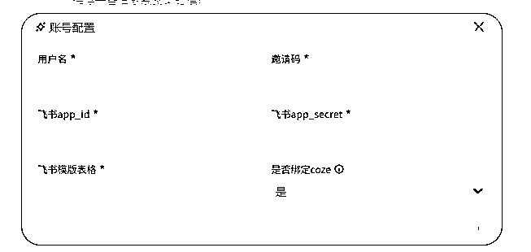

用户名和邀请码，就是前面注册的填入

飞书appid和飞书app_secret 是 上一步让你们去看的教程里有教的；

飞书模版表格，就是用我的模版表格创建的副本的链接，如下图所示，随便点开其中一个表格，然后把网址栏的网页地址复制过来就行了。

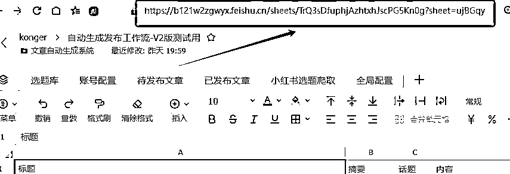

是否绑定coze，这里填默认的“是”。只能填“是”。意思是将你的这个配置，跟coze绑定。这样以后用，这个智能体，就能默认关联你的配置信息了。

如果什么时候需要换配置解绑，才需要设置成“否”；

需要改配置，就重新填写信息设置就行了。

这里的话大家注意一下如果飞书权限没设置好，是无法配置成功的，如果配置成功，在你表格的“全局配置”中能看到一条绑定成功的记录。

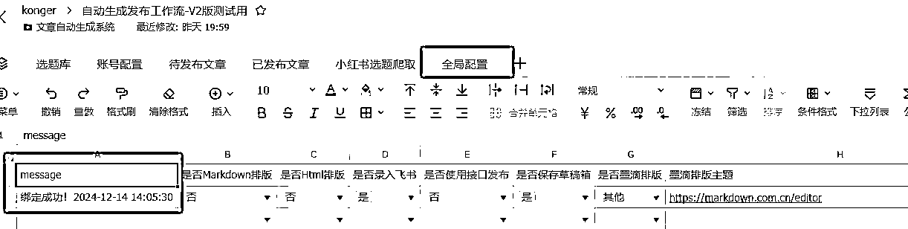

## 4、下载自动化脚本

账号配置好之后，我们就可以去下载自动化脚本了。点开更多，找到获取脚本

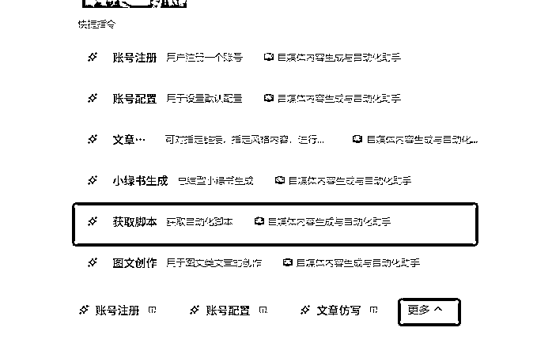

你就能看到如下页面：

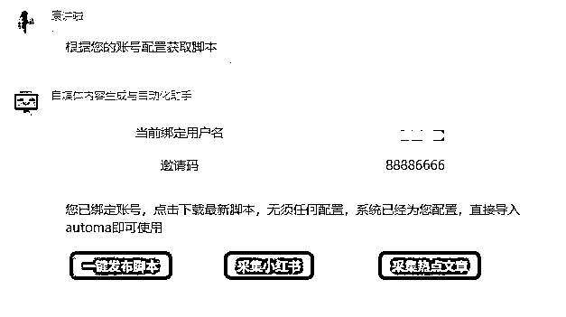

如果你的账号配置成功，这里的当前绑定用户名就会是你的用户名，如果没有绑定成功，会提示你未绑定。

只有绑定成功的，下面的脚本才能下载；

直接下载一键发布脚本，然后导入到谷歌浏览器，或比特浏览器中使用就可以了。

对了，如果不是我的老用户，估计会一头雾水，啊？怎么用？

大家可以去看看 这篇内容的，下面这部分步骤。唯一的区别是，脚本直接导入就OK了。不要改配置！不要改配置！不要改配置！配置在你下载的脚本那一刻已经自动完成了。

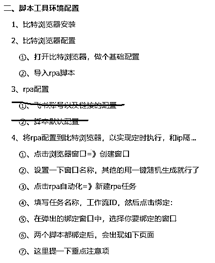

注意了，如果是绑定到窗口中使用，第一次记得设置一下权限。不懂得设置权限，可以看一下

这一篇内容的：

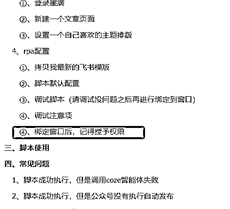

## 5、全局配置说明

飞书表格里面有个全局配置，所有配置集中在这里，一目了然

| 是否Markdown排版 | 填是，AI会进行markdown排版 |
| 是否Html排版 | 待开发 |
| 是否录入飞书 | 填是，在智能体工具上生成的内容会自动录入飞书 |
| 是否使用接口发布 | （图文类，可直接通过api发布到公众号）待测试 |
| 是否保存草稿箱 | 默认填是，自动直接发出去还未开发 |
| 是否墨滴排版 | 填是，使用墨滴，填“其他”（建议）使用另外一个markdown排版，不需要登录 |
| 墨滴排版主题 | 使用墨滴排版的话，需要设置主题，设置方法见 |
| 是否配图 | 填是会进行自动配图 |
| 配图模型 | 默认填 “通用”，其他的开发中 |
| 配图数量 | 可选择配图数量，（目前这玩意儿不精准，哈哈） |
| 热点采集领域 | 热点采集脚本用到，非会员，请忽视 |
| 热点采集链接 | 热点采集脚本用到，非会员，请忽视 |
| 比特下载路径 | 将比特浏览器的下载路径配置到这里（一键发布脚本必须配置，否则脚本无法工作） |

## 6、举个使用例子

如当前的这个治愈文例子，我们还是按照这个步骤点击生成

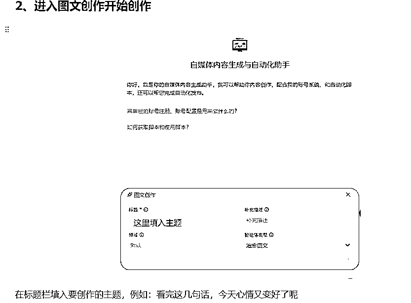

但是我们将，是否录入飞书 填是

当生成成功之后，我们就会看到，在我们的飞书表格中，生成了这篇内容：

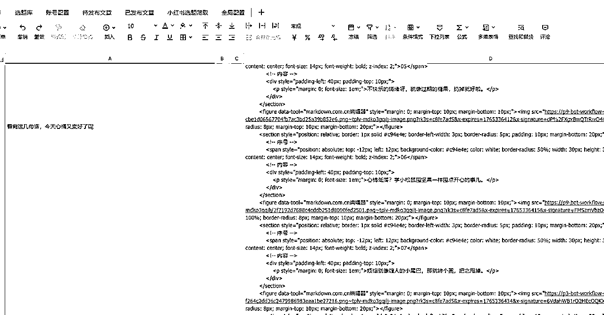

然后进入导入的autom脚本页面，点击运行脚本，脚本就会自动发布啦，（注意！第一次运行需要扫码登录公众号）

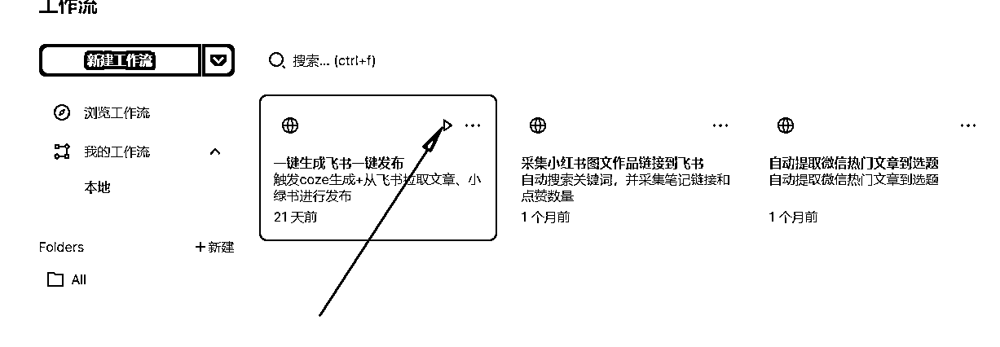

更多脚本使用可以看一下这篇教程：

# 三、补充工具

说实话，AI生成还是随机性太高，有的时候，自动化生成一篇内容，有些图确实太丑了，没法用例如，我这篇就恰好碰到一张图：

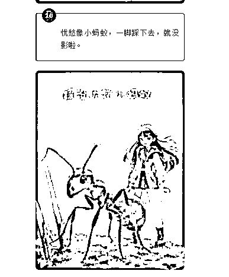

这图片看着有点恐怖呀，实在发不出去啊，删了的话，又感觉刚好缺了一篇，怪怪的。

那怎么办？

别担心，我还给你们开发个单独生成的工具

https://www.coze.cn/s/iUkqKXDf/

不满意？ 那就按你的想法，生成到满意为止！！！ 快给我点赞吧，嘿嘿。

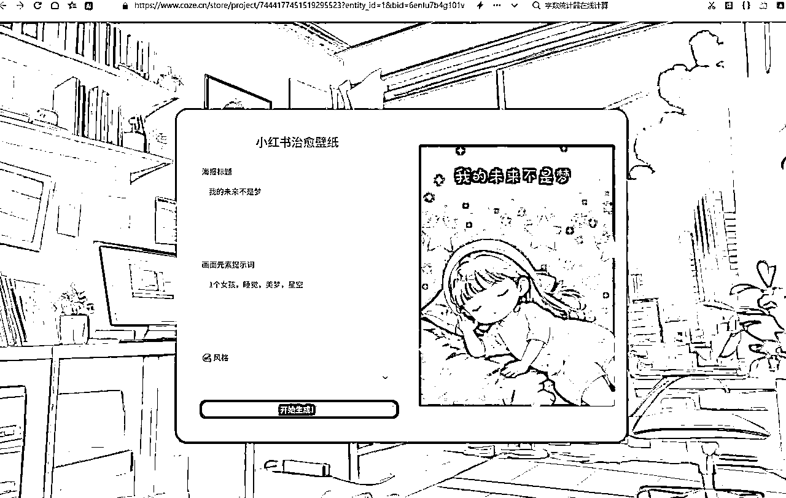