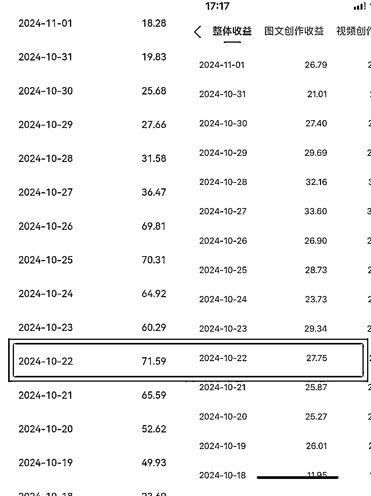
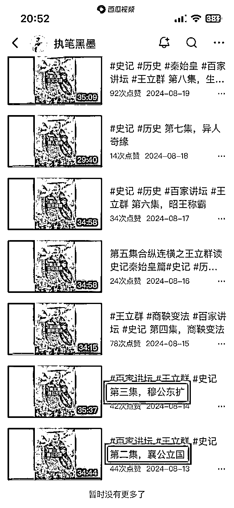
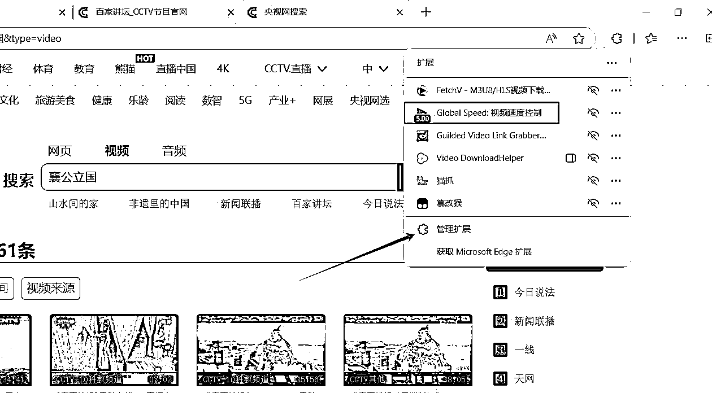

# 新手小白的第一块钱，今日头条历史类视频变现【复盘】

> 来源：[https://dqoptlqj6wf.feishu.cn/docx/IOcTdidV1osPXax8qAGcuwounLe](https://dqoptlqj6wf.feishu.cn/docx/IOcTdidV1osPXax8qAGcuwounLe)

各位圈友大家好，我是九里香。

今年5月份刚加入的生财。

今天我主要来复盘一下我在互联网上赚到的第一块钱。

# 一、项目介绍

有异常值的地方就有赚钱的机会。

我们先来看一张照片

像这样的一张图片从头播到尾，播放量高达2.6w。

那么到底是谁在看这些只有配音的视频？经过分析发现都是50岁左右的中老年人在听。他们只听，不看。

执笔黑墨这个账号，点进去发现这个账号是8月份才发布所以是刚起的新号，是短期内出现爆款，可以对标。对标这类账号不会离我们太远。

这类视频靠什么变现？

当时我想的是中视频伙伴计划，但是那时候中视频伙伴计划升级了，变成抖音伙伴计划，和头条，我去看了抖音需要5w粉丝，接着我去看了头条发现是能直接开通的。

类似于公众号流量主，中视频伙伴计划，收益的来源主要是官方的广告分成。

我们知道，西瓜发布或者头条发布它会同步到西瓜或者头条。

所以我根据这个账号我们能知道，作品是同步到头条的。

果然根据这个账号我很快就在头条找到了同类账号，我们来看下面的图片破放量更是高得惊人

# 二、项目收益

目前来说我经营两个头条号，最高两个账号单天总收益是99

单账号最高收益是71，下面这个是我的小号，小号比大号还猛，我也不知道是不是安卓手机流量会更好的原因，还是苹果被限流了。

# 三、项目拆解

这个就是播放量很高的那个视频，从头到尾37分钟的长视频都一直是这样，变的只有字幕和声音。

图片很简单，去百度或者小红书找。

我听完这个视频，我发现这个视频的配音是百家百家讲坛的。字幕是识别生成的，错字一大堆。（有人在评论区指出我这个字不对）但是不影响播放高，

综上所述，通过拆解我知道，这个视频主要要素有以下几点

第一，两张图片，一张历史背景图，一张王立群教授的图片。

第二，配音，《百家讲坛》视频的音频。

第三，字幕，字幕由剪映语音识别生成字幕。

# 四、项目实操

先找到对标，对标发什么，我们就发什么。

爆款都是重复的，只要不违规，尽量1：1模仿。

## 电脑版实操

一、找素材

打开浏览器（要使用自带的edge浏览器）搜索百度(不搜索百度可能找不到百家讲坛的官网）如下图

使用百度的搜索引擎

搜索 百家讲坛

点击百家讲坛，后面带有蓝色字的就是它的官网

进来之后点击搜索栏，搜索对标的标题：襄公立国

找到30分钟以上，就是上图这两个视频中的一个，都得

接下来我们把它下载下来，下载的话我之前使用浏览器扩展：猫抓（功能：抓取网页中正在播放的视频，有时候我也拿来抓取抖音，都是没有水印的）

以前是可以同时下载多个视频的，现在不能了，所以我使用了另一个。

接下我们打开浏览器扩展

点击管理扩展

获取扩展

搜索FetchV

点击获取

获取完之后，回到刚刚的网页，点开视频

点开视频播放后点击浏览器扩展

视频下载好了，其实这个视频是没有画面的，但是不需要画面，有声音就行

视频有了，接下来找图片，找两张图片

第一张视频背景图，小红书找，小红书的图片质量特别棒

我们打开小红书，搜索（历史图片），随便一张就行

复制链接到微信小程序，用去水印工具保存图片。

第二张图片：王立群老师的图片，百度小红书都有。

二、剪辑

素材找好后，接下来我们来剪辑，剪辑我用的是剪映破解版，闲鱼1块钱就搞定

对标怎么做的我们就怎么做，背景不一样就行。

下图是我之前做的

图片，视频导进来之后就生成字幕，生成字幕需要会员，所以买破解版的原因就在这里了

生成字幕之后，把封面弄一下就ok了，按照对标的来就行了

搞好之后导出发布。

## 手机版实操

手机段其实跟电脑段一样，但是手机没有edge浏览器，我们下载视频需要浏览器扩展，这个时候就需要找其他来替代了

我搜索之后找到了一个能装扩展的手机浏览器，它就是：狐猴浏览器（安卓）。

苹果我目前还不知道哪个可以，我也不知道是我的错觉还是什么，我记得苹果好像也有来着，可能是我忘了，如果有圈友知道欢迎评论交流。

打开狐猴浏览器，同样的也是先百度，要有百度搜索引擎，这个能快速找到官网。

接下来在百度搜索：百家讲坛

接下来搜索对标的标题，对标发什么我们就发什么，爆款都是重复的

接下我们打开浏览器扩展，手机的是在下方

接下来是获取浏览器扩展

装好浏览器扩展FetchV（视频下载）之后，我们回到网页

接下来点开视频，然后点开我们的浏览器扩展

接着我们把视频下载下来

视频下载之后，剩下的就是图片和剪辑，图片可以按照上面电脑版说的做，剪辑的话就是安装手机版剪映，导入视频，图片，生成字幕，然后导出视频，接着发布就可以了.

其实手机版跟电脑版操作大差不差。

# 五、总结反思

下图是目前到今天的收益，相比很多大佬日赚几万，我这个真是不值一提，我在写这个复盘之前我也很害怕，我害怕被说，就你这点收益也配发出来吗？哈哈哈。

我是那样想，但是我还是写了，为什么呢，因为我清楚的知道我写出来就是我的一次成长，我深知越复盘越精进，对成长有很大帮助，我觉得成长是非常重要的，相比之下被说，我还是渴望进步和成长。所以我也还是勇敢的发出来。

有个账号我已经停更了一个月了，另外一个也很少发了。

总收益大概3000多吧，扣税扣去一些了，后面我才懂，超过多少才需要扣税的，好像是800来着，第一次提现不知道，后面懂了，我没到800我提现了。

这个项目目前我已经放弃了，为什么呢？因为现在就是剪视频，发布，是一件一直重复做的事情，这样的事情对成长的帮助不大。我也尝试过优化，不过这样的视频其实就是跟搬运差不少，对自己提升和成长意义不大。

现在我追求做“具有复利的事情”而写作就是，我打算练习写作，持续写，这也是我写这篇复盘的意义，我开始尝试写，加油。

### 我的收获：

生财的十二思维，在本次项目的实操过程中，我运用了异常值思维、对标思维、迭代思维

先说我对异常值的理解吧，我刚进生财的时候就看了生财的十二思维，我印象最深的就是，一个百万粉丝的账号出现10万＋很正常，一个粉丝只有几十、几百的账号出现10万＋这就是异常，有异常的地方往往有赚钱的机会，我就是找异常值，找到了之后就找对标。

对标思维，我理解的对标是：模仿、对比，标准、榜样。对标的话要找离我们近的，最好的短期内涨粉很快，短期内出现爆款的，这样的话离我们不会太远，我们也更容易拿到结果。找到对标之后就是像素级模仿了。

迭代思维，我理解的迭代思维就是，先完成再完美，想都是问题，干才能找到答案，我刚开始也是想着，但是我知道了先完成再完美，然后我就干了，遇到问题我就解决问题。其实我觉得就像菜刀，如果我们不去使用它，我们不知道它锋不锋利，只有使用了我们才懂，不锋利了我们就去磨它，磨好了我们就能切菜了。我们得先去干，干的过程就是就是磨这把菜刀的过程。

以上是我在这个项目中运用的生财思维，我也不知道我说得对不对，无论对错我觉得我通过学习并且运用在自己的身上就是一次很大的进步。

最后想说：

非常感谢生财有术，这里的氛围非常好，感觉人人都有利他之心，都愿意分享自己的搞钱项目、认知、等等。

以前我很喜欢刷抖音，加入生财之后，我就很喜欢看生财，各位圈友也非常的热情，大佬们也很无私并且有耐心的为大家解答。

以前我不喜欢阅读，也不爱阅读，加入生财之后，我竟然喜欢阅读了，我还买了一本书来看叫《恰到好处的幸福》，我还把它看完了。今天即将接近尾声，回望这一年，自从加入生财之后，整个各方面都进步很大。

以上便是我对本次项目的复盘，圈友们如果有更好的思路或者想法欢迎在评论区交流，我们一起讨论，一起生财有术。😉