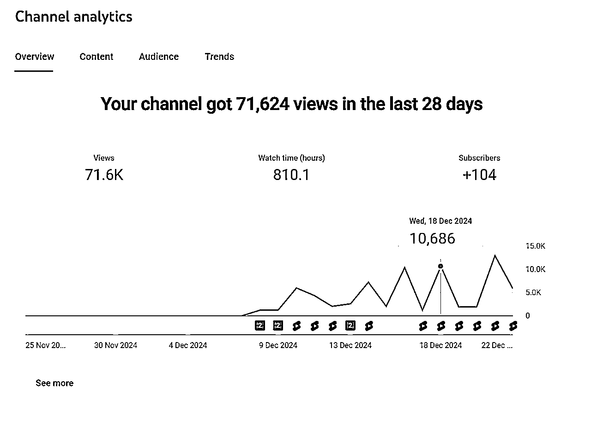

# 12月航海 | YouTube Shorts经验分享

> 来源：[https://lcnqe9bq2wgy.feishu.cn/docx/FmLkdaySCoOK6ZxngNfcTp0inid](https://lcnqe9bq2wgy.feishu.cn/docx/FmLkdaySCoOK6ZxngNfcTp0inid)

大家好，我是六只猫，11月加入生财有术，来自四川，原从事化工技术工作。很高兴参与这次YouTube Shorts航海挑战。虽然最终没有取得特别突出的成果，但通过持续的执行，我成功开通了一个初级YPP账号，距离正式广告收益还有一段距离，但作为首次实践出海的经历，我积累了一些经验，希望能给同为新手的圈友有所启发。

# 一、为什么选择YouTube Shorts

我在2019年就注册了YouTube账号，当时还在上大学，纯粹是为了尝试和了解“外面的世界”。但因为没有清晰的内容方向，账号一直闲置，没有发表作品。

今年11月加入生财圈后，我在超级标看到YouTube Shorts项目，再结合AI工具的赋能，瞬间意识到机会来了：

*   有了内容输出方向：借助AI工具，我可以快速生成短视频内容；

*   平台流量倾斜：YouTube对Shorts的扶持力度很大。

于是，我根据生财圈的教学内容开始了实操。

# 二、航海经历分享

## 赛道选择

最初，我在生财圈看到几个热门赛道：萌娃走秀、达人变身秀、图片型AI猫猫故事等。我选择了AI猫猫故事赛道，但很快发现PPT类内容普遍无法开通YPP。通过对标账号的工具分析，许多高播放量、高关注度的账号也未能开通YPP。

因此，我调整策略，加入了“图生视频”的环节，转向制作故事型视频号。我认为这种类型的内容更具长期发展潜力。

11月8日，重新拿起我的YouTube账号，时隔几年还能顺利登陆，也就直接跳过了注册账户的阶段，马上开始实操第一个赛道Ai猫猫的故事。。

## AI猫猫实操过程分享

我的步骤就是按照航海手册以及老马和其他圈友的帖子一点一点开始的。

1.  研究对标账号

我是直接下载千万播放以上的视频，实操过程中发现，找的爆款播放越高，自己的视频播放相比也会更高。下面就是其中一个对标，应该很多人都刷到过，他的第一个视频真的出了很多爆款，基本上播放量都很高。

1.  视频拆解与图片筛选

使用老马在生财分享的视频分割图片工具，将爆款视频拆解成图片，随后筛选出有价值的画面，删除重复内容。

1.  ChatGPT生成图片描述与角色设定

利用ChatGPT批量生成图片的场景描述，同时根据需求调整内容。我通常提前设定角色形象，比如用提示词帮助生成一致性较高的角色形象。

1.  AI生成图片

使用ChatGPT文生图工具进行重新制作图片，这个分享用的以前的记录，图片都加载不出来了，体谅一下，主要是讲一下我的实操过程。

下面这张图我使用了Gen_id结合圈友控制形象一致性的提示词：

讲一下形象一致性问题吧：我是参考了生财圈友分享的帖子，一是使用Gen_id控制，二是使用提示词控制，经过实操我个人觉得使用提示词比较方便，很多时候还是得靠运气，顺利的时候很多图片都能一次性生成，不顺利的时候一张图生成5，6次都可能不行，过程需要去打磨，如果一直生成不好，也可以将原图传上去垫图，让ChatGPT参考原图重新生成，亲测是有帮助的。

1.  图片生成视频

通过Runway将图片转化为视频。这个步骤比文生图更快，我一般不写提示词，直接放入图片，使用turbo模式直接生成视频，turbo模式生成速度更快，因为是买的共享账号，现在没有做图生视频了，就截个图做演示。

1.  视频剪辑与优化

将所有图片生成的视频片段导入剪映，加入背景音乐、字幕、转场等。背景音乐我一般是直接使用剪映的音频分离功能分离原视频的音频，这样有些音效就不用自己再找了，一般来说版权问题不大。为了确保内容原创性，我会在剪辑时使用滤镜、特效、画面调整等多种去重方式。

1.  视频上传与推流观察

完成剪辑后，视频以4K 60帧的高质量导出并上传到YouTube Shorts，随后跟踪数据表现。

## 账号数据

或许是因为使用老账号的原因，或者确实得益于AI赛道的高流量，我的第一个视频播放就有2000+，第二个视频就破万播了。后续发布的视频播放量也基本维持在几千到几万的水平，整体数据表现比较稳定。11月24日发布的第16个视频推流比较快，成为了第一个爆款，目前播放量已达到320万。仅凭这一条视频，我的账号涨粉22400，这样的涨粉速度让我非常震撼！目前推流仍在持续，早期发布的视频播放量也在逐步增加。

## 初级YPP申请经验

1.  Google Adsense注册

通过这个爆款视频，成功突破300万播放+1000订阅，也就达到了初级YPP的条件，我意外发现2019年时就已注册了Google Adsense账号。根据生财圈友分享的内容和YouTube的教学视频，把google Adsense的地址重新改了，特别是地址里面加入了联系电话，听说方便以后收PIN码。审核耗时5天通过。通过审核总会有点莫名的开心，哈哈哈。

1.  初级YPP申请流程

申请初级YPP就在手机YT Studio里面，达标了就可以直接点申请了。

点了申请后，第一步就会叫你同意相关协议，象征性看一下同意就行。第二步就是注册google Adsense，因为我已经注册了，所以这里直接进行绑定审核就行，我的审核过程3-4小时就通过了。

最后一步就来到YPP审核阶段，最惊心动魄的一步，我是晚上10点过提交的申请，然后在网上看了一些加速审核的技巧，不知道有没有用，也分享给大家。我们可以在网页的工作室，左下角点击发送反馈，我是这样填写的内容：

Email Template: Request to Expedite YouTube Partner Program Review

Subject: Request to Expedite YouTube Partner Program Review for @你的频道名

Dear YouTube Support Team,

I hope this message finds you well.

My name is 你的姓名, and I am the creator of the YouTube channel “@你的频道名”. I submitted my application to join the YouTube Partner Program (YPP) on December 13, 2024（你的申请日期）.

I have diligently worked to meet all the eligibility requirements, including reaching 20,000（你的订阅数） subscribers and 3,000,000（播放量） watch hours, while ensuring my content adheres to YouTube's community guidelines and policies. My channel primarily features engaging, inspiring, and growth-oriented stories, and I am committed to producing high-quality and captivating videos for my audience.

Joining the YPP is extremely important to me as it will enable me to monetize my content, invest in better equipment, expand my content variety, and further develop my presence on YouTube. I am eager to contribute positively to the YouTube community and grow my channel with the support that YPP provides.

I understand that the review process takes time, but I would greatly appreciate any assistance or information you can provide regarding the status of my application. Additionally, please let me know if there is anything else I can do to help expedite the review process. Thank you very much!

Thank you for your time and consideration. I look forward to your positive response.

Best regards,

你的名字

@你的频道名

2362758XXXmr.f@gmail.com（你的邮箱地址）

发送邮件的步骤

使用官方支持渠道： 虽然发送邮件是一个选择，但更快的响应通常可以通过YouTube帮助中心的支持请求表单获得。您可以登录您的YouTube账户，前往帮助中心，选择相关类别并提交您的请求。

保持耐心： YouTube的审核过程可能需要一些时间，尤其是在申请量大的情况下。

持续优化频道： 在等待审核期间，继续发布优质内容，增加订阅者和观看时间，这将有助于提升您的频道表现。

中英文对照

尊敬的YouTube支持团队，

您好！

我叫xxxx，是YouTube频道 “@xxxx” 的创作者。我于2024年xx月xx日提交了加入YouTube合作伙伴计划的申请。

我一直努力满足所有资格要求，包括达到20000名订阅者和300万播放次数，并确保我的内容遵守YouTube的社区准则和政策。我的频道主要内容是讲述有趣、励志、成长的故事，我致力于为观众制作高质量且有吸引力的视频。

加入YPP对我来说非常重要，因为这将使我能够实现内容的货币化、投资更好的设备、扩展内容种类，并在YouTube上进一步发展。我渴望在YouTube社区中积极贡献，并在YPP的支持下进一步发展我的频道。

我理解审核过程需要时间，但如果您能提供有关我的申请状态的任何帮助或信息，我将不胜感激。也请告知是否还有其他我可以做的事情以协助审核过程，非常感谢！

非常感谢您的时间和考虑，期待您的积极回复。

此致，

xxx

@xxxx

23627xxxxxmr.f@gmail.com

当天晚上就发送了邮件，然后第二天下午就收到了加入YPP的邮件，因为是周末，我还以为不会审核，没想到挺快的，虽然还是没法有收益，但是有被认可的激动。这个账号就这样开通了初级YPP，总共发送了21个视频，获得了23000订阅，420万播放。

## 持续思考与赛道转变

虽然开通了初级YPP，但是整个过程比较磨人，因为过度依赖于Ai工具，为了控制成本，我的Ai工具都是买的共享账号，ChatGPT文生图经常存在生成几张图让等待的情况，Runway也存在高峰期排队很长时间的情况，就因为这两个Ai工具，我的效率大大降低，做一个视频要4-5小时，前期富有激情的时候能日更，后面逐渐觉得这样也不是长久之计。为了提升效率，我逐渐将重心转移到更简单高效的“故事号”赛道。

## 故事号经历

1.  做故事号就很简单粗暴了，一开始没有用老马教练说的正练，就是逆练，抄爆款故事文案，就去下载千万播放的文案，下图是我用的shorts文案下载工具，应该有更好的，没精力去找了，能满足使用就好。这是YoutTube下载字幕的一个浏览器插件，但是shorts好像只能手动复制链接进去获取。

1.  下载好爆款文案，就用ChatGPT进行改写。

提示词用到航海手册里面的，根据自己的需要进行了添加：

提示词：

我需要你帮我改写原文故事，改写规则:[字数控制:新文案字数<原文字数x1.1]+[结构:精华开篇+细节递进+转折+点题]+[保留:人称关系、核心事件]+[替换:每段最多 2个关键词重复，用新鲜比喻和动作描写代替常见表达]+[语言:简练句式清晰主干]

１.明确的字数限制

2.必要的改写架构

3.核心保留要素

４.替换原则

5.语言要求

确保改写既保持故事精髓，又避免冗长，改写后字数不超过200字。最重要的，人称描述视角不要改变，保证改写后的故事核心主题不变，内容用词重复率不超过20%。

以下是原文，请给我改写后中英文对照:

经过尝试这样写出来的文案基本上配音时长会低于60s，我一般改写出来还会叫ChatGPT计算一下用词重复率，尽可能降低重复度。

1.  文案复制进elevenlabs进行配音，这个航海里面有讲到的，就不赘述，根据我的经验，这里显示的字数在1000以内，基本上出来的音频时长都在60s以内。

1.  下载音频，消除气口、停顿语气等，这里CapCut里有智能剪口播功能，但是我刚开始使用CapCut的时候，没有找到这个功能，不知道为什么，所以是手动剪的，非常浪费时间，后面心血来潮去看了看Cousor航海手册，一下子就有了灵感，用Cousor写了一个剪音频静音片段的工具，纯小白第一次使用Ai工具写程序，再一次颠覆了自己的认知。之后这一步剪气口效率直接一分钟搞定。工具会在后面分享，因为是临时写的，很粗糙简陋，但是能满足个人使用，也没有过多花时间优化，毕竟咱也不懂编程。

1.  解压素材，我的素材全部在ins上面下载的，根据老马的对标账号库，关注了一些，每天刷刷刷，借用老马的一些关键词，搜搜搜，然后逐渐推送的越来越多，对标账号队列逐渐扩大。我是使用哼哼猫直接批量下载的，下载进行预处理，这里我使用了CRV进行了视频预处理（虽然老马说YouTube的去重要求还达不到国内的高度，但我自己习惯这样操作，可选择性参考），先预处理，微调画面，镜像翻转、抽帧。

1.  Reddit风格开头，直接使用老马的模板在figma里面生成卡片，替换头像，改名字，将文案第一句复制进去，导出就完事。

1.  准备好了文案配音、Reddit开头卡片、解压素材，就可以剪辑了，做故事号我的剪辑工具换成了CapCut，感受到了CapCut的强大，尤其是字幕。步骤很简单：将素材全部导入CapCut，添加故事号类型的字幕，CapCut自带很多模板，将Reddit开头放进去，时长保存与音频第一句时长一致，添加出场动画。

接下来是素材剪辑环节，这部分更多依赖个人的审美偏好，将多个素材进行融合。我目前还在测试解压素材的选择，因为账号是新开的阶段。素材时长需要与音频时长一致即可。

关于剪辑中的去重处理，虽然可能不需要做得这么复杂，但因为习惯，我会将所有可用的去重手段添加进来，制作成一个模板。之后只需替换主轨视频和音频即可。背景音乐直接使用对标账号的纯音乐，确保无版权问题。

我的去重方法包括加入两张自己拍摄的照片，并添加滤镜、特效、飘动文字和画面调整等。这些调整可以保存为预设，后续直接应用到模板中，方便快捷。

1.  最后导出。听了高手航海后，我每次导出直接选择4K，60帧。

## 故事号数据

故事号是新开的账号，12月8日开始发送的第1、2个视频，只有几百播放，直到目前16个视频的数据图上可以看到，虽然都不是很高，但是数据是向好的趋势，好几个大几千的视频了，有一个过万了，还算是有正反馈，接下来就是持续发发发。

# 三、YouTube航海感受分享

## 综合AI赛道与故事号赛道的实操对比分析

1.  起量与涨粉速度

AI猫猫故事赛道起量非常快，涨粉速度也显著高于故事号；相比之下，故事号的增长更为平缓，粉丝增长速度也慢了许多。

1.  受众特点与互动

通过对两个账号评论区的观察，AI猫猫故事的观众大多是小朋友，评论多以表情为主，或者是一些不太通顺的语言；而故事号的评论区则以成年人为主，互动内容多为带有思考的完整句子。这种差异也反映了两者的涨粉逻辑——小朋友更容易因为可爱有趣的内容直接点击关注，而成年人则会考虑内容是否对自己有价值。因此，故事号若想实现快速涨粉，必须在内容质量上下功夫。

1.  观众分布区域

从观众的地域分布来看，AI猫猫故事赛道的观众多来自印度、印度尼西亚等国家；而新开的故事号账号观众分布则明显不同，目前发布的视频主要吸引了来自美国、英国、加拿大和澳大利亚的用户。

## 关于推流

从我的经验来看，YouTube的推流节奏较慢，但两个账号的推流规律都比较清晰。我通常在晚上上传视频，次日凌晨5-6点会迎来第一波大的推流（我起初以为这是因为美国观众在晚上休息前流量较大）。后来我尝试在白天发布视频，发现推流似乎与上传时间有关——大约在视频发布8小时后开始第一波大推流（哈哈哈，这只是通过我自己的账号总结的规律，不一定都一样🤣）。

如果视频质量较好，第一波推流的播放量通常会达到几千，随后进入平稳期。我认为这可能是YouTube第一阶段收集数据的过程，用于判断视频是否值得进行第二波推流。因此，后续推流速度明显变慢。而推流量的多少，应该与视频的播放比例和完播率直接相关——表现优秀的视频更有机会获得更多推流支持。

# 四、剪气口语气停顿工具分享

工具是临时使用cursor写的，因为是编程纯小白，工具比较粗糙，选择性使用：

1.  静音阈值（Silence Threshold）：

单位是分贝(dB)，通常是负数，如 -30dB

表示多安静的声音被认为是"静音"

值越小（如-40dB）表示更严格，只有非常安静的声音才会被当作静音

值越大（如-20dB）表示更宽松，较大的背景音也会被当作静音

示例：

-30dB：一般的背景噪音级别

-40dB：更严格，只删除很安静的部分

-20dB：更宽松，可能会删除一些轻声说话

1.  最小静音时长（Minimum Silence Duration）：

单位是秒(s)，如 0.5秒

表示要持续多久的静音才会被删除

值越小（如0.2秒）会删除更多的短暂停顿

值越大（如1.0秒）只删除较长的停顿

示例：

0.5秒：删除一般的停顿

0.2秒：删除短暂的停顿，包括单词间的停顿

1.0秒：只删除较长的停顿，如段落之间

# 五、写在最后

这次YouTube Shorts航海让我深刻感受到AI工具的优势，也认识到坚持和内容打磨的重要性。虽然目前尚未实现广告收益，但我相信，只要不断优化内容并持续努力，就一定能挖掘更多机会。非常感谢这次航海过程中教练们、领队辛拉面、志愿者们和生财圈友的陪伴，希望我的经验能为大家提供一些思路，也期待未来与更多优秀的圈友交流，一起生财有术！