# 详细拆解YouTube shorts 解说类-万物皆可解说

> 来源：[https://yemahuyou.feishu.cn/docx/FylYdbDiYoRHUhxwvSRcfbeandb](https://yemahuyou.feishu.cn/docx/FylYdbDiYoRHUhxwvSRcfbeandb)

# 什么是解说类账号？

它是通过原视频，以及拼接不同素材的视频，在加上自己二次创作的解说词，融合在一起形成新的视频这种风格，均属于解说类。那它很明显的特点，就是要说出来，讲出来。短平快，三秒内拉住你的停留，并且通过吸引人的画面，消耗掉你的60秒，甚至更多的60秒。

解说账号它的领域很广，科普解说，游戏攻略解说，爆款视频解说，动物解说，动漫解说，电影解说等等这些类目都属于这种类别。

详细类别的拆解可以开这个文章：

## 账号类别重温：

### 电影解说：

### 科普解说：

### 爆款视频解说：

### 动漫解说（动画漫画解说）：

### 游戏解说：

### 动物解说：

针对普通人而言，电影，科普，爆款视频解说，动物解说，都是非常合适的，但如果你对游戏解说，动漫漫画解说感兴趣，并且在这个领域很久，但不知道如何下手，欢迎跟我建联，我可以帮助你走到正确的路子上，我对这块儿的内容一直心有力而气不足，很难很累，它吃的是个人对这个领域的理解，不是标准化能够出来的产物，但我又不舍得丢掉这个板块，如果有类似的选手，我们可以共创合作，感谢辣~

还有更多的解说类型，但它们属于小众就不一一列举了，总而言之，解说类型账号千门八将种类不同，但核心思路是一致的，借助原素材的力量，配上解说过重，达成火过的内容可以在火这条原则。做匿名频道，解说类是大类，多少账号都吃得下，并且什么素材都可以通过解说再来一次。

# 万物皆可解说

## 那么解说如何做？

接下来，我会详细拆解两个类别，科普解说，爆款视频解说，这两个通了，解说所有赛道，你都可以通。

老规矩，分为正练和逆练。

通过本章的学习，你可以学会：

1.  对解说流程的掌握

1.  对通过AI改文解说词的理解

1.  新技能-寻找素材的核心方法（不仅仅适用于解说）

1.  解说剪辑的一些技巧

# 科普解说：（拼接类解说）

其实说科普解说比较笼统，很多人会认为，科普解说是科学科普，地理人文这种讲解的视频，其实不是，如果我们换个概念来理解的话，它就是十万个为什么，你没见过的东西，现象，事物，我都可以解说出来。

但如果在创作者的角度上来看，我更容易把它称呼为拼接类解说。

那么为什么叫这个名字？

因为它是通过当下这个视频的选题，采集围绕这个选题不同的素材，通过拼接，放在一起的手法，这种我把它称为拼接类解说，那么便于理解，它也属于科普解说。

怎么理解这个事情，来看下这个视频：

好，文案可以先不用理解，我们看画面，出现了几个座椅？最少6 7个是不是？那是不是就容易理解了。

是不是很简单，但这种简单的内容，投放TK，第一条就到3M，这就是通识的力量，泛流量的力量。


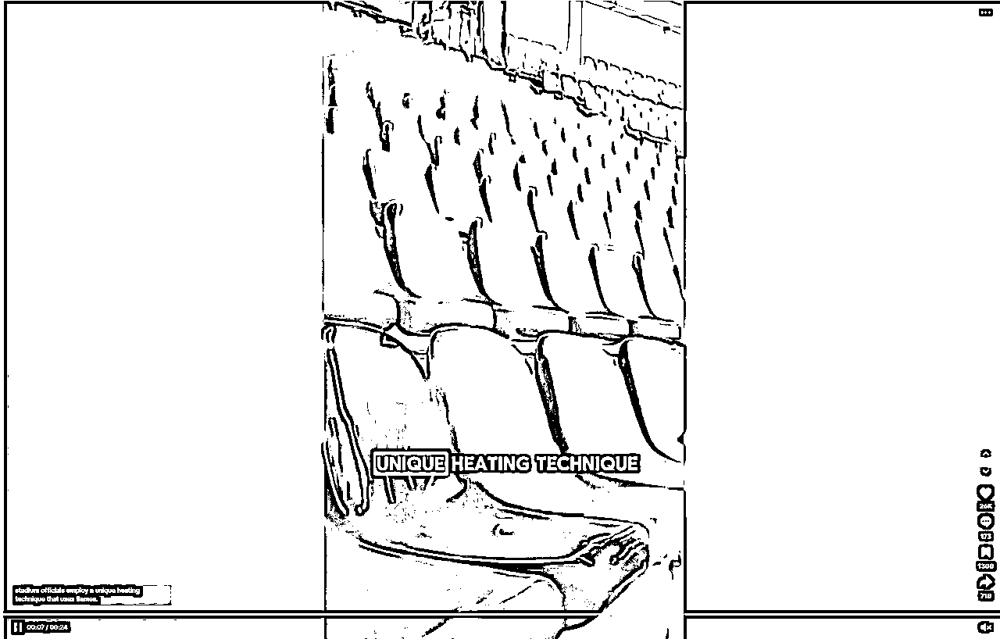

如果你问放油管多少？我忘记了，肯定是个万年万播，它不配我记住它，哈哈。这也侧面证明了，你想玩好TK很容易，想玩好油管shorts不简单。

那么它的操作手法，就是围绕选题，找到和选题强相关的素材，通过转场和音效最后合成的视频。

当你理解了这个概念，你可能现在就想跃跃欲试，别急，因为这个板块，也分为正练和逆练，需要的素材，也不一样，所以，先耐心看下去，你在去施展拳脚。

拼接类解说的好处很明显，它基本上不会出现0播，低播的情况，当你完成了标准化，各个视频都是万播，除非你的选题，素材清晰度，展现画面吸引度，文案，太差了，不然万播就是标准值。但也有缺点，那就是它太稳重了，天天万播，一点波澜都没有，只是说不定哪天你的一个月前视频会被挖坟，然后跑的很高，属于单兵作战比较强劲的那种。这种类型，对比后面要讲解的爆款视频解说（原视频解说）而言，流量会低一些，但胜在稳定，后面会讲为什么。

科普解说我会分为三个小版块儿来讲解，正练，逆练是文案策略的两个板块，剪辑为另一个板块，至于解说配音，不在讲解，过往文章讲过了。点击这里跳转

PS:

## 正练：

拼接类解说的正练比较麻烦，因为你要先确定选题，在去围绕选题去寻找素材，通过选题写出来初稿，然后通过改文模版二次进化文案，然后配音，剪辑。在这块儿上，确实不如逆练方便一些，因为逆练，你只需要洗稿，寻找不同一个选题视频素材，在剪辑即可。但，还是会讲。以下几种方法来完成正练。

### 确定选题（自我创造）

训练语料，来扫出爆款选题，简单粗暴。

收集信息，科普解说类型的对标，选择10-50个文案，丢给克劳德，让他先理解这类型的选题是什么，并且输出出来。

我需要你根据我这十个文案，详细拆解一下都是什么选题

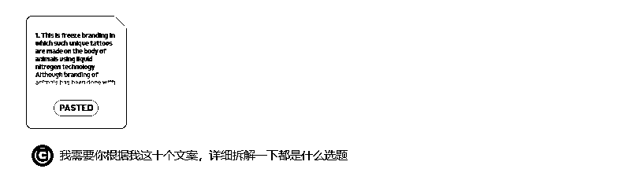

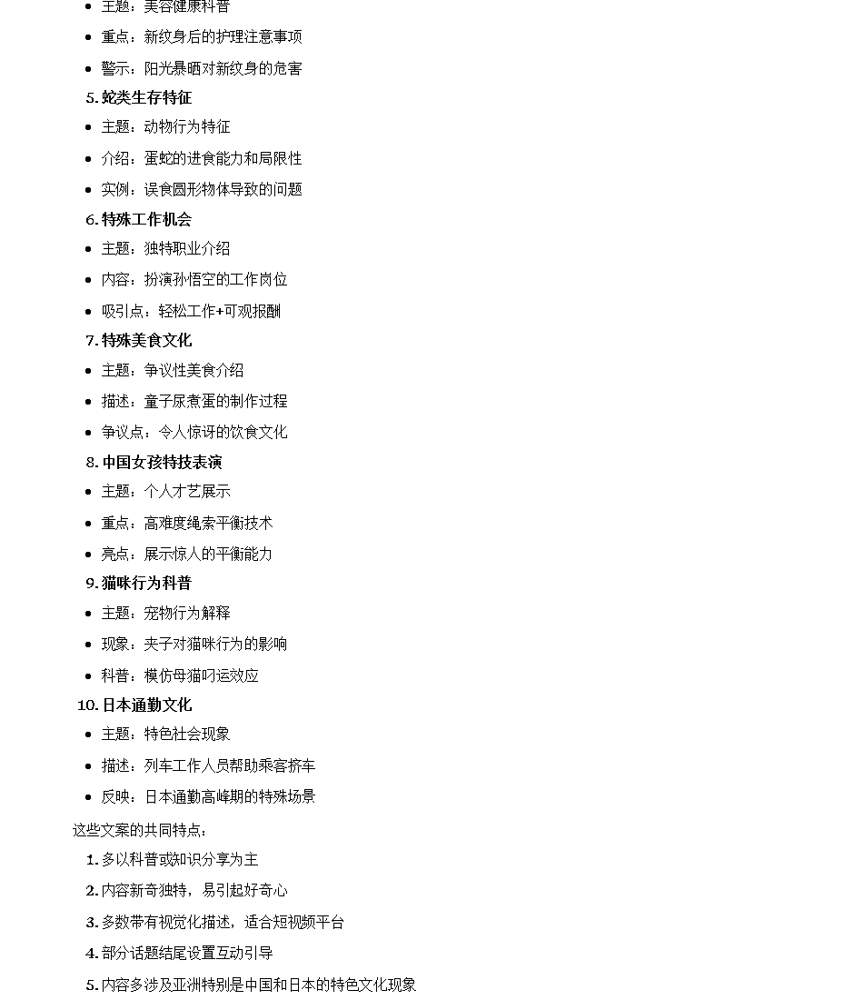

然后我们要给到进阶提示词，让他去创造选题，以及基础文案，和寻找素材的关键词。

### 创造选题

请帮我创作[数量]个shortsvideo选题创意，要求如下：

1.  内容结构：

每个选题必须包含：

*   主题标题

*   完整分行文案（150到200英文，200-300字中文）

*   中文关键词5个（用于素材搜索）

*   英文关键词5个（用于素材搜索）

*   选题类型说明（科普/文化/生活等）

1.  文案要求：

*   每句话需要分行书写

*   语言通俗易懂

*   突出新奇性和知识性

*   结尾加入互动引导

*   适合30-50秒短视频呈现

*   文案要先给到完整英文，在给到完整中文。

1.  选题标准：

*   话题具有新鲜感和传播性

*   容易获取相关视频素材

*   适合视觉化展示

*   能激发用户评论互动

*   符合shorts video平台调性

1.  关键词标准：

*   关键词要具体且实用

*   符合各平台搜索习惯

*   中英文关键词相对应

*   便于实际素材搜索

*   尽量选择高搜索量词汇

目标受众：[目标年龄段]

传播平台：[具体平台]

内容领域：[具体领域]

文案风格：[提供情绪]

请确保每个选题都能引发观众兴趣，易于制作，适合传播。

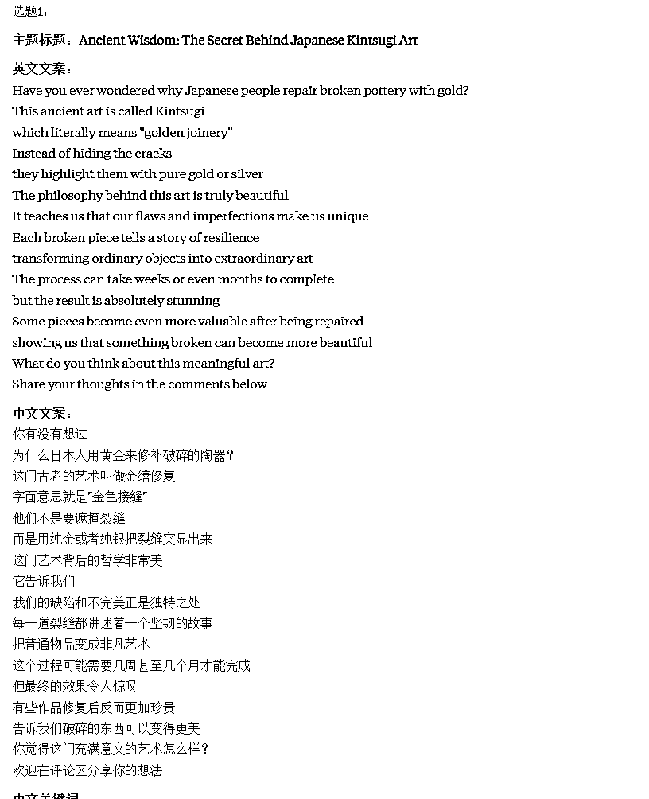

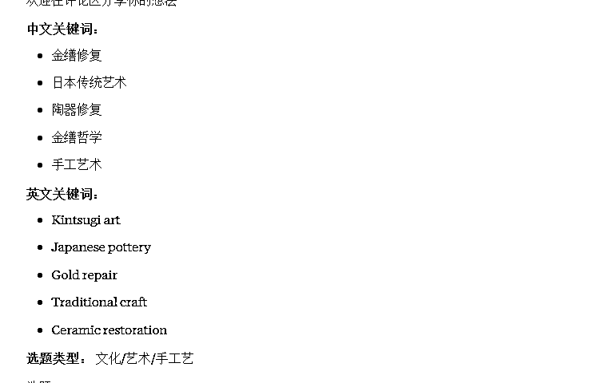

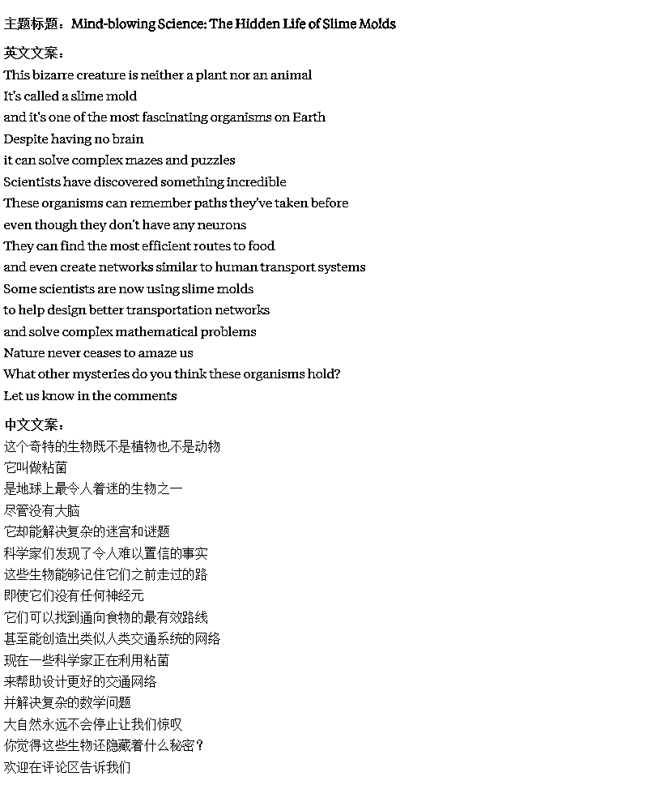

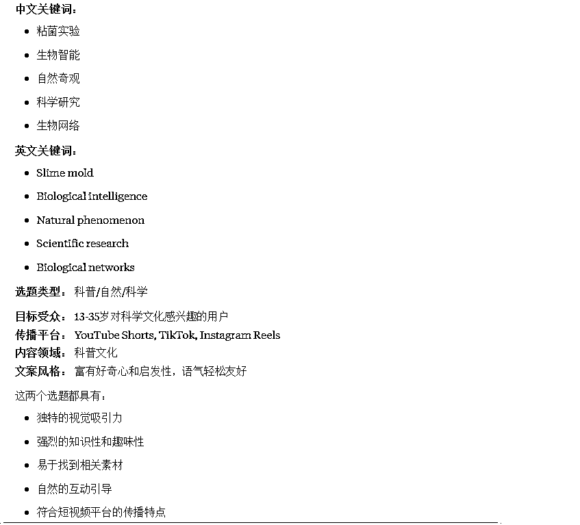

Ok，我给到的数量2，拿到了两套选题，我们先看看，我们想要的素材能不能找到；

重点！！！

拼接类剪辑素材可以直接在YouTube上寻找并且混剪进去，不用害怕，只要你不把原作者的脸露出来，大概率不会有问题，这是合理利用版权，美国版权法第107条允许的事情。

那我们来根据给到的关键词搜索一下有没有相关素材，在配合文案，感受一下是不是那个意思！

#### 第一个选题：

Kintsugi art / 金缮修复

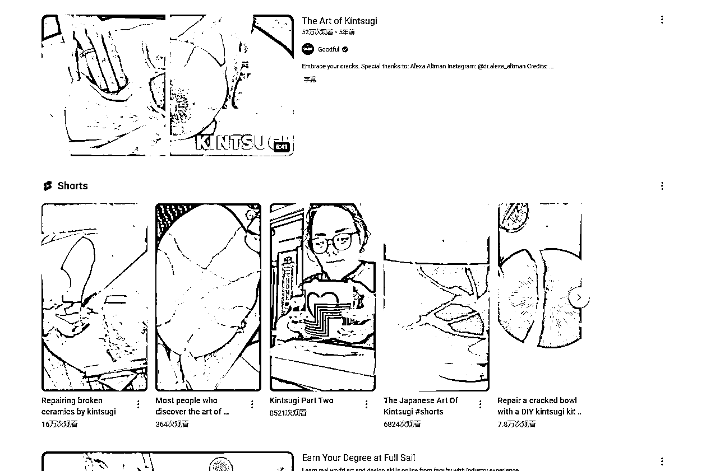

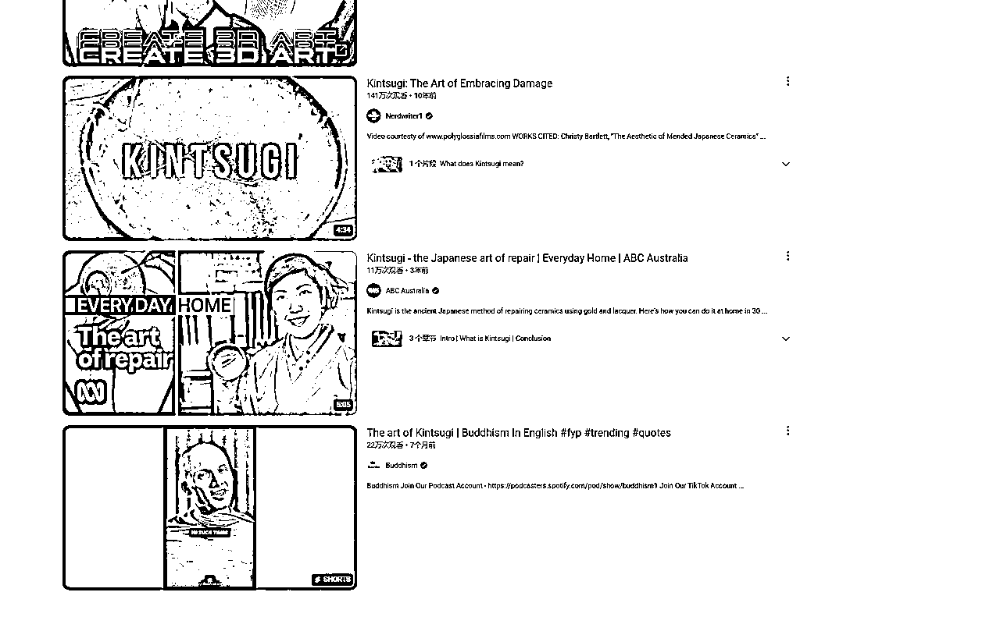

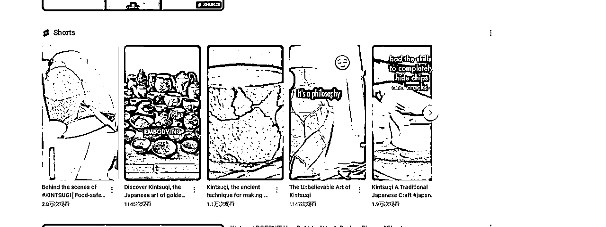

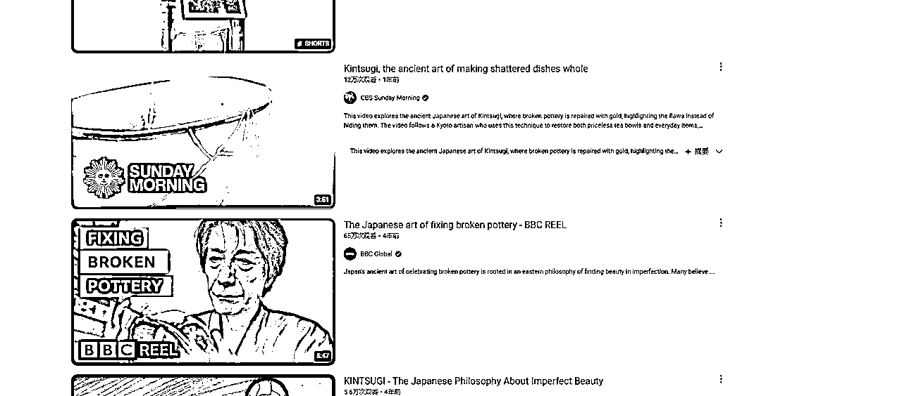

好，不找了，到这里我就知道，这个选题可用，素材有播放量，同类型素材也多，那它这条选题就成立！

#### 第二个选题：

粘菌实验/Slime mold

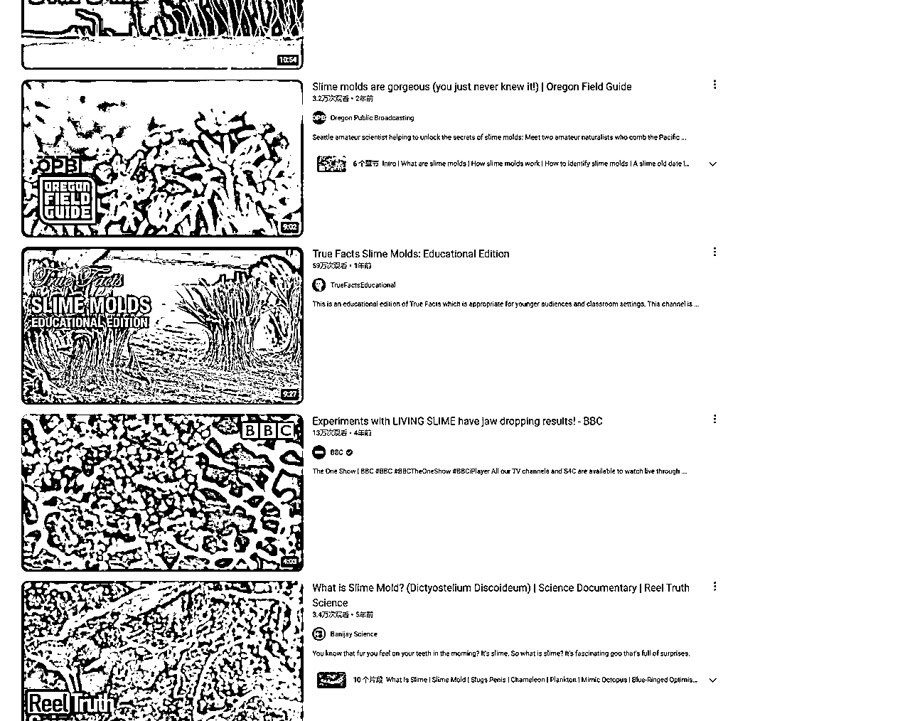

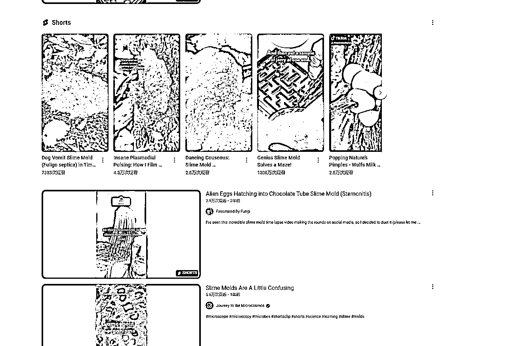

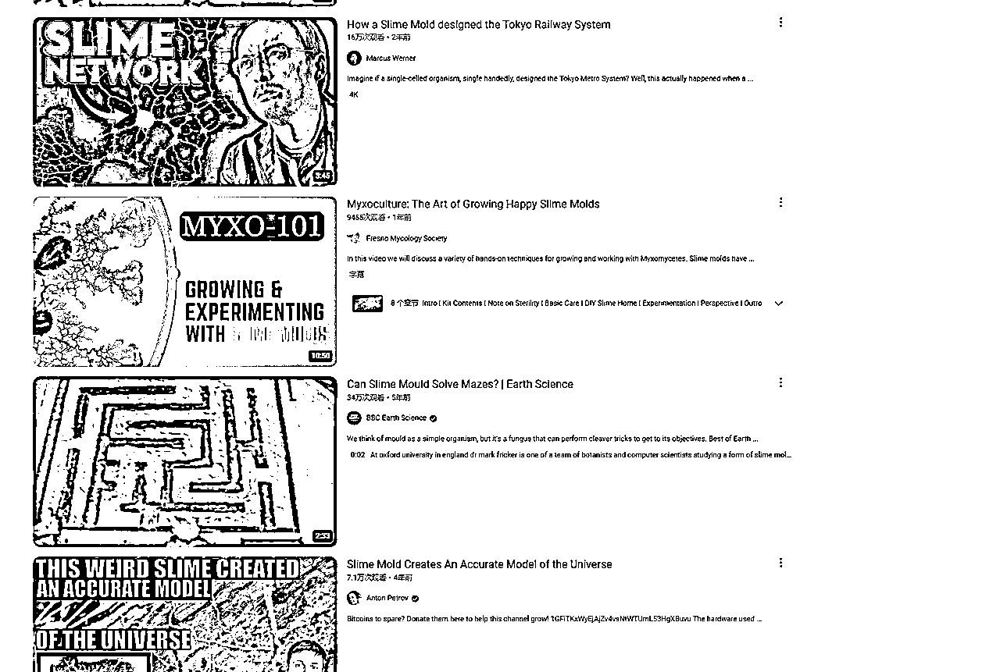

同样的，这个选题也是合格的，那这种选题，我们就可用。

让我们把这两个选题的详细信息存下来。

```
选题1：
主题标题：Ancient Wisdom: The Secret Behind Japanese Kintsugi Art
英文文案：
Have you ever wondered why Japanese people repair broken pottery with gold? This ancient art is called Kintsugi which literally means "golden joinery" Instead of hiding the cracks they highlight them with pure gold or silver The philosophy behind this art is truly beautiful It teaches us that our flaws and imperfections make us unique Each broken piece tells a story of resilience transforming ordinary objects into extraordinary art The process can take weeks or even months to complete but the result is absolutely stunning Some pieces become even more valuable after being repaired showing us that something broken can become more beautiful What do you think about this meaningful art? Share your thoughts in the comments below
中文文案： 
你有没有想过 为什么日本人用黄金来修补破碎的陶器？ 这门古老的艺术叫做金缮修复 字面意思就是"金色接缝" 他们不是要遮掩裂缝 而是用纯金或者纯银把裂缝突显出来 这门艺术背后的哲学非常美 它告诉我们 我们的缺陷和不完美正是独特之处 每一道裂缝都讲述着一个坚韧的故事 把普通物品变成非凡艺术 这个过程可能需要几周甚至几个月才能完成 但最终的效果令人惊叹 有些作品修复后反而更加珍贵 告诉我们破碎的东西可以变得更美 你觉得这门充满意义的艺术怎么样？ 欢迎在评论区分享你的想法
中文关键词：
金缮修复
日本传统艺术
陶器修复
金缮哲学
手工艺术
英文关键词：
Kintsugi art
Japanese pottery
Gold repair
Traditional craft
Ceramic restoration
选题类型： 文化/艺术/手工艺

选题2：
主题标题：Mind-blowing Science: The Hidden Life of Slime Molds
英文文案： 
This bizarre creature is neither a plant nor an animal It's called a slime mold and it's one of the most fascinating organisms on Earth Despite having no brain it can solve complex mazes and puzzles Scientists have discovered something incredible These organisms can remember paths they've taken before even though they don't have any neurons They can find the most efficient routes to food and even create networks similar to human transport systems Some scientists are now using slime molds to help design better transportation networks and solve complex mathematical problems Nature never ceases to amaze us What other mysteries do you think these organisms hold? Let us know in the comments
中文文案： 
这个奇特的生物既不是植物也不是动物 它叫做粘菌 是地球上最令人着迷的生物之一 尽管没有大脑 它却能解决复杂的迷宫和谜题 科学家们发现了令人难以置信的事实 这些生物能够记住它们之前走过的路 即使它们没有任何神经元 它们可以找到通向食物的最有效路线 甚至能创造出类似人类交通系统的网络 现在一些科学家正在利用粘菌 来帮助设计更好的交通网络 并解决复杂的数学问题 大自然永远不会停止让我们惊叹 你觉得这些生物还隐藏着什么秘密？ 欢迎在评论区告诉我们
中文关键词：
粘菌实验
生物智能
自然奇观
科学研究
生物网络
英文关键词：
Slime mold
Biological intelligence
Natural phenomenon
Scientific research
Biological networks
选题类型： 科普/自然/科学

目标受众： 13-35岁对科学文化感兴趣的用户 
传播平台： YouTube Shorts, TikTok, Instagram Reels 
内容领域： 科普文化 
文案风格： 富有好奇心和启发性，语气轻松友好
```

#### 文案二次训练：

好，接下来我们开始文案的二次训练，这次的文案二次进化，我们力求，开头前三秒留住人，具备夸张性开头特点，后面的部分要具备以下特色：口语化，简洁明朗没有废话。

我们把每一次写出来的文案丢进去，来套用模版二次进化：

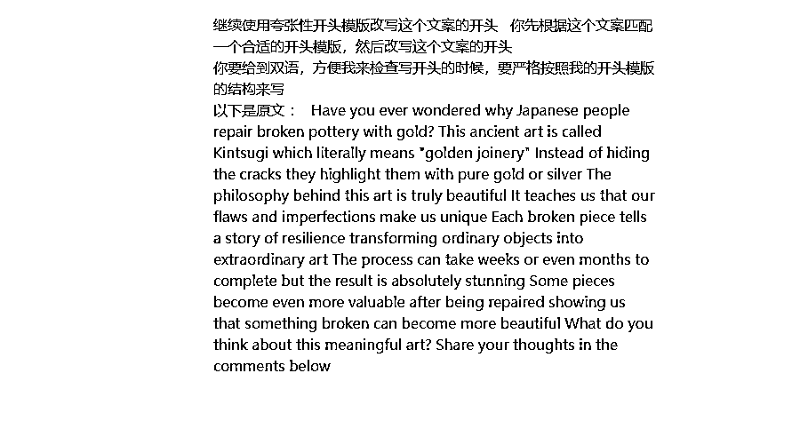

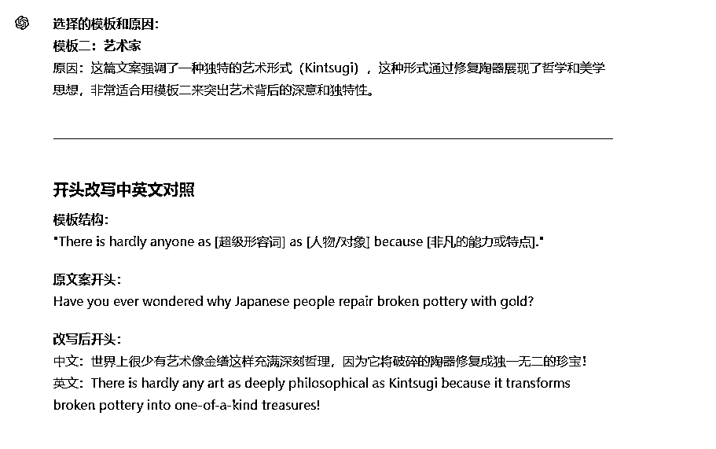

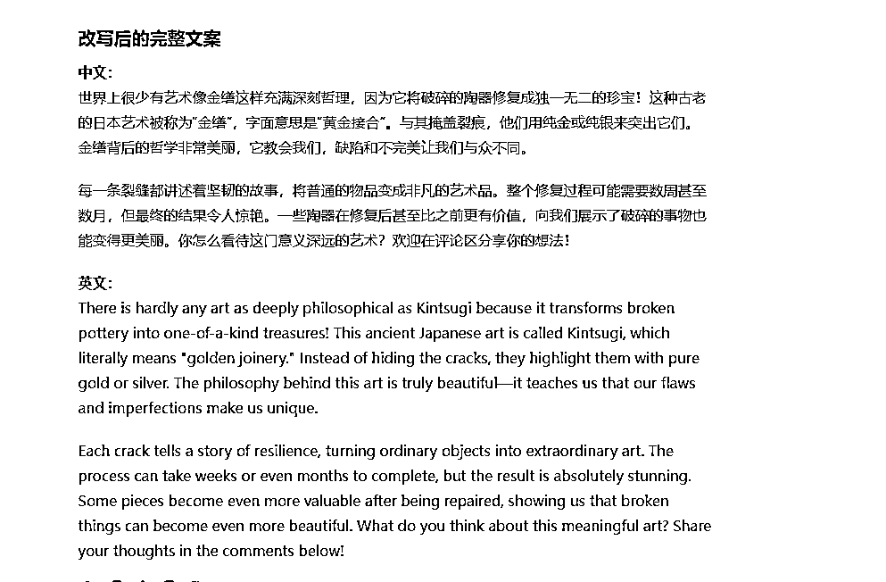

得到了完全体文案：

There is hardly any art as deeply philosophical as Kintsugi because it transforms broken pottery into one-of-a-kind treasures! This ancient Japanese art is called Kintsugi, which literally means "golden joinery." Instead of hiding the cracks, they highlight them with pure gold or silver. The philosophy behind this art is truly beautiful—it. It teaches us that our flaws and imperfections make us unique.

Each crack tells a story of resilience, turning ordinary objects into extraordinary art. The process can take weeks or even months to complete, but the result is absolutely stunning. Some pieces become even more valuable after being repaired, showing us that broken things can become even more beautiful. What do you think about this meaningful art? Share your thoughts in the comments below!

完全体中文：

几乎没有任何艺术像金木一样具有深刻的哲学意义，因为它将破碎的陶器变成了独一无二的宝藏！这种古老的日本艺术被称为金木，字面意思是“金色细木工”。他们用纯金或纯银突出裂缝，而不是隐藏裂缝。这种艺术背后的哲学是真正美丽的——它。它教导我们，我们的缺陷和不完美使我们独一无二。

每一个裂缝都讲述了一个坚韧的故事，将普通物品变成非凡的艺术品。这个过程可能需要几周甚至几个月才能完成，但结果绝对令人惊叹。有些作品在修复后变得更加有价值，向我们展示了破碎的物品可以变得更加美丽。你对这种有意义的艺术有什么看法？在下面的评论中分享你的想法！

第一次的文案：

你有没有想过 为什么日本人用黄金来修补破碎的陶器？ 这门古老的艺术叫做金缮修复 字面意思就是"金色接缝" 他们不是要遮掩裂缝 而是用纯金或者纯银把裂缝突显出来 这门艺术背后的哲学非常美 它告诉我们 我们的缺陷和不完美正是独特之处 每一道裂缝都讲述着一个坚韧的故事 把普通物品变成非凡艺术 这个过程可能需要几周甚至几个月才能完成 但最终的效果令人惊叹 有些作品修复后反而更加珍贵 告诉我们破碎的东西可以变得更美 你觉得这门充满意义的艺术怎么样？ 欢迎在评论区分享你的想法

当然第一次也挺好，那是因为我给到的语料和训练模型是我夸张性开头的模版，所以它自带了一些属性。

当然你可以凝练其他模版套用进去，模版话的文案输出，源于你的语料如何训练，这个是另一门技巧，在这里就不讲了，如果不知道怎么训练，直接使用我的模版皆可点击跳转，以下是套用不同模版展现：

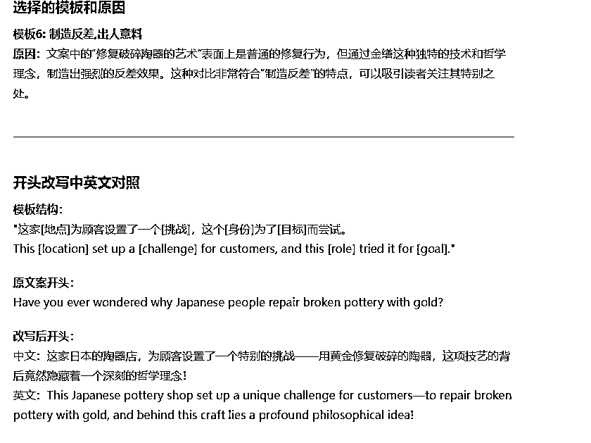

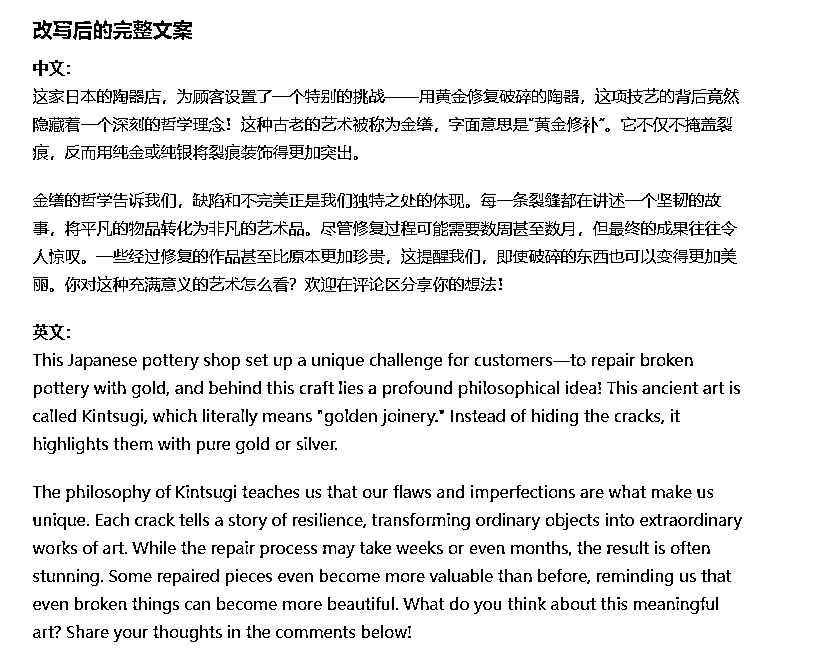

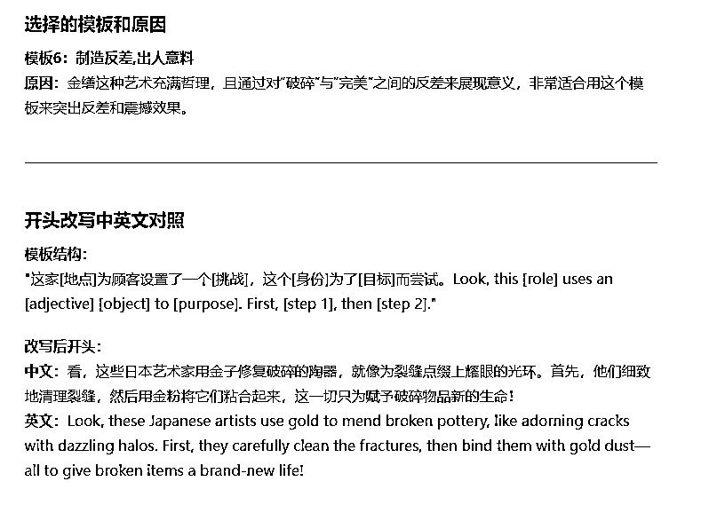

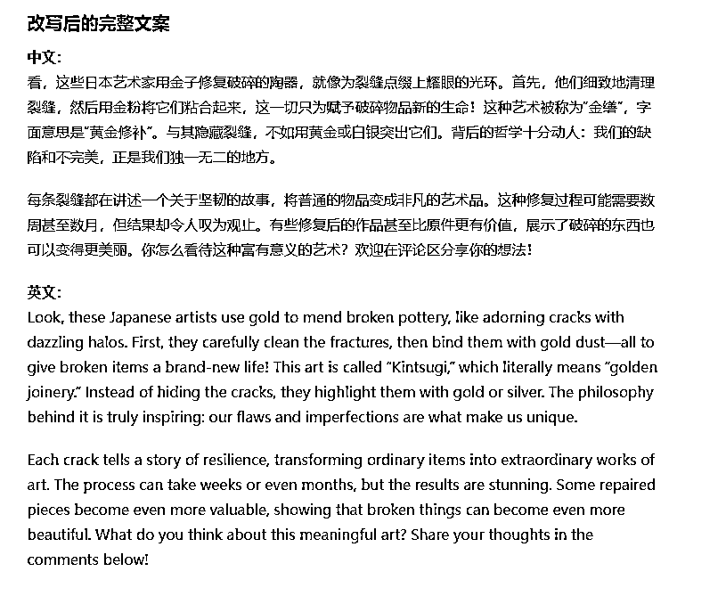

通过不同的模版，我们就能拿到不一样开头文案。

拼接类素材的选择，我们有2点需要注意：

1.  长视频也可用，在长视频中，某一个亮点片段下载下来单独裁剪。

1.  在YouTube中搜索寻找素材的时候，可以不用点进去视频，鼠标放在视频上，它会有预览，下方也有进度条，可以通过这个拉动进度条看看这个长视频是否是自己需要的，节省点进去在开广告跳过的时间。

好，拼接类解说正练文案的讲解基本上就这些了，通过选题寻找视频素材的方法，我会单独讲解，点击这里跳转。

## 逆练：

逆练拼接类解说文案很简单，你只需要完成一下工作:

1.  寻找对标，拔下来他的视频，

1.  转录成英文

1.  模版套用文案

1.  AI配音

1.  寻找素材

1.  完成剪辑。

那么我们来实操一下（正练和逆练的剪辑手法是一样的，放在一起讲解）：

### 1.扒视频

这个视频：

https://youtube.com/shorts/QgqNKSIrmek?si=mji-5NjxtdkIkCFe

### 2.转录成英文

```
How high is the temperature of seemingly ordinary steel coils? An interesting phenomenon occurred when throwing snowflakes into the steel coils. The snowflakes evaporated instantly. In fact, these steel coils that seemed cold were just produced by the factory. The temperature was 3000 Fahrenheit. After cooling a bit, these hot steel coils are placed outdoors to let them cool naturally. The freshly baked hot rolls are still hot after being stored in the warehouse for several days.
```

可以使用飞书妙记，也可以使用其他的Ai转录工具，功能实现即可，这个不过多描述了。

### 3.改写

原文：

How high is the temperature of seemingly ordinary steel coils? An interesting phenomenon occurred when throwing snowflakes into the steel coils. The snowflakes evaporated instantly. In fact, these steel coils that seemed cold were just produced by the factory. The temperature was 3000 Fahrenheit. After cooling a bit, these hot steel coils are placed outdoors to let them cool naturally. The freshly baked hot rolls are still hot after being stored in the warehouse for several days.

English Version:

If you threw snowflakes at steel coils, would you expect them to instantly vanish? What appears to be ordinary steel coils harbor an astonishing secret: they're scorching hot. When snowflakes make contact with these industrial giants, they don't just melt - they instantly evaporate into thin air. These seemingly cold metal coils actually just rolled off the production line, boasting temperatures of around 3000 Fahrenheit. Even after being moved outdoors for natural cooling, these industrial behemoths retain their intense heat. Days later, when stored in warehouses, these freshly manufactured coils still radiate significant warmth from their recent birth in the factory.

改写后中文:

如果你把雪花扔向钢卷，你觉得它们会立即消失吗？看似普通的钢卷却隐藏着一个惊人的秘密：它们烫得吓人。当雪花接触到这些工业巨人时，不仅仅是融化 - 而是瞬间蒸发在空气中。这些表面看起来冰冷的金属卷材其实刚刚从生产线下来，温度高达华氏3000度。即使被移到户外进行自然冷却，这些工业庞然大物仍然保持着强烈的热量。几天后，当它们被存放在仓库里时，这些新生产的钢卷仍然散发着来自工厂诞生时的显著热量。

#### 改写模版：

编号-开头写法-开头写法总结-开头类型-文案结构文案总结

1.This is freeze branding in which such unique tattoos are made on the body of animals using liquid nitrogen technology.

直接介绍技术和作用-说明型/描述型开头-介绍技术→比较旧新方法→强调人道主义-介绍冷冻烙印技术，对比传统烙印方法，突出人道考虑。

2.There is hardly anyone in this world as talented as this guy from China because he can turn any natural material into a unique art.

通过夸张修饰引发好奇心-引人入胜的夸张型开头-引入人物→描述使用的材料→展示艺术成果-介绍艺术家和他使用自然材料创作的独特艺术。

3.Why do Chinese people apply such white powder on their fruits? Like what is the reason behind it?

提出问题引起好奇心-疑问性引入-提问→介绍视频内容→解释粉末用途-介绍果物上的白色粉末（Kaelin powder）的用途和好处。

4.If you make tattoo, then this thing can happen to you.

预示可能的后果引起关注-警告性引入-提出可能的问题→解释后果→提供建议-讲述纹身后的护理和可能的后果，给出建议。

5.Due to the lack of front teeth in egg-eating snakes, they can swallow eggs that are five times bigger than the size of their mouth.

描述不寻常的自然现象-说明型/描述型开头-描述生物特征→解释行为→提出问题-介绍蛋食蛇的特殊能力和可能的问题。

6.This is the world's most easiest job in which you have to do nothing but keep eating all the day.

描述轻松有趣的职业-引人入胜的夸张-描述工作→提出条件→描述互动和报酬-描述一个独特的职业（模仿孙悟空）和它的工作内容。

7.This is world's most disgusting egg recipe, which is known as virgin boy egg.

强烈形容词引起注意-引人入胜的夸张-描述食谱→详细过程→引发观众反应-介绍一种使用小男孩尿液制作的争议食品。

8.You will be surprised to see the talent of this girl from China because this girl balances her body on this thin rope so comfortably.

预示即将展示的惊人才能-预告性引入-引入人物→描述技能→展示信心和挑战-展示一位女孩在绳子上表演的技巧和勇气。

9.When a clip is put on the back of a cat's neck, it becomes so calm as if the soul has left its body.

描述一个奇特现象引起兴趣-说明型/描述型开头-描述行为→解释反应→提供背景信息-介绍“猫咪夹心术”及其效果。

10.Japanese trains are very busy in the morning because everyone is going to their jobs.

描述一个典型的社会现象-说明型/描述型开头-描述情况→详述角色和功能→文化描写-描述日本列车上的拥挤情况和站务员的工作。

### 4.文案配音

点击跳转

AI配音不再过多赘述，很多方法都是复用。

那在跑完这些流程以后，我们会得到这些东西：

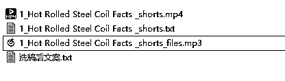

分别是原视频，原文，改后文，配音文件。

### 5.根据文案寻找素材:

跳转寻找素材核心方法板块，不再讲解。点击跳转

## 剪辑(正练和逆练)：

好，我们拿逆练出来的一套素材来举例，在剪辑前，我们需要准备好所有素材，原视频，原文，改后文，配音文件，以及寻找到围绕选题的视频素材。

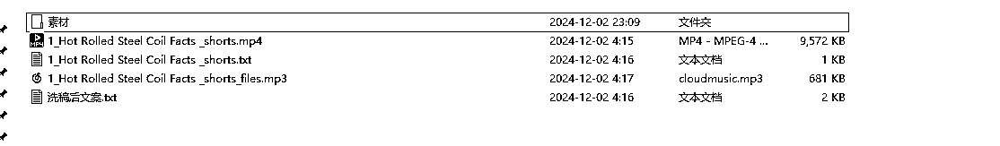

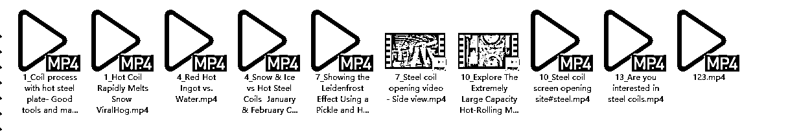

视频素材最好准备5-10个，方便剪辑，并且未来如果这个选题爆炸了，你还可以多次通过素材拼接成为新的视频，一个选题多次利用，我们把这些素材全部放进cupcat里面。

### 剪辑开始

#### 1.导入音频，并且识别字幕

导入音频的时候，切气口。

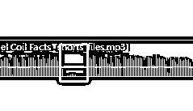

#### 2.根据音频每句话的气口，添加对应画面

识别字幕以后，根据每句话来做一个分割

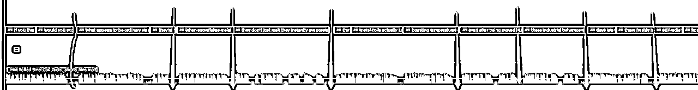

那么在我们分割的这些地方，就是可以插入我们对应的画面。

在处理画面的时候，我们可以使用一下技巧：

1.  镜像

1.  加减变速

1.  智能调色（曲线调整，锐化等）

1.  放大缩小选框

1.  如果是长视频，素材清晰，可以直接拉成竖屏（如果拉完以后主体还存在），或者拉成4比5，做画中画效果

1.  如果觉得原素材的音效能提升视频的感觉，可以放出来一些。

做好如下：


#### 3.画面间隔做转场特效+转场音效

可以做转场特效，也可以做视频的入场特效

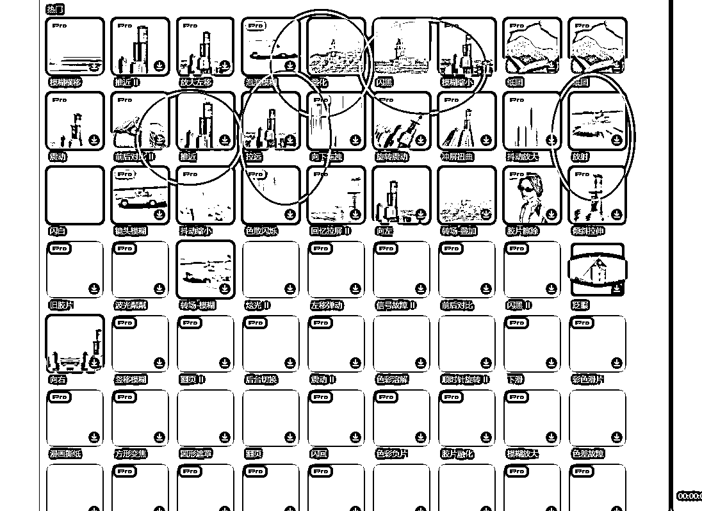


#### 4.调整字幕特效

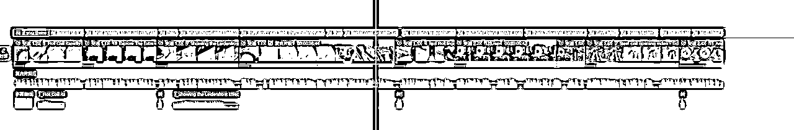

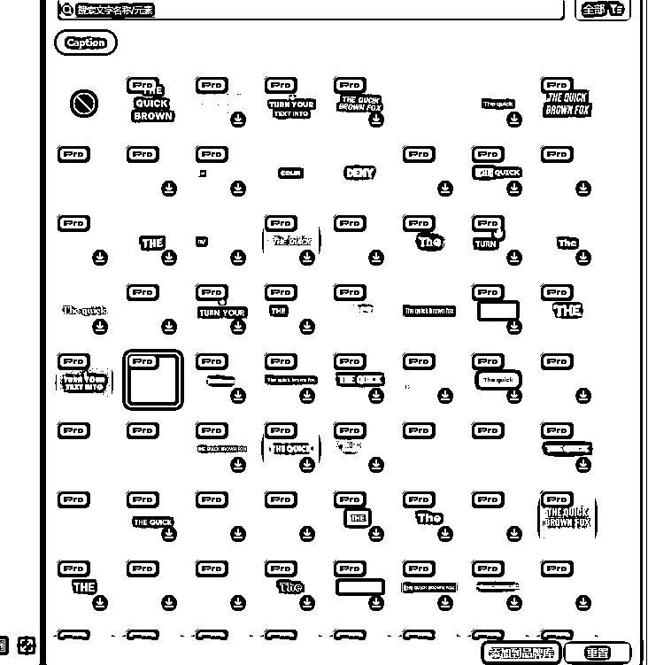

#### 5.导出成品

校对没问题，可以直接导出成品.

原视频→逆练成品

# 爆款视频解说：（原视频解说）

爆款视频解说也叫原视频解说，在操作手法上，是以爆款视频深度二创去重，或者一个博主的多个视频剪辑在一起的创作手法。它的好处是你借鉴的都是爆款的视频，经过你的二创去重以后再次跑了一遍，那你的流量也会相对来更加的好，但它的缺点也很明显，当你遇到这个小气的博主，他可能会过来diss你，版权警告你，要你赔偿删掉视频之类的情况。所以在我们选择爆款视频的时候，要么不以人物为主体，要么以国内的爆款素材为主体，这样避免了很多的风险。

爆款视频解说在素材收集以及剪辑手法上和科普解说非常类似，只是一些小细节略微有差异。所以重复的内容就不在讲了，主要讲一下不同区别的操作。大概是正练的描述手法，以及文案模版，和剪辑的时候不同的操作细节。

文案训练策略，正练就不需要AI给你出选题， 你需要寻找爆款视频，点击这里给到了一些寻找爆款素材的方法。

## 正练：

通过爆款素材，手动去写描述词，或者根据之前我拆解AI赛道时使用的工具，把视频抽出来图片，挨个发给GPT或者克劳德，让他描述整体情节，在套用解说词模版，完成文案二次进化。

详情参考:

https://yemahuyou.feishu.cn/docx/A08RdxpbZoJCqjxDwDxc2PIDnmc#share-ZOcydNDfsoxaQcxco5UcKCPwnYb

场景拆解工具使用：点击这里

### 爆款视频解说词模版：

## 逆练：

同上 科普解说逆练工作流：点击这里跳转

## 剪辑：

### 剪辑原视频解说你需要准备以下素材：

1.  改写后中文文案

1.  对标视频的原视频素材

1.  改写后配音

我们以这个对标视频来举例（爆款视频解说对标高播放视频）：

原视频文案：

This little boy wants to buy this cake, but when he puts his hand in his pocket, he realizes he doesn't have enough money. Feeling very sad, he starts to leave the cake shop. Just then, a woman calls him over and asks what happened. The boy shows her the cake he likes and says he doesn't have enough money. She feels sad. After thinking for a moment, she takes out a card and changes the price of the cake so the boy can buy it. The boy is very happy and gives her the money. Then, the woman gives him the cake, but it's not actually for him. It's for his grandfather, whose birthday is today. The woman deserves at least one like. But sadly, no one has liked or subscribed to her yet.

改写后英文:

Look at this kid's heartbreaking attempt to buy a cake. First, he eagerly reaches into his pocket, then his face falls in disappointment. As he turns to leave the store empty-handed, a kindhearted woman calls him over, inquiring about his situation. The boy shows her the cake he desires but lacks the funds to purchase. Moved by his plight, she takes a moment to ponder before pulling out a card and altering the cake's price, enabling the boy to afford it. Overjoyed, he hands her the money and receives the cake, which is revealed to be a birthday present for his grandfather. This woman's compassionate act is worthy of at least one like, yet sadly, her kindness has gone unrecognized, with no likes or subscriptions to her name.

改写后中文:

看看这个小男孩令人心碎的尝试去买一个蛋糕。首先,他急切地把手伸进口袋,然后他的脸因失望而沮丧。当他空手转身准备离开商店时,一位善良的女士把他叫过来,询问他的情况。男孩向她展示了他渴望得到但却没有足够钱购买的蛋糕。被他的困境所感动,她花了一点时间思考,然后拿出一张卡片,改变了蛋糕的价格,让男孩能够负担得起。欣喜若狂的他将钱交给她,拿到了蛋糕,而这个蛋糕原来是他爷爷的生日礼物。这位女士富有同情心的举动值得至少一个赞,然而遗憾的是,她的善举却没有得到认可,没有人给她点赞或订阅。

改写后配音：

### 开始剪辑：

#### 1.导入音频，并且识别字幕

导入音频的时候，切气口。


#### 2.导入原视频做处理：

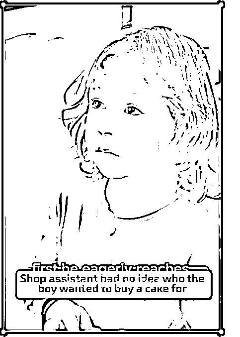

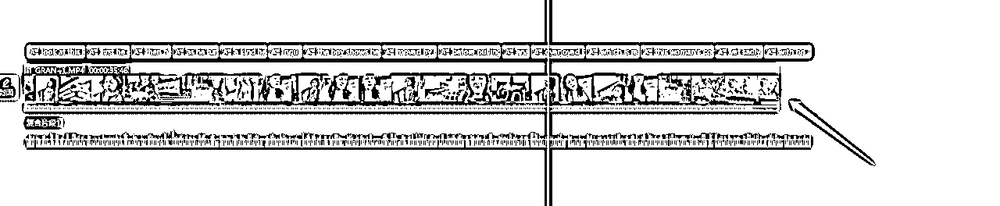

你会发现有时候轨道不同，你的解说词可能会多，也可能比原视频的时间轴少，那么你就可以调慢原视频的速度，或者把一些片段反复复制一下镜像倒放补充时长，或者通过类似片段代替，比如弄一些空镜头之类的，如果遇到原视频时长过多，可以删减片段，或者加速匹配音频。

##### 处理原视频：

首先对原视频进行智能场景分割，并且选择镜像，然后挨个对每个片段进行局中显示摆放在画布的中央，一些字体符号，可以通过裁剪的方式去除，然后对整个视频进行画中画的效果，也就是背景填充-模糊。

比如这个：

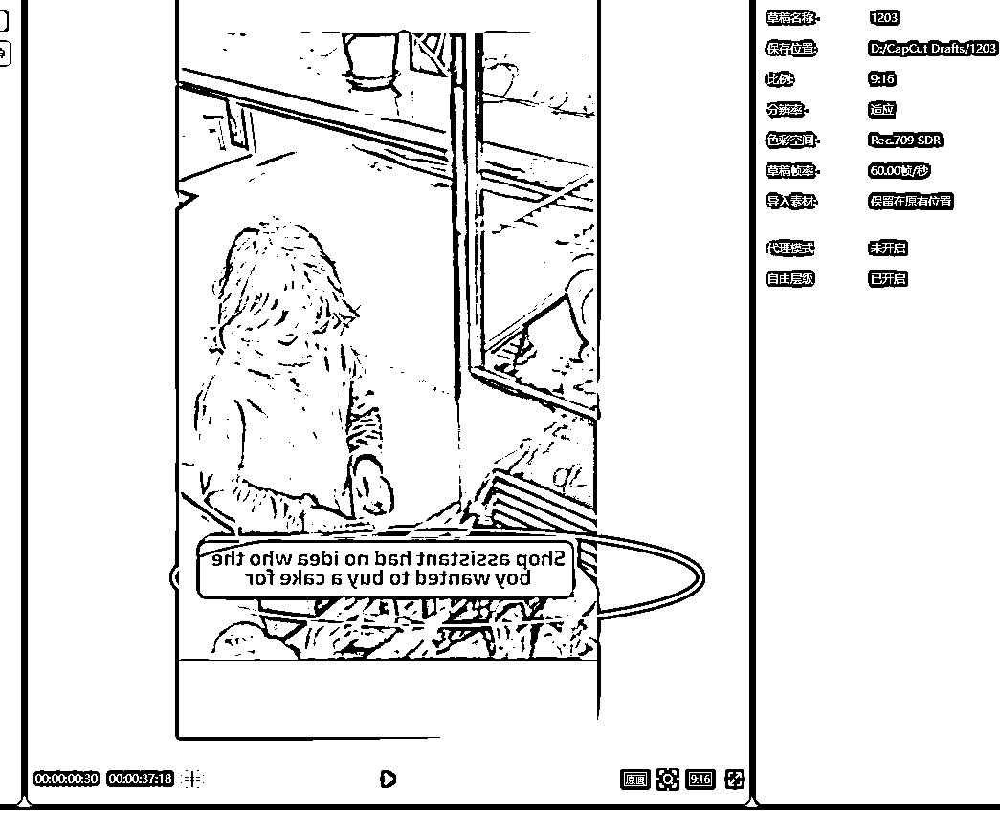

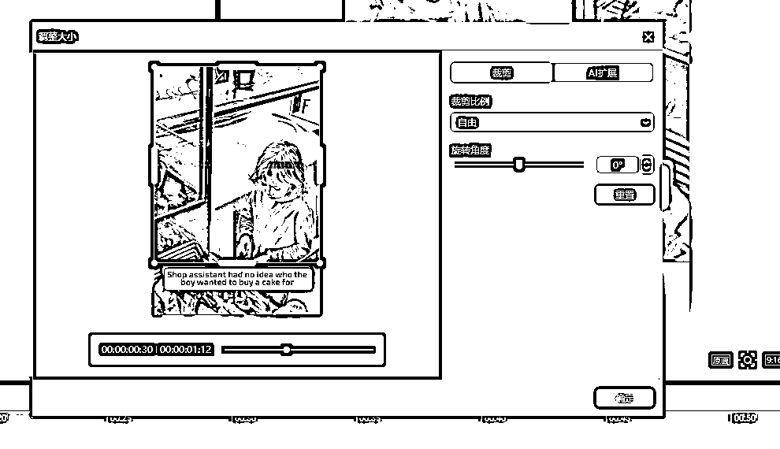

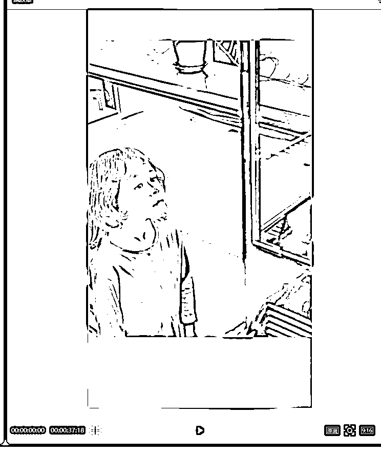

全部处理完以后，创建复合片段调整对齐音频时间轴，通过加减速的方式。


#### 3.给复合片段智能调色

*   智能调色（曲线调整，锐化等）

*   锐化参数

*   色温饱和度色调

*   曲线-亮度-红色通道-蓝色通道-绿色通道

*   如果觉得原素材的音效能提升视频的感觉，可以放出来一些。

#### 4.调整字幕特效

这个就是原素材视频解说的重点，因为原素材，你要通过这个视频深度混剪，那么大量使用这个素材的创作者，会遇到0播的问题，就是没有过重，那么字幕特效就是很好的过重方式。所以字幕特效是至关重要的，我们尽量在字幕特效上下功夫，可以根据每句话手动添加一些emjio表情包。

##### 4.1 手动添加emjio表情包

这里推荐这个网站，能够满足你所有emjio的需求：

https://emojis.sh/

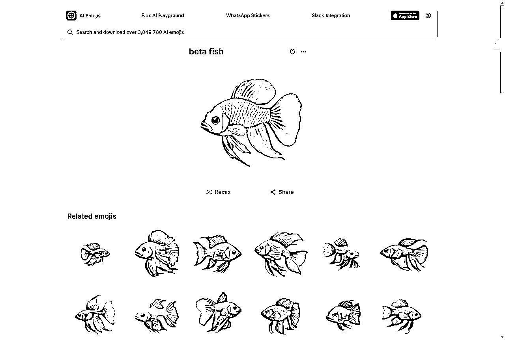

通过文案可以丢给AI提炼出来每句话emoji的关键词，然后对应下载，别觉得麻烦，当你emoji素材足够多的时候，你就不需要了在下载了，因为你原有的库足够你使用了。

##### 4.2 通过capcut字幕特效完成emoji表情


这几种都属于emoji表情字幕特效，他会根据文案自动分配一些表情包添加在字幕上端。


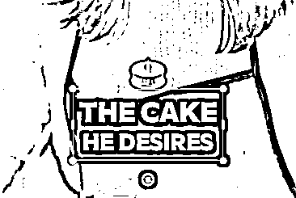

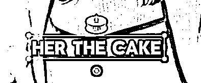

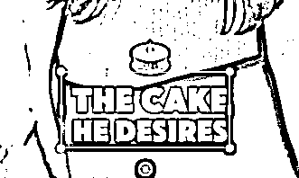

##### 5.导出成品

对标视频→逆练成品

那么以上就是爆款视频解说也就是原视频解说的全部操作手法。

# 寻找素材的核心方法

在我们寻找素材的时候，这几个方法很方便：

## 平台主动搜索关键词

### 1.1 根据文案，丢给GPT或者其他类型AI，总结关键词，寻找素材，首选YouTube！

为拼接类视频，也就是科普视频量身定做，通过关键词，很容易就能找到类似选题的视频素材，库库下载就好。

首先，我们先来提炼关键词，用于我们寻找素材! 我们以刚才逆练的文案来举例！点击跳转

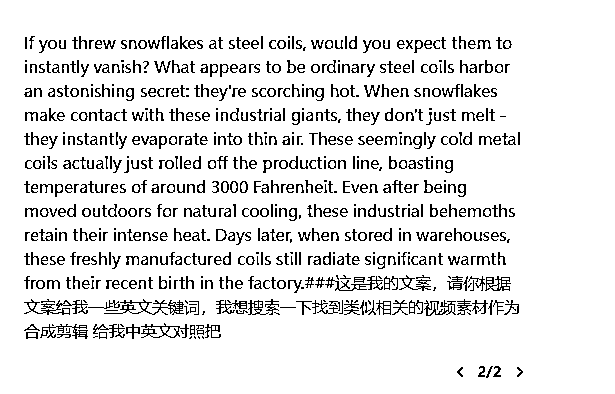

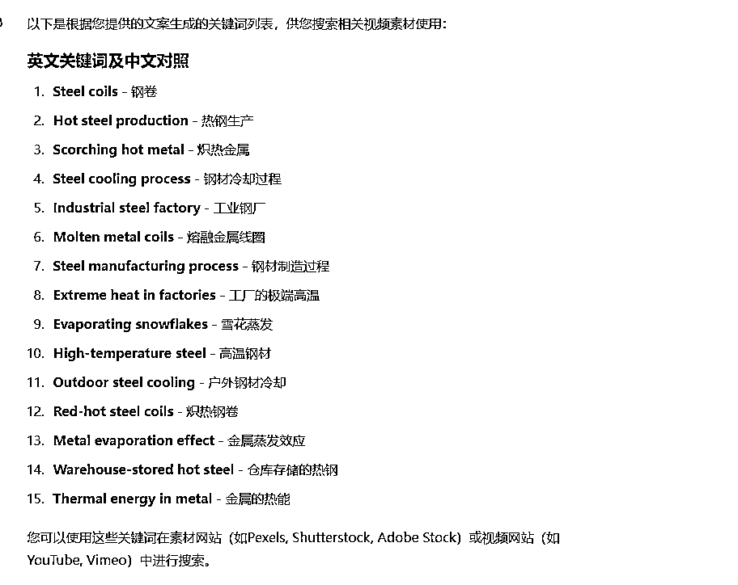

```
Steel coils钢卷
Hot steel production热钢生产
Scorching hot metal炽热金属
Steel cooling process钢材冷却过程
Molten metal coils熔融金属线圈
Steel manufacturing process钢材制造过程
High-temperature steel高温钢材
Red-hot steel coils炽热钢卷
Metal evaporation effect金属蒸发效应
Warehouse-stored hot steel仓库存储的热钢
Thermal energy in metal金属的热能

If you threw snowflakes at steel coils, would you expect them to instantly vanish? What appears to be ordinary steel coils harbor an astonishing secret: they're scorching hot. When snowflakes make contact with these industrial giants, they don't just melt - they instantly evaporate into thin air. These seemingly cold metal coils actually just rolled off the production line, boasting temperatures of around 3000 Fahrenheit. Even after being moved outdoors for natural cooling, these industrial behemoths retain their intense heat. Days later, when stored in warehouses, these freshly manufactured coils still radiate significant warmth from their recent birth in the factory.

如果你把雪花扔向钢卷，你觉得它们会立即消失吗？看似普通的钢卷却隐藏着一个惊人的秘密：它们烫得吓人。当雪花接触到这些工业巨人时，不仅仅是融化 - 而是瞬间蒸发在空气中。这些表面看起来冰冷的金属卷材其实刚刚从生产线下来，温度高达华氏3000度。即使被移到户外进行自然冷却，这些工业庞然大物仍然保持着强烈的热量。几天后，当它们被存放在仓库里时，这些新生产的钢卷仍然散发着来自工厂诞生时的显著热量。
```

好，我觉得这几个有用，我们来根据文案去寻找合适的素材。

从第一个开始搜：Steel coils

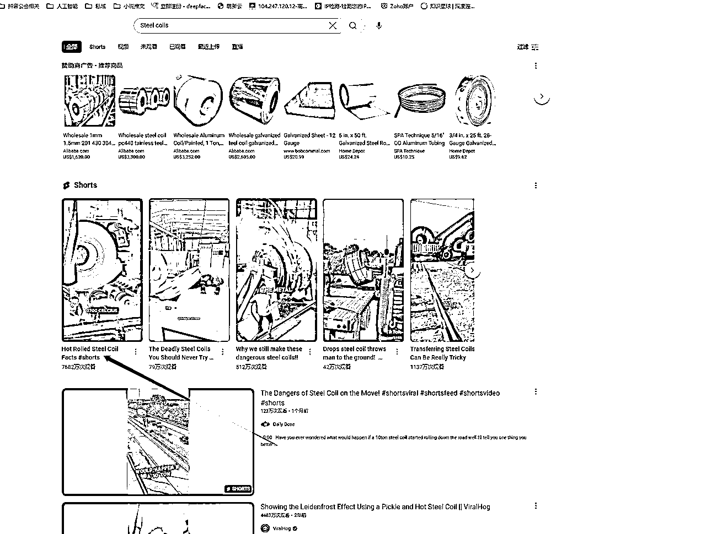

直接就发现了这个对标视频是不？ 但是这个搜索词不太对，讲的是刚下生产线的金属卷材。那我们跳过这个词。

但我发现这个词还是不对，AI提炼的关键词有问题，讲到的是雪花以及下生产线的钢卷，那我先不修改提示词，我先尝试根据原文直接复制第一段话，看看能不能找到强相关的选题视频素材。

### 1.2 直接搜索文案第一段

If you threw snowflakes at steel coils

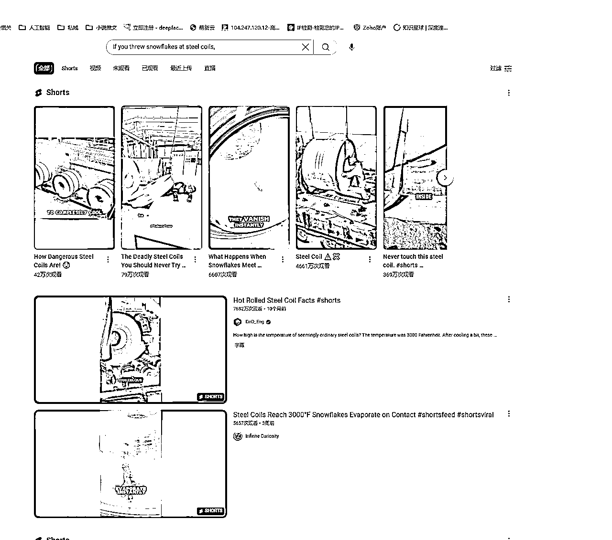

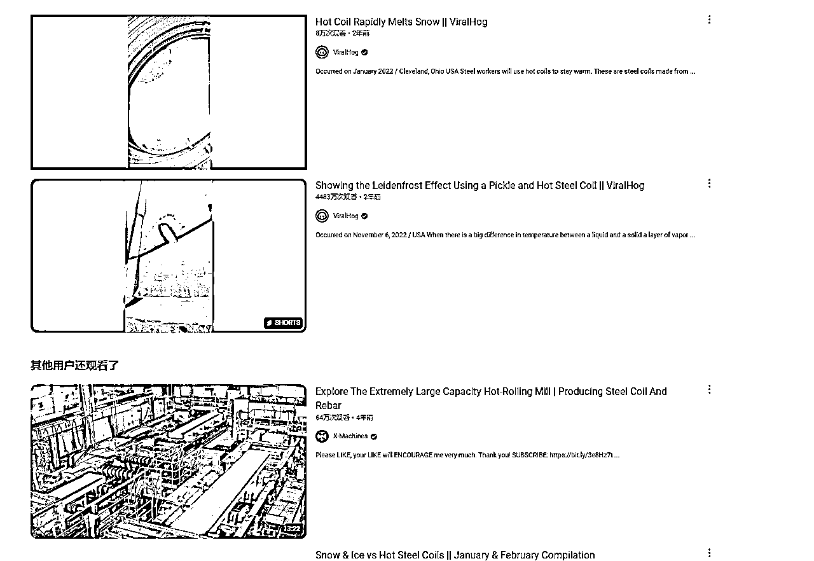

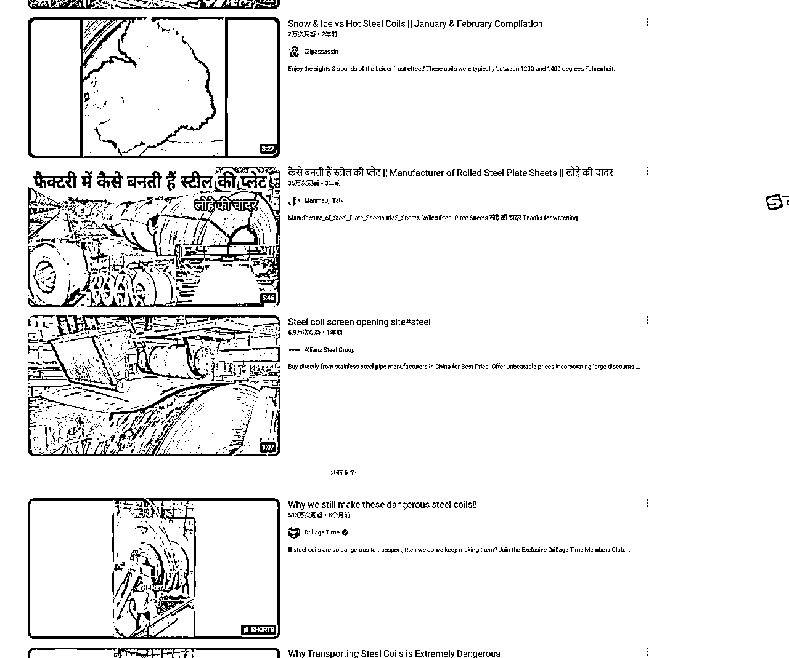

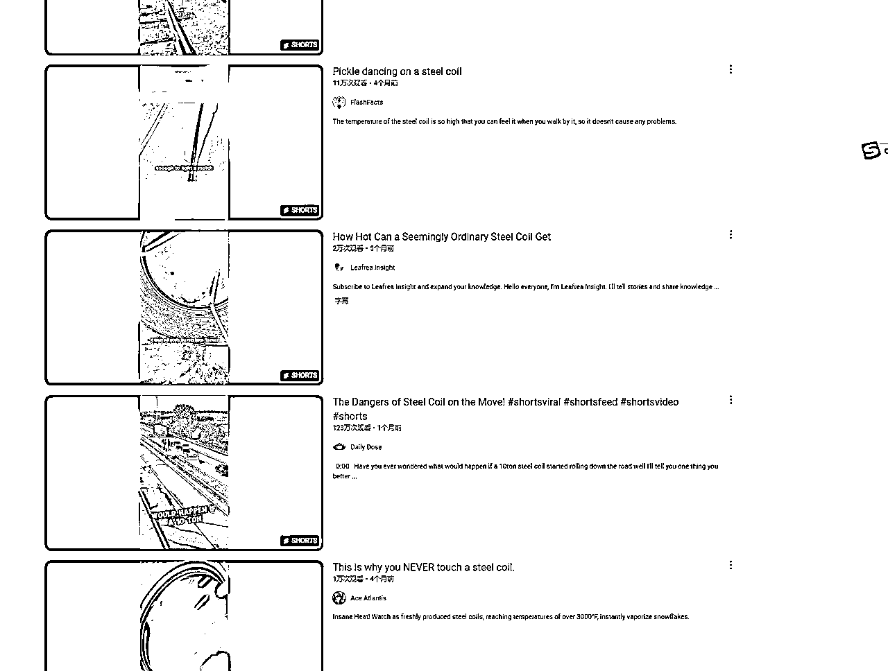

好，那这个方法很有效，我发现了雪花融化，以及高温钢卷的内容，那我就开始收集这些视频。

我一共找到了这些素材，但他并不能足以支撑我剪辑整个片段。


毕竟配音文件44秒，我担心不够，所以我还需要其他拓展词，来搜索没有那么强相关的素材，比如热钢卷，冷却钢卷，熔炼钢卷等等，那么我可以回到搜索关键词1.1，让GPT给词，或者我们直接中文翻译成英文直接搜索。

我通过关键词搜索不到我想要的视频素材怎么办，比如这个：

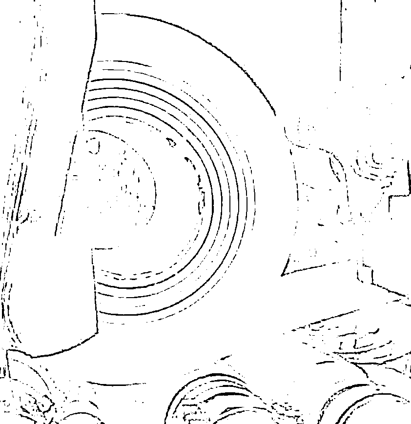

看起来很好看，我就特别想要。 那我就可以使用第二个方法，点击这里

## 国外根据谷歌强大的识图功能，国内根据百度识图寻找。

为原视频解说，也就是爆款视频解说量身定做，你通过关键词有时候很难找到这个原视频，那这个就是很大的助力。

我们延伸到刚才这个部分，我想要这个视频，通过视频中这个画面截图，丢给谷歌识图让他去帮我找。

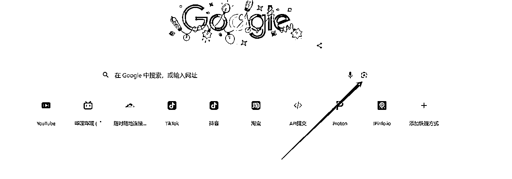

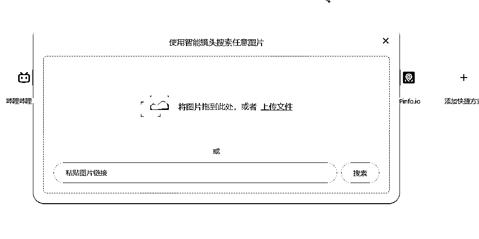

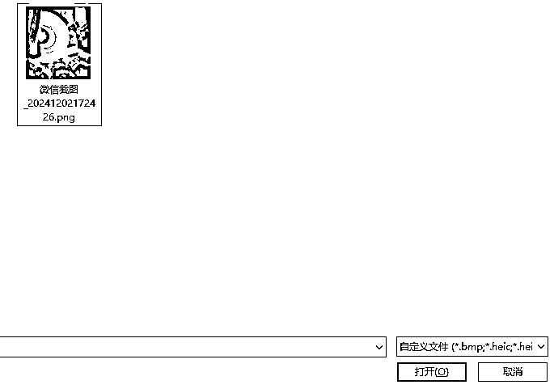

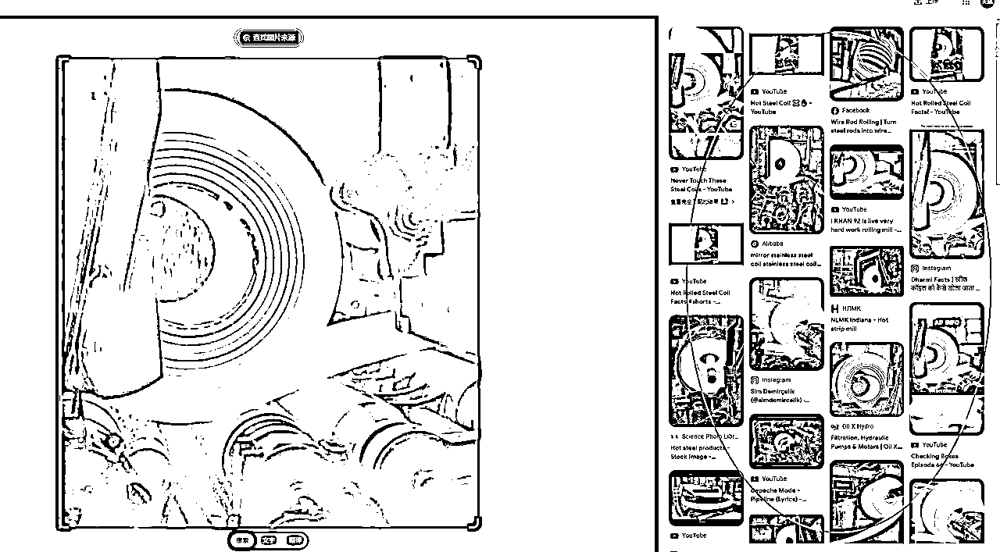

那这里面，你就能找到很多素材，但有一些还是同行的解说，尽量不去选择他们里面的素材，除非真的没有了，找不到了，再用同行的视频素材中一部分抽取出来。

比如我发现了这个，


我觉得它很不错，可他是一个购物站，一些平台解析接口没办法找到这个视频下载，那我可以尝试右键点击源代码，ctrl+f，搜索.mp4，我看到了这个，然后我复制单独打开看看是不是。


很好，是我想要的东西，就找到了。这是一种方法，当然更多的是通过这个谷歌识图来寻找到原素材。

方法给你了，具体如何找到，看你对这个技巧的理解。

如何下载，针对平台，比如推特，INS，TIKTOK，YT，最简单的方法:

谷歌搜索，平台+在线解析，放进去链接就可以了。

## 通过对标视频中暴露的信息来获取

有些在对标视频中已经暴露出来，他们为了不被原博主找事情，主动做@原博主的视频，或者有一些在评论区会有人提到这个是XXXX，那么可以根据这些信息去找到这个博主。

1.  标题以及描述说明中

1.  评论区


# 二创本源-站外素材获取

我们做的是Shorts，它属于YouTube，那除了这里，其他的平台都属于站外，国内抖音，快手，海外推特，INS，TIKTOK，都是你可以获取到的视频来源，你要建立自己的素材库，比如，做爆款视频解说，你就要抢爆款视频的二创首发机会，做拼接类解说，你就要收集同类型题材的素材。

相信我，初期很难，当你构建好这些体系，制作这两种赛道的内容，简直不要太简单。

那么，这里讲解一下大概步骤：

先建立平台采集的根据地，比如，我先锚定TIKTOK，推特，INS，这三个平台，复选国内抖音，快手。国内的素材大部分加入的文字很多，你在去重去水印方面很麻烦。

这里的分支要先了解赛道属性，爆款视频解说，它很多和事物，人物相关，那么使用海外的人物视频素材做解说就会面临侵权的风险，你的视频爆炸了，遇到小气的他会过来找你的麻烦，你会收到版权警告删除，找你赔偿等等。那我如果做爆款视频解说，我优先选择国内的爆款视频素材，这样能降低更多的风险。

对于科普解说而言，拼接类素材去重，合理利用版权基本上是允许的，所以基本上不会有任何的版权风险，获取素材的源头就可以首选海外平台。

举例:

推特：

比如我想做爆款视频内容(排除人物这种素材)，那我先确定一个搜索内容，Animals，OK我在Top里面发现了它，


200多万播放的一个视频，先别着急拿它的视频，先看看它是不是同行。


OK，我们可以判定它也是内容创作者，也是个二创，以温馨动物，治愈系为主，那我们二话不说上来就一个关注点赞。诸如此类，再继续挖掘更多的作者。


那如果你的爆款视频账号选题大部分都是动物类型，这种账号就是你源源不断的能源。

当你关注了大量的这样的账号。第二天你在打开主页推荐，你的推荐习惯会给你带来更多新的内容素材的作者。

不同的平台属性推流的机制和用户行为习惯也不同，所以很多内容在Shorts里面可能它就没有！

那你还不二创在等什么？市场已经给你验证过的素材，不冲对不起自己的。

TIKTOK和INS：

这里重灾区，和YouTube shorts高度相似，尽量少选择，可以用作补充素材，或者根据推荐逻辑找到了相关作者，监控他，抢二创首发权，那就好很多。

搜索关键词，关注同类型账号，休息一会儿或者第二天在通过推荐页面刷新找到更多同类型账号，最好新号，容易建立信息茧房，不要用网页刷，刷不出来的，用手机刷，你在国内做抖音怎么找对标，这里同样适用。

建立素材库这个东西，不在过多讲解，千人千面，每个人获取资源以及网感不同，看能力，看韧性。

# 本篇结束，希望学有所成，可以实践起来，不枉辛苦付出。