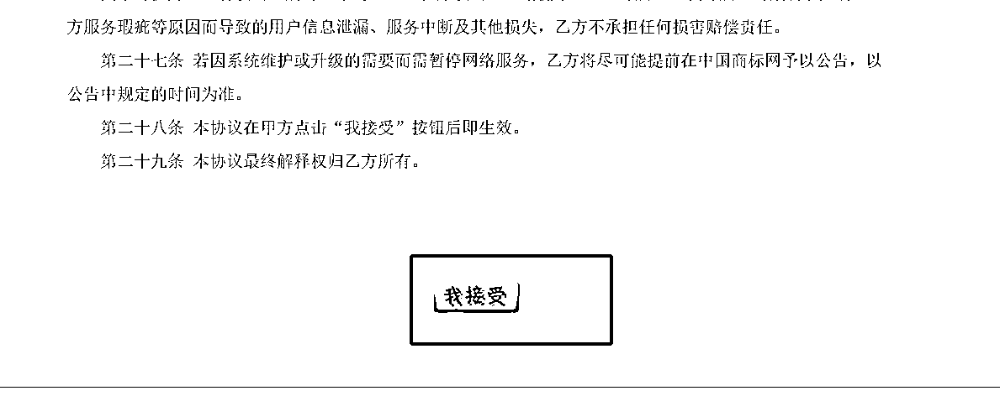
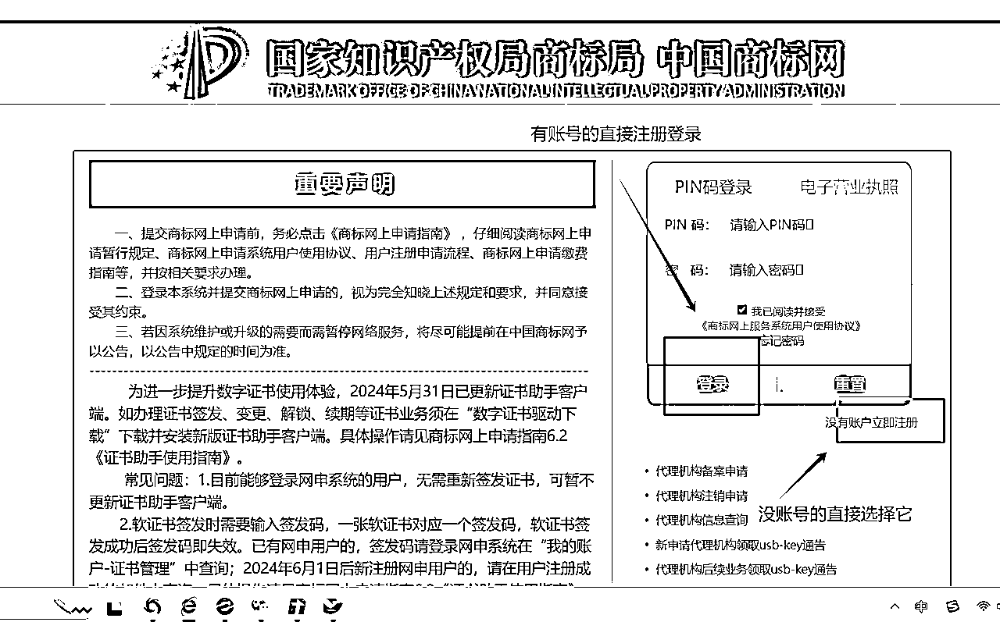

# 30分钟教会你注册商标-手把手教学(小白新手的参考路线)

> 来源：[https://yaa7briw5r0.feishu.cn/docx/G9XbdkkkkoqKKLx5yHIcozQ8nAd](https://yaa7briw5r0.feishu.cn/docx/G9XbdkkkkoqKKLx5yHIcozQ8nAd)

这个想法已经诞生好久好久，一直没有行动，再加上发现生财没有针对小白如何自己一步步注册商标的流程，所以就有了这篇复盘文的诞生。感谢大家的观看。

原因本质是：本身自己是快招加盟出身，所以知道商标的重要性。

在手里的时候，可能没什么用，但如果你想用的时候，要么最快需要6个月左右，遇到复审则需要一年半--两年的时间，才能注册完成，要么就是需要花大价钱，才能把他买下来。而且是单一类别。

上面这两种方案，都不是我想要的，所以我选择了自己注册

# 商标容易踩的坑：

### 代理公司版：

*   1.如果你的业务已经开始做了。你咨询完代理公司后，没有成交。他们对你的商标进行提前抢注。到时候你只能换名字，要么高价买他们的商标。

*   找代理公司好不容易过了商标初审，有些无良的公司，会冒充别人给你打电话，出高价购买你的商标，如果不卖就对你商标提出异议，让你初审不过。无良代理公司会告诉你，2000块，他们来帮你解决。（实际上都是他们在背后捣鬼）

*   “承诺不下证退款”“先下证后付费”，这两类都是高价的费用，他们会给让你下一个没有用处的小类别，只要能下证，你就要付全款。实际对你的业务没有任何的帮助。

### 自己注册：

*   近似商标不知道怎么查询

*   商标类别不知道怎么选，商标一共分为45大类，其中1-34类是产品类别，35类-45是服务类别。

# 注册商标，目前分为三类：

## 一、第三方注册（阿里云之类的）

## 二、代理机构帮助注册（紧急事首选）

## 三、自己注册（手里没钱，又想注册商标放手里的）

三类的优劣势：（优劣势，仅是自己的看法，可能会对部分人产生不好的影响，抱歉）

## 优劣分析：

### 阿里云：

是我在21年使用过两次，注册了两个商标，被驳回了，需要提交复审，后续有专业人士打来电话营销，并没有对我有任何的帮助，所以我觉得整体的体验流程非常不好。

### 代理机构注册：

之前也咨询过，大部分是给你一点建议，也不能保证会不会下证。

潜在的思想，对我而已，这个事情碰运气会多一些。我觉得不仅耗钱，也不能提升我的见识，所以我直接pass了

### 商标局官网注册：

是我今年突发奇想，觉得可以自己试试，因为试错成本很低，一个大类10个小类只需要270元。所以我就进行了实操。

当然做任何事情之前，都是需要进行调研的，不能打毫无准备的仗

# 废话不多说，可以直接用我的路1:1的复刻，

我的注册商标证思路，希望大家在商标注册路上，走得越来越顺。越来越远。

## 调研：

既然选择官网注册，那我应该需要准备什么东西呢？

搜商很重要，我去抖音上搜了很多视频。从上面视频的结论，我知道了。

## 第一步：在官网注册用户名

### 注册前准备所需资料如下：（提前准备好，注册需要用）

*   营业执照（彩色复印件需要盖章，签字，转为pdf版本）

*   身份证正反面彩色复印件（需要签字，转为pdf版本）

*   统一社会信用代码（营业执照上的）

*   手机号

*   联系地址

*   官网注册流程：

#### 官方链接：https://sbj.cnipa.gov.cn/sbj/index.html

### 开始账户注册：

没有账号，按下面步骤一步一步注册：

按要求把资料填好，一定要注意，记得保存好账号和密码

提交等待审核，会给发邮箱通知

注意：我第一次是因为营业执照，没有审核通过是一个驳回。那么这个用户名就不能用了

我又重新注册了一个。

下载资料，激活使用。

恭喜你，完成了官网的注册的第一步，马上就要开始打怪了。

## 第二步：准备商标名：

下面就是需要开始进行，你想要的商标名字注册了。

商标名不是你想注册就注册的，你可以知道，现在每天有将近上万个名字在注册商标，不光是你在注册，还有职业买卖商标的，租赁商标的，代理机构。

如果你不想浪费时间，不想浪费钱，就按我的思路走一遍，帮你提升80%的注册率。

那你想要注册的名字，要确定你需要哪个类目的，目前商标证一共是45个大类，还有众多小类，需要你去选择。

### 去检索，一共两个方法。

#### ①商标局网上查询

把你的名字和类目。输入进入看看有没有相似的

这样你就能做到心中有数了。

#### ②权大师网站查询：https://www.quandashi.com/

经过这两步确定好的商标，反推到商标局中，再搜索一下，增加信心。

这里有个小技巧。

据我所知，商标局查询，主要是看前两个词，会不会近似。（调换词的顺序也有概率被拒）

可以在前面加词，这样会大概率下证，我看到过很多类似的

### 商标起名借助ai

我注册这几个商标，是有借助ai，帮我起商标名

*   包含我想要的词，出20-30个，确定几个我想要。

*   查一下有没有在网站中出现（比如电商网站：淘宝、pxx、京东；搜索网站：微信、百度、搜狗等；短视频网站：抖音、小红书。有没有广告注册，或者宣传出现）

简单讲述一下，我用ai的思路，给大家抛砖引玉。

*   首先我会表达，我想要的名字“xx”，我的行业是做什么的，我的规划是什么？需要它帮我根据行业和规划，拓展一些名字。

*   然后我会让他根据上面的，拓展一些中文、英文、中英文结合的名字。这样的好处是给我了更多的灵感和思路。

*   我发现，是我自己的知识轻薄了。我选了不少，一起注册了商标。

当然上面是我的一点点见解，喜欢对大家有帮助，如果有好的思路，可以一起分享。

这样就可以确定要注册的名字了。

如果你有设计师，帮你设计好了，你的商标图形和名字，那就直接上传。

没有的话，我是用美图秀秀，直接生成图文的图片做准备。

## 第三步：正式注册

### 注册步骤

### 支付费用

*   一般是20天左右，出是否接收审核。

*   再等上20天，出审核缴费通知单。

*   付款270元，等待商标局的审核就好了。

*   再等上40-60天，就会出是商标是否审核通过，有没有初审公告（如下图）

## 第四步：初审公告

## 第五步：注册完成

初审公告，再等三个月的时间，才能完成全部注册。（如下图）

所以我的商标，最快的一个是，4月份开始注册，一点都不耽误，9月低才下的证。

历经6个月的时间

## 特殊情况：商标驳回

如果遇到不测，那就有可能被商标局驳回。

如果你不幸，领到了驳回复审通知书。

### 这样你就两种方法：

*   ①直接放弃，不要了。换名字

*   ②强刚硬上。

毫无疑问，我为了增加我的信息度，我有两个商标，选择了硬上。（也是自己查询资料，进行的，目前对方是在提交资料中）

一定不要失落，不要着急，看看里面的内容到底是什么？

如果是1-2个的近似，可以尝试自主驳回复审。

如果达到3个及以上，我的建议是放弃，如果！如果！你特别想要，那还是找专业人士吧，我就不懂了。

### 驳回复审，是需要先提交撤三申请

意义就是在于，对方连续三年没有使用商标的证书，别让他在这占着商标，不使用。

撤三模版：（如下）

撤销理由书：（按自己的内容，写完打印出来，最后要输出pdf格式的哈）

下面是我给商标局，准备的材料，最后要输出pdf格式的哈。（如果码没有打好，大家就不要深扒了，小弟在这，谢谢大家了）

撤销注册商标证据材料

先让商标局审查，让把他的商标撤销。

### 官网撤三流程如下：

### 提交上，撤三申请就做好了。

剩下的就是写驳回复审书了，这一项我也是还在测算中，防止误导大家。就不写了。

具体的路子在商标官网翻翻就能找到。

商标局提交，等待就好了

这是我对今年自主商标注册的一个复盘，当然你如果现在特别着急注册商标，那还是专业的事情，交给专业的人做。

如果你刚好有一个想法，确实想尝试一下，那你可以试试。

圈友们好，我是汉松，做了6年快招连锁加盟，略懂点付费投放。

目前在做小红书全案获客和付费推广。

祝大家商标顺顺利利的下来，项目干的红红火火！！！