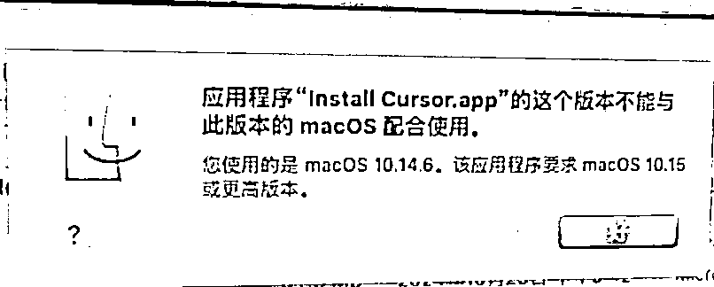
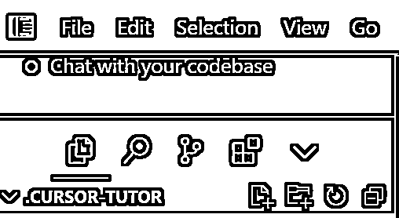
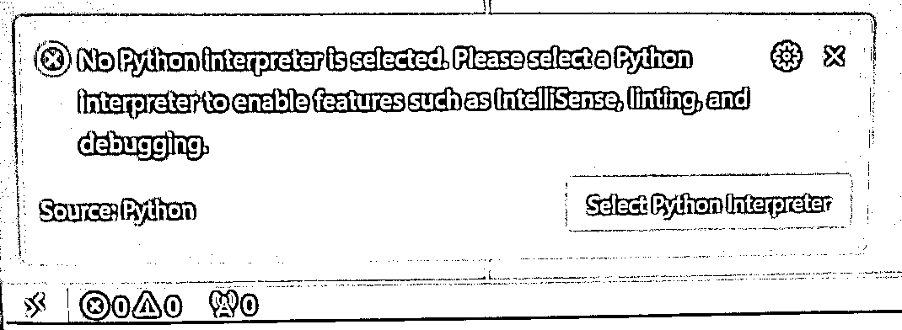
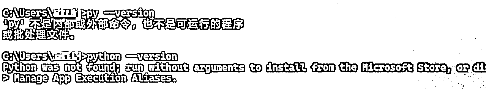
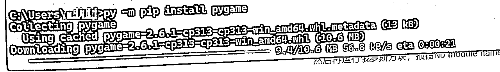
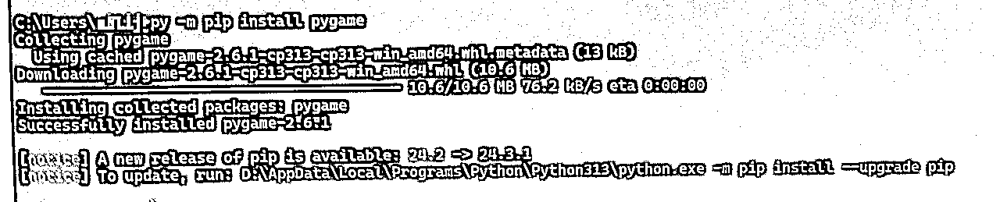
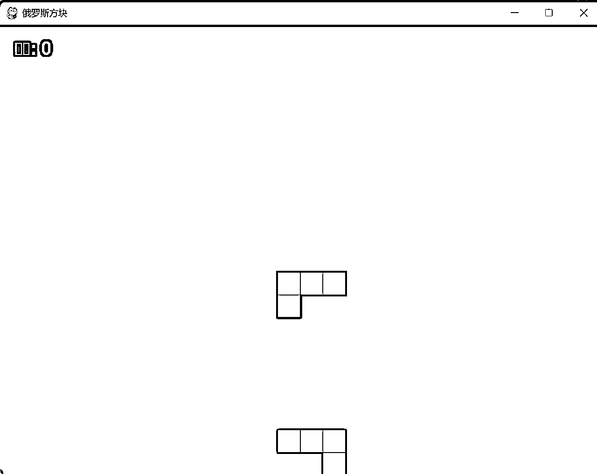

# 安装cursor时我踩的坑

> 来源：[https://kcnw69vrcnma.feishu.cn/docx/P6V4dWxK0oMMf2xvqy0cHzgSnZe](https://kcnw69vrcnma.feishu.cn/docx/P6V4dWxK0oMMf2xvqy0cHzgSnZe)

## 系统版本

刚开始安装的时候，就遇到如下的错误：

C:\Users\AdministratorAppDatalRoaming\Microsoft\Windows\StartMenu\ProgramshCursor.Ink 参数错误

当时搜了很多资料，没有明确指出这个问题是啥，最后是通过找这个路径下的文件，想看下是否有，对比发现，win7的电脑 没有StartMenu文件夹，然后猜想有可能是系统版本的关系，后通过在win10以上电脑测试，发现成功安装。

后回家用mac电脑试了下，也不行，提示要macOs 10.15 或更高版本。

win7、mac电脑都不想升级，代价太大，于是乎就马上下单买了一台新电脑，不过感觉这个问题大多数人不会遇到。。。

结论：cursor支持的系统是 win10以上、macOs 10.15 或更高版本

## 安装软件过程中

1、这一步 基本上就下一步就好了，快到最后的时候需要注册下账号，我是通过邮箱注册的，第一遍的时候比较慢，到了后面报了一个ERROR的错误，重新返回重新提交还是报错，再重头开始注册一次，还是报错了，就这么来来回回大概7、8次以后，有点忘记具体流程了，印象中邮箱当时是注册成功了，但是登录报错，后面通过重置密码成功完成注册，期间没有换邮箱。

2、安装了cursor后，并没有像大多数的人提示选择文件夹，默认建了一个.CURSOR-TUTOR，也是没问题的。

## 运行过程中

1、按照航海中的操作在chat窗口聊天，写一个python的俄罗斯方块游戏代码，并且黏贴到py后缀的文件中，就提示了如下的错误，通过与chat聊天，猜测应该还是python环境没装好

No Python interpreter is selected. Please select a Python interpreter to enable features such as IntelliSense, linting, and debugging.

同时终端cmd方式看下运行环境，这个和原来java差不多

到python官网https://www.python.org/downloads/下载 合适的版本，再次运行查看环境，因为还是不想装C盘，所以感觉环境变量没设置，但用py 命令也是可以的

2、等待安装完成python后，就有小箭头图标 用于运行代码用，运行俄罗斯方块代码，报错No module named 'pygame'

解决方法：在终端运行 py 加载一个库pygame，可以用 pip install pygame 或者 python -m pip install pygame的命令

但由于我是装在D盘的，最终用的命令是：py -m pip install pygame，耐心等待这个进度条完成以后就代表安装好了

完成了以上步骤以后就代表简单的程序可以自动运行了，看到俄罗斯方块能成功运行真的很开心啊，这和当初学代码时看到Hello World 一样！

