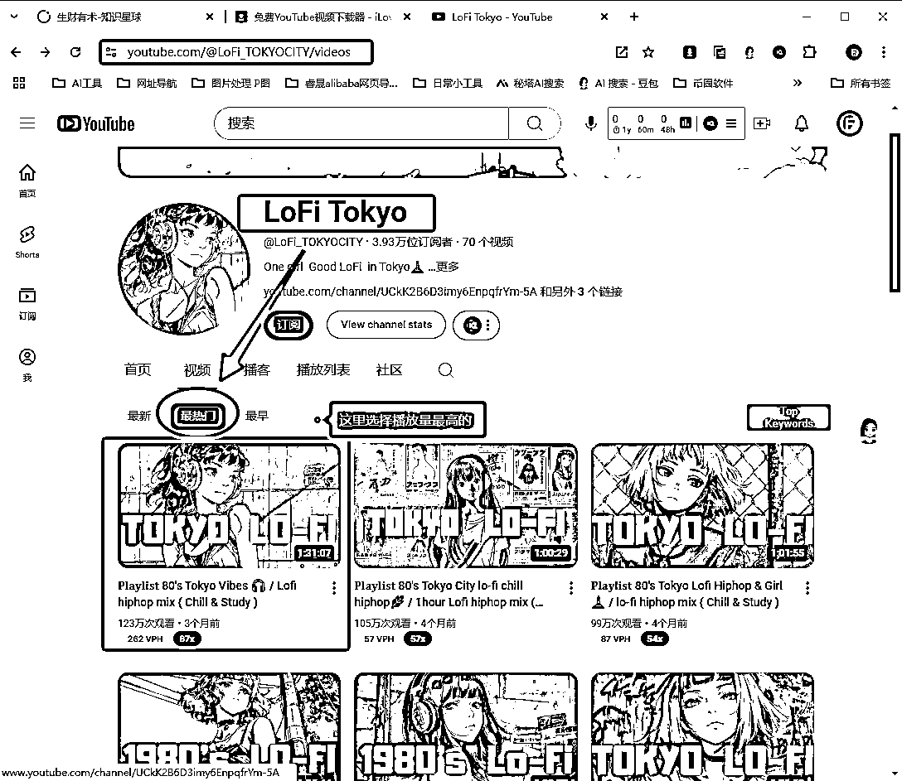
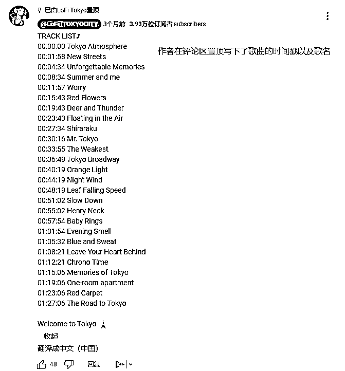
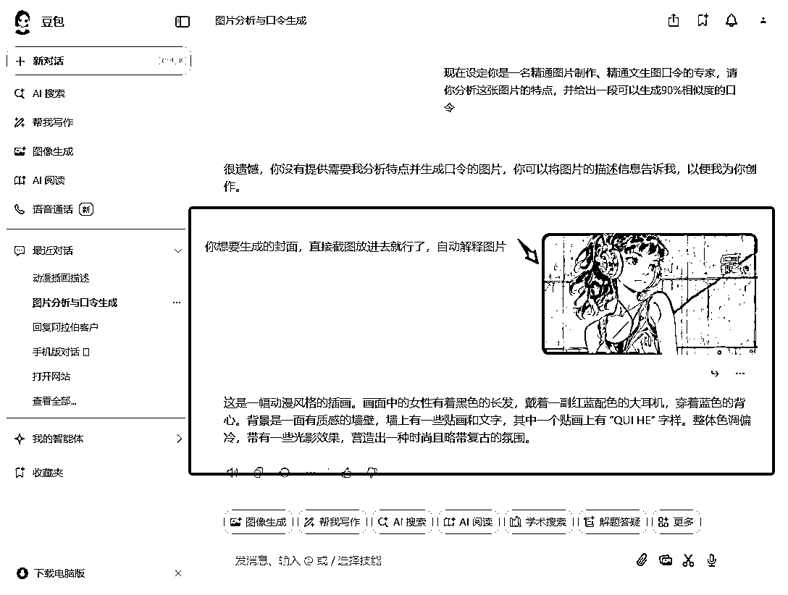
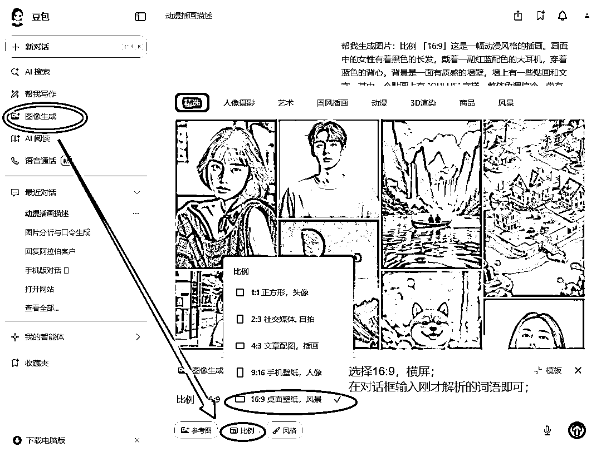
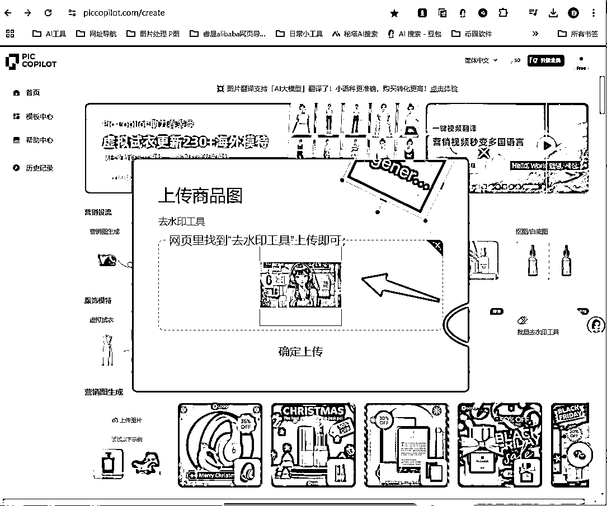
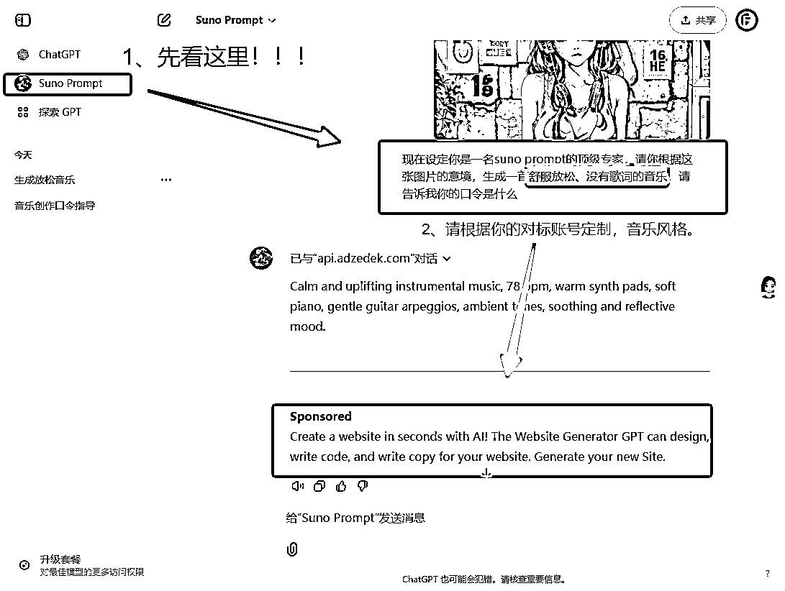
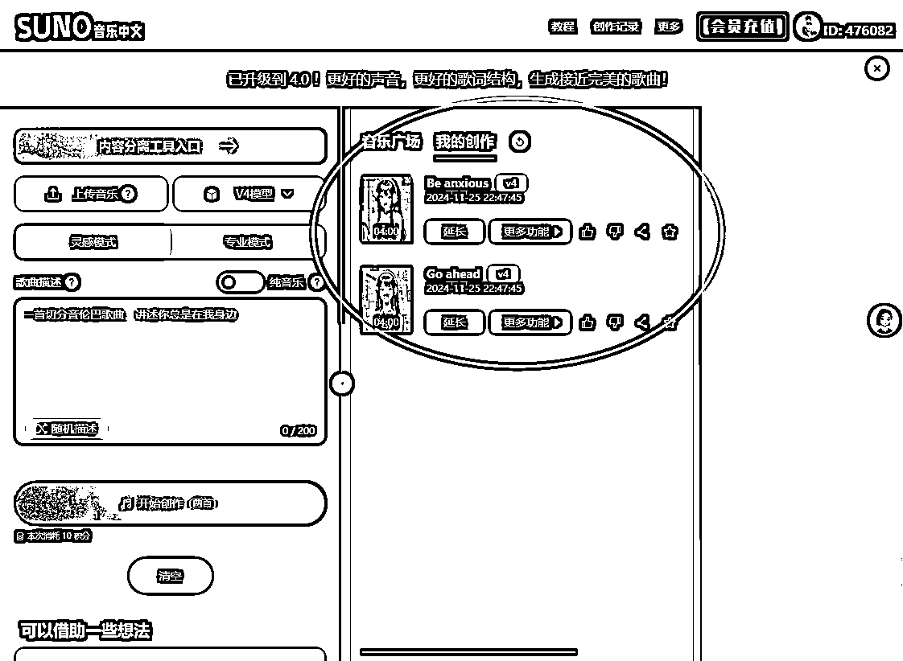

# 【一心三用】发布AI音乐视频，继0基础制作油管网站失败后当晚的尝试

> 来源：[https://phe2w1qbel.feishu.cn/docx/H7qtdpRzyoapupxaNKFclSFInYg](https://phe2w1qbel.feishu.cn/docx/H7qtdpRzyoapupxaNKFclSFInYg)

同样的，依然是“画瓢”记录篇，并不是教学！（同时，打开教学、记录过程、完成项目，称为：一心三用）

因为我的情况与原作者的“前言”极其相似，依照“别人行你怎么不行”的道理，跟进步伐！

如需详细步骤请移步原作者：老彭-- ，致谢。

# 那么，我们开始！

时间戳：2024年11月25日21:24:39

## 找出对标账号--参照物

以LoFi Tokyo为例，我的理由：有明确“东京”这个地域，后期其他地区可以参考；

链接:https://www.youtube.com/@LoFi_TOKYOCITY/videos

## 以LoFi Tokyo为例：

1）缩略图：即封面 图片加大字

2）图片：治愈插画 可用AI完成像素级模仿

1）歌曲：多首 Lofi clam音乐风格 拉时长1小时

2）画面：特效 开场淡入 开屏文字 爆款元素

那么基本上，我就完成了对标账号的分析！

## 像素级复制--COPY

因为平时的工作的电商运营的原因，我推荐--豆包AI

链接：https://www.doubao.com/，截止目前无限制免费使用。

### 封面图复刻

#### 第一步：非常简单！小白也是一遍就会，直接看图！

#### 第二步：也是如图所示，就可以获得4张相似图；

#### 第三步：我在这里，批量去水印的软件求推荐一个（请发在评论区，感谢）

生出4图后，选择一张喜欢的下载，放进去水印工具（我的这个不咋地，不推荐）

最终成片展示：

词汇：帮我生成图片：比例 「16:9」这是一幅动漫风格的插画。画面中的女性有着黑色的长发，戴着一副红蓝配色的大耳机，穿着蓝色的背心。背景是一面有质感的墙壁，墙上有一些贴画和文字，其中一个贴画上有 “QUI HE” 字样。整体色调偏冷，带有一些光影效果，营造出一种时尚且略带复古的氛围。

半场香槟，我的封面解决了！

### 重头戏--音乐复刻

#### 获取音乐口令

打开ChatGPT，在“探索GPT”里找到“suno prompt”，如果曾经用过会直接显示在ChatGPT的下方，然后上传图片和话术，获取符合图片意境的音乐口令，以下是参考话术：

现在设定你是一名suno prompt的顶级专家，请你根据这张图片的意境，生成一首舒服放松、没有歌词的音乐，请告诉我你的口令是什么

得出口令：Calm and uplifting instrumental music, 78 bpm, warm synth pads, soft piano, gentle guitar arpeggios, ambient tones, soothing and reflective mood.

#### 用suno生成音乐

打开suno，点击左侧的“创造”，然后输入口令，记得打开“器乐”选项才能生成纯音乐，最后会生成两首歌曲，一般是三四分钟，觉得好听可以延长（如果不满意，针对性的修改口令，重新生成即可）

suno官网：suno.com

上闲鱼买会员（不然无法商用！）

Suno的界面非常简单好上手，但我这里是错误示范，请勿模仿；用的中文套壳（所以我不清楚能不能商用了,大家购买时请仔细斟酌！

#### 三、关于制作可视化模块

这块其实我真心希望大家自己发挥，创作出更好的模板和作品！

虽一笔略过但是0基础小白前期非常耗费精力，需要查看教学的，

导航原作者：

# 所有文件合计：

# 最终发布效果展示：4分钟

（复盘视频的时候，发现视频音量偏小，观看前请提高音量🔈）

同时期望给我一点改进建议，坚持学习，我是JoneFung！

# 感谢你的阅读 祝你好运，晚安！