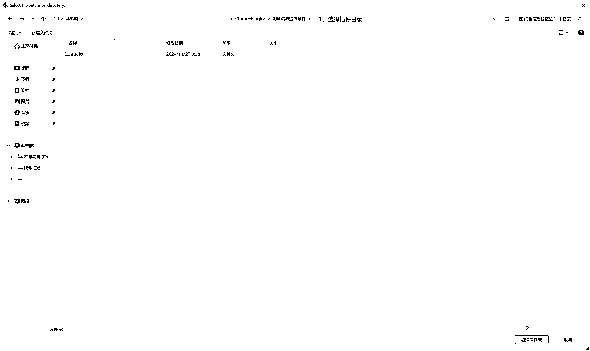

# 闲鱼消息提醒插件编写教程

> 来源：[https://w63nbfedzw.feishu.cn/docx/HN2Md8wzaomnG0xf71tcdbYynTf](https://w63nbfedzw.feishu.cn/docx/HN2Md8wzaomnG0xf71tcdbYynTf)

# 引言

## 背景介绍

在闲鱼这个二手交易平台上，及时回复买家的消息对于卖家来说至关重要。之前，我发了一个风向标，说闲鱼网页版支持消息回复了，有圈友反馈没有提示音很难受，开始我以为是没允许网页提醒，问了圈友说允许了，当时回复了圈友说那可能有些bug，就没继续了，后来有一天手机和网页都没收到提醒，几十分钟了都没回复客户，就想着编写一个油猴脚本看看，最终无果，可能是姿势不对，但也就放下了，反正也不急需。

昨天(2024年11月26日)咨询量多了起来，主要是有个客户发了好多条消息，我主要是电脑看，想着要不用Chrome编写一个闲鱼消息提醒插件好了，于是就开始行动了。

对编写过程不感兴趣的朋友可以直接跳转到附录下载插件和查看第六章节Chrome插件安装进行安装插件。

## 为什么选择Chrome插件

Chrome插件提供了更直接的网页交互方式，可以把mp3提醒声音打包到插件里，比网址更稳定，且之前尝试过油猴插件，但效果并不理想，可能是因为使用方式不正确，所以就试试编写Chrome插件看看。

# 准备工作

## 怎么实现

1、闲鱼网页版有新消息的时候网页标签页就会变成[新消息]开头，所以要想判断是否新消息可以从网页标签页信息是否包含“[新消息]”

2、闲鱼网页版的地址是“https://www.goofish.com/”、消息地址是“https://www.goofish.com/im”开头的，包含网址时启用插件

3、因为需要调用本地mp3文件，所以需要准备个提醒信息mp3文件

4、Chrome插件需要icon图标，需要准备，我让CurSor帮我生成了。

## 必要的工具和库

*   CurSor开发工具

*   Chrome浏览器（用于开发和测试）

*   svg转png工具（后面用CurSor生成svg图标，需要用svg转png工具转换），CurSor提供了：https://svgtopng.com/

*   配音工具（我是用了微配音制作提醒声音）


# Chrome插件基础

## 基本概念

Chrome插件主要由以下几个部分组成：

*   manifest.json：定义插件的元数据，如名称、版本、权限等。

*   background.js：在后台运行的JavaScript代码，用于监听和处理事件。

*   content.js：在网页内容中运行的JavaScript代码，用于与网页交互。

*   popup.html：如果插件需要与用户交互，可以提供一个用户界面。一般还会带popup.js

*   icon文件：Chrome插件需要特定大小的图标文件，通常包括16x16、48x48、128x128像素的PNG格式图片。文件名为：icon48.png、icon64.png、icon128.png

*   其他：css、js等文件

# 提醒信息mp3制作

1、微信PC端打开【微配音】小程序，输入提示的文字，点击【更多】选择配音员，选择自己觉得不错的配音员我选择的是【智虹】：

你有新的闲鱼消息，请注意查看~


可以选中文字，然后点击【短句试听】试听是否OK。

2、只是提醒文字感觉差了点意思，下面有个【音效库】可以选择合适的音效：


3、复制之后粘贴(Ctrl+V)到前面，点击【语音合成】合成配音：

‖●音效zhongling/11.mp3‖你有新的闲鱼消息，请注意查看~


4、配音合成，可以播放看看是否OK，不OK的话可以点击左上角的【<】返回配置页面：


觉得配音OK的话，点击【下载】下载配音即可。

5、配音下载，点击【复制下载链接】，然后使用Chrome浏览器访问：


点击【下载音频文件】即可。

# Chrome插件开发

## 开始编写提示词

提示词模板：

假设AI是Chrome插件编程专家，让它帮我们编写一个xxx插件，需求如下：

1、网址包含xxx时启用插件

2、具体需求，如xxx网址标签页的标签标题包含xxx时进行xxx操作

把自己的需求编写的差不多就好了，不用追求一下子就安排的明明白白的。

得到闲鱼信息提醒插件的提示词：

你是一个Chrome插件编程专家，请帮我编写一个闲鱼信息提醒插件，需求如下：

1、网址包含@https://www.goofish.com/ 、@https://www.goofish.com/im* 时启用插件

2、后台监测包含@https://www.goofish.com/im* 的网址标签页的标签页banner包含“[新消息]”的给我播放提醒mp3

## 使用CurSor编写代码

创建项目文件夹(闲鱼信息提醒插件)和使用CurSor打开文件夹(Ctrl+Shift+N)比较简单这里就不描述了.

1、在Composer模式输入上面的提示词，使用Composer模式好处是可以帮我们自动创建文件：


2、为了方便管理，不让文件显得那么散乱，我让CurSor给我增加一个mp3存储文件夹，提示词就比较随意了，就跟朋友对话一样：

增加一个mp3文件存储文件夹


虽然Composer模式会自动创建文件、文件夹，但有时候会罢工不帮忙创建，所以我这里手动创建了个【audio】文件夹。

3、可以看到上面的文件结构里面有icon48.png、icon128.png以及notification.mp3文件，先让CurSor帮我们生成icon文件，提示词如下：

给我生成icon图标


CurSor给我们生成了一个icon.svg文件，并提供了一个svg转png网站让我们把svg文件转成png文件。

4、点击【DOWNLOAD ALL】把转换后的文件下载下来，解压到插件根目录，并复制一个副本(选中icon.png，Ctrl+C，然后Ctrl+V)，分别修改成icon48.png、icon128.png：


修改好后在Chrome浏览器安装插件运行看看，安装方式查看 Chrome插件安装章节。

5、运行提示Service worker registration failed. Status code: 15，因为迭代了好多个版本，代码回滚不方便，我就不截错误的图片了，把错误发给CurSor帮我们处理：


6、更新代码后重新加载提示Uncaught (in promise) ReferenceError: Audio is not defined，继续让CurSor帮我们处理：


这次给我改成Chrome的通知方式了，就是【铛铛铛】的声音，辨识度不高，也分不清是不是有闲鱼新消息。

7、我想让插件的图标显示新消息的数量，于是让CurSor给我修改：

有新消息的时候插件图标增加数量


修改后确实会在图标上显示数量了，后面发现只会是1，主要是因为标签页信息不会显示有多少条新消息。

8、前面也说了Chrome的通知方式【铛铛铛】的声音，辨识度不高，也分不清是不是有闲鱼新消息，于是就让CurSor继续修改，改成使用本地声音提醒：

还是更改为使用本地声音提醒比较好


```
主要更改说明：
移除了通知相关代码，改用音频提醒
添加了 content script 来处理音频播放
使用消息传递机制在 background 和 content script 之间通信
保留了图标上的未读消息计数功能
添加了必要的权限和资源配置
这样实现的好处：
可以正常播放本地音频文件
保留了未读消息计数功能
避免了系统通知可能被屏蔽的问题
提供了更好的用户体验
```

9、接下来是不断地修改Bug了，不断地把错误信息发给CurSor，让CurSor帮我们修改：

发送消息失败: Error: Could not establish connection. Receiving end does not exist.：

console.error('发送消息失败:', error);


```
主要修改说明：
在 background.js 中添加了脚本注入逻辑
添加了 scripting 权限以支持动态注入脚本
在 content.js 中添加了初始化确认机制
使用 setTimeout 确保有足够时间让 content script 加载
添加了错误处理和日志记录
这些修改应该能解决消息发送失败的问题。主要通过以下方式解决：
确保 content script 已经正确加载
动态注入脚本以确保代码执行顺序
添加延时以等待脚本加载完成
增加错误处理机制
如果还遇到问题，可以检查：
插件权限是否正确设置
音频文件是否存在且路径正确
Chrome 控制台是否有其他错误信息
```

没有看到调用本地notification.mp3文件播放

这个错误是因为我看到代码里没有调用notification.mp3，所以让CurSor给我修改。


```
主要修改说明：
在 background.js 中直接创建和播放音频
如果直接播放失败，再尝试通过 content script 播放
在 manifest.json 中明确指定了音频文件路径
添加了 到 matches 以确保 background script 也能访问音频文件
请确保：
在插件目录下创建 audio 文件夹
将 notification.mp3 文件放在 audio 文件夹中
音频文件格式正确且可以播放
文件结构应该是：
插件根目录/
  ├── manifest.json
  ├── background.js
  ├── content.js
  ├── icon48.png
  ├── icon128.png
  └── audio/
      └── notification.mp3
这样应该能确保音频文件能够正确播放了。如果还有问题，可以检查 Chrome 开发者工具的控制台是否有错误信息。
background.js 
```

发送消息失败: Error: Could not establish connection. Receiving end does not exist.

Context

background.js

Stack Trace

background.js:9 (anonymous function)

// 存储未读消息数量

let unreadCount = 0;

// 播放提醒音频

async function playNotification(tabId) {

try {

// 创建本地音频对象

const audio = new Audio(chrome.runtime.getURL('audio/notification.mp3'));

// 直接播放音频

await audio.play();

} catch (error) {

console.error('播放音频失败:', error);

// 如果直接播放失败，尝试通过content script播放

try {

await chrome.tabs.sendMessage(tabId, { action: 'playNotification' });

} catch (error) {

console.error('通过content script播放失败:', error);

}

}

}

// 更新扩展图标上的未读数量

function updateBadge(count) {

if (count > 0) {

chrome.action.setBadgeText({ text: count.toString() });

chrome.action.setBadgeBackgroundColor({ color: '#FF0000' });

} else {

chrome.action.setBadgeText({ text: '' });

}

}

// 检查标签页标题的函数

function checkTitle(tabId, changeInfo, tab) {

// 只检查闲鱼相关的页面

if (tab.url && tab.url.includes('goofish.com/im')) {

// 检查标题是否包含[新消息]

if (tab.title && tab.title.includes('[新消息]')) {

// 更新未读消息数量

unreadCount++;

// 更新图标

updateBadge(unreadCount);

// 播放提醒音频

playNotification(tabId);

} else {

// 如果标题不包含[新消息]，说明消息已读

if (unreadCount > 0) {

unreadCount = 0;

updateBadge(unreadCount);

}

}

}

}

// 监听标签页更新事件

chrome.tabs.onUpdated.addListener(checkTitle);

// 监听标签页关闭事件

chrome.tabs.onRemoved.addListener((tabId) => {

// 重置未读消息计数

unreadCount = 0;

updateBadge(unreadCount);

});

播放音频失败: ReferenceError: Audio is not defined

通过content script播放失败: Error: Could not establish connection. Receiving end does not exist.


```
主要修改：
移除了 content.js 和相关配置
使用 chrome.scripting.executeScript 直接在页面中执行音频播放代码
简化了错误处理逻辑
保留了必要的权限和资源配置
这样应该能解决音频播放的问题。关键改动是：
不再依赖 content script
直接在页面上下文中执行音频播放
使用 scripting API 注入代码
请确保：
audio 文件夹中有 notification.mp3 文件
音频文件格式正确
文件路径正确
```

再次修改后提示下面错误，继续发给CurSor修改：

播放音频失败: ReferenceError: Audio is not defined


```
主要修改说明：
创建了单独的音频播放脚本
使用 document.createElement('audio') 替代 new Audio()
通过 executeScript 注入整个文件而不是函数
文件结构：
插件根目录/
  ├── manifest.json
  ├── background.js
  ├── play-audio.js
  ├── icon48.png
  ├── icon128.png
  └── audio/
      └── notification.mp3
这样应该能解决 Audio 未定义的问题，因为我们现在是在页面上下文中创建音频元素。
```

这次给我新增了一个play-audio.js文件。

Uncaught SyntaxError: Identifier 'audio' has already been declared

Context

https://www.goofish.com/im?spm=a21ybx.home.sidebar.1.

Stack Trace

play-audio.js:1 (anonymous function)


```
主要改动：
使用立即执行函数(IIFE)创建独立作用域
给音频元素添加唯一ID
检查是否已存在音频元素，避免重复创建
隐藏音频元素
将音频元素添加到文档中
这样可以：
避免变量命名冲突
重用已存在的音频元素
保持DOM结构整洁
确保音频元素正确加载和播放
```

播放失败: [object DOMException]

Context

https://www.goofish.com/im?spm=a21ybx.home.sidebar.1.

Stack Trace

play-audio.js:16 (anonymous function)


这次有新消息能播放提醒声音mp3了，就是会一直播放，而且是重叠播放，比如正常是【Duang】，这个是【Duang、Duang、Duang、Duang】，而且是重叠的，让CurSor继续修改。

如果有新消息需要间隔播放，现在是有新消息一直播放


```
主要修改说明：
添加了 lastPlayTime 变量记录上次播放时间
添加了 PLAY_INTERVAL 常量定义播放间隔（3秒）
在播放前检查时间间隔
只有超过间隔时间才播放音频
这样可以避免频繁播放提示音，提供更好的用户体验。你可以根据需要调整 PLAY_INTERVAL 的值来改变播放间隔。
```

接着发现插件图标上的数量没有增加，于是让CurSor继续修改：

消息数量没有增加


后来发现数量还是没有增加，想到标签页信息不会显示有多少条新消息，就没再修改了。

### 效果视频

## 增加popup.html 配置提醒间隔

前面的视频3秒间隔提醒太麻烦了，需要增加一个popup.html 用户界面进行提醒间隔配置，发下面的提示词让CurSor给我们修改：

增加popup.html用户界面，通过用户界面设置播放间隔时间


```
主要更改说明：
添加了设置界面，可以调整播放间隔时间
使用 chrome.storage.sync 保存设置，支持跨设备同步
添加了实时设置更新功能
增加了输入验证和保存成功提示
界面设计简洁直观
使用方法：
点击插件图标打开设置界面
输入想要的播放间隔时间（1-3600秒）
点击保存按钮应用设置
设置会立即生效并保存
```

重新加载插件：


觉得10秒还是太频繁，我改成了20秒。

### 效果视频

通过配置播放间隔时间后好了不少，不会提醒太频繁。不过这块没录上视频，后面再补好啦，反正效果是可以的。

# Chrome插件安装

## 本地加载插件

在Chrome浏览器中，打开“扩展程序”页面（chrome://extensions/），启用“开发者模式”，点击“加载已解压的扩展程序”，选择包含插件文件的文件夹。





记得Pin一下插件才会在标签栏显示。

# 结语

编写代码花了40分钟左右，编写文档花了2个多小时，过程中还有人找我帮忙下载视频花了点时间。

编写插件的过程我介入的地方不多，只有创建audio文件、svg转png、修改icon文件名、制作提醒信息mp3，其他大部分的时间是花在让CurSor修改Bug上面，而且修Bug很轻松，就像跟朋友聊天一样跟CurSor聊天，聊着聊着就完成了整个插件的编写，如果是让我写这么个插件，可能要花半天到一天，CurSor真的是方便了很多，没有编程基础的朋友用CurSor也可以很轻松的完成工具的编写，真的是太赞了。

# 附录

## v1.0版本

插件下载地址：

## v1.1版本

更新说明：增加了标题关键词、定时检测、提醒音频间隔的设置。

解压密码：JiaoYang12345

# 异常处理

## 比特浏览器没有声音


比特浏览器安装插件之后没有声音提示，按照如下操作进行修正：


在指纹设置-启动参数加上下面的参数，点击确定保存即可：

--autoplay-policy=no-user-gesture-required


保存之后重新打开对应的窗口就可以了。

有声音了。

参考：

Autoplay policy in Chrome

## 2024年12月4日 没有提醒声音

晚上的时候没有声音提醒，还以为是插件问题，后来发现是标题关键字改成【[您有新消息]】了，修改下：


