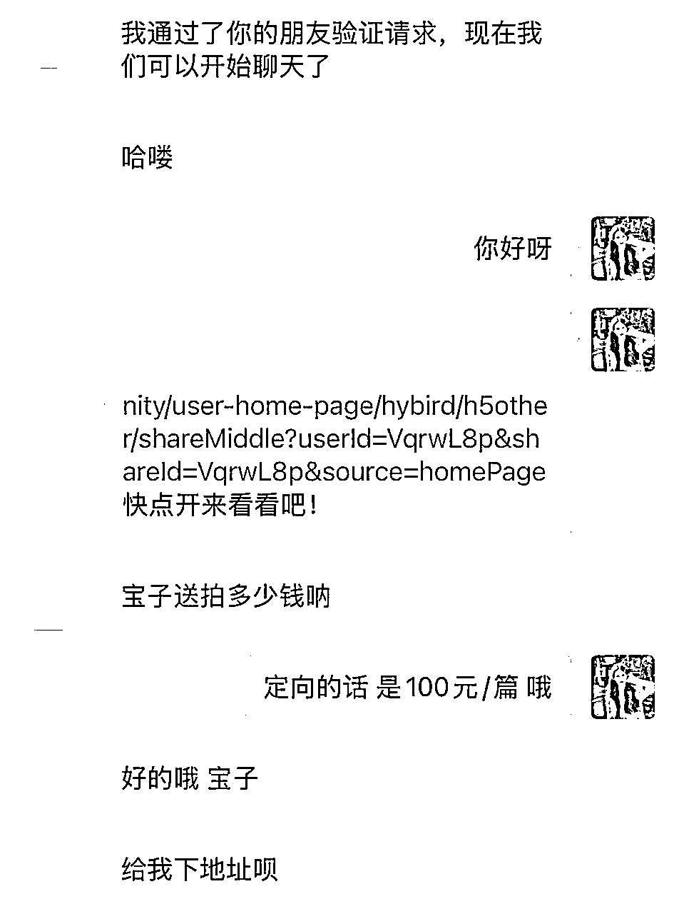
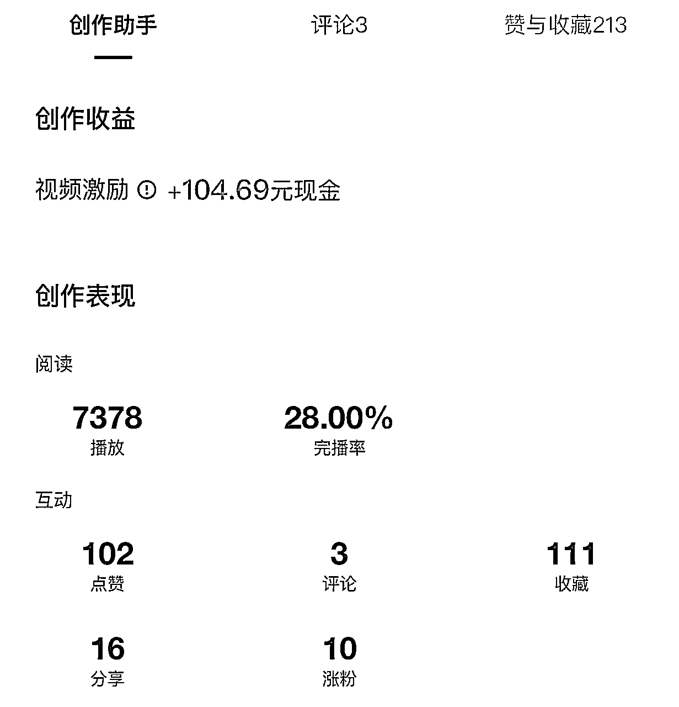
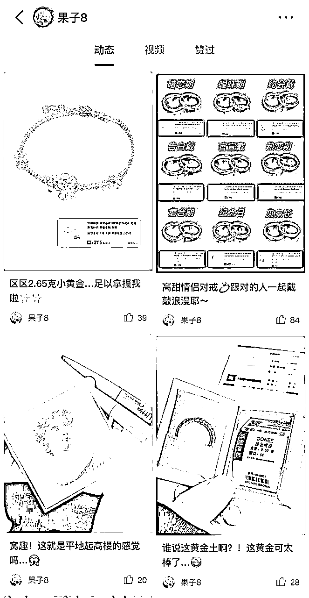
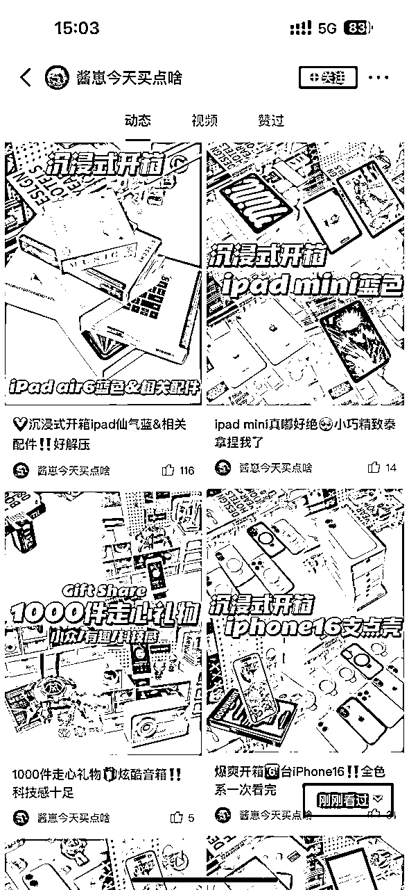
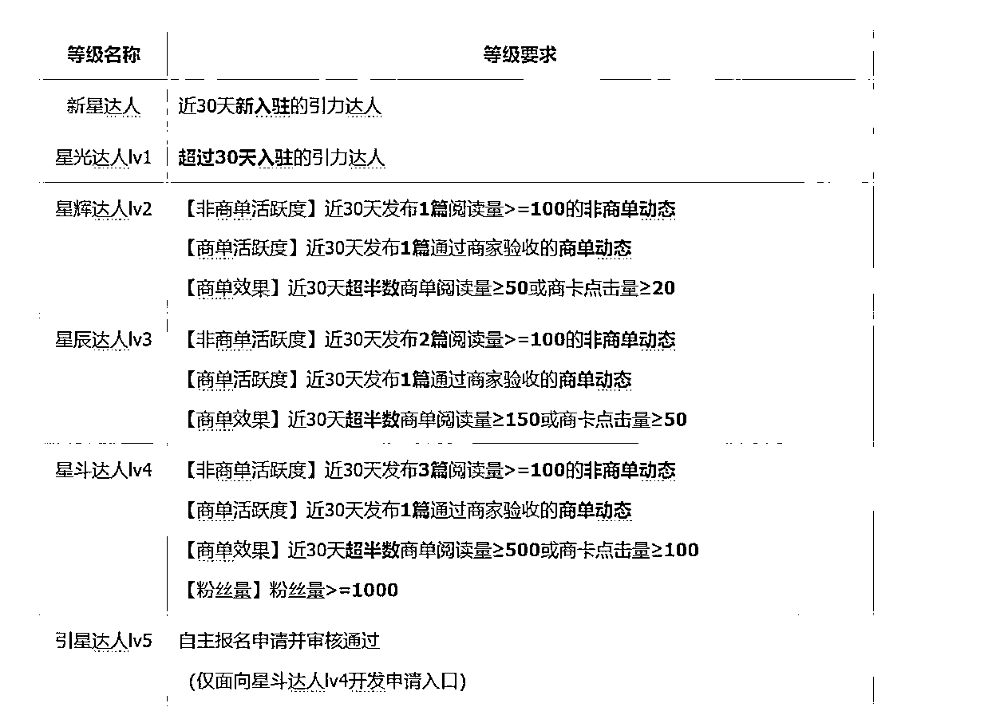
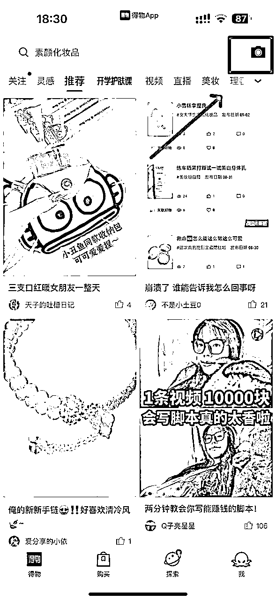

# 得物平台月入4位数，在家可做，新手小白友好！（附保姆级教程）

> 来源：[https://uiok1bi2iw.feishu.cn/docx/HN33d3tu3ovQdcxMMoUcngIonZe](https://uiok1bi2iw.feishu.cn/docx/HN33d3tu3ovQdcxMMoUcngIonZe)

在家带娃的宝妈如何利用空余时间做点副业补贴家用？

学生党如何在课余时间多赚点零花钱？

打工人下班后还可以做什么轻副业增加收入？

那么你一定要看完这篇八千字的干货帖，非常适合现在的你去做。我利用空余时间做得物已经五个月了，有个1w+的收入，其中产品价值 9000+，佣金3000+，并且随着拍照和文案水平的提升，收入每个月都逐步增加。

以下是其中一部分产品：

今天的分享主要是我做得物的复盘，以及摸索出来的经验，对于平时空余时间多，想要做一个小而美的副业的圈友，是一个不错的选择。

# 一、我是谁？

大家好，我是北樱。今天和大家分享一个小众的副业项目：得物好物种草变现。

得物百粉成功变现，总阅读17w+，合作过HBN、珀莱雅、中国黄金、老凤祥等品牌，也有幸在得物航海冲浪计划中做过答疑学姐。

对于普通人来说，得物有两大优势。

1、门槛低：0粉就可以获得种草赏金和视频激励，账号14天内发布的内容，其中12篇阅读量≥500就能开通品牌合作。

2、难度小：不需要特别专业，更多的是站在已买人的角度，来分享自己的产品使用体验。

这一点可以对比小红书，同一个产品，得物种草会比小红书种草要求低很多，更适合普通人去做。

比如一款含氟牙膏好物种草：

像小红书这种比较专业的，纯从产品角度去推荐的，是不被得物平台所鼓励的，品牌合作也过不了。

由此可见得物的好物种草真的非常简单。

那么得物适合哪些人群去做呢？

大学生、宝妈、平时不经常加班的打工人都可以做。

一个合作，是4-8张图+300字以内的文案，会拍图了半个小时就可以完成一个合作了。利用空余时间做做得物完全没问题，每天在得物投入1-2小时，长期下来也是一笔不小的收入～

我做自媒体已经有4年了，做过不同平台的博主、运营过社群、也做知识付费。总结下来，新媒体的变现路径不外乎这三种：

1、赚老板的钱：利用所掌握的新媒体知识，找一份与之相关的全职或兼职。

2、赚商家的钱：做一个自媒体博主，比如小红书博主、得物博主。本质是是给商家的产品做推广。

3、赚用户的钱：解决用户的问题、满足用户的需求，从而用户为之付费，形成自己的个人品牌。

对于这三种变现方式，也各有利弊。

工作变现，启动速度最快，但赚钱增速慢，长期成功率最短，短期成功率最大。

个人品牌变现：启动速度相对快，赚钱增速快，长期成功率大，短期成功率中等。

博主变现：启动速度慢，赚钱增速快，长期成功率最大，但短期成功率也最低。

像得物，就属于博主变现。我从跟做得物博主的朋友交流中总结下来，发现得物运营时间越长，接到的商单也就越发优质。像这个是做了1年左右的，定向合作很多，也有不少品牌方定期复投。

我最近账号流量做起来了，后台的佣金也从千篇一律的20，开始逐步提高，还有不少品牌方直接下定向。

相信大家读完我的这篇帖子，能够少走不少弯路。

# 二、得物博主是如何赚钱的？

要知道得物是如何赚钱的，首先得了解什么是好物种草。

每个商品下都会有开箱精选，达人发布的好物种草/开箱视频，带商品链接就会出现在开箱精这里，以分享真实感受为主，帮助用户全方位的了解产品，辅助用户决策进行下单。

比如DW粉底液：

### ①品牌合作

这个是得物好物变现项目最主要的收益方式。投稿佣金20-100元不等，定向佣金100起步。可以利用零碎时间做，账号升级到LV.2及以上不限制接单次数，有时间精力就可以多接一些商单。

变现周期较长，但做起来后变现稳定（至少37天左右），随着粉丝量和阅读量的提升，定向商单单量和报价都会随之升高，这个时候收益稳定每月1w+是没问题的。

图文要求：6-8张图+300字文案。

视频要求：30-60s即可。

品牌合作门槛：账号14天内发布的内容，其中12篇阅读量≥500。

得物的引力合作相当于小红书的蒲公英，但得物的要求比较低。

之前是要求账号做到100粉才能开通引力合作，现在的新账号开通品牌合作不再需要100粉丝，只需要14天内发布的内容，其中12篇阅读量≥500就可以：

引力合作分为两种

1、达人投稿

达人自己在后台报名任务，商家通过筛选后即为成功合作。升级到LV.2每月不限接单次数，达人拍照出片，流量好，一个月接15-20单没有问题，产品可以自用或者在咸鱼卖出。

升级到LV.3，就可以报名LV.3达人专享百元任务合作，每天19:00都会有新任务。这个需要自己去蹲点报名，但流量好的就不用担心了，数据好可以插队报名，哪怕人数够了也可以报。

2、定向合作

之前是500粉才可以开通定向合作，9月之后规则变了，不再有粉丝数量要求，而是升级lv.3自动开通定向合作功能，做得物就是流量为王。最赚钱的也是定向合作～

品牌方会通过得物商家端后台选择达人，并且发起合作邀约进行沟通，确定好后会在引力平台下定向任务，这个是商家端后台，可以看到达人的公开数据：

达人的定向合作可自己设置报价，百粉阶段最低报价100元/篇。

同样不限制接单次数，按一月最低10个定向合作，现金收益也有1k。

加上产品价值，整体收益能到达到3k+，账号等级越高，流量越好，拍照越出片，收益则更高。

### ②视频激励

根据视频播放量、完播率等综合数据来给激励，差不多在10元/千次阅读上下，非常适合擅长拍视频剪辑、二创的圈友的。像漫剪、影视剧、娱乐号、美食视频都可以通过得物视频号赚收益。

变现周期短，发布的视频隔天就会结算到创作收益中，可以直接提现。

没有任何复杂的运营，就是剪好了框框往上发就行，一天发3-5条最佳，这样下来纯做视频号一个月也能有3k+收益。

开通视频号门槛：发布5个20秒以上的视频，且总阅读量大于1000。

### ③种草赏金

0粉/新号就可以带商品链接发布种草动态，在60天内有人通过链接购买，就能获得相应的赏金分成。这部分收益多少，主要看产品品类和带货单数。大部分时候这个就是顺带做一下，不是普通人做得物的主要变现方式。

### ④社区赠礼

得物社区每个月都会有seeding活动，按要求参加活动还可以免费领取产品和流量券。

我之前一次拿过10w流量券，一次使用消耗5000，10w相当于可以给20篇动态加热，大大增加了出爆款的概率。

另外今年9月得物下线了好物评价官，取而代之的是“发动态 享免单”活动，每个得物用户都可以参与。只要发布的动态阅读量在活动时间内达到100，就会有免单机会：

同时得物社区也会给优质创作者发放空投礼盒。

# 三、我做得物的过程复盘

从从时间线开始整理吧，我专门做了一个产品表格list，这样方便大家直观的参照，因为我也不是全职去做的，正好可以给想做在空余时间做一个小副业的圈友一个参照。

### 7月：新手期，收入316

价格空着的地方就是无产品，佣金空着的地方就是纯产品置换。

7月份好不容易涨到了100粉丝，开通品牌合作，账号等级Lv.0，只有5次报名机会，却怎么报也不通过，这也是新手最容易出现的问题，其实，是自己的账号没有达到品牌方的投放要求。

这个时候可以从以下几点自查：

1、账号内容垂直度

做得物不一定需要多么专业的知识，但做账号一定要做好定位，再从定位发散出去写产品。

比如，像北樱的账号定位是护肤美妆，那么发的动态都是围绕这个定位发散出去的，粉丝也都是对这方面感兴趣的人，那么就会更受pr的青睐。

旧版本的得物创作者中心中，是可以看到账号领域以及垂直度的，像这样：

更新之后不再展示内容垂直度，但这并不代表垂直度不重要，我专门问了合作过的美妆类pr：

因此做垂直赛道是接商单的第一步。

2、拍照质量高

会拍照是做得物账号的基本功。我们可前期先购买一些拍摄道具，比如小摆件、托盘，一张万能的背景纸、三色反光板等。有条件的可以加上一个无影灯，没有用台灯也是可以的。

构图不会没关系，可以在得物上搜索类似产品的优质动态是怎么拍摄的，照着拍就可以了。

其实这一点很好理解，通过发布的动态能最快看出一个达人的拍图风格和水平。

3、账号流量好

做公域博主，一定是流量为王，品牌方投放也是想要增加产品曝光度。

这个可以根据近半个月发布的动态阅读量，进行判断：

均篇阅读量小于100，基本接不到商单。

均篇阅读量100-300，可以尝试报名一些投稿人数100或者200人的。

均篇阅读量大于300，大部分投稿报名都能过

均篇阅读量大于500，恭喜你投稿报名几乎都能过，还会有品牌方找你下定向合作。

均篇阅读量大于1000，不用投稿啦，等着品牌方向你砸商单吧～

流量和曝光地，可以多多参加得物的活动，不仅能够获得流量助推，还能够赢流量券和无门槛优惠券。从我-创作中心-创作灵感中可以查看：

目前还有一个最新的调整，新人接首个商单难，平台就和商家合作，推出了一个内测，顺利帮助新人接第一个商单，我的小号就收到了内测：

现也正因为如此，才让我觉得对于普通人来讲，得物是一个很好的机会。

它的数据对达人和商家双方都是透明的，双方自愿选择，收益和审核都有平台把关，当然平台也会收取一定的手续费（商单100以下不收手续费直接提现，100及以上收取5%的手续费），这也是值得的，毕竟对个人来说只需要做好内容，就会有源源不断的流量和合作。

### 8月：探索期，收入1758

8月升级了lv.1、lv.2，有几天流量不错，接了2个百元定向，投稿也通过了不少，但我当时完全是靠流量好撑起这个账号的，内容混乱不够垂直，一会接饰品一会接护肤品。

问题也很多，但主要问题就是拍的图不够好，拿到产品不知道如何下手去拍，每次想标题也要想半天。

出片是一个非常考验审美的事情，但审美是可以被锻炼出来的。我一开始每拍一个品，都会提前在小红书、得物查看优秀博主是怎么拍这个产品的，然后自己琢磨拍摄角度和构图。

拍的照片有网感，画面明亮，构图好看、滤镜适合，这些都会影响接商单。

做自媒体内容，能够捕捉到哪样的内容能够成为爆款，那么这个账号变现能力一定很强，所以说网感很重要，除去天赋型选手，大量的练习感知，也能够提升我们的网感。

像北樱就会建立自己的标题库：

以及总结标题特点和可以套用的公式，这个和小红书是一样的，大家也可以直接在小红书搜索热词，我这里列举一部分：

除了模仿拍照构图，还会学习优质动态的文案、封面。在得物上百赞以上的标题，都可以参考。通过总结我发现，很多爆款动态的标题一模一样，一个标点符号都不用改，封面构图一样也不会限流。

### 9月：成长期，收入1512

9月我就开始专心做护肤美妆赛道了，因为我觉得自己不适合拍饰品。

饰品需要上身佩戴图，像项链若是想要拍的好看，一个好看的锁骨必不可少，我虽然瘦但锁骨并不突出，这个真的很减分，另外手持图我的手肉乎乎的，没有一点骨感，完全拍不出想要的效果。

但饰品真的非常容易出爆款，因为好看的项链/手镯没有人能够拒绝！

### 10月：突破期，收入2619

10月我拍了很多视频，也剪了很多视频。以前我从来不拍视频，总觉得拍照片会更简单一些，结果拍了后才发现，图文真难。

图片拍好还要一张一张调滤镜、压花字，但视频一镜到底拍摄也就5分钟，剪辑最多20分钟，一个商单就完成了。

有一些任务要求必须要拍视频，这种也有方法，我之前都是先剪好视频再配文字，最近是先写文案，再根据文案剪需要的画面。得物的视频要求30-60s，所以文字300字左右就可以了。

### 11月：稳定期，收入2435

从11月开始，得物就没有置换任务了，最低都是佣金20+产品赠送，预计在2025年初，得物最低佣金40+产品赠送，会逐步提高的。

### 12月：进阶期，10天收入2133

12月还不错，由于前面的沉淀，拍照水平和文案能力都提升了不少，接的商单虽然不多，但10天的收益和之前1个月的差不多，我相信以后只会越来越好。

左图是7月拍的产品图，右图是最近拍摄的，一对比变化确实挺大的。

# 四、得物最热门的六大赛道解析

赛道选的好，少走一半弯路。以下领域都是目前得物比较热门的赛道，可以根据自己的实际情况和爱好擅长进行选择。

女生的话，化妆护肤品首饰都多少有一些，可以作为起号阶段的拍摄产品；男生的话，数码电子方面会懂得多一点。

通选就是穿搭、家居。

### 1、美妆护肤

得物的年轻用户群体对美妆护肤产品有着强烈的需求和热爱。如今，人们越来越注重外在形象的打造和肌肤的保养，美妆护肤已然成为生活中不可或缺的一部分。

如果你的唇型比较好，那做美妆简直是so easy，完全不用想选题，口红试色就完全够了，像这样：

这个赛道有几个比较好出爆文的内容方向：

1）新品抢先测评

每当有新的护肤品、化妆品上市，第一时间进行测评分享。详细阐述使用过程中的感受，如质地、气味、涂抹后的肤感等，同时给出对产品效果的初步反馈，无论是美白、保湿还是抗皱等功效，都能吸引大量关注新品的用户。一些大牌护肤品和热门美妆产品由于品牌影响力和口碑，本身就自带巨大流量。

2）专业护肤教程

分享全面的护肤步骤和专业技巧。从基础的清洁开始，讲解正确的洁面产品选择和洁面方法，到爽肤水的使用时间和方式，再到精华液、乳液、面霜的搭配使用，包括不同肤质适用的产品推荐。

3）创意妆容教学

根据不同场合和风格，教大家如何画出令人惊艳的妆容。日常妆强调自然清新，适合上学、上班等日常活动；派对妆则更加大胆张扬，突出个性和魅力；职业妆注重得体大方，展现专业形象。针对不同的妆容需求，提供详细的化妆步骤和产品推荐。

### 2、配饰领域

得物的用户对于配饰的追求也日益增长。配饰作为整体造型的点睛之笔，能展现出独特的个性和风格。

这个赛道有几个比较好出爆文的内容方向：

1）配饰合集推荐

通过主题合集的方式推荐不同的配饰，例如“夏季必备的五款项链”、 “适合职场女性的经典耳环合集”等。

2）搭配技巧分享

例如，“如何用项链提升基础款 T 恤的时尚度”、“手链叠戴的三种风格”。

3）时尚潮流解析

例如，“今年流行的复古大耳环”、“叠戴项链的时尚新趋势”、“明星同款手链推荐”。

### 3、穿搭领域

这个赛道有几个比较好出爆文的内容方向：

1）季节穿搭

根据不同季节分享适合的穿搭风格，如春季的清新穿搭、夏季的凉爽穿搭、秋季的时尚叠穿、冬季的保暖穿搭等。

2）场合穿搭

针对不同场合提供穿搭建议，如约会穿搭、聚会穿搭、职场穿搭等。

3）穿搭技巧分享

分享穿搭技巧，如色彩搭配、层次感打造、身材比例调整等。

### 4、球鞋领域

得物以球鞋交易闻名，球鞋领域一直是热门赛道。

这个赛道有几个比较好出爆文的内容方向：

1）新款球鞋测评

对新推出的球鞋进行详细测评，包括外观设计、舒适度、性能等方面，为球鞋爱好者提供参考。

2）球鞋收藏指南

分享球鞋收藏的经验和技巧，如如何鉴别真伪、如何保养、如何展示等。

3）球鞋搭配

展示不同球鞋与服装的搭配效果，为用户提供时尚灵感。

### 5、数码领域

这个赛道有几个比较好出爆文的内容方向：

1）热门数码产品推荐

介绍当下热门的数码产品，如手机、平板电脑、相机等，分析其特点和优势。

2）数码产品开箱体验

分享新购买的数码产品开箱过程和使用感受，让用户更直观地了解产品。

3）使用教程和周边

提供数码产品的使用方法和技巧，如手机摄影技巧；好看的手机壳、实用的钢化膜、充电线分享。

### 6、桌面好物分享

得物的用户中有很多注重生活品质，对桌面好物有一定需求。

这个赛道有几个比较好出爆文的内容方向：

1）桌面布置灵感

展示不同风格的桌面布置，为用户提供布置灵感，如简约风、少女心风、科技感风等。

2）好物测评

对桌面好物如香薰、周边、水杯、小型蓝牙音箱、支架等进行分享，包括质量、使用感受、性价比等方面，为用户提供购买参考。

# 五、新手做得物需要哪些准备：

### 1、下载app

1）得物，后续发布内容也都是在手机端，得物没有pc端。

2）文案app推荐：豆包、kimi、ChatGPT

3）拍照修图app推荐：醒图、美图秀秀、黄油相机

### 2、设备

苹果手机和安卓手机都可以，成片质量越高越好。

有苹果手机最好，可以拍摄live图，传达的图片信息更丰富，流量也会越好。

### 3、账号

一人至少1个得物账号，建议有精力可以考虑运营2-3个账号。

做得物是有时间成本的，之前要求100粉丝，现在要求14天内发布的内容，其中12篇阅读量≥500才可以开通品牌合作。

开通品牌合作后，账号初始级别LV.0，第一个月只能接5个商单，1个月后自动升级LV.1。

也可以跳级。比如Lv.0时这个月接了5单，其中至少3篇商单阅读量≥50或商卡点击量≥20，下个月就会升级到LV.2，每个月就有无限次报名机会。如果5个商单数据达到了更高的级别要求，那么一个月后可以直接跳级，不用一级一级往上升。

那么做一个稳定变现的账号，时间成本在涨粉（7-10天）+LV.0（30天），至少37天左右。

### 4、养号

新注册的得物账号，需要养号。1-3天，每天花30-60分钟，正常评论+点赞。在这个过程中去感知平台调性，找对标账号。

第4天可以发1-2个作品，图文动态（比例3:4，6图+200字），视频（比例9:16，20s-40s最佳）

### 5、账号基础设置

1）昵称

昵称：简洁易记、避免使用过于复杂或生僻的字词。尽量贴合自己的赛道，比如美妆：彩里彩气的艳子、美妆小甜酱、小陈子爱美妆、颜苏苏等

2）头像

漫画头像、真人头像均可，推荐真人头像

3）签名

穿搭赛道可以备注自己的身高体重，如 180｜65kg

美妆赛道可以备注自己的肤色肤质，如混油皮｜黄一白

写自己的特质：比如自用好物分享/宝藏送礼博主/鞋控小姐姐一枚

### 6、拍摄工具

桌面拍摄需要一张灰色的背景纸，我是直接买了张60x120cm皮革桌布，不会皱还防水，非常实用。

白天可以在阳光好的时候拍，拍出来的产品质感非常好，后期调一下亮度就可以。

晚上可以用一个无影灯，家里的台灯也可以用，主打一个物尽其用。

拍摄饰品这样的小东西，还需要一个反光板，买这种三合一的就可以。

三面各有不同的作用，我专门做了整理：

拍摄视频还需要手机支架，这个大家按需求购买就可以。

7、如何发布动态笔记：

打开得物，点击左上角的相机图标，添加我们刚刚修好的照片。

在编辑页面一定要添加好物，只有添加好物才会有种草赏金，图片里是什么产品就搜索什么产品，添加好后就可以下一步了。

在发布页面写好标题（40字以内）、文案（自己的产品使用感受100-200字）、添加相关话题，最后点击发布，这样一篇动态就大功告成啦。

发得物就是要坚持每天多拍多发，不要断更，断更账号流量会下滑，后面再想起号就比较困难了。

# 六、得物避坑指南

作为得物的创作者，了解和遵守平台的规则和政策是非常重要的。只有通过合法、合规、优质的创作和互动，才能在平台上获得更好的发展和收益。

做自媒体其实很简单， 就是用来放大你的优势，你拍照特别好，就可以拍摄静物产品，你口才特别好，就可以做点对点成交，只需要一个平台来承载，就可以开启你的自媒体之路了。

想要做平台生意，就一定得遵守平台规则，多发平台鼓励的内容，不踩平台的红线，你就能运营的长久。给大家提炼一下重点：

## 1、得物是一个致力于帮助年轻人变帅变酷、找到自己风格的潮流文化社区。

作为博主发的内容，需要符合平台的风格调性，而在得物上，发受年轻人关注的话题，流量一定不会差。

比如穿搭、配饰、手表、鞋子、美妆、潮玩等，都可以帮助年轻人变帅变酷，成为更美好的的自己。

## 2、尊重原创，拒绝搬运

你可以发的不好，但是请不要抄袭。得物社区的创作者氛围很好，主要就在于鼓励原创，这样才会吸引更多优质的创作者在得物创作，同时提高用户的观看体验。

## 3、流量来源：「帮助用户懂得好东西」和「帮助用户快速提升个人形象」

在写种草信息的时候，不能一味只夸该产品有多好，而是要帮助用户去了解。

比如一只洗面奶，你需要让用户知道其质地、适用肤质、用后效果；

一条项链，可以结合场景和节日来写，比如送女友/妈妈，七夕节/中秋节等

## 4、动态内容围绕真实、有用的理念，才能获得更多的曝光。

站在用户的角度上想问题，这一点非常关键。

也就是说，站在买家秀的角度上进行种草，描述自己真实的使用体验，而不是卖家秀的自卖自夸。

只有提高整体动态的实用性，给到用户更多真实的种草信息，才能增加更多的点击曝光。

## 5、平台红线不要碰

这一点得物查的很严格，同时处罚力度也很重。

或许这样的方式能够很快起号，但绝对不是一个做的长久可以持续的账号。

# 七、一些碎碎念

可能你读到这里，会觉得我做得物的过程很艰难，我每一步都走得很慢，但我很确定我走的每一步都是对的，我也坚信得物以后会发展的越来越好。

得物也实打实地改变了我的一些观念和生活。

这两年人心都比较浮躁，我一开始做得物也看不上这三瓜俩枣，也是在做的过程中逐步的脚踏实地，对于一些声称短期能够赚大钱的项目祛魅。

我最早是从2020年做知乎博主的，后来接触了很多自媒体方面的知识，做过知识付费、做过社群运营、也做过pr。

带过很多学员，但能完全跑通并稳定变现的并不多，尤其在这个人人都要做IP的风口上，我慢慢明白，不是每个人都适合做IP的，找到适合自己并能坚持下去的事情很重要。

一个做跨境电商的朋友，每天要从早到晚都要发货，按一般人可能回来就躺着了，她却不是这样，晚上回来还要写公众号发布。问她累不累，她还非常沉浸在这样的生活之中。

一个做远方好物的朋友，他的业绩很高，我问他怎么做到的？他说我真的没做什么，做得最多的，就是不断的提升自己。

相对应的，做得物物也没有觉得特别累，因为我很喜欢创作出的好作品给我带来的成就感，也正是因为做得物，学会的拍照构图、剪辑调色等这些新的能力，让我在起新账号新赛道时，能够毫不费力。

最近做了一个新的赛道，抖音发布的第一条作品，拍摄花了8分钟，剪辑花了20分钟，抖音9000多播放，206个赞藏，同步到小红书也有3000多播放，按照目前这个趋势，15天内就能收到合作啦。

说实话，这样快的正反馈，是我以前从来没有过的。

最后再总结一下，做得物的逻辑很简单：

垂直度高账号才能做的长远

有爆文，阅读量和粉丝才会上涨

均篇阅读量高，才会有更多的定向

数据稳定上涨，才能提高单价

认真去做的人，收获都不会小～

感谢观看！到这里你已经阅读了8500字了，有什么问题可以在评论区留言，也欢迎阅读我的小红书精华帖：《通过爆款笔记数据分析，我在 7 天内把一个账号做到了 60% 的爆文率》https://t.zsxq.com/0fPce4DqI