# 长沙专升本小红书获客调研和实操经验分享

> 来源：[https://awipdqiy88i.feishu.cn/docx/HUkGddb9po9pQrxJsBmc9Mf4nEP](https://awipdqiy88i.feishu.cn/docx/HUkGddb9po9pQrxJsBmc9Mf4nEP)

本次分享分为两部分，第一部分是我们在实操之前做的市场调研，第二部分是我们实操一个月后的复盘。

# 一、小红书做专升本账号的两种形式

## 两种形式采样数据样本信息：

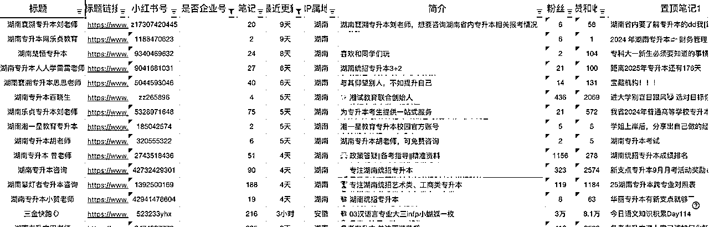

（图例1-详情可以点击链接查看 ）

信息采集概述：通过湖南区域账号采集样本（共计采集约 280+同行账号），目前专升本赛道湖南区与账号类型大体分为两种类型：

1、企业蓝 V 账号矩阵

2、企业蓝 V 账号+教师 or 素人引流账号矩阵

（⚠️注意：报告中信息及分析维度仅来源于小红书平台内相关数据，不涉及客户行业本身商业分析内容）

经过十天的账号笔记制作行业信息了解，补充如下信息：

1、湖南专升本机构与河南、山东等行业大省在新媒体上的投入度不同，采集爆款笔记过程中发现，专注线上营销能达到全国平均线的机构目前只有新支点

2、跨平台采集内容过程中发现在抖音平台通过视频和直播进行引流的机构不在少数，通过账号内容的数据和直播间互动量预测转化率和小红书相差不大，流量到微信开口的比例大概是 5%-10%之间

## 形式一：企业号-长沙本地小红书竞品机构情况汇总

竞品机构信息采集注释：

1、根据公司主题采集蓝 V 认证账号

2、涉及多个资质的蓝 V 账号矩阵，仅采集粉丝量最高的账号

3、全国连锁类机构、综合考试培训机构不在重点采集和分析范围内

| 序号 | 账号名称 | 开始运营时间（主账号首篇笔记） | 粉丝数 | 主页链接 |
| 1 | 湖南华图专升本咨询 | 2024.7.4 | 150 | https://www.xiaohongshu.com/user/profile/6684b330000000000b03249c?xhsshare=CopyLink&appuid=5e12f9680000000001005a1e&apptime=1731562072&share_id=df0c4b6d65f04582926b975dfed91a8e |
| 2 | 湖南库课专升本咨询 | 2023.5.13 | 1354 | https://www.xiaohongshu.com/user/profile/64481fea0000000029012355?xhsshare=CopyLink&appuid=5e12f9680000000001005a1e&apptime=1731562180&share_id=c9d5215792ee4d6aa1f06989f497d883 |
| 3 | 湖南领途专升本咨询 | 2023.5.24 | 3194 | https://www.xiaohongshu.com/user/profile/600b7182000000000100a4bf?xhsshare=CopyLink&appuid=5e12f9680000000001005a1e&apptime=1731562261&share_id=8d778536fa2f49c3b96523b48dd36438 |
| 4 | 湖南乐贞专升本咨询 | 2021.9 | 8081 | https://www.xiaohongshu.com/user/profile/6167e1e300000000020271db?xhsshare=CopyLink&appuid=5e12f9680000000001005a1e&apptime=1731562438&share_id=38be087a8fd14d6c9dca2fe51157c82b |
| 5 | 湖南中公专升本考试咨询 | 2021.9.17 | 1231 | https://www.xiaohongshu.com/user/profile/6110bfc70000000001005f5d?xhsshare=CopyLink&appuid=5e12f9680000000001005a1e&apptime=1731562804&share_id=c784601e61b34f179b57e0c4782cacc6 |
| 6 | 湖南人人学专升本教育 | 2023.1.4 | 2889 | https://www.xiaohongshu.com/user/profile/5ee39de10000000001004e6d?xhsshare=CopyLink&appuid=5e12f9680000000001005a1e&apptime=1731562883&share_id=332a668b461f40c98bcaaaf24e8efcfa |
| 7 | JY 新支点专升本研究所 | 2023.9.8 | 2007 | https://www.xiaohongshu.com/user/profile/649d2071000000000b0170f7?xhsshare=CopyLink&appuid=5e12f9680000000001005a1e&apptime=1731563447&share_id=7c1325cd18b34a9da50753b0359ce81b |
| 8 | 湖南学理专升本咨询 | 2024.4.23 | 46 | https://www.xiaohongshu.com/user/profile/65d554cd000000000503159f?xhsshare=CopyLink&appuid=5e12f9680000000001005a1e&apptime=1731563378&share_id=8194592b4900492a9e69f10f03d3872e |
| 9 | 湖南湘试专升本咨询 | 2022.8.18 | 1047 | https://www.xiaohongshu.com/user/profile/62f5f889000000001f005064?xhsshare=CopyLink&appuid=5e12f9680000000001005a1e&apptime=1731563552&share_id=4d9ce5a3e4fc475a886e8e6d5a358a42 |
| 10 | 湖南宏图兴学专升本咨询 | 2022.5 | 500 | https://www.xiaohongshu.com/user/profile/5f9a7f38000000000101ce23?xhsshare=CopyLink&appuid=5e12f9680000000001005a1e&apptime=1731563662&share_id=cfa67b68f8a84bf7b64a0d5ca7b74a94 |
| 11 | MX梦象专升本咨询 | 2021.5 | 1577 | https://www.xiaohongshu.com/user/profile/5fbd0bde0000000001005b6f?xhsshare=CopyLink&appuid=5e12f9680000000001005a1e&apptime=1731563713&share_id=d7998a151ce5421e9d149578c41870ed |
| 12 | 升德尚专升本咨询 | 2022.6.25 | 4258 | https://www.xiaohongshu.com/user/profile/62b1d5d10000000015014b6b?xhsshare=CopyLink&appuid=5e12f9680000000001005a1e&apptime=1731571326&share_id=67d2cb01d45a44b3bc00d1c1fb0ebcb5 |
| 13 | 湖南考翼专升本咨询 | 2021.10.31 | 1630 | https://www.xiaohongshu.com/user/profile/5e319af3000000000100aad6?xhsshare=CopyLink&appuid=5e12f9680000000001005a1e&apptime=1731571937&share_id=24ef74d63fc5477f85d2d5fda70fd6bf |

### 2.1湖南专升本教育信息汇总分析

概述：根据小红书平台可观察信息维度，优先排除新东方等全国头部综合型平台后，根据限定湖南地区情况分析：

类型一：全国综合类培训机构（覆盖国内主要省市）

类型二：湖南（长沙为主）的地域性综合培训机构

类型三：湖南（长沙为主）的地域性专升本垂直机构 *直接竞品

### 2.2 企业号的获客方式

#### 2.2.1 自然流

小红书针对线索获客的业务客户限制增多， 10 月 15 日新规，基本切断了自然流超过一半的获客流量，矩阵账号效果大打折扣，只发笔记，通过优质的笔记吸引目标人群。经过 10 天运营期初步结论：如果要靠自然流获客，做个人号更有优势

#### 2.2.2 聚光投放

专升本蓝 v 账号，长沙本地的机构基本都在做付费投放，笔记里挂咨询窗口，会引导用户填写联系方式。

根据之前咨询小红书官方人员的数据，专升本行业的微信开口成本在 150-220 之间浮动，根据之前的投放数据来看，湖南本地的开口成本大概可以优化在 160-180 之间，投产比在 1:1.2 以上，就可以实现持续的投流推广了。

目前结论 ：由于行业限制，付费流量黄金期只有备考前 1-3 个月，实际成本要看我们自己出价的情况持续优化。

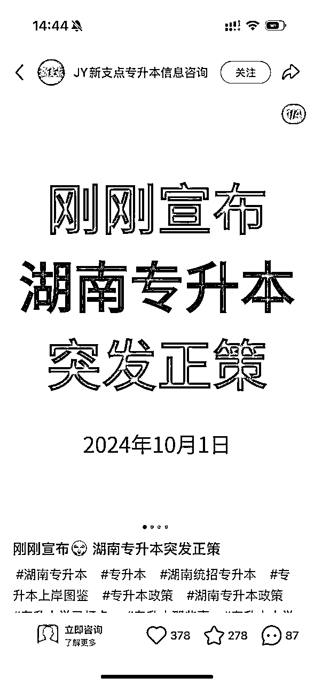

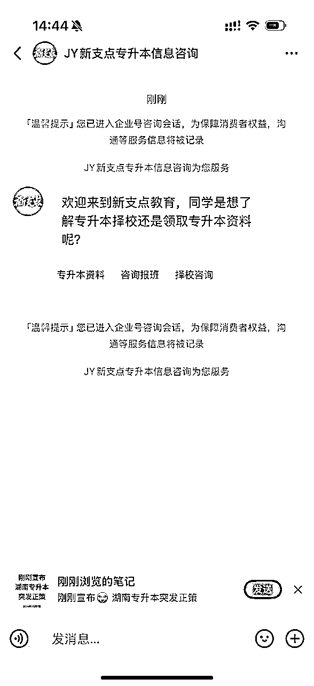

### 2.3 特别关注-新支点专升本机构

1.  已知的共24 个账号，还不包括没有挂“新支点”名称的账号（数据采集时间：2024/11/8）

1.  从23 年开始在小红书大力推广，今年仍然以小红书为主战场。24 年 8 月中下旬开启了至少 10 个账号推广，合计发布至少 500 篇笔记。

1.  新支点的重要打法——资料引流。所有笔记都会有一张展示大量资料的图片，诱导学生咨询，加上微信后并不会发资料，而是询问专业、备考进度等信息，同时定期开设线上直播公开课。

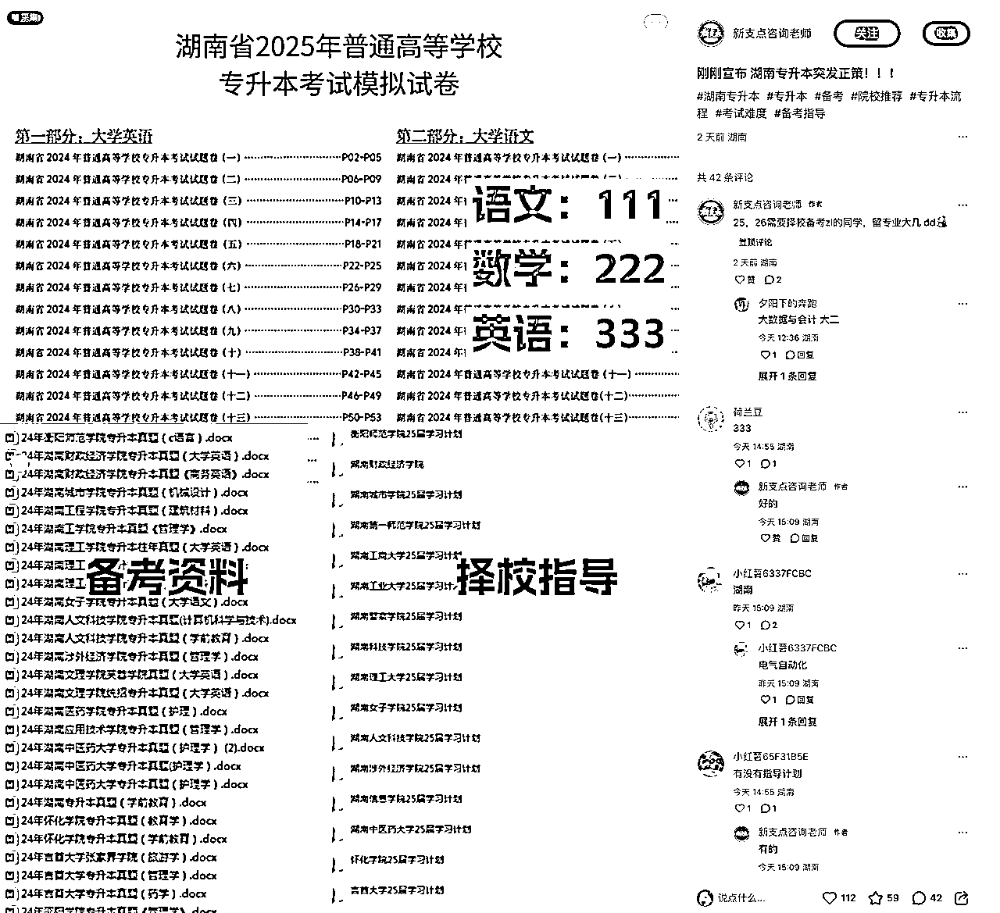

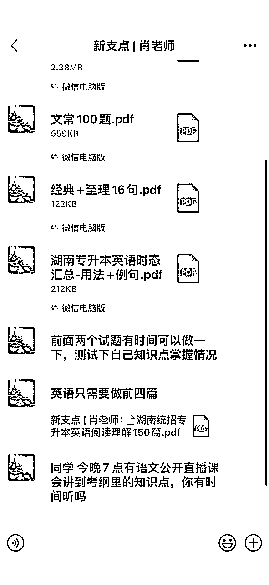

1.  详细账号数据情况如下：

#### 2.3.1 目前搜索情况

自 11.8-11.13 6 天实践中，我们按照上午（10-12 点），下午（16-19 点），时间段模拟自然关键词搜索

「湖南专升本机构」、「湖南专升本」、「长沙专升本」等垂直关键词下，高频出现的机构账号有：升德尚、新支点、励学三家蓝 V 账号，但素人引流类账号：学姐学长号、机构老师号、评测号，依然占据大量搜索结果。

相同关键词在抖音搜索结果中，基本优先展示新支点相关内容，同时发现新支点在抖音直播的数据相对较好。其次为乐贞。

### 2.4-其他可关注机构-考翼

23 年有在小红书做，24 年已放弃。所以考翼在小红书的打法没有太大参考价值。

24 年在小红书主推考研自习室、考研寄宿

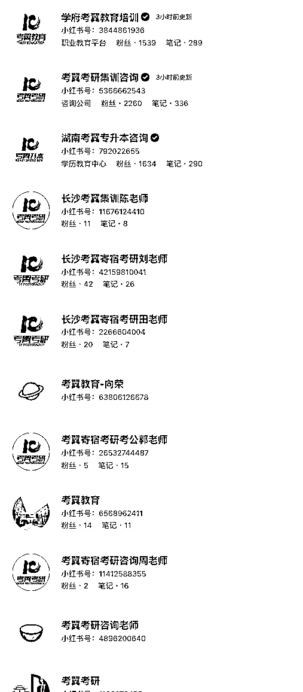

### 2.5 垂直领域关注对象-梦象

一共 4 个账号，在小红书做得很一般，没有特别突出的账号或笔记

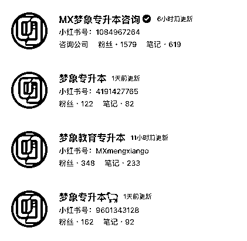

## 形式二：个人号-长沙专升本赛道专业矩阵账号情况

### 3.1 个人号情况信息补充

专升本行业个人号主要有以下几种类型：

类型一：上岸前辈类型，人设设定我已经通过专升本考试的学长学姐，内容主要以分享上岸经验、学习方案、资料分享为主，账号基本「废号法」运营，通过自然流或许客资

类型二：机构老师类型，分享内容与类型一基本相同，但是增加老师人设身份，内容上会增加政策解读、择校指导干活，院校材料分享等。

类型三：评测类：基本是新媒体工作室或者受雇于机构的个人完成的，主要做机构评测内容。

类型四：打造个人 IP，这个类型在专升本赛道不多，梦象和部分老师个人、学长前辈有出镜做视频人设的 IP 账号，数据流量情况暂时不清楚，内容主要以老师或者机构 ceo 发的身份，展现行业的专业度、业务能力、亲和力、共情力等，从而获取学生的信任，促成咨询和付费。

### 3.1.1 个人号引流方式

概述：目前专升本行业，小红书平台个人号引流获客主要还是以图文笔记为主，部分机构账号旗下或者合作的个人IP 账号有视频内容，甚至以视频内容为主，主要角色身份为类型一和类型二。

1.  自然流引流的方式需要大量账号+大量内容搭建矩阵，找到流量入门。

1.  付费流量是小红书官方最近面向线索获客的行业逐步优化的一个方向，除了聚光可以通过绑定 KOS 关系，把老师私人账号转化在机构账号旗下，来实现个人号投流的核心能力，是未来可以考虑的优化流量的方式之一。

### 3.2 关于个人号or 企业号直播的建议

1.  小红书专升本行业目前没有直播间，机构通过直播招募的情况也几乎没有，可以考虑直播引流进行测试

1.  湖南地区做直播专升本的目前频率最高的是新支点，但是平台选择了抖音，我在直播间蹲守 2 个小时，发现峰值在线人数只有 20 人，平均在线人数 10 人以内，如有必要深度调研，还需要持续观察一段时间。

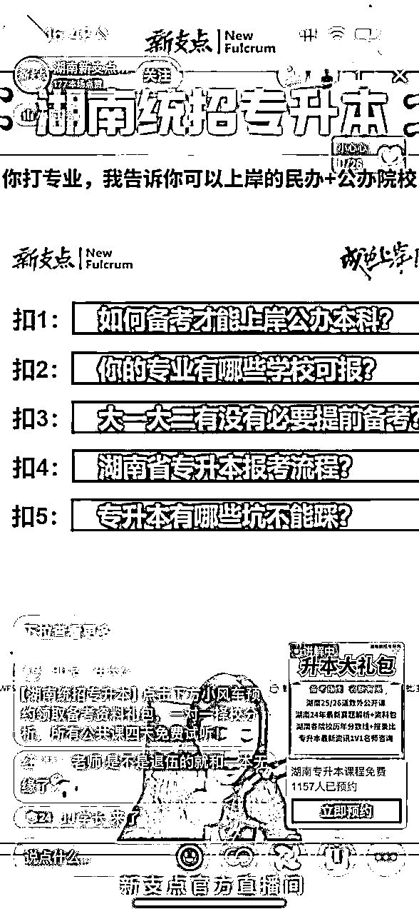

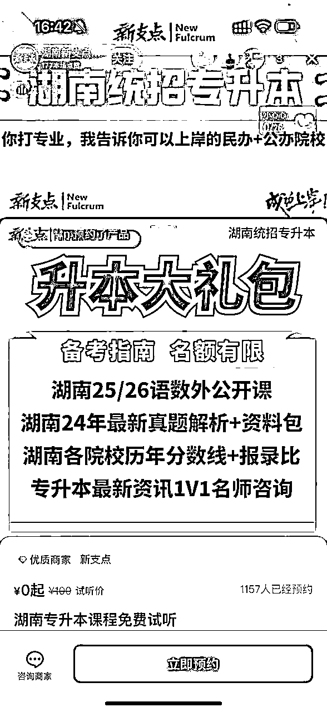

## 内容创作补充

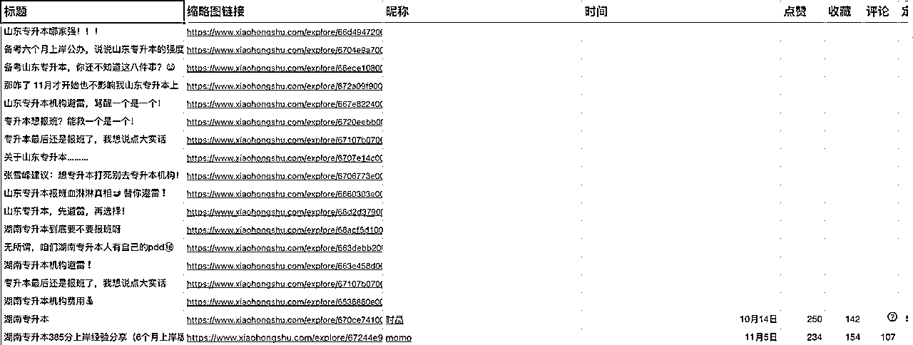

（图例 2-详情点击链接查看 ）

# 二、小红书平台-专升本用户画像综合分析

概述：针对目前 10 天运营情况以及行业情况了解，主要目标客户——专科学生

在小红书主要搜索目的如下：

1、获取学习方式/方法

2、资料/信息获取

3、机构情况了解/报名

4、复习搭子（社交内核）

### 用户画像

*   年龄：通常集中在 18 - 23 岁左右，正处于大专学习阶段，对提升学历有着明确的诉求，渴望通过专升本进入本科院校继续深造，以拓宽未来的职业发展道路和增加自身竞争力。

*   性别：整体性别分布相对较为均衡，但部分专业相关的专升本需求可能存在性别差异，比如文科类专业女生关注度稍高，工科类专业男生占比可能略多一些。

*   地域：遍布全国各省份，不过在教育资源相对丰富、专升本报考人数较多的地区，如山东、河南、广东、江苏以及湖南等地的用户活跃度会更高，这些地区的大专学生面临的竞争压力也更大，因此更积极寻求优质的培训资源。

### 行为表现

#### （一）信息搜索行为

*   高频搜索关键词：经常会使用“专升本”“专升本培训”“[省份名]专升本”“专升本备考攻略”“专升本考试科目”等关键词进行搜索，旨在全面了解专升本考试相关的各类信息，包括报考政策、考试内容、培训机构评价等。例如，临近湖南省专升本报名时间，湖南的大专学生就会大量搜索“湖南专升本报名流程”相关内容。

*   多渠道对比：不仅局限于搜索单个机构，还会搜索多家不同专升本培训机构的名称，横向对比它们的课程设置、师资力量、收费标准、口碑等情况，试图筛选出最适合自己的培训选项，而且会查看机构官方账号、已上岸学员的分享笔记以及一些教育类博主对不同机构的测评笔记等多方面信息。

#### （二）内容互动行为

*   偏好经验分享类内容：对于学长学姐分享的专升本上岸经验、备考心路历程等笔记尤为感兴趣，会积极点赞、收藏、评论，还会主动询问文中提到的学习方法、资料获取渠道等细节内容。比如一篇“专科逆袭本科，我的专升本上岸经验”的笔记，点赞量可能轻松破千，评论区里都是询问具体复习安排的留言。

*   关注课程与师资介绍：在浏览机构发布的笔记时，对课程体系是否完善、师资是否专业权威很看重，若看到介绍机构王牌教师或者特色课程的内容，会仔细查看并通过评论、私信进一步了解详情，像涉及“专升本英语名师押题课”这类笔记往往能吸引不少用户关注。

*   热衷学习资料收集：看到有分享专升本复习资料（如历年真题、知识点总结、思维导图等）的笔记，会毫不犹豫地收藏起来，并且希望博主能继续分享更多干货资料，有的甚至会主动私信求分享链接或者购买渠道等。

#### （三）时间规律行为

*   关键节点活跃度高：在每年本省专升本的报名时间、考试时间前后，以及寒暑假等备考黄金时间段，小红书上的活跃度明显提升。例如，3 - 4 月（部分省份报名期）和 9 - 10 月（强化备考阶段），搜索、互动等行为数据都会出现峰值，此时对培训机构相关信息的需求更为迫切。

*   碎片化时间使用频繁：会利用课余、课间、坐公交等碎片化时间刷小红书，快速浏览感兴趣的专升本内容，所以笔记的标题和封面如果能在短时间内吸引他们的注意力，就更容易被点开查看详情。

### 三、营销、运营（以下内容针对工作室成员）

#### （一）内容创作优化

*   多样化内容产出：

*   除了常规的课程介绍，要增加更多经验分享类笔记，比如邀请机构内成功上岸的学员录制视频或撰写图文笔记，分享他们在机构学习过程中的真实感受、遇到的困难及解决办法等，让潜在用户能产生共鸣并建立信任。

*   定期推出专升本不同科目的备考攻略，结合历年真题讲解知识点和解题技巧，将机构的教学内容融入其中，展示专业性的同时也为用户提供实际帮助。

*   制作关于专升本政策解读的系列内容，及时更新各省份的报考政策变化、招生院校及专业调整等信息，方便用户一站式了解最新情况，使他们觉得机构对行业动态把握精准。

*   提升笔记质量：

*   精心设计笔记标题和封面，标题可采用疑问式、数字罗列式、突出亮点式等，如“专升本英语如何一个月提分 20 分？”“专升本必知的 5 个上岸秘诀”等，封面选择简洁明了且吸引人的图片，配上关键文字说明，提高笔记的打开率。

*   内容排版要清晰，使用小标题、序号、表情符号等将文字分段，便于用户快速阅读和理解；搭配相关的图片、图表、思维导图等，增强可视化效果，例如讲解专升本数学知识点时，配上对应的例题图片和解题思路思维导图。

*   在笔记结尾处，设置引导语，鼓励用户点赞、收藏、评论、分享，同时留下机构的咨询方式或引导关注机构小红书账号，方便后续进一步沟通转化，比如“觉得有用就点赞收藏哦，想了解更多专升本培训详情，欢迎私信咨询我们呀~”。

#### （二） 与客户团队打好配合

*   及时回复与沟通：安排专人负责小红书的评论区和私信管理，对于用户的提问、咨询要做到快速回复，回复内容专业、耐心、详细，哪怕是重复的问题也要认真解答，让用户感受到机构的重视和良好服务态度，提升好感度。

#### （三）项目整体营销建议

*   推出限时优惠：在报名期、寒暑假等重要时间段，推出限时的课程优惠活动，如折扣、满减、赠送附加课程或学习资料等，通过笔记宣传这些优惠信息，制造紧迫感，促使用户尽快下单报名。

# 三、阶段性调研情况结论

调研报告不涉及专升本行业的综合情况，所有信息来源及分析标准以新媒体平台（小红书为主、抖音为辅）内的数据表现和竞品账号运营情况为主

1.  结论一：湖南省内专升本机构在线上新媒体的发力侧重点基本都在小红书平台，打发集中在标准的「矩阵」运营的体系下，目前流量分散在大量素人账号矩阵中，竞争难度中上。

1.  结论二：小红书平台对于自然流获客的平台限制规则短期内看不到放松的可能性，预计明年行业的竞争主战场在蓝 V 账号矩阵+付费投流+私域运营的综合模式。对于甲方客户而言，找到好的投产比才是核心。

1.  个人 IP 账号（ceo 或者老师）的塑造是机构长期价值的核心之一（对标梦象老板），客户团队能力调节符合的前提下，建议孵化 IP 角色账号。

# 四、实操账号情况

# 五、实操线索分析

# 六、笔记分析

## 1\. 重点笔记数据（这里不方便透露客户账号信息）

## 2.笔记优化点

目前这三类笔记的效果是最好的：

### 学习资料

直接分析科目知识点，一点要显得很多，并且排版好看，重点高亮，不能只有黑白两色。

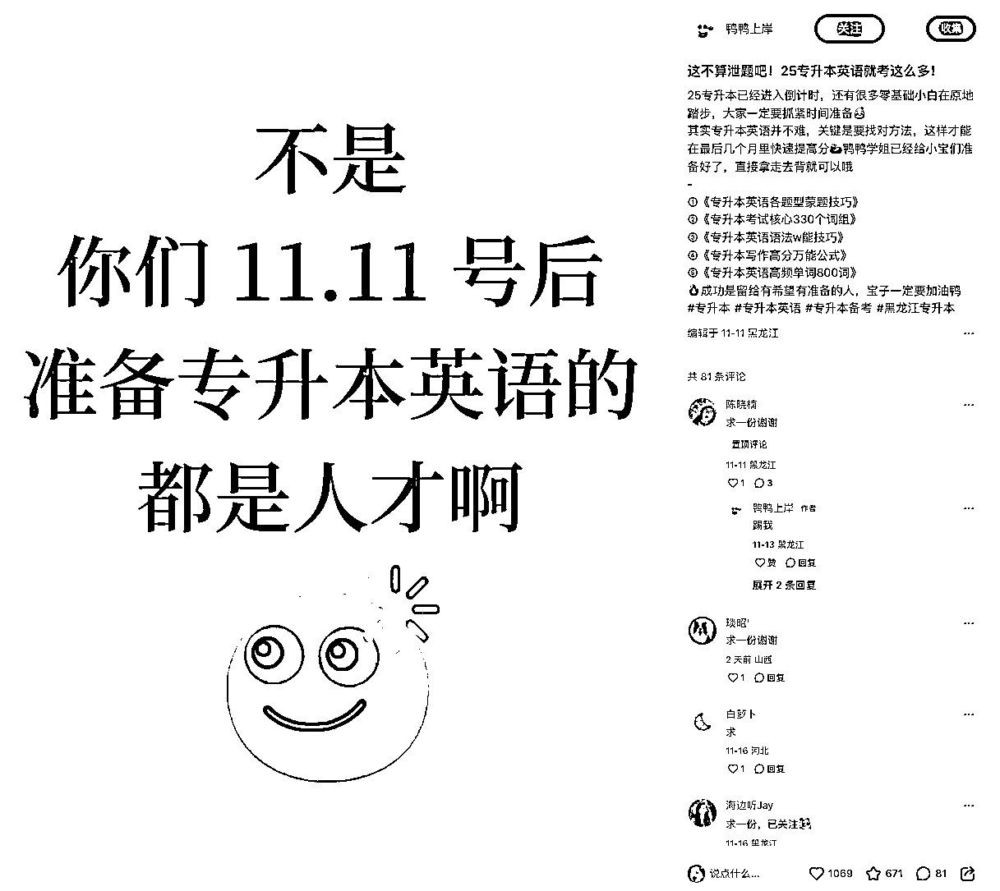

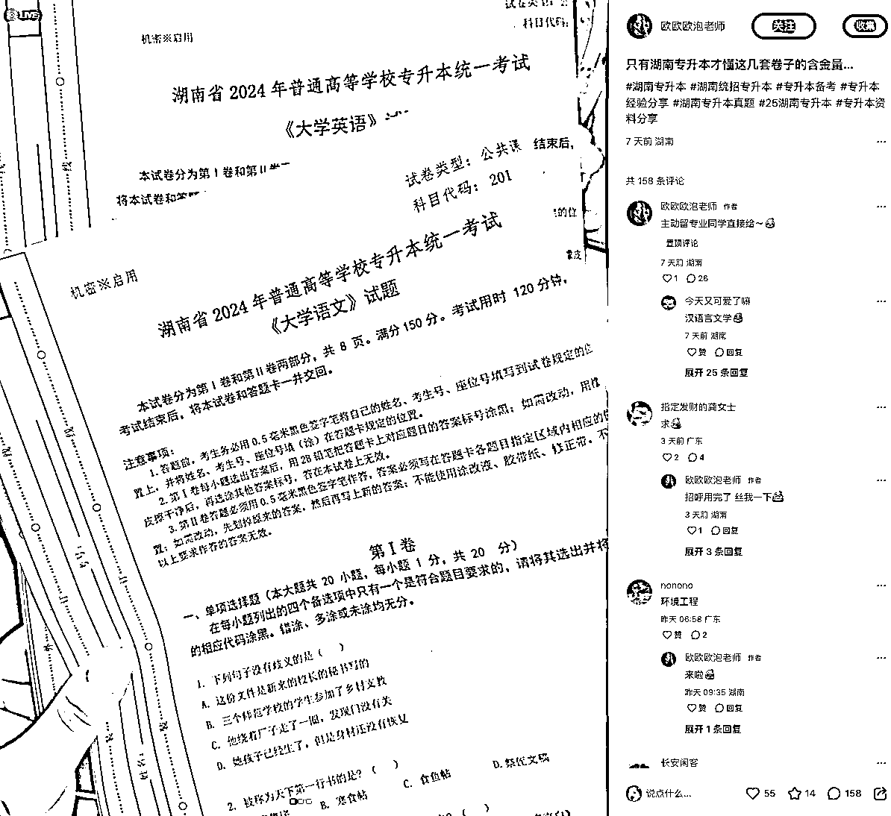

### 上岸经验分享

学长学姐的上岸经验，一定要带上各科目怎么学，用了哪些资料，最后插入一张资料合集图引流。

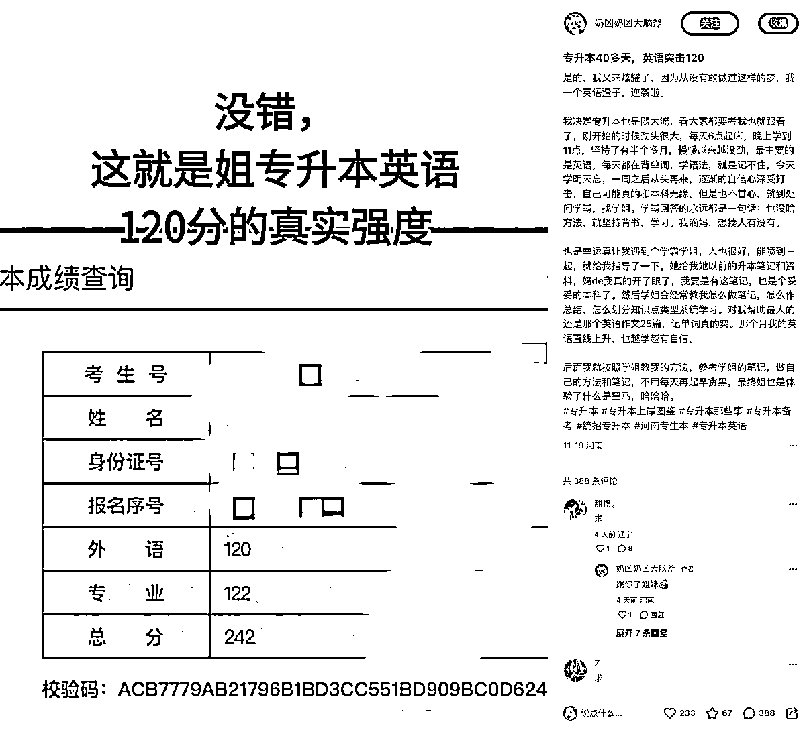

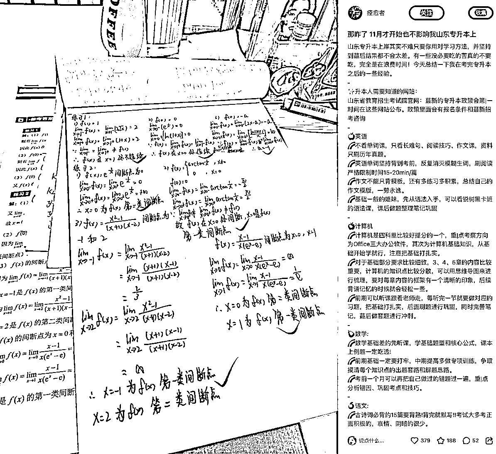

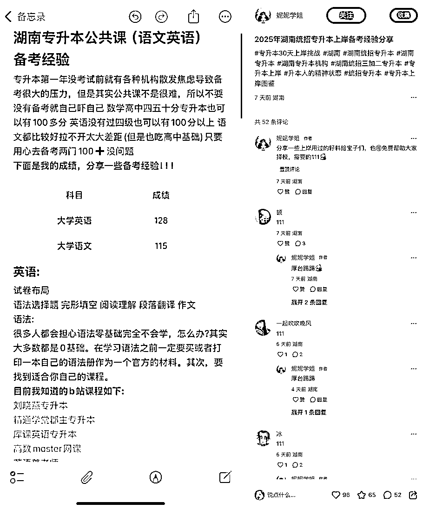

### 政策合集

“政策变天”、“突发政策”标题党，把所有备考之前需要了解的专升本知识整理成一篇笔记，最后插入一张资料合集图引流。

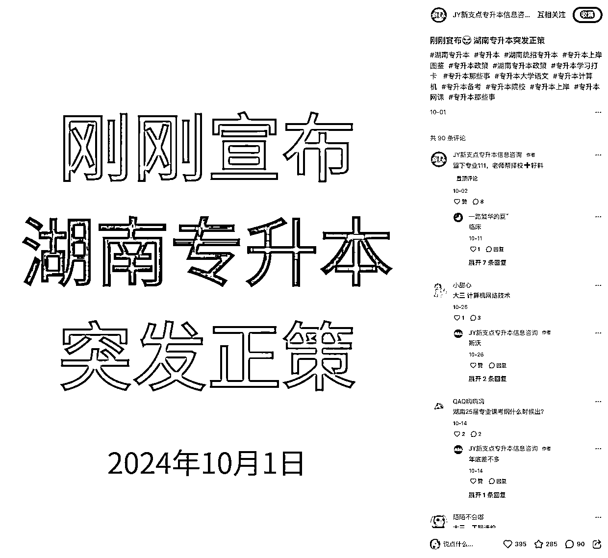

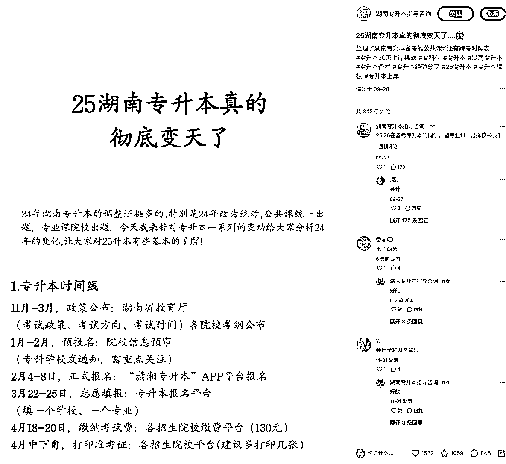

## 3.可参考对标笔记

# 七、投放数据

## 投放笔记情况

## 投放每日数据

## 投放时间段

按照目前数据看9-14点是整体的跑量以及流量的黄金时间

同时成本相对也很低均在50左右

17-18点及19-20点这个点的成本相对较高，可以在观察几天如果还是比较高的情况，后续就可以暂停

## 投放优化点

1、投放时间17：00-18：00 19：00-20：00 的时间段暂停

2、目前是两篇笔记在同一个计划下跑，可能存在软广笔记抢量、硬广笔记跑不出效果的情况。在原先的计划定向下复制一下计划，两条计划同时跑，各跑一篇笔记同时测试下。

3、后续预算可以增加一些，加大量级。目前日预算是 500，日预算可以增加到 800-1000。

4、私信回复速度方面可以适当缩短一点，可以增加一定的加V率。

5、可以新增两篇投放笔记，之前关于价格那篇投放效果不佳，可以继续测试。