# [ComfyUI]虚拟模特换装三视图，请模特的钱可以省下了

> 来源：[https://qnc80j2zlx.feishu.cn/docx/HkCsdMJWsoc2e8xbf9scYyB7nse](https://qnc80j2zlx.feishu.cn/docx/HkCsdMJWsoc2e8xbf9scYyB7nse)

# 一、介绍

大家好，我是嘟嘟，深耕ComfyUI赛道。

今天继续分享服装迁移的工作流思路，今天这套工作流我打磨了3天。

非常适合电商服装系列做套图使用，省下请模特的费用。

来看几张作品图

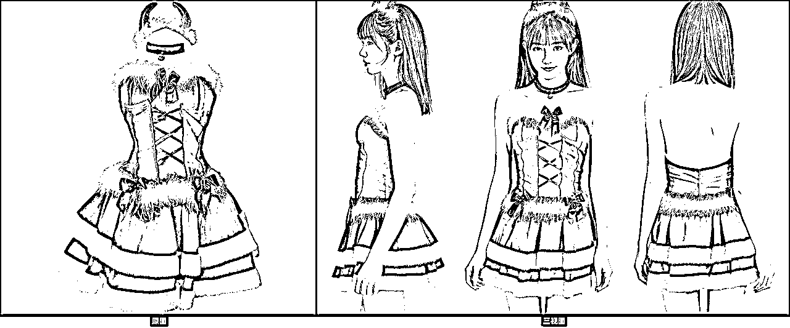

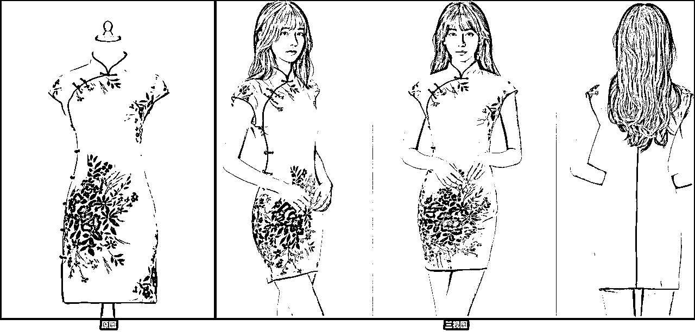

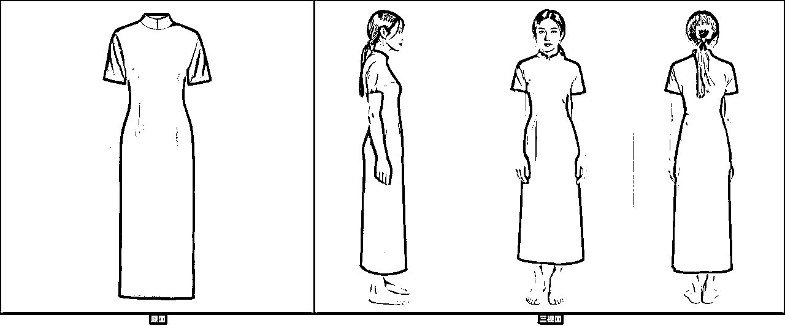

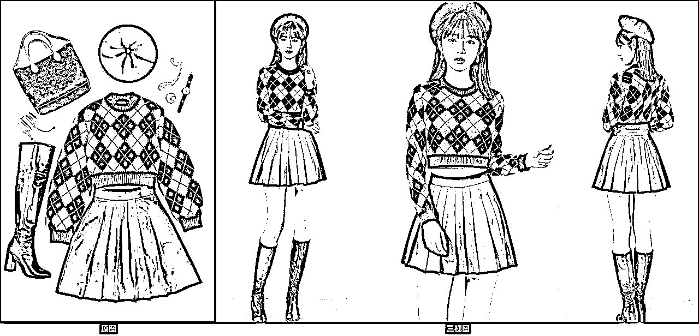

# 二、工作流说明

这次这套工作流有点复杂，面向商用的，所以流不免费提供下载了。但是我会把每个模块的工作流截图并做具体说明，大家看完跟着搭建就可以实现一样的功能。

一共分七个模块，包含了生图、遮罩处理、换装、脸部修复、高清放大、裁剪拼图等模块。

完整工作流截图如下

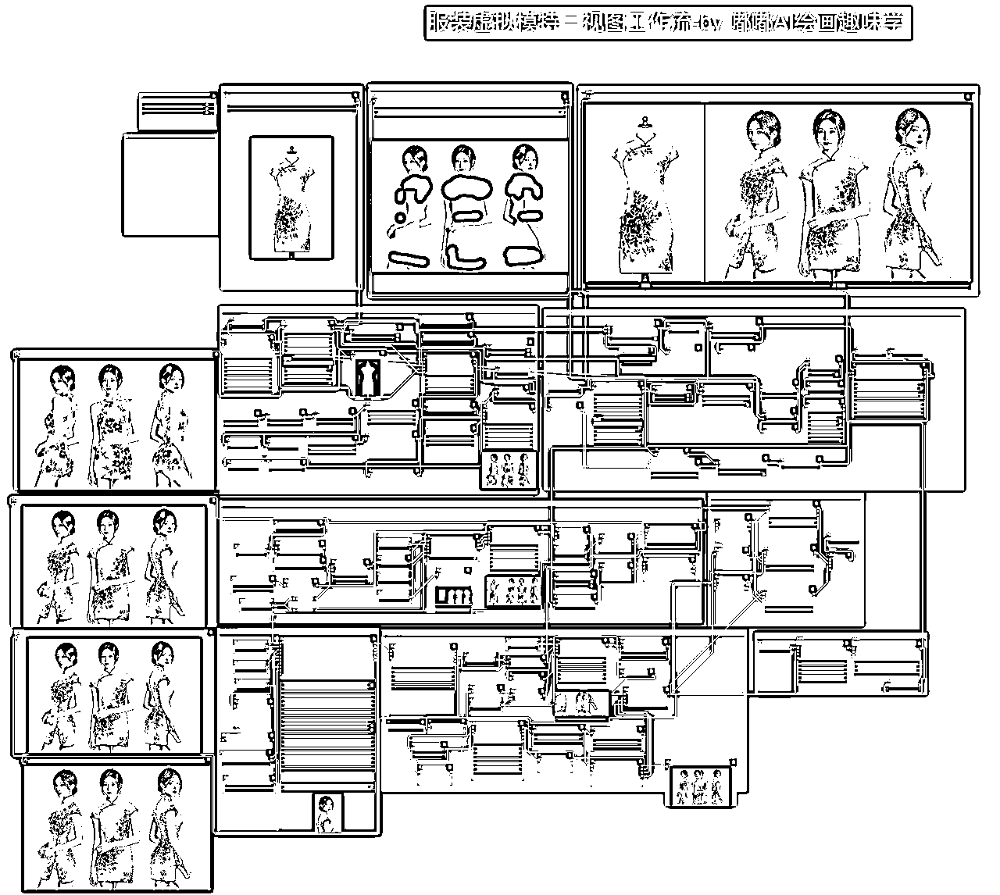

## 2.1 三视图生成

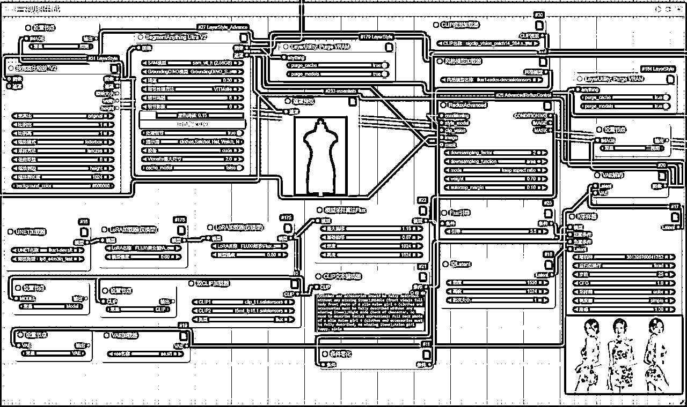

该模块，利用了Flux+Redux+提示词结合的形式，生成参考服饰的三视图，为后续换装提供素材图。

核心的提示词这里分享给大家

Photos in raw format, HD, 4KA real model outfitting photo, three views, namely the left side, the front side, and the right side. The characters are the same person to maintain consistency, and the picture should form an overall display.This diagram consists of the following parts:Left (model shown from left without face): profile photo of a slim Asian girl + (clothes and accessories should be fully described without any missing items);Middle (front view): full body front photo of a slim Asian girl + (clothes and accessories must be fully described without any missing items);Right side (back of character, no need to describe facial expression): full back photo of a slim Asian girl + (clothes and accessories must be fully described, no missing items);Asian girl happy，simle

这还有个细节要注意

利用了Redux的权重调节机制

默认设置3，数值越低，参考服装的权重就越大，所以如果你发现抽卡出来的三视图模特服装和参考图结构差距很大，那么这里适当调整，改成2试试效果。

我们的目地是让AI既能参考服装，又能利用到提示词的能力，所以这里要微调。

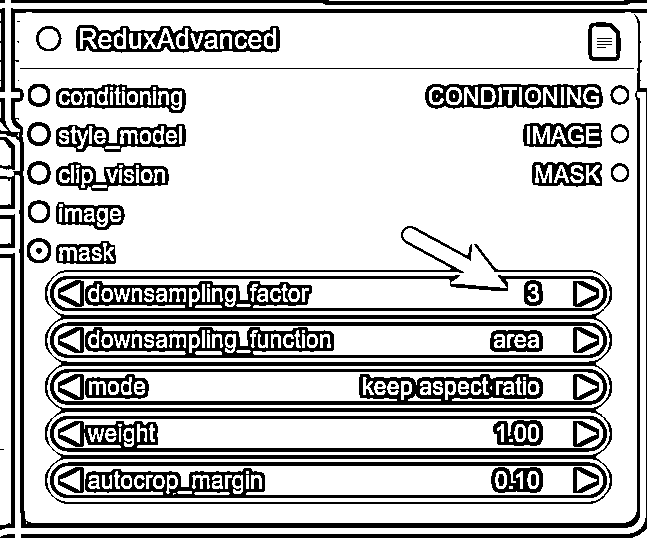

## 2.2 遮罩处理

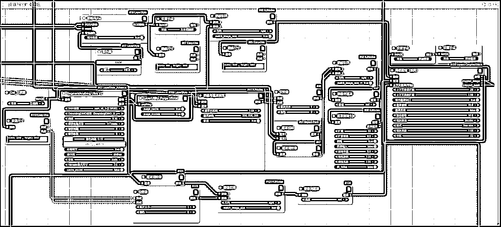

该模块主要是为了生成拼接图和拼接遮罩，为后续换装提供素材。

另外这里有个遮罩桥接预览，支持我们手动涂抹遮罩，增加一些自动识别没识别到的区域，这样可控性大大增加了。

原则就是最终遮罩要覆盖参考图有的部位，这样服装迁移时候才能完整迁移过来。

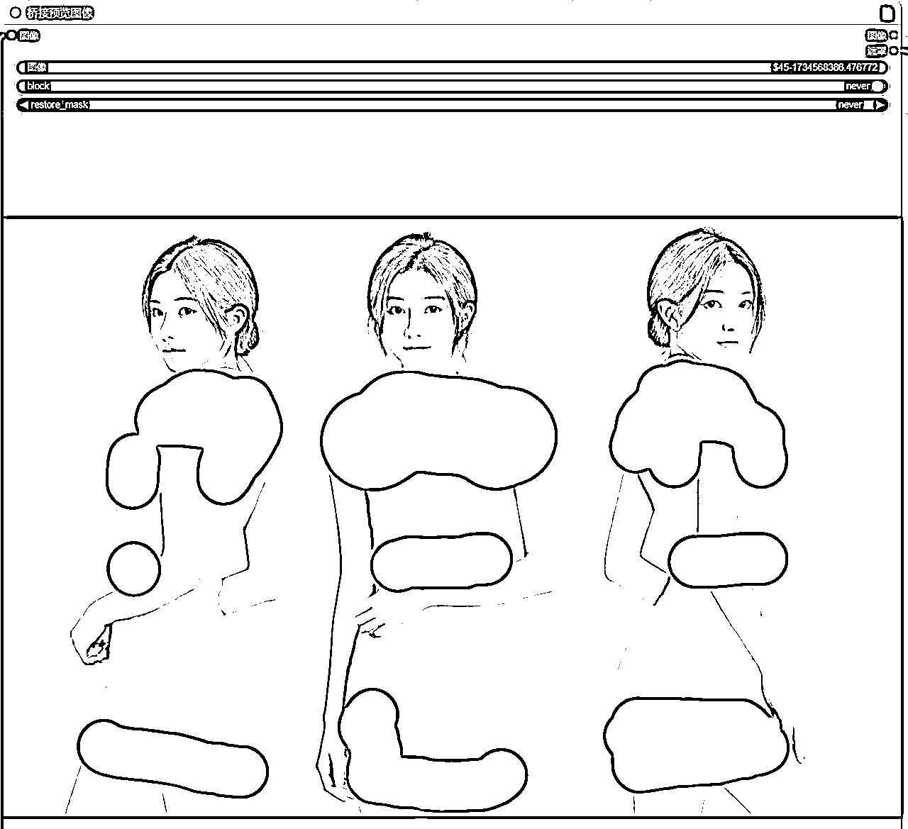

## 2.3 服装迁移

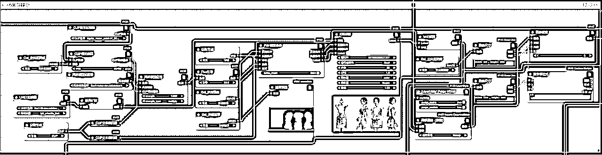

上面遮罩处理好了，就开启该模块跑图，模块利用了Fill+Redux的能力，实现衣服完整迁移，目前对一些简单图案的图来说，迁移能力可以达到99%，复杂的也有90%迁移能力，具体的需要不断调整参数，抽卡就完事了。

这一步生成好迁移图后，会做一步裁剪，只留下右边的三视图部分，后续脸部修复和放大用的上。

## 2.4 面部细化

这个模块是否开启要看之前生成的模特脸部是否有异常，有的话就开启，觉得没问题这步也可以跳过，节省点时间。

这一模块也可以自己扩展，添加换脸Pulid插件，实现换脸功能。

## 2.5 TTP放大

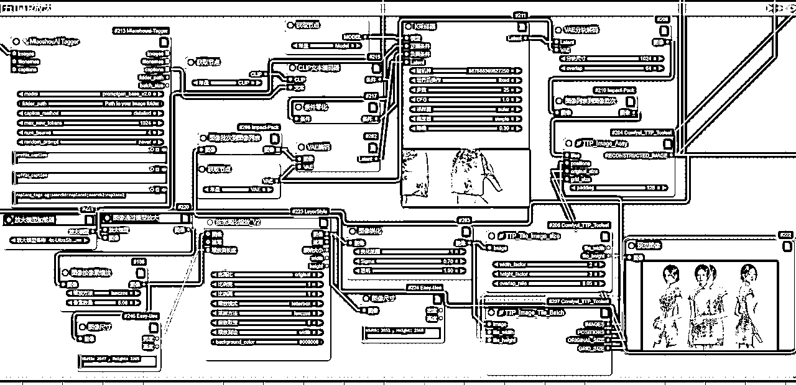

这里我是利用了比较常规的一个TTP放大功能，直接放大到4K左右大小，本地电脑跑不动的可以适当调整放大倍数，自己也可以尝试用SD放大或者Supir放大的其他放大功能。

后期我也会分享一篇放大的总结篇。

## 2.6 裁剪和拼图

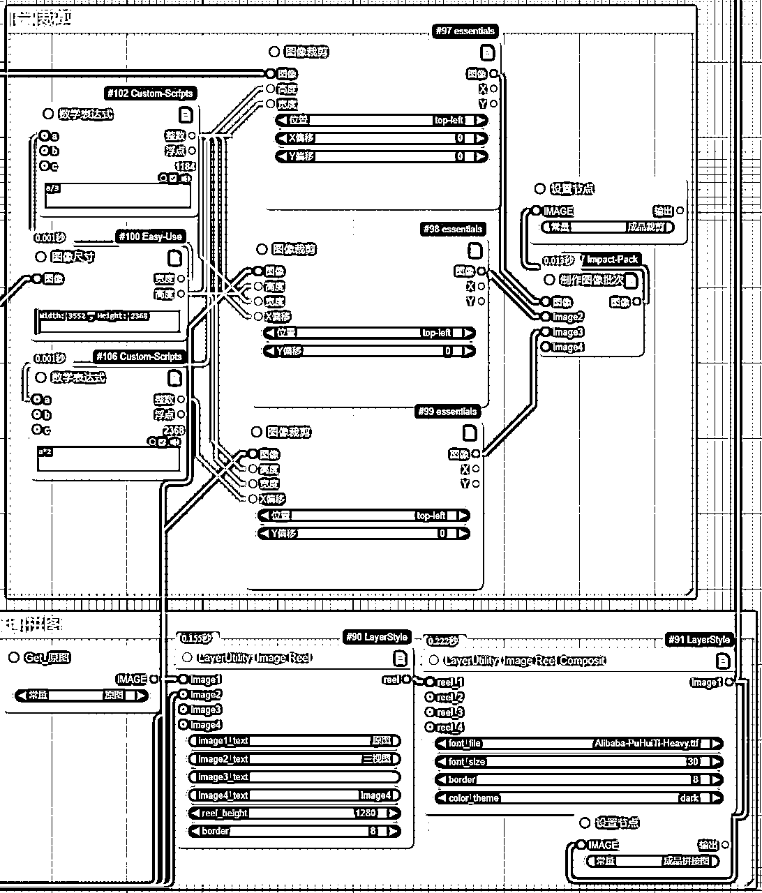

这两大模块算是收尾工作了，按分辨率进行自动裁剪，这样三视图就变成三种独立的图片，拼图这是把原图和三视图水平拼接。

# 三、总结

ok，今天就分享到这里，核心是利用提示词的能力生成三视图，再做后期的换装。

这种随机性比较强，可控性弱一些，我测试了几十次，有时候生成的不是三视图，就要重新抽卡。

下一次我会分享基于姿势图来生成，那种可控性大大提高。

这次的工作流就不提供下载了，上面每个模块截图很清晰，有点基础的跟着搭建就可以做出一样的。