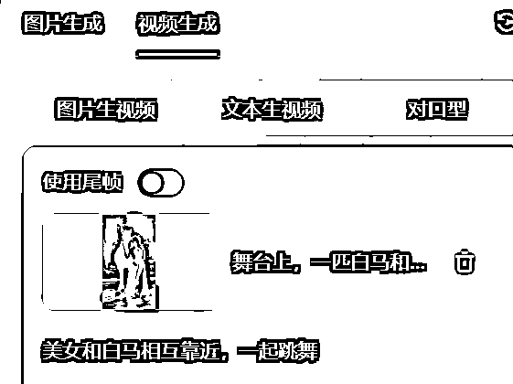
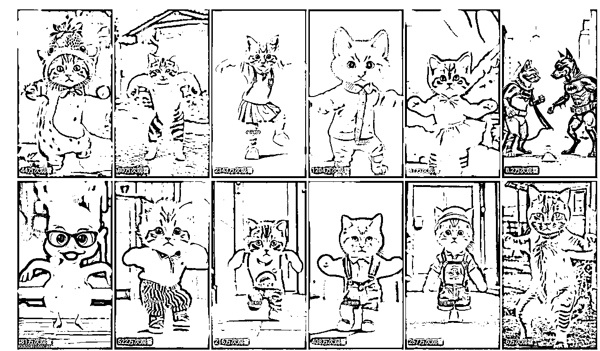
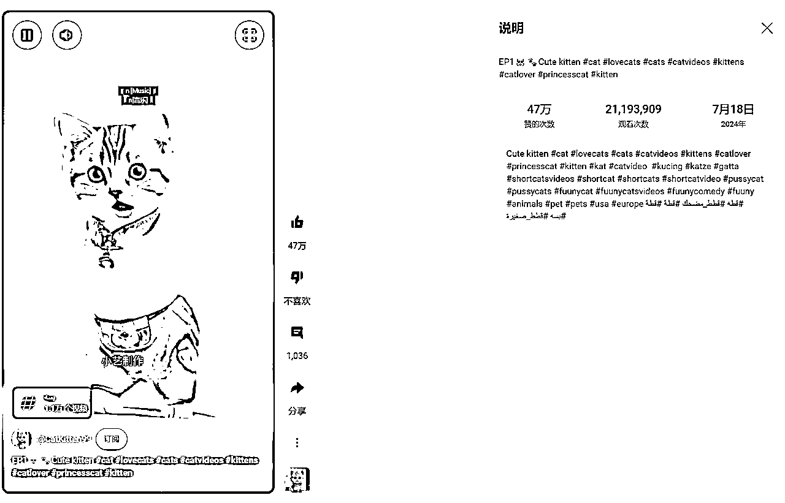

# AI-Shorts两类视频复刻教程（怪物融合+动物跳舞）

> 来源：[https://ktnwm6ohjn.feishu.cn/docx/HqgGdQEvnoO4pzxUV5AcN6e6nRg](https://ktnwm6ohjn.feishu.cn/docx/HqgGdQEvnoO4pzxUV5AcN6e6nRg)

大家好，我是土豆君，最近都在研究AI生成的shorts视频。之前有研究AI动物故事视频的复刻，最近发现了一些更简单的AI视频，数据表现都还不错，就研究了下制作过程，分享一下~

# AI融合怪视频复刻

AI类短视频有一类是融合怪，通过AI视频生成两三种动物的融合效果，比如：

https://www.youtube.com/hashtag/fusion/shorts

如果要做融合怪视频，可以参考下对标账号，大约有这几种类型：

### 对标参考

（这里对标只是举例子，具体的对标账号需要根据自己的情况选择。）

动物融合，纯图片，不使用AI生成视频：

https://www.youtube.com/@HeshanMalinda-nf6ws

动物融合，包含AI视频生成怪物融合过程：

https://www.youtube.com/shorts/XU0yhFEnzrQ

人与动物融合：

https://www.youtube.com/@AnimolFacts/featured

人与动物融合达人秀，加入一些达人秀的 视频剪辑：

https://www.youtube.com/@TalentSnap

### 示例视频

这里展示两个视频：

https://www.youtube.com/shorts/-alVWmtIRYM

https://www.youtube.com/shorts/2YmX-9auHUw

左边的这个对标视频是纯图片生成，比较简单，可以用 Dalle3 和 Midjourney 生成类似图片。

右边这个视频就加入了融合过程，需要使用首尾帧视频生成。

首尾帧视频生成是什么呢？我这里展示一下。

一般我们可以使用即梦AI或可灵AI生成这类视频，目前是即梦AI免费生成不用排队，更推荐尝试一下。

即梦AI：

*   国内版：https://jimeng.jianying.com/

*   海外版（不推荐，目前功能不全）：https://dreamina.capcut.com/

可灵AI：

*   国内版：https://klingai.kuaishou.com/

*   海外版：https://klingai.com/

这里左边用的是即梦AI(视频模型1.2)，右边用的是可灵AI：

生成的效果：

这样一个融合的片段就生成了，如果要做1分钟的视频，需要大约拼接7段视频，刚开始模仿这类视频可能比较困难，可以先尝试只制作十几秒的短视频，拼接三段左右就行。

对标参考中列举的第四种就是舞台表演融合怪，这种视频只拼接了三段AI视频，制作就比较简单。

接下来就以达人秀融合类视频作为案例展示，拆解下这种视频是如何制作的：

### 案例拆解

对标视频 https://www.youtube.com/shorts/4dsM0zD-tdo

先看下效果。左边是原视频，右边是我模仿出来的视频：

这样的视频制作不难，融合的原理就是使用首尾帧视频生成功能：

### 制作演示

案例演示使用即梦AI，用可灵AI也可以。https://jimeng.jianying.com/

先使用图片生成，输入提示词，也可以导入图片。

#### 生成三张图片

生成一张美女和白马的图

舞台上一个美女和一匹白马走在一起

即梦AI会生成四张图片，选一张合适的就行，我这里使用了第二张图，欧美人脸。

然后生成融合后的结果图，我选择了第二张图。

舞台上，一个长着马耳朵的欧美人美女，穿着白色礼服，留着金色的长发

生成的融合前的图片，这里我使用了参考图。

舞台上，一匹白马和一个穿着白色礼服的欧美人美女靠在一起。

#### 生成三段视频

生成融合过程的视频：

生成融合前的视频：

生成融合后的视频：

#### 视频剪辑

把三段视频拼接剪辑。

我们把对标视频的剪辑画面保留，像惊讶的画面也可以用AI生成，去其他视频截图都可以，我这里就直接保留原视频的画面。

然后 AI生成的视频用自己的替换，使用同样的音乐，视频就生成好了。

# AI动物跳舞视频复刻

AI有一类比较火的视频是AI猫猫跳舞。

https://www.youtube.com/source/bWYB4u3M3uk/shorts?bp=8gVbCk4SPwoLYldZQjR1M00zdWsSC2JXWUI0dTNNM3VrGgswS0pTXzJkMmpPayIKEggIBxDAu9C2ASoKEggIBxDAu9C2ARoLMEtKU18yZDJqT2so48qu2bTLip7CAQ%253D%253D

这类AI视频制作也不难，流量也很不错。

### 对标参考

（这里对标只是举例子，具体的对标账号需要根据自己的情况选择。）

#### 账号1

https://www.youtube.com/@CatKitten99

这是国人的油管账号，第一条视频7月18号发布的，2000w的观看量。

#### 账号2

https://www.youtube.com/@serenovive

8月12号开始转做猫猫跳舞视频

#### 账号3

https://www.youtube.com/@AnimalsShorts-h1f

9月11号注册，单个shorts视频流量5w+以上

#### 账号4

https://www.youtube.com/@furry-cornerz

7月7号开始转做猫猫跳舞视频

### 制作方式

对标视频 https://www.youtube.com/shorts/0KJS_2d2jOk

动物跳舞目前可以有如下几种方式生成：

#### 通义千问App

通义千文里面的全民舞王频道可以免费生成跳舞视频。

#### Viggle

https://viggle.ai/

Viggle 平台可以输入图片和示例视频制作跳舞视频。平台官网每天免费10次，Discord 目前免费。

模板🔗：https://viggle.ai/prompt

Discord🔗: https://discord.gg/viggle

#### ComfyUI

ComfyUI工作流，结合阿里开放的UniAnimate模型制作动物跳舞视频

https://www.liblib.art/modelinfo/b73fac6d3ae44a8ba3f02364f74b4938

模型官网🔗：

*   节点：https://github.com/Isi-dev/ComfyUI-UniAnimate-W

*   模型：https://www.modelscope.cn/models/iic/UniAnimate

### 制作演示

个人感受，通义千问App的全民舞王效果最稳定。而Viggle效果测试效果差很多。

ComfyUI不能直接在哩布哩布平台在线跑，工作流需要自己下模型，解决报错问题，比较麻烦。

接下来就以全民舞王作为猫猫跳舞视频制作演示：

进入全民舞王，在创意广场选择一个模板，选择做同款，导入一张AI图片，点击立即生成就行。

生成效果，基本还是比较真实的。

如果没有模板的动作视频，需要导入一个视频先制作模板（免费10次，每次登录送1次），然后再生成相似视频。

生成的效果如下，视频效果相比上一个自带的模板稍微差一些：

左边是原视频：https://www.tiktok.com/@animaldance0711/video/7421795597981601042

# 补充

之前分享过的实操技能，感兴趣的小伙伴可以研究一下~

【生财技能】AI动物故事视频复刻与批量生产

https://wx.zsxq.com/group/1824528822/topic/2858241444858581

【生财技能】抛弃显卡！ComfyUI+Flux 纯网页跑图喂饭级教程

https://wx.zsxq.com/group/1824528822/topic/4848244528852218

【生财技能】海螺AI图生视频如何用RPA提升10倍速高效产出视频？

https://wx.zsxq.com/group/1824528822/topic/2858211254588441