# 一个普通人在公众号日更1000天的写作系统分享

> 来源：[https://fp22b5b6ot.feishu.cn/docx/IRnqd3xQZoqeugxTwtocspz7nCb](https://fp22b5b6ot.feishu.cn/docx/IRnqd3xQZoqeugxTwtocspz7nCb)

各位好，我是正记录Beta，前程序员，现自由职业两年多，目前专注于「1v1脱单陪跑」带你享受甜甜的💘恋爱。

今天来分享：一个普通人在公众号日更1000天的写作系统

其实我有些犹豫，要不要来写这篇内容，犹豫的一个点是：最近我公众号的流量有点拉胯了，数据不太好看。

后来想了想，我日更写作 1000 多天了，

也做出了一丢丢的成绩，阅读量拉胯的问题，也不是第一次遇到。

可能对部分朋友有启发，就来分享了，分享的内容仅供参考，不作为决策的依据。

在日更的 1000 篇文章中，阅读量过万的文章有 85 篇，其中有 4 篇阅读量达到了 10万➕，这些内容，让我从一个木讷大龄的程序员，零基础转行情感行业，并月入三万。

关于这块转行的经历，可以看之前的分享（我是如何从大龄程序员，迷茫探索500多天之后，零基础转行情感行业，并实现了月入3万的？），这里就不具体展开了。

现在遇到流量下滑，这只是持续日更过程中的遇到的一个问题而已，这个问题一定有解决方案，只是我目前没有找到而已。

# 0.本文目录

# 1.为什么要进行日更写作，以及每个阶段日更的目标是什么？

第一：刚开始的日更目标

第二：日更100天后的目标

第三：日更200天后的目标

第四：日更300天后，我想明白了日更的意义

第五：日更400天后，我找到了脱单陪跑的方向

第六：日更500多天后，我找到人生使命

# 2.适合普通人日更写作系统，让你稳定输出 1000 天

第一：日更系统之：输入信息

第二：日更系统之：加工信息

第三：日更系统之：输出信息

第四：写作系统之：文章管理

第五：日更系统之：时间管理

# 3.日更写作可能遭遇的 N 种挑战及解决方案

第一：写作习惯与技巧提升

第二：内容创作与个人定位

第三：心理调整与情绪管理

第四：持续写作的挑战与益处

# 4.总结

# 1.为什么要进行日更写作，以及每个阶段日更的目标是什么？

我是从 2022年03月07日开始，在公众号进行日更写作至今，持续的时间超过了 1000 天。

## 第一：刚开始的日更目标

最初开始日更写作，

一方面的原因是：当时学完一个写作课，课程里面建议进行日更写作。

另一方面的原因是：我想要把写作的习惯重新捡起来，上次在公众号发文的时间是 2020年6月3日，一晃过去快两年了。

日更到 100 天的时候，我结束了八年的北漂职场生活，回到了山西太原，和媳妇结束了异地生活。

结束北漂的直接原因是：公司裁员。

间接原因是：我想离开北京了，想换一种生活方式，所以当时被裁员以后，我并没有在北京投递简历找工作。

现在回想起来，特别感谢这次裁员，不然我不太可能会开启自由职业的生活，也特别感谢我通过文字记录下这段时间的所思所想。

## 第二：日更100天后的目标

这时候日更写作的目标：

一方面是为了自律，不上班以后，每天的时间很多，我想给自己找个可以每天做的事情，比如日更写作。

另一方面我是想通过写作去探索更多的可能性，看看自己除了写代码，还能干什么？

我在日更100天的文章中提到：接下来的目标是：继续每天更新内容。

在《刻意学习》这本书中提到一个N阶理论：

一般人能持续行动10天，算是有点儿体验，这叫一阶行动者。

二阶行动者基本是能持续行动100天，基本能改变几个习惯。

三阶行动者能行动1000天，3年可以整体上一个人生台阶。

四阶行动者的周期是10000天，约30年，则接近于一个时代，如果持续行动，小可在时代取胜，大则可以翻天覆地。

……

## 第三：日更200天后的目标

日更到 200 天的时候，我的日更目标是：希望能沉淀下来一些系列的内容，发布到小报童专栏上。

到目前为止，我沉淀了三个小主题的，小报童专栏：《印象笔记使用指北：让无序的生活变得有序》、《感恩日记书写指南：心怀感恩，幸福常伴》、《高效脱单经验书》，其中《高效脱单经验书》的销量最好，卖了有 400 多份了。

李笑来在《通往财富自由之路》中提到：有三种个人商业模式：第一：一份时间出售一次；第二：同一份时间售出很多次；第三：购买他人的时间之后再卖出去。

我目前的几个小报童专栏算是达到了第二种个人商业模式：同一份时间售出很多次。

## 第四：日更300天后，我想明白了日更的意义

日更到 300 天的时候，我想明白了日更的意义，把日更划分了三个阶段：

第一个阶段：先做加法，

也就是前期没有定位，任何合法的内容都可以写，

主要的目的是克服对写作的恐惧，同时锻炼把事情说清楚和想明白的能力。

第二个阶段：是做减法，

也就是聚焦或者是有个明确的定位，专注写某一方面的内容，可以出一个小的专栏或者课程，这个阶段重要的不贪心。

第三个阶段：是乘法，

写作能力*其它能力1*其它能力2……，

这里的写作能力，就是你的核心竞争力，

什么是核心竞争力，就别人短时间内无法掌握的能力或者资源。

## 第五：日更400天后，我找到了脱单陪跑的方向

日更到 400 天左右的时候，有朋友来找我咨询情感问题，咨询结束后，对方发了我 666 元的随喜红包。

平常别人找我咨询，就是给我发个几十、一两百的红包，666 元对于当时的我来说是异常值，所以我主动和对方开了一个「情感修炼手册」辅助对方脱单。

在这个过程，我好像意识到，我能做好帮人脱单这件事，虽然我是一个木讷的程序员，可能这是我无意中解锁了，我未知的天赋。

当我意识到我的这个天赋以后，在接下来的几个月时间里，我学了两门恋爱相关课程、读了几十本相关的书籍。

目前这个书单我放在「微信读书」APP里面了，

在微信读书搜索「脱单相亲找对象」就能看到这个书单，目前这个书单有一百多人收藏。

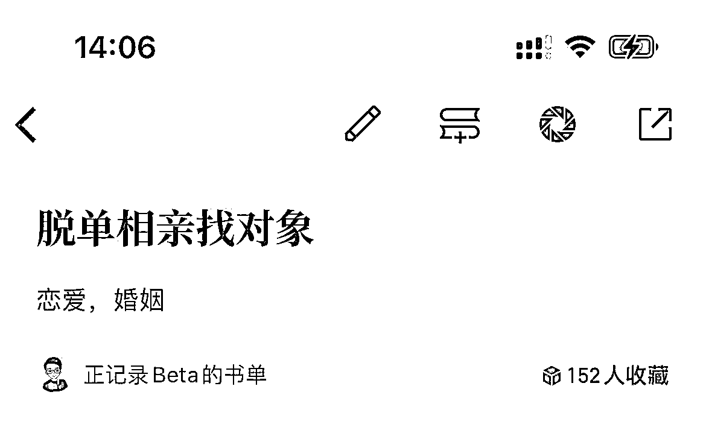

## 第六：日更500多天后，我找到人生使命

日更到 500 多天的时候，我达到了月入三万的水平，让我有了可以一辈子不上班的想法。

再后来我日更的目标是：帮助更多人脱单是我的人生使命，为了这个使命无论做什么事情，我都是快乐的，我是感觉不到痛苦的。

我还把这句话添加我的写作模板的开头，每次写文章之前，我都会用非常肯定的语气把这句话读出来，让我帮助更多人脱单。

泰勒·本-沙哈尔在《幸福的方法》这本书中提到：人们对待工作有三种态度：任务、职业或使命感。

试着想一想，你现在是把你的工作当成是任务、职业，还是使命？

把工作看成使命的人来说，工作本身就是目标，薪水和机会固然重要，但他们工作是因为他们想要做这份工作。

如果你也想开始日更写作，试着玩一玩这个小游戏，

用「只要持续写作，」进行造句哈，看看「持续写作」能给你带来多少可能性。

比如：

只要持续写作，我就能持续开心；只要持续写作，我就能财务自由；只要持续写作，我肯定出个10万+；只要持续写作，……

# 2.适合普通人日更写作系统，让你稳定输出 1000 天

要想避免创作枯竭，能持续写作，最好的方法就是构建一个写作系统。

不然依靠单纯的意志力，只能坚持一小段时间，就像大部分人日更 100 天以后，就放弃了写作。

意志力只能帮助我们一时，要想长时间地做好知识积累，更聪明的办法是为自己打造一套「持续日更的写作系统」。

所谓「系统」并不是简单的把一大堆东西放在一起，这些东西之间必存在强烈的关联。

比如我们把居住的房子看成是一个系统，房子是由砖头构成的，但是有再多的砖头放在一起，也不能成为真正意义上的房子，为了让砖头变成房子，还需要水泥、钢筋、设计图等等。

对应到「日更写作系统」上也是一样的，再多的信息放在一起，也只是一堆信息，并不能构成一篇文章，必须把信息进行加工整理，然后按照一定的结构组织为一篇文章。

## 第一：日更系统之：输入信息

在我看来日更写作分为两种情况：没有定位的日更写作和有定位以后的日更写作。

先来说说，没有定位时的输入信息，也就是如何找写作话题，

我的经验是，在这个阶段每天的日更内容，主要写今天有什么收获就行，

比如今天读了什么书、遇到了什么问题、情绪有什么波动、见了什么人，对你有什么启发。

如果今天没什么收获，就写写今天为什么没有收获，反思反思，避免下次再出现这样的情况。

这个阶段核心目的是，锻炼你对信息的敏感度，

也就是你看到一个信息以后，围绕这个信息，你能想到哪些关键字、哪些写作话题。

比如看到花，有的想到的是春天、有的人想到的是少女、有的人想到的爱情……

当你写了一段时间后，你的信息敏感度提升了，你对自我了解的更多了，就很容易找到适合自己的定位。

对于我们普通人来说，写作的定位不是想出来的，而是你在写的过程中，自然会浮现出来的。

万维钢在《精英日课》专栏中提到：很多好东西都是做正确的事情带来的副产品。比如好关系是个副产品，是大家一起合作一件事的结果。

在我看来，持续公开写作就是在做正确的事情，

通过写作实现转行、赚钱是我们想要的副产品，不管写作能不能让我们转行、赚到钱。

我们都应该持续写作，因为持续写作还能带来其它的副产品，比如能提升你深度思考的能力，能让你和更聪明的人交朋友。

如果你已经有了写作定位，并且这个定位是你长期想做的，

那么写一段时间后，可能会陷入无话题可写的地步，感觉什么话题都写过了……也许你可以参考参考我的选题方法。

第一：关键词替换法选题

盘点和你定位相关的关键词有哪些，比如我做的是「脱单陪跑」相关的关键词有：脱单、单身、相亲、恋爱、母胎单身、相亲对象等等。

接下来找那些经常出十万加阅读量的公众号，看着他们最近一个月内的文章标题，进行关键词的替换。

以「深圳卫健委」的公众号账号为例，其中的一篇文章是：身上有这几个缺点，我劝你别改！https://mp.weixin.qq.com/s/sifzeryx0fHrp6QCghfOGw

我用关键词替换为我的写作话题，比如：相亲对象身上有这几个缺点，我劝你快跑！

再比如：有一类花生，千万别吃 https://mp.weixin.qq.com/s/sLKlDAZDsnmnGbnxjA171A

我用关键词替换为我的写作话题，比如：有一类相亲对象，千万别接触

关键词替换法的核心是，我们要参考这些经常能出十万加阅读量公众号的标题，因为这些账号的标题，都是比我们更专业、对流量更敏感的人起的，我们套用就好了。ps：据说深圳卫健委，内容团队一共有七个人。

第二：通过知乎选题

当我们有了定位以后，可以同步把文章分发到知乎https://www.zhihu.com/ 实现一鱼多吃。

知乎官方有公众号文章自动同步到知乎的功能设置，具体操作如下：

1.登录你的知乎网页版 https://www.zhihu.com/

2.进入知乎创作中心 - 账号关联 https://www.zhihu.com/creator/account/associated-account

3.账号关联后，开启内容同步 https://www.zhihu.com/creator/account/content-sync

也可以在知乎手机端设置：我的-创作中心-更多功能-账号管理-关联账号、内容同步。

当我们把文章在知乎同步一段时间后，知乎上会有人邀请我们来回答各种问题，如下图所示：

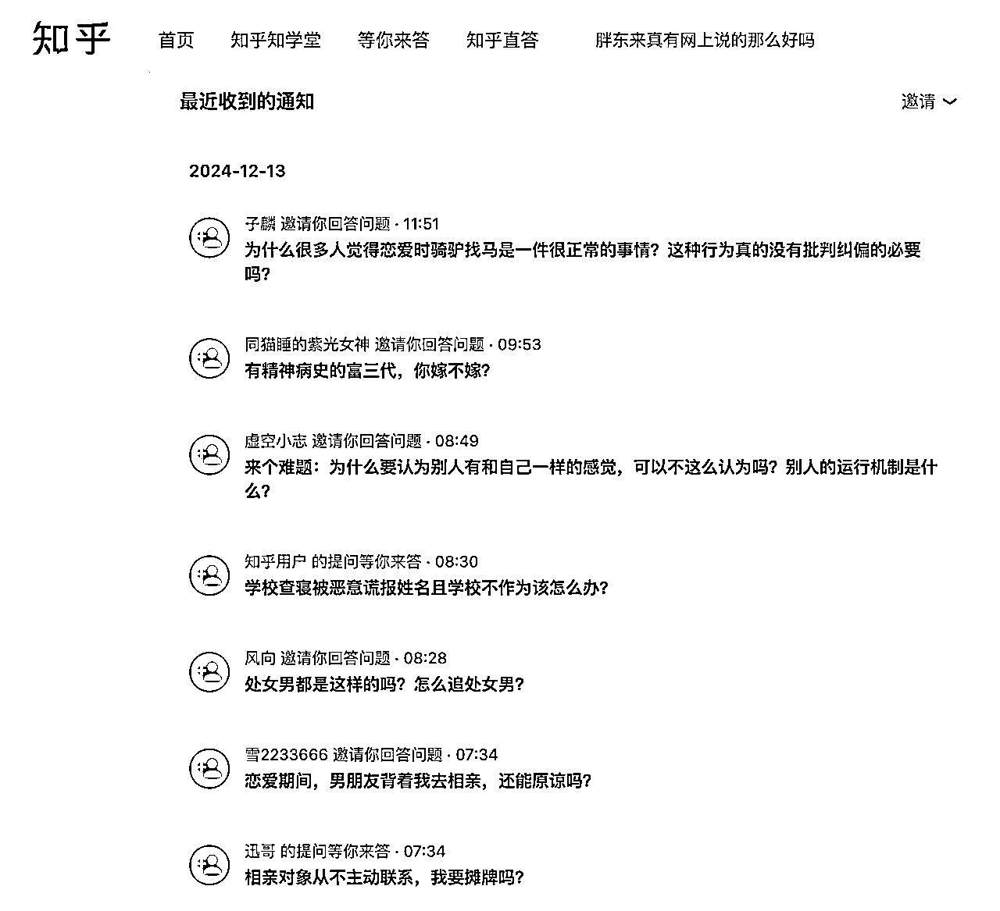

我们不定期的点开这些邀请，选择合适的问题进行回答，后续也可以把这些回答，同步发在公众号。

选择问题的时候，最好选择浏览量大一些的问题（我一般选择回答浏览量大于一万，回答人数低于 100 的问题），比如这个问题「相亲对象从不主动联系，我要摊牌吗？ https://www.zhihu.com/question/384079030」的浏览量有大几十万，回答人数有 66 个。

第三：通过文章评论区找话题

评论也是文章的一部分，我一般每周周末的时候，会查看过去这一周的读者评论，看看那些评论，可以写成文章。

除了看自己的文章评论区，偶尔也可以看看同行的文章评论区，还可以读各种和你定位相关的书籍，遇到有启发的时候，可以写相关文章。

如果你做的是咨询相关的服务，还可以把部分来咨询的内容，二次加工整理为文章。

当你的专业能力和写作能力提升后，其实每一条经过你的信息，都可以变成你的写作话题或者写作素材。

有了选题的方法后，还需要思考，如何管理自己的选题了，我平常是在电脑上做信息的收集。

我有个文件夹叫「待写话题」每次想到什么写作话题，我就在这个文件夹里面，增加一个写作话题。

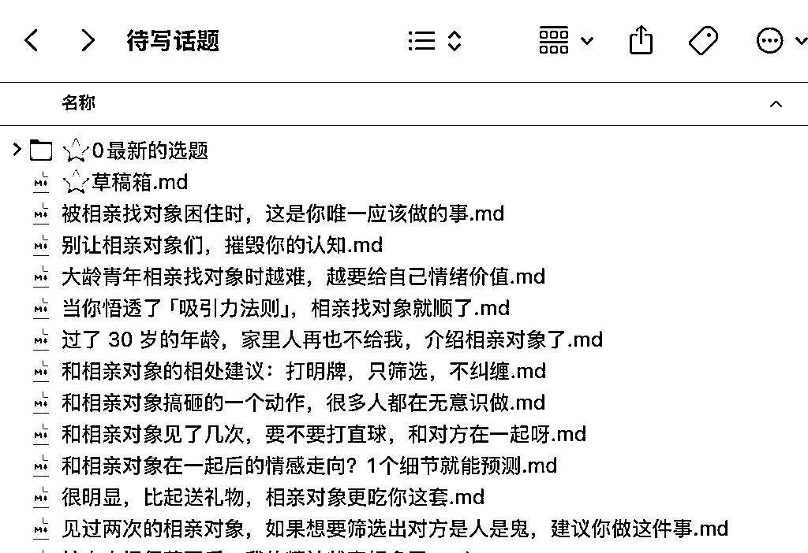

当然也可以使用一些笔记软件，比如 flomo APP 下载地址 https://v.flomoapp.com/register/?NDM1MzE5 添加一个写作话题的标签，写完文章以后，直接删除对应的话题就行。

## 第二：日更系统之：加工信息

不少朋友写文章的习惯是：写完文章以后，才来起标题。

可能的情况是这样的，耗费了一个小时写了一篇文章，最后用了一分钟的时间起标题。

按照我不成熟的经验，绝大部分情况下，你公众号文章的阅读量不行，就是标题不行。

少部分情况是，你的文章标题没有问题，但是社会上爆发了大的热点新闻，流量全被这样的热点给吸走了，比如前段时间特朗普再次当选美国总统。

在自媒体领域流传着这样一句话「你和阅读量10万+之间只差一个爆款选题，一篇文章能否成为爆款，80%都靠选题」。

所以加工信息的第一步，就是把你的选题，变成一篇合格的文章标题。

我们可以借助 AI 工具，我目前用的是 https://claude.ai/ 具体的流程是这样的。

1.我把我历史阅读量过万的文章标题，都这里出来了，然后让 AI 来分析这些标题有什么共同特征。

2.等 AI 分析完成后，让 AI 把 请将这些共同特征提炼为一个可以反复使用的公众号爆款标题公式。

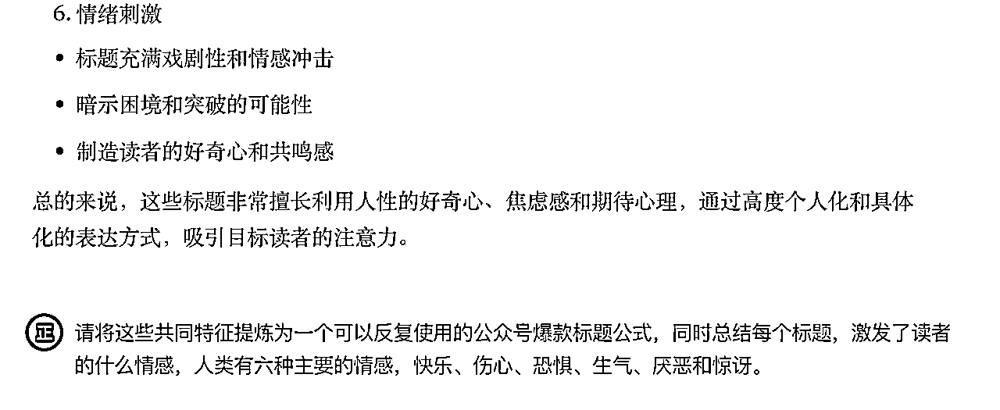

3.后续用这个公众号爆款标题公式，来版主我们优化文章标题。

举个例子，比如前面提到这个写作话题：相亲对象从不主动联系，我要摊牌吗？ https://www.zhihu.com/question/384079030

我们用 AI 来优化一下这个标题：

参考这个公众号爆款标题公式，帮我优化这个标题：相亲对象从不主动联系，我要摊牌吗？

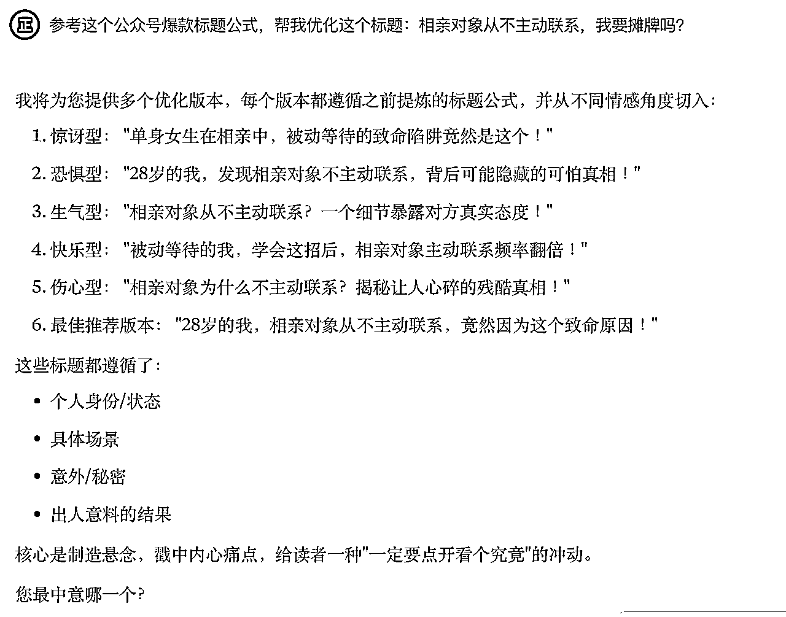

这里 AI 推荐我们使用第六个版本：28岁的我，相亲对象从不主动联系，竟然因为这个致命原因！

我们可以根据自己想要写的内容，对这个标题做个微调，比如：28岁相亲多次，相亲对象从来不主动联系我，竟然因为这个细节！

这个细节是什么呢？记得在《魔鬼约会学》这本书中提到：吃相毁了一个帅哥，书中具体的描述是：

这个学员的进食姿势非常独特。一般人吃饭都是身躯略微前倾，头略微前探，用勺或筷子把饭菜送到嘴里。但这位学员吃饭的样子着实让我吃了一惊，他是完全趴下来进食的，脸朝碗口，差不多快活埋进去了，天灵盖正对着我，左手鹰爪般掐住碗边，右手奋力舞动筷子，脑袋还同时跟着晃动几下，然后抬起头来一边咀嚼一边看我两眼，再低头继续……

总结一下，就和猪进食的场景差不多……

有了标题以后，围绕标题，你试着看看能想到那些关键词，把你想到的关键词或者问题写下来。

比如基于上面的标题「28岁相亲多次，相亲对象从来不主动联系我，竟然因为这个细节！」我能想到这些关键词或者问题。

主动和被动有什么区别？什么时候主动、什么时候被动。

这个人是如何发现的这个细节？相亲时候有哪些需要注意的？

这个人的核心择偶标准是什么呢？

主动发消息几次以后，如果没有积极回应，要不要结束。

……

如果实在想不到相关的关键词或者问题，也可以把你的这个标题，交给 AI ，让 AI 帮你来想。

比如，我们可以问 Kimi https://kimi.moonshot.cn/

请围绕这个标题「28岁相亲多次，相亲对象从来不主动联系我，竟然因为这个细节！」帮我列一些相关的关键词和问题

也可以使用 flomo APP 的「找一找」功能，也可以问你的私人笔记，围绕这些笔记，进行快速的阅读，看看能提取到哪些相关的关键词以及问题。

围绕我们提取出来的某些关键词和问题，还可以继续用 AI 工具搜索，直到你觉得这些问题和关键词，能够让你来写一篇文章就停止。

## 第三：日更系统之：输出信息

完成了信息的加工以后，接下来就是开始写文章了，写文章之前，先需要思考一下，你要选择什么样的写作框架或者你的文章适合用什么样的框架。

如果实在不知道用什么框架，最简单的方式就是清单写作。不要考虑什么结构啥的，结构越复杂，越难长期写作。清单写作方法，是最简单的写作框架，简单说就是怼条数哈，比如《年入100万的十个方法》。

1.

2.

3.

……

用这样的清单体写作很爽的，不需要搞什么复杂的写作流程了，你的流程复杂了，用户那么忙，哪有时间分析研究你的流程了，这种清单体在「得到」APP 的锦囊里面有很多。

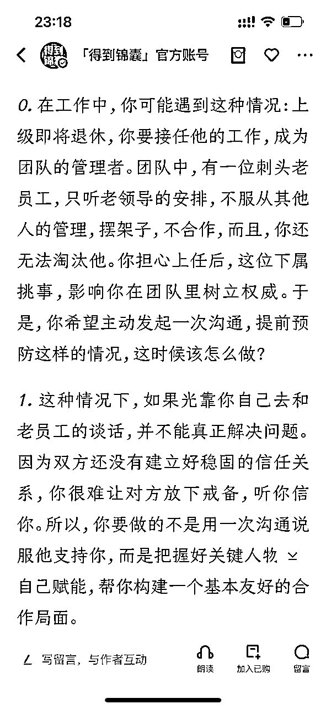

有了框架以后，接下来，就是要进行打草稿了，

我以前特别讨厌这一步，因为要把一堆的信息构建起来，我总是写一会、修改一会，反复几次，我就不想写文章了。

后来我尝试用「语音写作」解决了我的这个问题，我目前用的语音写作软件是「Get 笔记」APP https://www.biji.com/

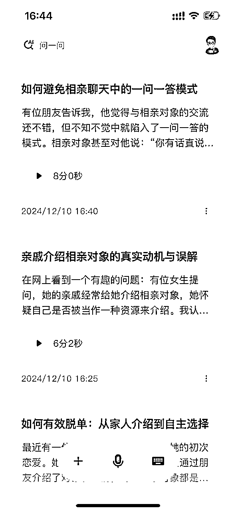

按照我目前的水平，对着「Get笔记」说个七八分钟，就能有 1000 字左右的文章草稿，有了文章的草稿，后续在电脑上进行二次的编辑和完善，让我写公众号的压力减轻了许多。

语音写作相比于键盘打字写作，更能调动我原有的知识储备，在说的过程中，我的脑海中能联想很多的内容。

直接使用键盘打字写文章的时候呢，我总是有意无意的想去去查找什么资料，而不是去联想我脑子里边儿已有的知识，这样不知不觉中，时间就浪费了。

我之所以选择「Get笔记」其中一个核心原因是：它会对我语音转文字后的内容，进行优化，能减少我编辑的工作量。

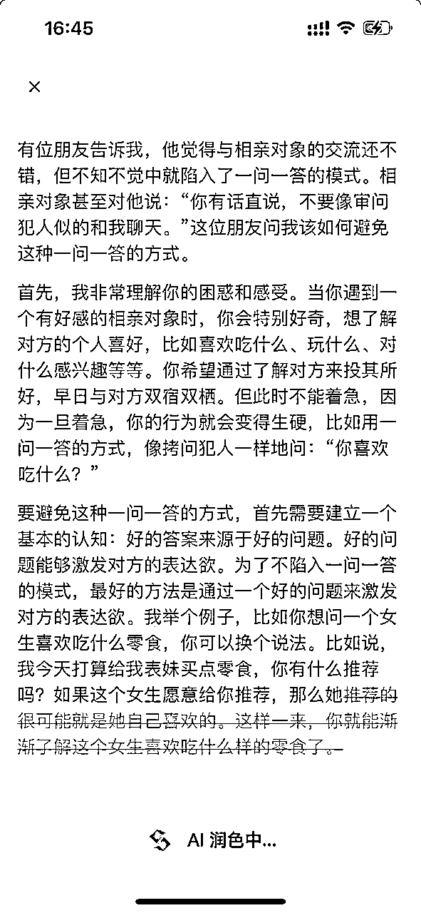

修改文章时，一方面是调整文章的结构和内容，让整体更流畅，另外一方面是给合适的地方，加入一些金句或者比喻句。

比如可以用 AI 来写比喻，我这里用的是 Kimi ：

给「一个简单的问题，你愿不愿意离开你所在的这个小城市，去更大的城市发展呢？

如果你都不愿意离开，你所在的这个小城市，不愿意跳出自己的舒适区，要真正的提升自己，那太难了。」来个比喻句

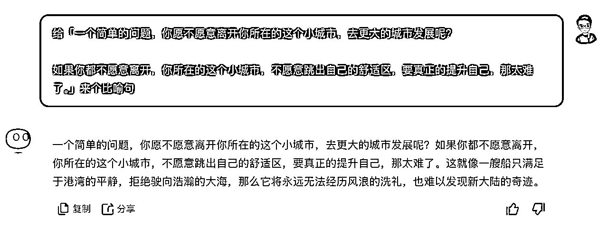

还可以调整文章的开头或者结尾，让文章变得有情绪价值，激发读者阅读和评论的欲望，我这里用的 Kimi ：

以下是「在成年人的恋爱关系中「人际距离」是一个重要的考量，

你和异性朋友之间的「人际距离」通常保持在 0.5米 以外，那你试着想想你和男朋友的「人际距离」应该是多少呢？」我的文章结尾，请你根据这个内容，给文章增加一句（最好是金句），有情绪价值的结尾，增加读者转发和评论的概率。

文章修改完成后，接下来要进行排版发布了，我使用的编辑软件是 Typora(https://typora.io/),通过简单的的语法，就能实现快速排版。

比如 三个###就是一个标题。

再比如双**号，就可以对文字进行加粗。

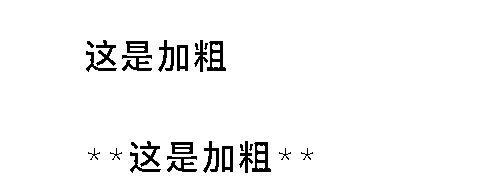

这样完成写作以后，通过 Typora 导出 html 格式的内容，直接复制粘贴到公众号就行了。

除了这种排版方式，还有其它的排版方式了，如果你是用「飞书文档」来写作，可以使用「飞书」里面提供的「公众号排版器 https://app.feishu.cn/app/cli_a782728235f1500c」排版完成后，一键复制，复制粘贴到公众号发布就行了。

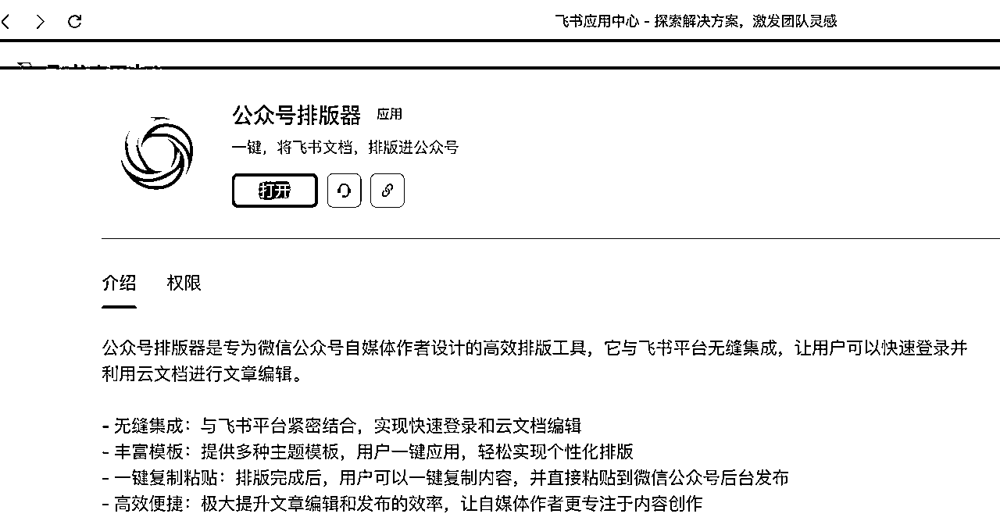

关于写作的排版，没有绝对统一的方案，你按照自己喜欢的或者习惯的方式来就行了。

## 第四：写作系统之：文章管理

为了实现知识的复用，提高写的效率，我们需要对自己的历史文章做个管理。

比如我想要知道「如何快速脱单」这个话题，我的历史文章的观点是什么呢？这里可以使用「腾讯元宝」https://yuanbao.tencent.com/ 创建一个我们自己的智能体，其中知识库引用的是我们公众号的历史文章。

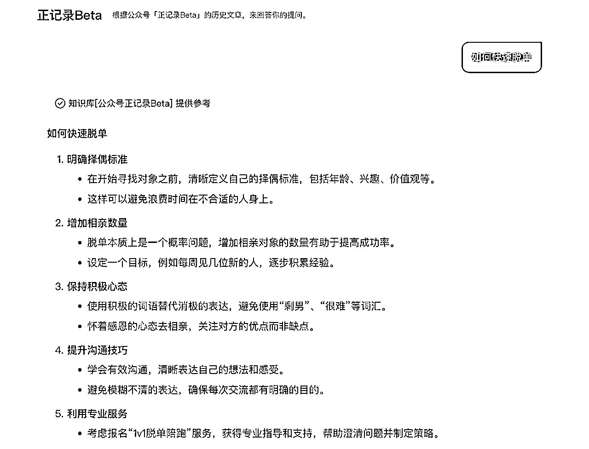

也可以使用「智谱清言」 https://chatglm.cn/ 来接入公众号的数据。

还有就是管理我们的历史文章，我之前使用「印象笔记」APP 来搜索我的历史公众号文章。因为我日更超过 1000 天了，在一个笔记本里面的笔记超过 1000 条了，每次搜索的时候，卡的要命。

后来我把本地备份的 markdown 格式的文章 ，导入了 Obsidian 软件 https://obsidian.md/ 搜索速度很快，方便后续写文章的时候，引用之前的文章内容。ps： Obsidian 默认的文件格式是 markdown 。

比如我写到一个「归属感」相关的内容，我想看看历史文章中，都有哪些关于「归属感」的内容，直接在 Obsidian 中搜索「归属感」。

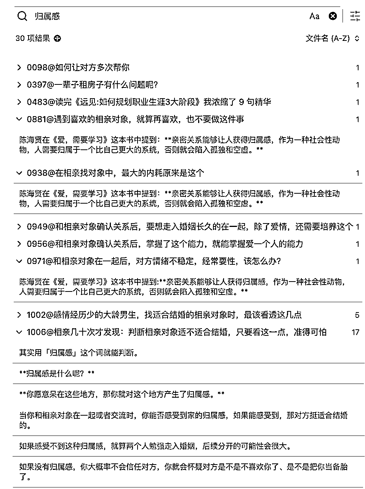

说到管理历史文章，推荐一个备份的策略，如果是重要数据，有个3-2-1的备份策略：

首先，除了原始数据，你应该有3份数据拷贝。

其次，3份数据拷贝应该保存在2种媒介，比如不能放在同一个硬盘或者同一台计算机。

最后，有1份数据拷贝必须放在异地，比如在云端或其他城市。

我的历史文章都保持到了 GitHub https://github.com/ 上，你也可以使用其它的工具，比如坚果云 https://www.jianguoyun.com/之类的云同步软件。

## 第五：日更系统之：时间管理

前面说了那么多，最重要的一个还没有来聊聊，如何管理自己的写作时间或者说，

如何通过管理时间来提升写作效率。我主要是使用「滴答清单」设置循环任务来管理我的写作时间。

我的第一个循环任务是：每天最多写两篇日更文章

如图所示：现在后面的时间是红色的 9 小时，表示的意思是，我今天的日更文章任务，还没有完成，已经拖延了九个小时。

这个循环任务的名字之所以叫：每天最多写两篇日更文章。你可能注意到其中有两个词「每天」、「最多」出现了两次。

什么是最多呢？ 零也是最多的一种，即使我今天不运动、不写作，我也是完成了今天的运动和写作目标。

我的目的是让运动和写作系统，可以稳定的运行下去。一个长期的目标，一天没做很正常，如果是连续一周，一个月没做，那就不正常。

从长期看，每天要做到一件事，很难，比如你能做到每天都睡觉吗？

每天必须，这个很难的，无形中就会增加很多压力。

心情不好，状态不好，再加上「每天」或者「至少」这样的词汇，结果就是不想做，没做，带来的结果可能是彻底躺平，啥也不做。

为了应对某一天情绪不好，不想写文章，就需要引入备份思维。

《巨人的工具》这本书里面说，2=1、1=0，「它的意思很简单，就是说一定要有后备计划」，但假如你只有一份，而这份被毁掉或丢失了，那你就陷入大麻烦了。

假设你没有备份的文章，你今天写的文章今天发，

如果今天你没有完成写文章这件事，那你脑海中一直会惦记这个事情，导致做啥都没有效率。

另外凯文·凯利在《宝贵的人生建议》中提到：

把「创造」和「改进」这两个过程分开。

你不能边写作边编辑，边雕刻边打磨，边制作边分析。

如果你这么做，编辑就会阻遏创造。发明时，不要选择。画草图时，不要检查。

如果你当天写文章，当天做修改，当天发布当天写的文章，长期看你的写作效率一定会下降。

我的经验是，开始今天的文章写作之前，我先修改之前写的文章，让自己进入写作状态，等文章修改发布以后，再开始写新的文章草稿。

我的第二个循环任务是：两周做一次选题，集中阅读信息，收集写作话题

有时候我们坐在电脑前，抓耳挠腮的半小时过去了，也不知道写点什么好，

之所以发生这种情况，就是你没有自己的选题库，也没有提前准备好的选题，都是当天选题，当天写……

我的选题方法是，每过两周时间，我就按照前面提到的选题方法，做一次选题。

每次写文章时，我都是从我的选题中，挑选一个我最想写的话题，每次我写的都是我最想写的话题。

我的第三个循环任务是：查看过去一周的文章，做复盘，找找异常值

复盘什么呢？

比如，拿篇文章写的最有感觉，最能进入心流，长期这样下去，你就能够去找到自己的定位，培养属于你的网感。

再比如：为啥这篇文章阅读量高，是标题好，还是配图好，为啥这篇文章阅读量低，是选题不行，还是标题差，还是关键词不行……

说一个和写作无关的时间管理，为了身体健康，避免长时间在电脑前工作，我给Mac电脑上安装了Eye Monitor(直接在 Mac 电脑的 App Store 搜索下载就行) 这个软件，这个软件每隔一段时间让电脑灰屏一次，强制提醒我进行休息。比如我在写这篇文章时候，就给我如图的提醒。

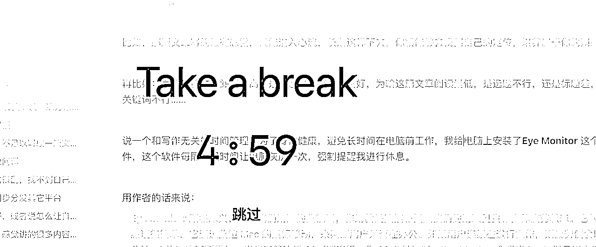

用作者的话来说：

Eye Monitor 顾名思义，就是我们用眼的监视器，作用就是监控和提醒我们的用眼卫生和身体疲劳状态。它的工作原理很简单，它通过监控 Mac 的鼠标移动，来判断用户是否在办公。如果用户连续在进行操作，则疲劳值会以每分钟 +1 的速度不断增加，当疲劳值达到 60（即连续工作 60 分钟）时，Eye Monitor 会弹出 Push 提示用户该休息了；如果在一分钟内没有任何鼠标操作，则疲劳值会自动 -6。

我用了这个软件，我在电脑上写东西，或者做事情的时候，我是感觉不到时间的流逝，只有这个软件提醒我该休息的时候，我才会休息。不像我以前用番茄钟，总是在明眼处，有个倒计时的提醒。

Windows 电脑上也有类似的软件叫：Project Eye https://github.com/Planshit/ProjectEye

# 3.日更写作可能遭遇的 N 种挑战及解决方案

有朋友问我，日更公众号的过程中，有没有想过放弃。

我日更超 1000 天了，中间无数次，想要放弃，每次想要放弃的时候。

我都是把不想写、想放弃当成一个问题去对待，看看到底是因为什么而不想写，有没有优化的方法和思路。

每次遇到问题，想办法找到解决的思路，就能继续写下去啦，这也是有备份文章的一个好处，可以让我抽出来时间，解决写作过程中遇到的问题。

## 第一：写作习惯与技巧提升

第一：如何将写作变成日常习惯

可以选择「语音写作」日常有什么想法，都能及时记录下来。

我以前不太敢做视频直播，因为我怕自己无话可说，我怕自己口齿不清，

当我用「语音写作」了一段时间后，我的表达能力提高了很多，已经在视频号直播了好几次。

那么如何判断已经养成了写作习惯，有一个简单的判断标准：「不做就不舒服，做了才舒服」，

比如连续两天不刷牙，就会不舒服、难受，如果连续两个月不刷牙，是不会难受的，因为新的习惯已经养成了。

英国现代小说家毛姆说「写作是一个很容易培养并且很难破除的习惯」。

第二：日常产生的想法，但是不足以写成一篇文章，该如何处理。

可以直接在 flomo APP 里中写，写完的内容，不添加任何标签，

后续可以时不时的从里面挑选一条，发在「即刻」APP、朋友圈之类的地方。

之所以不建议添加标签，是因为使用 flomo 搜索的时候，有个过滤选项叫「无标签 」可以很快把这些内容过滤出来。

第三：什么时候段灵感比较好，或者说怎么让自己保持灵感

因为我现在是自由职业，所以我每天写文章的时间，并不是固定的，大部分时候，是在早上的时候。

不过我的习惯是，在写一篇文章之前，我会先闭目养神的，让自己眯个几分钟，我发现眯个几分钟后，我写文章的状态特别好。

另外洗澡的时候往往会脑洞大开，各种想法不断从脑海中冒出，原因是在浴室里基本没什么可以输入的信息，此时大脑就会自然地想要想点什么，让脑子活跃起来。

有研究者曾经在澳大利亚做过一项调研，一共访问了1000多人。结果发现，人最容易产生灵感的场景，一共有8个。分别是，深夜、工作中、家中、安静时、乘坐交通工具时、锻炼时、在大自然中，以及洗澡时。其中，洗澡产生灵感的比率是30%。仅次于工作中和深夜。

第四：日更从多少字开始比较好？

建议每篇不超过 300 字，原因有这么两方面。

第一，在微信公众号超过 300 字，就能标记原创了，能标记原创的属于长文。

第二，做事情失败的原因之一是，刚开始的时候，努力过头了，

而努力过头，基于的假设是「想要实现超出预期的成绩，必须付出超出预期的努力」，结果死在了半路上……

这样做的原因是：设定了行动的上限，更容易找到适合自己的节奏，当你习惯了 300 字，可以逐步调整到 500 字、1000字、甚至3000字……

## 第二：内容创作与个人定位

第一：日更的过程中内容写的很乱，找不到自己的定位，该怎么办

建议尽快开启随喜咨询。

什么随喜咨询，就是不限定咨询范围和时长，

咨询结束以后，对方觉得本次咨询值多少钱，咨询结束以后给你多少钱就行。

你不是由你构成的，而是由你和其他人的多次碰撞构成的。

这种碰撞是用未知去探索未知，因为你也不知道对方会来找你做什么咨询，我的「脱单陪跑」服务，就是某次随喜咨询以后的产物。

第二：日更的内容，要不要同步分发其它平台

帅健翔《优势成长》这本书中提到，读完每篇文章，回答自己以下三个问题

*   我在这篇文章中，学到了什么？

*   我怎么把学到的运用到生活中？

*   我可以怎么用学到的帮助别人？

要不要把日更的内容分发到其它平台，你可以问自己这样一个问题：我的这篇文章对别人有什么帮助？

如果你觉得有帮助，就可以分发，你帮的人越多，帮你的人也越多。如果觉得没有帮助，就可以选择不分发。

我使用的文章同步工具是「爱贝壳内容同步助手」

「爱贝壳内容同步助手」是一款 Chrome/Edge 浏览器扩展，可以一键全网分发你的动态、图片、文章、视频内容。

第三：怎么做到引经据典的？感觉讲的很多内容都快速找到出处

我读书的时候，把一些对自己有触动的笔记，保存到 flomo 中，写文章时候，自然而然想起来这个相关的内容，就去 flomo 中查找一下。

还有一种情况是，在读书的时候，遇到了有感触的内容，我就会做个相关的记录，看看这段内容，可以用来写个什么文章。

## 第三：心理调整与情绪管理

第一：日更过程中遇到的孤独问题

一个人长时间坚持做一件事，说实话挺孤独的，我也遇到过这个问题，解决的办法有两个：第一：找到榜样；第二：加入一个小群体。

让我决定日更十年的一个原因是：看到罗振宇把每天一段 60 秒语音这个事情，给干了十年，所以我现在每天都在「得到」APP 看一篇《罗胖60秒·十年合集》，这就是我的榜样，我知道有的人真的把这个事情给干了十年，而且他还那么忙。

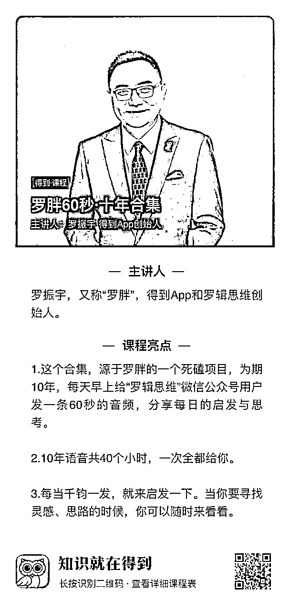

另外就是加入圈子，具体来说，就是加入日更群，如果你找不到合适的，也可以自己组织一个。

我加入的一个日更群，以 100 天为一个日更周期，我记得有一期结束后，当时群里一共 28 个人，其中有 14 个人退出了😂。

我加入的这个日更群，一天不更新文章，不在群里进行日更接龙，就需要发 100 元红包，

如果中途退出，需要给群里每个人的公众号打赏 100 元红包，现在群里还是十几个人，日更超过 1000 天的，有好几个了哈。

第二：今天实在没得写该怎么办？

把历史的文章中，有价值的，阅读量还可以的，再发一遍就行，比如公众号「辉哥奇谭」就这样做。

这样做的好处是∶1.优质的文章，可以再次被更多人看到；2.要想让日更系统稳定的运行下去，偶尔要有一定的容错了，比如允许自己重复发之前的文章。

第三：面对批评和失败的心态调整

公开表达，被批评是难免的事情，遇到这种情况，我就安慰自己，我就是一个写文章的，他批评的是文章，又不是我……

还有公开表达给我带来的好处，远大于坏处，那我自然不会在意别人的批评，甚至对方的批评还能帮我多赚钱了，这样想想我就舒服多了……

有情绪的时候，想办法发泄出来就行了，作家冯唐问自己的好朋友，你每天的时间如何安排？这个作家说「我两个小时读书和写作，用另外六个小时妒忌周围人，包括妒忌你」。

第四：如何面对写作的倦怠期

一般来说这种倦怠期，就是感觉什么话题都写过，写什么话题都没意思。

久石让在《感动，如此创造》这本书中说：我所谓的倦怠期，其实是原来输入的内容被消耗的差不多了而已。

这意味着你的老本吃完了，你依然在原地踏步。

久石让在书的结尾说：从事创作工作，没有结束的一天。

今日的我要超越昨日的我，明日的我要胜过今日的我，以创作出更好的音乐为目标，不断地超越自己

第五：阅读量不好时，负面情绪多，陷入自我怀疑该怎么办？

开始写这个分享之前，我的公众号的阅读量相比于之前下降了很多，这个分享写完以后，公众号的阅读量回来了一些。

流量拉胯的时候，我着急吗，刚开始有一丢丢着急。后来就不着急了，因为今年24年4月，也发生过一次流量拉胯的事情。

我当时的想法是：这玩意就和股票投资一样，方法正确，不一定能马上赚到钱，还需要时间和耐心，到了五月份流量就恢复了。

这次发生流量拉胯的事情后，来找我报名的客户少了，让我有了时间给我的写作系统，做了大量的优化，比如引入了不少的 AI 工具，大幅度提升了我的写作效率，急是没办法解决问题的。

## 第四：持续写作的挑战与益处

第一：感觉静不下心来读书，有什么办法吗？

书只是学习的一种方式而已，你找到适合自己的学习方式就能静下心来。

我为啥喜欢读书的学习方式，因为我比较笨。

遇到不懂的，我可以反复读一本书，这段话，如果是问大佬，同样的问题，问几次，大佬也烦我，书不会烦我的。

第二：坚持不下去该如何处理

坚持是普通人最容易做到的一件事，当然贵在坚持，也跪在坚持。

送你一句话：

Perseverance – a lowly virtue whereby mediocrity achieves an inglorious success.（毅力——一种卑微的美德，平庸之辈借此获得不光彩的成功）。

在《晨间日记的奇迹》这本书中说，让书写变成习惯，会遇到三个「考验期」分别是三天、三月、三年，这三大考验期。

为了更好的度过这三个考验期，你可以为这三个考验期设置三个奖励。比如第四天的时候，去大餐一顿，第一百天零一天的时候，国内旅游一次。第三年零一天的时候，国外旅游一次。

你还可以给自己设置能量咒语，在神话修仙体系中，咒语是能触发神秘力量的，

日更的「能量咒语」，就是当你听到或者看到某句话，你就你就该日更了。

我的能量咒语是「每天更新一下」，一方面让能培养「今天更新什么」的意识，另一方面，每天更新一下自己，是为了不被别人更新（洗脑）。

第三：断更的该如何处理

断更了很正常，

只要你没有彻底放弃这件事情，第二天接着写就行。

甚至你可以权当这件事情没有发生，你只是暂时没更新而已。

第四：我感觉日更不是每天最重要的事情，不知道这个想法对不对？

个人认为这个想法是对的，日更并不是你每天最重要的事情，

你每天最重要的事情是，如何过好这一天，而不是努力的往出来憋一篇文章。

第五：长期写作有什么好处呢？

一方面是写作提升你的大脑等待答案的能力，很多人焦虑的原因之一是，自己只是信息内容的获取者，而不是信息内容的生产者。

另一方面写作和不写作的区别之一是：作家有两条命，娜塔莉·戈德堡在《写出我心:普通人如何通过写作表达自己》中提到：

他们平时过着寻常的日子，在蔬果杂货店里、过马路时和早上更衣准备上班时，手脚都不比别人慢。

然而作家还有受过训练的另一部分，这一部分让他们得以再活一次。

那就是坐下来，再次审视自己的生命，复习一遍，端详生命的肌理和细节。

# 4.总结

1.个人意志力不靠谱，科学合理的系统有助于我们走的更远。

2.长期做一件事情，遇到问题很正常，每次遇到问题，想办法找到解决的思路，就能继续写下去啦。

3.不要在找定位上浪费太多的时间，先行动起来，积累其它的能力，行动的过程中，通过随喜咨询，定位自然会浮现。

4.人生两件事：立志和心安，如果你要长期做一件事，试着找一找做这件事的长期目标是什么呢？

5.要持续公开写作，这是每个人都能利用的杠杆，某大佬说，他打造个人品牌的方法特别简单，就是每天写一篇文章。

6.AI 时代，要刻意培养自己的 AI 思维，每次想做一个事情的时候，都想一想，如何把这个事情和 AI 结合起来。

7.珍惜你的低谷期，因为它一定有礼物要送给你，最好可以把这段经历，用文字记录下来，当你回看时，可能会发现所谓的低谷期，也就那样。

8.经常有人问我，现在开始日更还来得及吗？说实话，开始的时间不重要，重要的是你投入的总时间。

——————

尾声，内容就到这里哈，

希望没有浪费各位的时间，祝各位生财有术！