# IP 发售：付费专栏 9 天 1500+ 订阅

> 来源：[https://viy7tklh1i.feishu.cn/docx/IfyQdYk46ofRbnxEnM3c9IOunad](https://viy7tklh1i.feishu.cn/docx/IfyQdYk46ofRbnxEnM3c9IOunad)

大家好，我是小六六，生财 2 期圈友，主业是沪漂程序媛，副业自媒体 2 年半。

12 月上旬给自己操盘了一场小报童发售，发售团队由我和圈友阿铭组成，在没有大 IP 的加持下，借助一群中小 IP，发售 9 天 1500+ 订阅。

在这样的发售和分销配置下，最终取得这个订阅数，我个人是满意的。这篇文章详细给大家分享我的实操经验，希望对想发售自己小报童的 IP 们有帮助。

本篇文章的目录如下：

*   专栏策划，内容筹备

*   专栏内测，迭代更新

*   发售准备，各方到位

*   发售过程，灵活应变

*   发售结束，闭环完成

*   本次发售，三点思考

# 一、专栏策划，内容筹备

提到这个专栏，就不得不提我的贵人加恩师小林。9 月底，他来上海，我们一起吃了饭。饭局上，他基于我的副业经历给我指导，后续可以如何发展，同时根据当前行业和风口趋势分析当前局面，分析完之后，认为我必须要出自己的小报童了。

立项简单，但选题和内容定位如何切入，是摆在面前的第一个难题。

我做副业有 2 年半了，这 2 年半我做过很多项目，且都取得了一定的成绩。公域私域都涉及，最终目的是为了打造个人 IP，那么最好的切入点就是，从我自己的经历出发，把我的实战经验体系化输出，这样的内容对别人是有价值的。

为此，小林还特地在上海多呆了一天，第二天晚上我下班后，拉着我直接给我规划了内容大框架。

起初规划的内容模块包括：视频号篇、公众号篇、私域篇（朋友圈、社群、知识星球）、社交篇、实操篇和常见问答，每个模块写 8-10 篇，先怼完 50 篇内容。

同时小林还给我做了时间节点规划，国庆期间完成内容更新，国庆结束后进行内测，10 月中下旬完成发售。

由于个人拖延没如期完成，最终 10 月下旬才开始写内容，11 月初写完全部 50 篇内容。

内容框架列完，第一个难题内容搞定了，第二个难题是确定专栏名字。

跟内容思路一致，还是从我的实际经历出发。我是在职场做副业，副业 2 年半累计变现 30 万，所以小林帮我起了个专栏名：8 小时外 0-30 万变现指南，符合我在职场做副业的现状。

很多人好奇我是如何短时间内输出 50 篇体系化内容的？

我根据前面规划的 6 大模块，在飞书上列出每个模块下的小标题，先列出 50 个左右的标题，再把这 50 个标题的内容补充完整，就有 50 篇内容了。

为什么至少要写 50 篇内容呢？因为现在小报童太多了，你必须要先给读者足够的价值，给别人足够的诚意，别人才可能买单。

内容写好后，初步检查了一遍，然后把这 50 篇内容一次性全部更新到小报童上，并且做好小报童的目录。

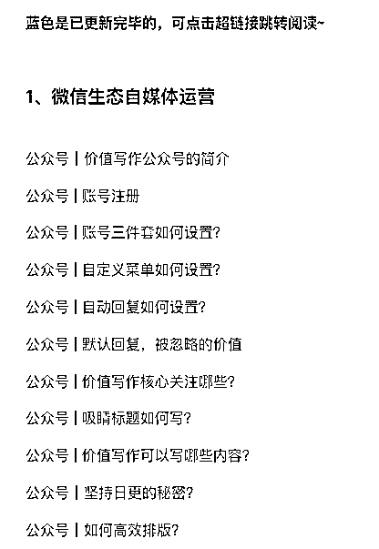

内容和专栏名搞定后，接下来进行如下几项的设置。

一）logo 图

用纯色背景配文字的方式，简洁明了，如下：

二）专栏简介

初版简介内容包括以下 4 部分：

1、作者简介

2、专栏内容包含的模块

3、价格说明

4、订阅后引导加微信领资料

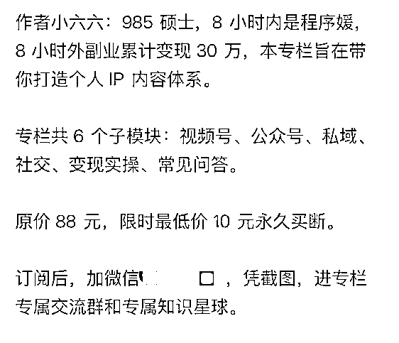

三）置顶帖设置

小报童平台限制，只能设置一篇置顶帖，所以把目录设置为置顶，引导大家订阅后从置顶开始看。同时，置顶帖里有目录，大家就可以按照目录体系化的阅读了。

我写的置顶帖标题是：【收藏必看】｜目录汇总

置顶帖的内容分为三部分：

*   开头放了读者群二维码，写明进读者群可以领取什么见面礼；

*   中间说明专栏开了分销，提供了分销操作说明的帖子；

*   结尾是专栏的全部目录，方便大家跳转阅读；

有的人用个人微信承接读者，我选择用读者群，原因是，我一个人搞发售，同时还在上班，如果放个人微信，发售和通过好友会忙不过来，所以大家根据自己的时间来权衡。如果跟我一样用读者群，切记群二维码 7 天过期，及时替换。

置顶帖的标题要清晰明了的写明，让大家订阅后首先看这里，这里面有什么，可以领取什么资料等等，提高大家看置顶帖的概率。

四）免费验货帖设置

小报童可以设置最多 3 篇免费预览的帖子，其实就是让读者订阅前先看免费帖验货的。

虽然我们知道，免费验货的内容肯定是专栏里比较好的，不代表其他内容都是一样的质量，但我们可以逆向思考下，如果一个人的专栏，连免费验货帖的质量都不行，那其他内容质量高的概率会高么？

我不认为，所以利用这个点是不是就可以避坑了？

这里我选择了利用 AI 绘画成功变现的实操经验文作为验货帖。

选择这篇文章的原因是：这篇文章详细拆解了我利用 AI 绘画完成变现的全流程，包括公域做内容、引流私域、私域转化、客户交付、搞培训带人放大。一个项目把流量、产品、转化、交付全部覆盖到，全部跑通。

这套模式可参考复制，所以选择这篇作为免费验货帖。

并且把免费验货帖最后发，这样它始终在专栏内容列表的最上面，别人扫码后能直接看到这篇验货帖。

以上均搞定后，开启内测，让市场和用户来给我们答案。

# 二、专栏内测，迭代更新

我的内测渠道是自己的社群、朋友圈、公众号、星球。

首先是在自己社群里进行的内测。后台设置了一张最低折扣优惠券给到社群成员，作为社群成员一直支持我的答谢，给大家的专属最低优惠，同时给了几天使用优惠券的时间限制。

优惠券的时效要控制，不能一直有效，否则大家就不珍惜了。

在社群内测时，第一批设置了 100 张优惠券，我本以为会用不完，没想到不到半小时就用光了，后面又补了一批优惠券。

然后在自己的公众号、知识星球和朋友圈也第一时间发布了消息，向外发布说自己出了第一个小报童产品，给大家广而告之。

内测的 24 小时内，通过社群、朋友圈、公众号、星球这些渠道，最终有 200 多订阅，这个数据一下子惊到我了，一方面证明自己的内容是没问题的，另一方面也证明自己有一定的 IP 影响力的。

在接下来的一周，我一边继续宣传，一边继续补充内容，补充了 20 篇内容，同时新增了 100 多订阅，最终内测结束有 367 的读者订阅。

内测是一定需要的，内测的原因如下：

一）验证自己产品是否被市场用户买单

如果内测时用户就不买单，那发售时用户肯定也不买单，那就需要尽早去定位问题和优化。

同时内测时，尽量只自己卖，这样可以筛选自己的付费用户。

二）给自己迭代优化留缓冲期

原计划内测结束时，专栏订阅数到 400 多，但实际没到 400，距离心理预期还有一段距离。尤其是内测中后期宣传时，自己发现有两个问题：

1、自己写朋友圈宣传时，并不能很好的提炼卖点；

2、内测中后期时，很难出单了；

内测一周，我自己感觉专栏还是有点问题，但我也说不出问题在哪里。

这时候很巧的是，11 月 22 号在上海又见了一次小林，我就给小林说了我的困惑，小林听了后说，「8 小时外」其实代表的就是副业，范围太广，不够垂直，专栏名字得改。

然后看目前专栏内容，根据目前更新的内容，做了如下调整：

*   把视频号篇和公众号篇合并成为「微信生态自媒体运营」篇

*   把私域篇和社交篇合并成为「私域运营与社交礼仪」篇

*   把实操篇和常见问答合并成为「项目实操和常见问题」篇

经过这个整理后，内容的垂直度就更清晰了。

我的内容就是围绕着微信生态，从公域到私域到商业化的完整闭环。并且现在的趋势也是大家从公域往私域转，公域作为引流渠道，私域完成商业化。

私域的尽头就在微信生态。

所以决定把专栏名从「8 小时外 0-30 万变现指南」改为「微信生态 0-30 万变现指南」。

同时，我还提炼了本专栏的核心卖点：

1）把自己副业 2 年多在微信生态的实战经验和心法分享给大家。包含：视频号、公众号、朋友圈、社群、星球、社交等等，从公域到私域全链路闭环的实战经验。

2）六六的副业经验告诉大家，做副业不一定要做很多平台，把一个平台、一个生态做好了，也够我们吃的了，而微信生态无疑是最好的！

专栏目录和名字修改后，我又把配套的 logo 图、简介、置顶帖、验货帖都优化了一遍。

1、logo 图

原来的 logo 图是橙色背景，现在是微信生态，所以颜色改为公众号的绿色，同时带上「微信」这个关键词，于是 logo 图变为了：

2、专栏简介

之前的简介在专栏价值介绍部分比较简单，没有把用户最关心的内容写上去。同时内测时观察到读者群的进群率不高，那么我想，可能是进群领资料的信息太靠下，读者没看到。

于是我把这两部分做了优化，专栏价值部分除了说明专栏的 6 大模块，补充说明本专栏旨在给读者带来什么价值，同时说明为啥要选择微信生态。

同时把承接读者的联系方式顺序也做了调整，调整后如下：

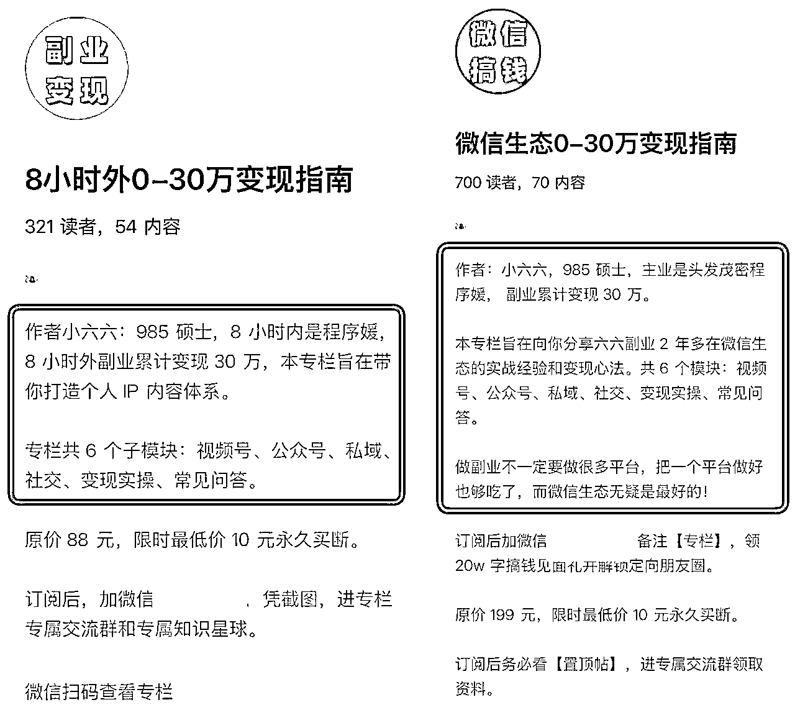

这里再补充下，后来发售过程中还进行了优化。虽然小报童简介可以写最多 260 个字，但实操发现，字数太多生成的分销海报比较长，海报上的二维码不能在一屏上展示出来，影响转化。

所以我把专栏价值介绍以及承接读者的方式又做了调整，海报上只留了加个人微信领资料，置顶帖里放读者群二维码即可，调整后如下：

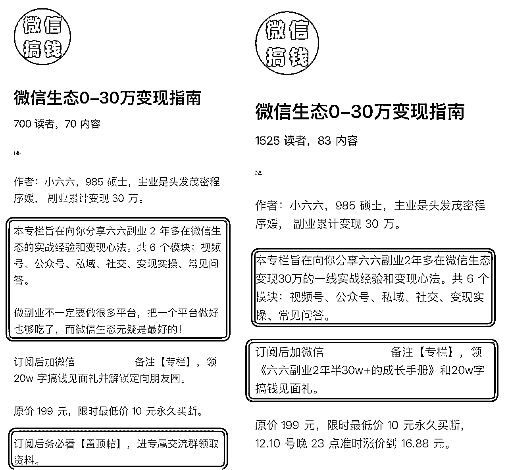

3、置顶帖

为了提高读者订阅后看置顶帖的概率，我对置顶帖做了如下几方面的优化：

1）标题优化

原来的标题是「【收藏必看】｜目录汇总」，比较平，没有给读者强烈的行动指令，且没告诉读者这里面有读者群，进群可以领资料，所以我把这些信息直接写到标题上，标题改为现在的：【必看这里】内容目录｜进专属交流群领搞钱见面礼！！

2）开头内容优化

很多读者对我还不了解，为了增加读者对我的了解，也为了增加读者对专栏的理解，我在置顶帖开头补充了简单的自我介绍，专栏价值介绍。

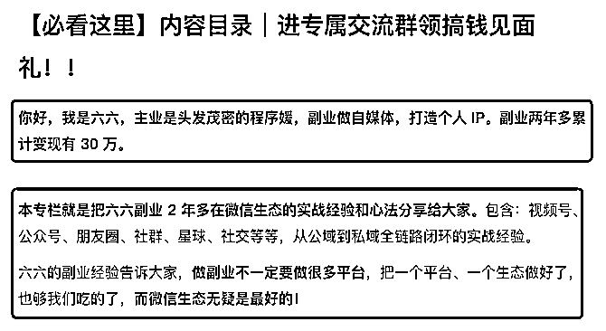

这里要注意件事，如果你在置顶帖里放了读者群的二维码，不要把置顶帖设置为免费预览，否则会有人浑水摸鱼加入读者群。我在发售时就遇到了，对方不光自己加，还拉人进来，被我发现后，立马把我删了。

三）收集内测读者的反馈，积累素材，为发售做准备。

有的人可能会问，如何能获得读者的反馈呢？

其实很简单，所有订阅读者我们都能看到，有些意料之外的人我们就可以主动问一下，跟人家聊一下，然后不就有读者反馈素材了吗？

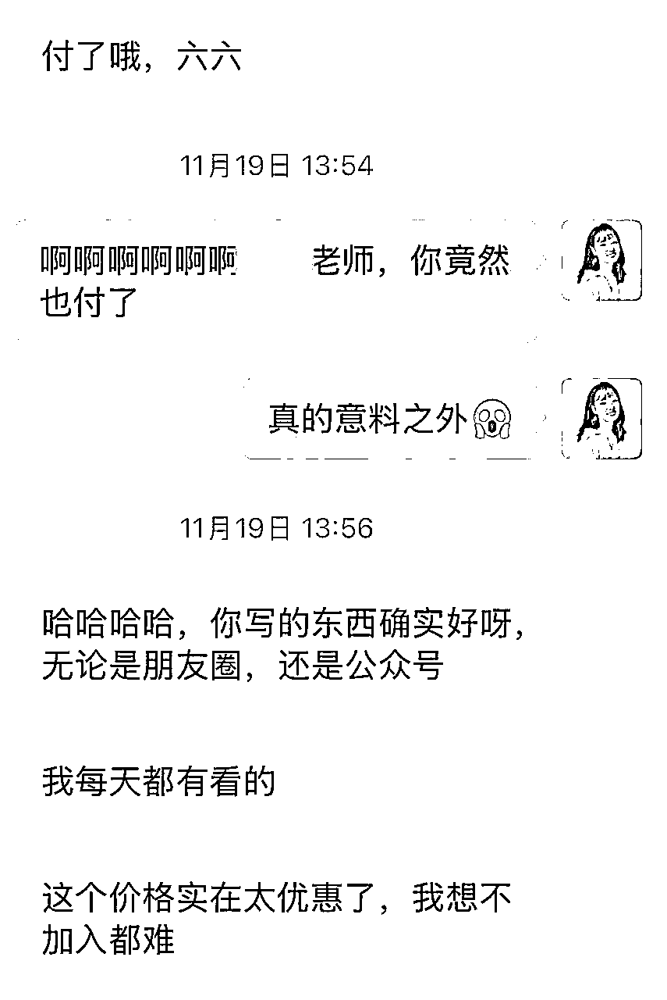

# 三、发售准备，各方到位

经过上述迭代优化后，我觉得差不多可以发售了，所以就开始着手写发售计划。

原计划是 11 月底进行发售，当我把我的发售计划发给小林，让他帮我看一下是否可行时，小林跟我说，我速度太慢了，最近有好多发售在进行，我跟别人撞档了，建议我延期等等。

当时听完，我都懵了，一下子不知道该怎么办了。后来思考了一个中午，我决定，虽然撞档，但该发售还是要发售。因为不管我选择什么时候发售，都会跟别人撞期，别人发售是别人的事，我发售是我的事，还是干吧！

于是我把发售期稍微往后延了几天，改为 12 月 2-10 号发售。

发售前 5 天是我的筹备期，这 5 天时间要做的事包括：

一）邀请分销 KOL，至少邀请 50 位

我在自己的社群、朋友圈、公众号、星球这些渠道进行招募，让所有想参加分销的人联系我，我给他们拉进分销群。

这次没有把分销群的二维码直接发到社群里的原因就是，我希望进分销群的人都是真正参与到分销行动中的，而不是进群围观的。

给他们具体的行动指令，或者让他们联系我，这个小小的门槛就可以筛选掉很多不行动的人了。

同时也去私聊一批平时比较熟的 KOL 邀请他们来分销。

注意：邀请 KOL 的时候提前说清楚你的发售时间是什么，这样方便别人预留时间。

二）完善分销奖励说明

朋友无岸根据他的冲榜经验，在分销奖励设置上给了我很多建议。比如，增加产品作为福利，像我这种发售期短的，增加日榜激励等等。

分销奖励设置没有标准答案，核心是看你自己想要什么。如果你想要你的小报童冲量，这里的奖励设置可以重一些，反之，则可以轻一些。

三）优化发售方案

我的发售方案包含如下几部分内容：

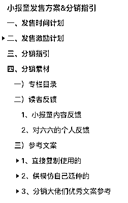

下面挑 4 条重点内容进行说明。

1、分销操作步骤

在我们看来，小报童分销这么简单，应该没有人不会，但实际操作下来会发现，在分销中还是有很多新人加入。他们可能是阅读了你的专栏后，觉得有价值，所以也来加入分销。

这是他们第一次参与分销，他们确实不会，所以分销步骤说明一定要有，并且建议用图的方式展示，而不是用一堆文字，这样别人照着图上的说明，一下子就明白了。

我做的图示说明如下，每次有人问如何操作的时候，我就把这张图发给他，他们就不会问新的问题了，给我节约了很多时间。

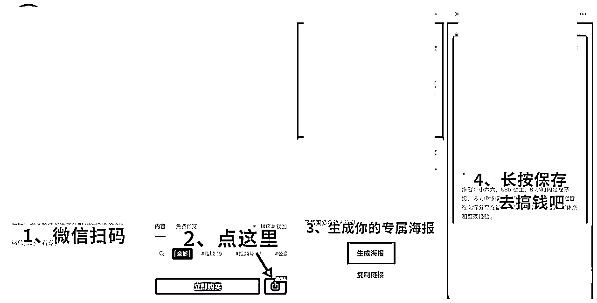

2、内容目录

不太建议用你置顶帖里写的那份目录，那个太长了，用户点进去要往下滑很久才能看完全部，视觉冲击性不够强，所以我会建议自己做两张目录图。

第一张图是你的内容目录图。你把你的目录截成几张图，然后把这些图拼在一起形成一张图，一屏就可以展示你的所有目录内容。这样用户一眼就能知道他买了这份小报童可以获得哪些内容。经过实践，我做的这个图在发售过程中帮我们出了很多单。

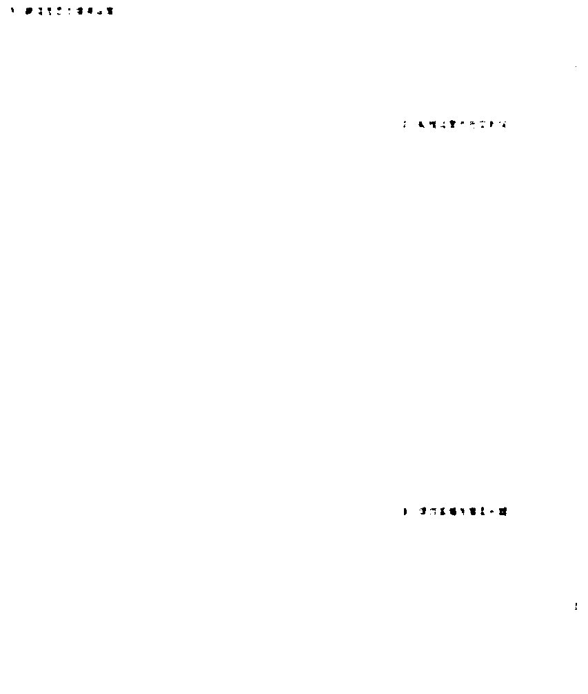

第二张图是把你的内容目录做成一张思维导图，这样也便于读者一眼知道你的小报童包含哪些内容。

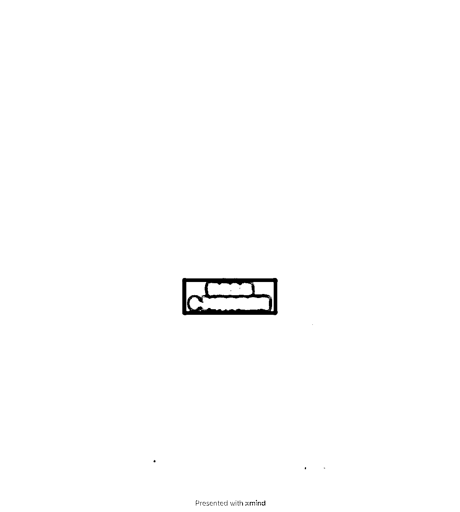

这也是上面说至少更新 50 篇内容的原因，内容多了，做出来的目录图才够丰富，视觉效果好，也便于出单。

3、发售可用素材

素材部分我提供了两类，一类是读者对小报童内容的好评反馈，还有一类是读者对我这个人的好评反馈。

这里内测的重要性就体现出来了，如果没有内测，就没有这些素材，发售的时候就没得素材可用。

还可以把这些单张的读者反馈图拼在一起，形成一张读者反馈合集图，这样的视觉冲击效果会更好。

比如我就做了这样的图供大家使用：

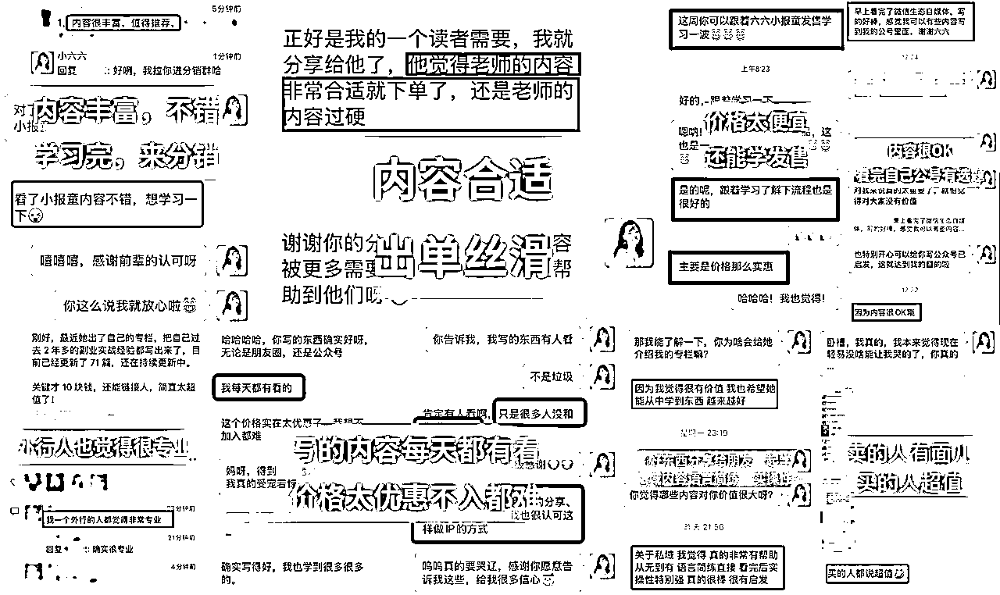

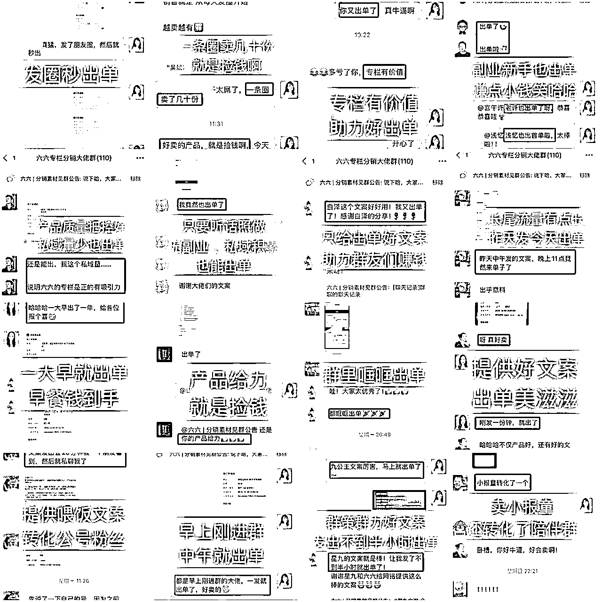

4、可直接复制的文案

可直接复制使用的文案是一定一定要准备的。因为绝大部分人是懒得写或者不会写比较好的推广文案，如果你不提供可直接复制使用的，那大家懒得行动，就少了很多推广人了。

初始我觉得准备 10 条文案就可以了，发售过程中，根据出单效果，再去把大家写的好的文案收集起来，供分销群使用就可以了。

我的初始 10 条文案思路是这样的：

*   两条从主理人角度出发，介绍主理人的副业成绩，引出这个产品；

*   两条从专栏角度出发，通过专栏的某一个卖点来推广产品；

*   三条从读者反馈角度出发，通过用户证言来推广；

*   一条从读者读后感出发，通过读者问题以及匹配专栏某篇内容来推广；

*   最后两条从便宜实惠出发，因为确实量大又实惠；

除此之外，还要准备一份微信消息版的分销方案说明。

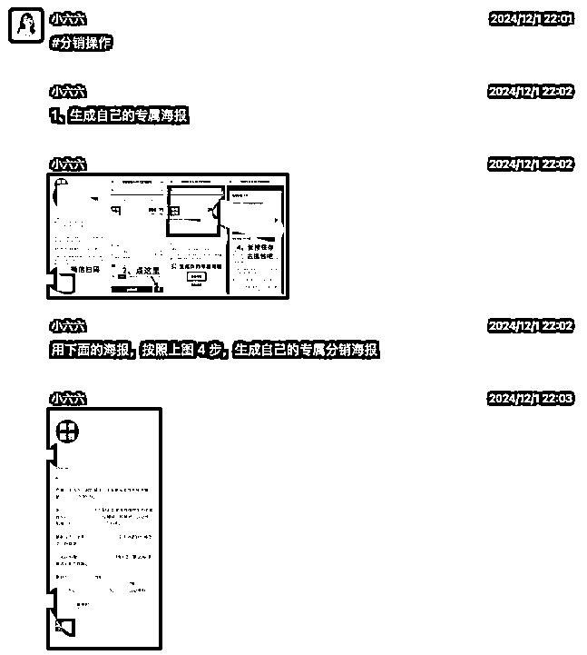

这里我包含了 6 部分内容：

*   生成自己的专属海报

*   分销奖励

*   专栏目录截图版

*   专栏目录导图版

*   5 条可用文案

*   完整分销方案链接

因为虽然你把分销方案放在分销群公告里，但其实绝大部分人都不会去看群公告的，而微信消息看起来确实会更方便。所以我把分销方案做了一个简版，把这些信息发给自己，再把它们打个合集收藏起来。每次有新人加入分销时，我就把这个简版方案发给他，对方看了后就知道如何操作，很方便。

分销 KOL 到位，内容数量到位，发售周期到位，人货场齐全，接下来就是正式开干！

# 四、发售过程，灵活应变

我本次发售期是从 12 月 2 号到 10 号，一共 9 天时间。我把它分为前期、中期和后期三个阶段。

前期先利用好分销群初始 KOL 们的资源，先把第一波势能带起来，尽可能多出单。

我的结果是，发售 3 天，我的小报童破千订阅。

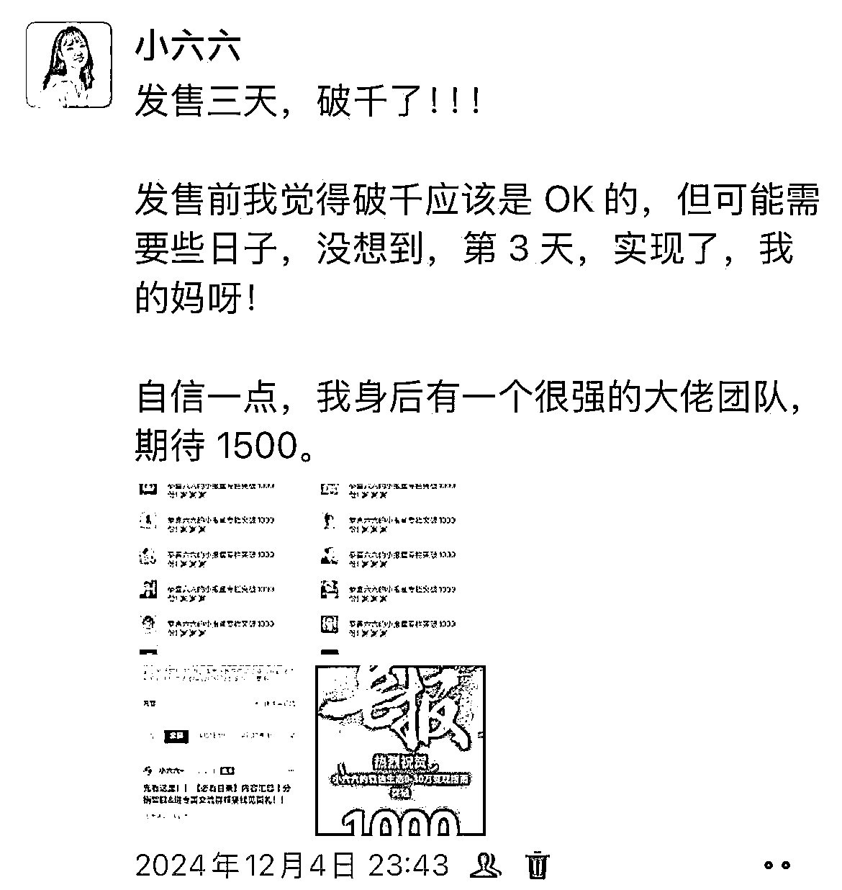

这是我的第一波势能，中期就可以借助这个势能，用这个里程碑作为宣传素材继续去推广。我们也确实这么做了，是有用的。

这个点叫做「成功是成功之母」。

另外还有一个点就是分销人的推广周期一般 3-4 天就会进入疲惫期，而我发售是 9 天时间，要持续进行下去，这时候我做了两个动作：

1、写分享稿，然后去盘自己的付费资源，找自己的付费资源去约分享。

我在刚开启分销的前两个晚上，每天晚上都是 3 点睡 7 点起，阎王夸我好身体。然后第一周周三那天，实在有点熬不住，就请了一天假，在家写了一篇 6000 字分享稿。

后面拿着这篇分享稿做了两次大型分享，也是给自己增加了一些影响力。

2、继续邀请新的 KOL 来分销。

随着发售期的推进，老的 KOL 进入疲惫期，我需要注入新鲜血液。

邀请的方向有两个：

1）用好小报童每季度 15 个免费链接的资源。

盘自己的付费资源，以及看别人的榜单筛选，挑选一些觉得可能会帮自己分销的 KOL，给他们送免费链接验货，同时邀请他们来参与分销。

经过实践发现，绝大多数被邀请人会同意的，只有少部分人会拒绝你，当然，这个过程中也会有人对你已读不回，这都是很正常的，不用玻璃心。这次合作不成，不代表下次合作没有机会呀。

2）挖掘已订阅读者的资源。

因为我此时已经有 1000 多订阅读者了，这么多读者肯定有值得挖掘的，所以我就从这里下手。

去筛选了一批我认识，且觉得有可能来参与分销的，向他们发出了邀请。也是绝大部分邀请都得到了回应，并且他们也确实帮我分销了。

不光如此，前期和中期时，我在运营分销群时还做了以下动作：

*   虽然分销方案在群公告，实际上大家也不看，所以把自己的群昵称改为「六六｜分销素材见群公告」，只要我说话就能一直提醒大家。

*   鼓励大家发朋友圈宣传，发了朋友圈的截图发群里，我就给他们发专属的发圈红包。

*   引导大家出单了，把自己的出单截图发群里，鼓励和带动其他人。

*   出首单的人把截图发群里，我也会给他们发专属的出单红包。

*   每天晚上 10 点，发截至目前的里程碑奖励，达到奖励条件的即刻发放红包奖励，而不是等到发售结束后再统一发放，是为了给大家及时反馈，这样更利于大家行动。同时给大家看一下日榜，这样如果有人想再冲一下就有目标了。

*   每天早上九点半左右发前一天的日榜奖励，也是为了激励当天可以更好的行动。

*   根据第一天发售的日榜数据分析，后面我采取的策略是中小单策略。即团结好中小 IP，激励他们持续出单。虽然他们单个人出单的数量没有那么多，但是中小 IP 基数大，最后加起来的总出单数也就还行。所以我在分销群里经常夸他们，并且艾特他们，让他们感受到被看见和被重视。

*   圈友阿铭自告奋勇，全程帮我做了海报，包括：日榜排名海报、小报童整数里程碑海报、分销前 10 名的排名海报、分销前 3 名的单人海报，还收集好用的分销文案供大家使用。既给大家喂饭，又让大家感觉仪式感满满，从里子到面子，哪哪都很到位。

*   观察出单数据。如果某个人的出单数据很猛，那我就去看一下他朋友圈发了什么文案。立马把这个文案收录到我的文案合集里，发到分销群给大家使用。

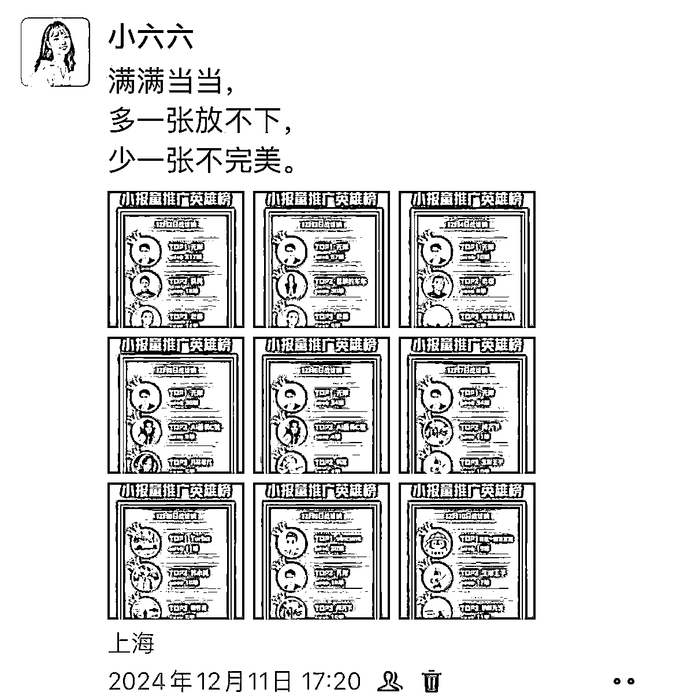

后期的最后两天，由于前面 7 天我们持续推广、持续影响和持续触达，再加上周末我又找了新的 KOL 注入新鲜血液，所以，最后两天就是收获的时候。我也一直在分销群里鼓励大家最后两天不要放弃，继续行动和坚持，都能有收获。

听我话，去执行的人基本上都出单了。我又拿他们出单的结果作为说明，继续发到分销群里激励大家。

注意，这里我的发售时间设置其实也有细节，大家去翻日历会发现 2 号和 9 号分别是周一和下周的周二，我的考虑如下：

首先，发售周期不能太短，低于 7 天可能会出现的问题是时间太短，你持续影响的不到位，所以会影响最终的出单效果。

其次，我为什么会把开始和结束的时间都设置在周内呢？那是因为经过观察，我们发现周末的时候其实大部分人是不怎么学习、不怎么看信息的，反而一到周内上班的时候，大家就格外关注自己的副业情况了。

同时，中间经过一个周末，也是给自己一个缓冲时间。我可以利用周末这两天再去找新的 KOL 续命。

最后设置在周二结束发售，留了两个工作日时间，是因为根据过去的经验，我们发现通常在发售结束和涨价前夕的两天是出单最猛的，所以特地留了最后两个工作日做冲刺，同时在发售结束的前一小时准时涨价。事实证明这个策略也是正确的，最后两天出了 200 多单。

# 五、发售结束，闭环完成

本次发售在分销群里，我们一直在教大家如何更好的去分销，也有一部分人把他们的一些用户也带进来，学习我如何操盘和发售自己小报童的，我觉得这次认真参与的人都有挺大收获。

所以在最后发售结束时，阿铭建议我让大家写复盘，写了复盘的人可以给大家提供一个福利。

发售结束后，我在群里公布，如果大家写一篇不少于 50 字的复盘，发到我的星球，我就给大家提供我 2025 陪伴群的 10 元抵扣券，可自用，可转赠。

后面确实有参与者写了。我看了大家写的内容，只要是写了的，都是这次认真参与且都有收获的人。

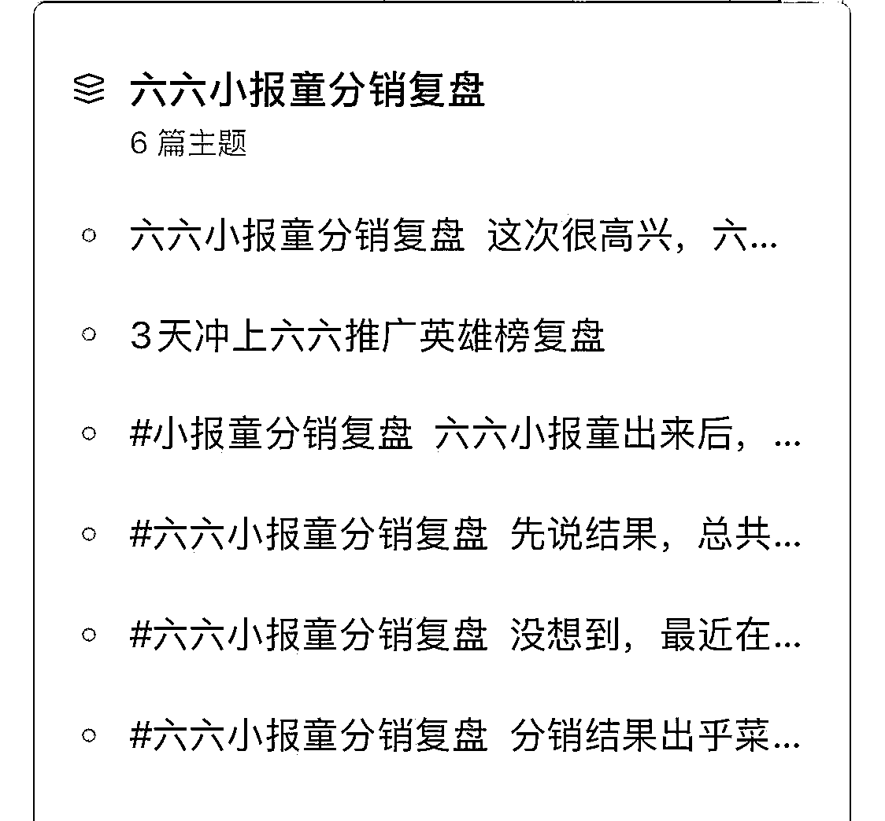

看到他们写的复盘，我是很开心的。这次事件，我完成了我的小报童发售，他们学到了自己想学的东西，这是一件双赢的事。

# 六、本次发售，三点思考

一）价值先行，传播在后

本次发售，有 50 多位陌生朋友自发分销了六六的小报童。我猜想，大概是他们自己买了，阅读觉得有价值，所以也愿意自发推荐给他们的朋友学习。

这次还遇到我被之前删了的大佬又加回来，然后夸我小报童内容不错的情形。

当你能提供价值，别人觉得你有用或者未来有用时，自然会来靠近你，以及注意到你，否则就只能相忘于互联网了。

二） IP 成型，产品被需要

在你没有基本功积累、没有势能时，不要出产品，出了产品也卖不出去，因为大家不了解你，且质量也无法保证。

当你有一定的专业积累和势能积累时，再出产品，这时候大家会说，一直有看你的内容，写的好，对我有帮助，你终于出产品了，必须支持必须买。

你看，你的产品从出生时就是被需要的，而不是你臆想的，这个差别还挺大的。

三）越是低价，越要超预期

这次发售过程中收到的一类反馈是：原来你更新了这么多内容，很丰富，还这么便宜。从言语中不难看出有超出他们的预期。

我们跟低价产品中的很多读者都是第一次接触，那你低价还超预期交付，给别人的第一印象就很好，别人会不会更愿意通过这个产品来了解你这个人呢？

而我们做个人 IP，一切行动不就是为了让更多人认识我们、了解我们到信任我们么？

有了人的信任，才会有后续的 IP 复利商业化。

# 致谢

至此，我的小报童从内容筹备、发布、内测、发售到最后复盘的全部经验就分享完啦，希望对你有启发。

感谢生财，在生财的这两年，真的让我在赚钱这件事上开眼了。而线下聚会，也让我链接到更多优秀圈友，从他们身上或多或少都有学习到一些东西。

感谢小林，是朋友、恩师和贵人，从选题建议到内容把关到发售指导，每个关键点都在帮我，没有小林就没有这个专栏。

感谢阿铭全程支持和帮助，在自己主业和家庭很忙的情况下，还一直坚持帮我做海报，帮我收集好的分销文案，以及帮我运营分销群。

感谢老徐，我的贵人和恩师，在星球和朋友圈帮我推广好几次。

感谢飞巴，我的互联网爸爸，也是恩师和贵人，平时各种耳提面命，帮我少走很多弯路。

感谢大冲，亦师亦友，帮我拉分销人员和推广，还有各种指点。

感谢无岸、老秦、波波、车车、辰风、小瓶、雨飞、易安、醒狮和其他 100 多位朋友们，是大家一起创造的这个成绩，荣誉属于每个人，一起生财有术。