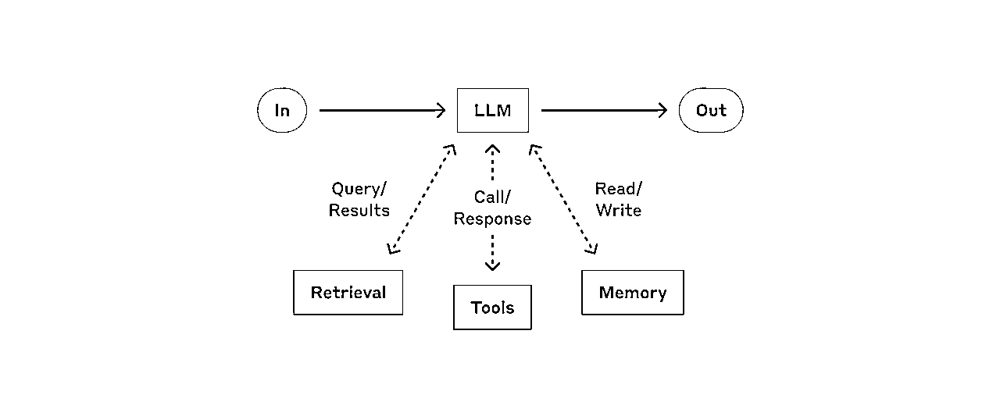
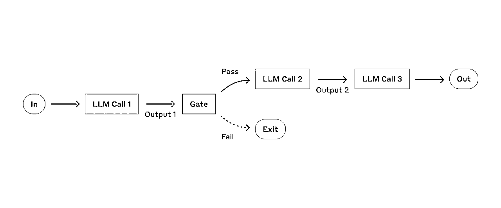
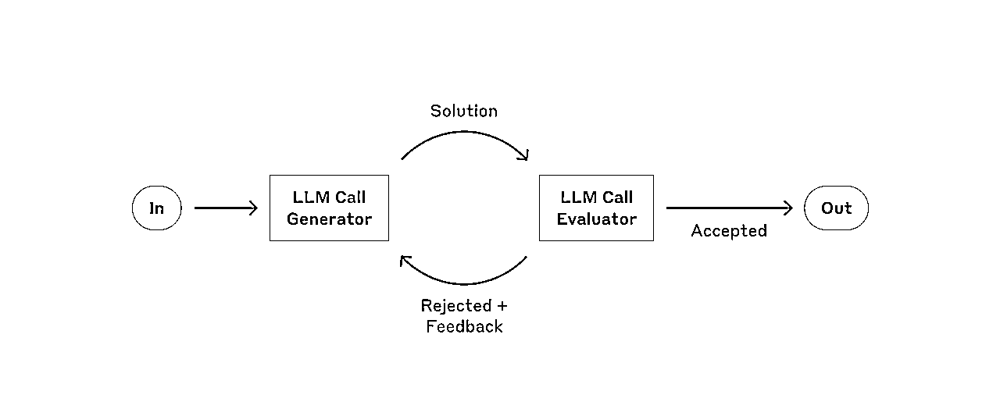
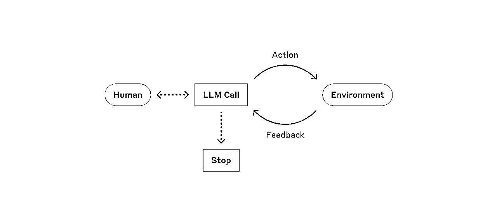
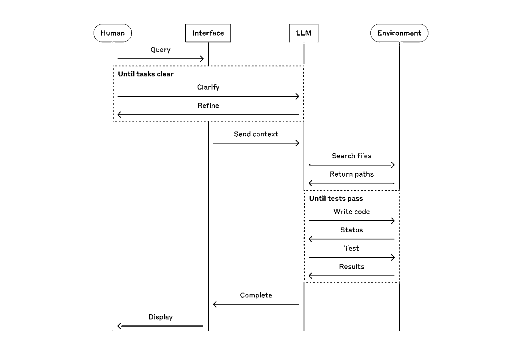

# Building effective agents

> 来源：[https://rxas35pmvn.feishu.cn/docx/J7RKdWvK5oa2VGxip9WcYD9Mnae](https://rxas35pmvn.feishu.cn/docx/J7RKdWvK5oa2VGxip9WcYD9Mnae)

原链接：

# Building effective agents 构建有效的智能体

2024-12-20

Over the past year, we've worked with dozens of teams building large language model (LLM) agents across industries. Consistently, the most successful implementations weren't using complex frameworks or specialized libraries. Instead, they were building with simple, composable patterns.

在过去的一年中，我们与数十个团队合作构建了跨行业的大型语言模型 (LLM) 智能体。一致的是，最成功的实施并没有使用复杂的框架或专门的库。相反，他们采用的是简单、可组合的模式。

In this post, we share what we’ve learned from working with our customers and building agents ourselves, and give practical advice for developers on building effective agents.

在这篇文章中，我们将与大家分享从与客户合作和自己建立代理中获得的经验，并为开发人员建立有效智能体提供实用建议。

# What are agents? 什么是智能体？

"Agent" can be defined in several ways. Some customers define agents as fully autonomous systems that operate independently over extended periods, using various tools to accomplish complex tasks. Others use the term to describe more prescriptive implementations that follow predefined workflows. At Anthropic, we categorize all these variations as agentic systems, but draw an important architectural distinction between workflows and agents:

“智能体”可以有多种定义。一些客户将智能体定义为完全自主的系统，可长期独立运行，使用各种工具完成复杂的任务。其他人则用这个词来描述遵循预定义工作流程的规范性更强的实施方案。在 Anthropic，我们将所有这些变化都归类为智能体系统，但在工作流和智能体之间做了重要的架构区分：

*   Workflows are systems where LLMs and tools are orchestrated through predefined code paths. 工作流是通过预定义代码路径协调 LLMs 和工具的系统

*   Agents, on the other hand, are systems where LLMs dynamically direct their own processes and tool usage, maintaining control over how they accomplish tasks. 另一方面，在智能体系统中，大语言模型（LLMs）可以动态地指导自己的进程和工具使用，并保持对完成任务方式的控制

Below, we will explore both types of agentic systems in detail. In Appendix 1 (“Agents in Practice”), we describe two domains where customers have found particular value in using these kinds of systems.

下面，我们将详细探讨这两类代理系统。在附录 1（"智能体的实践"）中，我们介绍了客户发现这类系统具有特殊价值的两个领域。

# When (and when not) to use agents 何时（以及何时不）使用智能体

When building applications with LLMs, we recommend finding the simplest solution possible, and only increasing complexity when needed. This might mean not building agentic systems at all. Agentic systems often trade latency and cost for better task performance, and you should consider when this tradeoff makes sense.

在使用 LLMs 构建应用程序时，我们建议尽可能寻找最简单的解决方案，只有在需要时才增加复杂性。这可能意味着完全不构建智能体系统。智能体系统通常会以延迟和成本来换取更好的任务性能，您应该考虑这种权衡何时才有意义。

When more complexity is warranted, workflows offer predictability and consistency for well-defined tasks, whereas agents are the better option when flexibility and model-driven decision-making are needed at scale. For many applications, however, optimizing single LLM calls with retrieval and in-context examples is usually enough.

当需要更多复杂性时，工作流可为预定义的明确的任务提供可预测性和一致性，而当需要灵活性和大规模模型驱动决策时，智能体则是更好的选择。不过，对于许多应用来说，利用检索和上下文示例优化单个 LLM 调用通常就足够了。

# When and how to use frameworks 何时以及如何使用框架

There are many frameworks that make agentic systems easier to implement, including:

有许多框架使代理系统更容易实施，其中包括

*   LangGraph from LangChain; 来自 LangChain 的 LangGraph ;

*   Amazon Bedrock's AI Agent framework; 亚马逊 Bedrock 的人工智能代理框架；

*   Rivet, a drag and drop GUI LLM workflow builder; and Rivet 是一种拖放 GUI LLM 工作流构建器；以及

*   Vellum, another GUI tool for building and testing complex workflows. Vellum 是另一款用于构建和测试复杂工作流程的图形用户界面工具。

These frameworks make it easy to get started by simplifying standard low-level tasks like calling LLMs, defining and parsing tools, and chaining calls together. However, they often create extra layers of abstraction that can obscure the underlying prompts and responses, making them harder to debug. They can also make it tempting to add complexity when a simpler setup would suffice.

这些框架简化了标准的底层任务，如调用 LLMs、定义和解析工具以及将调用连锁在一起，容易入门。但是，它们通常会创建额外的抽象层，从而掩盖底层提示和响应，使调试变得更加困难。他们会让本能简单设置的时候变得复杂。

We suggest that developers start by using LLM APIs directly: many patterns can be implemented in a few lines of code. If you do use a framework, ensure you understand the underlying code. Incorrect assumptions about what's under the hood are a common source of customer error.

我们建议开发人员从直接使用 LLM API 开始：许多模式只需几行代码即可实现。如果您使用框架，请确保您了解底层代码。对底层代码的不正确假设是客户出错的常见原因。

See our cookbook for some sample implementations.

请参阅我们的手册，了解一些实施示例。

# Building blocks, workflows, and agents 构件、工作流程和智能体

In this section, we’ll explore the common patterns for agentic systems we’ve seen in production. We'll start with our foundational building block—the augmented LLM—and progressively increase complexity, from simple compositional workflows to autonomous agents.

在本节中，我们将探讨在生产中常见的代理系统模式。我们将从基础构件--增强型 LLM 开始，逐步提高复杂性，从简单的组合工作流到自主智能体。

## Building block: The augmented LLM 构件：增强型 LLM

The basic building block of agentic systems is an LLM enhanced with augmentations such as retrieval, tools, and memory. Our current models can actively use these capabilities—generating their own search queries, selecting appropriate tools, and determining what information to retain.

智能体系统的基本构件使用具有检索、工具和记忆等功能来强化 LLM。我们目前的模型可以主动使用这些功能--生成自己的搜索查询、选择适当的工具并决定保留哪些信息。

The augmented LLM 增强型 LLM

We recommend focusing on two key aspects of the implementation: tailoring these capabilities to your specific use case and ensuring they provide an easy, well-documented interface for your LLM. While there are many ways to implement these augmentations, one approach is through our recently released Model Context Protocol, which allows developers to integrate with a growing ecosystem of third-party tools with a simple client implementation.

我们建议将重点放在实现的两个关键方面：根据您的特定用例定制这些功能，并确保它们为您的 LLM 提供简单、文档齐全的接口。实现这些增强功能的方法有很多，其中一种方法是通过我们最近发布的模型上下文协议（Model Context Protocol），该协议允许开发人员通过简单的客户端实现与不断增长的第三方工具生态系统集成。

For the remainder of this post, we'll assume each LLM call has access to these augmented capabilities.

在本篇博文的其余部分，我们将假设每个 LLM 调用都可以访问这些增强功能。

## Workflow: Prompt chaining 工作流程：链式提示词

Prompt chaining decomposes a task into a sequence of steps, where each LLM call processes the output of the previous one. You can add programmatic checks (see "gate” in the diagram below) on any intermediate steps to ensure that the process is still on track.

链式提示词将任务分解为一系列步骤，其中每个 LLM 调用都会处理前一个步骤的输出。您可以在任何中间步骤上添加编程检查（见下图中的 "门"），以确保流程仍在正常进行。

The prompt chaining workflow 链式提示词工作流程

When to use this workflow: This workflow is ideal for situations where the task can be easily and cleanly decomposed into fixed subtasks. The main goal is to trade off latency for higher accuracy, by making each LLM call an easier task.

何时使用此工作流：此工作流程适用于可以轻松、简洁地将任务分解为固定子任务的情况。其主要目的是通过使每次 LLM 调用更容易完成，从而以延迟换取更高的准确性。

### Examples where prompt chaining is useful:

链式提示词有用的例子

*   Generating Marketing copy, then translating it into a different language. 制作市场营销文案，然后将其翻译成不同的语言。

*   Writing an outline of a document, checking that the outline meets certain criteria, then writing the document based on the outline. 编写文件大纲，检查大纲是否符合某些标准，然后根据大纲编写文件。

## Workflow: Routing 工作流程：路由

Routing classifies an input and directs it to a specialized followup task. This workflow allows for separation of concerns, and building more specialized prompts. Without this workflow, optimizing for one kind of input can hurt performance on other inputs.

路由对输入进行分类，并将其导向专门的后续任务。这种工作流程允许将关注点分开，并建立更专业的提示。如果没有这种工作流程，针对一种输入进行优化可能会影响其他输入的性能。

The routing workflow 路由工作流程

When to use this workflow: Routing works well for complex tasks where there are distinct categories that are better handled separately, and where classification can be handled accurately, either by an LLM or a more traditional classification model/algorithm.

何时使用此工作流程：路由功能适用于复杂的任务，在这些任务中，最好分别处理不同的类别，并通过 LLM 或更传统的分类模型/算法准确处理分类。

### Examples where routing is useful:

路由有用的例子

*   Directing different types of customer service queries (general questions, refund requests, technical support) into different downstream processes, prompts, and tools. 将不同类型的客户服务查询（一般问题、退款请求、技术支持）导入不同的下游流程、提示和工具。

*   Routing easy/common questions to smaller models like Claude 3.5 Haiku and hard/unusual questions to more capable models like Claude 3.5 Sonnet to optimize cost and speed. 将简单/常见问题分配给 Claude 3.5 Haiku 等较小的模型，将困难/异常问题分配给 Claude 3.5 Sonnet 等能力较强的模型，以优化成本和速度。

## Workflow: Parallelization 工作流程：并行化

LLMs can sometimes work simultaneously on a task and have their outputs aggregated programmatically. This workflow, parallelization, manifests in two key variations:

LLMs有时可以同时执行一项任务，并通过编程汇总其输出。这种并行化工作流程主要有两种形式：

*   Sectioning: Breaking a task into independent subtasks run in parallel. 分段：将任务分解成独立的子任务，并行运行。

*   Voting: Running the same task multiple times to get diverse outputs. 投票：多次运行同一任务，以获得不同的输出结果。

The parallelization workflow 并行化工作流程

When to use this workflow: Parallelization is effective when the divided subtasks can be parallelized for speed, or when multiple perspectives or attempts are needed for higher confidence results. For complex tasks with multiple considerations, LLMs generally perform better when each consideration is handled by a separate LLM call, allowing focused attention on each specific aspect.

何时使用此工作流程：当划分的子任务可以并行化以提高速度，或需要多个视角或尝试以获得更高的置信度结果时，并行化是有效的。对于具有多个考虑因素的复杂任务，当每个考虑因素都由单独的 LLM 调用来处理时，LLMs 的性能通常会更好，从而可以集中关注每个特定方面。

### Examples where parallelization is useful:

并行化有用的例子

*   Sectioning: 分段：

*   Implementing guardrails where one model instance processes user queries while another screens them for inappropriate content or requests. This tends to perform better than having the same LLM call handle both guardrails and the core response. 实施护栏，其中一个模型实例处理用户查询，而另一个实例则筛选不适当的内容或请求。这往往比让同一个 LLM 调用同时处理防护栏和核心响应的性能更好。

*   Automating evals for evaluating LLM performance, where each LLM call evaluates a different aspect of the model’s performance on a given prompt. 自动执行用于评估 LLM 性能的评估方法，其中每个 LLM 调用都会评估模型在给定提示下性能的不同方面。

*   Voting: 投票：

*   Reviewing a piece of code for vulnerabilities, where several different prompts review and flag the code if they find a problem. 审查一段代码是否存在漏洞，在此过程中，多个不同的提示会对代码进行审查，并在发现问题时进行标记。

*   Evaluating whether a given piece of content is inappropriate, with multiple prompts evaluating different aspects or requiring different vote thresholds to balance false positives and negatives. 评估某一内容是否不恰当，多个提示评估不同方面，或要求不同的投票阈值，以平衡误报和漏报。

## Workflow: Orchestrator-workers 工作流程：协调者-工作者

In the orchestrator-workers workflow, a central LLM dynamically breaks down tasks, delegates them to worker LLMs, and synthesizes their results.

在协调者-工作者工作流中，中央 LLM 会动态地分解任务，将其委托给工作者 LLMs 并综合其结果。

The orchestrator-workers workflow 协调者-工作者工作流程

When to use this workflow: This workflow is well-suited for complex tasks where you can’t predict the subtasks needed (in coding, for example, the number of files that need to be changed and the nature of the change in each file likely depend on the task). Whereas it’s topographically similar, the key difference from parallelization is its flexibility—subtasks aren't pre-defined, but determined by the orchestrator based on the specific input.

何时使用此工作流程：这种工作流程非常适合无法预测所需子项任务的复杂任务（例如，在编码中，需要更改的文件数量和每个文件的更改性质可能取决于任务）。虽然在拓扑结构上相似，但与并行化的主要区别在于其灵活性--调用哪个子任务不是预先定义的，而是由协调器根据具体输入决定的。

### Example where orchestrator-workers is useful:

协调者-工作者（orchestrator-workers）非常有用的示例：

*   Coding products that make complex changes to multiple files each time. 每次对多个文件进行复杂更改的编码产品。

*   Search tasks that involve gathering and analyzing information from multiple sources for possible relevant information. 搜索任务涉及从多个来源收集和分析信息，以查找可能的相关信息。

## Workflow: Evaluator-optimizer 工作流程：评价者-优化者

In the evaluator-optimizer workflow, one LLM call generates a response while another provides evaluation and feedback in a loop.

在评价者-优化者工作流程中，一个 LLM 调用生成一个响应，而另一个则在循环中提供评价和反馈。

The evaluator-optimizer workflow 评价器-优化器工作流程

When to use this workflow: This workflow is particularly effective when we have clear evaluation criteria, and when iterative refinement provides measurable value. The two signs of good fit are, first, that LLM responses can be demonstrably improved when a human articulates their feedback; and second, that the LLM can provide such feedback. This is analogous to the iterative writing process a human writer might go through when producing a polished document.

何时使用此工作流程：当我们有明确的评估标准，并且迭代改进提供了可衡量的价值时，此工作流程就会特别有效。良好契合的两个标志是：第一，当人类明确表达他们的反馈时，LLM 的响应可以得到明显改善；第二，LLM 可以提供此类反馈。这类似于人类作家在制作一份精良文档时可能经历的迭代写作过程。

### Examples where evaluator-optimizer is useful:

评估器优化器有用的例子

*   Literary translation where there are nuances that the translator LLM might not capture initially, but where an evaluator LLM can provide useful critiques. 文学翻译，译者LLM最初可能无法捕捉到其中的细微差别，但评价者LLM可以提供有用的批评意见。

*   Complex search tasks that require multiple rounds of searching and analysis to gather comprehensive information, where the evaluator decides whether further searches are warranted. 需要多轮搜索和分析才能收集到全面信息的复杂搜索任务，由评估员决定是否需要进一步搜索。

# Agents 智能体

Agents are emerging in production as LLMs mature in key capabilities—understanding complex inputs, engaging in reasoning and planning, using tools reliably, and recovering from errors. Agents begin their work with either a command from, or interactive discussion with, the human user. Once the task is clear, agents plan and operate independently, potentially returning to the human for further information or judgement. During execution, it's crucial for the agents to gain “ground truth” from the environment at each step (such as tool call results or code execution) to assess its progress. Agents can then pause for human feedback at checkpoints or when encountering blockers. The task often terminates upon completion, but it’s also common to include stopping conditions (such as a maximum number of iterations) to maintain control.

随着如 理解复杂输入、参与推理和规划、可靠地使用工具以及从错误中恢复等 LLMs 的关键能力的成熟，智能体正在生产中崭露头角。智能体的工作始于人类用户的命令或与人类用户的交互式讨论。一旦任务明确，智能体就会独立进行规划和操作，并有可能返回人类获取进一步的信息或判断。在执行过程中，智能体从环境中获取每一步的 "基本事实"（如工具调用结果或代码执行情况）以评估其进度至关重要。然智能体可以在检查点或遇到阻碍时暂停，以获得人工反馈。任务通常在完成时终止，但为了保持控制，通常还会包含停止条件（例如最大迭代次数）。

Agents can handle sophisticated tasks, but their implementation is often straightforward. They are typically just LLMs using tools based on environmental feedback in a loop. It is therefore crucial to design toolsets and their documentation clearly and thoughtfully. We expand on best practices for tool development in Appendix 2 ("Prompt Engineering your Tools").

智能体可以处理复杂的任务,但他们的实施通常很简单。他们通常只是LLMs使用基于环境反馈的工具进行循环。因此,清晰和深思熟虑地设计工具集及其完善文档就很重要。我们在附录 2("为您的工具设计提示词")中详细介绍了工具开发的最佳实践。

Autonomous agent 自主智能体

When to use agents: Agents can be used for open-ended problems where it’s difficult or impossible to predict the required number of steps, and where you can’t hardcode a fixed path. The LLM will potentially operate for many turns, and you must have some level of trust in its decision-making. Agents' autonomy makes them ideal for scaling tasks in trusted environments.

何时使用智能体：智能体可用于难以预测所需步骤数量的开放式问题，以及无法对固定路径进行硬编码的问题。LLM将可能运行多轮，您必须对其决策过程保持一定程度的信任。智能体的自主性使他们非常适合在受信任的环境中扩展任务。

The autonomous nature of agents means higher costs, and the potential for compounding errors. We recommend extensive testing in sandboxed environments, along with the appropriate guardrails.

自主智能体的特点意味着成本更高,以及复合错误的潜在风险。我们建议在沙盒环境中进行广泛测试,并采取适当的防护措施。

## Examples where agents are useful:

智能体在以下情况下很有用:

The following examples are from our own implementations:

以下示例来自我们自己的实施方案:

*   A coding Agent to resolve SWE-bench tasks, which involve edits to many files based on a task description; 解决 SWE-bench 任务的编码代理,涉及根据任务描述编辑多个文件;

*   Our “computer use” reference implementation, where Claude uses a computer to accomplish tasks. 我们的"计算机使用"参考实现,其中 Claude 使用计算机完成任务。

High-level flow of a coding agent 编码智能体的高级流程

# Combining and customizing these patterns 定制结合这些模式

These building blocks aren't prescriptive. They're common patterns that developers can shape and combine to fit different use cases. The key to success, as with any LLM features, is measuring performance and iterating on implementations. To repeat: you should consider adding complexity only when it demonstrably improves outcomes.

这些构建模块并不是规定性的。它们是开发人员可以塑造和组合以适应不同用例的常见模式。与任何 LLM 功能一样，衡量性能并对实现进行迭代是成功的关键。重申一下：只有在对结果有明显改善时，您才应考虑增加复杂性。

# Summary 摘要

Success in the LLM space isn't about building the most sophisticated system. It's about building the right system for your needs. Start with simple prompts, optimize them with comprehensive evaluation, and add multi-step agentic systems only when simpler solutions fall short.

构建复杂的系统在LLM领域并不是能取得成功，而需要为需求构建合适的系统。从简单的提示开始，通过全面评估进行优化，仅在更简单的解决方案不足时才添加多步骤的自主系统。

When implementing agents, we try to follow three core principles:

在实施智能体时，我们尽量遵循三个核心原则：

1.  Maintain simplicity in your agent's design. 保持您智能体设计的简单性。

1.  Prioritize transparency by explicitly showing the agent’s planning steps. 通过明确展示智能体的规划步骤来优先考虑透明度。

1.  Carefully craft your agent-computer interface (ACI) through thorough tool documentation and testing. 仔细设计你的智能体接口(ACI)，建立全面的工具文档和测试。

Frameworks can help you get started quickly, but don't hesitate to reduce abstraction layers and build with basic components as you move to production. By following these principles, you can create agents that are not only powerful but also reliable, maintainable, and trusted by their users.

框架可以帮助您快速入门，但在转向生产时，请毫不犹豫的减少抽象层并使用基本组件进行构建。通过遵循这些原则，您可以创建不仅强大而且也可靠、可维护且受用户信任的智能体。

# Acknowledgements 致谢

Written by Erik Schluntz and Barry Zhang. This work draws upon our experiences building agents at Anthropic and the valuable insights shared by our customers, for which we're deeply grateful.

由 Erik Schluntz 和 Barry Zhang 撰写。这项工作借鉴了我们在 Anthropic 构建智能体的经验以及客户分享的宝贵见解，我们深表感谢。

# Appendix 1: Agents in practice 附录 1：智能体的实践

Our work with customers has revealed two particularly promising applications for AI agents that demonstrate the practical value of the patterns discussed above. Both applications illustrate how agents add the most value for tasks that require both conversation and action, have clear success criteria, enable feedback loops, and integrate meaningful human oversight.

我们与客户的合作揭示了两个特别有前景的智能体应用，展示了上述模式的实际价值。这两个应用都说明了代理如何为既需要对话又需要行动的任务增加最大价值，这些任务具有明确的成功标准，能够实现反馈循环，并融入有意义的人工监督。

### A. Customer support A. 客户支持

Customer support combines familiar chatbot interfaces with enhanced capabilities through tool integration. This is a natural fit for more open-ended agents because:

客服支持通过工具集成，将熟悉的聊天机器人界面与增强功能相结合。 这对于更开放的座席来说是一种自然的契合，原因如下：

*   Support interactions naturally follow a conversation flow while requiring access to external information and actions; 支持自然地进行遵循对话流的交互，同时需要访问外部信息和操作；

*   Tools can be integrated to pull customer data, order history, and knowledge base articles; 工具可以集成起来提取客户数据、订单历史记录和知识库文章；

*   Actions such as issuing refunds or updating tickets can be handled programmatically; and 操作（例如发出退款或更新门票）可以通过编程方式进行处理；

*   Success can be clearly measured through user-defined resolutions. 成功可以通过用户定义的解决方案得到明确衡量。

Several companies have demonstrated the viability of this approach through usage-based pricing models that charge only for successful resolutions, showing confidence in their agents' effectiveness.

基于使用情况的定价模型仅对成功的解决方案收费，多家公司通过此方法证明了该方法的可行性，表明了他们对其智能体的有效性的信心。

### B. Coding agents B. 编码智能体

The software development space has shown remarkable potential for LLM features, with capabilities evolving from code completion to autonomous problem-solving. Agents are particularly effective because:

软件开发领域在 LLM 方面展现出了巨大的潜力，功能从代码补全到自动化问题解决不断进化。智能体特别有效，因为：

*   Code solutions are verifiable through automated tests; 代码解决方案可以通过自动化测试进行验证；

*   Agents can iterate on solutions using test results as feedback; 代理商可以根据测试结果进行迭代

*   The problem space is well-defined and structured; and 问题空间定义明确且结构化，并且

*   Output quality can be measured objectively. 输出质量可以客观地衡量。

In our own implementation, agents can now solve real GitHub issues in the SWE-bench Verified benchmark based on the pull request description alone. However, whereas automated testing helps verify functionality, human review remains crucial for ensuring solutions align with broader system requirements.

在我们的实现中，智能体现在可以根据拉取请求描述单独解决 SWE-bench 验证基准中的真实 GitHub 问题。但是，自动化测试有助于验证功能，人工审查对于确保解决方案与更广泛的系统需求保持一致仍然至关重要。

# Appendix 2: Prompt engineering your tools 附录 2：提示词工程化的工具

No matter which agentic system you're building, tools will likely be an important part of your agent. Tools enable Claude to interact with external services and APIs by specifying their exact structure and definition in our API. When Claude responds, it will include a tool use block in the API response if it plans to invoke a tool. Tool definitions and specifications should be given just as much prompt engineering attention as your overall prompts. In this brief appendix, we describe how to prompt engineer your tools.

无论您正在构建哪一种智能体系统，工具都是智能体的重要组成部分。使用工具可以让 Claude 和外部服务或 API 进行交互，只要有确切结构和定义。当 Claude 做出响应时，如果它计划调用某个工具，它将在 API 响应中包含一个工具使用块。工具的定义和规范应与提示工程同等重要。在本附录中，我们将描述如何在提示词工程中使用工具。

There are often several ways to specify the same action. For instance, you can specify a file edit by writing a diff, or by rewriting the entire file. For structured output, you can return code inside markdown or inside JSON. In software engineering, differences like these are cosmetic and can be converted losslessly from one to the other. However, some formats are much more difficult for an LLM to write than others. Writing a diff requires knowing how many lines are changing in the chunk header before the new code is written. Writing code inside JSON (compared to markdown) requires extra escaping of newlines and quotes.

对于相同的操作，通常有多种表示方式。例如，编辑文件可以编写差异或重写整个文件。对于结构化输出，您可以返回 markdown 或 JSON。在软件工程中，像这样展示出来的差异性，可以无损地从一种转换为另一种。但是，对于 LLM 来说，有些格式比其他格式更难编写。编写差异需要知道在新代码写入之前，块头中更改的行数。编写 JSON 中的代码（与 markdown 相比）需要额外转义换行符和引号。

Our suggestions for deciding on tool formats are the following:

我们的工具格式建议如下：

*   Give the model enough tokens to "think" before it writes itself into a corner. 给模型足够的 token，以便在写作时“思考”，避免陷入困境。

*   Keep the format close to what the model has seen naturally occurring in text on the internet. 保持格式接近模型在互联网上自然出现的文本。

*   Make sure there's no formatting "overhead" such as having to keep an accurate count of thousands of lines of code, or string-escaping any code it writes. 确保没有格式“开销”，例如必须准确计算成千上万行代码，或对其编写的任何代码进行字符串转义。

One rule of thumb is to think about how much effort goes into human-computer interfaces (HCI), and plan to invest just as much effort in creating good agent-computer interfaces (ACI). Here are some thoughts on how to do so:

一条经验法则是创建优秀的智能体-计算机界面 (ACI) 的投入，一点不会比创建优秀的人机交互界面 (HCI) 轻松。以下是一些想法来做到这一点：

*   Put yourself in the model's shoes. Is it obvious how to use this tool, based on the description and parameters, or would you need to think carefully about it? If so, then it’s probably also true for the model. A good tool definition often includes example usage, edge cases, input format requirements, and clear boundaries from other tools. 把自己放在模型的角度，是否根据描述和参数，就能明白如何使用这个工具？还是需要认真思考？如果能明白如何使用工具，那么对于模型来说可能也是一样的。一个好的工具定义往往包括示例用法、边缘情况、输入格式要求以及与其他工具的明确界限。

*   How can you change parameter names or descriptions to make things more obvious? Think of this as writing a great docstring for a junior developer on your team. This is especially important when using many similar tools. 使用参数名称或说明以使操作更清晰？可以将此类比为让团队中的初级开发人员编写一个优秀的文档。当使用许多类似的工具时，这一点尤其重要。

*   Test how the model uses your tools: Run many example inputs in our workbench to see what mistakes the model makes, and iterate. 测试模型如何使用您的工具：在我们的工作台中运行许多示例输入，以了解模型犯了什么错误，并进行迭代。

*   Poka-yoke your tools. Change the arguments so that it is harder to make mistakes. 预防你的工具出错。 改变参数使其更难出错。

While building our agent for SWE-bench, we actually spent more time optimizing our tools than the overall prompt. For example, we found that the model would make mistakes with tools using relative filepaths after the agent had moved out of the root directory. To fix this, we changed the tool to always require absolute filepaths—and we found that the model used this method flawlessly.

我们花费了更多的时间来优化我们的工具，而不是整体提示。例如，我们发现模型在智能体移出根目录后，会使用相对文件路径的工具出错。为了解决这个问题，我们修改了工具，使其始终需要绝对文件路径，并且我们发现模型完美地使用了这种方法。