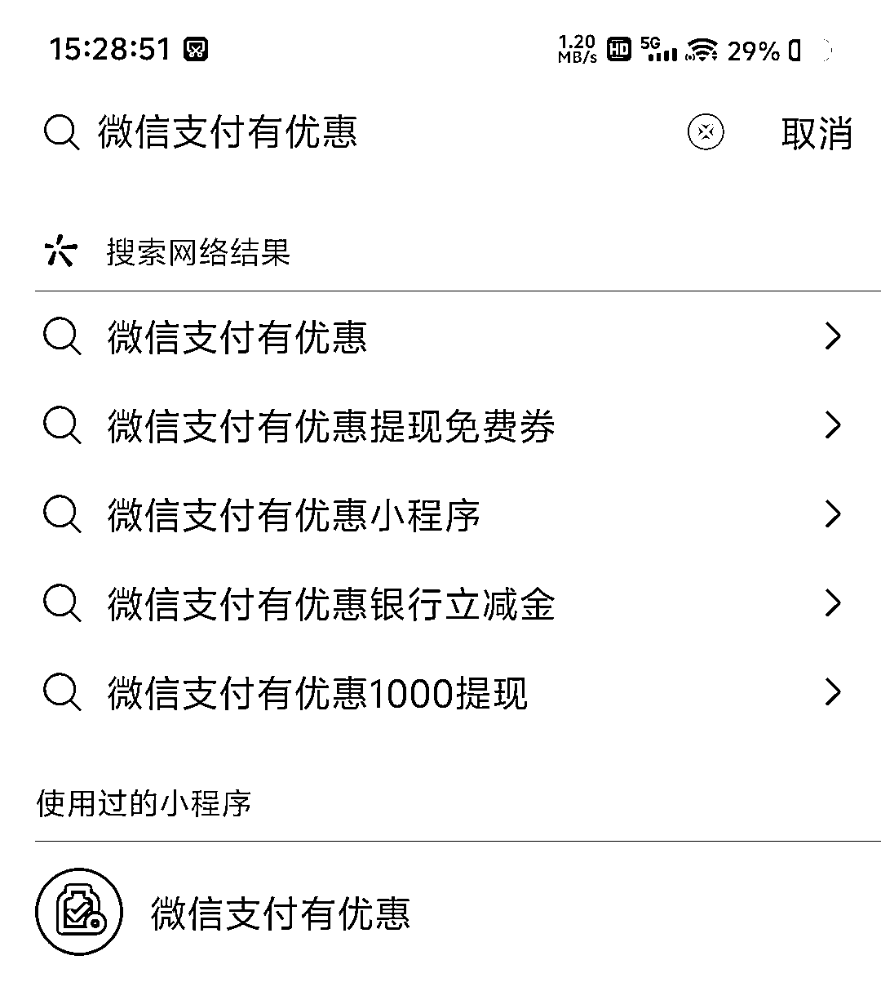
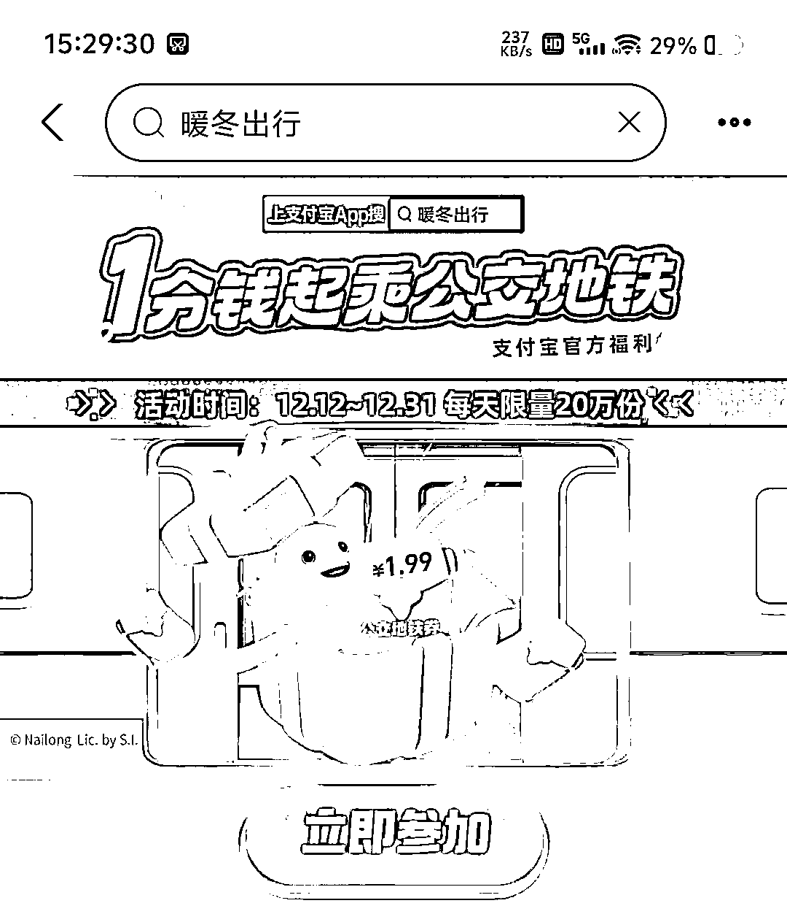
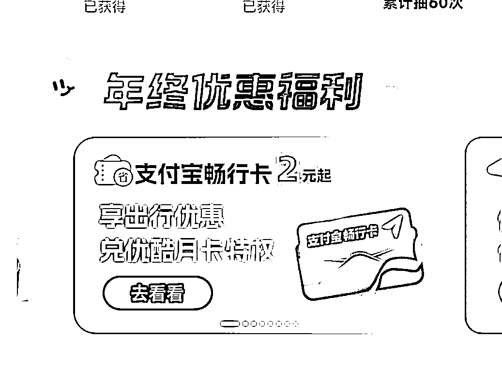
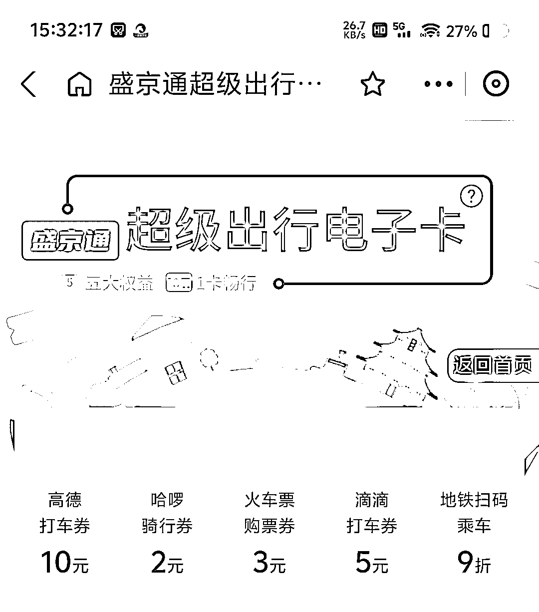
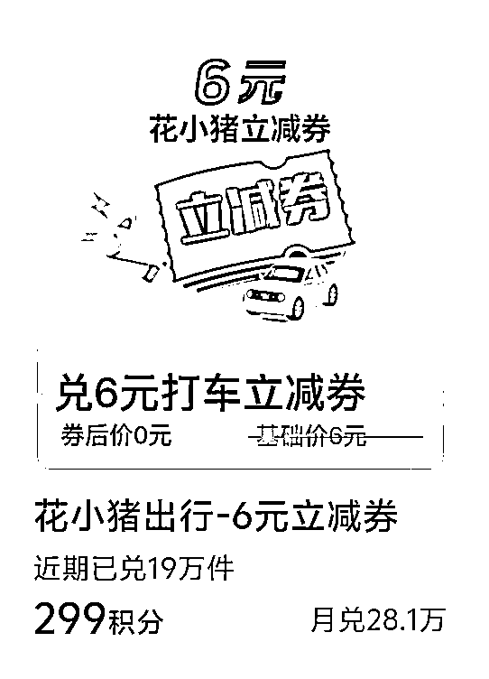
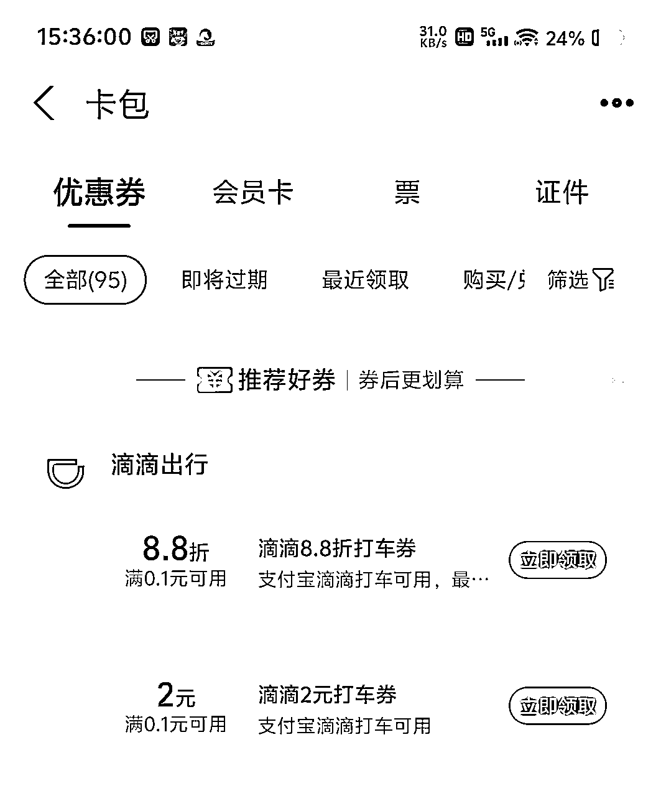
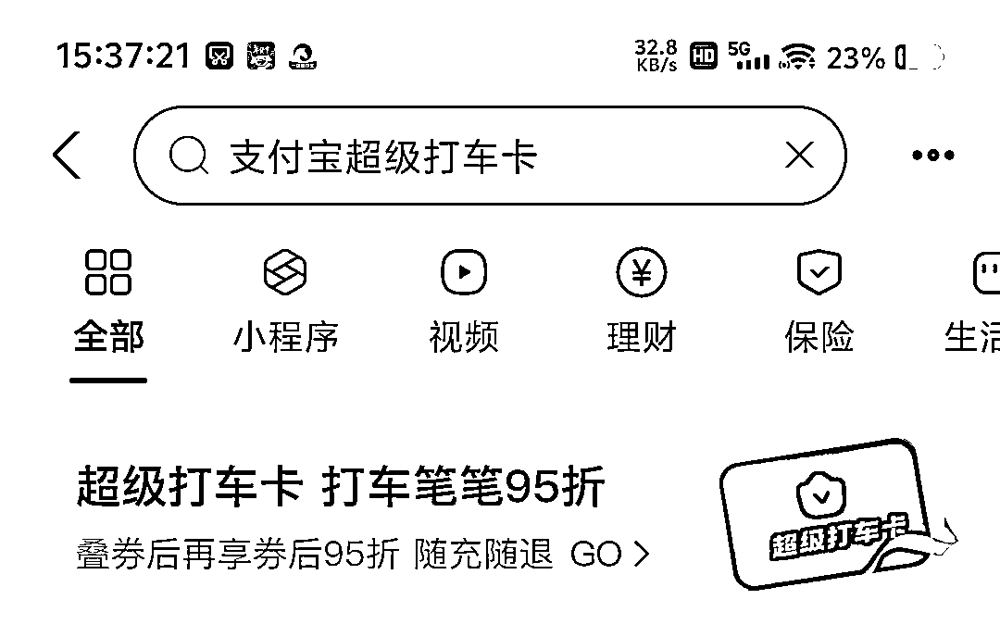
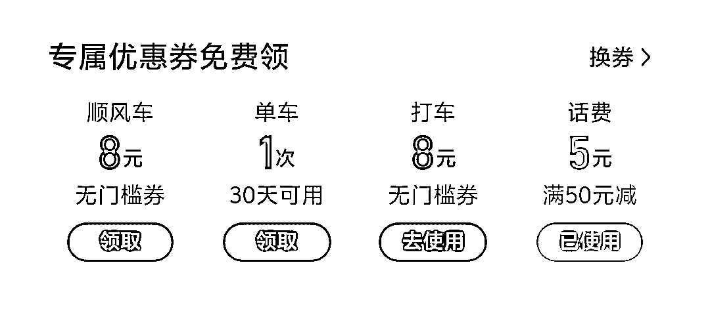

# 省钱有术之打车不花冤枉钱，必备技巧全知晓

> 来源：[https://parwc0x6nb.feishu.cn/docx/JVA5dtzS8oY1bfxtlElc0fuhnvd](https://parwc0x6nb.feishu.cn/docx/JVA5dtzS8oY1bfxtlElc0fuhnvd)

一、发现打车省钱方法的缘由

1. 无意间在闲鱼上发现大量做打车 CPS 的店铺，全部买下测试后，发现基本没啥优惠。

2. 家周边新开了很多商场，注意到有不少滴滴往返券，进而深入挖掘滴滴打车券市场。

3. 认识到闲鱼的“万能”属性，挨个测试后发现代打车市场前景不错。

4. 天冷时，去较近地方骑电单车冻手冻脑，所以更倾向打车，促使去研究打车优惠。

5. 近期用车场景增多（人变懒不想动），为节省打车费用开始探索方法。

二、常见及冷门的打车平台和 APP

1. 常见打车平台

*   高德地图聚合打车

*   滴滴打车

*   支付宝出行打车

*   花小猪打车

2. 冷门打车平台（新平台或新玩法）

*   小拉出行（可通过支付宝、微信、APP 使用）

*   阳光出行（可通过支付宝、微信、APP、抖音 使用）

*   曹操出行（大佬必备，此处暂不详细探讨）

*   哈罗出行（通过 APP 使用）

*   马达出行（通过 APP 使用）

*   百度打车

三、领券方法及平台

1. 在微信搜“支付有优惠”，可找花小猪 6 元券。

2. 在支付宝搜“暖冬出行”找 2 元福袋（适用于高德/滴滴）。

3. 支付宝出行地铁卡，切换到沈阳地铁买 2.99 卡，会送打车券。

4. 用支付宝会员积分兑换滴滴券或者花小猪券。

5. 滴滴年终到春节期间常有充值活动，如 24 年是 66 冲 88，相当于 75 折（可叠加各种折扣一起用）。

6. 在支付宝搜“领优惠”找滴滴券或者高德券。

7.支付宝券包一直下滑可领滴滴券

8. 百度打车领券一般在公众号“百度打车”。

四、实践结果

1. 通常远程打车最划算的是花小猪，尤其是周三（花小猪有折上折优惠）。

2. 必冲福利是支付宝出行超级卡，性价比很高。

3. 若微信能领到“微信支付有优惠”的花小猪 6 元券，则微信端花小猪理论上最为优惠。

4. 滴滴打车 5 折券不一定划算，要多做比较。

5. 高德 APP 在短程打车时常常能创造优惠奇迹，且较为常见。

6. 阳光出行是唯一能通过抖音打车的平台，但价格通常偏贵，不过曾在抖音直播间买过新人券实现短程返程免费（去程较贵，往返起点终点相同，返程天色更晚）。

7. 支付宝高德和高德 APP 的优惠不共享。

8. 支付宝滴滴和滴滴的优惠不共享，但滴滴余额共享。

9. 多比较是获取最大优惠的唯一办法。

10. 马达出行仅首单优惠，需自行斟酌使用。

11. 小拉出行周期性有优惠，不用频繁查看。

五、关于滴滴打车

1. 滴滴年度充值优惠力度大，建议按自身需求充值足够金额，且每个手机号单独计算优惠。

2. 在微信搜“滴滴出行公众号”，每周基本都会有券。

3. 23 年底至今新开业的商场，滴滴一般都有往返券（2 张减 6 或者 5，加 2 张 5 元券），近距离打车去商场很方便。

六、关于支付宝超级卡

充值即可享受最终价格 95 折优惠，长期来看比较划算，新人可先充 100 慢慢体验。

七、哈啰出行

下载 APP 可买打车月卡，含 8 元打车券、50 - 5 话费券（亲测 2 小时到账，非慢充），还有 6 次哈罗电单车骑行、1 次单车骑行，具体可自行分析。

八、关于各种折扣说明

1. 打车 5 折，支付减 2

例：打车花了 20 元，5 折后是 10 元，再减 2 就是 8 元。若有支付宝出行超级卡，相当于 8×0.95 = 7.6 元。

2. 打车减 3，支付减 3

例：打车 20 元，先减 3，再减 3，就是 14 元。有超级卡同理计算。

3. 折上折——打车 8 折，折上折 9.5 折

例：打车 20 元，计算为 20×0.8×0.95 = 15.2 元。

4. 特例

当支付宝滴滴打车出现上述 1、2 情况时，如果和滴滴年度充值卡冲突，则可能出现支付券无法使用，直接走滴滴充值卡。代入情况 1 就是（20×0.5 = 10，滴滴充值扣 10，相当于此单付 -7.5 元）；代入情况 2 就是（20 - 3 = 17，滴滴充值扣 17，相当于此单支付 17×0.75 = 12.75 元）。支付券若无法在滴滴使用，在支付宝出行高德同样可以使用。

九、赔付相关

1. 所有平台均可免取消费，找平台客服即可（哪怕忘了取消，司机已到也没问题）。

2. 所有平台一般不会赔付现金，答应给 10 元券的话，建议见好就收。

3. 如果司机走错路，千万别给司机指路，否则后续路线问题都与你有关（地图有时指向死路，若主动让司机绕路，责任归你，应找平台客服或让司机自行解决，别接司机话或提议换路，找客服也较难获得理想赔付，大多给 10 元券）。

4. 百度打车平台服务态度一般，非司机师傅问题，建议少用。

5. 司机走错路但问题不大，若超时多出费用，一定要申诉，平台 100%通过（预估时间超时 1 分钟，多花费 1 块钱），堵车造成费用增加也可申诉。

十、关于闲鱼代叫车

1. 价格一般是 6 元 5 公里。

2. 下雨天、堵车天，超过 5 公里可能就用不了。

3. 如果路线刚好 9 公里，可拆分成 2 段小于 5 公里的，比较划算。

感觉有用点个赞就好啦🥰