# 【抖音虚拟资料】从拥挤赛道中打通的小众搬运玩法详解

> 来源：[https://w9qs13d2em.feishu.cn/docx/JWJjddMddo8Ibexi56tcFUkAncc](https://w9qs13d2em.feishu.cn/docx/JWJjddMddo8Ibexi56tcFUkAncc)

# 自我介绍

我是阿超，一个互联网新手中的老手，自从上次写了小红书小学资料玩法以后，很多小伙伴再问抖音教程什么时候出，花了3天时间终于写完啦，因为很多点和小红书资料玩法是相通的，所以我就不在这里做重复叙述了，建议大家两篇文章结合起来看哟~【文章一：直达链接~如何从0-1，0成本月入3w+？玩转小红书资料号我是如何做到的】

今天要谈的不是大家熟知的文件翻新、也不是打印拍摄、也不是单纯的图片去重处理、而是一个比较小众但目前还好用的搬运玩法，下面是一张实操数据图~（具体玩法这里我先卖个关子哈，着急的可以看实操SOP第④项）

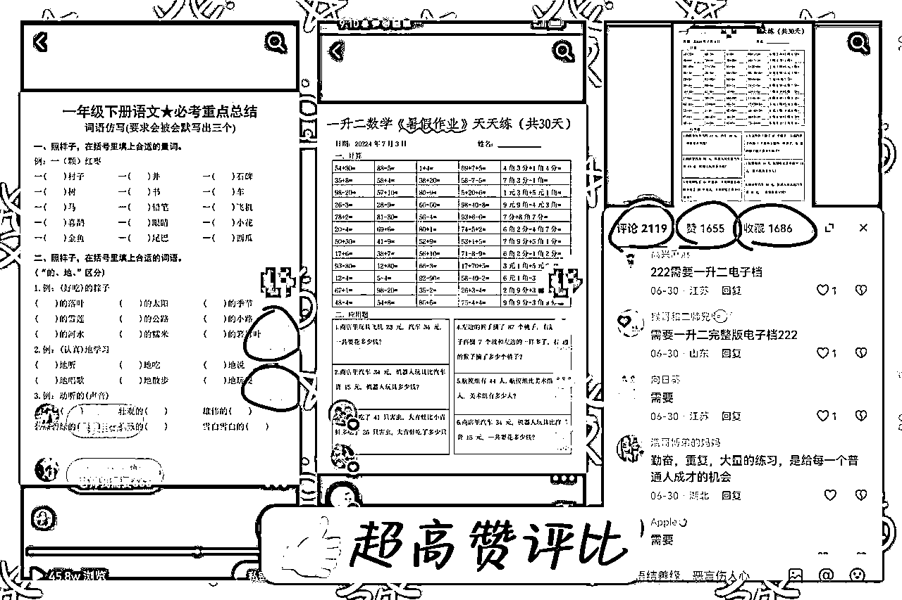

# 一、实操SOP

## ①、前期准备：

1.  设备：二手手机＋新手机号，一个手机对应一个新手机号，尽量不要频繁切换账号，手机可以去闲鱼买一个200-500左右的就行（尽量不要买华为安卓机，有的刷机系统会坏掉）。设备数量：多多益善，用希平哥的说法就是，矩阵只要能赚到钱，能跑100个号就不要跑10个号。

1.  手机卡想用长时间点，能接打电话或者后面会注册小红书，可以在公众号/知乎搜流量卡，月租19~29元的会推荐一大堆，三大运营商的卡自由选择就好，缺点：同一身份同一运营商30天内限购一张。如果非新手也可以选择淘宝买虚拟卡，搜“抖音号”会推荐很多，类似10张卡100元首冲6元，一个成本大概在16元左右，缺点：不能接打电话、不能发短信、不能注册小红书。

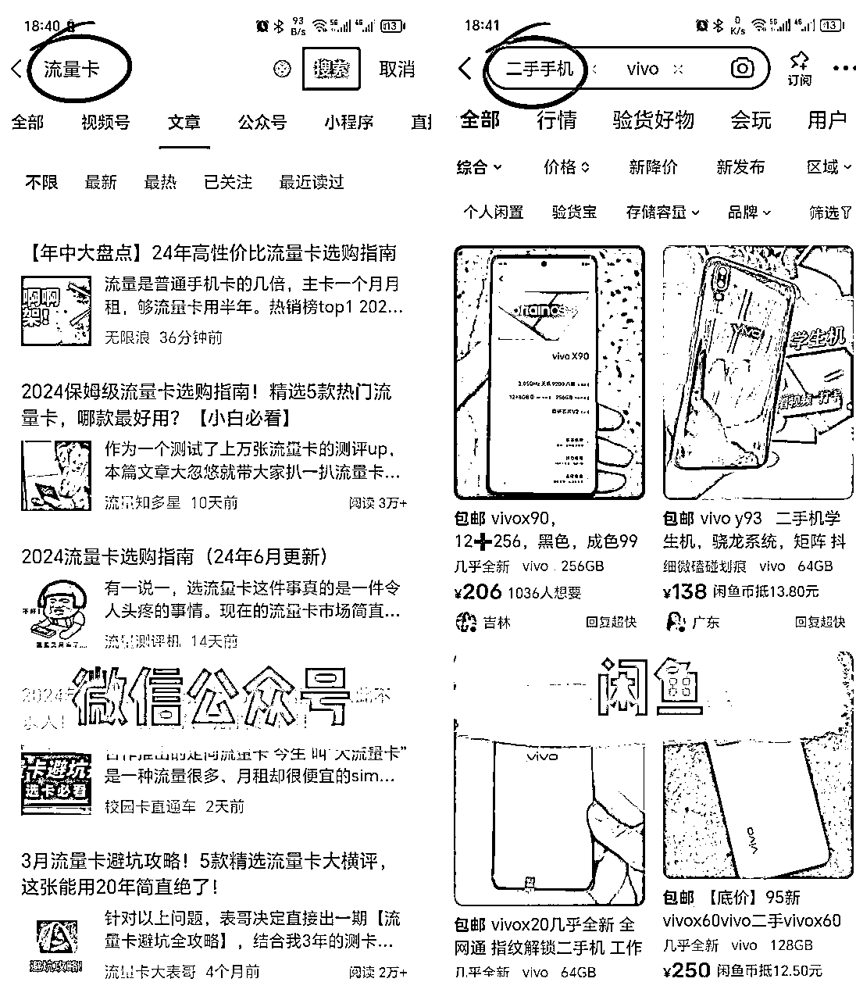

1.  手机恢复出厂设置，不要连接wifi，只用数据流量，防止抖音后台检测同一网络下多台设备登录，有判营销号的风险。

1.  新手建议养号期准备好2-3天作品，再开始日更，防止笔记作品没起色就没信心断更等等（对有惰性的小伙伴很有用）。

## ②、养号

### 基础设置

*   名称：简洁明了，不需要多文艺，例如自己定位是一年级资料分享，可以对应：XX老师一年级

*   头像：小红书搜索：女老师真人ai头像，选择一个贴近真人的图片去水印就行。

*   简介：千粉以前不要在主页引流，做个普通简介就行。例如：感谢抖音平台❤️，每天分享XX年级优质资料。

*   设置：抖音→我的→设置→隐私设置→把点赞/收藏/关注/粉丝全部隐藏。不然后面作品爆了容易被同行针对。

### 7天养号法

*   注册好账号后，前3天每天刷对应年级视频/挂相关直播1个小时，保持活跃度就行，不用太纠结。

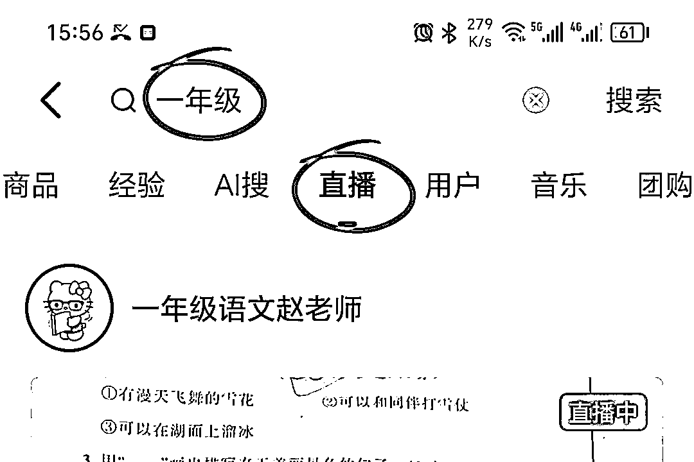

*   从第4天开始每天1~2篇作品，尽量不要断更

*   7天内只发作品，除了有1000赞以上的情况，否则不要进行任何形式的引流和互动！！！

## ③、找爆款对标

【核心】：爆款是重复的，重点要学会找到合适的爆款/异常值。

1.  检索关键词

*   例如做二年级小学资料，如果当下阶段是暑假，对应的就是一升二/二升三；九月份开学后，对应的就是“二年级上册语文”“二年级上册数学”。然后往下刷去找对标作品，或者利用筛选按钮去筛选，筛选一周内或者一天内点赞最多的（下图），找到后先收藏起来，最后对比出一个最好的，其他年级也类似。

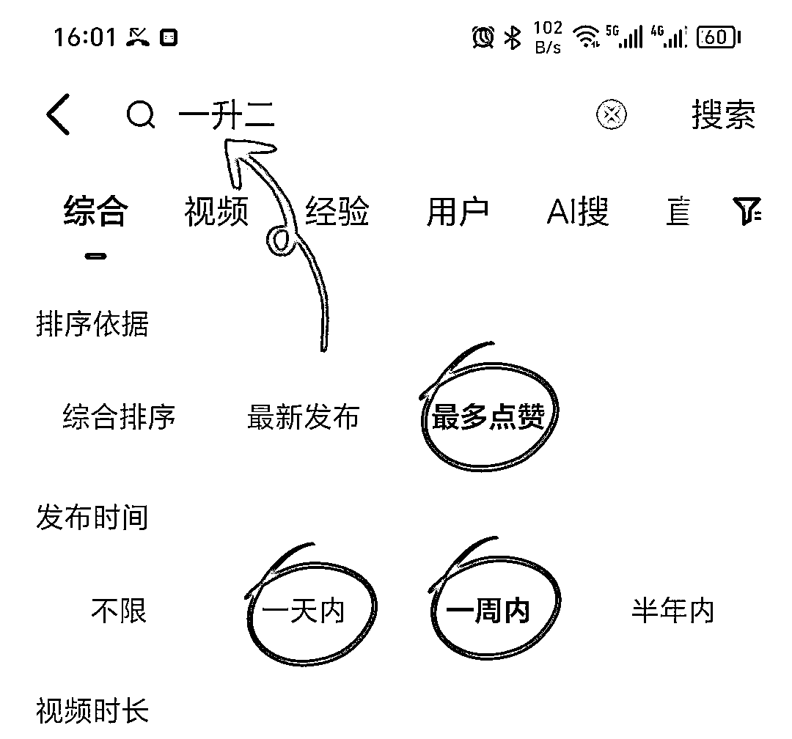

*   筛选条件/对标理由：48h以内新发布的图文作品/作品点赞数大于账号粉丝数/账号粉丝数低于10000粉。

*   筛选条件优先级：我们筛选的核心是为了找出“短期内的大爆款”。抖音如果能找到满足3个筛选条件的图文作品是最好的，如果只找到满足部分条件的，从感觉上都是爆款，无法区分的时候，我们可以按下面的条件优先级筛选：A作品发布时间远短于B作品＞A账号粉丝数远低于B账号＞满足作品点赞数大于账号粉丝数。

（重点：最初找不到就继续找，尽量不要放宽条件，多练手培养网感。如果不确定找爆款的点赞量界限、时间界限、可以以昨天的最好标准，为今天的起步标准，网感积累久了，有些对标看一眼就知道爆不爆）

## ④、爆款玩法（图文转视频）

### 爆款玩法核心

1.  分析：研究爆款玩法就是为了进一步跟爆款，短期内吃到大量流量为目的，核心也就是常说的搬运去重。这次玩法拆解是以图文转视频的形式，目前上手摸索，在期末旺季还是很有机会拿到结果的。

1.  重点：第一，搬运的必须是短期内的图文大爆款，越短越好，越爆越好，已经在③找爆款对标中讲过；第二，去重方法不仅能应对抖音的查重机制，还要能吃到爆款的流量；第三，玩法越稳定越好，能持续一段时间不出问题。

### 图片去水印下载

1.  方法：作品分享→复制链接→打开微信→微信小程序“轻抖”→粘贴链接→去水印下载。去水印软件不唯一，效果都是一样的，感兴趣可自己百度。

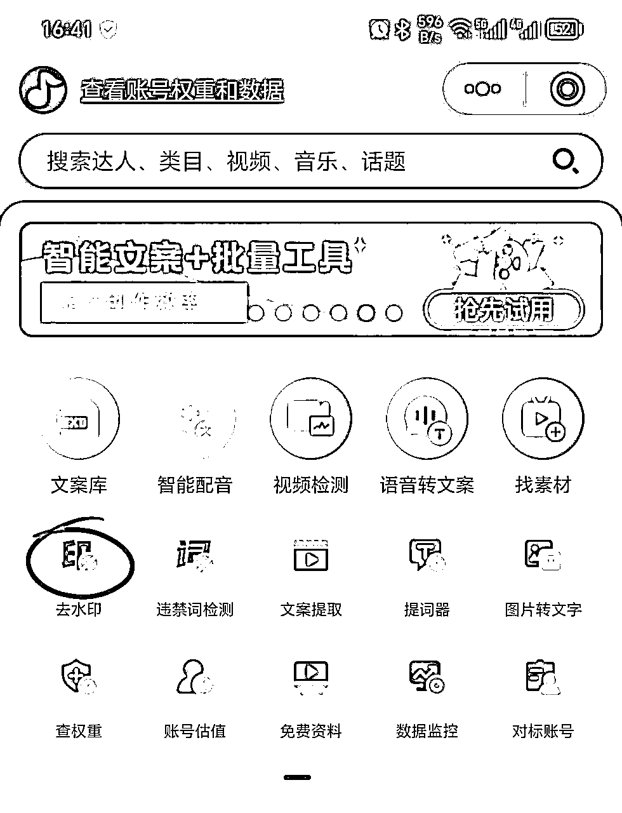

### 清晰度调节

1.  清晰度不够的话可以用“Wink”或者"WPS"做一下画质修复。

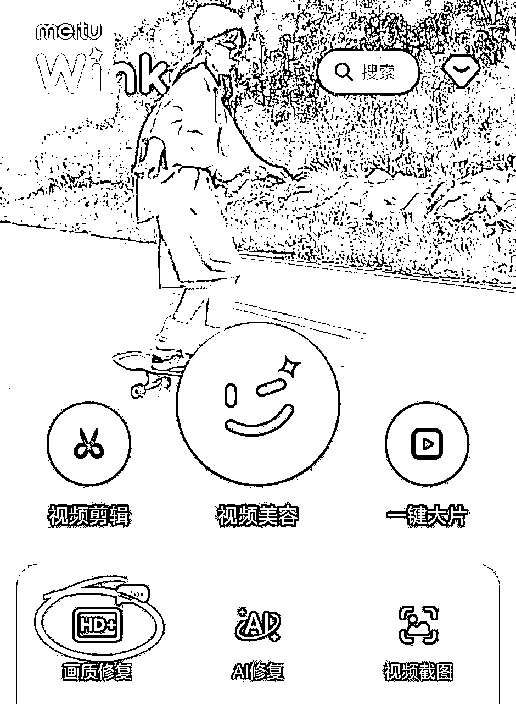

### 去重（重点）

1.  软件：美图秀秀

1.  标题：原标题抹除，换新字体、颜色后重新添加

1.  背景：正片叠底，一般为灰色去重效果较佳

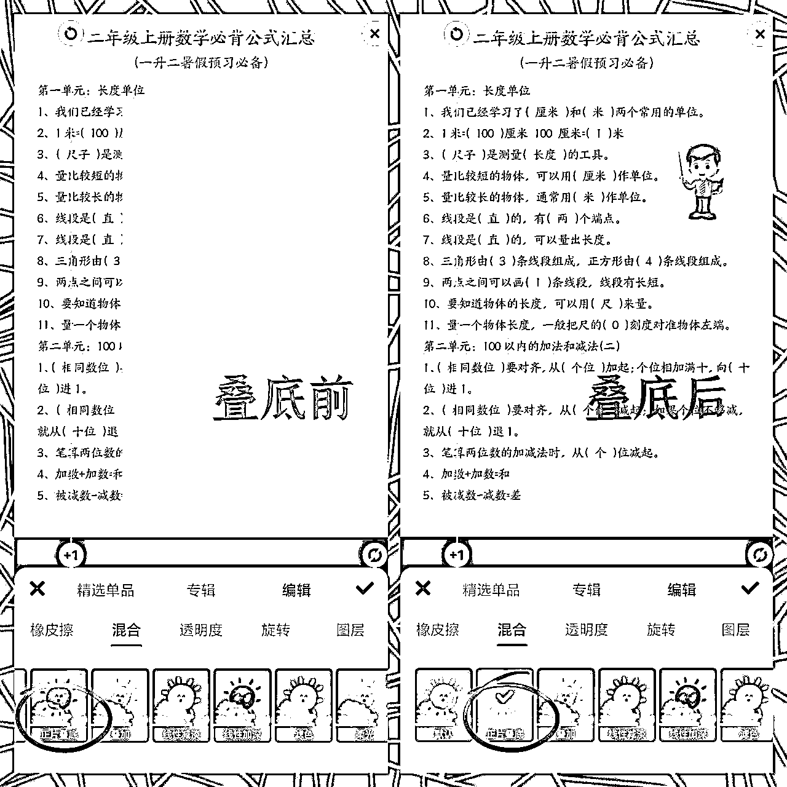

1.  人物贴纸：正片叠底，再透明度调节15%左右（透明度具体调节为让贴纸若隐若现）

1.  其他去重元素可以在不影响美观的前提下添加

### 视频制作

1.  软件：剪映电脑版（剪映手机版也可以，电脑版更方便点）

1.  步骤：添加图片（4-6张）→调整秒数（每张2s左右）→添加转场（翻页/擦除）→添加音乐（同行爆款音乐）→最后一张加钩子（过了7天养号期）

### 标题文案

1.  标题：朴素、精简、贴合视频。例如：二年级上册语文必考重点总结

1.  文案：简单解释一下标题＋委婉钩子。例如：二年级上册语文期末复习必考重点总结来喽！！完整🉑打茚💯

## ⑤、引流三件套

1.  提前准备1-2个抖音小号，专门用来在大号评论区引流 ，账号主页具体设置如下图。

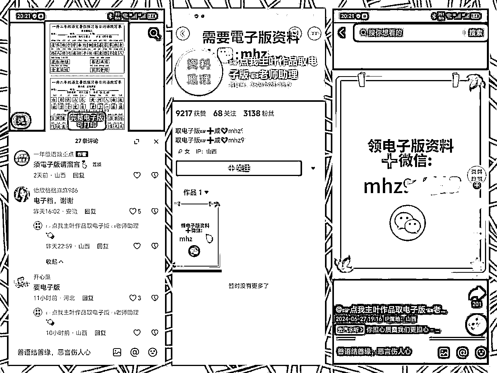

1.  作品置顶评论引导家长加关注和评论。

1.  回复私信→右下角加号→我的喜欢→提前点赞的带微信的引流作品。

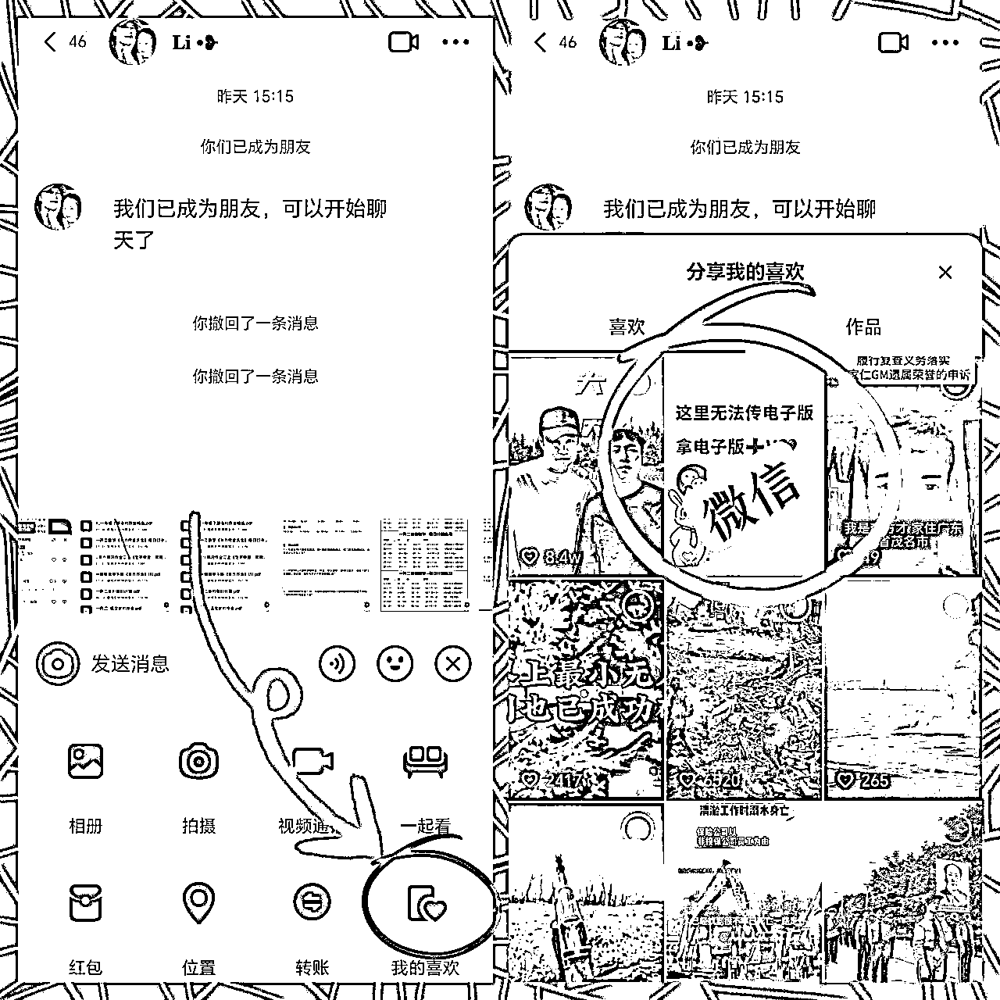

PS：引流方式根据平台管控是需要时常调整的，平时找对标的时候要经常关注，看同行有什么变化要及时调整。

## ⑥、变现/话术

### 变现形式＋基础话术

同文章一，不再重复叙述~

### 二次成交引导（补差价/收学员/其他产品）

比如家长需要进群审核，你审核通过后，可以按下面话术促进二次成交~仅为举例，可自己改动/总结，重点是加自己的钩子

1.  通过啦！！！咱们正在招收抖音小红书学员，家长可以关注我的朋友圈⭕ 哟！感兴趣可以随时私聊~

1.  通过了！！如果感觉不错的话，👉🏻可以当天补差价进学年或者1～6的会员群哟～招收抖音小红书学员🔥🔥🔥线上副业★时间自由★月入过万

* * *

### 常用话术摘选（自己理解着用，有的用的频率不高）

1.  没有答案问题?

这一套没有答案，可以用夸克或者小猿搜题拍一下找答案，或者换一套试卷

1.  催付款话术?

您要是拿不定主意的话，建议您👉🏻先选择39的学期群，进去先看下资料💪如果感觉不错的话，👉🏻可以当天补差价进学年或者1～6的会员群哟～

1.  群怎么这么多？能不能先进需要的？

这是12个群，QQ的文件可以永久保存，微信保存不了 。你可以把这个图片收藏一下，先扫你用的这个学期 ，等到后面其他再用的再扫。 也可以一下扫完，以后就不用麻烦了

1.  QQ群资料/大文件/压缩文件等，如何打开/下载/打印/转发微信？

1.  更新问题

而且安排了专门的老师负责每天更新资料，保证咱们的资料都是最新的，和孩子的学习进度保持一致

1.  版本问题（根据你的资料库去写话术，尽量不要回答单一版本）

❤️语文是全国统一人教版，💙数学我们人教版、苏教版、北师版，青岛版（54.63），西师版，冀教版都有的💚我们是三年级起点英语，英语是人教版、外研版、译林版、冀教版均有整理

1.  家长想要单个资料怎么引导进会员群?（例如单个资料设置贵一点19.9，学期会员群39.9）

单个资料19.9比较贵，大部分家长选择都是进会员群。因为后面也是持续更新的，资料也齐全。其实你这边进会员群的话，你要的这个资料，一会儿我也可以单独找了给你

# 二、百问百答摘选

1.  抖音号违规了除了买新手机号注册还有什么办法？

可以用注册超过30天的，近期无违规的账号辅助验证一个新号，也就是可以用自己的私人号，和家人的抖音号注册各注册一个，注册完，把自己手机刷好机，再登录上去

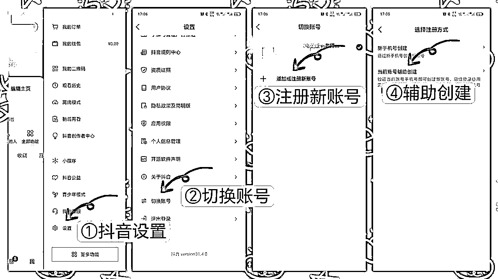

1.  怎么用微信数据-统计分析表判断自己转化情况？

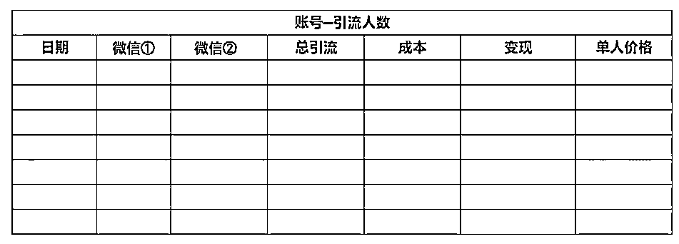

单人价格＝总变现÷总引流

表示加到一个微信的价值，一般淡季均值是6-10左右，旺季季均值是8-15左右。具体看自己情况，把自己表格做好，可以每天早上都统计一下昨天的，回头人多了，你统计的数据也多了，你就能从中发现一些东西，比如自己谈的单人价格平均是多少？然后这一段时间比平均价格是多了，还是这一段时间比平均价格少了？也就是说，出现异常情况的时候，就是你需要调整的时候，这样自己心里有数，不会像无头苍蝇

1.  想及时评论，抖音评论/私信的提示音怎么设置？

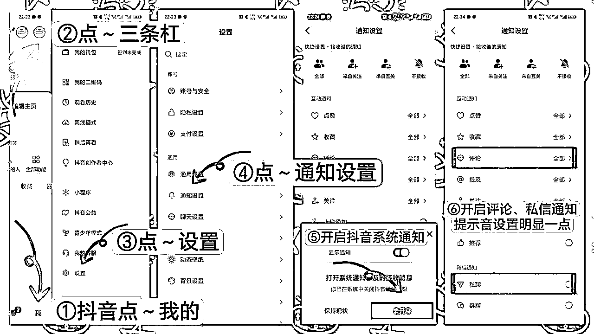

1.  我的视频爆了为什么没有几个加微信的？

首先明白一个点：不引流或者无效引流，家长是加不到你微信上的；我们做不到让不想加微信的人加我们微信，能做到的就是，让尽可能多的想加我们微信的家长看到我们微信在哪？如果你流量好了却没引流到人大概率是下面某个环节需要优化，需要复盘~

好的引流 = 好的钩子＋好的置顶评论（及时）＋好的小号回复评论（及时）＋好的私信回复（及时）

具体怎么是好的标准？同行是最好的老师～我们每天找对标的时候多用心去学习总结

1.  账号违规，减少作品推荐等怎么解决？

有几种方式：①新手机卡重新起一个；②如果像这种违规了之后，必须等违规结束，然后再继续用，如果流量正常就继续用；③如果平常感觉流量异常但没违规，注销后7天可重新注册；④老抖音号，辅助验证一个新抖音，可以抖音搜一下怎么辅助验证

1.  养号期结束后抖音作品发完后怎么操作？

引流：①作品号：及时置顶评论（抄同行昨天的）＋回复私信；②小号：（在作品号下做水军求资料）＋回复家长评论＋回复私信＋回关粉丝主动私信

检查爆款/违规：①检测账号和作品是否违规（自行抖音搜索教程），有违规的隐藏；②低于1000播放的隐藏；③第二天破100赞的及时复制（视频火了就直接发做好的图文，图文再火了重新做一套图文转视频，以此类推）

1.  抖音引流小号怎么设置？怎么检查？

可以抄类似下面这个人的小号，把他的微信变成自己的。这种小号很多，大家可以自己找（别都抄成一样的）

小号做完之后，要用另一个抖音去看一下自己做的背景简介，还有作品会不会被隐藏了？隐藏了的话就换一个人重新抄。

下面是一个备用背景底图：

1.  接流量的微信号怎么设置？

一般设置八位或九位，长的话比较不好记，家长输错了微信号就流失了，不要带0或o的，1、l、i或者不容易区分的数字字母

1.  作品发布前如何检测？

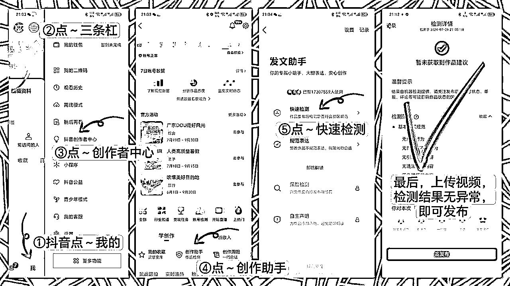

1.  抖音需要实名认证吗？

不需要实名认证。抖音号，如果粉丝突破一万的话再去实名，如果挂掉/流量持续差的话，直接注销，再注册新的抖音号就行

1.  发作品及刷热门作品是不是都要移动数据，不能用WIFI？

发作品的号保证一机一号和只用移动数据，这一点绝不能变，只是前三天养号需要刷。后面为了找对标刷作品的话一般用小号，小号网络随意

1.  养号3天后是否还需要每天刷对应年级1小时，这个1小时是当天累计刷满1小时，还是需要一次性刷满1小时？

前3天需要刷，后面不需要，累计刷满1小时就行，上班也可以静音挂对应年级直播

1.  作品加引流的钩子是7天之后可以加，还是粉丝达到1000粉才可以加还是都不要加？

7天之后可以作品➕钩子，1000粉以内不要在作品号主页背景图和简介留微信。可以先用小号在评论区引流

1.  我们发布抖音是只发布视频吗？可以发布图片吗？

只发视频，如果有视频爆了，可以把这个视频以图文的形式再发，但相当于图文转了图文，去重效果没图文转视频好，过一两个小时以及过一天都要看看是否违规，违规了及时隐藏。如果没违规，又爆了，再重新复制视频

1.  在抖音上有看到领资料进粉丝群，我们可以这样操作吗？

不建议，涉及实名认证，还易违规，主要用小号引流

1.  跟的爆款作品图片有他们的水印，我们再怎么进行二次搬运呢？

水印页不要，带钩子的不要或遮盖，凑够4-6张就行，满足不了的舍弃

PS：暂时先更这么多，有其他问题可以评论区一起探讨哟~

# 三、项目分析

同文章一，已看的可跳过~

## ①项目优势

首先根据生财的统计9月航海中就有30%的船员成功变现，期末旺季马上来临，在旺季变现也会容易很多。其次虚拟资料的特性：门槛低、几乎0成本、收益天花板高；身边朋友靠这个项目旺季基本都能月入过万，月入5万、8万的也大有人在；而且这个群体每年都有更新，每年都有新的小学生，大家每年都需要新一年的教辅资料；可以一直做，需求大、有复购（换学期的时候大概有20%~40%家长，直接选择加入下个学期会员群，妥妥的被动收入）；因为家长都引流到了微信，好友数也是在滚雪球式的增长，就可以二次/多次变现。

## ②项目劣势

小学资料最主要的不稳定因素就是有明显的淡旺季之分。期末、期中、开学这些时间点都是家长最着急的时候，喜欢给孩子找资料复习预习，也容易变现，比如这个时候一天引流100人的话，淡季的时候可能30人都不到甚至更少，不过这个问题可以通过增加变现形式解决。

# 结语

本文主要讲的主要关于玩法技巧的内容，和一些好用的小Tips，帮助大家打开一个思路，其实做虚拟资料，除了做流量，朋友圈的搭建，话术的设计，私域产品体系配套组合也是非常重要的，越早意识到这些，提前布局，能少走很多弯路。写文章的经验少，有不合适的地方希望大家多批评指正哟~超级感谢~

算下来加入生财已经一年半啦，在我缺项目、缺思路的时候，都会不由自主的来生财逛逛，总能得到新的启发和灵感，我做的项目不多，目前在做3个项目，都是在生财找到的，并且其中两个都已变现5位数以上，所以我特别感恩遇见生财，希望这个圈子能越来越好~

最后，在这里特别感谢@希平老师在我写这篇帖子过程中的指导，感谢@星城老师和好友@拾一的帮助，让我拿到了自己的结果，同时祝愿各位小伙伴年底钱包鼓鼓，一起发大财~