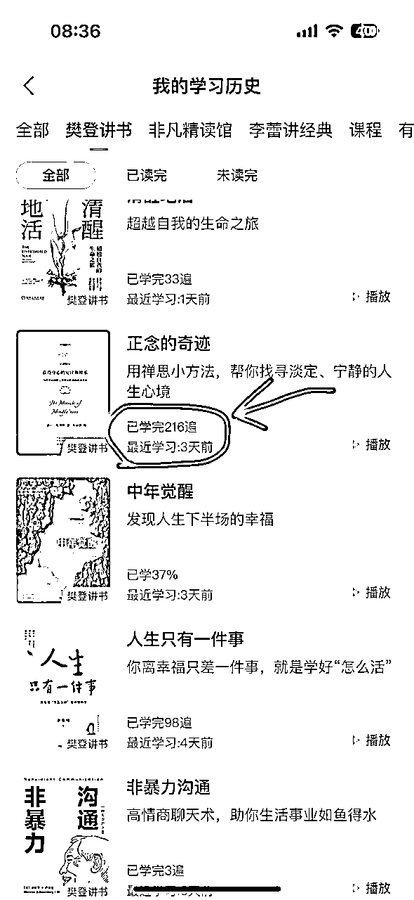
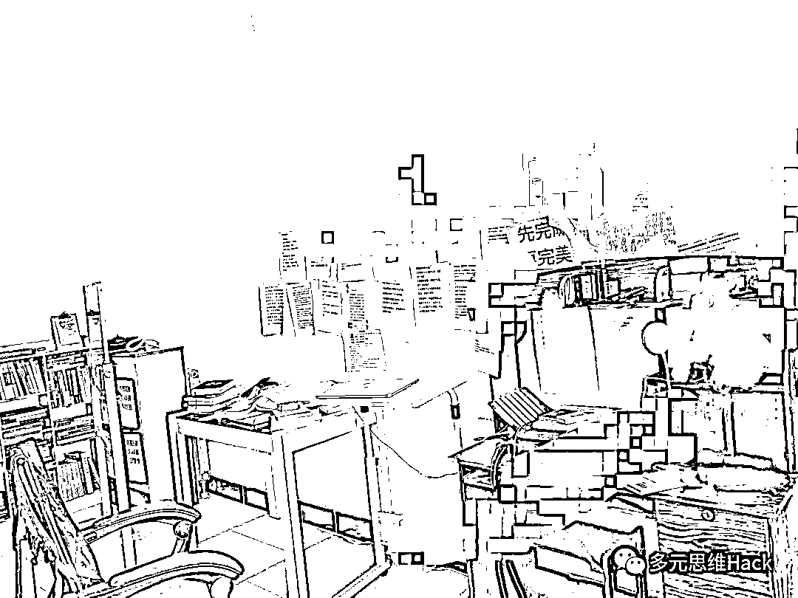
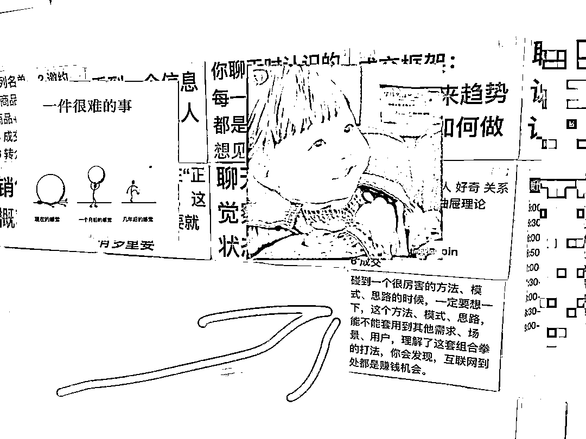
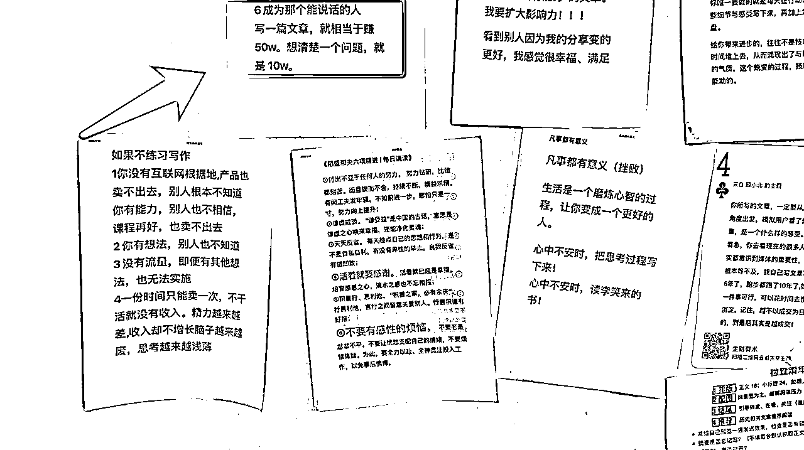

# 在赚钱这件事上，如何做到知行合一？

> 来源：[https://pznme756ly.feishu.cn/docx/JhIJdd1oLo19YoxvImkciiOcnZc](https://pznme756ly.feishu.cn/docx/JhIJdd1oLo19YoxvImkciiOcnZc)

大家好，我是明白，生财 8 期老圈友。

今天我想分享一个话题：如何在赚钱这件事上，做到知行合一？

如果你经常遇到下面的问题 ——

1 明明知道参加航海实战，认真打卡很重要，但做两天就容易懈怠、放弃

2 明明知道概率思维很重要，用数量对抗概率，按照正确的方法持续发小红书/抖音/视频号，爆的可能性就会变大，但就是没力气去做

3 明明知道「先完成后完美」很重要，先发出第一篇笔记/公众号文章/YouTube视频/CursorAPP，然后持续迭代就可以了。但就是纠结，想要做一个完美的东西，才愿意踏出第一步

4 明明知道做一个项目前，找一个对标，像素级的拆解，然后模仿、行动很重要，这样成功概率一定更大。但总是因为一时惰性，还是按照自己的本能想法去做了，结果一直拿不到结果

5 明明知道赚钱是一件不确定性很高的事情，要降低预期，尽全力做好过程，做好手里的事情，在结果上随缘。但每一次小的行动，总是会忍不住想：怎么还不变现啊。结果每一次都失望，让自己焦虑、内耗，没有能量继续行动。

6 ……

总之就是，我们明明知道，在赚钱这件事上，有些方法/思维/心态是绝对正确的，但我们在行动的时候，总是做不到。

这到底是什么原因？

如果能搞清楚这个原因，并且有一个简单可行的方法，能帮我们在每一次行动的时候，都能在这些方法/思维/心态上做到，那我们赚钱拿到结果的确定性，就会无限趋近 100%。

这就好像，一个人知道少吃多动对减肥很重要，如果他也能做到，那一个月时间体重下降，就是一件几乎确定的事情。

上面这些问题，我之前都遇到过，经常是知道做不到，就是无论看了多少厉害的书、赚钱方法/思路/案例，但我的成长，几乎是原地踏步。

后来，经过一段时间的学习、研究、练习、复盘总结，我确实找到一个，操作性非常强的方法，可以解决这个问题。

不夸张的讲，我在个人成长、情绪控制、赚钱方面的进步速度，就是因为想通了这件事，一下突飞猛进，效率提高了 10 倍。

这个进步变化就像是，一个小孩从蹒跚学步变成了坐火箭。

就像是，一个武功平平的少年，被高手打通了任督二脉，无论学什么东西，都非常的快。

更重要的是，这件事从操作上对每个人来说，都非常简单，超级简单，没有门槛，完全没有门槛。

但也正因为如此简单，所以很多人会忽视、或者不屑于去做。这也成为阻碍我们成长最大的一个因素。

今天我就来详细的分享一下这个方法，希望带给你一些思考，和进步。

这个帖子我拆解的比较详细，近 8000 字。

# 1 从一个焦虑的情绪故事讲起

2020 年 5 月份我刚开始日更公众号的时候，有一段时间，我因为数据方面的事情，每天都极度焦虑。

后来，我从书里学到一个方法：解离——

把大脑认为的困难，和当下的实际情况分开，人就不焦虑了。

因为人焦虑的主要原因，就是大脑容易把想象当成现实。

比如，我写了一篇文章，数据不好，大脑会认为——

数据不好，就是你写作能力差。

你写作能力差，就是人不行。

人不行，你以后干啥都不行。

干啥都不行，你一辈子就完了。

明明只是一篇文章没写好，大脑却把这件事放大到「一辈子」的程度。

如果我也觉得这个想法是对的，那当然就焦虑，什么都干不了。

解离的方法：把大脑的想象，和现实区分开，这样情绪一下就缓解了。

我第一次看到这个方法，是在上午 10 点左右，我试了一下，很管用，焦虑缓解了很多（因为篇幅原因，这个方法暂不深入）

我当时很开心，觉得以后遇到这种情况，我肯定不会被影响了。

但当天晚上，又出现一个同类型的事情，我还是焦虑了。

等焦虑过后，我才晃过神来：为什么我刚才没及时想到用这个「解离」的方法呢？

这就是，知道但做不到啊！

到底哪里出了问题？

后来，我从另外一本书《正念的奇迹》里，学到一个概念：惯性。

终于搞懂了原因。

而且随着练习的加深，我发现，这个概念遍及生活的方方面面，学习 工作 赚钱 情绪 运动，每个人做每件事都会被它影响。

PS：《正念的奇迹》这本书我重复听了不下 300 遍，就是因为书里有这个概念。重复听这本书，也是这个概念的一种运用。

（这本书在樊登读书有 2 个版本，旧版本叫《正念的力量》，后来版本更新后，学习次数也刷新了）

* * *

# 2 惯性：知行不合一的罪魁祸首

你骑过自行车吗？

一辆自行车，从坡上滑下来时，速度很快。

如果你在车滑行一段时间后，再踩刹车，这时候刹车的作用有限，因为惯性太大。它会推着你往前走。

我在焦虑时，想不起来用「解离」来缓解，就是因为惯性太大。

之前很长一段时间，我碰到这类事情，大脑的第一反应，都是放大困难，引发情绪。

这种应对意外状况的行为模式，已经存在了近 30 年，积累了非常大的惯性。

所以，当再次遇到这个意外时，惯性力太大，让我来不及想到用「解离」的方法。

那为什么我第一次看到「解离」的方法时，它是有效的呢？

因为那次，从看到方法，到使用方法的时间很短。

看到方法后的那一小段时间内，我被拉到了另一个惯性之中，就是「遇到问题，能及时想到用解离来缓解」的惯性。

但这段时间过后，可能 5 分钟后，这个惯性力就逐渐消散。

我就被慢慢拉回到之前的惯性。就是「遇到问题，大脑放大困难，我焦虑」的惯性。

于是，再次遇到这类情况，我会继续焦虑，因为惯性太大，大到让我来不及想到「解离」，焦虑就发作了。一旦焦虑发作，就完全进入那个惯性中了。

于是，知道，但做不到。

* * *

类似的一个场景——

小明是个程序员，平时早晨会睡到 10 点，起床上班。虽然能感觉到职场压力，但就是提不起劲来学习，提升自己。

某天晚上他看到一个励志视频，觉得心潮澎湃，一定要改变。

第 2 天早晨 5 点就起床读书了。

第 3 天，6 点。第 4 天，7 点。第 5 天，8 点。第 6 天，10 点，恢复原样。

为什么会这样？

因为他长期 10 点起床，已经积累了太大的惯性。

那个励志视频，只是起到一个短暂的力量，把他拉到「5 点起床」的惯性中。

但这个励志视频的惯性力，没有后续支撑，就会逐渐消散。

所以，慢慢的，他又被拉回到早晨 10 点起床的惯性中。

于是，他觉得这是自己动力不足，或者自控力太差导致。

我们每个人，每天，做每件事情，都置身在各种惯性之中。

有好，有坏。

* * *

# 3 为什么优秀的人，会越来越优秀？

碰到一个困难，

A 想到的是退缩、逃避、视而不见。

B 想到的是搜索、研究、请教别人。

A 在坏的惯性中。

B 在好的惯性中。

这是行为惯性。

受到一个质疑，

A 会破口大骂，愤怒。

B 会毫不在意，忽略。

A 在坏的惯性中。

B 在好的惯性中。

这是情绪惯性。

遇到一个问题，

A 会抱怨。

B 会挖掘需求，想到赚钱思路。

A 在坏的惯性中。

B 在好的惯性中。这

是思维惯性。

A 想学会 B，很难，因为惯性太大。

B 想学会 A，很难，因为惯性太大。

所以，我们在生活中会看到这个现象——

优秀的人，越来越好。

差的人，越来越差。

因为优秀的人，在好的惯性中不断累加。

他想懒惰、想愤怒、想抱怨，都很难做到。因为好惯性会每天拉扯他。

偶尔会犯一次错，也会被慢慢拉回到好的惯性中。

差的人，在差的惯性中不断累加。

他想学习、想读书、想思考，很难做到。因为坏惯性会每天拉扯他。

偶尔读一下书、学一会习，思考一会，也会被慢慢拉回到坏惯性中。

甚至学习同一个方法/技巧——

好惯性的人，会第一时间，把这个方法，融合到自己的惯性中。

坏惯性的人，会第一时间，把这个方法，剔除出自己的坏惯性中。

不是他们不愿意改变，而是惯性太大。

人，无能为力。

这不是危言耸听，你可以静下来，自己回想一下，思考一下，是不是这样？

我有个朋友，今年 30 岁，在公司拿一份凑合的工资，未来晋升渠道也看不到希望。

他说自己知道读书、学习、提升自己的重要性，也尝试过，但没过 2 天就会放弃，没法坚持下来。

他很苦恼，所以经常报各种课程，觉得一定有某个方法、技巧之类的东西，能让自己突然变得爱学习。

不过一直没找到。

其实没有方法。

因为不主动读书、不主动学习的惯性，已经存在 30 年了，这是一股无形的强大力量，每天都在拉扯他，导致它根本做不到。

那就无解了吗？

为什么有的人，他们以前是一个样，但后来会变成另一个样？

比如，有的人一直上班，也不读书、学习，但某天就能突然改变状态，然后一直读书、学习，最终慢慢变成另一个人。

他们掌握了什么秘诀吗？

其实这个秘诀很简单，每个人都能做到，只是有人愿意做，有人不愿意做。

* * *

# 4 如何破解惯性？

一辆自行车，从坡上滑下，怎么才能让刹车效果更好呢？

答案：按多次刹车。

在一开始下坡时，你就按刹车，隔一会，按一下刹车；再隔一会，再按一下刹车。

最后，自行车就会以几乎匀速的状态下坡，随时想停，随时就能停。

放到人身上，当你处在一个坏惯性中，想培养一个好惯性，就需要不断的给自己一个好惯性的力。

拿我来说，我碰到困难，大脑会习惯性放大困难，让我焦虑。

解离的方法有效，但惯性太大，再次碰到焦虑时，我来不及想到它。

怎么办？

刚才我们说了，看到解离的5 分钟内，我是能随时想到用这个方法的。因为这个时间段内，这个好惯性力，足够大。

好，那我每隔 5 分钟，就复习一下解离的方法。

用一个外部刺激，让自己一直处在好惯性中，这不就可以了吗？

随着对方法越来越熟悉，练习次数越来越多，好的惯性力会慢慢变大，可能复习一次，能持续 10 分钟。

再后来，复习一次可以持续 30 分钟。

再后来，1 小时。再后来，5 小时。1 天，3 天，10天，1 个月，3 个月，半年，1 年。……

慢慢的，我会彻底进入另一个好惯性中。

没错，我就是这么做的。

我把解离的方法，打印出来，贴在眼前，随时都能看到。

（我 2020 年在北京的时候，家里墙上的图片）

每看到一次，就加深一次好的惯性力。

看了几百次，现在，我大部分时间都处在好的惯性中，也就是碰到焦虑，我会想到用解离的方法，来调整自己的情绪。

* * *

上图我墙上贴的内容比较多，因为我还在培养其他惯性，所以需要随时复习其他方法。

比如，我学到一个写作技巧，非常好用。但以前的写作惯性是没用这个方法的，所以，如果我只看一次，下一次我是想不起来用它的。

于是，我把这个方法，也贴到眼前，每次写文章时，就能看到它。慢慢的，重复练习的次数足够多，它成了我的新写作惯性。

我的写作水平就是这样，飞速提升的哈哈哈

比如，赚钱思维，以前我看到一个很厉害的赚钱方法，看一眼觉得卧槽牛逼，就没了，等于没看。

但后来，我会把一些需要练习的内容，贴在墙上，比如 ——

上面图片是 2020 年的生财日历中，我写的一篇内容。

这个提醒真的太重要了。有了这个图片，我每次在生财有术里，看到任何好的赚钱方法、思路，商业模式，我都不会单纯的只看，而是会认真思考，这个方法、思路、模式还能套用到其他什么需求，场景、用户上，如何去实践，至少想 3 个。

重复练习的次数多了后，慢慢的，这种思维方式成为了我的新惯性，内化到了身体里。

遇到一些真实的场景、项目，我就能下意识的调取出来，去应用、实践。

再比如，我以前写过的《如何用清单思维，打造自己的赚钱兵器库？》，每一个赚钱案例，都可以从需求、流量、营销、变现的维度，深入拆解，它也是可以通过练习，慢慢培养的一个好惯性。

我的赚钱的见识、思维、知识、技能、经验，都是用这种方式，集中时间高频刻意练习，所以进步速度就超级快。

2021 的 418 生财有术拉新，我邀请了 400 多个人，当天加上龙珠奖励，差不多变现 20万+。之后再做其他事情：写公众号、接广告、带货、做课程、社群，都更顺利了，后来也赚到了 100 万。

因为那些知识、技能，真的进入我的身体，变成我的惯性，而不仅仅是「看过」。

当你进入一个好的惯性中，你想犯懒也做不到，因为好的惯性力会一直拼命拉你，拉你，拉你。

遇到任何问题，你都会主动深入思考。如果不思考，你就会难受。

多思考一次，惯性力就更坚固一分，下一次会更愿意思考，相应方面的能力也会提高。

强者愈强，就是这个道理。

前面那个励志视频，小明如果每天看一遍励志视频，让这个好的惯性力维持下去，他就会慢慢变得能早起，形成一个好的惯性。

之前写过，当你没动力、自控力差的时候，要想清楚这件事情对你的重要性，但这还不够，你要把重要性的意义清单贴到眼前，每天看，时时看。

否则，你还是会 3 分钟热度，然后半途而废，因为你会被坏惯性拉回去。

同样，当你接触一个新东西，无论是新知识、学习方法、思维习惯、情绪管理、做事技巧、工具使用，初期都需要将它放到眼前，多看，多用，这样才能慢慢把它变成一个好的惯性，融入自己的身体。

否则，改变就绝对不会发生。

# 5 在赚钱这件事上，如何做到知行合一？

回到我们的正题，

如果你在赚钱实战过程中，遇到下面的问题 ——

1 明明知道参加航海实战，认真打卡很重要，但做两天就容易懈怠、放弃

2 明明知道概率思维很重要，用数量对抗概率，按照正确的方法持续发小红书/抖音/视频号，爆的可能性就会变大，但就是没力气去做

3 明明知道「先完成后完美」很重要，先发出第一篇笔记/公众号文章/YouTube视频/CursorAPP，然后持续迭代就可以了。但就是纠结，想要做一个完美的东西，才愿意踏出第一步

4 明明知道做一个项目前，找一个对标，像素级的拆解，然后模仿、行动很重要，这样成功概率一定更大。但总是因为一时惰性，还是按照自己的本能想法去做了，结果一直拿不到结果

5 明明知道赚钱是一件不确定性很高的事情，要降低预期，尽全力做好过程，做好手里的事情，在结果上随缘。但每一次小的行动，总是会忍不住想：怎么还不变现啊。结果每一次都失望，让自己焦虑、内耗，没有能量继续行动。6 6……

那解决方案就很简单（序号对应） ——

1 把“认真打卡的人，100%都获得了结果”打印出来，贴在电脑前每天看一遍。你绝对会比之前，更有动力去认真打卡。

2 把“发够100篇笔记/视频，我能赚 100 万”“每发一篇笔记/视频，我能赚1万块”，打印出来贴在电脑前，每天看一遍。你会舍不得睡觉，都想去认真发笔记。

3 把“把这篇笔记/视频越早发出去，我就离赚100万越近一步”，打印出来贴在电脑前，每天看一遍。你会更能放弃完美主义，开始迭代。

4 把“模仿成功案例，可以提高10倍赚钱效率。自己瞎做，就是无效勤奋，我就是个蠢货，一辈子也赚不到钱，”，打印出来贴在电脑前，每天看一遍。你一定会认真去拆解对标的。毕竟，你也不想一辈子赚不到钱吧哈哈

5 把“我不能掌控结果，但我能掌控过程。把自己能做的事情，尽最大的努力。但行好事，莫问前程”，打印出来贴在电脑前，每天看一遍。你心态就会更稳定，会更把注意力放在过程上。

6 ……

可能有同学会觉得，里面有些句子的表达，会比较夸张，甚至有点假。比如“100%、100万、一辈子”等。

但我想说，这是非常必要的。

因为这些句子的初衷，就是为了激发自己的动力，和热情、行动力。就一定要让自己一看到，就热血沸腾，有想要行动的冲动。

如果换的保守一点，比如“参加打卡的人，99%能获得结果”之类的，大脑一定会想“我肯定是1%，算了，不打卡了”。不要怀疑这点，大脑最擅长负面想法了。这是基因里遗传了几万亿年的惯性。

所以，一定要夸张，一定要让那句话，你看到之后，想象到那个结果后，就有一种立刻想要去照做的动力。

只要这样，你才能真的去做那些“你知道的正确的事情”。然后，你就有更大可能性，在客观世界中获得那个结果。

我最早日更公众号的时候，我知道每天写作很重要，但我也会因为太累，没有正反馈想要放弃。那我怎么办？看看我是怎么夸张的 ——

“一篇文章赚50万”，

夸张吗？太夸张了！

假吗？太假了！

那又怎么样？

至少，因为这张纸，我坚持日更了公众号 1600多天，我的收入比之前提高了至少 10 倍。我的知识、思维、能力、经验、心态、影响力，都比之前提高了 10 倍。

即便我今天依然没有做到“一篇文章赚50万”。

但我还是 120% 坚信：未来，我确定能做到，我一定能做到，我肯定能做到！

因为我一直在路上，我在正确的方向上，不断的迭代。

我有无限可能。

但如果不去做，一切都是0。

所以，放心大胆的把你想要获得的结果，和获得结果需要做的事情，写出来，打印出来，每天看一遍吧。

这样，你就会更有动力、去真正做到那件事，更大概率获得结果。

这里我还是忍不住想多啰嗦一点 ——

*   A 学到一个东西

*   B 学到一个东西，贴在眼前，高频去看，去用。

这两者的效果，

不是 1 和 2，或者 1 和 10 的区别。

而是 0 和 100 的区别。

A 是无效，B 是有效。

时间拉的越长，这个区别会越大。

这就是为什么很多人，读了那么多书，学了那么多赚钱方法，听了那么多课，也写了心得，也做了笔记，也提问了，也实践了（一次，或者几次），但依然没有真正发生改变的核心原因。

因为无论是知识、思维、工具、方法、思维，都需要大量重复的刻意练习，才会熟能生巧，真正灵活变通，运用到实践中，产生效果。

这还没完哈哈哈

# 6 更大的惯性：环境

个人的惯性，其实还好解决，靠主观能动性，就能搞定。

但更严重的是，周围环境的惯性。

一个人想看帖、学习、打卡、实践、复盘，但如果他每天的朋友圈、微信群，都是各种红利、机会、涨粉、变现的信息，他能沉下心继续看帖、打卡、实践、复盘吗？

不能。

我们周围的惯性，每天都在不断拉扯着每个人。

一个人要想改变，不仅要面对自己之前长期的不良惯性，还要应付周围和自己目标不同的惯性。

那个贴在眼前，能培养好惯性的一张纸，显得更渺小了。

所以，如果你想挣脱某个坏的惯性力，那些产生坏惯性的场景，比如朋友圈、群聊、知识星球，都应该果断屏蔽掉。

你多看一眼，就会被它拉进去一分。

这需要更大的勇气、耐心，和放弃 100% 的安全感。

这需要更长时间的修炼。

同样，你如果进入一个周围都是好惯性的圈子，那自己就不断被好惯性拉扯，就更容易培养好惯性。

比如，周围人遇到问题都会主动搜索、思考、请教别人、看教程。。

你呆久了，也会慢慢养成这个好惯性。

生财有术就是这样一个超级好的惯性圈子，如果你希望在赚钱方面，让自己一个真正有效的改变，就多看精华帖，多参加航海，多学习哪些赚到钱的高手，他们是如何思考、行动、坚持的。

那你能获得结果的可能性，一定会更大。

回到惯性的话题，还有一个更重要的 ——

# 7 惯性会传播给下一代

每个人都会被周围的惯性影响，每个人的惯性也在影响周围人，包括下一代。

如果一个人从小到大，一直在父母身边生活，那他最终会变成父母的样子。

因为父母会把孩子一点一点拉到自己的惯性中。

比如，如果父母没有读书的习惯，下班就是看手机。孩子看到后就会模仿，让他读书也不会去。慢慢他也就养成了不喜欢读书的习惯。

相反，如果父母有读书的习惯，孩子看到后也会模仿，慢慢也会养成喜欢读书的习惯。

有人说，我可以让学校培养孩子哇。

可以，不过作用有限。

学校再好，老师再好，他们能把孩子拉到一个惯性中的力太小，太分散，远远比不过家长和孩子朝夕相处的惯性力。

大人的惯性力好，孩子就会时时处在好惯性中，他也会越来越好。

大人的惯性力差，孩子就会时时处在坏惯性中，他也会越来越像大人。

细思极恐，有没有？

我当时想到这里，吓得一身冷汗，立刻开始认真学习、读书、思考，让自己养成一些好习惯，将来给孩子一个好的惯性力。

这也是《人生只有一件事》里讲到的，当一个人自己活好后，孩子就不用教，他会自己去学、去模仿大人，他会想变成大人的样子，教育会变得更轻松。

言传身教，就是这道理。

最后，

理解了惯性，我们就知道，改变并非一朝一夕的事情。

知道了一个方法、思路、模式，把它用到实践中，去应用、赚到钱，也不是一次就能做到的。

改变是一个需要每天做、高频做、长期做的事情。

要想改变坏惯性，就需要能随时有一个好惯性的力，方法是在能随时看到的地方，贴一张纸。

写上你想要改变的方面（赚钱 工作 生活 沟通 爱情 写作等等）

然后

每天看一次，做一次，重复次数越来越多，好的惯性会慢慢进入你的身体。

这个时候，你就做到了得知行合一。

你的人生也一定会变得越来越好。

祝各位圈友，都能知道并做到，知行合一，收入翻倍！

* * *

# 小尾巴：历史介绍~

我是明白，生财有术 8 期老圈友，星球编号 20。

程序员出身，目前自己创业，做一个成长社群《日新月异俱乐部》

以下是我在生财的历史 28 篇精华帖合集

也代表我的一个成长轨迹，

如果有兴趣，点击链接直达 ——

2024年（x1）

1.  《详解：写作和赚钱的 4 个关系！看完你一定会忍不住想开始写！》 https://t.zsxq.com/192OLDlds

1.  《7 年生财拉新 1100 +，我只做对了一件事》https://t.zsxq.com/19SqL7McC

1.  《赚钱急于求成的心态，该如何破除？》https://t.zsxq.com/wD6k5

1.  《如何借鉴其他行业经验拓展赚钱思路》https://t.zsxq.com/3wd8r

1.  《参加航海实战，如何让自己每天都有正反馈？》https://t.zsxq.com/9e2ns

1.  《当思考成为习惯，赚钱会更容易》https://t.zsxq.com/19vgy7kcp

2023年（x1）

1.  《身体残疾卧床 3 年，我在人生最低谷加入生财有术，有哪些成长？》 https://t.zsxq.com/19KWDvzz0

2021年（x3）

1.  《复盘 | 亦仁 3 年前的帖子，帮我每月被动收入 1 万块》 https://t.zsxq.com/19jaotwbv

1.  《嘉宾问答|“想去更好的公司，我该如何利用好时间？”》 https://t.zsxq.com/1952Q3a92

1.  《2883 人向朋友介绍生财有术时，说的最多是 16 个词！》 https://t.zsxq.com/19MYWwvCl

2020年（x6）

1.  《产品想要获得更大收益，应该不断向用户的真实需求靠近》 https://t.zsxq.com/19kQ7NILy

1.  《 我的2019：普通人如何培养自己的用户视角？》 https://t.zsxq.com/19fyFdZRL

1.  《如何通过分析成功案例，帮自己建立赚钱清单》 https://t.zsxq.com/19FNjtIjB

1.  《思路详解：如何为某个细分领域用户提供产品，并赚钱》 https://t.zsxq.com/19qoI1QQB

1.  《学习和赚钱是什么关系？》 https://t.zsxq.com/19uQcuMzJ

1.  《5000 字深度拆解 | Manchuan 公众号 2 个月涨粉百万，普通人如何复制？》 https://t.zsxq.com/19cD1keUB

2019年（x8）

1.  《在生财有术，普通人如何从 0 到 1，培养赚钱思维》 https://t.zsxq.com/19rA0kWrD

1.  《生财有术第 3 期，我是如果做到邀请 245 个用户的？》 https://t.zsxq.com/1968tlTAx

1.  《公众号和抖音之间的赚钱机会》 https://t.zsxq.com/19OfzDckK

1.  《可复制，零门槛 | 如何借别人的流量，打造一个稳定的被动收入系统》 https://t.zsxq.com/19sVRn6Yx

1.  《做自己擅长的事，把技能树打通，然后再去赚钱》 https://t.zsxq.com/19evWC1Xl

1.  《信息整合：一个可复用，低门槛的成熟商业模式》 https://t.zsxq.com/192zoSooT

1.  《产品名字，只有一个目的：降低用户认知成本》 https://t.zsxq.com/19QUBrDOT

1.  《数据是需求的抽象化 | 帮你快速找到 100 个赚钱思路 》 https://t.zsxq.com/19QrIpsuC

2018年（x3）

1.  《分享一下，抓取其他微信号的方式，而且是精准粉》 https://t.zsxq.com/19sKQT9bF

1.  《如何几乎零成本做到1w多付费学员？》 https://t.zsxq.com/198XWAGhV

1.  《36 个小而美赚钱项目之一：蛋黄酥白皮书》 https://t.zsxq.com/19G4PKUXr

2017年（x2）

1.  《一个零成本，为公众号增粉，并高转化率为付费社群，进而再次付费转化加入小密圈的案例》 https://t.zsxq.com/19WJ8NILt

1.  《一款软件，webscraper，帮助非技术领域的朋友，做到爬虫可以做的事情》 https://t.zsxq.com/19RSl40n5