# 一人公司，用聚光投放，一年时间，从小红书加了4W客户，深度复盘！

> 来源：[https://qxgrvnd4nbk.feishu.cn/docx/JtloduXlUow6mzx9HHTcO9V2nub](https://qxgrvnd4nbk.feishu.cn/docx/JtloduXlUow6mzx9HHTcO9V2nub)

圈友大家好，我是更绪，四川南充人，深耕小红书平台，擅长通过内容+投放获取客资、销售产品。

前段时间写了一篇实战复盘贴，嘿嘿，有幸被加了个精华，关于在小红书卖虚拟资料的👉

文章中提到，我是在武夷山这边卖茶叶，通过聚光投流卖得还不错，感觉聚光有红利，就想着借助聚光撬起来更大的利润，所以选择了虚拟产品这个赛道，最后有了前面这个复盘贴。

考虑到明年底应该会离开武夷山，去大城市发展，也算是给这近一年的武夷山生活打个总结，数据没啥意义，可以默认为假，也可直接忽略，相信我，内容绝对是有价值的！

这篇文章会完整复盘这段业务从0到达成这个成绩的全过程，并且会整理出完整的聚光投放获取客资的SOP步骤，只要你的行业可以投聚光，你想从小红书获客，我都建议你去试试，时至今日，聚光投放仍然有红利，仍然有很多从业者没用过聚光，如果你正在从事小红书这个平台，一定会有一些参考意义！

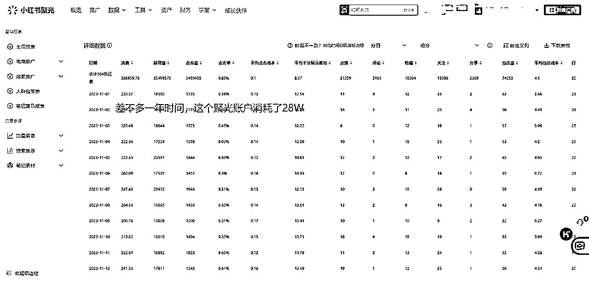

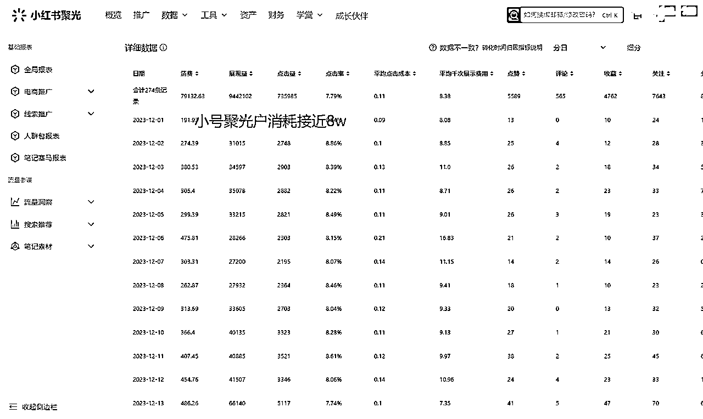

文章目录如下：

1.  投放是趋势，且聚光依然有红利

1.  模仿并优化，一篇笔记完成破局

1.  迫不得已投聚光，打开新世界大门

1.  我在投放过程中踩过的坑

1.  各行业，小红书聚光投放获客SOP流程

1.  从这段经历得到的感悟

# 一、投放是趋势，且聚光依然有红利

## （1）平台政策收紧，风声鹤唳

小红书从9月底开始，各行各业的自然流量急剧下滑，原来基础播放量一两百的小眼睛，现在变成了一二十，甚至更低。这些绝非偶然现象，是我接触了至少上百位小红书从业者得出的结论，如果你也从事小红书平台，一定多少有点感受。

小红书平台的销售，也是想尽办法天天给商家打电话推销聚光投流，天天催着商家聚光开户。这是小红书重度商业化转型的一个重要标志。

直到前段时间的官方一条公告出来，我原本以为小红书只是吓吓人，结果它来真的，我相信看到这篇文章的不少人，最近账号的违规率都会比以前高很多。

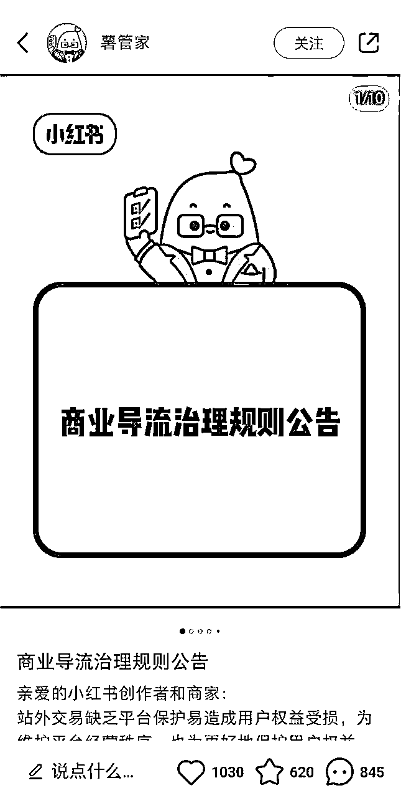

## （2）投放是趋势，且离你并不遥远

随着平台的逐步完善，想要从平台白嫖流量的难度会越来越大，不止小红书，在任何平台都是如此。如果有好的手段可以搞免费流量自然不错。

但是投放，我们可以不投，但是不能不会，投放离你也并不遥远。

投放一点也不难，甚至可以说是很简单了，也就是开个户的事情而已。不是什么高大上的事情，不是大公司的专属，小团队也可以投放，甚至像我一样，一个人也可以投放，而且很轻松就可完成。

如果你的业务用自然流就能很好获客，你把聚光打开，不光能规避违规封号的风险，还能快速借助投放的杠杆，让你的业务迅速迎来成倍的增长！

## （3）聚光依然有红利

所有能够通过投放获客的平台，聚光一定是性价比最高的之一。聚光这个产品，经过了一年多的迭代，其内部积累了大量的用户数据，也慢慢新增了很多功能，产品的成熟度足够。加之小红书内容创作成本低，用于投放的素材也好搞定，投放入门从它做起，没什么太大毛病！

从下面这张图来看，只要你会用聚光，你至少可以干掉一半以上的同行。

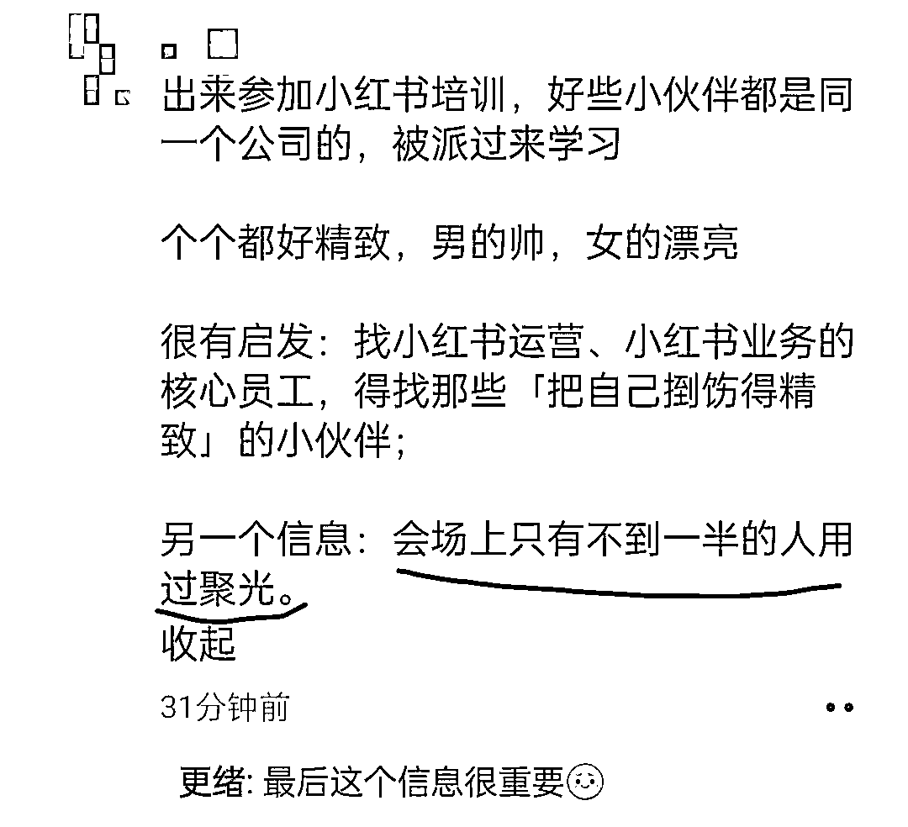

## （4）投放不仅仅是投放

在各个互联网平台，获取流量的最核心的能力就是做内容的能力，投放也是基于内容去做的。在投放的过程中，我们可以不断精进自己的内容能力。

当内容能力达到一定水平，想要在各个平台获取流量，可以说是再简单不过的一件事了。

接下来，我将深度复盘我这段项目经历，希望你能从中得到一些启发！

# 二、模仿并优化，一篇笔记完成破局

## （1）知乎？抖音？视频号？小红书！

来到武夷山，熟悉了整个茶叶的产品线之后，就开始研究怎么在互联网上卖茶，天天去各大互联网平台去找可以模仿的对象，去思考到底要做哪个平台。

做抖音？在抖音做过很多项目，但是都没拿到什么结果，而且自己的实名，早在20年的时候就被抖音封了，被抖音的同行卷得导致对这个平台心生畏惧，信心完全被摧毁，直接就放弃了做抖音这个平台。

做视频号？视频号的确是一个不错的选择，主要用户的画像和茶叶的受众群体也很契合，不过自己对视频号的了解几乎为0，也就没有选择做视频号。

做知乎？知乎我熟啊，分分钟写篇文章我感觉就能起来，然后就马上去写了一篇文章。

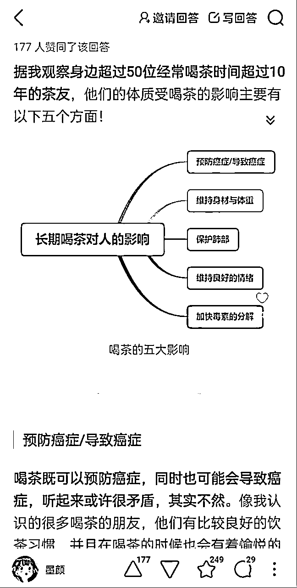

确实起来了，不过没啥用，又卖不出去茶，这不是浪费时间吗？

做小红书？好像还不错，小红书上能看到一些对标账号在卖茶，自己对这个平台也还算熟悉，还算是有把握。

所以最后就选择做小红书了，这就是当时选择做这个平台的完整心路历程，并没有太多客观的分析，主要从主观因素出发考虑。

直到现在我也觉得，不管是选择做一个项目、一个类目、还是选择平台，只要是做选择，就一定要尽量选择自己擅长的，尤其是手中可调用的资源不多的时候，不然前期很长时间没有正反馈，很难坚持下来！

当然，做选择的时候一定还是要尽可能的遵循一下事物发展的规律，即使是我再熟悉知乎，估计也难在上面把茶叶卖好，因为知乎显然不符合时代发展的趋势。

## （2）抄得不到位，卖不出去

在确定了做小红书之后，就天天在平台上研究同行，天天去看茶叶相关的爆款笔记，筛选近期的“低粉爆款”的笔记，然后开始抄。

当时抄中了一个非常火的笔记模板——“每天认识一款茶”，几天时间就涨了一万多粉。

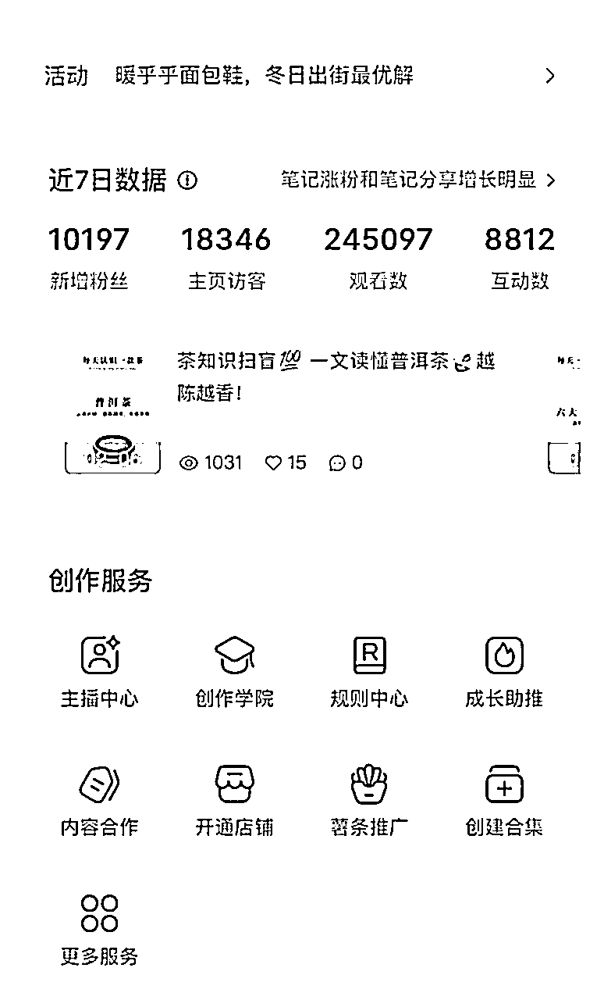

时至今日，这个模板依旧有流量，在小红书发出来就能涨粉。

然而并没有什么卵用，涨粉归涨粉，卖不出去茶叶也没意义，就跟我在知乎写文章一样，这不是纯纯地浪费时间？

不过也还好，锻炼了一下我的做内容的能力，至少我跑通了在小红书做出来爆款内容的流程。

粉丝量、播放量等等数据，在很多数时候都没啥太大意义，它们最大的意义就是看起来好看，自己心里感到满足，对变现来说，意义不大，很多人老是纠结这些数据。

所以我把这个写进了小红书十大“谣言”，感兴趣的朋友可以去看看👉

## （3）抄对了，迎来第一个客户！

思维转变，我TM应该去抄卖货的笔记啊，前面抄的那些笔记，数据虽然好，但是没意义，卖货的笔记数据肯定都不会太好，但是有意义啊！

然后就开始在小红书上找卖货卖得还不错的笔记，这算是给我找到了。

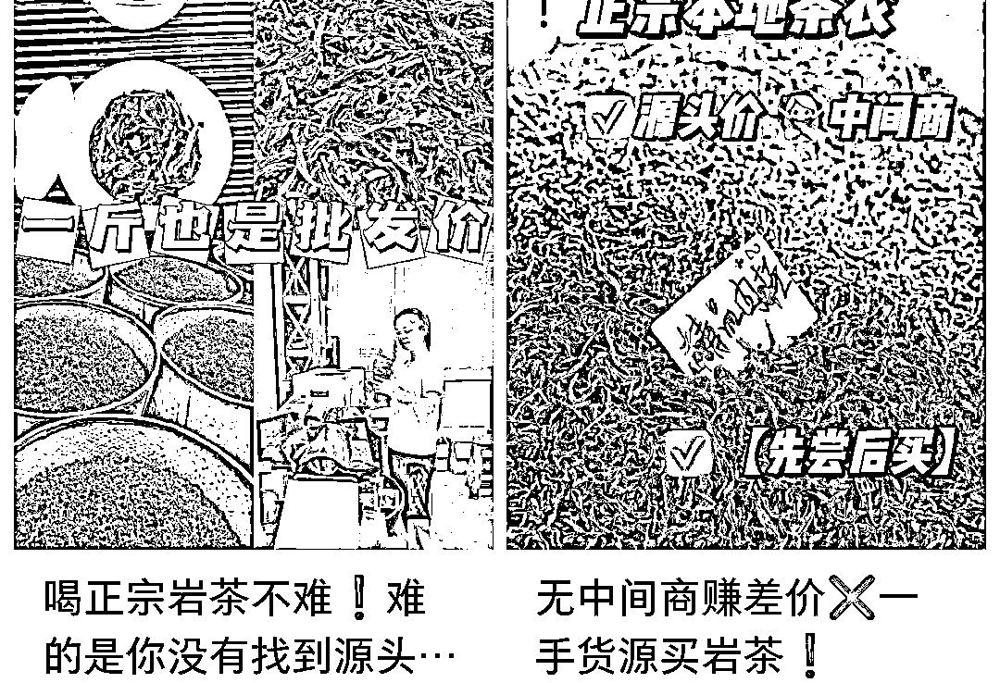

这两篇笔记，就是我当时在小红书上找到的两篇卖货的笔记，数据还不错。

于是立马就对照着做了两篇笔记，效果立竿见影，当天微信就加上人了！

这是小红书上加来的第一个客户，非常有纪念意义，这个顾客到现在也复购很多次了。

## （4）抄完再优化，一下卖了十多万

抄完这两篇笔记，心里有点感觉了，知道大概什么样的笔记会有效果。

所有优质的、有效果的内容都是因为击中了用户的某个点，通过洞察出用户的某个需求点、痛点、痒点、爽点，就可以做出来吸引他们的内容。

“那么在小红书买茶叶的用户，他们的需求点是什么？他们最关心的点是什么？什么样的卖点展示出来，能够精准击中他们的需求点？”

从我抄的这两篇笔记中，可以洞察到一些点，比如说“茶叶正不正宗？”、“价格实不实惠？”、“有没有溢价？”等等卖点，这些卖点一定会击中用户的某些需求，才会有比较好的效果！

于是我把小红书、淘宝、抖音、视频号，所有茶叶相关的内容，只要数据好的，能看到用户提问、评价的地方，全部看了一遍，尽可能多的挖掘出用户关心的点。

最终挖出来的用户关心的点：（排名分先后）

1.  价格是否实惠且透明？是否有高溢价？前面提到过，茶叶是非标品

1.  是否真正的源头货？

1.  茶叶品质到底如何？是否有性价比？

1.  茶叶有没有打药？是否健康？

这些点挖掘出来后，我就对原来的笔记进行优化，主图的封面改成了下图这样，既然用户最关心的是价格问题，那我就直接上王炸，直击你最关心的地方！

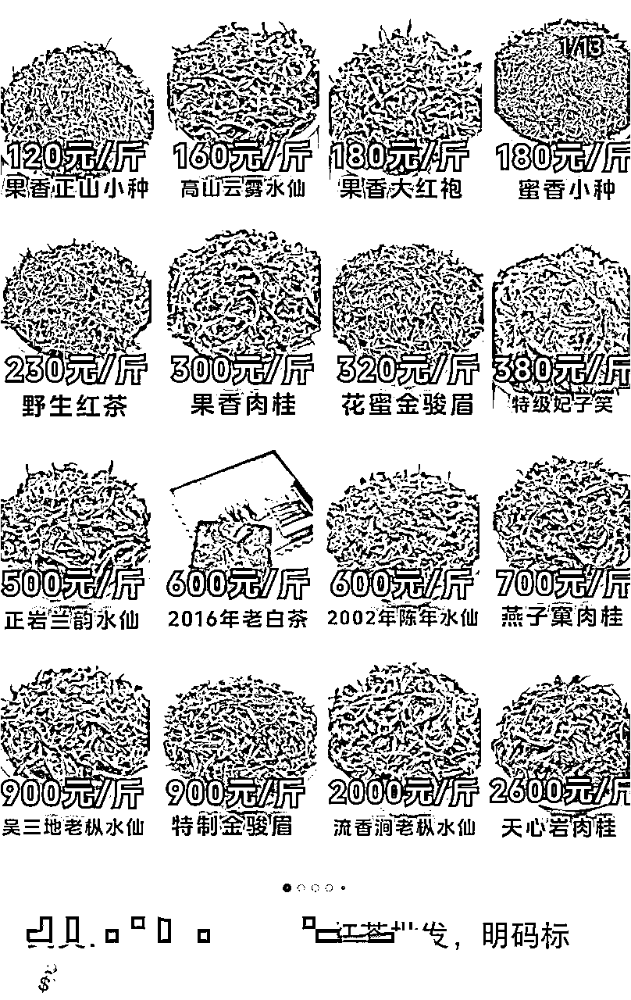

然后在后面的层图包括标题文案中，通过源头茶厂批发价、零售一斤也是批发价、资质证明、获奖证书、顾客评价、有机证明等等去击中顾客的其它需求点。

然后这篇笔记就爆了，一年过后的今天，小红书上卖茶叶的同行，人手一篇这个笔记模板，不过这篇的效果已经没那么好了，远不及刚刚出来时候的爆炸效果！

某天走在武夷山的街上，突然发现一家茶叶店门口摆放的标语——“买一斤都是批发价”，才恍然大悟，原来这些需求点，效果爆炸的广告标语，早就遍布在武夷山各个门店，不过没多少人搬到网上去。

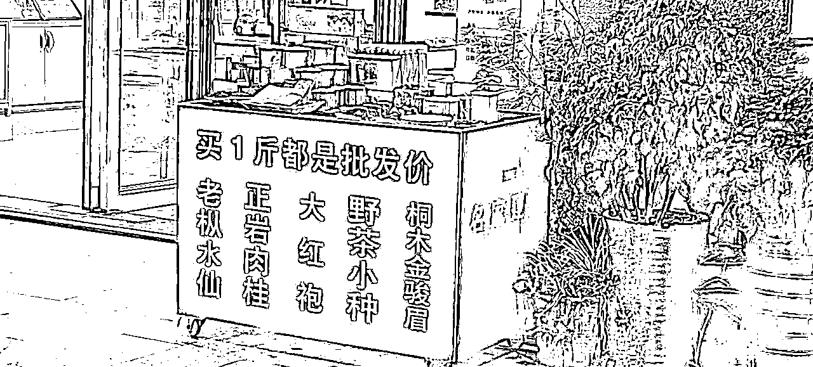

这篇笔记出来的1个月时间，微信就加了1000多人，卖了10多万的茶叶。

然后小红书就违规了，站外导流被逮了，账号直接给违规限流了...

# 三、迫不得已开聚光，打开新世界的大门

## （1）只想花钱买“平安”

账号违规了，只能想办法解决啊，恰好当时聚光风头正盛，听说投聚光可以开通“白名单”，私信随便留微信也不会违规，于是就找小红书销售开了一个。

在投聚光之前，几乎没有接触过投放，尤其是客资投放，属于是0经验，仅仅是在抖音投过一小段时间的千川。

内心对聚光是排斥的，总觉得投放离自己很遥远，好像是一件特别高大上的事情，其实现在还有很多人都是这个想法，其实投放没有任何难度，离你并不遥远！

我当时的想法就是说，咱就想要个“白名单”，你别封我号，就当我花钱买“平安”，交个保护费。

## （2）聚光投爆了，微信加不过来

开了聚光还不行，每个月还得消耗几千块才有“白名单”的资格，那没办法，只能硬着头皮投，也没想通过投放赚钱的想法。

于是就借着自己以前投千川的模糊记忆，就直接把那篇爆款笔记弄来投放。

这一投，直接就爆了，当时准备的两个微信号，压根加不过来，紧急又准备了好几个微信，才堪堪接住每天的客资。

后面算了一下，当时投聚光，加一个微信的成本是10块左右，投过聚光的朋友应该知道，这个获客成本极低，而且我们的茶叶是偏中高客单的茶叶，最便宜的茶叶也是两三百一斤。

而且，不得不感叹，小红书这个平台的用户质量真的高，加过来的用户，成交率也高，客单价也高，复购也还不错（因为合作的茶厂品控确实做得还可以）。

## （3）尝到甜头，放开了投！

这下尝到甜头了，这不抓紧了投，岂不是傻子？

于是根据原来那篇爆款模板，做了很多篇类似的模板，又开了几个聚光户，天天就疯狂建计划投，一直投到现在，聚光是一共消耗了36W左右的广告费。

一年时间，转瞬即逝，最终私域和小红书店铺端达成这个销售数据，并且沉淀了4ｗ较高信任度的客户。

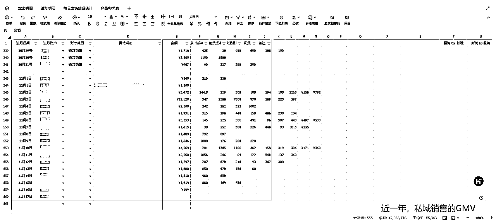

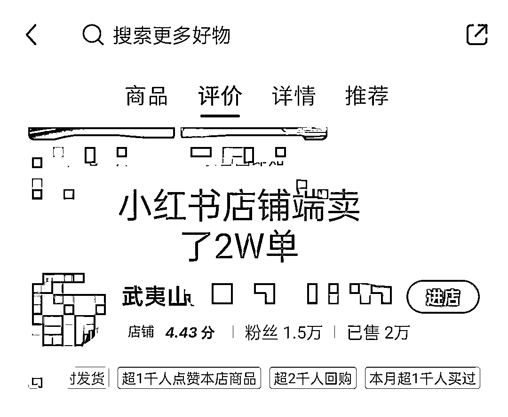

# 四、聚光投放踩过/见过的坑

## （1）不要理小红书的销售

我自己当时开的第一个聚光户是小红书的销售开的，没有任何返点，直到后面认识了一些小红书的服务商才知道，找服务商开聚光户有返点。

而且你一旦绑定了账号，想要再换就很麻烦了，不光操作流程上很麻烦，而且以前账户积累的用户数据，算法模型都会连带着清空。

开通专业号之后，小红书官方的销售会天天给你打电话，让你找他开聚光户，然后还会套路你把营业执照给他，营业执照给了他，你就被他锁定了，后面只能找他开户，但是官方的销售开户没有返点，自己去找服务商开户，现在至少有18％的返点，千万别理销售；

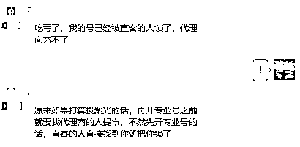

你要是一年投放花个几十万，返点的钱都差了几万块出来，所以千万别理销售！

## （2）别信投放的代运营

很多小红书的服务商，会跟你推销自己的代运营什么的，这些统统别信，90%的都是水货，没有任何含金量。

包括市面上绝大部分做投放代运营的，都没什么含金量。真正厉害的团队，是不会靠着代运营赚钱的，更不会来变着花样找你，让你花钱找他们代投。除非你的产品后端非常有优势，这种可能厉害的团队会跟你走分成的模式。只想赚你代运营钱的，90%都是水货，你的钱给了就是打水漂。

投放这件事，还得自己来，只有自己才是最了解自己业务，自己的用户，这样才能做出来好的投放素材，才能控制好投放的节奏。

## （3）聚光的电商投放很垃圾

无论是聚光，还是才出来不久的乘风，小红书的电商板块的投放一直表现不太行，个人推测应该是小红书电商板块的整体GMV太低，用户对小红书电商的认知度低，有明确电商行为的人太少，导致用户积累的数据太少。

所以在小红书投聚光，去获取客资还可以，但是想要直接通过投放走电商卖货，现目前绝对是行不通的，投了大概率亏钱，小概率保本，极小概率能微赚一点点。

个人预测，等到小红书的电商整体GMV达到抖音的十分之一的时候，就是小红书电商投放效果比较好的时候，先让平台再下去沉淀沉淀吧。

下面是一个专门搞电商投放的大佬对小红书电商投放的评价，投过的朋友，应该都会表示高度的认同。

## （4）切莫纠结爆款

在这篇爆款模板投出效果之后，这一年的时间也操盘过不少其它行业的聚光投放，包括这个茶叶项目，一直反复纠结，每次都想找个爆款模板出来，一投就能起飞。

其实爆款投放模板也是可遇不可求的，运气占了很大一部分，虽然说投放是可以加速流量获取，但是切莫纠结爆款。

好的聚光投放思路，应该是把多个效果还不错的模板测出来，持续投放，细水长流。而不是非要测试出来一个千赞万赞的爆款模板，一投就起飞。

# 五、精简高效的聚光投放SOP

从我前面的经历复盘其实可以看出来，能做起来的核心动作就是：通过研究用户需求、同行内容去做出来了那么一篇优质的笔记模板。其它压根没做什么太多事情，就让聚光一直跑就行了。

所以，你如果也能针对你的业务，做出来一篇、或者几篇效果比较好的笔记模板，直接开聚光投就是了，压根没什么太多技巧，投放这件事，离你并不遥远。

核心还是在内容上面，至于怎么投？一个几分钟的视频就足够说清楚。市面上教学聚光投放的课程，大多数都讲不到重点，各种策略、各种精细化投放．．．

都没什么太大意义，最多算是个锦上添花的作用，要是你的素材垃圾，神仙来了也没用。把精力都放在内容素材上边，投放就是开个户的事情。

直接开始说步骤，这些都是我自己从０起号的操作流程，任何行业，只要能投聚光，想要从小红书投流获客，都可以直接按这个步骤操作，细枝末节的操作我就不说了，浪费篇幅，自己上手稍微鼓捣下就知道怎么弄。

## （1）第一步，干货内容涨粉

投放是需要模型的，如果是新号上来就直接开始做硬广内容投流，也能投得起来，不过前期的效果肯定很差，在培养账号和账号模型的期间，会浪费掉不少投流资金去冷启动。

所以，第一步，我们就去做行业相关的干货内容，去尽量涨一些和行业相关的粉丝，目的不是为了变现，当然也变不了现，目的是为了给账户积累一定的用户数据。

什么是干货内容？

举个例子，就像我刚开始做茶叶笔记的时候，做的内容是茶知识，茶文化相关的笔记，这些笔记属于是在讲干货内容，就很容易爆，很容易涨粉，但是对直接变现的意义不大，目的就是为了给账户积累一些用户数据，给后续投放提供一点支持，相当于冷启动一下。

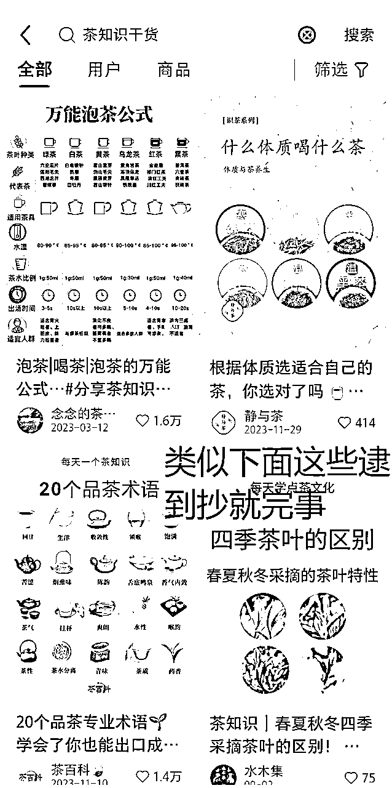

毕竟投放是真金白银烧出去钱，这样操作能少花点钱，还能给账号长点粉，自己看起来也舒服，还能顺便锻炼一下自己做内容的能力！

## （2）第二步，寻找可投流模板

这步非常关键，也是投流最最最关键的步骤所在，回顾我的这段经历，能做起来，最核心的地方就是通过深度剖析用户需求，做出来了一篇效果很好的笔记模板，然后一直投，期间也没干太多事情。

怎么找出可投流的模板呢？

如果你对用户的洞察力一般，也没什么太多做内容的经验，直接抄就完事，简单高效。

找出你的行业的其他人在投放的笔记，像下图这样，右下角有“赞助”字样的，就是在投放的，直接逮着抄就完事了，说起来简单，实际操作起来就更简单了。

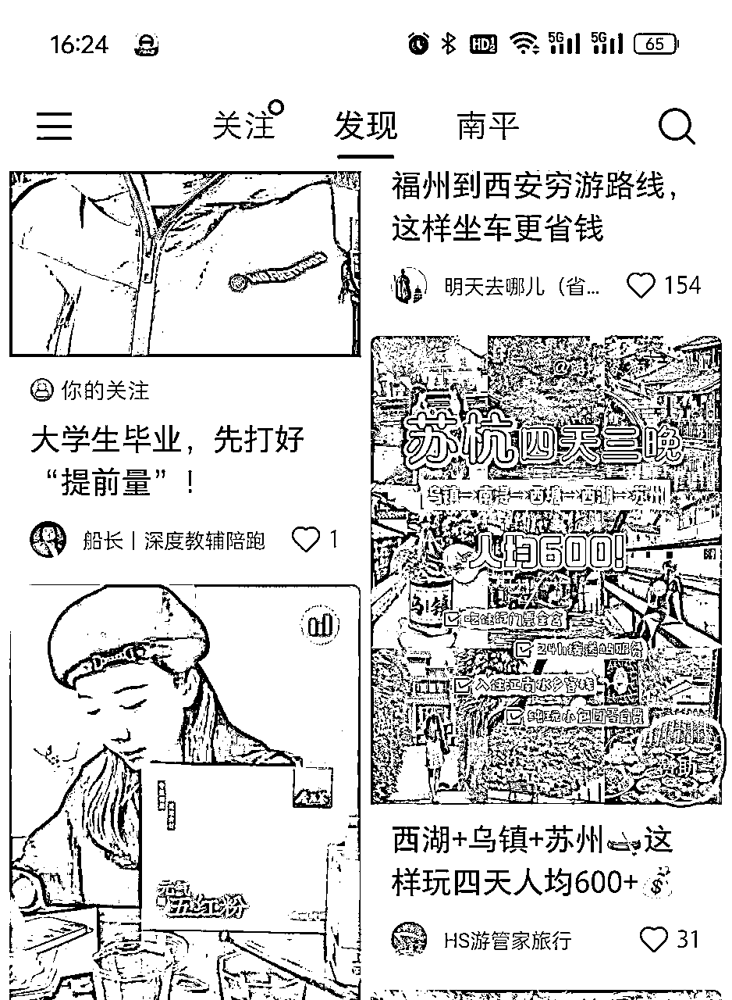

像这样的模板，多找几篇，逮着抄就行，不要有任何心理负担，互联网上做项目，大家都是相互模仿借鉴，只要你不是直接盗图，也不用担心违规，直接抄就完事了，这是成本最低，花时间最少，确定性最高的方式。

如果你对非常了解这个行业的用户，能准确洞察他们的需求点，自己做内容能力也比较强，可以“模仿并优化”。

可以直接复刻我当时的操作，去小红书、淘宝、抖音、视频号，所有行业相关的内容，只要数据好的，能看到用户提问、评价的地方，全部看了一遍，尽可能多的挖掘出用户关心的点。

然后再结合同行的笔记，去针对性直击用户最痛的地方，把同行的笔记再优化一遍，这样其实难度会比较高，还是直接抄来得快，效果立竿见影。

## （3）第三步，测试好的模板

通过前面两步，账户初步冷启动完成，积累了一些用户数据粉丝量，内容也准备好了，接下来就是去实战测试，到底哪些模板是好的？

有两种测试方式

### 第一种测模板的方式：

直接把笔记发出去，不投流，通过自然流去检验这个模板到底好不好，如果笔记发出去，单单是靠自然流就有人评论或者私信咨询，说明这个模板就还算不错，咨询得越多，说明模板越好。

这个时候直接聚光建计划投就行了，自然流就能产出客资的笔记模板，拿去投流，效果肯定不会差。而且自然流让笔记积累了一些用户数据，再去投放也更容易投起来。

这种方法就是需要花点时间，因为自然流数据起来本来就比较慢，加上近段时间，小红书流量起得更慢，不过没啥金钱成本，不需要通过花钱投放去测试，周期大概一周到一个月不等。

因为投放本质上是个放大器，就是把自然流跑得还不错的内容，花钱买流量，撬动更大的利益罢了。

### 第二种测模板的方式：

直接建计划就是投，懒得等自然流慢慢跑。

直接开投的话，笔记没有数据积累，得等聚光的计划自己慢慢去探索人群，所以前期基本上跑不正，做好前期亏钱建立模型的准备，时刻观察后台的投放数据，只要不是亏得太离谱，就让他一直跑。前期亏个几百块建模很正常。

1.  直接建聚光计划，每个计划放至少3篇笔记

1.  时刻关注投放的数据情况，只要不是亏得太离谱，它能跑出去，就让他一直跑，前面几天不要怕亏，怕的是跑不出去

1.  5－7天之后，观察各个笔记跑的数据，封面点击率＞8％的笔记算及格，可以留下接着投，封面点击率＞10％的笔记就非常不错，可以多建计划，重点投放

1.  剩下的，封面点击率＜8％的笔记就不用投了，数据已经说明了它们不太行

## （4）第四步，算ROI

客资投放不比电商，没法直观看到投产比是多少，所以在经过前面这几步，投放上道了之后，一定要算账，而且是要精细化地算账。

平均每个加到私域的客户聚光要花多少钱？平均每个加到私域的客户又能产生多大的利润？ROI一定要算清楚。

因为有很多人是真的不喜欢算账，大概看了一眼就感觉是赚的，一段时间后才发现都是在给平台打工，尤其是这种个体户，小团队，一定要算清楚。

## （5）第五步，持续测模板，持续投

就是循环前面几步，一直去寻找新的投放模板，然后测试这个模板。如果模板够用了，就不用去再找模板了。

天天就观察聚光后台的数据，时不时新建两条计划，保证每天的消耗量符合预期就行。

等到现有的模板跑不太出去量的时候，再去寻找新的模板来投。

# 六、从这段经历得到的感悟

## （1）抄，狠狠地抄！

找对标？模仿？借鉴？学习？以上这些词汇，全都是“抄”的同义词，很多小伙伴，总觉得“抄”是一件见不到人的事情。仔细想想，不局限在互联网，“抄”是不是遍布你的身边每个角落？

回顾我的这段项目经历，破局的点，就在于我抄了同行的两篇笔记，并且再根据自己对用户需求点的洞察，加以优化。因为“抄”才是确定性最高，成本又最低的方式。

“前车之鉴，后车之师”，本质不也是在抄？抄，不丢人，你不抄别人，别人也会来抄你的😊

抄到让对方觉得恶心，抄到让对方害怕你，时刻担心你会把他的流量抢完。能达到这个水平，就不存在做不起来的项目。

## （2）拥抱新事物

习惯呆在舒适区是人的天性，趋利避害。但是往往实现关键增长，指数级成长都是因为走出了舒适区，去拥抱了新事物。虽然新事物充满了不确定性，但是“风浪越大鱼越贵”。

## （3）学会借势

这个世界真的是个巨大的草台班子，那些看起来很牛逼的人，都是借助了势能后才起飞，人与人之间的差距没有多大。但是人+势能与人之间的差距就大了去了。

回顾这个项目，最关键的点就是借了聚光的势能，压根没做什么太多的事情就跑起来了。

一定要学会借势，借平台的势，借工具的势，借项目的势，借大哥的势！

## （4）尽量呆在大城市

小地方的信息闭塞，很难接触到新的关键信息，而且可调用的资源也少，比如，想找个合适的人来做直播都不是一件容易的事情。很多事情的推动都会收到客观因素的影响，然后就慢慢不了了之了。

写到这儿也就差不多了，希望对你有帮助呀～

可以的话，可以帮我点个赞，谢谢你的鼓励！