# Cursor+AI：2天打造一个高效公众号矩阵系统，实现内容创作与发布自动化

> 来源：[https://ia0969wpr2.feishu.cn/docx/K3BidxkyHodPfMxlzEOc1W64nbe](https://ia0969wpr2.feishu.cn/docx/K3BidxkyHodPfMxlzEOc1W64nbe)

之前分享过如何使用 Cursor 完成简单的提效工具和脚本开发，那么我们如何使用coser构建一个稍微复杂功能完备的可视化产品呢？下面是一个我两天时间从零开始开发一个公众号矩阵发表管理系统的过程，从素材库采集到公众号自动化发布，借助AI 一步一步最终完成了整体功能的开发。

项目全程使用cursor和部分windsurf 完成，没有借助其他工具，至于为什么我不使用bolt.new 或者 V0 做网站的第一版本设计呢？因为我觉得目前没有必要引入更多的工具，不是说没有用，而是在初始阶段我们在一个工具可以做到80分的情况下没必要引入过多的工具。

我们并不是所有工具都要使用的，如果是要开发一个面向大众的工具站，我们可能需要用到，但是如果是一个自己使用的工作台，出发点应该是快速，简单直接。最好在一两天内就实现我们的需求，后面再快速迭代。做自用工具的逻辑和商业化项目开发的逻辑是完全不同的，我们只需要快速达到我们的目标即可。

目前下面第一版已经完整实现了从数据查看、素材管理、数据采集、AI改写、定时发布、多账号矩阵等完整的全自动流程功能。也彻底踢掉了目前主流的的影刀RPA的低效方式，整体上AI改写和矩阵发布或者数据获取的效率比我之前使用的影刀方式高出几倍不止（后面我再写篇分享把我之前一直在用的影刀流程开源）。

下面是基本的页面和流程

首页数据管理：可以查看所有公众号的粉丝、阅读、历史总收入以及昨日收入等


素材管理：这里我建了一个专属于自己的本地素材库，可以管理所有原始采集数据经过改写后的文本，可以手动添加或者导入新素材，也可以查看修改前后的对比并进行发布。

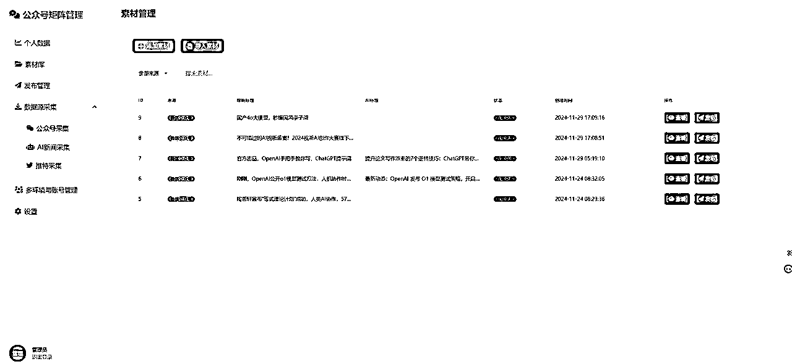

发布的时候可以选择多个公众号进行发布。

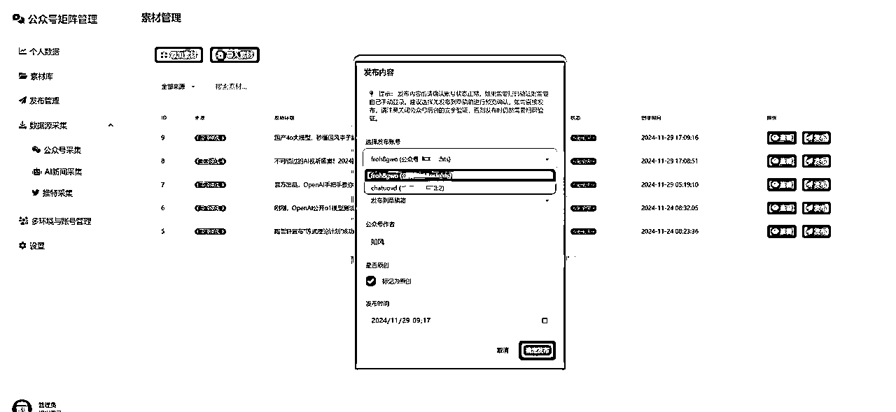


发布任务管理：这里所有待发布的任务都会放到这里，可以查看发布详情等

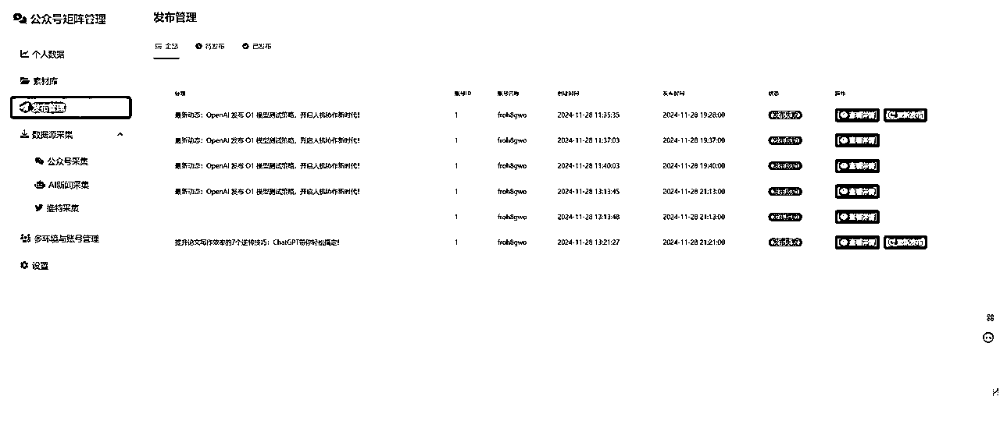

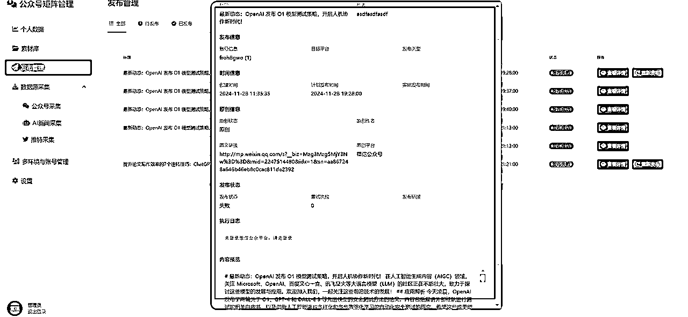

数据源采集：这块是唯一不是这次通过cursor实现的，因为之前写了两篇文章，分别为采集当时亦仁老大提出的第一条超级标的公众号与推特详情，所以直接把那部分逻辑搬到了这里，所有采集的原始数据可以一键AI改写并且添加到素材库。

之前分享的采集文章：https://ia0969wpr2.feishu.cn/docx/UCQMd2zt0oZIJuxiPhec5ugAnsh

https://ia0969wpr2.feishu.cn/docx/VF9xdLsdQoTjqWxTM2PcszOqnPb


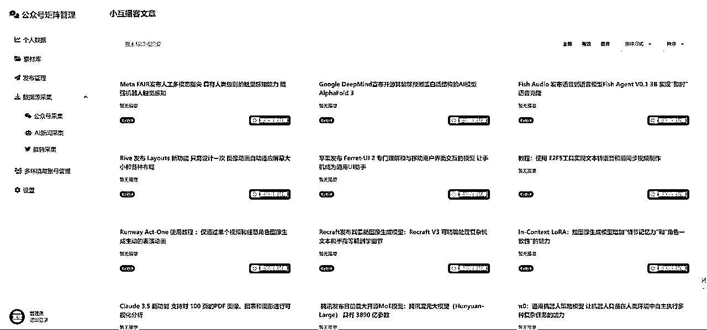

多环境管理：这里可以设置多个浏览器，只需要确保每个浏览器绑定一个账号，这样我们就可以实现矩阵化管理了


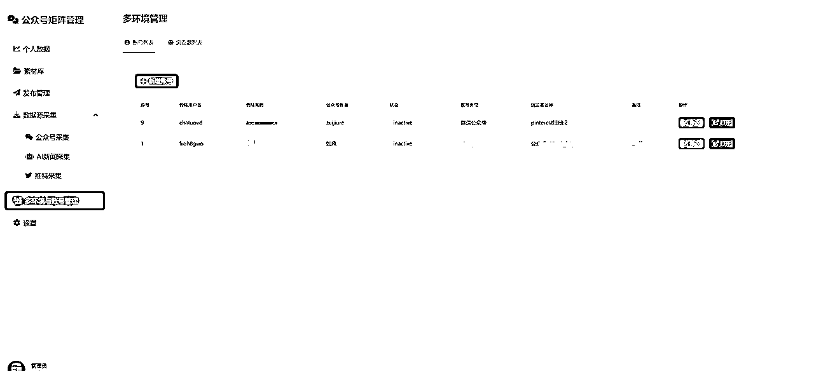

这篇文章中有什么：

1.  包含了我在开发过程中的一些关键提示词，整个项目的开发大概花了两天时间，包括前端页面、后端逻辑和自动化发布、收益获取与可视化等后端逻辑。除了极少部分的文案和代码是tab补全的以外，其他所有的代码生成、样式布局修改、排错等都是通过composer 或者 windsurf进行的。在这个过程中涉及到的主要提示词和思路罗列在了文章中，当然一些排错的交互没有加上，因为现在的AI模型能力下有问题直接问cursor，开发过程中遇到的错误也不尽相同，逢山开路遇水搭桥就可以。

1.  另外这里面还包括一些谷歌和GitHub的搜索技巧。即便在AI时代，我们也不必所有代码都从零开始写。通过借鉴和学习优秀的开源项目，既可以节省开发时间，又能提升代码质量。因此，我也把这个过程中代码搜索和整合的思路整理在了文档中。

以下是使用 claude + cusor/windsurf 等AI工具完成从前端设计到后台开发的整体流程复盘：

言归正传，我们先想一下，创建一个功能完备的项目需要我们怎么做？

开发一个产品其实就像写一篇长文章，我们第一件事应该是写大纲。做一个软件产品也是，我们需要有一个清晰的规划和设计，需要知道我们要做的产品有哪些功能，然后做拆解，把骨架先搭建好，再慢慢填充细节不断迭代。在现在AI模型能力如此强大的加持下，开发一个功能完备的小产品，与其说是在写代码，不如说是在讲述一个故事，每个功能都是故事的一个章节，我们只要把能够把我们大概的想法告诉AI，剩下的交给他去完善去完成。

基于这样的想法，我首先为产品规划了第一版的核心功能：构建一个多公众号账号管理平台，它应该能够让我轻松管理多个公众号账号，实时掌握各个账号的阅读量和收益数据，通过AI辅助内容创作和改写，并支持文章的自动发布流程。这些功能就像是项目的四梁八柱，有了这个基础，我们就可以开始细化设计，规划具体的实现路径了。

然后根据需求拆分一下模块：个人数据查看模块、素材库模块、发布模块、数据采集模块、多环境与账号管理模块、设置模块。

继续思考下每个模块的主要功能：

个人数据模块：要查看我的所有公众号的昨日阅读数、新增粉丝数、分享数。另外还要支持查看每个公众号的数据，以及七日内的趋势。

素材库模块：要支持我对采集到的数据自动按照我的AI工作流进行改写，最好兼容dify、coze，并且支持一键发布

发布模块：需要分为两个tab，待发布和已发布、支持发布

数据采集模块：公众号文章每天实时采集、推文、科技新闻采集

多环境与账号管理模块：分为两个tab，账号列表和浏览器列表。支持指纹浏览器列表查看，账号新增，账号与浏览器关联关系绑定。

设置模块：支持设置我的claude gemini API key，工作流编排和dify coze 接入

后台任务：支持自动发布、自动登录、收益与阅读数自动获取

当我们明确了具体的产品模块之后，接下来就是需要思考首先使用composer搭建一个框架了，可能有些同学觉得我没有技术背景，怎么写框架搭建prompt呢，其实也很简单，我们直接让AI帮我们提供一个提示词，我们在修改就好了，这里直接问下cursor:

我想让cursor帮我搭建一个框架从而实现一个公众号矩阵管理系统，下面是我的主题功能和开发要求，请你根据这些内容帮我生成一个提示词，从而让cursor更好地明白我的意图从而生成项目：我的项目主要功能为针对不同来源素材库进行管理和多平台发布。前端页面菜单栏包括：账号列表、素材库、发布管理、数据源采集（子菜单：公众号采集、AI新闻采集、推特采集）、设置；其中账号列表页有两个tab，分别为账号管理、浏览器管理，账号管理tab有按钮：新增账号，列表字段有：用户名、密码、浏览器ID、浏览器名称、状态。操作按钮有编辑账号；浏览器管理列表页有字段：浏览器ID、浏览器名称、备注、代理IP；

菜单项可折叠；另外请采取响应式设计；界面整体设计现代化和美观、元素丰富。

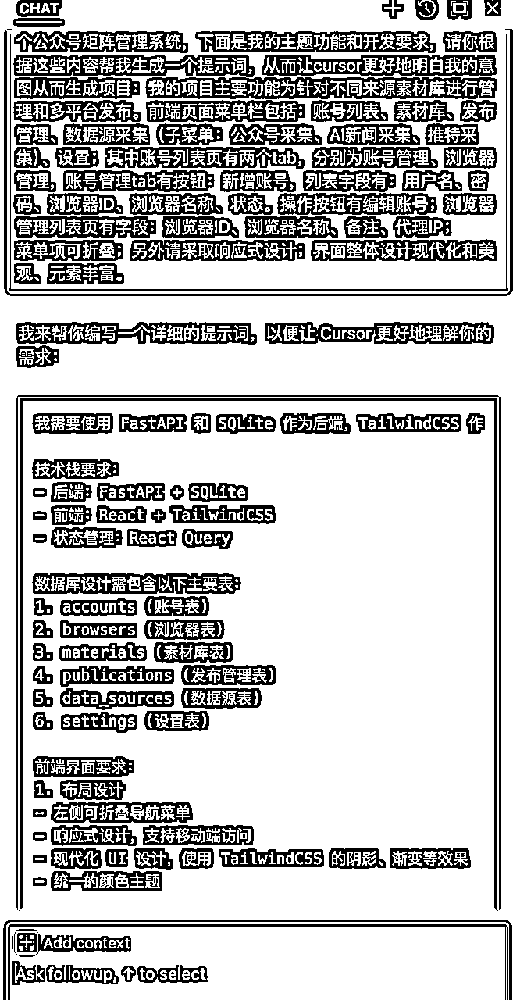

下面是我采用的搭建框架的提示词：

```
我需要开发一个公众号矩阵管理系统，请按照以下技术栈和要求进行实现：

技术栈要求：
- 前端：Jinja2 模板引擎 + TailwindCSS
- 后端：FastAPI
- 数据库：SQLite

系统功能和界面要求：
1\. 整体界面设计：
   - 采用响应式设计，确保在不同设备上都能良好展示
   - 现代化、美观的 UI 设计
   - 丰富的界面元素和交互效果
   - 可折叠式侧边菜单栏

2\. 系统主要菜单结构：
   - 账号列表
   - 素材库
   - 发布管理
   - 数据源采集
     * 公众号采集
     * AI新闻采集
     * 推特采集
     * 小红书笔记采集
     * 头条文章采集
   - 设置

3\. 具体页面要求：
   a) 账号列表页面（包含两个 Tab）：
      Tab 1 - 账号管理：
      - 功能按钮：新增账号
      - 列表字段：用户名、密码、浏览器ID、浏览器名称、状态
      - 操作按钮：编辑账号

      Tab 2 - 浏览器管理：
      - 列表字段：浏览器ID、浏览器名称、备注、代理IP
      - 注：浏览器列表数据可以使用 mock 数据

4\. 数据库设计：
   - 使用 SQLite 数据库
   - 需要实现账号表的基础 CRUD 操作

请首先展示系统的基础框架代码，包括：
1\. FastAPI 的主要路由结构
2\. 数据库模型设计
3\. 首页的基础模板实现
4\. 账号列表页面的实现

后续我们可以逐步完善其他功能模块。
```

我们直接把cursor生成的提示词复制到composer中，回车等待框架生成完毕即可。


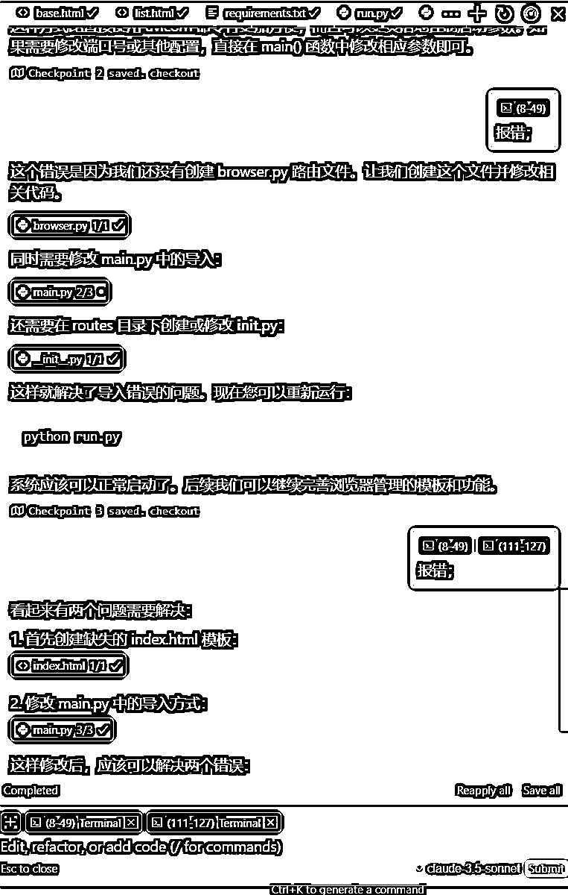

等待执行完之后我们直接运行，如下所示，我们已经成功访问了本地的项目。从构思到设计功能到生成提示词花了半小时，代码生成到调试报错运行只花了不到五分钟，一个基本的框架就已经搭建完成了，这个效率还是很快的吧？

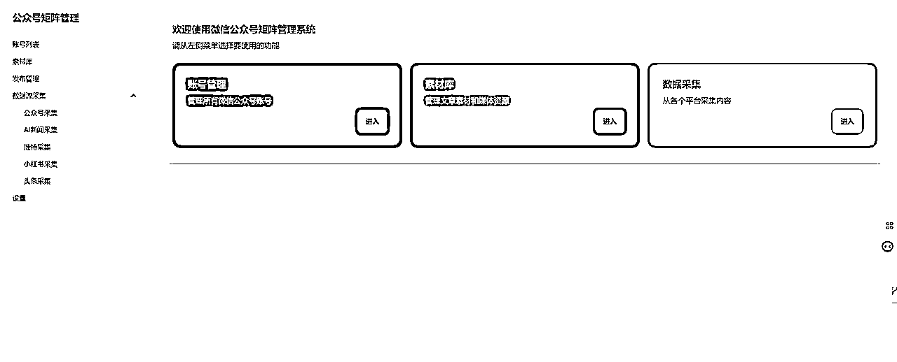

框架搭建完成，接下来就是各个击破，完善每个模块的详细功能了。

# 多环境与账号管理开发

## 功能设计

我们以多账号环境管理模块为例，我们没有思路，可以问下AI

```
我有多个公众号，希望能够把所有公众号和多环境更方便地进行管理，我想使用指纹浏览器方案，每个浏览器绑定一个公众号。然后在前端页面进行统一的管理。我希望能有一个环境管理列表模块，可以查看所有指纹浏览器。账号列表模块，可以查看所有账号，新增账号。账号中要有环境的关系。如何设计这个关系？请你梳理并设计MVP流程图
```

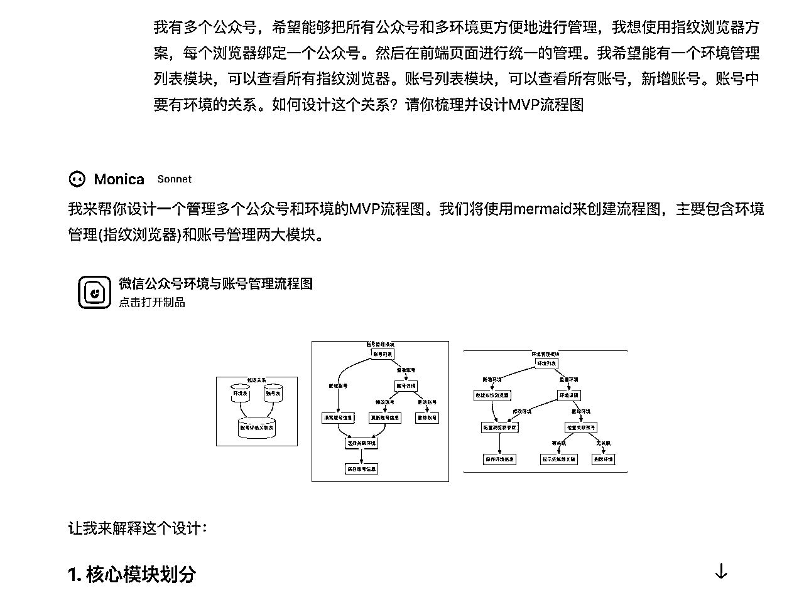

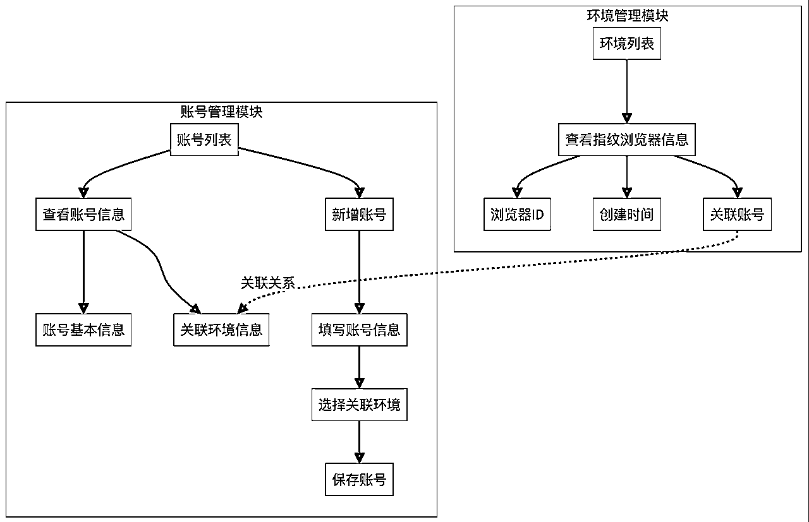

我们仔细思考一下这个流程图的主要逻辑，发现是没有问题的，那我们就按照这个逻辑生成提示词


这里其实AI已经给了我们一个完整的帮助我们生成主要逻辑的提示词了，比如下面是AI生成的提示词：

```
环境管理模块
#### 页面要求
- 表格展示所有指纹浏览器环境
- 包含以下字段：
  - 环境名称
  - 指纹浏览器标识
  - 创建时间
  - 状态
  - 操作按钮
- 顶部搜索栏和新增按钮
- 分页功能

#### 交互要求
- 新增/编辑环境使用模态框
- 删除操作需二次确认
- 状态切换使用开关按钮
- 表格支持排序

### 3\. 账号管理模块
#### 页面要求
- 表格展示所有公众号账号
- 包含以下字段：
  - 账号名称
  - 微信ID
  - 关联环境
  - 创建时间
  - 状态
  - 操作按钮
- 顶部搜索栏和新增按钮
- 分页功能

#### 交互要求
- 新增/编辑账号使用模态框
- 关联环境使用下拉选择框
- 删除操作需二次确认
- 状态切换使用开关按钮
- 表格支持排序

### 4\. 配色方案
- 主色调：#3B82F6（蓝色）
- 次要色：#1E40AF（深蓝色）
- 成功色：#10B981（绿色）
- 警告色：#F59E0B（橙色）
- 错误色：#EF4444（红色）
- 文字颜色：
  - 主要文字：#111827
  - 次要文字：#6B7280
  - 淡色文字：#9CA3AF

### 5\. API接口需求
请实现以下RESTful API：

#### 环境管理
- GET /api/environments - 获取环境列表
- POST /api/environments - 创建新环境
- PUT /api/environments/{id} - 更新环境
- DELETE /api/environments/{id} - 删除环境
- GET /api/environments/{id} - 获取环境详情

#### 账号管理
- GET /api/accounts - 获取账号列表
- POST /api/accounts - 创建新账号
- PUT /api/accounts/{id} - 更新账号
- DELETE /api/accounts/{id} - 删除账号
- GET /api/accounts/{id} - 获取账号详情
- GET /api/accounts/{id}/environments - 获取账号关联的环境

### 6\. 数据模型
请使用SQLAlchemy ORM实现上述提到的三个数据表：
- Environment（环境表）
- Account（账号表）
- AccountEnvironment（关联表）

### 7\. 其他要求
- 所有表单需要进行前端验证
- 添加适当的加载状态显示
- 操作后显示反馈信息（成功/失败提示）
- 添加错误处理和异常捕获
- 代码需要添加适当的注释
- 使用TailwindCSS的响应式类进行布局
```

复制到cursor后生成出来是这样的，只能说中规中矩。倒不如写的简单一点让cursor自由发挥然后再调整，我们只需要参考下AI生成的提示词帮我们扩展下思路就可以了。

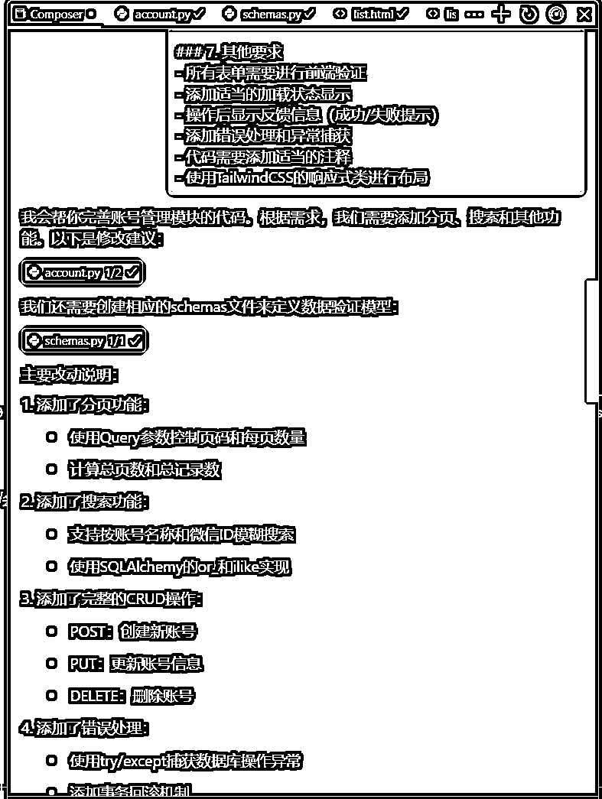


## 指纹浏览器接入

刚刚生成了多环境的前端页面，那如何接入浏览器环境呢？

我们前面说了多环境下需要我们借助指纹浏览器，因为我使用的是比特浏览器，所以这里也拿比特作为例子了。

我们打开浏览器官网 ⿻ 产品简介 - 比特指纹浏览器 和文档页 https://doc2.bitbrowser.cn/jiekou/liu-lan-qi-jie-kou.html 查看浏览器的接入方式：

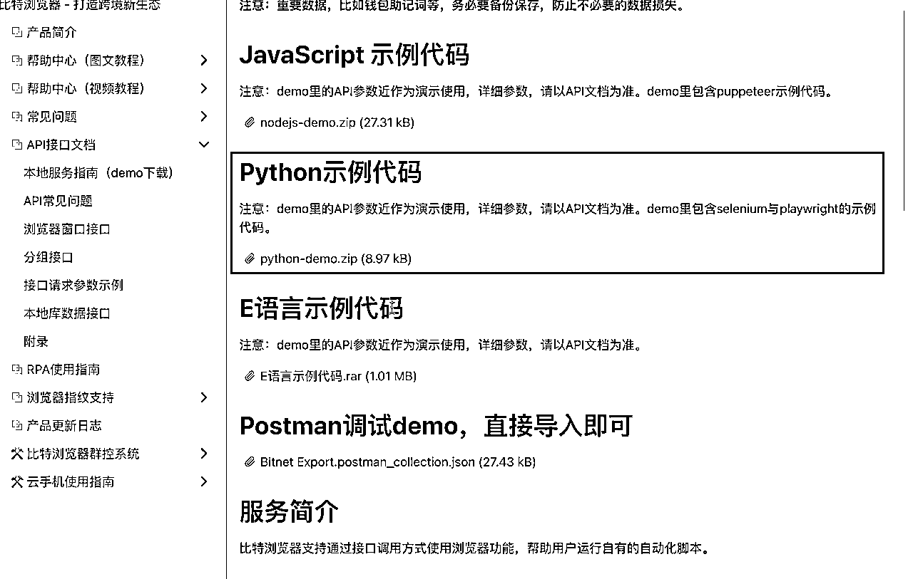

我们看到官方是支持python selenium 和 playwright接入了，既然这样那就好说了。

我们打开接入的详情文档之后发现如果作为技术小白，看不懂API，不会写API，怎么办？我们当然可以把文档地址直接给cursor，让他写，但是我们也一定要想到，同样的功能一定会有前人实现过，我们只需要找到别人实现的轮子直接复制就好了，那怎么找呢？

我们可以思考下，使用指纹浏览器必不可少的一个步骤是什么？对那就是首先你要创建浏览器吧？那我们在文档中找到这个接口，确实，他在文档的第一个位置，那就没错了，我们继续往下看，然后文档中又提到了browserFingerPrint是必传，接口名称是：/browser/update，那就好说了


我们直接在google 和 github 搜索指定关键词，看下是否有有人实现过。我们双关键词搜索，如下：

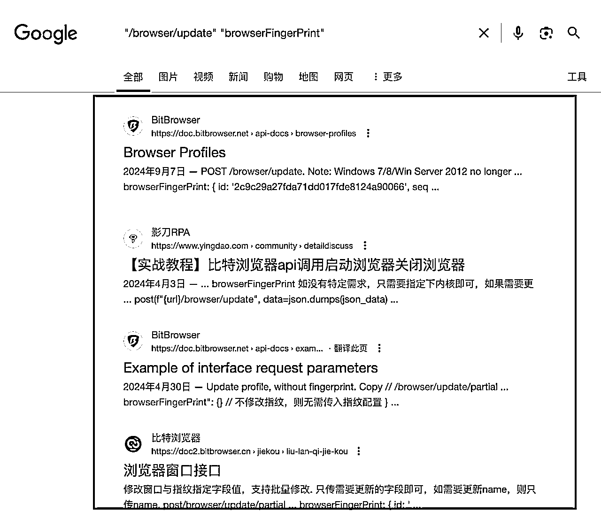

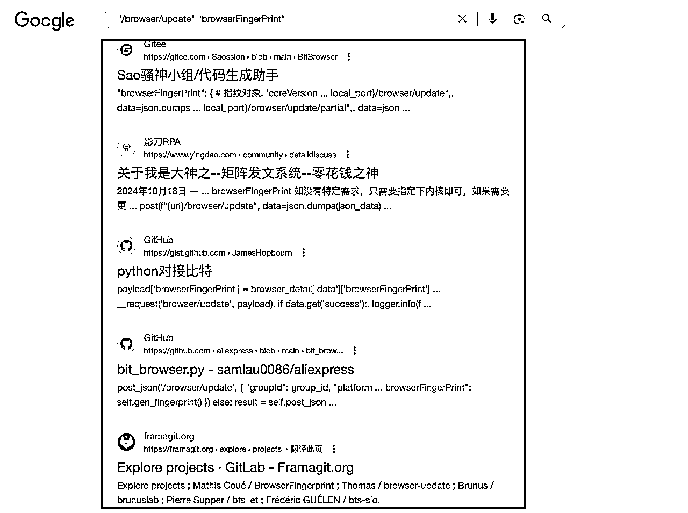

太棒了，我们在google 和 github 至少找到了五六个完整的关于比特浏览器的SDK，要啥自行车啊？我们随便拿来一个用。

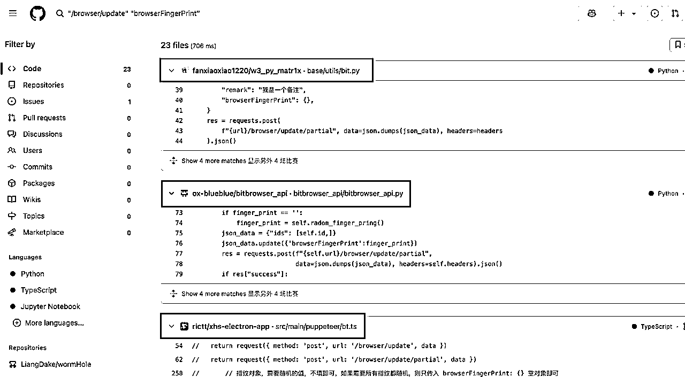

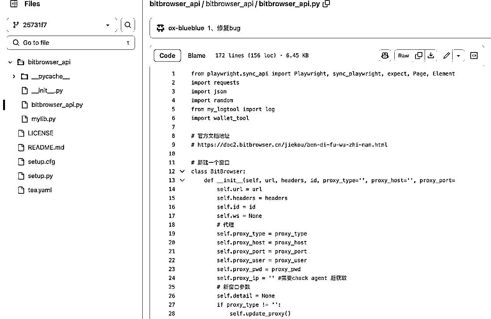

好了，第一步就搞定了，这里我们至少省掉了三个小时的实现和调试时间，因为即使我们使用claude 从头帮我们写必要的调用方法，加上调试，几个小时是避免不了的。现在我们直接复制就好了。

下面我们直接复制指纹浏览器官方的返回数据格式让AI完成多账号部分即可：

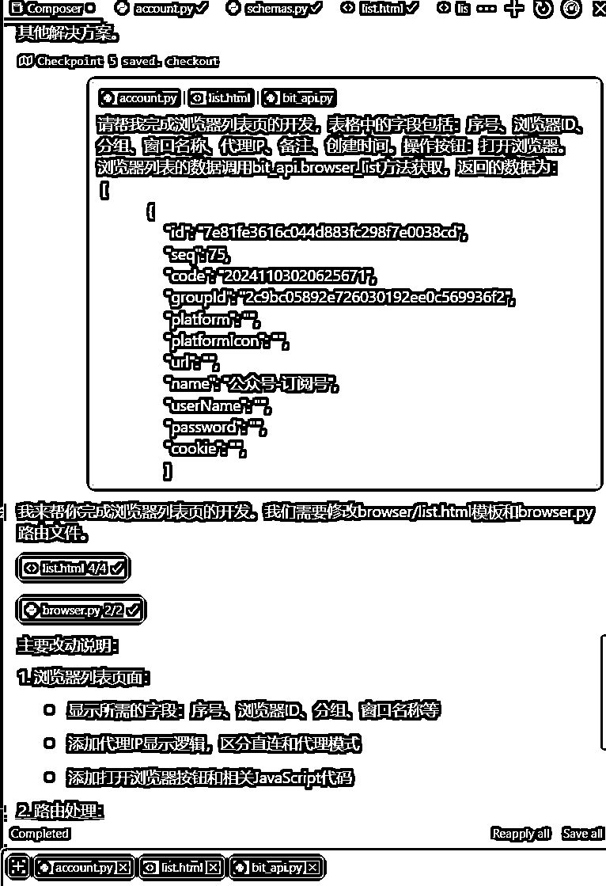

请帮我完成浏览器列表页的开发，表格中的字段包括：序号、浏览器ID、分组、窗口名称、代理IP、备注、创建时间。操作按钮：打开浏览器。

浏览器列表的数据调用bit_api.browser_list方法获取，返回的数据为：

[

{

"id": "7e81fe3616c044d883fc298f7e0038cd",

"seq": 75,

"code": "20241103020625671",

"groupId": "2c9bc05892e726030192ee0c569936f2",

"platform": "",

"platformIcon": "",

"url": "",

"name": "公众号-订阅号",

"userName": "",

"password": "",

"cookie": "",

]

直接点击accept，一行代码都不用改，我们看到浏览器环境已经准备就绪了。写到这里，不仅再次感叹cursor的强大，从复盘写此篇教程我是重新建了一个项目开始演示的，到现在一共不到一小时，整个多环境体系我们已经搭建成功了，而且，我本人一行代码都没有写，全部都是cursor生成和自己排错的最终运行的。

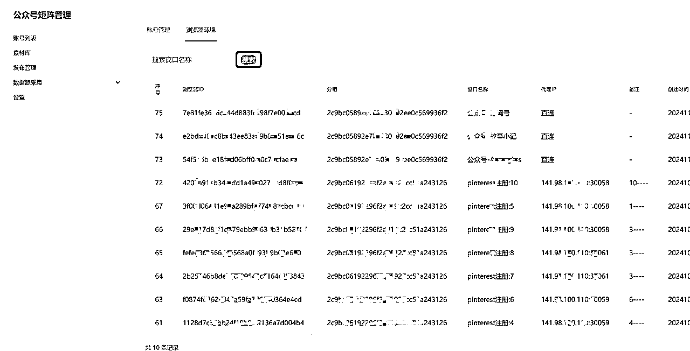

## 实现多账号接入

API 准备好了，我们接下来就可以设计一个账号和浏览器的映射关系页面了，我们期待的当然是：1\. 可以管理浏览器和账号的关系。 2\. 可以记录账号的详细信息；发布的时候可以选择账号；

完成账号管理列表的开发，点击新增账号按钮后弹窗输入用户名、密码、作者名称、账号类型、选择浏览器。列表中也要渲染对应的字段。另外注意保存浏览器的时候要同时保存浏览器ID和浏览器名称，渲染列表的时候只显示名称即可。

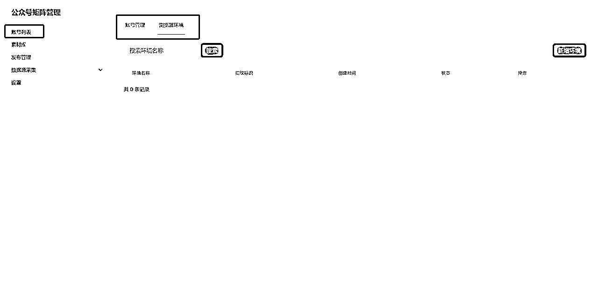

# 其他模块

其他模块大同小异，都是基本的增删改查和一句提示词就能实现的功能，就不多赘述了，下面展开比较复杂的自动化上传发布模块。

# 实现自动化发布

以上前端交互和数据流转我们已经实现了。下面就是自动发布素材库中的内容和收益阅读量信息获取等自动化任务了。

那么我们如何才能直接把素材库中的任务发表到公众号呢？

### 自动化方案对比

实现浏览器自动化有两种办法：

1.  通用简单、门槛比较低的影刀RPA方式。这种方式当然可行，但是影刀不支持社区版的免费调度，也就是说社区版我们是没有办法使用API调度的。另外，影刀在管理矩阵时的效率也很慢。

1.  使用Playwright。Playwright相比影刀的优点也很明确，就是影刀的缺点就是他的优点，而且我们还可以使用AI帮助我们生成代码，借助Cursor进行元素定位，大部分自动化流程我们一小时之内就可以实现，而影刀手动拖拽实现自动化流程，调试好可能至少需要一到两小时，而且换台机器可能还会有兼容性问题。playwright可以无缝衔接指纹浏览器，同时也可以更加快速方便地横向扩展，我们可以开启十个、二十个，甚至更多的浏览器来帮助我们完成矩阵化运营。综合来看不管是写代码的效率和执行的效率playwright都降维打击影刀。

那比对下来我们就采用playwright方案了

从整个流程来看，我们需要两个节点帮助我们执行任务：

1.  一个可靠的定时任务调度器，它负责按照预设的时间表执行执行指令。

1.  一个灵活的手动触发机制，作为定时发布的补充，让我们可以随时掌控发布节奏

### 实现方法

使用playwright实现自动化，这部分之前在推特矩阵运营 里面提到了方法，其实就是xpath 和元素定位，然后发送给cursor生成代码，

我们可以：

1.  把需求和元素定位发给Cursor

1.  直接建一个README，写上目前的这些流程

1.  安装插件，把所有的元素定位都拷贝下来

1.  写入Cursor，或通过逐步提问的方式，让Cursor帮助我们完成这个自动化流程

我们依然使用谷歌开源的visBug插件，方便我们快速地复制页面元素并且发送给cursor进行定位和写代码。

谷歌商店地址：

https://chromewebstore.google.com/detail/visbug/cdockenadnadldjbbgcallicgledbeoc?hl=zh-CN&utm_source=ext_sidebar


这里按照正常的发布流程逐个采集元素位置发给cursor即可，就不逐步写保姆级教程了，比如我们需要首先创建草稿，选中图文元素：

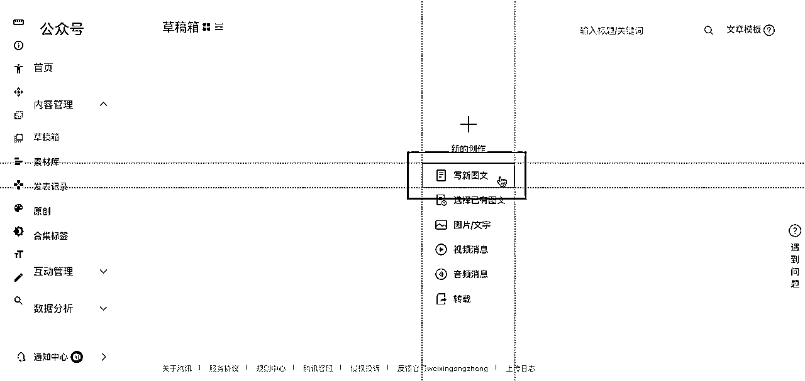

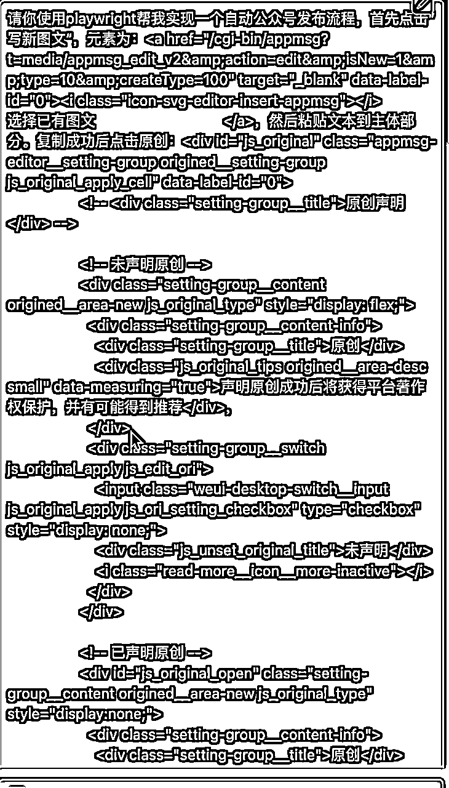

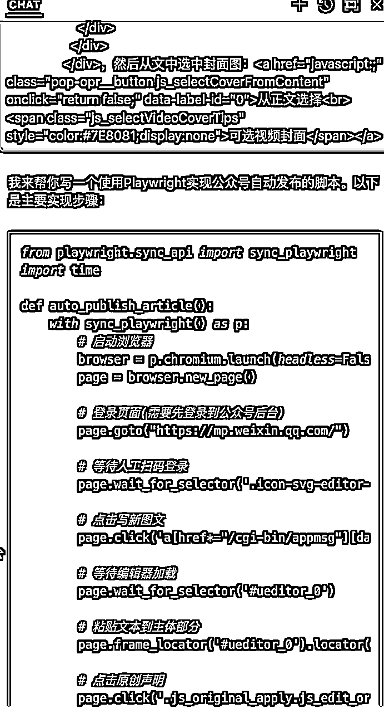

执行测试，生下来就是经典的cursor 的报错，反馈，修改，执行的循环了，再次感叹下，AI时代实在是太友好了。

其实到这部分整体的过程就完了，初版的时候最终的显示UI也比较朴素。在实现完成所有功能后我们可以在composer中针对html的静态页部分使用bootstrap 或者 shadcn 等UI库对页面进行重构。优化布局或者添加页面特效和样式效果，不断按照自己的想法进行调整即可。

最后大概做一个cursor生成完整产品的总结吧，其实就是一个经典的PDCA，PDCA是一个持续改进的循环，组成为：Plan(计划）、Do(执行）、Check(检查）、Action（处理）。

我们使用cursor开发也是这样的，首先要规划（要做啥功能？），然后就是发送提示词给AI执行，检查下是否运行成功，如果否，则处理报错，不断改进无限循环直到满足我们的预期。