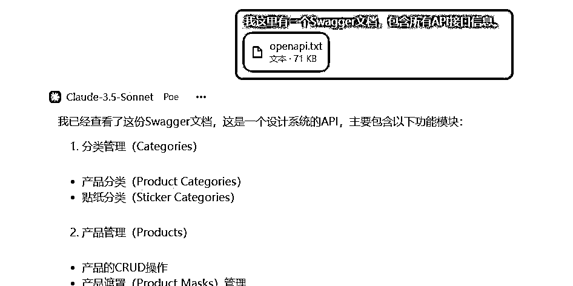
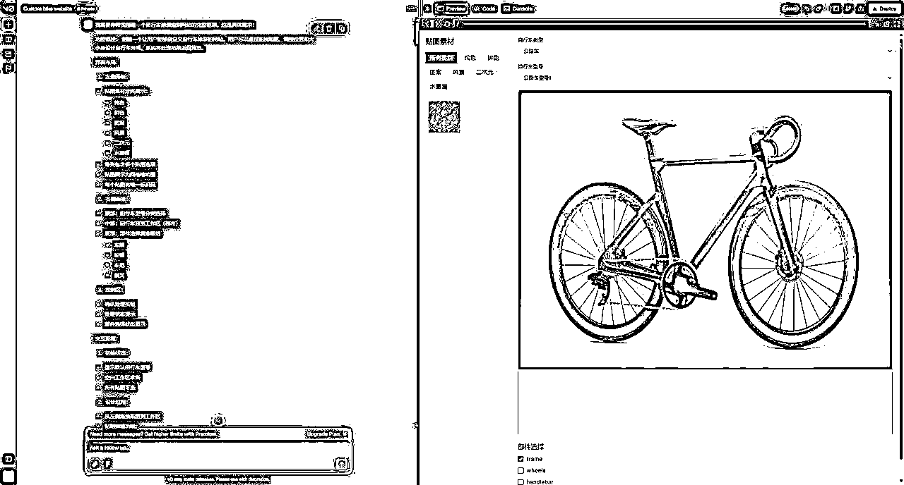
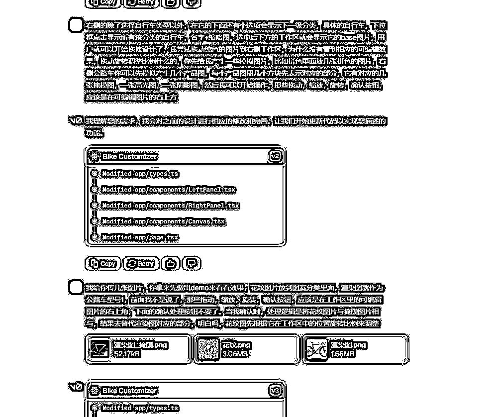
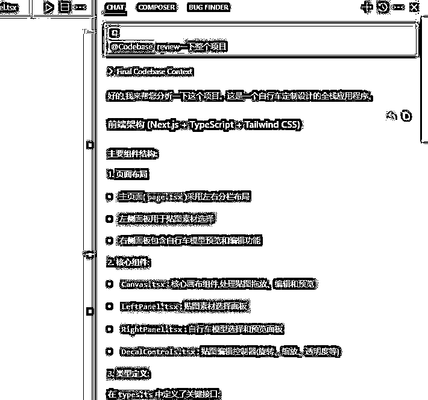
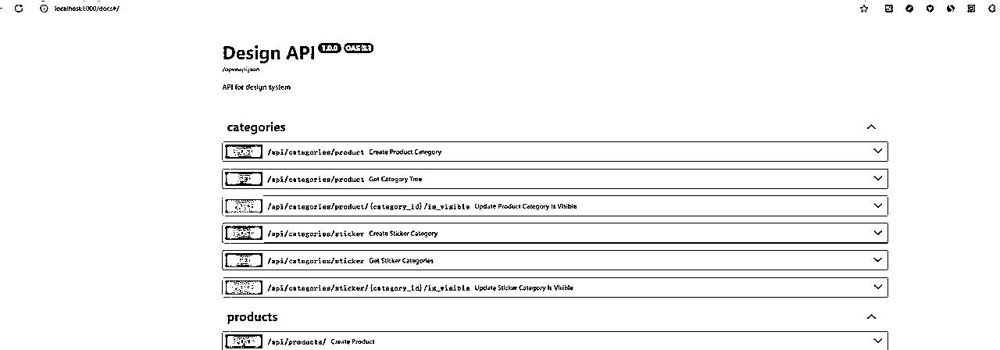
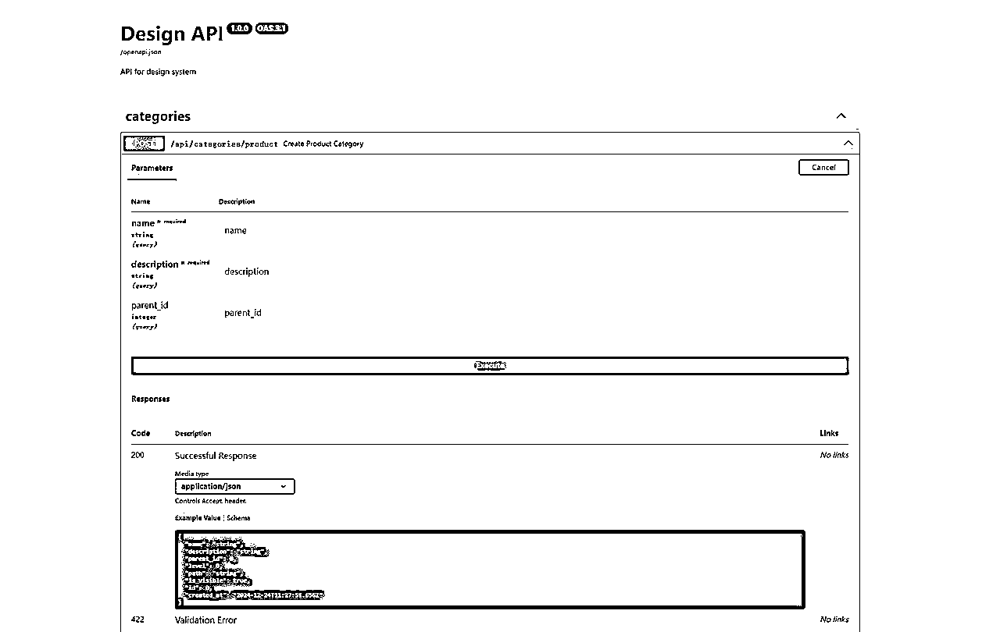
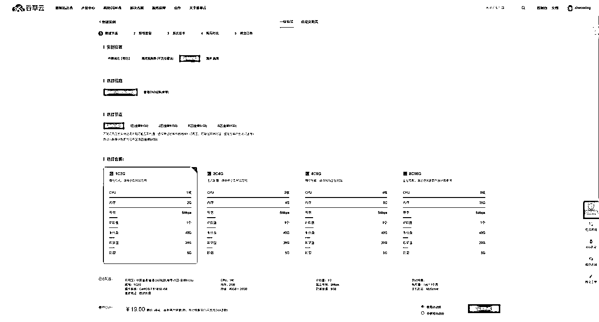

# 从0到1：我完成并上线部署了一个网站

> 来源：[https://wqm8iq5gs4a.feishu.cn/docx/K8qldQkFMoXZ2VxlwbuceE5Mnhh](https://wqm8iq5gs4a.feishu.cn/docx/K8qldQkFMoXZ2VxlwbuceE5Mnhh)

两周前，我还是个纯小白，对React、Next.js、PostgreSQL、FastAPI一无所知，也不懂如何在服务器上部署一个全栈网站。而今天，我已经完成了人生第一个全栈项目并上线部署。虽然目前用户寥寥，但这次经历让我在开发构建之路上迈出了重要的一步。

整个开发过程对我而言可以说是一段探索之旅。从使用v0设计前端界面原型，到借助Cursor开发后端代码；从与Claude AI不断探讨技术细节，到在本地成功运行项目；从购买域名、租用服务器，到使用Docker部署完整的网站架构（包含前端、后端、数据库、Nginx等多个容器）。不过现在觉得使用Supabase处理数据库或通过Netlify部署还是更为便捷，虽然自主部署带来的自由度和掌控感是无可替代的。我是想着后面可能做一些更复杂的东西，就抱着晚学不如早学的态度去研究了一下。部署上花的时间最多，但是确确实实收获了很多。

也是看了小排老师的文章，就把最核心的功能先做了，什么用户认证，什么图片CDN，统统先不做，先把整个项目跑通起来。开发过程中虽然遇到了不少挑战，但在AI助手的帮助下，这些问题都变得不再困难。希望我的经历能为其他正在起步的新手开发者提供一些参考和启发，感觉非必要尽量还是不要选择自己去直接面对服务器，过程有问题的话很痛苦，像来来老师分享的那样，通过netlify去部署，会方便得多。

贴一下我的作品的访问地址：https://duckpainting.com/，目前目前只有电脑访问才正常，还没做自适应适配，就放了一个自行车一个手机壳定制上去，用法很简单，图片拖上去，调整位置，点击确定就行。

在这里感谢这次航海的小红书航海活动的木木教练、十月领队老师、志愿者星星以及群里分享经验的各位大佬。这次航海虽然没能完全践行所有任务，但我坚持分享了一些关于使用Cursor开发的图文内容，因为自己也一直在用，正好做点内容发小红书，涨了几十个粉丝，也渐渐找到了了一点内容创作的感觉。现在每次创作前，都会自然而然地去找对标去模仿了，也不会考虑那么多了，发了再说，管它有没有人看。第一次航海，也算是完成了开始的目标，就是走完这期航海。

当时没报cursor的航海，想着后面看下手册应该就差不多，也许去参加下能少走很多弯路的。

下面开始正题，写的很乱很糙，还望理解：

## 1\. Claude支持

在项目开发过程中，我主要依赖两大AI工具：Cursor和Claude。虽然Cursor本质上也是基于Claude。claude在代码开发和理解方面的表现确实优于ChatGPT。

Claude使用体验

*   官方版Claude：上下文容量较小，即便是付费会员，文件处理能力也比较有限

*   Poe平台的Claude：表现不错，上下文容量更大，特别是200K版本，用了这么久，没有超过上下文限制的，不知道这个平台上面的是不是阉割版的，不过用起来还行

*   Claude独享号：因为一直续费的chatgpt，就找了找有没有便宜点的claude号，发现闲鱼可以半价购入，100万积分完全够用，性价比很高

几个对话分工合作

分为四个主要对话方向：

项目经理交流，前端开发交流，后端开发交流，全栈部署指导

主要使用Claude 3.5模型，需要处理大量文件时则切换到Claude 3.5-200K版本，从未遇到过上下文限制的问题。




开发经验总结

1.  Cursor的局限性

*   随着项目代码量增加，Cursor的表现会有所下降

*   需要通过详细的文档记录和合理的CursorRule配置来优化使用效果

*   建议把控项目全局，不能完全依赖AI辅助，开发的时候可以让它给你讲讲基本的东西

1.  基础知识的重要性 理解项目架构的关键要素对开发效率有提升，比如Next.js的项目结构设计原理，各个文件的功能和作用，参数传递机制，前后端交互流程，这些多问问claude，让它讲给你听稍微理解下就好。

在不断debug过程中也会一点点学习关于用的这个框架或者语言的基本知识，形成对项目的整体认知，这样才能更好地把控开发方向，高效地利用AI助手提供的支持。

## 2\. 前端界面设计（v0）

我选择了Vercel推出的V0作为前端页面开发的主要工具。开了一个月的会员，它在前端界面制作方面的表现令人印象深刻。本来它给我做了很多页面，主页啊，各种跳转，后面想了想最小化可行性产品MVP，都砍了，就保留那个最主要的界面，很简单，其实cursor也可以直接做的，不用上v0

开发流程

1.  需求分析与规划

首先与Claude进行产品需求讨论，让AI协助整理和优化需求文档，将明确的需求转化为可执行的开发计划

1.  V0代码生成

将整理好的需求提交给V0，要求生成完整的前端代码

特别注意代码组织方式：

*   避免单文件代码过长

*   合理拆分组件

*   保持代码结构清晰





1.  交互式优化

利用V0的实时预览功能，根据效果及时调整和修改，反复迭代直到达到预期效果

1.  代码导出注意事项

*   推荐使用V0提供的代码下载功能

*   压缩包下载方式我试过有些问题（可能导致文件重复和结构混乱）

*   仔细检查导出代码的完整性和正确性


执行这条命令之前需要下载安装nodejs，Node.js 官方下载地址：

https://nodejs.org/zh-cn/download/，装完npm也会自动安装

在任何一步操作，碰到什么问题都可以问一下claude等模型

## 3\. 后端开发（Cursor辅助）

Git版本控制

*   即使不打算上传到GitHub，也建议使用Git进行本地版本控制，预防Cursor可能导致代码改的面目全非

*   关键时间点的代码提交建议：

新功能实现后，Bug修复完成后，确认代码运行正常时

*   Git的安装和使用可以咨询Claude或ChatGPT

项目结构管理

1.  目录组织，一个总目录，下面放前端目录，后端目录，后面部署还有些别的文件

1.  使用Cursor进行开发

*   打开代码所在文件夹

*   使用@codebase命令让Cursor理解整个项目



*   向Cursor提供关键信息：

*   数据库设计方案

*   API接口设计

*   业务逻辑需求

1.  后端开发流程

*   让Cursor协助搭建后端框架

*   启动后端服务（通常在localhost:8000）

*   通过FastAPI的交互式文档（localhost:8000/docs）测试接口：

*   验证请求/响应是否正确

*   检查数据格式

*   测试各种场景





Cursor使用技巧

*   当项目变大时：

*   指定具体文件进行修改

*   使用代码块选择（Ctrl+K）精确定位

*   避免一次性修改过多代码

*   保持与Cursor的有效沟通：

*   提供清晰的错误信息

*   明确指出需要修改的部分

*   及时反馈修改结果

## 4\. Debug历程

我也没有什么太多的经验，就多问，反复问，有错误或者不满意就给cursor疯狂发问让它改。

要注意，每次accept的时候看一眼它到底改了什么，因为有时候cursor会莫名其妙把你的一大段代码给删了，如果无脑删掉了没发现，后面够你排查的，所以时刻记得用git提交，保证你能退回原来的版本。

每个月500条的fast提交够够的，说起这个我还是原价买的，其实闲鱼上三十多块钱就能买一个月的，悔

## 5\. 本地测试

启动后端


启动前端，一般在localhost:3000这个地址访问


然后你就可以先在本地测试一下功能正常不正常了，如果有报错，也把报错发给cursor或者claude，它们会告诉你怎么修改

## 6\. 基础设施搭建

买域名跟租服务器我一直用的是香草云的，不知道有没有更好的选择。香港线路（不用翻墙也能访问），之前买来练手linux，也部署过一个静态页面，那时候不知道什么是docker，七搞八搞部署完了倒是可以访问了，但是没搞明白什么原理

https://www.xiangcaoyun.com/

价格也还好，二十来块钱一个月，腾讯跟阿里以前也租过，好像要备案，比较麻烦。但是访问速度什么的就比在香草云上快得多




再放一个ssh连接服务器的工具跟远程访问文件的工具，之前保存的一个破解版的

通过网盘分享的文件：XshellPlus-7.0.0033r-Modified-Green.zip

链接: https://pan.baidu.com/s/1h742s478yz3auWgbGLaoiw?pwd=wrxy 提取码: wrxy

## 7\. Docker容器化部署

这个部署耗费时间最多，精力最多，问题也最多，好在一直跟AI刨根究底，也都解决了，很多问题，我后面整理一下，我记得有一个访问权限的问题，愣是折腾了我一天

一台新的服务器，上来先装一下vim，docker，docker-compose。然后就通过docker来部署，主要用这些虚拟环境比较方便，会少很多问题，运行docker，指定文件，会自动在容器里面给你安装好

我还是想说一句，人生苦短，能用最省事的方式把应用上线就用最省事的，除非有必要

我先把一些配置贴一下：

docker-compose.yaml

```
version: "3.8"

services:
  frontend:
    build: ./frontend
    container_name: duckpainting-frontend
    ports:
      - "3000:3000"
    restart: always
    depends_on:
      - backend
    environment:
      - NODE_ENV=production
      - ADMIN_PASSWORD=${ADMIN_PASSWORD}
      - NEXT_PUBLIC_API_URL=${NEXT_PUBLIC_API_URL}
      - NEXT_PUBLIC_BASE_URL=https://duckpainting.com
    env_file:
      - ./frontend/.env.production
    # volumes:
    #   - ./frontend:/app
    #   - /app/node_modules
    #   - /app/.next
    networks:
      - app-network

  backend:
    build: ./backend
    container_name: duckpainting-backend
    ports:
      - "8000:8000"
    restart: always
    depends_on:
      - db
    environment:
      - ENV=production
    env_file:
      - ./backend/.env.production
    volumes:
      - ./backend/static:/app/static
      - ./backend/uploads:/app/uploads
    networks:
      - app-network

  db:
    image: postgres:13
    container_name: duckpainting-db
    ports:
      - "5432:5432"
    restart: always
    environment:
      - POSTGRES_USER=${DB_USER}
      - POSTGRES_PASSWORD=${DB_PASS}
      - POSTGRES_DB=${DB_NAME}
      - POSTGRES_HOST_AUTH_METHOD=md5
      # - PGDATA=/var/lib/postgresql/data_duckpainting # 明确指定数据目录
      - PGDATA=/var/lib/postgresql/data/pgdata # 修改数据目录路径 # 明确指定数据目录
    env_file:
      - ./backend/.env.production
    volumes:
      - postgres_data:/var/lib/postgresql/data # 简化卷挂载 # 使用新的卷名
      # - ./postgres/pg_hba.conf:/var/lib/postgresql/data_duckpainting/pg_hba.conf
      - ./postgres/init-scripts:/docker-entrypoint-initdb.d # 初始化脚本
    healthcheck: # 添加健康检查
      test: ["CMD-SHELL", "pg_isready -U ${DB_USER} -d ${DB_NAME}"]
      interval: 10s
      timeout: 5s
      retries: 5
    networks:
      - app-network

  # 添加数据库备份服务
  db_backup:
    image: postgres:13
    container_name: duckpainting-db-backup
    volumes:
      - ./backups:/backups
      - ./postgres/backup-scripts:/scripts
    environment:
      - POSTGRES_USER=${DB_USER}
      - POSTGRES_PASSWORD=${DB_PASS}
      - POSTGRES_DB=${DB_NAME}
      - PGHOST=db
    env_file:
      - ./backend/.env.production
    depends_on:
      - db
    entrypoint: [""]
    command: ["/scripts/backup.sh"]
    networks:
      - app-network

  nginx:
    image: nginx:latest
    ports:
      - "80:80"
      - "443:443"
    volumes:
      - ./nginx/nginx.conf:/etc/nginx/nginx.conf:ro
      - ./nginx/conf.d:/etc/nginx/conf.d:ro
      - ./nginx/ini_nginx.sh:/docker-entrypoint.d/init-nginx.sh
      - nginx_temp:/tmp/nginx
      - ./certbot/conf:/etc/letsencrypt
      - ./certbot/www:/var/www/certbot
      - ./backend/uploads:/app/uploads
    environment:
      - NGINX_CLIENT_MAX_BODY_SIZE=10M
    depends_on:
      - frontend
      - backend
    networks:
      - app-network
    restart: unless-stopped

  certbot:
    image: certbot/certbot
    volumes:
      - ./certbot/conf:/etc/letsencrypt
      - ./certbot/www:/var/www/certbot
    command: certonly --webroot -w /var/www/certbot --force-renewal --email 18817795007@163.com -d duckpainting.com -d www.duckpainting.com --agree-tos
    # entrypoint: "/bin/sh -c 'trap exit TERM; while :; do certbot renew; sleep 12h & wait $${!}; done;'"

volumes:
  postgres_data:
    name: duckpainting_db_data
    driver: local
  nginx_temp: # 添加临时目录卷
    name: nginx_temp

networks:
  app-network:
    driver: bridge

```

这个是总的docker-compose文件，然后每个容器又有一个自己的dockerfile，把配置设置好，一键部署还是很爽的，不报错的情况下，有需要的话我把其他的也放上来