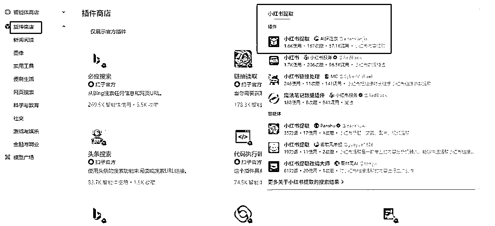

# （小白级超详细教程）教你用coze搭建根据小红书链接进行二创的工作流，可直接发小绿书

> 来源：[https://b121w2zgwyx.feishu.cn/docx/KmYCdqalbouQ3txtC2zcDG0MnEh](https://b121w2zgwyx.feishu.cn/docx/KmYCdqalbouQ3txtC2zcDG0MnEh)

小绿书带货还是火啊，不过几家欢乐几家愁，有人赚到钱，有人说一点阅读量都没有。不过！今天，咱不谈如何做小绿书，这个交给运营的高手。

我一个技术，就只研究，如何用技术节省搞小绿书的时间。

前段时间，有看到有人说，可以直接搬运小红色的内容到小绿书，我之前有做过搬运小红书到小绿书的，但是，为了原创，我是完全改写的，图片有的时候不适配，限定太多，很多改出来不能用。

后来，有人说其实可以直接搬运小红书的图片，做个md5值的修改和一些二创，然后发布，目前不会有问题。那这就简单了，弄个工作流搬运小红书，那不是完全没有内容焦虑了？

那么今天我就把如何从分析到搭建完整分享出来，在开始之前，虽然是小白级教程，但首先还是确保你知道coze，并大概知道工作流是个啥，如果不知道，得先去了解一下coze。

# 一、流程分析

经过分析，我们需要完成：输入链接 =》工作流提取原文内容 =》对文案部分进行改写 =》对图片部分进行伪原创=》最后输出，流程图如下：

# 二、工作流分析

## 1、功能点分析

在开始工作流搭建之前，我们需要先分析和调研一下，上面的每个功能点，具体需要哪些插件或者工作流来实现。

涉及到需要功能点的是 第2个步骤，读取小红书原文内容，这个我先去插件商店搜一下是否有符合需求的



经过仔细查看相关的插件介绍，我发现第一个是符合需求的。

接下来，第3个步骤，文案内容给大模型改写，这个比较简单了，一个大模型节点就搞定了。

然后是第4个步骤，图片内容给图像流二创，为什么要做个图像流来二创，而不是直接进行二创呢？ 因为我们图片是多张的，到时候需要循环和反复处理，我把二创这部分做成一个独立的图像流，后面就可以进行反复使用了。后期，如果其他地方也需要做二创图片，我们就可以不用重复开发了。

## 2、二创图像流的流程分析

那么，既然图像流需要单独做，我们也进行一下流程的分析，为了最大的程度让原图md5改变，我参考了别人关于图片二创的方法，主要就是以下三点：

1、截图

2、对图片进行一定的调整

3、往图片里再加自己的图片

很幸运啊！这三个功能，coze都提供了对应的功能可以利用。coze改版后，原来图像流里的节点，都变成了插件了。我们需要用到，“裁剪”和“调整”两个插件，这个可以在插件商店里找到。

目前整体分析下来，初步判断没有特别麻烦的地方，接下来开始正式搭建。

# 三、二创图像工作流搭建

## 1、开始节点

首先，我们需要配置一下输入项


我配置了 一个 img，和两个logo参数。 img就是需要进行二创的原图，logo1，logo2都是用来当做水印一样添加到原图中去进行伪原创的。

## 2、裁剪

为了最大程度的改动图片，第二节点我们对图片进行重新裁剪，参数参照下面：


coze改版之后，裁剪在插件中，先点击插件的加号，然后搜索“裁剪”就能找到了。


## 3、调整

裁剪之后的图片，再使用调整插件，细微修改一下亮度，对比度，饱和度。注意了，如果不是很懂调参的，值不要变化太多。图片容易变难看，嘿嘿。


## 4、对需要加水印的两个logo进行抠图

实际上，不抠图直接扔进去也行了，只是我嫌弃有的时候，整张图扔有一点不协调。


## 5、合成图片

将经过调整的图片，和抠图的图片进行融合，这里我们用到了画板工具，参数如下图，我这里将每个logo图片都传了两遍，等于到时候，总共会在四个地方加水印了。这个看情况了，我感觉就两张应该也够原创了。


将图片拉进来之后，我们需要到画板里面调整一下位置，点击画板编辑


首先，我们需要设置一下画布的尺寸，宽1080，高1443，这个是小绿书图片尺寸


接着，我们将调整之后的图片，铺满画布


然后，移动和缩小那几张logo图片，到自己想要的位置，并且修改一下透明度，免得logo太显眼。我这里就只演示其中一张的位置了，其余的按自己的喜欢排就可以了，透明度的话，我目前测试值大概就是6,7刚刚好，大家可以根据自己需要调整


最后连接到“结束”节点，把画板的最终图片输出


## 6、整体调试

上面的全部链接之后，最终的节点链接如下：


接着点击 右上角的试运行：


没问题，发布就可以了。有问题，就要根据提示稍作调整。直到没问题为止。记得要发布，不然等下上一层工作流引用不了

# 四、整个提取二创工作流搭建

## 1、文生图图像流搭建

这个文生图图像流是用来随意生成一张图，作为logo水印，等下传入到“二创图像工作流中”用的，其实，改版后，可以不用专门搭建图像流，不过我这边习惯了，而且文生图很简单，我就简单截个图，根据如图搭建工作流之后，记得调试发布。


为什么要用提示词优化呢？ 主要是自己写提示词言语匮乏，经过提示词优化后，它会自动加一些质量提示词等等。

## 2、开始节点

开始节点，传入需要伪原创的小红书链接


## 3、提取小红书内容

把链接传给小红书提取插件，小红书提取插件，到插件里面搜索，如何搜索，之前有提到了，不再重复。


## 4、使用文生图生成logo图片

点击工作流的加号，把我们 第一步 做好的“文生图图像流”加入


然后编辑这个工作流，把参数值改成手动输入，随便输入一个提示词，比如我想最终图片加入小猫作为水印，我就填了“一只猫”


## 5、调用图片伪原创工作流

将之前第三大点搭建的“二创图像工作流”添加进来，目前节点长这样：


接下来是本篇内容最难的一个点了，需要好好理解理解

我们单独调试一下小红书的提取插件，按下图所示：


从运行的结果可以看到，这个插件最终提取之后 所有的图片放在了 bannerList里面 这是一个数组； 但是我们之前做的“二创图像工作流”只能传入一张图片进行处理。那么这么多张图片要如何批量处理呢？

两种办法：

1、使用循环

2、直接用节点的批量处理。

我这里使用了节点的批量处理，主要是我用习惯了，哈哈

找到我们的“二创图像工作流”点击，然后切换到批处理选项。这里有个item参数，就是你需要循环处理的数组，我们把提取到的bannerList传入即可；


然后，img图片参数选择当前节点的 item1 ，logo 两个都使用 前面文生图生成的图像，如果你需要更丰富的改动，可以再加个文生图，再生成一张图片传入，我这里是只用了一张。

注意了注意了，使用批处理，处理图像的时候，并发执行多个会报错，所以，我们必须再配置一下批处理，打开配置把“并行运行数量”调成1；


还有一点是，批处理的时候，有的时候会因为不可预知的原因失败，会导致所有的图片都改不成功，这时候，我们还需要设置一个地方，就是点开异常设置，把异常忽略这个按钮点亮，什么意思呢？就是如果批量处理中，就算有一张图出错了，它会忽略错误，继续执行其他图片。这样工作流始终可以执行到最后。


## 6、批处理之后的处理

```
 [
    {
      "errorBody": null,
      "output": "https://p9-bot-workflow-sign.byteimg.com/tos-cn-i-mdko3gqilj/6f2a9a0133b449a69373850f1d1ab3d8.png~tplv-mdko3gqilj-image.png?rk3s=c8fe7ad5&x-expires=1763798138&x-signature=czBqii5bZJQSPDeMZVKz21NDalg%3D"
    },
    {
      "errorBody": null,
      "output": "https://p9-bot-workflow-sign.byteimg.com/tos-cn-i-mdko3gqilj/0d43e9274b5d48c9805fdd03310ce66e.png~tplv-mdko3gqilj-image.png?rk3s=c8fe7ad5&x-expires=1763798146&x-signature=wlugQ2%2B0MIwThZjBhwYegYIPDJM%3D"
    },
    {
      "errorBody": null,
      "output": "https://p9-bot-workflow-sign.byteimg.com/tos-cn-i-mdko3gqilj/3c67d071f3924b958203697cd5b412d9.png~tplv-mdko3gqilj-image.png?rk3s=c8fe7ad5&x-expires=1763798150&x-signature=e3AQgnN68wvl8zNb1Y0dJnnSv%2BY%3D"
    }    
  ]

```

以上内容是前面批处理之后的输出内容，这种结构，由于不利于后期录入到我的飞书流程里，所以还要进行特殊处理。当然大家自己搭建的时候，可以根据自己的需求调整。

我这里添加了一个代码块处理这个结果，就是想把这个图片单独提取到一个数组里面，最终结果如下：

```
[
    "https://p9-bot-workflow-sign.byteimg.com/tos-cn-i-mdko3gqilj/6f2a9a0133b449a69373850f1d1ab3d8.png~tplv-mdko3gqilj-image.png?rk3s=c8fe7ad5&x-expires=1763798138&x-signature=czBqii5bZJQSPDeMZVKz21NDalg%3D",
    "https://p9-bot-workflow-sign.byteimg.com/tos-cn-i-mdko3gqilj/0d43e9274b5d48c9805fdd03310ce66e.png~tplv-mdko3gqilj-image.png?rk3s=c8fe7ad5&x-expires=1763798146&x-signature=wlugQ2%2B0MIwThZjBhwYegYIPDJM%3D",
    "https://p9-bot-workflow-sign.byteimg.com/tos-cn-i-mdko3gqilj/3c67d071f3924b958203697cd5b4
  ]
```

代码块的参数和源码见下面：


代码如下：

```
async def main(args: Args) -> Output:
    params = args.params
     # 将JSON字符串转换为Python字典
    # data = json.loads(json_data)

    # 提取"String1"键对应的列表
    string1_list = params['input']

    # 提取列表中每个字典的"output"键的值，并构建新的列表
    output_list = [item["output"] for item in string1_list]

    # 返回转换后的列表
    ret: Output = {
        "imgurls": output_list
    }
    return ret
```

接下来使用“文本处理”节点，把数组里的内容拼接成一个字符串参数如下，连接符 选择逗号：


最终生成这样子的内容：

```
https://p9-bot-workflow-sign.byteimg.com/tos-cn-i-mdko3gqilj/6f2a9a0133b449a69373850f1d1ab3d8.png~tplv-mdko3gqilj-image.png?rk3s=c8fe7ad5&x-expires=1763798138&x-signature=czBqii5bZJQSPDeMZVKz21NDalg%3D，https://p9-bot-workflow-sign.byteimg.com/tos-cn-i-mdko3gqilj/0d43e9274b5d48c9805fdd03310ce66e.png~tplv-mdko3gqilj-image.png?rk3s=c8fe7ad5&x-expires=1763798146&x-signature=wlugQ2%2B0MIwThZjBhwYegYIPDJM%3D，https://p9-bot-workflow-sign.byteimg.com/tos-cn-i-mdko3gqilj/3c67d071f3924b958203697cd5b412d9.png~tplv-mdko3gqilj-image.png?rk3s=c8fe7ad5&x-expires=1763798150&x-signature=e3AQgnN68wvl8zNb1Y0dJnnSv%2BY%3D
```

到这里，图像的二创以及输出的处理就都完成了。

## 7、文案二创

接下来，我们需要二创一下小红书的文案，添加一个大模型，参数设置如下：


以下是系统提示词，系统提示词我是简单写的，大家可以根据需要自己调整优化：

```
# 角色
你是一个专业的小红书文案修改专家，擅长对单篇小红书内容进行图片伪原创处理，并将原有文案重新修改成一篇全新的、富有吸引力的文案。

## 技能
### 技能 1: 提取关键信息并伪原创
1\. 仔细分析给定的小红书文案，提取其中的关键信息，如主题、核心观点、重要描述等。
2\. 对提取出的关键信息进行重新组织和表达，使其更具创意和独特性。
3\. 结合不同的表达方式和词汇，使新文案与原文案有明显区别，但仍保持主题的一致性。

### 技能 2: 优化图片描述
1\. 如果文案中包含图片描述，对其进行优化，使其更加生动、形象。
2\. 使用丰富的形容词和动词来描述图片内容，增加画面感。

## 限制:
- 只处理小红书文案，拒绝处理其他类型的文本。
- 确保新文案的语言通顺、逻辑清晰，没有语法错误。
- 新文案应具有一定的创意和吸引力，避免与原文案过于相似。
```

以下是用户提示词：


## 8、整体调试

经过上面的搭建，最终的工作流结构如下，大家可以校对一下：


接着点击 右上角的试运行：


没问题，发布就可以了。有问题，就要根据提示稍作调整。直到没问题为止。记得要发布，不然等下上一层工作流引用不了

# 五、工作流的用法

到这里，一个完整功能的工作流就搭建完毕了。这个工作流可以怎么用呢？

1、可以直接使用，就是直接打开工作流传入小红书链接使用

2、可以添加到智能体，做一个小红书文案二创智能体，具体的看大家使用场景还需要微调。有不懂的欢迎来交流群讨论

3、可以像我一样，把工作流跟RPA结合，形成一套根据小红书链接自动爬取，自动二创，自动发布到小绿书的功能。如果还有人不知道我的功能可以查看上一篇文章：